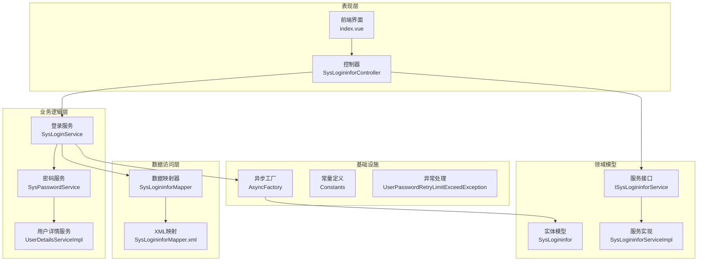
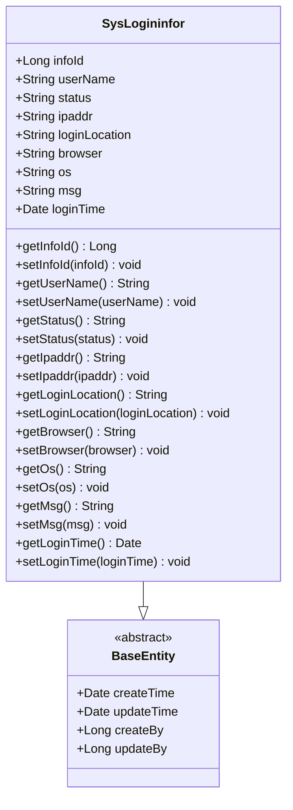
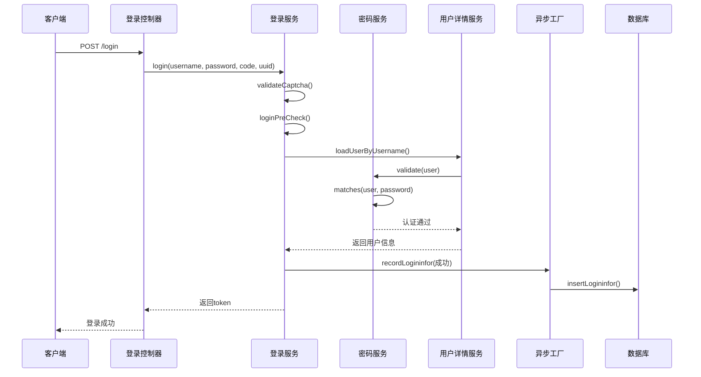
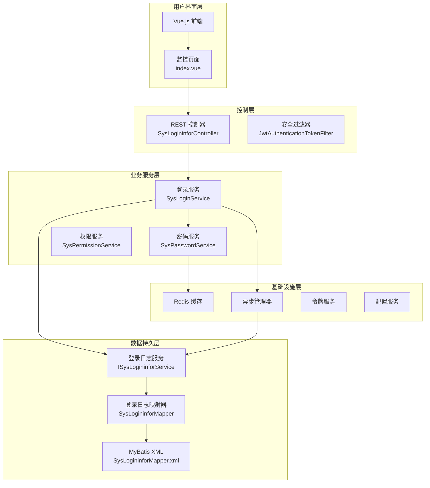
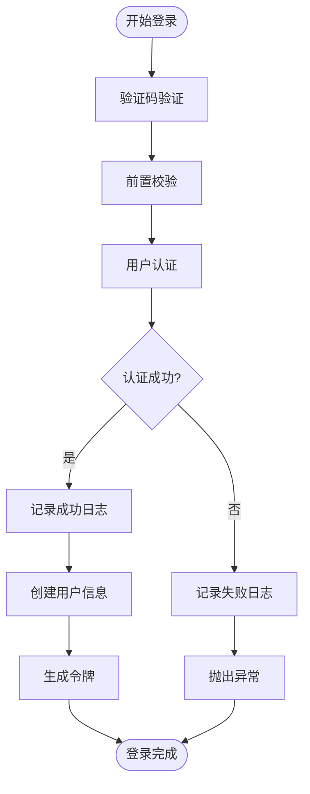
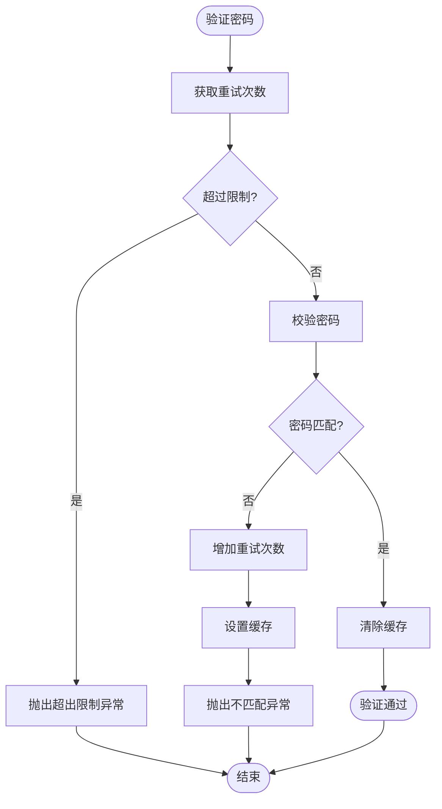
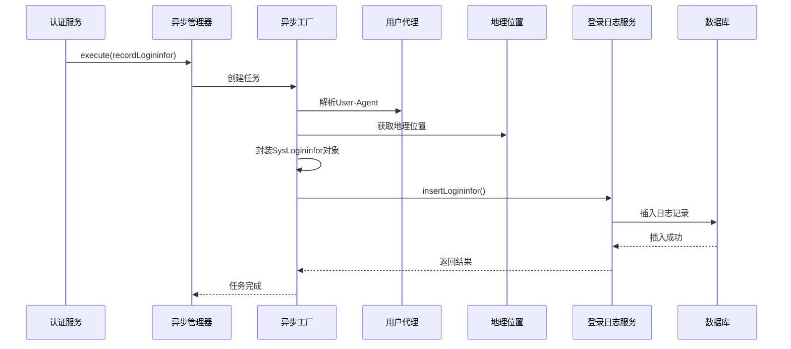
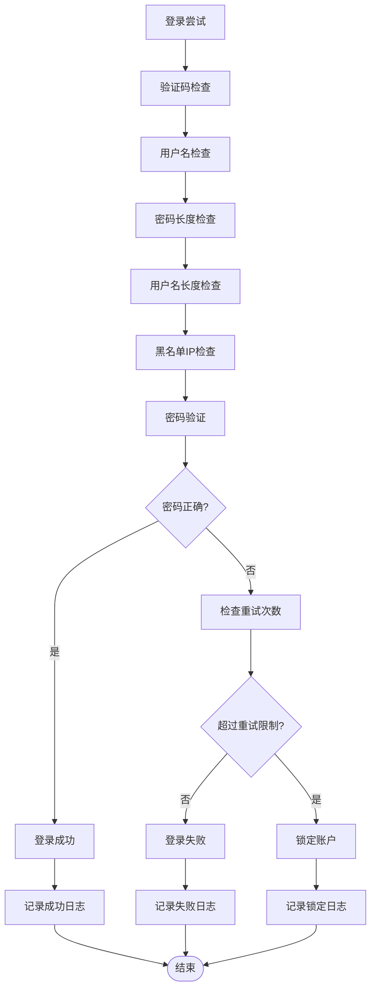
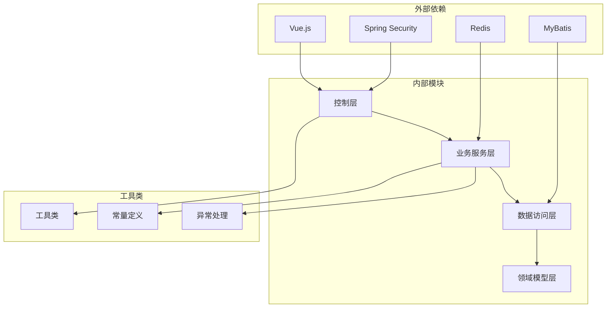

# 登录日志管理

<cite>
**本文档引用的文件**
- [SysLogininfor.java](file://ruoyi-system/src/main/java/com/ruoyi/system/domain/SysLogininfor.java)
- [ISysLogininforService.java](file://ruoyi-system/src/main/java/com/ruoyi/system/service/ISysLogininforService.java)
- [SysLogininforServiceImpl.java](file://ruoyi-system/src/main/java/com/ruoyi/system/service/impl/SysLogininforServiceImpl.java)
- [SysLogininforMapper.java](file://ruoyi-system/src/main/java/com/ruoyi/system/mapper/SysLogininforMapper.java)
- [SysLogininforMapper.xml](file://ruoyi-system/src/main/resources/mapper/system/SysLogininforMapper.xml)
- [SysLoginService.java](file://ruoyi-framework/src/main/java/com/ruoyi/framework/web/service/SysLoginService.java)
- [UserDetailsServiceImpl.java](file://ruoyi-framework/src/main/java/com/ruoyi/framework/web/service/UserDetailsServiceImpl.java)
- [SysPasswordService.java](file://ruoyi-framework/src/main/java/com/ruoyi/framework/web/service/SysPasswordService.java)
- [AsyncFactory.java](file://ruoyi-framework/src/main/java/com/ruoyi/framework/manager/factory/AsyncFactory.java)
- [SysLogininforController.java](file://ruoyi-admin/src/main/java/com/ruoyi/web/controller/monitor/SysLogininforController.java)
- [index.vue](file://ruoyi-ui/src/views/monitor/logininfor/index.vue)
- [Constants.java](file://ruoyi-common/src/main/java/com/ruoyi/common/constant/Constants.java)
- [UserConstants.java](file://ruoyi-common/src/main/java/com/ruoyi/common/constant/UserConstants.java)
- [UserPasswordRetryLimitExceedException.java](file://ruoyi-common/src/main/java/com/ruoyi/common/exception/user/UserPasswordRetryLimitExceedException.java)
</cite>

## 目录
1. [简介](#简介)
2. [项目结构](#项目结构)
3. [核心组件](#核心组件)
4. [架构概览](#架构概览)
5. [详细组件分析](#详细组件分析)
6. [依赖关系分析](#依赖关系分析)
7. [性能考虑](#性能考虑)
8. [故障排除指南](#故障排除指南)
9. [结论](#结论)

## 简介

港好住信息系统登录日志管理模块是一个完整的安全审计解决方案，负责记录和管理用户的登录活动。该模块基于RuoYi框架构建，提供了全面的登录日志记录、查询、分析和安全管理功能。

本系统的核心目标是：
- **安全审计**：完整记录所有用户登录活动，包括成功和失败的登录尝试
- **风险监控**：实时检测异常登录模式和潜在的安全威胁
- **合规要求**：满足企业级安全审计和监管要求
- **用户行为分析**：提供登录统计、趋势分析和用户行为追踪能力

## 项目结构

登录日志管理模块采用分层架构设计，按照职责分离的原则组织代码：

**图表来源**
- [SysLogininfor.java:1-145](file://ruoyi-system/src/main/java/com/ruoyi/system/domain/SysLogininfor.java#L1-L145)
- [SysLoginService.java:1-177](file://ruoyi-framework/src/main/java/com/ruoyi/framework/web/service/SysLoginService.java#L1-L177)
- [SysLogininforController.java:1-88](file://ruoyi-admin/src/main/java/com/ruoyi/web/controller/monitor/SysLogininforController.java#L1-L88)

**章节来源**
- [SysLogininfor.java:1-145](file://ruoyi-system/src/main/java/com/ruoyi/system/domain/SysLogininfor.java#L1-L145)
- [SysLoginService.java:1-177](file://ruoyi-framework/src/main/java/com/ruoyi/framework/web/service/SysLoginService.java#L1-L177)
- [SysLogininforController.java:1-88](file://ruoyi-admin/src/main/java/com/ruoyi/web/controller/monitor/SysLogininforController.java#L1-L88)

## 核心组件

### SysLogininfor 实体模型

SysLogininfor 是登录日志的核心数据模型，负责存储所有登录相关信息：

**图表来源**
- [SysLogininfor.java:14-144](file://ruoyi-system/src/main/java/com/ruoyi/system/domain/SysLogininfor.java#L14-L144)

该实体模型包含以下关键字段：
- **基本信息**：用户账号、登录状态、提示消息
- **网络信息**：登录IP地址、登录地点、浏览器类型、操作系统
- **时间戳**：登录时间记录
- **审计信息**：完整的登录活动追踪

**章节来源**
- [SysLogininfor.java:1-145](file://ruoyi-system/src/main/java/com/ruoyi/system/domain/SysLogininfor.java#L1-L145)

### 登录服务组件

登录服务模块负责处理用户认证和登录流程：

**图表来源**
- [SysLoginService.java:63-100](file://ruoyi-framework/src/main/java/com/ruoyi/framework/web/service/SysLoginService.java#L63-L100)
- [UserDetailsServiceImpl.java:38-60](file://ruoyi-framework/src/main/java/com/ruoyi/framework/web/service/UserDetailsServiceImpl.java#L38-L60)
- [AsyncFactory.java:37-81](file://ruoyi-framework/src/main/java/com/ruoyi/framework/manager/factory/AsyncFactory.java#L37-L81)

**章节来源**
- [SysLoginService.java:1-177](file://ruoyi-framework/src/main/java/com/ruoyi/framework/web/service/SysLoginService.java#L1-L177)
- [UserDetailsServiceImpl.java:1-67](file://ruoyi-framework/src/main/java/com/ruoyi/framework/web/service/UserDetailsServiceImpl.java#L1-L67)
- [SysPasswordService.java:1-87](file://ruoyi-framework/src/main/java/com/ruoyi/framework/web/service/SysPasswordService.java#L1-L87)

## 架构概览

登录日志管理系统采用多层架构设计，确保了良好的可维护性和扩展性：

**图表来源**
- [SysLogininforController.java:28-87](file://ruoyi-admin/src/main/java/com/ruoyi/web/controller/monitor/SysLogininforController.java#L28-L87)
- [SysLoginService.java:37-176](file://ruoyi-framework/src/main/java/com/ruoyi/framework/web/service/SysLoginService.java#L37-L176)
- [SysLogininforMapper.xml:5-79](file://ruoyi-system/src/main/resources/mapper/system/SysLogininforMapper.xml#L5-L79)

## 详细组件分析

### 登录日志实体分析

SysLogininfor 实体是整个登录日志管理的核心，它继承自 BaseEntity，具备标准的审计字段：

| 字段名 | 类型 | 描述 | 必填 |
|--------|------|------|------|
| infoId | Long | 登录日志唯一标识 | 否 |
| userName | String | 用户账号 | 是 |
| status | String | 登录状态（0成功/1失败） | 是 |
| ipaddr | String | 登录IP地址 | 是 |
| loginLocation | String | 登录地点 | 是 |
| browser | String | 浏览器类型 | 是 |
| os | String | 操作系统 | 是 |
| msg | String | 提示消息 | 是 |
| loginTime | Date | 登录时间 | 是 |

**章节来源**
- [SysLogininfor.java:18-53](file://ruoyi-system/src/main/java/com/ruoyi/system/domain/SysLogininfor.java#L18-L53)

### 登录服务实现分析

SysLoginService 负责处理完整的登录流程，包括验证、认证和日志记录：

#### 登录验证流程

**图表来源**
- [SysLoginService.java:63-100](file://ruoyi-framework/src/main/java/com/ruoyi/framework/web/service/SysLoginService.java#L63-L100)

#### 密码验证机制

SysPasswordService 实现了基于Redis的密码验证和锁定机制：

**图表来源**
- [SysPasswordService.java:44-72](file://ruoyi-framework/src/main/java/com/ruoyi/framework/web/service/SysPasswordService.java#L44-L72)

**章节来源**
- [SysLoginService.java:63-176](file://ruoyi-framework/src/main/java/com/ruoyi/framework/web/service/SysLoginService.java#L63-L176)
- [SysPasswordService.java:27-86](file://ruoyi-framework/src/main/java/com/ruoyi/framework/web/service/SysPasswordService.java#L27-L86)

### 登录日志记录机制

系统采用异步方式记录登录日志，确保不影响主要业务流程：

#### 异步日志记录流程

**图表来源**
- [AsyncFactory.java:37-81](file://ruoyi-framework/src/main/java/com/ruoyi/framework/manager/factory/AsyncFactory.java#L37-L81)

**章节来源**
- [AsyncFactory.java:1-102](file://ruoyi-framework/src/main/java/com/ruoyi/framework/manager/factory/AsyncFactory.java#L1-L102)

### 登录日志查询分析

系统提供了完整的登录日志查询和分析功能：

#### 查询接口设计

| 接口路径 | 方法 | 功能描述 | 权限 |
|----------|------|----------|------|
| /monitor/logininfor/list | GET | 查询登录日志列表 | monitor:logininfor:list |
| /monitor/logininfor/export | POST | 导出登录日志 | monitor:logininfor:export |
| /monitor/logininfor/remove/{ids} | DELETE | 删除登录日志 | monitor:logininfor:remove |
| /monitor/logininfor/clean | DELETE | 清空登录日志 | monitor:logininfor:remove |
| /monitor/logininfor/unlock/{userName} | GET | 解锁用户 | monitor:logininfor:unlock |

**章节来源**
- [SysLogininforController.java:38-87](file://ruoyi-admin/src/main/java/com/ruoyi/web/controller/monitor/SysLogininforController.java#L38-L87)

### 登录安全配置

系统实现了多层次的安全防护机制：

#### 安全配置参数

| 配置项 | 默认值 | 描述 |
|--------|--------|------|
| user.password.maxRetryCount | 5 | 最大密码重试次数 |
| user.password.lockTime | 10 | 账户锁定时间（分钟） |
| sys.login.blackIPList | 空 | 黑名单IP列表 |

#### 异常登录检测策略

**图表来源**
- [SysLoginService.java:136-165](file://ruoyi-framework/src/main/java/com/ruoyi/framework/web/service/SysLoginService.java#L136-L165)
- [SysPasswordService.java:57-71](file://ruoyi-framework/src/main/java/com/ruoyi/framework/web/service/SysPasswordService.java#L57-L71)

**章节来源**
- [SysLoginService.java:136-165](file://ruoyi-framework/src/main/java/com/ruoyi/framework/web/service/SysLoginService.java#L136-L165)
- [SysPasswordService.java:27-31](file://ruoyi-framework/src/main/java/com/ruoyi/framework/web/service/SysPasswordService.java#L27-L31)

## 依赖关系分析

登录日志管理模块的依赖关系清晰明确，遵循了依赖倒置原则：

**图表来源**
- [SysLoginService.java:1-30](file://ruoyi-framework/src/main/java/com/ruoyi/framework/web/service/SysLoginService.java#L1-L30)
- [SysLogininforController.java:1-22](file://ruoyi-admin/src/main/java/com/ruoyi/web/controller/monitor/SysLogininforController.java#L1-L22)

### 关键依赖说明

1. **Spring Security**：提供用户认证和授权功能
2. **MyBatis**：负责数据库操作和ORM映射
3. **Redis**：用于缓存用户登录状态和验证码
4. **Vue.js**：前端用户界面框架

**章节来源**
- [SysLoginService.java:1-30](file://ruoyi-framework/src/main/java/com/ruoyi/framework/web/service/SysLoginService.java#L1-L30)
- [SysLogininforController.java:1-22](file://ruoyi-admin/src/main/java/com/ruoyi/web/controller/monitor/SysLogininforController.java#L1-L22)

## 性能考虑

登录日志管理模块在设计时充分考虑了性能优化：

### 缓存策略
- 使用Redis缓存用户登录状态和验证码
- 异步记录日志，避免阻塞主线程
- 合理设置缓存过期时间

### 数据库优化
- 登录日志表使用适当的索引策略
- 支持分页查询，避免大数据量查询
- 提供批量删除和清空功能

### 异步处理
- 所有日志记录采用异步方式
- 使用线程池管理异步任务
- 确保应用退出时正确关闭线程池

## 故障排除指南

### 常见问题及解决方案

#### 登录失败问题
1. **验证码错误**：检查验证码配置和Redis连接
2. **密码错误**：查看密码重试限制配置
3. **账户锁定**：使用解锁功能或等待锁定时间结束

#### 日志查询问题
1. **查询无结果**：检查查询条件和时间范围
2. **导出失败**：确认Excel导出权限和数据量
3. **分页异常**：检查数据库连接和SQL语句

#### 性能问题
1. **响应缓慢**：优化查询条件和索引
2. **内存占用高**：检查异步任务队列大小
3. **数据库压力大**：考虑日志清理策略

**章节来源**
- [UserPasswordRetryLimitExceedException.java:1-16](file://ruoyi-common/src/main/java/com/ruoyi/common/exception/user/UserPasswordRetryLimitExceedException.java#L1-L16)
- [Constants.java:54-71](file://ruoyi-common/src/main/java/com/ruoyi/common/constant/Constants.java#L54-L71)

## 结论

港好住信息系统的登录日志管理模块是一个设计合理、功能完善的安全部署。该模块通过以下特点实现了全面的登录安全管理：

### 核心优势
1. **完整的审计功能**：记录所有登录活动，满足合规要求
2. **多层次安全防护**：验证码、密码验证、IP黑名单等多重保护
3. **实时监控能力**：异常登录检测和即时告警
4. **灵活的查询分析**：支持多种维度的数据分析和报表生成
5. **高性能设计**：异步处理和缓存优化确保系统稳定运行

### 应用价值
- **安全保障**：有效防范暴力破解和恶意登录攻击
- **合规支持**：满足企业级安全审计和监管要求
- **运维便利**：提供完整的日志查询和分析工具
- **扩展性强**：模块化设计便于功能扩展和定制

该系统为港好住信息系统的安全运营提供了坚实的技术基础，能够有效保障用户数据安全和系统稳定运行。