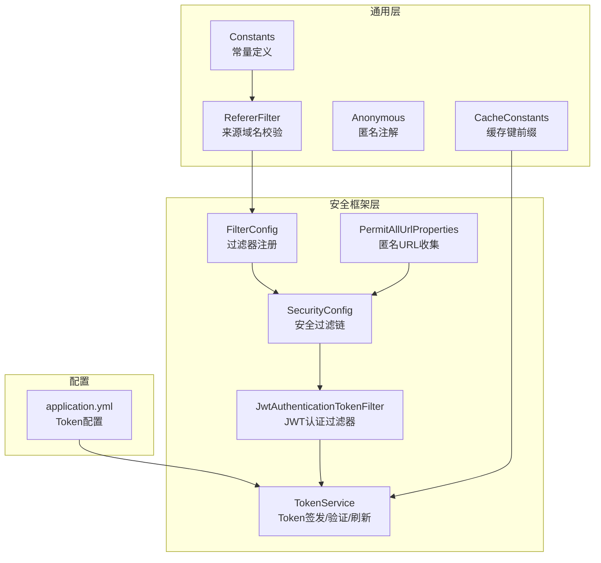
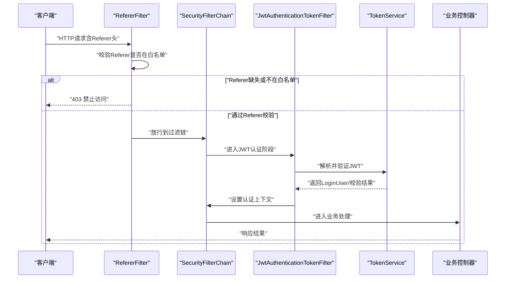
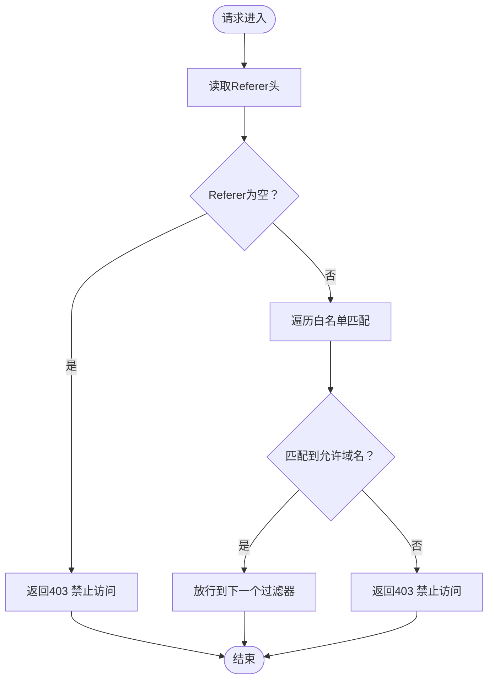
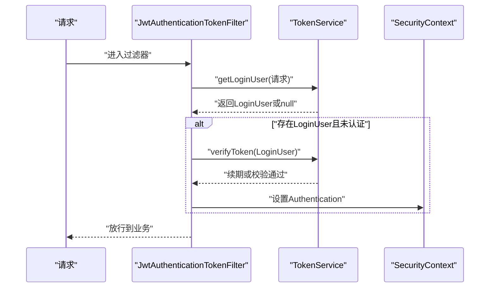
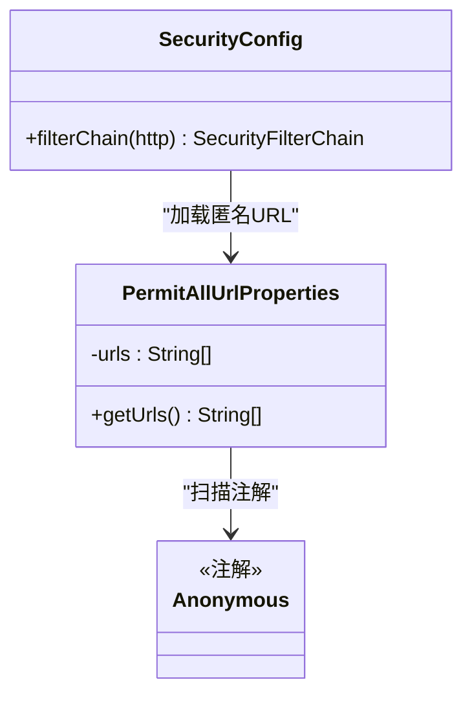
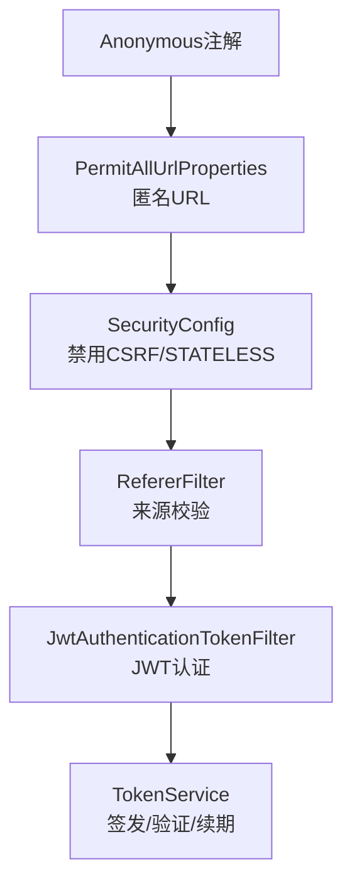
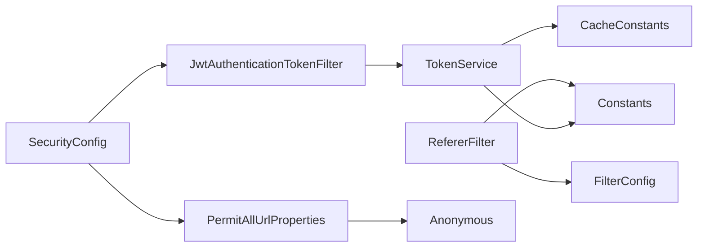

# CSRF攻击防护

<cite>
**本文引用的文件**   
- [RefererFilter.java](file://ruoyi-common/src/main/java/com/ruoyi/common/filter/RefererFilter.java)
- [FilterConfig.java](file://ruoyi-framework/src/main/java/com/ruoyi/framework/config/FilterConfig.java)
- [SecurityConfig.java](file://ruoyi-framework/src/main/java/com/ruoyi/framework/config/SecurityConfig.java)
- [JwtAuthenticationTokenFilter.java](file://ruoyi-framework/src/main/java/com/ruoyi/framework/security/filter/JwtAuthenticationTokenFilter.java)
- [TokenService.java](file://ruoyi-framework/src/main/java/com/ruoyi/framework/web/service/TokenService.java)
- [Anonymous.java](file://ruoyi-common/src/main/java/com/ruoyi/common/annotation/Anonymous.java)
- [PermitAllUrlProperties.java](file://ruoyi-framework/src/main/java/com/ruoyi/framework/config/properties/PermitAllUrlProperties.java)
- [Constants.java](file://ruoyi-common/src/main/java/com/ruoyi/common/constant/Constants.java)
- [CacheConstants.java](file://ruoyi-common/src/main/java/com/ruoyi/common/constant/CacheConstants.java)
- [application.yml](file://ruoyi-admin/src/main/resources/application.yml)
</cite>

## 目录
1. [简介](#简介)
2. [项目结构](#项目结构)
3. [核心组件](#核心组件)
4. [架构总览](#架构总览)
5. [组件详解](#组件详解)
6. [依赖关系分析](#依赖关系分析)
7. [性能与安全特性](#性能与安全特性)
8. [故障排查指南](#故障排查指南)
9. [结论](#结论)
10. [附录](#附录)

## 简介
本文件聚焦港好住信息系统中的CSRF攻击防护机制，围绕以下关键点展开：
- Referer过滤器的来源域名验证、跨站请求识别与非法请求拦截能力
- JWT认证过滤器在CSRF防护中的作用：Token验证、请求签名、会话管理等安全策略
- 匿名访问注解Anonymous的使用场景与安全边界设置
- 整体CSRF防护架构：Token生成与验证、请求校验流程、防护策略配置
- 提供CSRF攻击模拟测试思路、防护效果验证方法与安全配置最佳实践

## 项目结构
CSRF防护相关代码主要分布在如下模块：
- 通用过滤器与注解：ruoyi-common（RefererFilter、Anonymous注解等）
- 安全配置与过滤链：ruoyi-framework（FilterConfig、SecurityConfig、JwtAuthenticationTokenFilter、TokenService、PermitAllUrlProperties）
- 配置项：ruoyi-admin（application.yml）

**图表来源**
- [RefererFilter.java:1-77](file://ruoyi-common/src/main/java/com/ruoyi/common/filter/RefererFilter.java#L1-L77)
- [FilterConfig.java:1-80](file://ruoyi-framework/src/main/java/com/ruoyi/framework/config/FilterConfig.java#L1-L80)
- [SecurityConfig.java:1-134](file://ruoyi-framework/src/main/java/com/ruoyi/framework/config/SecurityConfig.java#L1-L134)
- [JwtAuthenticationTokenFilter.java:1-45](file://ruoyi-framework/src/main/java/com/ruoyi/framework/security/filter/JwtAuthenticationTokenFilter.java#L1-L45)
- [TokenService.java:1-233](file://ruoyi-framework/src/main/java/com/ruoyi/framework/web/service/TokenService.java#L1-L233)
- [PermitAllUrlProperties.java:1-74](file://ruoyi-framework/src/main/java/com/ruoyi/framework/config/properties/PermitAllUrlProperties.java#L1-L74)
- [Constants.java:1-174](file://ruoyi-common/src/main/java/com/ruoyi/common/constant/Constants.java#L1-L174)
- [CacheConstants.java:1-45](file://ruoyi-common/src/main/java/com/ruoyi/common/constant/CacheConstants.java#L1-L45)
- [application.yml:95-102](file://ruoyi-admin/src/main/resources/application.yml#L95-L102)

**章节来源**
- [FilterConfig.java:1-80](file://ruoyi-framework/src/main/java/com/ruoyi/framework/config/FilterConfig.java#L1-L80)
- [SecurityConfig.java:1-134](file://ruoyi-framework/src/main/java/com/ruoyi/framework/config/SecurityConfig.java#L1-L134)

## 核心组件
- Referer过滤器：基于请求头Referer进行来源域名白名单校验，未命中白名单或Referer缺失时直接拒绝请求
- JWT认证过滤器：从请求中提取并解析JWT，完成用户身份绑定与权限上下文注入；结合禁用CSRF策略，确保无状态会话下的安全
- Token服务：负责JWT签发、解析、有效期校验与自动续期、Redis缓存管理
- 匿名访问注解与URL收集：通过扫描控制器/方法上的Anonymous注解，动态构建允许匿名访问的URL集合，配合SecurityConfig统一放行
- 常量与缓存键：提供令牌前缀、资源路径前缀、登录用户缓存键等基础配置支撑

**章节来源**
- [RefererFilter.java:1-77](file://ruoyi-common/src/main/java/com/ruoyi/common/filter/RefererFilter.java#L1-L77)
- [JwtAuthenticationTokenFilter.java:1-45](file://ruoyi-framework/src/main/java/com/ruoyi/framework/security/filter/JwtAuthenticationTokenFilter.java#L1-L45)
- [TokenService.java:1-233](file://ruoyi-framework/src/main/java/com/ruoyi/framework/web/service/TokenService.java#L1-L233)
- [Anonymous.java:1-20](file://ruoyi-common/src/main/java/com/ruoyi/common/annotation/Anonymous.java#L1-L20)
- [PermitAllUrlProperties.java:1-74](file://ruoyi-framework/src/main/java/com/ruoyi/framework/config/properties/PermitAllUrlProperties.java#L1-L74)
- [Constants.java:1-174](file://ruoyi-common/src/main/java/com/ruoyi/common/constant/Constants.java#L1-L174)
- [CacheConstants.java:1-45](file://ruoyi-common/src/main/java/com/ruoyi/common/constant/CacheConstants.java#L1-L45)

## 架构总览
系统采用“无状态+来源校验”的组合策略抵御CSRF：
- 禁用传统CSRF防护（不使用session），改由JWT承载身份与权限
- 在请求进入业务处理前，先通过Referer过滤器进行来源域名校验
- 再通过JWT过滤器完成身份认证与权限注入
- 对部分公开接口（如登录、静态资源、H5/APP接口）通过Anonymous注解与URL收集统一放行

**图表来源**
- [RefererFilter.java:34-70](file://ruoyi-common/src/main/java/com/ruoyi/common/filter/RefererFilter.java#L34-L70)
- [SecurityConfig.java:85-124](file://ruoyi-framework/src/main/java/com/ruoyi/framework/config/SecurityConfig.java#L85-L124)
- [JwtAuthenticationTokenFilter.java:30-43](file://ruoyi-framework/src/main/java/com/ruoyi/framework/security/filter/JwtAuthenticationTokenFilter.java#L30-L43)
- [TokenService.java:62-83](file://ruoyi-framework/src/main/java/com/ruoyi/framework/web/service/TokenService.java#L62-L83)

## 组件详解

### Referer过滤器：来源域名验证与跨站识别
- 初始化：从过滤器初始化参数读取允许的域名列表，并按逗号拆分为白名单
- 请求处理：
  - 若Referer为空，直接返回禁止访问
  - 遍历白名单，若Referer包含任一域名则放行；否则返回禁止访问
- 生效范围：通过FilterConfig注册为最高优先级过滤器，对特定资源路径生效

**图表来源**
- [RefererFilter.java:34-70](file://ruoyi-common/src/main/java/com/ruoyi/common/filter/RefererFilter.java#L34-L70)
- [FilterConfig.java:51-66](file://ruoyi-framework/src/main/java/com/ruoyi/framework/config/FilterConfig.java#L51-L66)

**章节来源**
- [RefererFilter.java:1-77](file://ruoyi-common/src/main/java/com/ruoyi/common/filter/RefererFilter.java#L1-L77)
- [FilterConfig.java:31-66](file://ruoyi-framework/src/main/java/com/ruoyi/framework/config/FilterConfig.java#L31-L66)
- [Constants.java:138-141](file://ruoyi-common/src/main/java/com/ruoyi/common/constant/Constants.java#L138-L141)

### JWT认证过滤器：Token验证与会话管理
- 从请求头中提取令牌，去除前缀后解析
- 从Redis中根据令牌键获取LoginUser
- 若尚未建立认证上下文，则调用TokenService验证令牌有效期并在临界期内自动续期
- 将认证信息写入Spring Security上下文，后续业务可基于注解进行权限控制

**图表来源**
- [JwtAuthenticationTokenFilter.java:30-43](file://ruoyi-framework/src/main/java/com/ruoyi/framework/security/filter/JwtAuthenticationTokenFilter.java#L30-L43)
- [TokenService.java:62-83](file://ruoyi-framework/src/main/java/com/ruoyi/framework/web/service/TokenService.java#L62-L83)
- [TokenService.java:133-141](file://ruoyi-framework/src/main/java/com/ruoyi/framework/web/service/TokenService.java#L133-L141)

**章节来源**
- [JwtAuthenticationTokenFilter.java:1-45](file://ruoyi-framework/src/main/java/com/ruoyi/framework/security/filter/JwtAuthenticationTokenFilter.java#L1-L45)
- [TokenService.java:1-233](file://ruoyi-framework/src/main/java/com/ruoyi/framework/web/service/TokenService.java#L1-L233)

### 匿名访问注解与URL收集：临时访问控制与安全边界
- Anonymous注解用于标注无需鉴权即可访问的接口或控制器
- PermitAllUrlProperties在应用启动时扫描所有@RequestMapping，收集带Anonymous注解的URL并替换路径变量为通配符，形成允许匿名访问的URL集合
- SecurityConfig在构建过滤链时，先对这些URL执行permitAll，再对其他请求执行authenticated

**图表来源**
- [Anonymous.java:1-20](file://ruoyi-common/src/main/java/com/ruoyi/common/annotation/Anonymous.java#L1-L20)
- [PermitAllUrlProperties.java:26-74](file://ruoyi-framework/src/main/java/com/ruoyi/framework/config/properties/PermitAllUrlProperties.java#L26-L74)
- [SecurityConfig.java:99-115](file://ruoyi-framework/src/main/java/com/ruoyi/framework/config/SecurityConfig.java#L99-L115)

**章节来源**
- [Anonymous.java:1-20](file://ruoyi-common/src/main/java/com/ruoyi/common/annotation/Anonymous.java#L1-L20)
- [PermitAllUrlProperties.java:1-74](file://ruoyi-framework/src/main/java/com/ruoyi/framework/config/properties/PermitAllUrlProperties.java#L1-L74)
- [SecurityConfig.java:99-115](file://ruoyi-framework/src/main/java/com/ruoyi/framework/config/SecurityConfig.java#L99-L115)

### CSRF防护整体架构与策略
- 禁用CSRF：由于采用无状态JWT，SecurityConfig中显式禁用CSRF
- 禁用Session：使用STATELESS策略，避免会话劫持与CSRF关联
- 来源校验：RefererFilter作为首道防线，阻止来自不受信任来源的跨站请求
- 身份与权限：JWT过滤器完成身份绑定与权限注入，后续业务层通过注解进行细粒度授权
- 匿名放行：通过Anonymous注解与URL收集机制，精确控制公开接口范围

**图表来源**
- [SecurityConfig.java:88-98](file://ruoyi-framework/src/main/java/com/ruoyi/framework/config/SecurityConfig.java#L88-L98)
- [RefererFilter.java:34-70](file://ruoyi-common/src/main/java/com/ruoyi/common/filter/RefererFilter.java#L34-L70)
- [JwtAuthenticationTokenFilter.java:30-43](file://ruoyi-framework/src/main/java/com/ruoyi/framework/security/filter/JwtAuthenticationTokenFilter.java#L30-L43)
- [TokenService.java:133-141](file://ruoyi-framework/src/main/java/com/ruoyi/framework/web/service/TokenService.java#L133-L141)
- [PermitAllUrlProperties.java:37-56](file://ruoyi-framework/src/main/java/com/ruoyi/framework/config/properties/PermitAllUrlProperties.java#L37-L56)
- [Anonymous.java:14-19](file://ruoyi-common/src/main/java/com/ruoyi/common/annotation/Anonymous.java#L14-L19)

**章节来源**
- [SecurityConfig.java:85-124](file://ruoyi-framework/src/main/java/com/ruoyi/framework/config/SecurityConfig.java#L85-L124)

## 依赖关系分析
- RefererFilter依赖FilterConfig提供的allowedDomains参数与Constants中的资源路径前缀
- JwtAuthenticationTokenFilter依赖TokenService进行JWT解析与续期
- SecurityConfig依赖JwtAuthenticationTokenFilter、CorsFilter、PermitAllUrlProperties与AuthenticationEntryPointImpl
- PermitAllUrlProperties依赖Anonymous注解与RequestMappingHandlerMapping扫描注解
- TokenService依赖RedisCache、Constants与CacheConstants进行缓存键管理与签名算法

**图表来源**
- [RefererFilter.java:20-32](file://ruoyi-common/src/main/java/com/ruoyi/common/filter/RefererFilter.java#L20-L32)
- [FilterConfig.java:51-66](file://ruoyi-framework/src/main/java/com/ruoyi/framework/config/FilterConfig.java#L51-L66)
- [Constants.java:138-141](file://ruoyi-common/src/main/java/com/ruoyi/common/constant/Constants.java#L138-L141)
- [JwtAuthenticationTokenFilter.java:24-28](file://ruoyi-framework/src/main/java/com/ruoyi/framework/security/filter/JwtAuthenticationTokenFilter.java#L24-L28)
- [TokenService.java:32-55](file://ruoyi-framework/src/main/java/com/ruoyi/framework/web/service/TokenService.java#L32-L55)
- [CacheConstants.java:10-13](file://ruoyi-common/src/main/java/com/ruoyi/common/constant/CacheConstants.java#L10-L13)
- [SecurityConfig.java:43-59](file://ruoyi-framework/src/main/java/com/ruoyi/framework/config/SecurityConfig.java#L43-L59)
- [PermitAllUrlProperties.java:19-56](file://ruoyi-framework/src/main/java/com/ruoyi/framework/config/properties/PermitAllUrlProperties.java#L19-L56)
- [Anonymous.java:14-19](file://ruoyi-common/src/main/java/com/ruoyi/common/annotation/Anonymous.java#L14-L19)

**章节来源**
- [FilterConfig.java:1-80](file://ruoyi-framework/src/main/java/com/ruoyi/framework/config/FilterConfig.java#L1-L80)
- [SecurityConfig.java:1-134](file://ruoyi-framework/src/main/java/com/ruoyi/framework/config/SecurityConfig.java#L1-L134)

## 性能与安全特性
- 无状态设计：禁用CSRF与Session，降低服务器端状态维护成本，提升横向扩展性
- 高效续期：TokenService在临近过期时自动续期，减少频繁登录带来的用户体验与性能损耗
- 来源校验前置：RefererFilter以最高优先级拦截无效来源，减少无效请求进入业务层
- 精准匿名放行：通过注解扫描与URL收集，避免过度放行导致的安全风险

[本节为总体讨论，不直接分析具体文件]

## 故障排查指南
- Referer被拒
  - 现象：返回403，提示Referer缺失或不允许
  - 排查要点：确认请求头中是否包含Referer；确认Referer是否包含FilterConfig中配置的allowedDomains；确认FilterConfig已启用referer.enabled
  - 参考路径：[RefererFilter.java:43-69](file://ruoyi-common/src/main/java/com/ruoyi/common/filter/RefererFilter.java#L43-L69)、[FilterConfig.java:51-66](file://ruoyi-framework/src/main/java/com/ruoyi/framework/config/FilterConfig.java#L51-L66)
- JWT认证失败
  - 现象：请求无法绑定到认证上下文，后续权限注解失效
  - 排查要点：确认请求头Authorization携带的令牌格式与secret一致；确认Redis中存在对应登录用户缓存；确认TokenService的header与secret配置正确
  - 参考路径：[JwtAuthenticationTokenFilter.java:30-43](file://ruoyi-framework/src/main/java/com/ruoyi/framework/security/filter/JwtAuthenticationTokenFilter.java#L30-L43)、[TokenService.java:62-83](file://ruoyi-framework/src/main/java/com/ruoyi/framework/web/service/TokenService.java#L62-L83)、[application.yml:95-102](file://ruoyi-admin/src/main/resources/application.yml#L95-L102)
- 匿名接口仍需登录
  - 现象：带Anonymous注解的接口仍被要求登录
  - 排查要点：确认Anonymous注解是否正确放置在控制器或方法上；确认PermitAllUrlProperties已扫描到该URL；确认SecurityConfig中匿名URL列表已生效
  - 参考路径：[Anonymous.java:14-19](file://ruoyi-common/src/main/java/com/ruoyi/common/annotation/Anonymous.java#L14-L19)、[PermitAllUrlProperties.java:37-56](file://ruoyi-framework/src/main/java/com/ruoyi/framework/config/properties/PermitAllUrlProperties.java#L37-L56)、[SecurityConfig.java:99-115](file://ruoyi-framework/src/main/java/com/ruoyi/framework/config/SecurityConfig.java#L99-L115)

**章节来源**
- [RefererFilter.java:43-69](file://ruoyi-common/src/main/java/com/ruoyi/common/filter/RefererFilter.java#L43-L69)
- [FilterConfig.java:51-66](file://ruoyi-framework/src/main/java/com/ruoyi/framework/config/FilterConfig.java#L51-L66)
- [JwtAuthenticationTokenFilter.java:30-43](file://ruoyi-framework/src/main/java/com/ruoyi/framework/security/filter/JwtAuthenticationTokenFilter.java#L30-L43)
- [TokenService.java:62-83](file://ruoyi-framework/src/main/java/com/ruoyi/framework/web/service/TokenService.java#L62-L83)
- [application.yml:95-102](file://ruoyi-admin/src/main/resources/application.yml#L95-L102)
- [PermitAllUrlProperties.java:37-56](file://ruoyi-framework/src/main/java/com/ruoyi/framework/config/properties/PermitAllUrlProperties.java#L37-L56)
- [SecurityConfig.java:99-115](file://ruoyi-framework/src/main/java/com/ruoyi/framework/config/SecurityConfig.java#L99-L115)

## 结论
港好住信息系统通过“来源域名校验 + JWT无状态认证 + 明确的匿名放行策略”构建了面向CSRF的综合防护体系。RefererFilter承担首道防线，JWT过滤器确保身份可信，SecurityConfig统一编排过滤链与授权策略。该方案在保证安全性的同时兼顾性能与可维护性。

[本节为总结，不直接分析具体文件]

## 附录

### CSRF攻击模拟测试与防护验证建议
- 测试场景
  - 伪造来源：构造Referer不在allowedDomains中的请求，验证被403拦截
  - 无Referer请求：移除Referer头，验证被403拦截
  - 无效JWT：使用错误secret或过期令牌，验证无法通过JWT过滤器
  - 有效JWT：使用正确令牌，验证可正常进入业务层
  - 匿名接口：对带Anonymous注解的接口发起请求，验证无需登录
- 验证方法
  - 使用HTTP客户端工具发送请求并观察状态码与响应内容
  - 查看日志中TokenService的解析与续期行为
  - 校验Redis中登录用户缓存键是否存在与有效期
- 最佳实践
  - 明确配置allowedDomains，避免过于宽松
  - 严格管理token.secret，定期轮换
  - 仅对必要接口使用Anonymous注解，避免扩大攻击面
  - 对敏感操作增加二次校验（如短信/邮箱确认）以增强纵深防御

[本节为通用指导，不直接分析具体文件]