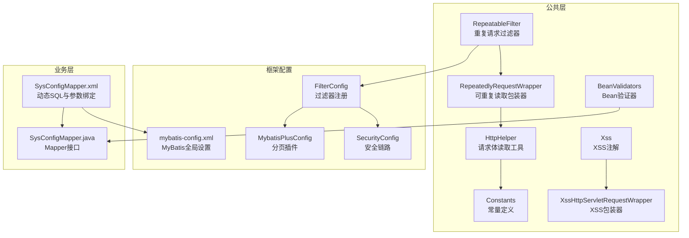
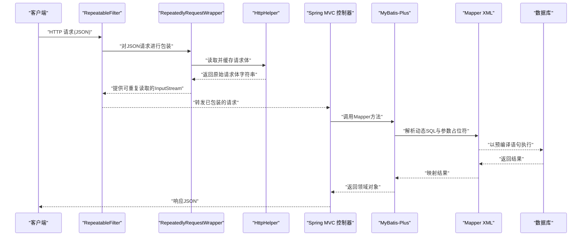
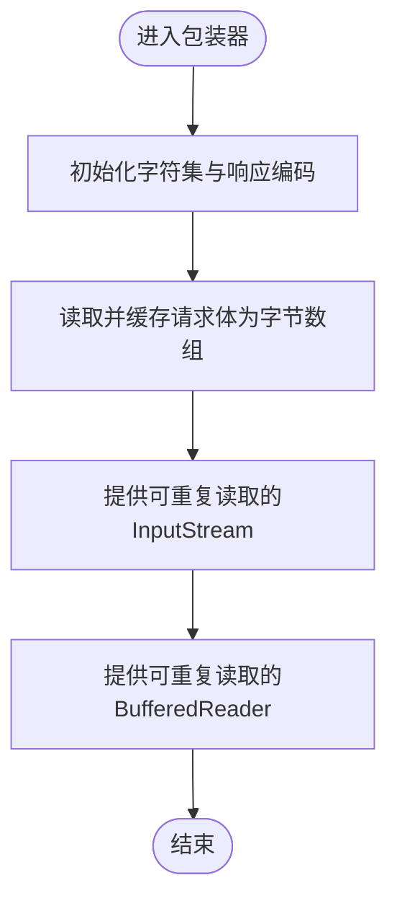
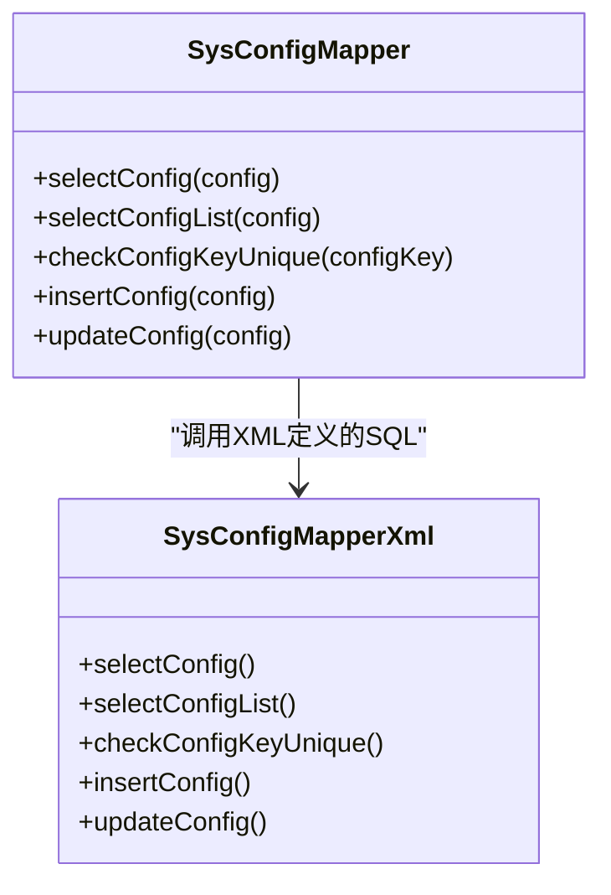
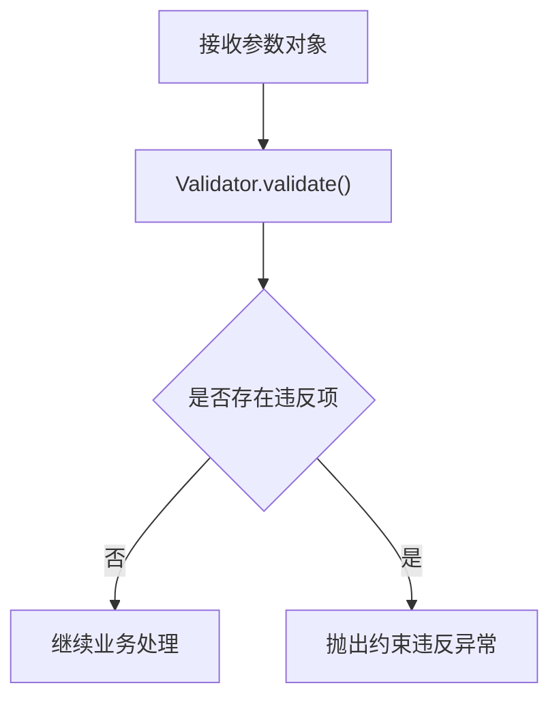
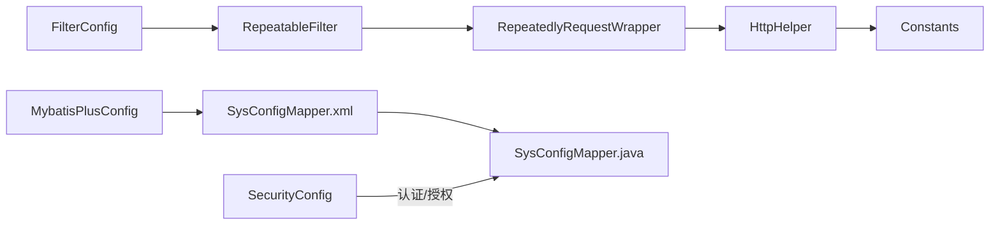

# SQL注入防护

<cite>
**本文引用的文件**
- [RepeatableFilter.java](file://ruoyi-common/src/main/java/com/ruoyi/common/filter/RepeatableFilter.java)
- [RepeatedlyRequestWrapper.java](file://ruoyi-common/src/main/java/com/ruoyi/common/filter/RepeatedlyRequestWrapper.java)
- [HttpHelper.java](file://ruoyi-common/src/main/java/com/ruoyi/common/utils/http/HttpHelper.java)
- [Constants.java](file://ruoyi-common/src/main/java/com/ruoyi/common/constant/Constants.java)
- [FilterConfig.java](file://ruoyi-framework/src/main/java/com/ruoyi/framework/config/FilterConfig.java)
- [MybatisPlusConfig.java](file://ruoyi-framework/src/main/java/com/ruoyi/framework/config/MybatisPlusConfig.java)
- [mybatis-config.xml](file://ruoyi-admin/src/main/resources/mybatis/mybatis-config.xml)
- [SysConfigMapper.xml](file://ruoyi-system/src/main/resources/mapper/system/SysConfigMapper.xml)
- [SysConfigMapper.java](file://ruoyi-system/src/main/java/com/ruoyi/system/mapper/SysConfigMapper.java)
- [BeanValidators.java](file://ruoyi-common/src/main/java/com/ruoyi/common/utils/bean/BeanValidators.java)
- [Xss.java](file://ruoyi-common/src/main/java/com/ruoyi/common/xss/Xss.java)
- [XssHttpServletRequestWrapper.java](file://ruoyi-common/src/main/java/com/ruoyi/common/filter/XssHttpServletRequestWrapper.java)
- [SecurityConfig.java](file://ruoyi-framework/src/main/java/com/ruoyi/framework/config/SecurityConfig.java)
- [application-druid.yml](file://ruoyi-admin/src/main/resources/application-druid.yml)
</cite>

## 目录
1. [简介](#简介)
2. [项目结构](#项目结构)
3. [核心组件](#核心组件)
4. [架构总览](#架构总览)
5. [组件详解](#组件详解)
6. [依赖关系分析](#依赖关系分析)
7. [性能考量](#性能考量)
8. [故障排查指南](#故障排查指南)
9. [结论](#结论)
10. [附录](#附录)

## 简介
本文件聚焦港好住信息系统中的SQL注入防护机制，围绕以下关键点展开：
- 重复请求过滤器与请求包装器：实现JSON请求体的重复读取、参数解析隔离、防止二次读取导致的数据丢失与安全风险。
- MyBatis-Plus配置与SQL安全：参数绑定、预编译语句使用、动态SQL安全处理策略。
- Bean验证器与XSS注解：输入验证、参数类型与长度约束、正则表达式与XSS过滤。
- 数据库访问层安全：SQL注入防护、存储过程调用规范、权限控制与连接池配置。

## 项目结构
系统采用多模块结构，安全相关能力主要分布在公共模块、框架配置与业务模块的Mapper层：
- 公共过滤与工具：重复请求过滤、请求体读取、常量定义、XSS过滤与Bean验证。
- 框架配置：过滤器注册、MyBatis-Plus分页插件、Spring Security安全链路。
- 业务Mapper：基于XML的动态SQL与参数绑定，配合框架配置确保预编译执行。

**图表来源**
- [RepeatableFilter.java:1-52](file://ruoyi-common/src/main/java/com/ruoyi/common/filter/RepeatableFilter.java#L1-L52)
- [RepeatedlyRequestWrapper.java:1-77](file://ruoyi-common/src/main/java/com/ruoyi/common/filter/RepeatedlyRequestWrapper.java#L1-L77)
- [HttpHelper.java:1-56](file://ruoyi-common/src/main/java/com/ruoyi/common/utils/http/HttpHelper.java#L1-L56)
- [Constants.java:1-174](file://ruoyi-common/src/main/java/com/ruoyi/common/constant/Constants.java#L1-L174)
- [FilterConfig.java:51-80](file://ruoyi-framework/src/main/java/com/ruoyi/framework/config/FilterConfig.java#L51-L80)
- [MybatisPlusConfig.java:1-28](file://ruoyi-framework/src/main/java/com/ruoyi/framework/config/MybatisPlusConfig.java#L1-L28)
- [mybatis-config.xml:1-20](file://ruoyi-admin/src/main/resources/mybatis/mybatis-config.xml#L1-L20)
- [SysConfigMapper.xml:1-138](file://ruoyi-system/src/main/resources/mapper/system/SysConfigMapper.xml#L1-L138)
- [SysConfigMapper.java:1-64](file://ruoyi-system/src/main/java/com/ruoyi/system/mapper/SysConfigMapper.java#L1-L64)
- [Xss.java:1-28](file://ruoyi-common/src/main/java/com/ruoyi/common/xss/Xss.java#L1-L28)
- [XssHttpServletRequestWrapper.java:1-46](file://ruoyi-common/src/main/java/com/ruoyi/common/filter/XssHttpServletRequestWrapper.java#L1-L46)
- [SecurityConfig.java:1-135](file://ruoyi-framework/src/main/java/com/ruoyi/framework/config/SecurityConfig.java#L1-L135)

**章节来源**
- [RepeatableFilter.java:1-52](file://ruoyi-common/src/main/java/com/ruoyi/common/filter/RepeatableFilter.java#L1-L52)
- [FilterConfig.java:51-80](file://ruoyi-framework/src/main/java/com/ruoyi/framework/config/FilterConfig.java#L51-L80)

## 核心组件
- 重复请求过滤器与请求包装器：对JSON请求进行包装，将请求体缓存为字节数组，支持多次读取，避免因流被消费导致的二次读取失败与参数丢失。
- MyBatis-Plus与MyBatis配置：启用分页插件与日志实现，结合XML动态SQL与参数占位符，确保预编译执行与参数化查询。
- Bean验证器与XSS注解：通过注解驱动的验证与XSS清洗，减少非法输入进入数据库。
- Spring Security：基于无状态会话与JWT认证，统一入口权限控制，降低越权引发的SQL注入风险。

**章节来源**
- [RepeatedlyRequestWrapper.java:1-77](file://ruoyi-common/src/main/java/com/ruoyi/common/filter/RepeatedlyRequestWrapper.java#L1-L77)
- [MybatisPlusConfig.java:1-28](file://ruoyi-framework/src/main/java/com/ruoyi/framework/config/MybatisPlusConfig.java#L1-L28)
- [mybatis-config.xml:1-20](file://ruoyi-admin/src/main/resources/mybatis/mybatis-config.xml#L1-L20)
- [BeanValidators.java:1-24](file://ruoyi-common/src/main/java/com/ruoyi/common/utils/bean/BeanValidators.java#L1-L24)
- [Xss.java:1-28](file://ruoyi-common/src/main/java/com/ruoyi/common/xss/Xss.java#L1-L28)
- [SecurityConfig.java:1-135](file://ruoyi-framework/src/main/java/com/ruoyi/framework/config/SecurityConfig.java#L1-L135)

## 架构总览
下图展示从请求进入应用到数据库执行的关键路径，强调重复读取、参数绑定与预编译执行的闭环：

**图表来源**
- [RepeatableFilter.java:28-45](file://ruoyi-common/src/main/java/com/ruoyi/common/filter/RepeatableFilter.java#L28-L45)
- [RepeatedlyRequestWrapper.java:24-31](file://ruoyi-common/src/main/java/com/ruoyi/common/filter/RepeatedlyRequestWrapper.java#L24-L31)
- [HttpHelper.java:22-54](file://ruoyi-common/src/main/java/com/ruoyi/common/utils/http/HttpHelper.java#L22-L54)
- [MybatisPlusConfig.java:20-26](file://ruoyi-framework/src/main/java/com/ruoyi/framework/config/MybatisPlusConfig.java#L20-L26)
- [SysConfigMapper.xml:65-81](file://ruoyi-system/src/main/resources/mapper/system/SysConfigMapper.xml#L65-L81)

## 组件详解

### 重复请求过滤器与请求包装器
- 过滤器作用：仅对JSON类型的请求进行包装，避免对非JSON请求引入不必要的开销与复杂性。
- 包装器实现要点：
  - 在构造阶段读取并缓存请求体为字节数组，设置字符集编码，保证后续多次读取一致。
  - 重写输入流与字符流方法，返回可重复消费的流，防止原始流被一次性消费。
  - 通过常量统一字符集，避免不同编码导致的解析异常。
- 关键流程图（基于包装器实现）：

**图表来源**
- [RepeatedlyRequestWrapper.java:24-37](file://ruoyi-common/src/main/java/com/ruoyi/common/filter/RepeatedlyRequestWrapper.java#L24-L37)
- [HttpHelper.java:22-54](file://ruoyi-common/src/main/java/com/ruoyi/common/utils/http/HttpHelper.java#L22-L54)
- [Constants.java:14-16](file://ruoyi-common/src/main/java/com/ruoyi/common/constant/Constants.java#L14-L16)

**章节来源**
- [RepeatableFilter.java:28-45](file://ruoyi-common/src/main/java/com/ruoyi/common/filter/RepeatableFilter.java#L28-L45)
- [RepeatedlyRequestWrapper.java:24-77](file://ruoyi-common/src/main/java/com/ruoyi/common/filter/RepeatedlyRequestWrapper.java#L24-L77)
- [HttpHelper.java:22-54](file://ruoyi-common/src/main/java/com/ruoyi/common/utils/http/HttpHelper.java#L22-L54)
- [Constants.java:14-16](file://ruoyi-common/src/main/java/com/ruoyi/common/constant/Constants.java#L14-L16)

### MyBatis-Plus与SQL安全配置
- MyBatis-Plus配置：
  - 注册分页插件，确保分页查询走预编译执行路径。
- MyBatis全局配置：
  - 启用缓存、生成主键、日志实现等，提升可维护性与可观测性。
- Mapper XML安全实践：
  - 使用动态SQL标签与参数占位符，避免拼接字符串。
  - 对日期格式化与模糊查询使用安全函数，降低注入风险。
- 示例映射关系：

**图表来源**
- [SysConfigMapper.java:15-64](file://ruoyi-system/src/main/java/com/ruoyi/system/mapper/SysConfigMapper.java#L15-L64)
- [SysConfigMapper.xml:65-138](file://ruoyi-system/src/main/resources/mapper/system/SysConfigMapper.xml#L65-L138)

**章节来源**
- [MybatisPlusConfig.java:1-28](file://ruoyi-framework/src/main/java/com/ruoyi/framework/config/MybatisPlusConfig.java#L1-L28)
- [mybatis-config.xml:1-20](file://ruoyi-admin/src/main/resources/mybatis/mybatis-config.xml#L1-L20)
- [SysConfigMapper.java:15-64](file://ruoyi-system/src/main/java/com/ruoyi/system/mapper/SysConfigMapper.java#L15-L64)
- [SysConfigMapper.xml:65-138](file://ruoyi-system/src/main/resources/mapper/system/SysConfigMapper.xml#L65-L138)

### Bean验证器与输入验证机制
- Bean验证器：
  - 通过校验器收集约束违反信息，未通过时抛出异常，阻止非法参数进入业务与持久层。
- XSS注解与包装器：
  - 注解用于标注字段或方法，结合XSS包装器对参数值进行清洗与去空白，降低XSS与潜在注入风险。
- 验证流程图：

**图表来源**
- [BeanValidators.java:15-23](file://ruoyi-common/src/main/java/com/ruoyi/common/utils/bean/BeanValidators.java#L15-L23)
- [Xss.java:15-27](file://ruoyi-common/src/main/java/com/ruoyi/common/xss/Xss.java#L15-L27)
- [XssHttpServletRequestWrapper.java:30-46](file://ruoyi-common/src/main/java/com/ruoyi/common/filter/XssHttpServletRequestWrapper.java#L30-L46)

**章节来源**
- [BeanValidators.java:15-23](file://ruoyi-common/src/main/java/com/ruoyi/common/utils/bean/BeanValidators.java#L15-L23)
- [Xss.java:15-27](file://ruoyi-common/src/main/java/com/ruoyi/common/xss/Xss.java#L15-L27)
- [XssHttpServletRequestWrapper.java:30-46](file://ruoyi-common/src/main/java/com/ruoyi/common/filter/XssHttpServletRequestWrapper.java#L30-L46)

### 数据库访问层安全设计
- SQL注入防护：
  - 始终使用参数占位符与预编译执行，避免字符串拼接。
  - 动态SQL中对条件与函数使用安全的占位符与内置函数。
- 存储过程调用：
  - 本仓库未发现直接调用存储过程的证据；若未来引入，应严格限定调用入口与参数校验。
- 权限控制：
  - 基于Spring Security的无状态认证与授权，统一入口权限控制，降低越权引发的注入风险。
- 连接池配置：
  - Druid连接池参数合理设置初始连接、最大活跃数、超时等，保障连接稳定性与安全性。

**章节来源**
- [SysConfigMapper.xml:65-138](file://ruoyi-system/src/main/resources/mapper/system/SysConfigMapper.xml#L65-L138)
- [SecurityConfig.java:86-124](file://ruoyi-framework/src/main/java/com/ruoyi/framework/config/SecurityConfig.java#L86-L124)
- [application-druid.yml:1-34](file://ruoyi-admin/src/main/resources/application-druid.yml#L1-L34)

## 依赖关系分析
- 过滤器注册顺序：重复请求过滤器在过滤器链末端注册，确保在后续处理器中仍能读取到完整的请求体。
- 包装器依赖：包装器依赖请求体读取工具与常量定义，形成清晰的职责边界。
- 持久层依赖：Mapper接口依赖XML定义的SQL，XML依赖参数绑定与预编译执行。

**图表来源**
- [FilterConfig.java:70-78](file://ruoyi-framework/src/main/java/com/ruoyi/framework/config/FilterConfig.java#L70-L78)
- [RepeatableFilter.java:32-36](file://ruoyi-common/src/main/java/com/ruoyi/common/filter/RepeatableFilter.java#L32-L36)
- [RepeatedlyRequestWrapper.java:24-31](file://ruoyi-common/src/main/java/com/ruoyi/common/filter/RepeatedlyRequestWrapper.java#L24-L31)
- [HttpHelper.java:22-54](file://ruoyi-common/src/main/java/com/ruoyi/common/utils/http/HttpHelper.java#L22-L54)
- [Constants.java:14-16](file://ruoyi-common/src/main/java/com/ruoyi/common/constant/Constants.java#L14-L16)
- [MybatisPlusConfig.java:20-26](file://ruoyi-framework/src/main/java/com/ruoyi/framework/config/MybatisPlusConfig.java#L20-L26)
- [SysConfigMapper.xml:65-138](file://ruoyi-system/src/main/resources/mapper/system/SysConfigMapper.xml#L65-L138)
- [SysConfigMapper.java:15-64](file://ruoyi-system/src/main/java/com/ruoyi/system/mapper/SysConfigMapper.java#L15-L64)
- [SecurityConfig.java:86-124](file://ruoyi-framework/src/main/java/com/ruoyi/framework/config/SecurityConfig.java#L86-L124)

**章节来源**
- [FilterConfig.java:70-78](file://ruoyi-framework/src/main/java/com/ruoyi/framework/config/FilterConfig.java#L70-L78)
- [RepeatableFilter.java:32-36](file://ruoyi-common/src/main/java/com/ruoyi/common/filter/RepeatableFilter.java#L32-L36)

## 性能考量
- 重复读取的内存占用：包装器将请求体缓存为字节数组，需关注大请求体带来的内存压力。
- 流读取与字符集：统一字符集与正确的流读取方式可避免额外的编码转换开销。
- MyBatis-Plus分页：分页插件减少全量扫描，提高查询性能。
- 连接池参数：合理的初始连接、最大活跃数与超时配置有助于提升数据库访问效率与稳定性。

## 故障排查指南
- JSON请求无法重复读取：
  - 检查过滤器是否正确识别JSON类型并创建包装器。
  - 确认包装器是否正确缓存请求体并返回可重复读取的流。
- 参数绑定异常或SQL执行失败：
  - 核对Mapper XML中的动态SQL与参数占位符是否与接口一致。
  - 确保使用预编译执行且未进行字符串拼接。
- 输入验证失败：
  - 检查Bean验证器是否抛出异常，定位具体违反项。
  - 确认XSS注解与包装器是否正确应用到参数。
- 安全链路问题：
  - 检查Spring Security配置是否正确设置无状态会话与JWT过滤器顺序。

**章节来源**
- [RepeatableFilter.java:32-36](file://ruoyi-common/src/main/java/com/ruoyi/common/filter/RepeatableFilter.java#L32-L36)
- [RepeatedlyRequestWrapper.java:40-77](file://ruoyi-common/src/main/java/com/ruoyi/common/filter/RepeatedlyRequestWrapper.java#L40-L77)
- [SysConfigMapper.xml:65-138](file://ruoyi-system/src/main/resources/mapper/system/SysConfigMapper.xml#L65-L138)
- [BeanValidators.java:15-23](file://ruoyi-common/src/main/java/com/ruoyi/common/utils/bean/BeanValidators.java#L15-L23)
- [SecurityConfig.java:86-124](file://ruoyi-framework/src/main/java/com/ruoyi/framework/config/SecurityConfig.java#L86-L124)

## 结论
港好住信息系统通过“重复请求包装器 + 参数绑定 + 预编译执行 + 输入验证 + Spring Security”的组合拳，构建了多层次的SQL注入防护体系。重复请求过滤器与包装器确保请求体可重复读取，避免二次读取导致的参数丢失；MyBatis-Plus与XML动态SQL配合参数占位符，天然抵御注入；Bean验证器与XSS注解进一步降低非法输入风险；Spring Security提供统一的认证与授权入口，降低越权引发的注入威胁。建议持续遵循参数化查询、最小权限原则与定期安全审计，确保系统长期安全稳定。

## 附录
- SQL注入攻击检测建议：
  - 在网关或过滤器层增加敏感关键字检测与告警。
  - 对异常SQL模式进行日志记录与阈值监控。
- 安全代码审查清单：
  - 是否使用参数占位符而非字符串拼接。
  - 是否存在动态拼接SQL的逻辑。
  - 是否对用户输入进行必要的长度与格式校验。
  - 是否启用预编译与参数绑定。
- 数据库安全配置指南：
  - 使用专用数据库账号与最小权限原则。
  - 启用连接池超时与健康检查。
  - 定期审计慢查询与异常访问日志。