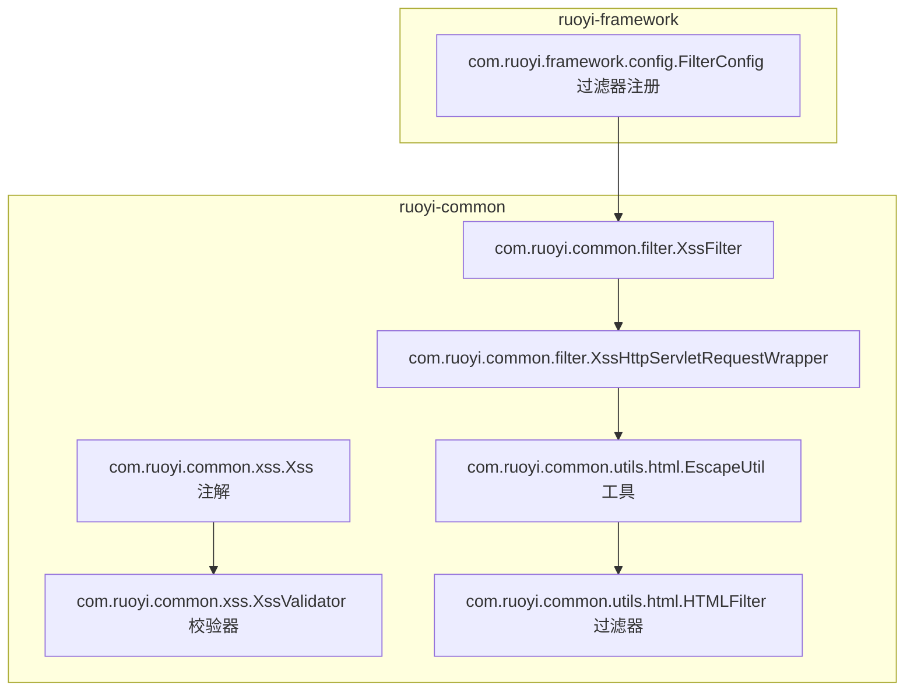
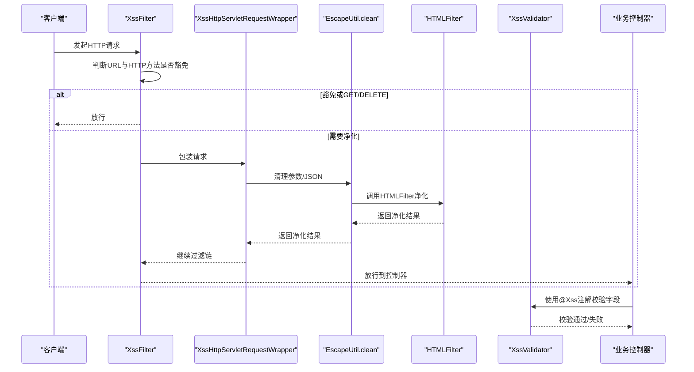
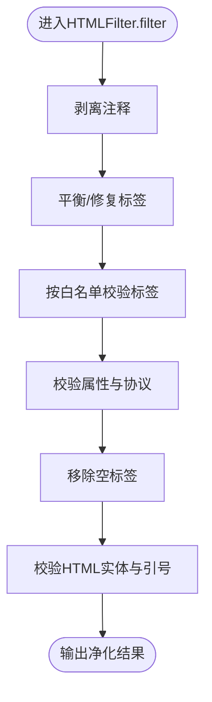
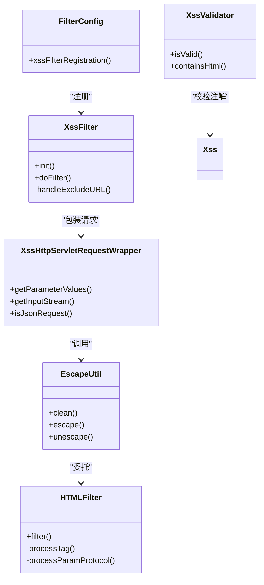

# XSS攻击防护

<cite>
**本文引用的文件**
- [XssFilter.java](file://ruoyi-common/src/main/java/com/ruoyi/common/filter/XssFilter.java)
- [XssHttpServletRequestWrapper.java](file://ruoyi-common/src/main/java/com/ruoyi/common/filter/XssHttpServletRequestWrapper.java)
- [XssValidator.java](file://ruoyi-common/src/main/java/com/ruoyi/common/xss/XssValidator.java)
- [Xss.java](file://ruoyi-common/src/main/java/com/ruoyi/common/xss/Xss.java)
- [EscapeUtil.java](file://ruoyi-common/src/main/java/com/ruoyi/common/utils/html/EscapeUtil.java)
- [HTMLFilter.java](file://ruoyi-common/src/main/java/com/ruoyi/common/utils/html/HTMLFilter.java)
- [FilterConfig.java](file://ruoyi-framework/src/main/java/com/ruoyi/framework/config/FilterConfig.java)
- [HttpMethod.java](file://ruoyi-common/src/main/java/com/ruoyi/common/enums/HttpMethod.java)
</cite>

## 目录
1. [简介](#简介)
2. [项目结构](#项目结构)
3. [核心组件](#核心组件)
4. [架构总览](#架构总览)
5. [组件详解](#组件详解)
6. [依赖关系分析](#依赖关系分析)
7. [性能与配置](#性能与配置)
8. [故障排查](#故障排查)
9. [结论](#结论)
10. [附录](#附录)

## 简介
本文件系统性梳理港好住信息系统中的XSS（跨站脚本）攻击防护机制，围绕以下关键点展开：
- XSS过滤器XssFilter的实现原理：请求参数过滤、JSON流净化、排除规则与HTTP方法豁免。
- XSS验证器XssValidator的验证逻辑：输入内容合法性检查、HTML标签识别、白名单机制。
- HTML转义机制EscapeUtil与HTML过滤器HTMLFilter的实现细节：特殊字符转义、标签剥离、属性协议校验。
- 配置项说明、性能影响评估、不同场景下的策略调整建议。
- 典型XSS攻击案例分析、防护效果测试思路与安全审计建议。

## 项目结构
XSS防护相关代码主要分布在通用模块与框架配置中：
- ruoyi-common：过滤器、包装器、XSS注解与校验器、HTML工具类
- ruoyi-framework：过滤器注册与启用开关

图表来源
- [XssFilter.java:1-75](file://ruoyi-common/src/main/java/com/ruoyi/common/filter/XssFilter.java#L1-L75)
- [XssHttpServletRequestWrapper.java:1-111](file://ruoyi-common/src/main/java/com/ruoyi/common/filter/XssHttpServletRequestWrapper.java#L1-L111)
- [Xss.java:1-28](file://ruoyi-common/src/main/java/com/ruoyi/common/xss/Xss.java#L1-L28)
- [XssValidator.java:1-39](file://ruoyi-common/src/main/java/com/ruoyi/common/xss/XssValidator.java#L1-L39)
- [EscapeUtil.java:1-168](file://ruoyi-common/src/main/java/com/ruoyi/common/utils/html/EscapeUtil.java#L1-L168)
- [HTMLFilter.java:1-570](file://ruoyi-common/src/main/java/com/ruoyi/common/utils/html/HTMLFilter.java#L1-L570)
- [FilterConfig.java:28-49](file://ruoyi-framework/src/main/java/com/ruoyi/framework/config/FilterConfig.java#L28-L49)

章节来源
- [XssFilter.java:1-75](file://ruoyi-common/src/main/java/com/ruoyi/common/filter/XssFilter.java#L1-L75)
- [XssHttpServletRequestWrapper.java:1-111](file://ruoyi-common/src/main/java/com/ruoyi/common/filter/XssHttpServletRequestWrapper.java#L1-L111)
- [Xss.java:1-28](file://ruoyi-common/src/main/java/com/ruoyi/common/xss/Xss.java#L1-L28)
- [XssValidator.java:1-39](file://ruoyi-common/src/main/java/com/ruoyi/common/xss/XssValidator.java#L1-L39)
- [EscapeUtil.java:1-168](file://ruoyi-common/src/main/java/com/ruoyi/common/utils/html/EscapeUtil.java#L1-L168)
- [HTMLFilter.java:1-570](file://ruoyi-common/src/main/java/com/ruoyi/common/utils/html/HTMLFilter.java#L1-L570)
- [FilterConfig.java:28-49](file://ruoyi-framework/src/main/java/com/ruoyi/framework/config/FilterConfig.java#L28-L49)

## 核心组件
- XssFilter：全局XSS过滤器，基于URL模式与HTTP方法进行豁免判断，对非GET/DELETE请求使用包装器进行参数与JSON流净化。
- XssHttpServletRequestWrapper：请求包装器，重写getParameterValues与getInputStream，调用EscapeUtil.clean进行HTML标签剥离与空白清理。
- Xss 注解与 XssValidator：提供基于注解的输入校验，禁止HTML标签出现，作为业务层补充防护。
- EscapeUtil：提供HTML转义/反转义、纯文本清理（调用HTMLFilter）能力。
- HTMLFilter：强白名单策略的HTML净化器，支持标签允许列表、属性白名单、协议限制、注释剥离、实体校验等。

章节来源
- [XssFilter.java:17-75](file://ruoyi-common/src/main/java/com/ruoyi/common/filter/XssFilter.java#L17-L75)
- [XssHttpServletRequestWrapper.java:15-111](file://ruoyi-common/src/main/java/com/ruoyi/common/filter/XssHttpServletRequestWrapper.java#L15-L111)
- [Xss.java:10-28](file://ruoyi-common/src/main/java/com/ruoyi/common/xss/Xss.java#L10-L28)
- [XssValidator.java:9-39](file://ruoyi-common/src/main/java/com/ruoyi/common/xss/XssValidator.java#L9-L39)
- [EscapeUtil.java:31-62](file://ruoyi-common/src/main/java/com/ruoyi/common/utils/html/EscapeUtil.java#L31-L62)
- [HTMLFilter.java:103-166](file://ruoyi-common/src/main/java/com/ruoyi/common/utils/html/HTMLFilter.java#L103-L166)

## 架构总览
XSS防护在请求进入控制器前生效，形成“过滤器-包装器-工具-净化器”的链路。

图表来源
- [XssFilter.java:43-68](file://ruoyi-common/src/main/java/com/ruoyi/common/filter/XssFilter.java#L43-L68)
- [XssHttpServletRequestWrapper.java:30-99](file://ruoyi-common/src/main/java/com/ruoyi/common/filter/XssHttpServletRequestWrapper.java#L30-L99)
- [EscapeUtil.java:58-62](file://ruoyi-common/src/main/java/com/ruoyi/common/utils/html/EscapeUtil.java#L58-L62)
- [HTMLFilter.java:198-214](file://ruoyi-common/src/main/java/com/ruoyi/common/utils/html/HTMLFilter.java#L198-L214)
- [XssValidator.java:18-26](file://ruoyi-common/src/main/java/com/ruoyi/common/xss/XssValidator.java#L18-L26)

## 组件详解

### XSS过滤器 XssFilter
- 初始化参数
  - excludes：以逗号分隔的URL白名单，匹配时整请求放行。
- 过滤逻辑
  - 若请求方法为GET/DELETE或命中排除URL，则直接放行。
  - 否则，使用XssHttpServletRequestWrapper包装请求，继续过滤链。
- 关键点
  - 仅对非GET/DELETE请求进行参数与JSON流净化，避免对只读请求造成额外开销。
  - 通过initParameter注入excludes，便于灵活配置。

章节来源
- [XssFilter.java:24-75](file://ruoyi-common/src/main/java/com/ruoyi/common/filter/XssFilter.java#L24-L75)
- [HttpMethod.java:12-36](file://ruoyi-common/src/main/java/com/ruoyi/common/enums/HttpMethod.java#L12-L36)

### 请求包装器 XssHttpServletRequestWrapper
- 参数净化
  - 重写getParameterValues，逐个调用EscapeUtil.clean并trim，剥离HTML标签与多余空白。
- JSON流净化
  - 当Content-Type为application/json时，读取原始输入流，调用EscapeUtil.clean净化后以字节流形式回放。
- 非JSON直通
  - 非JSON请求直接透传，减少不必要的解析成本。

章节来源
- [XssHttpServletRequestWrapper.java:30-111](file://ruoyi-common/src/main/java/com/ruoyi/common/filter/XssHttpServletRequestWrapper.java#L30-L111)

### XSS验证器 XssValidator 与注解 Xss
- 注解定义
  - 支持在方法、字段、构造函数、参数上使用；默认错误消息为“不允许任何脚本运行”。
- 校验逻辑
  - 对空值直接放行；否则通过正则识别HTML标签片段，若存在HTML标记则判定为非法。
- 适用场景
  - 业务字段级校验，作为过滤器之外的第二道防线。

章节来源
- [Xss.java:15-27](file://ruoyi-common/src/main/java/com/ruoyi/common/xss/Xss.java#L15-L27)
- [XssValidator.java:18-38](file://ruoyi-common/src/main/java/com/ruoyi/common/xss/XssValidator.java#L18-L38)

### HTML转义与净化 EscapeUtil 与 HTMLFilter
- EscapeUtil
  - escape/unescape：提供URL百分号编码/解码能力。
  - clean：委托HTMLFilter进行HTML标签剥离。
- HTMLFilter
  - 白名单策略：允许元素、允许属性、自闭合标签、必须成对标签、禁用元素集合。
  - 协议限制：对href/src等属性进行协议白名单校验，非法协议会被转换为本地锚点。
  - 注释处理：可选择剥离注释或转义。
  - 实体与引号：对HTML实体与引号进行规范化处理，避免破坏JSON结构。
  - 平衡与修复：可选择将不配对尖括号转义或尝试补全标签。

图表来源
- [HTMLFilter.java:198-214](file://ruoyi-common/src/main/java/com/ruoyi/common/utils/html/HTMLFilter.java#L198-L214)
- [HTMLFilter.java:226-270](file://ruoyi-common/src/main/java/com/ruoyi/common/utils/html/HTMLFilter.java#L226-L270)
- [HTMLFilter.java:272-298](file://ruoyi-common/src/main/java/com/ruoyi/common/utils/html/HTMLFilter.java#L272-L298)
- [HTMLFilter.java:326-435](file://ruoyi-common/src/main/java/com/ruoyi/common/utils/html/HTMLFilter.java#L326-L435)
- [HTMLFilter.java:437-456](file://ruoyi-common/src/main/java/com/ruoyi/common/utils/html/HTMLFilter.java#L437-L456)
- [HTMLFilter.java:300-318](file://ruoyi-common/src/main/java/com/ruoyi/common/utils/html/HTMLFilter.java#L300-L318)
- [HTMLFilter.java:498-513](file://ruoyi-common/src/main/java/com/ruoyi/common/utils/html/HTMLFilter.java#L498-L513)

章节来源
- [EscapeUtil.java:31-62](file://ruoyi-common/src/main/java/com/ruoyi/common/utils/html/EscapeUtil.java#L31-L62)
- [HTMLFilter.java:103-166](file://ruoyi-common/src/main/java/com/ruoyi/common/utils/html/HTMLFilter.java#L103-L166)

### 过滤器注册与启用
- 启用条件：xss.enabled=true
- URL模式：xss.urlPatterns 指定受保护路径
- 排除参数：excludes 传递给XssFilter.initParameter
- 顺序：设置为最高优先级，确保尽早拦截

章节来源
- [FilterConfig.java:34-49](file://ruoyi-framework/src/main/java/com/ruoyi/framework/config/FilterConfig.java#L34-L49)

## 依赖关系分析
- XssFilter 依赖：
  - HttpMethod：判断HTTP方法是否豁免
  - XssHttpServletRequestWrapper：对请求进行包装
- XssHttpServletRequestWrapper 依赖：
  - EscapeUtil：参数与JSON净化
- EscapeUtil 依赖：
  - HTMLFilter：HTML标签剥离
- XssValidator 依赖：
  - Xss 注解：约束声明
- FilterConfig 依赖：
  - XssFilter：注册与初始化

图表来源
- [XssFilter.java:22-75](file://ruoyi-common/src/main/java/com/ruoyi/common/filter/XssFilter.java#L22-L75)
- [XssHttpServletRequestWrapper.java:20-111](file://ruoyi-common/src/main/java/com/ruoyi/common/filter/XssHttpServletRequestWrapper.java#L20-L111)
- [EscapeUtil.java:10-168](file://ruoyi-common/src/main/java/com/ruoyi/common/utils/html/EscapeUtil.java#L10-L168)
- [HTMLFilter.java:18-570](file://ruoyi-common/src/main/java/com/ruoyi/common/utils/html/HTMLFilter.java#L18-L570)
- [Xss.java:15-27](file://ruoyi-common/src/main/java/com/ruoyi/common/xss/Xss.java#L15-L27)
- [XssValidator.java:14-39](file://ruoyi-common/src/main/java/com/ruoyi/common/xss/XssValidator.java#L14-L39)
- [FilterConfig.java:34-49](file://ruoyi-framework/src/main/java/com/ruoyi/framework/config/FilterConfig.java#L34-L49)

## 性能与配置
- 性能考量
  - 仅对非GET/DELETE请求进行净化，降低只读请求的处理开销。
  - JSON流净化仅在Content-Type为application/json时触发，避免对表单/静态资源产生额外IO。
  - HTMLFilter采用白名单策略与有限正则匹配，复杂度与输入长度线性相关。
- 配置项
  - xss.enabled：启用/禁用XSS过滤器
  - xss.urlPatterns：受保护的URL模式，多个以逗号分隔
  - excludes：排除URL列表，多个以逗号分隔
  - Filter顺序：最高优先级，确保最先拦截
- 场景化策略
  - 公共接口：开启XSS过滤，合理设置excludes
  - 富文本场景：谨慎开放HTML白名单，必要时引入更严格的编辑器插件与二次校验
  - API网关：统一在入口层启用，避免重复防护

章节来源
- [XssFilter.java:24-41](file://ruoyi-common/src/main/java/com/ruoyi/common/filter/XssFilter.java#L24-L41)
- [XssHttpServletRequestWrapper.java:102-111](file://ruoyi-common/src/main/java/com/ruoyi/common/filter/XssHttpServletRequestWrapper.java#L102-L111)
- [FilterConfig.java:28-49](file://ruoyi-framework/src/main/java/com/ruoyi/framework/config/FilterConfig.java#L28-L49)

## 故障排查
- 症状：某些请求未被净化
  - 检查URL是否命中excludes或是否为GET/DELETE
  - 确认xss.enabled与xss.urlPatterns配置正确
- 症状：JSON参数丢失或异常
  - 确认Content-Type为application/json且非空
  - 检查EscapeUtil.clean是否正确剥离HTML
- 症状：富文本显示异常
  - 检查HTMLFilter白名单配置，确认允许的标签与属性
  - 注意引号处理策略，避免破坏JSON结构
- 症状：注释或特殊实体导致渲染异常
  - 根据需要调整stripComment与encodeQuotes参数

章节来源
- [XssFilter.java:58-68](file://ruoyi-common/src/main/java/com/ruoyi/common/filter/XssFilter.java#L58-L68)
- [XssHttpServletRequestWrapper.java:48-99](file://ruoyi-common/src/main/java/com/ruoyi/common/filter/XssHttpServletRequestWrapper.java#L48-L99)
- [HTMLFilter.java:142-166](file://ruoyi-common/src/main/java/com/ruoyi/common/utils/html/HTMLFilter.java#L142-L166)

## 结论
港好住信息系统的XSS防护采用“过滤器+包装器+注解校验+HTML净化”的多层防护体系：
- 在入口层通过XssFilter与XssHttpServletRequestWrapper对请求参数与JSON流进行净化；
- 通过XssValidator在业务层对字段进行HTML标签检测；
- 通过EscapeUtil与HTMLFilter实现强白名单与协议控制，有效阻断XSS风险。
结合合理的配置与场景化策略，可在保证安全性的同时兼顾性能与可用性。

## 附录

### 典型XSS攻击案例与防护效果
- 案例1：参数注入
  - 防护：XssFilter与XssHttpServletRequestWrapper调用EscapeUtil.clean剥离标签，XssValidator拒绝包含HTML的输入
- 案例2：JSON参数中嵌入
  - 防护：包装器读取JSON流后调用EscapeUtil.clean，HTMLFilter移除危险属性与标签
- 案例3：协议型攻击javascript:xxx
  - 防护：HTMLFilter对href/src等属性进行协议白名单校验，非法协议被转换为本地锚点

章节来源
- [XssHttpServletRequestWrapper.java:48-99](file://ruoyi-common/src/main/java/com/ruoyi/common/filter/XssHttpServletRequestWrapper.java#L48-L99)
- [EscapeUtil.java:58-62](file://ruoyi-common/src/main/java/com/ruoyi/common/utils/html/EscapeUtil.java#L58-L62)
- [HTMLFilter.java:437-456](file://ruoyi-common/src/main/java/com/ruoyi/common/utils/html/HTMLFilter.java#L437-L456)
- [XssValidator.java:28-38](file://ruoyi-common/src/main/java/com/ruoyi/common/xss/XssValidator.java#L28-L38)

### 安全审计建议
- 定期审查excludes列表，确保仅保留必要接口
- 对富文本场景建立最小权限白名单，严格控制标签与属性
- 引入WAF或前端CSP策略，形成纵深防御
- 建立XSS事件监控与日志审计，及时发现异常请求