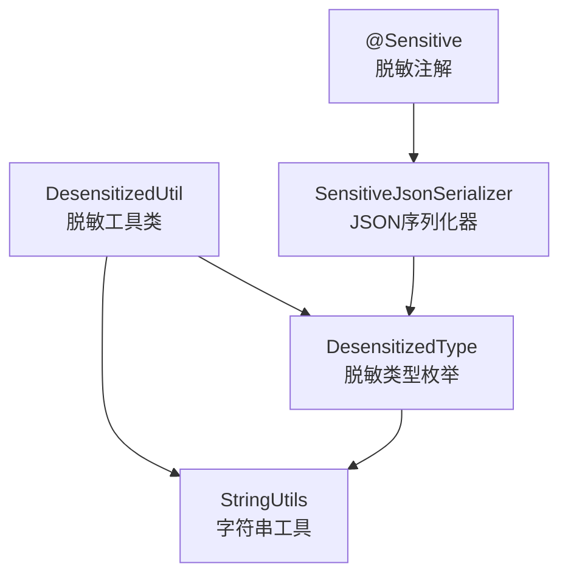
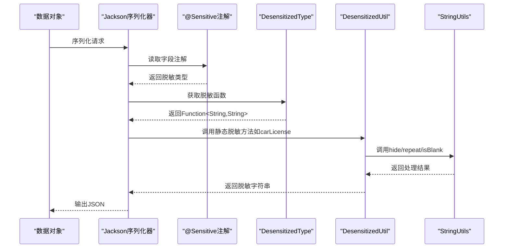
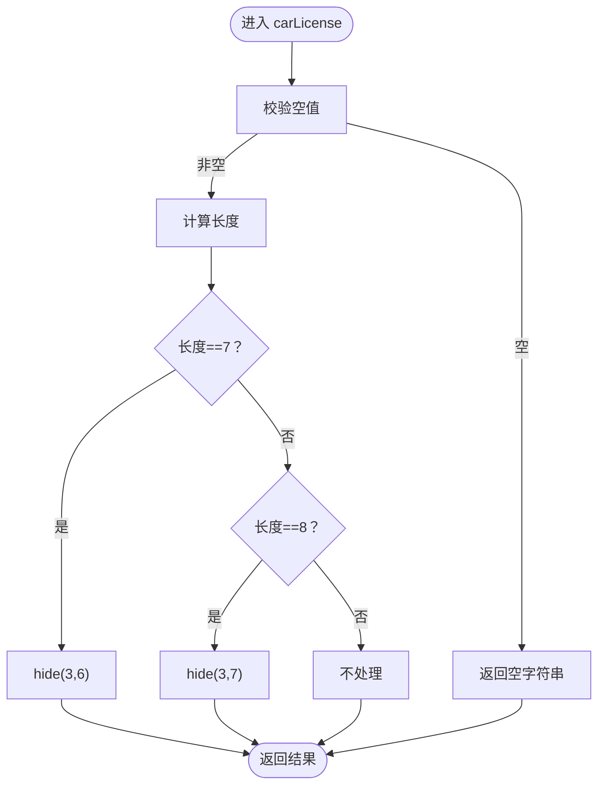
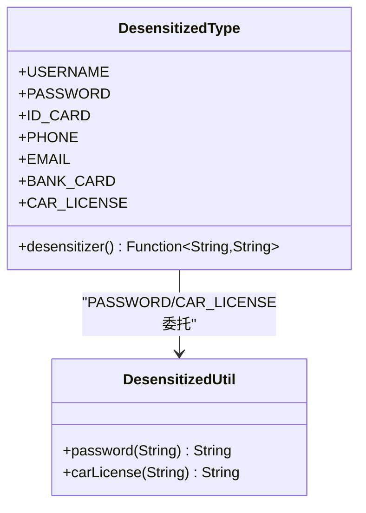
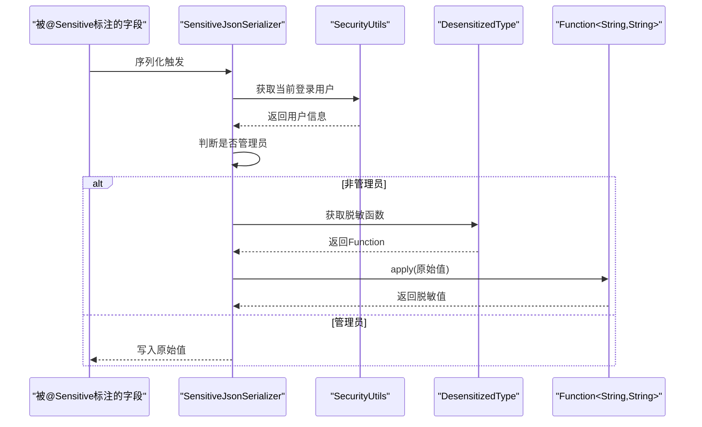
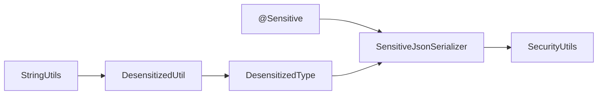

# 敏感数据脱敏

<cite>
**本文引用的文件**   
- [DesensitizedUtil.java](file://ruoyi-common/src/main/java/com/ruoyi/common/utils/DesensitizedUtil.java)
- [DesensitizedType.java](file://ruoyi-common/src/main/java/com/ruoyi/common/enums/DesensitizedType.java)
- [Sensitive.java](file://ruoyi-common/src/main/java/com/ruoyi/common/annotation/Sensitive.java)
- [SensitiveJsonSerializer.java](file://ruoyi-common/src/main/java/com/ruoyi/common/config/serializer/SensitiveJsonSerializer.java)
- [StringUtils.java](file://ruoyi-common/src/main/java/com/ruoyi/common/utils/StringUtils.java)
</cite>

## 目录
1. [简介](#简介)
2. [项目结构](#项目结构)
3. [核心组件](#核心组件)
4. [架构总览](#架构总览)
5. [组件详解](#组件详解)
6. [依赖关系分析](#依赖关系分析)
7. [性能与安全考量](#性能与安全考量)
8. [故障排查指南](#故障排查指南)
9. [结论](#结论)
10. [附录](#附录)

## 简介
本文件面向港好住信息系统，系统性阐述敏感数据脱敏机制的设计与实现，重点解析脱敏工具类 DesensitizedUtil 的实现原理、脱敏类型枚举 DesensitizedType 的设计思路与使用场景、脱敏规则配置机制、脱敏数据的生命周期管理，以及在不同业务场景下的脱敏策略应用。同时覆盖脱敏数据的存储格式、传输加密、日志脱敏等安全实践，并提供配置指南、性能优化建议与脱敏效果验证方法。

## 项目结构
脱敏能力由以下模块协同实现：
- 工具层：DesensitizedUtil 提供具体脱敏算法（密码、车牌等）。
- 枚举层：DesensitizedType 定义脱敏类型与对应算法函数。
- 注解层：@Sensitive 用于标注字段并绑定脱敏类型。
- 序列化层：SensitiveJsonSerializer 在 JSON 序列化阶段按用户权限动态脱敏。
- 基础工具：StringUtils 提供字符串处理能力（如 hide、repeat、isBlank 等）。

图表来源
- [DesensitizedUtil.java:1-50](file://ruoyi-common/src/main/java/com/ruoyi/common/utils/DesensitizedUtil.java#L1-L50)
- [DesensitizedType.java:1-60](file://ruoyi-common/src/main/java/com/ruoyi/common/enums/DesensitizedType.java#L1-L60)
- [Sensitive.java:1-25](file://ruoyi-common/src/main/java/com/ruoyi/common/annotation/Sensitive.java#L1-L25)
- [SensitiveJsonSerializer.java:1-68](file://ruoyi-common/src/main/java/com/ruoyi/common/config/serializer/SensitiveJsonSerializer.java#L1-L68)
- [StringUtils.java:178-211](file://ruoyi-common/src/main/java/com/ruoyi/common/utils/StringUtils.java#L178-L211)

章节来源
- [DesensitizedUtil.java:1-50](file://ruoyi-common/src/main/java/com/ruoyi/common/utils/DesensitizedUtil.java#L1-L50)
- [DesensitizedType.java:1-60](file://ruoyi-common/src/main/java/com/ruoyi/common/enums/DesensitizedType.java#L1-L60)
- [Sensitive.java:1-25](file://ruoyi-common/src/main/java/com/ruoyi/common/annotation/Sensitive.java#L1-L25)
- [SensitiveJsonSerializer.java:1-68](file://ruoyi-common/src/main/java/com/ruoyi/common/config/serializer/SensitiveJsonSerializer.java#L1-L68)
- [StringUtils.java:178-211](file://ruoyi-common/src/main/java/com/ruoyi/common/utils/StringUtils.java#L178-L211)

## 核心组件
- DesensitizedUtil：提供静态脱敏方法，包括密码全星号替换、车牌号中间位隐藏（普通/新能源区分）。
- DesensitizedType：定义脱敏类型与对应的 Function<String,String> 算法，涵盖用户名、密码、身份证、手机号、邮箱、银行卡、车牌等。
- @Sensitive：字段级注解，声明该字段应按何种脱敏类型进行序列化脱敏。
- SensitiveJsonSerializer：Jackson 序列化器，根据注解与当前登录用户身份决定是否脱敏。
- StringUtils：提供 hide、repeat、isBlank 等基础字符串处理方法，支撑脱敏逻辑。

章节来源
- [DesensitizedUtil.java:1-50](file://ruoyi-common/src/main/java/com/ruoyi/common/utils/DesensitizedUtil.java#L1-L50)
- [DesensitizedType.java:1-60](file://ruoyi-common/src/main/java/com/ruoyi/common/enums/DesensitizedType.java#L1-L60)
- [Sensitive.java:1-25](file://ruoyi-common/src/main/java/com/ruoyi/common/annotation/Sensitive.java#L1-L25)
- [SensitiveJsonSerializer.java:1-68](file://ruoyi-common/src/main/java/com/ruoyi/common/config/serializer/SensitiveJsonSerializer.java#L1-L68)
- [StringUtils.java:178-211](file://ruoyi-common/src/main/java/com/ruoyi/common/utils/StringUtils.java#L178-L211)

## 架构总览
脱敏在“注解标注 → 序列化阶段 → 类型选择 → 算法执行”的链路中完成，管理员身份不脱敏，普通用户可见真实值；非字符串字段或未标注 @Sensitive 的字段不受影响。

图表来源
- [SensitiveJsonSerializer.java:25-36](file://ruoyi-common/src/main/java/com/ruoyi/common/config/serializer/SensitiveJsonSerializer.java#L25-L36)
- [Sensitive.java:21-24](file://ruoyi-common/src/main/java/com/ruoyi/common/annotation/Sensitive.java#L21-L24)
- [DesensitizedType.java:48-58](file://ruoyi-common/src/main/java/com/ruoyi/common/enums/DesensitizedType.java#L48-L58)
- [DesensitizedUtil.java:31-48](file://ruoyi-common/src/main/java/com/ruoyi/common/utils/DesensitizedUtil.java#L31-L48)
- [StringUtils.java:178-211](file://ruoyi-common/src/main/java/com/ruoyi/common/utils/StringUtils.java#L178-L211)

## 组件详解

### DesensitizedUtil 实现原理
- 密码脱敏：对输入字符串长度生成等长星号，空值返回空字符串。
- 车牌脱敏：
  - 普通车牌（7位）：隐藏第4至第7位（索引3到6）。
  - 新能源车牌（8位）：隐藏第4至第9位（索引3到8）。
  - 空值返回空字符串。
- 依赖 StringUtils 的 isBlank、hide、repeat 等方法。

图表来源
- [DesensitizedUtil.java:31-48](file://ruoyi-common/src/main/java/com/ruoyi/common/utils/DesensitizedUtil.java#L31-L48)
- [StringUtils.java:178-211](file://ruoyi-common/src/main/java/com/ruoyi/common/utils/StringUtils.java#L178-L211)

章节来源
- [DesensitizedUtil.java:16-23](file://ruoyi-common/src/main/java/com/ruoyi/common/utils/DesensitizedUtil.java#L16-L23)
- [DesensitizedUtil.java:31-48](file://ruoyi-common/src/main/java/com/ruoyi/common/utils/DesensitizedUtil.java#L31-L48)
- [StringUtils.java:178-211](file://ruoyi-common/src/main/java/com/ruoyi/common/utils/StringUtils.java#L178-L211)

### DesensitizedType 设计思路与使用场景
- 设计要点：
  - 每个枚举常量绑定一个 Function<String,String>，统一通过 desensitizer() 获取。
  - 针对不同字段特征采用正则或工具方法组合策略。
- 使用场景举例：
  - 用户名：保留首字符，其余用星号替换。
  - 密码：全部字符星号替换。
  - 身份证：保留前4位与最后3/4位，中间10位星号替换。
  - 手机号：保留前3后4，中间4位星号替换。
  - 邮箱：保留首字母与域名部分，其余星号替换。
  - 银行卡：按分组保留最后4位，其余星号替换。
  - 车牌：普通/新能源区分隐藏范围。
- 与工具类协作：PASSWORD、CAR_LICENSE 直接委托 DesensitizedUtil 的静态方法。

图表来源
- [DesensitizedType.java:11-59](file://ruoyi-common/src/main/java/com/ruoyi/common/enums/DesensitizedType.java#L11-L59)
- [DesensitizedUtil.java:8-49](file://ruoyi-common/src/main/java/com/ruoyi/common/utils/DesensitizedUtil.java#L8-L49)

章节来源
- [DesensitizedType.java:11-59](file://ruoyi-common/src/main/java/com/ruoyi/common/enums/DesensitizedType.java#L11-L59)

### @Sensitive 注解与序列化器
- @Sensitive：
  - 作用于字段，声明脱敏类型。
  - 通过 Jackson 注解绑定 SensitiveJsonSerializer。
- SensitiveJsonSerializer：
  - 在序列化时根据字段注解选择脱敏函数。
  - 条件脱敏：读取当前登录用户，若为管理员则不脱敏，否则按脱敏函数处理。
  - 非字符串字段或未标注 @Sensitive 的字段保持原样。

图表来源
- [Sensitive.java:21-24](file://ruoyi-common/src/main/java/com/ruoyi/common/annotation/Sensitive.java#L21-L24)
- [SensitiveJsonSerializer.java:25-36](file://ruoyi-common/src/main/java/com/ruoyi/common/config/serializer/SensitiveJsonSerializer.java#L25-L36)
- [SensitiveJsonSerializer.java:54-66](file://ruoyi-common/src/main/java/com/ruoyi/common/config/serializer/SensitiveJsonSerializer.java#L54-L66)
- [DesensitizedType.java:55-58](file://ruoyi-common/src/main/java/com/ruoyi/common/enums/DesensitizedType.java#L55-L58)

章节来源
- [Sensitive.java:1-25](file://ruoyi-common/src/main/java/com/ruoyi/common/annotation/Sensitive.java#L1-L25)
- [SensitiveJsonSerializer.java:1-68](file://ruoyi-common/src/main/java/com/ruoyi/common/config/serializer/SensitiveJsonSerializer.java#L1-L68)

### 脱敏规则配置机制
- 字段级配置：在实体字段上添加 @Sensitive(desensitizedType=...)。
- 类级配置：可在类上统一配置，结合序列化器上下文自动识别字段类型。
- 运行期控制：通过 SensitiveJsonSerializer 的 desensitization() 判断当前用户角色，管理员不脱敏。
- 可扩展性：新增脱敏类型只需在 DesensitizedType 中增加枚举项并绑定相应函数；复杂场景可直接在 DesensitizedUtil 中新增静态方法。

章节来源
- [Sensitive.java:21-24](file://ruoyi-common/src/main/java/com/ruoyi/common/annotation/Sensitive.java#L21-L24)
- [SensitiveJsonSerializer.java:39-49](file://ruoyi-common/src/main/java/com/ruoyi/common/config/serializer/SensitiveJsonSerializer.java#L39-L49)
- [DesensitizedType.java:48-58](file://ruoyi-common/src/main/java/com/ruoyi/common/enums/DesensitizedType.java#L48-L58)

### 脱敏数据的生命周期管理
- 输入阶段：业务接收原始数据，不做任何修改。
- 处理阶段：在服务层或领域模型中可进行必要校验，但不改变敏感字段的存储形态。
- 序列化阶段：对外输出（JSON）时，由 SensitiveJsonSerializer 按需脱敏。
- 存储阶段：数据库持久化保存原始值，避免二次脱敏导致不可逆信息丢失。
- 日志阶段：建议在日志中对敏感字段进行脱敏输出，防止日志泄露。

章节来源
- [SensitiveJsonSerializer.java:25-36](file://ruoyi-common/src/main/java/com/ruoyi/common/config/serializer/SensitiveJsonSerializer.java#L25-L36)

### 不同业务场景下的脱敏策略
- 用户中心：用户名（首字符+星号）、手机号（前3后4+星号）、邮箱（首字母+星号+域名）、身份证（前4后3/4+星号）、密码（全星号）、银行卡（分组保留后4）、车牌（普通/新能源分别隐藏）。
- 管理后台：管理员身份不脱敏，便于运维与审计。
- 第三方接口：对外响应统一走序列化器，确保一致性。

章节来源
- [DesensitizedType.java:16-46](file://ruoyi-common/src/main/java/com/ruoyi/common/enums/DesensitizedType.java#L16-L46)
- [SensitiveJsonSerializer.java:54-66](file://ruoyi-common/src/main/java/com/ruoyi/common/config/serializer/SensitiveJsonSerializer.java#L54-L66)

### 脱敏数据的存储格式、传输加密与日志脱敏
- 存储格式：数据库字段保存原始值，避免脱敏带来的信息不可恢复性。
- 传输加密：建议在传输层启用 TLS，配合 HTTPS/消息队列加密，确保数据在传输过程中的机密性与完整性。
- 日志脱敏：建议在日志框架中对敏感字段进行脱敏输出，避免敏感信息落入日志系统。

章节来源
- [SensitiveJsonSerializer.java:25-36](file://ruoyi-common/src/main/java/com/ruoyi/common/config/serializer/SensitiveJsonSerializer.java#L25-L36)

## 依赖关系分析
- DesensitizedUtil 依赖 StringUtils（isBlank、hide、repeat）。
- DesensitizedType 依赖 DesensitizedUtil（PASSWORD、CAR_LICENSE）。
- @Sensitive 依赖 SensitiveJsonSerializer。
- SensitiveJsonSerializer 依赖 DesensitizedType、@Sensitive、SecurityUtils。

图表来源
- [DesensitizedUtil.java:16-23](file://ruoyi-common/src/main/java/com/ruoyi/common/utils/DesensitizedUtil.java#L16-L23)
- [DesensitizedUtil.java:31-48](file://ruoyi-common/src/main/java/com/ruoyi/common/utils/DesensitizedUtil.java#L31-L48)
- [DesensitizedType.java:21](file://ruoyi-common/src/main/java/com/ruoyi/common/enums/DesensitizedType.java#L21)
- [DesensitizedType.java:46](file://ruoyi-common/src/main/java/com/ruoyi/common/enums/DesensitizedType.java#L46)
- [Sensitive.java:21-24](file://ruoyi-common/src/main/java/com/ruoyi/common/annotation/Sensitive.java#L21-L24)
- [SensitiveJsonSerializer.java:25-36](file://ruoyi-common/src/main/java/com/ruoyi/common/config/serializer/SensitiveJsonSerializer.java#L25-L36)

章节来源
- [DesensitizedUtil.java:1-50](file://ruoyi-common/src/main/java/com/ruoyi/common/utils/DesensitizedUtil.java#L1-L50)
- [DesensitizedType.java:1-60](file://ruoyi-common/src/main/java/com/ruoyi/common/enums/DesensitizedType.java#L1-L60)
- [Sensitive.java:1-25](file://ruoyi-common/src/main/java/com/ruoyi/common/annotation/Sensitive.java#L1-L25)
- [SensitiveJsonSerializer.java:1-68](file://ruoyi-common/src/main/java/com/ruoyi/common/config/serializer/SensitiveJsonSerializer.java#L1-L68)
- [StringUtils.java:178-211](file://ruoyi-common/src/main/java/com/ruoyi/common/utils/StringUtils.java#L178-L211)

## 性能与安全考量
- 性能优化建议：
  - 减少不必要的字符串复制：DesensitizedUtil 与 StringUtils 的 hide/repeat 为 O(n) 操作，尽量避免在高频路径重复调用。
  - 缓存策略：对热点字段的脱敏结果可考虑在内存缓存（需注意安全性与失效策略）。
  - 批量处理：在批量序列化时复用序列化器实例，减少反射开销。
- 安全实践：
  - 管理员不脱敏：通过 SecurityUtils 判断用户角色，避免内部审计与运维受阻。
  - 传输加密：启用 TLS，确保数据在传输过程中不被窃听或篡改。
  - 日志脱敏：对日志输出进行脱敏，防止敏感信息泄露。
  - 最小暴露原则：仅在必要时进行脱敏，避免过度脱敏导致用户体验下降。

章节来源
- [SensitiveJsonSerializer.java:54-66](file://ruoyi-common/src/main/java/com/ruoyi/common/config/serializer/SensitiveJsonSerializer.java#L54-L66)

## 故障排查指南
- 现象：字段未脱敏
  - 检查是否正确标注 @Sensitive 且类型匹配。
  - 检查序列化器是否生效（Jackson 配置）。
- 现象：管理员仍看到脱敏内容
  - 检查 SecurityUtils 获取用户是否成功，确认 isAdmin() 判断逻辑。
- 现象：车牌脱敏异常
  - 检查车牌长度是否为7或8，确保 hide 范围正确。
- 现象：日志泄露敏感信息
  - 在日志框架中增加脱敏输出规则，或统一通过序列化器控制。

章节来源
- [Sensitive.java:21-24](file://ruoyi-common/src/main/java/com/ruoyi/common/annotation/Sensitive.java#L21-L24)
- [SensitiveJsonSerializer.java:39-49](file://ruoyi-common/src/main/java/com/ruoyi/common/config/serializer/SensitiveJsonSerializer.java#L39-L49)
- [SensitiveJsonSerializer.java:54-66](file://ruoyi-common/src/main/java/com/ruoyi/common/config/serializer/SensitiveJsonSerializer.java#L54-L66)
- [DesensitizedUtil.java:31-48](file://ruoyi-common/src/main/java/com/ruoyi/common/utils/DesensitizedUtil.java#L31-L48)

## 结论
港好住信息系统的脱敏机制以注解驱动、序列化器控制为核心，结合枚举化的脱敏类型与工具类算法，实现了对密码、手机号、邮箱、身份证、银行卡、车牌等多种敏感信息的灵活脱敏。通过管理员不脱敏、传输加密与日志脱敏等安全实践，既保障了数据安全，又兼顾了业务可用性与审计需求。建议在生产环境中持续完善脱敏策略与监控告警，确保脱敏效果与性能平衡。

## 附录

### 脱敏配置指南
- 字段标注：在实体字段上添加 @Sensitive(desensitizedType=...)。
- 类型选择：根据字段特性选择 USERNAME/PASSWORD/ID_CARD/PHONE/EMAIL/BANK_CARD/CAR_LICENSE。
- 序列化器：确保 Jackson 使用 SensitiveJsonSerializer。
- 用户判定：通过 SecurityUtils 判断是否管理员，管理员不脱敏。

章节来源
- [Sensitive.java:21-24](file://ruoyi-common/src/main/java/com/ruoyi/common/annotation/Sensitive.java#L21-L24)
- [SensitiveJsonSerializer.java:39-49](file://ruoyi-common/src/main/java/com/ruoyi/common/config/serializer/SensitiveJsonSerializer.java#L39-L49)
- [SensitiveJsonSerializer.java:54-66](file://ruoyi-common/src/main/java/com/ruoyi/common/config/serializer/SensitiveJsonSerializer.java#L54-L66)

### 脱敏效果验证方法
- 单元测试：构造不同长度与格式的输入，验证脱敏输出符合预期。
- 集成测试：模拟管理员与普通用户两种身份，验证脱敏开关行为。
- 日志审计：记录关键字段的序列化输出，确保日志中敏感信息已被脱敏。

章节来源
- [DesensitizedUtil.java:16-23](file://ruoyi-common/src/main/java/com/ruoyi/common/utils/DesensitizedUtil.java#L16-L23)
- [DesensitizedUtil.java:31-48](file://ruoyi-common/src/main/java/com/ruoyi/common/utils/DesensitizedUtil.java#L31-L48)
- [DesensitizedType.java:16-46](file://ruoyi-common/src/main/java/com/ruoyi/common/enums/DesensitizedType.java#L16-L46)
- [SensitiveJsonSerializer.java:25-36](file://ruoyi-common/src/main/java/com/ruoyi/common/config/serializer/SensitiveJsonSerializer.java#L25-L36)