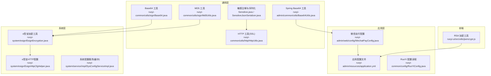
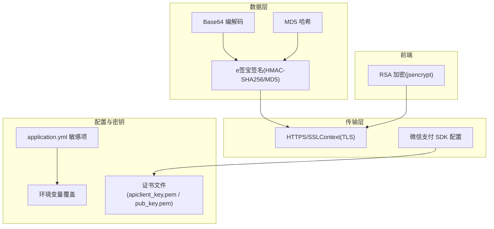
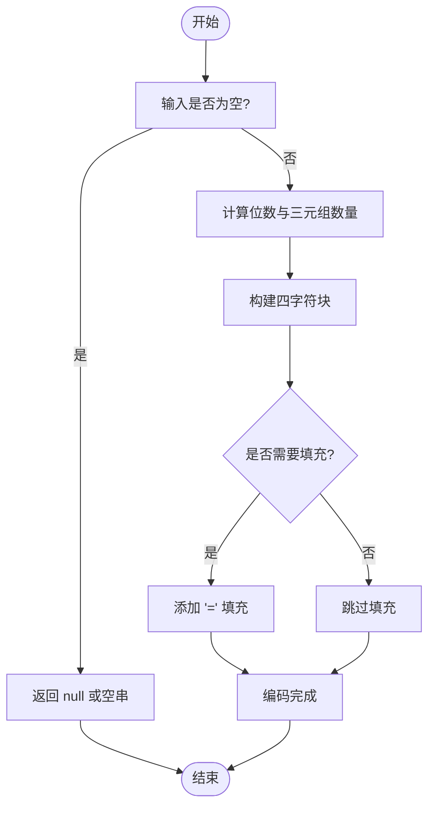
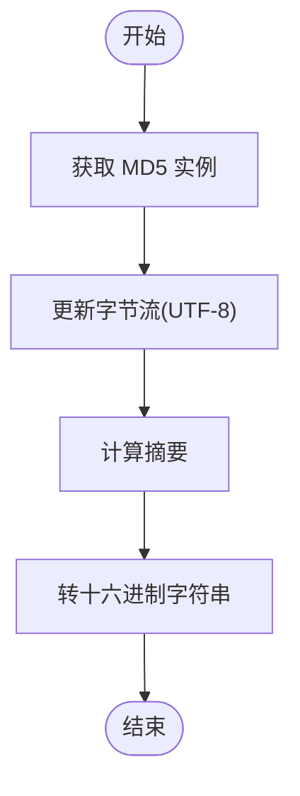
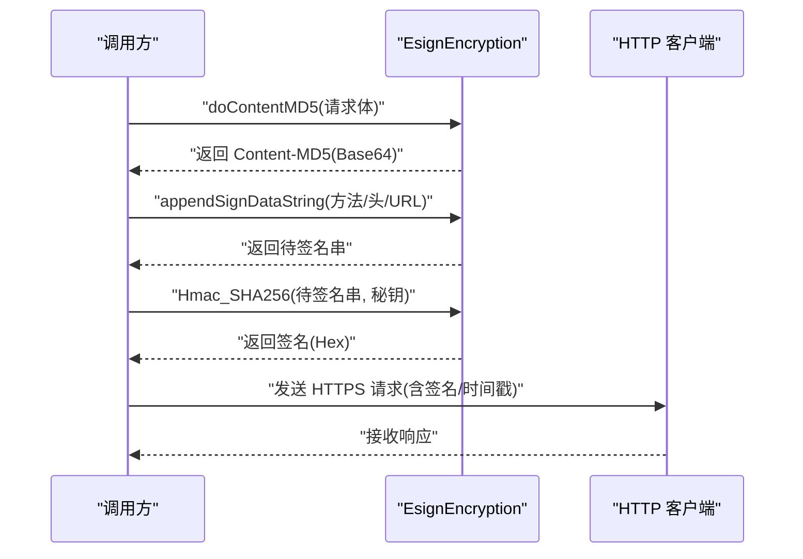
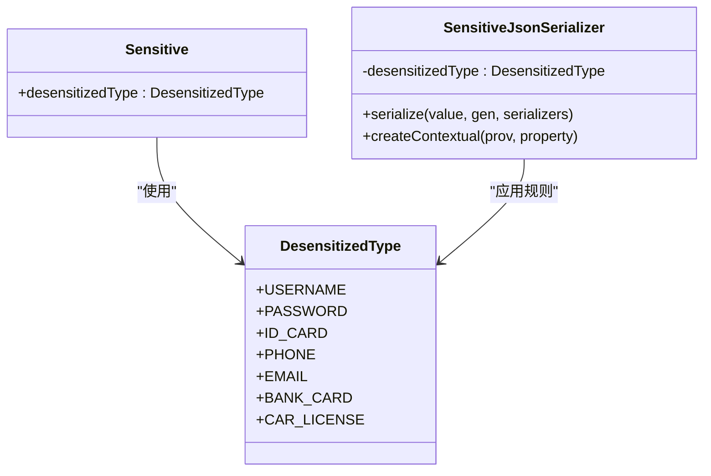
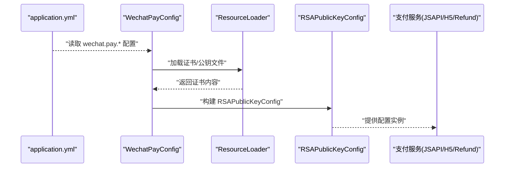
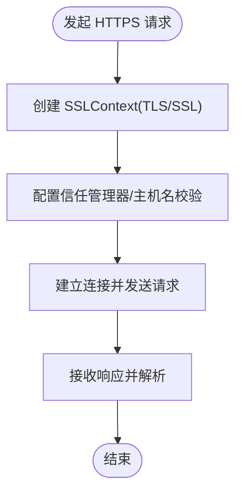
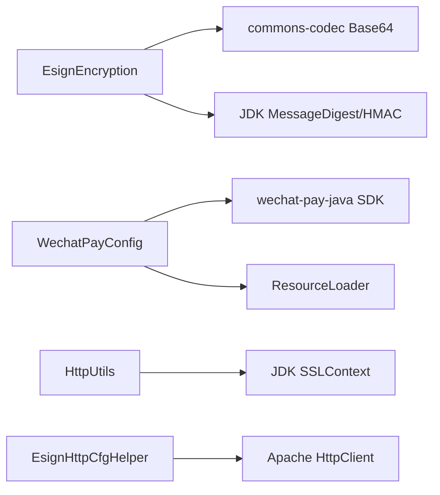

# 数据加密与存储安全

<cite>
**本文引用的文件**
- [Base64.java](file://ruoyi-common/src/main/java/com/ruoyi/common/utils/sign/Base64.java)
- [Md5Utils.java](file://ruoyi-common/src/main/java/com/ruoyi/common/utils/sign/Md5Utils.java)
- [Base64Utils.java](file://ruoyi-admin/src/main/java/org/springframework/util/Base64Utils.java)
- [Base64Utils.java](file://ruoyi-common/src/main/java/org/springframework/util/Base64Utils.java)
- [EsignEncryption.java](file://ruoyi-system/src/main/java/com/ruoyi/system/esign/EsignEncryption.java)
- [EsignHttpCfgHelper.java](file://ruoyi-system/src/main/java/com/ruoyi/system/esign/EsignHttpCfgHelper.java)
- [HttpUtils.java](file://ruoyi-common/src/main/java/com/ruoyi/common/utils/http/HttpUtils.java)
- [WechatPayConfig.java](file://ruoyi-admin/src/main/java/com/ruoyi/web/config/WechatPayConfig.java)
- [application.yml](file://ruoyi-admin/src/main/resources/application.yml)
- [application-prod.yml](file://ghz-gov-proxy/deploy/application-prod.yml)
- [Sensitive.java](file://ruoyi-common/src/main/java/com/ruoyi/common/annotation/Sensitive.java)
- [SensitiveJsonSerializer.java](file://ruoyi-common/src/main/java/com/ruoyi/common/config/serializer/SensitiveJsonSerializer.java)
- [DesensitizedType.java](file://ruoyi-common/src/main/java/com/ruoyi/common/enums/DesensitizedType.java)
- [SecurityUtils.java](file://ruoyi-common/src/main/java/com/ruoyi/common/utils/SecurityUtils.java)
- [SysConfigServiceImpl.java](file://ruoyi-system/src/main/java/com/ruoyi/system/service/impl/SysConfigServiceImpl.java)
- [RuoYiConfig.java](file://ruoyi-common/src/main/java/com/ruoyi/common/config/RuoYiConfig.java)
- [jsencrypt.js](file://ruoyi-ui/src/utils/jsencrypt.js)
</cite>

## 目录
1. [简介](#简介)
2. [项目结构](#项目结构)
3. [核心组件](#核心组件)
4. [架构总览](#架构总览)
5. [详细组件分析](#详细组件分析)
6. [依赖分析](#依赖分析)
7. [性能考虑](#性能考虑)
8. [故障排查指南](#故障排查指南)
9. [结论](#结论)
10. [附录](#附录)

## 简介
本文件聚焦港好住信息系统中的数据加密与存储安全机制，围绕以下主题展开：
- Base64 编码工具与 MD5 加密工具的实现原理、数据编码转换与哈希算法应用、加密强度评估
- RuoYi 配置中心的安全策略：敏感配置项加密、环境变量管理、配置文件权限控制
- 微信支付配置的加密存储：API 密钥管理、证书文件保护、支付参数加密
- 数据传输加密：HTTPS 配置、SSL/TLS 设置、证书管理
- 数据加密最佳实践、密钥管理策略、数据泄露应急响应方案

## 项目结构
本项目采用多模块结构，安全相关能力主要分布在如下模块：
- ruoyi-common：通用工具与安全基础组件（Base64、MD5、敏感数据脱敏、HTTP 工具、配置读取）
- ruoyi-admin：应用配置与外部集成（微信支付配置、证书加载、Spring 工具）
- ruoyi-system：业务系统与第三方对接（e签宝签名、支付签名、HTTP 安全连接）
- ruoyi-ui：前端加密工具（RSA 加解密）

**图表来源**
- [Base64.java:1-292](file://ruoyi-common/src/main/java/com/ruoyi/common/utils/sign/Base64.java#L1-L292)
- [Md5Utils.java:1-68](file://ruoyi-common/src/main/java/com/ruoyi/common/utils/sign/Md5Utils.java#L1-L68)
- [Base64Utils.java:1-69](file://ruoyi-admin/src/main/java/org/springframework/util/Base64Utils.java#L1-L69)
- [EsignEncryption.java:1-232](file://ruoyi-system/src/main/java/com/ruoyi/system/esign/EsignEncryption.java#L1-L232)
- [EsignHttpCfgHelper.java:226-258](file://ruoyi-system/src/main/java/com/ruoyi/system/esign/EsignHttpCfgHelper.java#L226-L258)
- [HttpUtils.java:206-264](file://ruoyi-common/src/main/java/com/ruoyi/common/utils/http/HttpUtils.java#L206-L264)
- [WechatPayConfig.java:1-85](file://ruoyi-admin/src/main/java/com/ruoyi/web/config/WechatPayConfig.java#L1-L85)
- [application.yml:1-238](file://ruoyi-admin/src/main/resources/application.yml#L1-L238)
- [Sensitive.java:1-24](file://ruoyi-common/src/main/java/com/ruoyi/common/annotation/Sensitive.java#L1-L24)
- [SensitiveJsonSerializer.java:1-67](file://ruoyi-common/src/main/java/com/ruoyi/common/config/serializer/SensitiveJsonSerializer.java#L1-L67)

**章节来源**
- [application.yml:1-238](file://ruoyi-admin/src/main/resources/application.yml#L1-L238)
- [WechatPayConfig.java:1-85](file://ruoyi-admin/src/main/java/com/ruoyi/web/config/WechatPayConfig.java#L1-L85)
- [EsignEncryption.java:1-232](file://ruoyi-system/src/main/java/com/ruoyi/system/esign/EsignEncryption.java#L1-L232)
- [HttpUtils.java:206-264](file://ruoyi-common/src/main/java/com/ruoyi/common/utils/http/HttpUtils.java#L206-L264)

## 核心组件
- Base64 编码工具：提供标准 Base64 编码/解码、URL 安全变体、空白字符处理，支持二进制与字符串互转
- MD5 加密工具：基于 MessageDigest 实现 MD5 哈希，输出十六进制字符串
- Spring Base64 工具：兼容 Spring Framework 5.x 的 Base64 编解码与 URL 安全编解码
- e签宝加密工具：封装 HMAC-SHA256、MD5、Content-MD5、签名串拼接、参数排序等
- 敏感数据脱敏：通过注解与 Jackson 序列化器在序列化阶段对敏感字段进行脱敏
- 微信支付配置：加载私钥/公钥/证书，构建 RSAPublicKeyConfig，启用 JSAPI/H5/退款服务
- 传输加密：HTTP 工具与 e签宝 HTTP 辅助类使用 SSLContext/TLS，确保 HTTPS 通信
- 配置中心安全：系统配置缓存、敏感配置项环境变量覆盖、生产环境 API Key

**章节来源**
- [Base64.java:83-154](file://ruoyi-common/src/main/java/com/ruoyi/common/utils/sign/Base64.java#L83-L154)
- [Md5Utils.java:17-66](file://ruoyi-common/src/main/java/com/ruoyi/common/utils/sign/Md5Utils.java#L17-L66)
- [Base64Utils.java:17-68](file://ruoyi-admin/src/main/java/org/springframework/util/Base64Utils.java#L17-L68)
- [EsignEncryption.java:41-123](file://ruoyi-system/src/main/java/com/ruoyi/system/esign/EsignEncryption.java#L41-L123)
- [Sensitive.java:21-24](file://ruoyi-common/src/main/java/com/ruoyi/common/annotation/Sensitive.java#L21-L24)
- [SensitiveJsonSerializer.java:26-36](file://ruoyi-common/src/main/java/com/ruoyi/common/config/serializer/SensitiveJsonSerializer.java#L26-L36)
- [WechatPayConfig.java:54-84](file://ruoyi-admin/src/main/java/com/ruoyi/web/config/WechatPayConfig.java#L54-L84)
- [HttpUtils.java:218-232](file://ruoyi-common/src/main/java/com/ruoyi/common/utils/http/HttpUtils.java#L218-L232)
- [SysConfigServiceImpl.java:39-43](file://ruoyi-system/src/main/java/com/ruoyi/system/service/impl/SysConfigServiceImpl.java#L39-L43)

## 架构总览
系统安全架构由“数据编码/哈希”、“传输加密”、“配置与密钥管理”、“敏感数据脱敏”四部分组成，贯穿前后端与第三方对接。

**图表来源**
- [EsignEncryption.java:41-123](file://ruoyi-system/src/main/java/com/ruoyi/system/esign/EsignEncryption.java#L41-L123)
- [WechatPayConfig.java:54-84](file://ruoyi-admin/src/main/java/com/ruoyi/web/config/WechatPayConfig.java#L54-L84)
- [application.yml:186-198](file://ruoyi-admin/src/main/resources/application.yml#L186-L198)
- [HttpUtils.java:218-232](file://ruoyi-common/src/main/java/com/ruoyi/common/utils/http/HttpUtils.java#L218-L232)
- [jsencrypt.js:18-29](file://ruoyi-ui/src/utils/jsencrypt.js#L18-L29)

## 详细组件分析

### Base64 编码工具
- 实现原理
  - 自定义查表法与移位运算，支持标准 Base64 与 URL 安全变体
  - 提供空白字符剔除、填充字符处理、长度与格式校验
- 数据编码转换
  - 支持字节数组与字符串互转，统一 UTF-8 编码
- 性能与复杂度
  - 编码/解码时间复杂度 O(n)，空间复杂度 O(n)
- 使用场景
  - 第三方签名参数拼接、证书/密钥读取、e签宝请求体编码

**图表来源**
- [Base64.java:83-154](file://ruoyi-common/src/main/java/com/ruoyi/common/utils/sign/Base64.java#L83-L154)

**章节来源**
- [Base64.java:83-154](file://ruoyi-common/src/main/java/com/ruoyi/common/utils/sign/Base64.java#L83-L154)
- [Base64Utils.java:17-68](file://ruoyi-admin/src/main/java/org/springframework/util/Base64Utils.java#L17-L68)

### MD5 加密工具
- 实现原理
  - 使用 MessageDigest("MD5") 计算摘要，输出十六进制字符串
- 哈希算法应用
  - e签宝 Content-MD5 生成、签名串构建辅助
- 加密强度评估
  - MD5 已不推荐用于安全敏感场景；本工具主要用于第三方对接的兼容性要求
- 最佳实践建议
  - 对于密码与凭证，请改用更强的哈希算法（如 SHA-256）或专用密码哈希（如 bcrypt）

**图表来源**
- [Md5Utils.java:17-66](file://ruoyi-common/src/main/java/com/ruoyi/common/utils/sign/Md5Utils.java#L17-L66)
- [EsignEncryption.java:41-58](file://ruoyi-system/src/main/java/com/ruoyi/system/esign/EsignEncryption.java#L41-L58)

**章节来源**
- [Md5Utils.java:17-66](file://ruoyi-common/src/main/java/com/ruoyi/common/utils/sign/Md5Utils.java#L17-L66)
- [EsignEncryption.java:41-58](file://ruoyi-system/src/main/java/com/ruoyi/system/esign/EsignEncryption.java#L41-L58)

### e签宝加密工具与签名流程
- 关键能力
  - Content-MD5 生成、HMAC-SHA256 签名、签名串拼接、参数排序、回调校验
- 流程示意

**图表来源**
- [EsignEncryption.java:23-83](file://ruoyi-system/src/main/java/com/ruoyi/system/esign/EsignEncryption.java#L23-L83)
- [EsignHttpCfgHelper.java:226-258](file://ruoyi-system/src/main/java/com/ruoyi/system/esign/EsignHttpCfgHelper.java#L226-L258)

**章节来源**
- [EsignEncryption.java:23-123](file://ruoyi-system/src/main/java/com/ruoyi/system/esign/EsignEncryption.java#L23-L123)
- [EsignHttpCfgHelper.java:226-258](file://ruoyi-system/src/main/java/com/ruoyi/system/esign/EsignHttpCfgHelper.java#L226-L258)

### 敏感数据脱敏
- 注解与序列化器
  - 通过 @Sensitive 与 SensitiveJsonSerializer 在 JSON 序列化阶段对字段进行脱敏
- 脱敏规则
  - 支持姓名、密码、身份证、手机号、邮箱、银行卡、车牌等多种规则
- 控制逻辑
  - 仅对非管理员用户生效，管理员可见完整信息

**图表来源**
- [Sensitive.java:21-24](file://ruoyi-common/src/main/java/com/ruoyi/common/annotation/Sensitive.java#L21-L24)
- [SensitiveJsonSerializer.java:21-67](file://ruoyi-common/src/main/java/com/ruoyi/common/config/serializer/SensitiveJsonSerializer.java#L21-L67)
- [DesensitizedType.java:11-60](file://ruoyi-common/src/main/java/com/ruoyi/common/enums/DesensitizedType.java#L11-L60)

**章节来源**
- [Sensitive.java:21-24](file://ruoyi-common/src/main/java/com/ruoyi/common/annotation/Sensitive.java#L21-L24)
- [SensitiveJsonSerializer.java:26-66](file://ruoyi-common/src/main/java/com/ruoyi/common/config/serializer/SensitiveJsonSerializer.java#L26-L66)
- [DesensitizedType.java:11-60](file://ruoyi-common/src/main/java/com/ruoyi/common/enums/DesensitizedType.java#L11-L60)

### 微信支付配置与证书保护
- 配置要点
  - 通过 application.yml 指定 appid、mch-id、api-v3-key、证书序列号、公钥 ID、公钥路径
  - WechatPayConfig 使用 ResourceLoader 从 classpath 读取证书文件，构建 RSAPublicKeyConfig
- 证书与密钥
  - 私钥与公钥分别保存在 apiclient_key.pem、pub_key.pem，应严格控制文件权限
- 支付流程
  - JSAPI/H5/退款服务通过配置注入，确保签名与验签一致性

**图表来源**
- [WechatPayConfig.java:54-84](file://ruoyi-admin/src/main/java/com/ruoyi/web/config/WechatPayConfig.java#L54-L84)
- [application.yml:186-198](file://ruoyi-admin/src/main/resources/application.yml#L186-L198)

**章节来源**
- [WechatPayConfig.java:54-84](file://ruoyi-admin/src/main/java/com/ruoyi/web/config/WechatPayConfig.java#L54-L84)
- [application.yml:186-198](file://ruoyi-admin/src/main/resources/application.yml#L186-L198)

### 数据传输加密（HTTPS/SSL/TLS）
- 服务端 HTTPS
  - HttpUtils 使用 SSLContext("SSL") 与自定义 TrustManager/HostnameVerifier 发起 HTTPS 请求
- 第三方对接 HTTPS
  - EsignHttpCfgHelper 使用 SSLContext("TLS") 与自定义信任管理器，限定 TLS 版本范围
- 建议
  - 生产环境禁用宽松信任策略，使用受信 CA 证书与严格主机名校验

**图表来源**
- [HttpUtils.java:218-232](file://ruoyi-common/src/main/java/com/ruoyi/common/utils/http/HttpUtils.java#L218-L232)
- [EsignHttpCfgHelper.java:226-238](file://ruoyi-system/src/main/java/com/ruoyi/system/esign/EsignHttpCfgHelper.java#L226-L238)

**章节来源**
- [HttpUtils.java:218-232](file://ruoyi-common/src/main/java/com/ruoyi/common/utils/http/HttpUtils.java#L218-L232)
- [EsignHttpCfgHelper.java:226-238](file://ruoyi-system/src/main/java/com/ruoyi/system/esign/EsignHttpCfgHelper.java#L226-L238)

### 前端加密（RSA）
- jsencrypt 封装了 RSA 加密/解密，内置公钥/私钥常量
- 使用场景
  - 前端对敏感参数（如登录凭据）进行加密传输，降低明文泄露风险

**章节来源**
- [jsencrypt.js:18-29](file://ruoyi-ui/src/utils/jsencrypt.js#L18-L29)

## 依赖分析
- 组件耦合
  - EsignEncryption 依赖 Apache Commons Codec Base64 与 JDK 加密 API
  - WechatPayConfig 依赖微信支付 SDK 与 Spring ResourceLoader
  - HttpUtils 与 EsignHttpCfgHelper 依赖 JDK SSL/TLS 与 Apache HttpClient
- 外部依赖
  - e签宝 SDK、微信支付 SDK、Spring Boot、Apache Commons Codec

**图表来源**
- [EsignEncryption.java:3-14](file://ruoyi-system/src/main/java/com/ruoyi/system/esign/EsignEncryption.java#L3-L14)
- [WechatPayConfig.java:3-15](file://ruoyi-admin/src/main/java/com/ruoyi/web/config/WechatPayConfig.java#L3-L15)
- [HttpUtils.java:218-232](file://ruoyi-common/src/main/java/com/ruoyi/common/utils/http/HttpUtils.java#L218-L232)
- [EsignHttpCfgHelper.java:245-258](file://ruoyi-system/src/main/java/com/ruoyi/system/esign/EsignHttpCfgHelper.java#L245-L258)

**章节来源**
- [EsignEncryption.java:3-14](file://ruoyi-system/src/main/java/com/ruoyi/system/esign/EsignEncryption.java#L3-L14)
- [WechatPayConfig.java:3-15](file://ruoyi-admin/src/main/java/com/ruoyi/web/config/WechatPayConfig.java#L3-L15)
- [HttpUtils.java:218-232](file://ruoyi-common/src/main/java/com/ruoyi/common/utils/http/HttpUtils.java#L218-L232)
- [EsignHttpCfgHelper.java:245-258](file://ruoyi-system/src/main/java/com/ruoyi/system/esign/EsignHttpCfgHelper.java#L245-L258)

## 性能考虑
- Base64/MD5
  - 时间复杂度 O(n)，适合中小规模数据；对大文件建议分块处理
- 传输加密
  - SSL/TLS 握手成本较高，建议复用连接池；避免频繁创建 SSLContext
- 脱敏序列化
  - 脱敏发生在序列化阶段，注意对大数据对象的内存占用

[本节为通用指导，无需特定文件引用]

## 故障排查指南
- Base64 解码失败
  - 检查输入是否包含非法字符或长度不符合 4 字节倍数
  - 参考：[Base64.java:162-264](file://ruoyi-common/src/main/java/com/ruoyi/common/utils/sign/Base64.java#L162-L264)
- MD5 输出异常
  - 确认字符集为 UTF-8，检查 MessageDigest 实例创建与摘要计算
  - 参考：[Md5Utils.java:17-66](file://ruoyi-common/src/main/java/com/ruoyi/common/utils/sign/Md5Utils.java#L17-L66)
- e签宝签名失败
  - 核对 Content-MD5、签名串拼接顺序、HMAC 密钥与编码
  - 参考：[EsignEncryption.java:23-123](file://ruoyi-system/src/main/java/com/ruoyi/system/esign/EsignEncryption.java#L23-L123)
- HTTPS 连接异常
  - 检查 SSLContext/TLS 版本、信任管理器与主机名校验策略
  - 参考：[HttpUtils.java:218-232](file://ruoyi-common/src/main/java/com/ruoyi/common/utils/http/HttpUtils.java#L218-L232)、[EsignHttpCfgHelper.java:226-238](file://ruoyi-system/src/main/java/com/ruoyi/system/esign/EsignHttpCfgHelper.java#L226-L238)
- 微信支付证书加载失败
  - 确认 classpath 路径正确、文件权限可读、API V3 Key 与证书序列号匹配
  - 参考：[WechatPayConfig.java:54-84](file://ruoyi-admin/src/main/java/com/ruoyi/web/config/WechatPayConfig.java#L54-L84)、[application.yml:186-198](file://ruoyi-admin/src/main/resources/application.yml#L186-L198)
- 配置中心敏感项泄露
  - 使用环境变量覆盖敏感项，避免硬编码；生产环境严格控制配置文件权限
  - 参考：[application.yml:171-174](file://ruoyi-admin/src/main/resources/application.yml#L171-L174)、[application-prod.yml:14-16](file://ghz-gov-proxy/deploy/application-prod.yml#L14-L16)

**章节来源**
- [Base64.java:162-264](file://ruoyi-common/src/main/java/com/ruoyi/common/utils/sign/Base64.java#L162-L264)
- [Md5Utils.java:17-66](file://ruoyi-common/src/main/java/com/ruoyi/common/utils/sign/Md5Utils.java#L17-L66)
- [EsignEncryption.java:23-123](file://ruoyi-system/src/main/java/com/ruoyi/system/esign/EsignEncryption.java#L23-L123)
- [HttpUtils.java:218-232](file://ruoyi-common/src/main/java/com/ruoyi/common/utils/http/HttpUtils.java#L218-L232)
- [EsignHttpCfgHelper.java:226-238](file://ruoyi-system/src/main/java/com/ruoyi/system/esign/EsignHttpCfgHelper.java#L226-L238)
- [WechatPayConfig.java:54-84](file://ruoyi-admin/src/main/java/com/ruoyi/web/config/WechatPayConfig.java#L54-L84)
- [application.yml:171-174](file://ruoyi-admin/src/main/resources/application.yml#L171-L174)
- [application-prod.yml:14-16](file://ghz-gov-proxy/deploy/application-prod.yml#L14-L16)

## 结论
本系统在数据编码、哈希、传输加密、配置与密钥管理、敏感数据脱敏等方面形成了较为完整的安全体系。建议在后续版本中逐步提升加密强度（如采用更强哈希与密码哈希算法）、完善密钥轮换与审计机制，并强化生产环境的证书与配置文件权限控制，以满足更高的安全合规要求。

[本节为总结，无需特定文件引用]

## 附录

### 数据加密最佳实践
- 优先使用强哈希与专用密码哈希（如 bcrypt），避免使用 MD5
- 对敏感配置项使用环境变量覆盖，避免硬编码
- 证书与密钥文件严格权限控制（仅运行用户可读）
- 传输层强制使用 HTTPS/TLS，禁用弱协议与宽松信任策略
- 对大对象进行分块处理，避免一次性加载导致内存压力

[本节为通用指导，无需特定文件引用]

### 密钥管理策略
- 密钥轮换周期：建议每 6–12 个月轮换一次
- 存储与分发：使用硬件安全模块（HSM）或密钥管理服务（KMS）
- 访问控制：最小权限原则，记录密钥使用日志
- 备份与恢复：加密备份，定期演练恢复流程

[本节为通用指导，无需特定文件引用]

### 数据泄露应急响应方案
- 快速定位：识别受影响的数据范围与泄露渠道
- 阻断传播：撤销泄露密钥，强制用户重置密码
- 修复与加固：升级加密算法，修补配置漏洞
- 通知与审计：按法规要求通知相关方，开展安全审计
- 预防改进：完善监控告警与自动化处置流程

[本节为通用指导，无需特定文件引用]