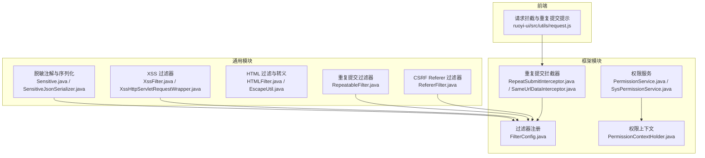
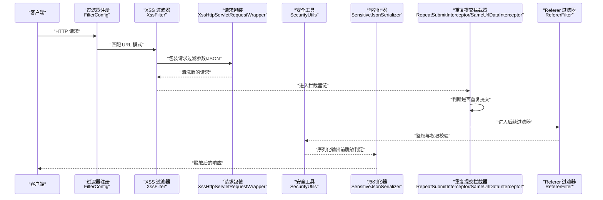
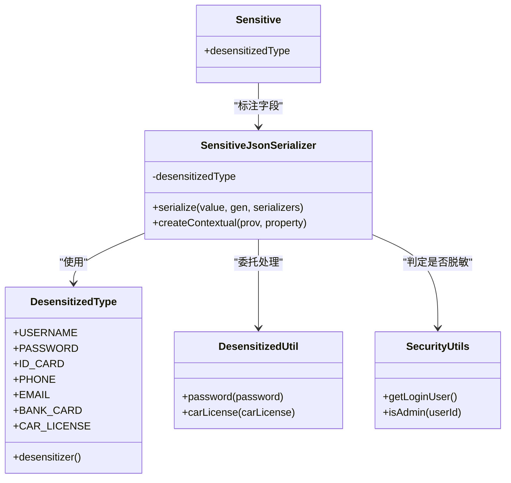
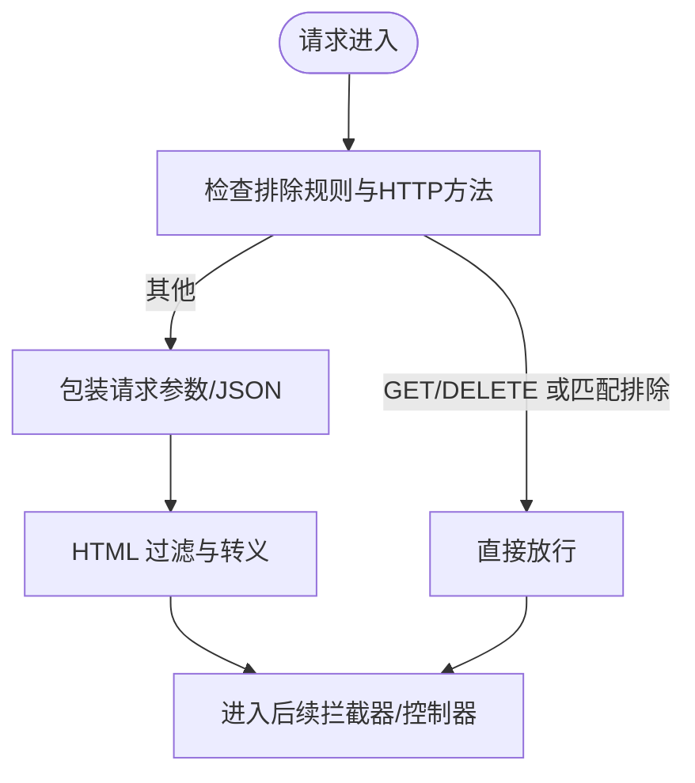
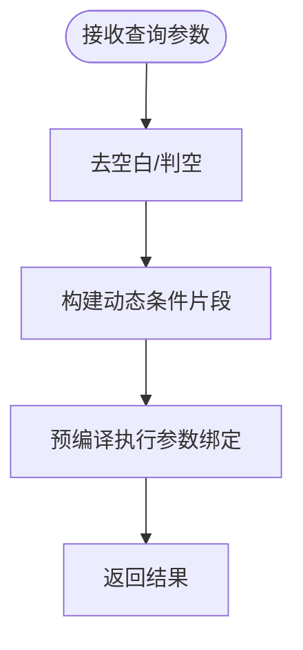
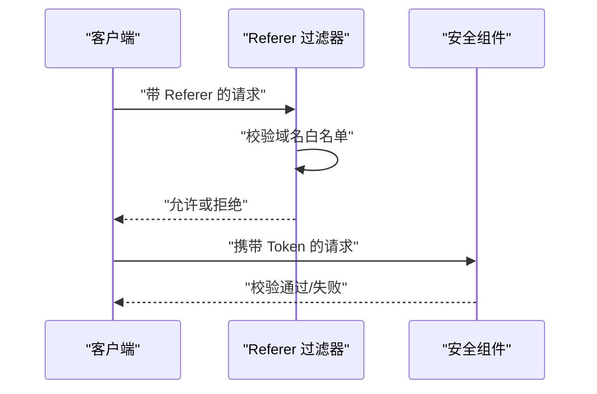
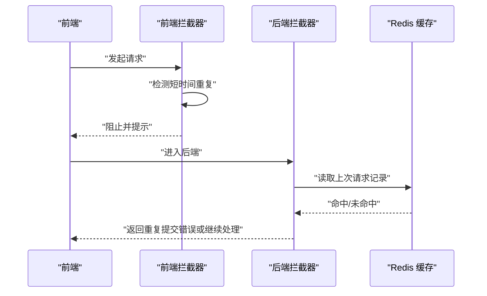
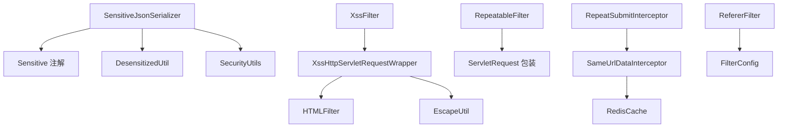

# 数据安全

<cite>
**本文引用的文件**
- [DesensitizedType.java](file://ruoyi-common/src/main/java/com/ruoyi/common/enums/DesensitizedType.java)
- [DesensitizedUtil.java](file://ruoyi-common/src/main/java/com/ruoyi/common/utils/DesensitizedUtil.java)
- [Sensitive.java](file://ruoyi-common/src/main/java/com/ruoyi/common/annotation/Sensitive.java)
- [SensitiveJsonSerializer.java](file://ruoyi-common/src/main/java/com/ruoyi/common/config/serializer/SensitiveJsonSerializer.java)
- [XssFilter.java](file://ruoyi-common/src/main/java/com/ruoyi/common/filter/XssFilter.java)
- [XssHttpServletRequestWrapper.java](file://ruoyi-common/src/main/java/com/ruoyi/common/filter/XssHttpServletRequestWrapper.java)
- [HTMLFilter.java](file://ruoyi-common/src/main/java/com/ruoyi/common/utils/html/HTMLFilter.java)
- [EscapeUtil.java](file://ruoyi-common/src/main/java/com/ruoyi/common/utils/html/EscapeUtil.java)
- [XssValidator.java](file://ruoyi-common/src/main/java/com/ruoyi/common/xss/XssValidator.java)
- [FilterConfig.java](file://ruoyi-framework/src/main/java/com/ruoyi/framework/config/FilterConfig.java)
- [RefererFilter.java](file://ruoyi-common/src/main/java/com/ruoyi/common/filter/RefererFilter.java)
- [RepeatSubmit.java](file://ruoyi-common/src/main/java/com/ruoyi/common/annotation/RepeatSubmit.java)
- [RepeatableFilter.java](file://ruoyi-common/src/main/java/com/ruoyi/common/filter/RepeatableFilter.java)
- [RepeatSubmitInterceptor.java](file://ruoyi-framework/src/main/java/com/ruoyi/framework/interceptor/RepeatSubmitInterceptor.java)
- [SameUrlDataInterceptor.java](file://ruoyi-framework/src/main/java/com/ruoyi/framework/interceptor/impl/SameUrlDataInterceptor.java)
- [SecurityUtils.java](file://ruoyi-common/src/main/java/com/ruoyi/common/utils/SecurityUtils.java)
- [LogUtils.java](file://ruoyi-common/src/main/java/com/ruoyi/common/utils/LogUtils.java)
- [PermissionService.java](file://ruoyi-framework/src/main/java/com/ruoyi/framework/web/service/PermissionService.java)
- [SysPermissionService.java](file://ruoyi-framework/src/main/java/com/ruoyi/framework/web/service/SysPermissionService.java)
- [PermissionContextHolder.java](file://ruoyi-framework/src/main/java/com/ruoyi/framework/security/context/PermissionContextHolder.java)
- [request.js](file://ruoyi-ui/src/utils/request.js)
</cite>

## 目录
1. [简介](#简介)
2. [项目结构](#项目结构)
3. [核心组件](#核心组件)
4. [架构总览](#架构总览)
5. [详细组件分析](#详细组件分析)
6. [依赖关系分析](#依赖关系分析)
7. [性能考量](#性能考量)
8. [故障排查指南](#故障排查指南)
9. [结论](#结论)
10. [附录](#附录)

## 简介
本文件面向港好住信息系统，系统性梳理并说明数据安全保护机制，重点覆盖以下方面：
- 敏感数据处理：用户信息脱敏算法、脱敏类型枚举、脱敏规则配置与序列化应用
- XSS 攻击防护：XSS 过滤器实现、HTML 转义机制、白名单验证、输入输出过滤策略
- SQL 注入防护：参数绑定、预编译语句、输入验证、数据库访问控制
- CSRF 攻击防护：Referer 验证、Token 机制、SameSite Cookie 设置
- 重复提交防护：请求去重、幂等性控制、分布式锁与前端拦截
- 数据加密存储、日志脱敏、访问控制等数据保护实践
- 数据安全配置指南、漏洞扫描方法、安全审计工具等管理建议

## 项目结构
围绕数据安全的关键代码分布在通用模块与框架模块中：
- ruoyi-common：脱敏注解与序列化、XSS 过滤器与 HTML 工具、重复提交过滤器、CSRF Referer 过滤器等
- ruoyi-framework：过滤器注册、拦截器、权限服务、安全上下文
- ruoyi-ui：前端请求拦截与重复提交提示

图表来源
- [FilterConfig.java:28-80](file://ruoyi-framework/src/main/java/com/ruoyi/framework/config/FilterConfig.java#L28-L80)
- [XssFilter.java:1-75](file://ruoyi-common/src/main/java/com/ruoyi/common/filter/XssFilter.java#L1-L75)
- [XssHttpServletRequestWrapper.java:1-111](file://ruoyi-common/src/main/java/com/ruoyi/common/filter/XssHttpServletRequestWrapper.java#L1-L111)
- [RepeatableFilter.java:1-52](file://ruoyi-common/src/main/java/com/ruoyi/common/filter/RepeatableFilter.java#L1-L52)
- [RefererFilter.java:1-77](file://ruoyi-common/src/main/java/com/ruoyi/common/filter/RefererFilter.java#L1-L77)
- [RepeatSubmitInterceptor.java:1-56](file://ruoyi-framework/src/main/java/com/ruoyi/framework/interceptor/RepeatSubmitInterceptor.java#L1-L56)
- [SameUrlDataInterceptor.java:1-110](file://ruoyi-framework/src/main/java/com/ruoyi/framework/interceptor/impl/SameUrlDataInterceptor.java#L1-L110)
- [PermissionService.java:1-80](file://ruoyi-framework/src/main/java/com/ruoyi/framework/web/service/PermissionService.java#L1-L80)
- [SysPermissionService.java:1-49](file://ruoyi-framework/src/main/java/com/ruoyi/framework/web/service/SysPermissionService.java#L1-L49)
- [PermissionContextHolder.java:1-27](file://ruoyi-framework/src/main/java/com/ruoyi/framework/security/context/PermissionContextHolder.java#L1-L27)
- [request.js:56-80](file://ruoyi-ui/src/utils/request.js#L56-L80)

章节来源
- [FilterConfig.java:28-80](file://ruoyi-framework/src/main/java/com/ruoyi/framework/config/FilterConfig.java#L28-L80)

## 核心组件
- 脱敏体系：通过注解驱动的序列化器在输出层对敏感字段进行脱敏，管理员身份可绕过
- XSS 防护：基于过滤器包装请求体与参数，统一进行 HTML 过滤与转义
- 重复提交：后端拦截器与前端拦截器共同实现，结合 Redis 缓存与时间窗口
- CSRF 防护：Referer 白名单校验与 Token 机制（结合框架安全组件）
- 访问控制：基于角色与权限的服务层校验，配合上下文传递

章节来源
- [Sensitive.java:1-24](file://ruoyi-common/src/main/java/com/ruoyi/common/annotation/Sensitive.java#L1-L24)
- [SensitiveJsonSerializer.java:1-67](file://ruoyi-common/src/main/java/com/ruoyi/common/config/serializer/SensitiveJsonSerializer.java#L1-L67)
- [DesensitizedType.java:1-59](file://ruoyi-common/src/main/java/com/ruoyi/common/enums/DesensitizedType.java#L1-L59)
- [DesensitizedUtil.java:1-49](file://ruoyi-common/src/main/java/com/ruoyi/common/utils/DesensitizedUtil.java#L1-L49)
- [XssFilter.java:1-75](file://ruoyi-common/src/main/java/com/ruoyi/common/filter/XssFilter.java#L1-L75)
- [XssHttpServletRequestWrapper.java:1-111](file://ruoyi-common/src/main/java/com/ruoyi/common/filter/XssHttpServletRequestWrapper.java#L1-L111)
- [HTMLFilter.java:1-224](file://ruoyi-common/src/main/java/com/ruoyi/common/utils/html/HTMLFilter.java#L1-L224)
- [EscapeUtil.java:1-168](file://ruoyi-common/src/main/java/com/ruoyi/common/utils/html/EscapeUtil.java#L1-L168)
- [RepeatableFilter.java:1-52](file://ruoyi-common/src/main/java/com/ruoyi/common/filter/RepeatableFilter.java#L1-L52)
- [RepeatSubmitInterceptor.java:1-56](file://ruoyi-framework/src/main/java/com/ruoyi/framework/interceptor/RepeatSubmitInterceptor.java#L1-L56)
- [SameUrlDataInterceptor.java:1-110](file://ruoyi-framework/src/main/java/com/ruoyi/framework/interceptor/impl/SameUrlDataInterceptor.java#L1-L110)
- [RefererFilter.java:1-77](file://ruoyi-common/src/main/java/com/ruoyi/common/filter/RefererFilter.java#L1-L77)
- [SecurityUtils.java:1-179](file://ruoyi-common/src/main/java/com/ruoyi/common/utils/SecurityUtils.java#L1-L179)
- [PermissionService.java:1-80](file://ruoyi-framework/src/main/java/com/ruoyi/framework/web/service/PermissionService.java#L1-L80)
- [SysPermissionService.java:1-49](file://ruoyi-framework/src/main/java/com/ruoyi/framework/web/service/SysPermissionService.java#L1-L49)
- [PermissionContextHolder.java:1-27](file://ruoyi-framework/src/main/java/com/ruoyi/framework/security/context/PermissionContextHolder.java#L1-L27)
- [request.js:56-80](file://ruoyi-ui/src/utils/request.js#L56-L80)

## 架构总览
下图展示从请求进入系统到响应输出的关键安全路径，包括 XSS 过滤、脱敏输出、重复提交与 CSRF 防护。

图表来源
- [FilterConfig.java:28-80](file://ruoyi-framework/src/main/java/com/ruoyi/framework/config/FilterConfig.java#L28-L80)
- [XssFilter.java:1-75](file://ruoyi-common/src/main/java/com/ruoyi/common/filter/XssFilter.java#L1-L75)
- [XssHttpServletRequestWrapper.java:1-111](file://ruoyi-common/src/main/java/com/ruoyi/common/filter/XssHttpServletRequestWrapper.java#L1-L111)
- [RepeatSubmitInterceptor.java:1-56](file://ruoyi-framework/src/main/java/com/ruoyi/framework/interceptor/RepeatSubmitInterceptor.java#L1-L56)
- [SameUrlDataInterceptor.java:1-110](file://ruoyi-framework/src/main/java/com/ruoyi/framework/interceptor/impl/SameUrlDataInterceptor.java#L1-L110)
- [RefererFilter.java:1-77](file://ruoyi-common/src/main/java/com/ruoyi/common/filter/RefererFilter.java#L1-L77)
- [SecurityUtils.java:1-179](file://ruoyi-common/src/main/java/com/ruoyi/common/utils/SecurityUtils.java#L1-L179)
- [SensitiveJsonSerializer.java:1-67](file://ruoyi-common/src/main/java/com/ruoyi/common/config/serializer/SensitiveJsonSerializer.java#L1-L67)

## 详细组件分析

### 敏感数据处理与脱敏
- 脱敏类型枚举：提供多种常见字段的脱敏模板，如姓名、身份证、手机号、邮箱、银行卡、车牌、密码等
- 脱敏工具类：针对特定格式（如密码、车牌）提供专用处理函数
- 脱敏注解与序列化器：通过 Jackson 序列化器在输出阶段按需脱敏；管理员身份可绕过
- 脱敏判定：基于当前登录用户身份，非管理员用户输出时触发脱敏

图表来源
- [DesensitizedType.java:1-59](file://ruoyi-common/src/main/java/com/ruoyi/common/enums/DesensitizedType.java#L1-L59)
- [DesensitizedUtil.java:1-49](file://ruoyi-common/src/main/java/com/ruoyi/common/utils/DesensitizedUtil.java#L1-L49)
- [Sensitive.java:1-24](file://ruoyi-common/src/main/java/com/ruoyi/common/annotation/Sensitive.java#L1-L24)
- [SensitiveJsonSerializer.java:1-67](file://ruoyi-common/src/main/java/com/ruoyi/common/config/serializer/SensitiveJsonSerializer.java#L1-L67)
- [SecurityUtils.java:1-179](file://ruoyi-common/src/main/java/com/ruoyi/common/utils/SecurityUtils.java#L1-L179)

章节来源
- [DesensitizedType.java:1-59](file://ruoyi-common/src/main/java/com/ruoyi/common/enums/DesensitizedType.java#L1-L59)
- [DesensitizedUtil.java:1-49](file://ruoyi-common/src/main/java/com/ruoyi/common/utils/DesensitizedUtil.java#L1-L49)
- [Sensitive.java:1-24](file://ruoyi-common/src/main/java/com/ruoyi/common/annotation/Sensitive.java#L1-L24)
- [SensitiveJsonSerializer.java:1-67](file://ruoyi-common/src/main/java/com/ruoyi/common/config/serializer/SensitiveJsonSerializer.java#L1-L67)
- [SecurityUtils.java:1-179](file://ruoyi-common/src/main/java/com/ruoyi/common/utils/SecurityUtils.java#L1-L179)

### XSS 攻击防护
- 过滤器注册：根据配置启用/禁用 XSS 过滤，支持排除 URL 模式
- 请求包装：对 JSON 与表单参数进行清洗，移除潜在脚本与危险标签
- HTML 过滤：白名单机制，仅允许受控标签与属性，严格限制协议与实体
- 输入/输出过滤：统一在请求进入与响应输出阶段进行处理

图表来源
- [XssFilter.java:1-75](file://ruoyi-common/src/main/java/com/ruoyi/common/filter/XssFilter.java#L1-L75)
- [XssHttpServletRequestWrapper.java:1-111](file://ruoyi-common/src/main/java/com/ruoyi/common/filter/XssHttpServletRequestWrapper.java#L1-L111)
- [HTMLFilter.java:1-224](file://ruoyi-common/src/main/java/com/ruoyi/common/utils/html/HTMLFilter.java#L1-L224)
- [EscapeUtil.java:1-168](file://ruoyi-common/src/main/java/com/ruoyi/common/utils/html/EscapeUtil.java#L1-L168)

章节来源
- [FilterConfig.java:28-49](file://ruoyi-framework/src/main/java/com/ruoyi/framework/config/FilterConfig.java#L28-L49)
- [XssFilter.java:1-75](file://ruoyi-common/src/main/java/com/ruoyi/common/filter/XssFilter.java#L1-L75)
- [XssHttpServletRequestWrapper.java:1-111](file://ruoyi-common/src/main/java/com/ruoyi/common/filter/XssHttpServletRequestWrapper.java#L1-L111)
- [HTMLFilter.java:1-224](file://ruoyi-common/src/main/java/com/ruoyi/common/utils/html/HTMLFilter.java#L1-L224)
- [EscapeUtil.java:1-168](file://ruoyi-common/src/main/java/com/ruoyi/common/utils/html/EscapeUtil.java#L1-L168)

### SQL 注入防护
- 参数绑定与预编译：MyBatis XML 中广泛采用参数占位符与条件片段，避免拼接 SQL
- 输入验证：在查询处对字符串参数进行非空与空白处理，减少注入风险
- 数据库访问控制：通过权限服务与上下文控制用户可见范围，降低越权访问风险

图表来源
- [mapper.xml.vm:29-49](file://ruoyi-generator/src/main/resources/vm/xml/mapper.xml.vm#L29-L49)
- [SysConfigMapper.xml:32-67](file://ruoyi-system/src/main/resources/mapper/system/SysConfigMapper.xml#L32-L67)
- [PermissionService.java:1-80](file://ruoyi-framework/src/main/java/com/ruoyi/framework/web/service/PermissionService.java#L1-L80)
- [SysPermissionService.java:1-49](file://ruoyi-framework/src/main/java/com/ruoyi/framework/web/service/SysPermissionService.java#L1-L49)
- [PermissionContextHolder.java:1-27](file://ruoyi-framework/src/main/java/com/ruoyi/framework/security/context/PermissionContextHolder.java#L1-L27)

章节来源
- [mapper.xml.vm:29-49](file://ruoyi-generator/src/main/resources/vm/xml/mapper.xml.vm#L29-L49)
- [SysConfigMapper.xml:32-67](file://ruoyi-system/src/main/resources/mapper/system/SysConfigMapper.xml#L32-L67)
- [PermissionService.java:1-80](file://ruoyi-framework/src/main/java/com/ruoyi/framework/web/service/PermissionService.java#L1-L80)
- [SysPermissionService.java:1-49](file://ruoyi-framework/src/main/java/com/ruoyi/framework/web/service/SysPermissionService.java#L1-L49)
- [PermissionContextHolder.java:1-27](file://ruoyi-framework/src/main/java/com/ruoyi/framework/security/context/PermissionContextHolder.java#L1-L27)

### CSRF 攻击防护
- Referer 验证：仅允许来自白名单域名的来源请求，未携带或不在白名单则拒绝
- Token 机制：结合框架安全组件（如 JWT、CSRF Token），在表单与接口中进行校验
- SameSite Cookie：建议在生产环境配置 SameSite 属性，降低跨站请求风险

图表来源
- [RefererFilter.java:1-77](file://ruoyi-common/src/main/java/com/ruoyi/common/filter/RefererFilter.java#L1-L77)
- [FilterConfig.java:52-66](file://ruoyi-framework/src/main/java/com/ruoyi/framework/config/FilterConfig.java#L52-L66)

章节来源
- [RefererFilter.java:1-77](file://ruoyi-common/src/main/java/com/ruoyi/common/filter/RefererFilter.java#L1-L77)
- [FilterConfig.java:52-66](file://ruoyi-framework/src/main/java/com/ruoyi/framework/config/FilterConfig.java#L52-L66)

### 重复提交防护
- 后端拦截器：基于 Redis 缓存记录上次请求的 URL、参数与时间，限定时间窗口内重复即拦截
- 前端拦截器：在短时间内重复点击提交时，阻止重复请求并提示用户
- 幂等性控制：结合 Token 与业务幂等键，确保多次提交只产生一次业务效果

图表来源
- [RepeatSubmitInterceptor.java:1-56](file://ruoyi-framework/src/main/java/com/ruoyi/framework/interceptor/RepeatSubmitInterceptor.java#L1-L56)
- [SameUrlDataInterceptor.java:1-110](file://ruoyi-framework/src/main/java/com/ruoyi/framework/interceptor/impl/SameUrlDataInterceptor.java#L1-L110)
- [RepeatableFilter.java:1-52](file://ruoyi-common/src/main/java/com/ruoyi/common/filter/RepeatableFilter.java#L1-L52)
- [RepeatSubmit.java:1-32](file://ruoyi-common/src/main/java/com/ruoyi/common/annotation/RepeatSubmit.java#L1-L32)
- [request.js:56-80](file://ruoyi-ui/src/utils/request.js#L56-L80)

章节来源
- [RepeatSubmitInterceptor.java:1-56](file://ruoyi-framework/src/main/java/com/ruoyi/framework/interceptor/RepeatSubmitInterceptor.java#L1-L56)
- [SameUrlDataInterceptor.java:1-110](file://ruoyi-framework/src/main/java/com/ruoyi/framework/interceptor/impl/SameUrlDataInterceptor.java#L1-L110)
- [RepeatableFilter.java:1-52](file://ruoyi-common/src/main/java/com/ruoyi/common/filter/RepeatableFilter.java#L1-L52)
- [RepeatSubmit.java:1-32](file://ruoyi-common/src/main/java/com/ruoyi/common/annotation/RepeatSubmit.java#L1-L32)
- [request.js:56-80](file://ruoyi-ui/src/utils/request.js#L56-L80)

### 数据加密存储与日志脱敏
- 密码加密：使用强哈希算法对密码进行加密存储，提供匹配校验
- 日志脱敏：日志工具提供块级输出封装，便于在日志中统一处理敏感信息
- 访问控制：权限服务与上下文结合，确保用户仅能访问其授权范围内的资源

章节来源
- [SecurityUtils.java:92-115](file://ruoyi-common/src/main/java/com/ruoyi/common/utils/SecurityUtils.java#L92-L115)
- [LogUtils.java:1-19](file://ruoyi-common/src/main/java/com/ruoyi/common/utils/LogUtils.java#L1-L19)
- [PermissionService.java:1-80](file://ruoyi-framework/src/main/java/com/ruoyi/framework/web/service/PermissionService.java#L1-L80)
- [SysPermissionService.java:1-49](file://ruoyi-framework/src/main/java/com/ruoyi/framework/web/service/SysPermissionService.java#L1-L49)
- [PermissionContextHolder.java:1-27](file://ruoyi-framework/src/main/java/com/ruoyi/framework/security/context/PermissionContextHolder.java#L1-L27)

## 依赖关系分析
- 组件耦合：脱敏序列化器依赖注解与安全工具；XSS 过滤器依赖包装器与 HTML 过滤器；重复提交拦截器依赖 Redis 与请求包装；CSRF 依赖 Referer 过滤器与安全上下文
- 外部依赖：Spring Security、Redis、MyBatis、FastJSON、Apache Commons IO 等

图表来源
- [SensitiveJsonSerializer.java:1-67](file://ruoyi-common/src/main/java/com/ruoyi/common/config/serializer/SensitiveJsonSerializer.java#L1-L67)
- [Sensitive.java:1-24](file://ruoyi-common/src/main/java/com/ruoyi/common/annotation/Sensitive.java#L1-L24)
- [DesensitizedUtil.java:1-49](file://ruoyi-common/src/main/java/com/ruoyi/common/utils/DesensitizedUtil.java#L1-L49)
- [SecurityUtils.java:1-179](file://ruoyi-common/src/main/java/com/ruoyi/common/utils/SecurityUtils.java#L1-L179)
- [XssFilter.java:1-75](file://ruoyi-common/src/main/java/com/ruoyi/common/filter/XssFilter.java#L1-L75)
- [XssHttpServletRequestWrapper.java:1-111](file://ruoyi-common/src/main/java/com/ruoyi/common/filter/XssHttpServletRequestWrapper.java#L1-L111)
- [HTMLFilter.java:1-224](file://ruoyi-common/src/main/java/com/ruoyi/common/utils/html/HTMLFilter.java#L1-L224)
- [EscapeUtil.java:1-168](file://ruoyi-common/src/main/java/com/ruoyi/common/utils/html/EscapeUtil.java#L1-L168)
- [RepeatableFilter.java:1-52](file://ruoyi-common/src/main/java/com/ruoyi/common/filter/RepeatableFilter.java#L1-L52)
- [RepeatSubmitInterceptor.java:1-56](file://ruoyi-framework/src/main/java/com/ruoyi/framework/interceptor/RepeatSubmitInterceptor.java#L1-L56)
- [SameUrlDataInterceptor.java:1-110](file://ruoyi-framework/src/main/java/com/ruoyi/framework/interceptor/impl/SameUrlDataInterceptor.java#L1-L110)
- [RefererFilter.java:1-77](file://ruoyi-common/src/main/java/com/ruoyi/common/filter/RefererFilter.java#L1-L77)
- [FilterConfig.java:28-80](file://ruoyi-framework/src/main/java/com/ruoyi/framework/config/FilterConfig.java#L28-L80)

## 性能考量
- XSS 过滤与 HTML 过滤：对 JSON 与表单参数进行清洗，建议在高并发场景下优化正则表达式与缓存热点字段
- 脱敏序列化：仅在输出阶段生效，避免对业务对象做重复脱敏，注意序列化器上下文创建成本
- 重复提交拦截：Redis 写入与读取存在网络延迟，建议合理设置过期时间与键空间设计
- 权限校验：权限集合与匹配应尽量避免复杂正则，优先使用集合查找

## 故障排查指南
- XSS 过滤误伤：检查排除 URL 配置与方法白名单，确认包装器是否正确识别 JSON 请求
- 脱敏异常：确认注解是否正确标注字段、序列化器上下文是否获取到当前用户、管理员身份判定逻辑
- 重复提交误判：核对时间窗口配置、Redis 键命名与过期策略、前端拦截器的时间阈值
- CSRF 拒绝：检查 Referer 域名白名单配置、SameSite Cookie 设置与 Token 传递方式
- 权限不足：核对用户角色与权限集合、权限上下文传递、以及服务层权限校验逻辑

章节来源
- [XssFilter.java:1-75](file://ruoyi-common/src/main/java/com/ruoyi/common/filter/XssFilter.java#L1-L75)
- [XssHttpServletRequestWrapper.java:1-111](file://ruoyi-common/src/main/java/com/ruoyi/common/filter/XssHttpServletRequestWrapper.java#L1-L111)
- [SensitiveJsonSerializer.java:1-67](file://ruoyi-common/src/main/java/com/ruoyi/common/config/serializer/SensitiveJsonSerializer.java#L1-L67)
- [SameUrlDataInterceptor.java:1-110](file://ruoyi-framework/src/main/java/com/ruoyi/framework/interceptor/impl/SameUrlDataInterceptor.java#L1-L110)
- [RefererFilter.java:1-77](file://ruoyi-common/src/main/java/com/ruoyi/common/filter/RefererFilter.java#L1-L77)
- [PermissionService.java:1-80](file://ruoyi-framework/src/main/java/com/ruoyi/framework/web/service/PermissionService.java#L1-L80)

## 结论
港好住信息系统通过“输出层脱敏 + 请求层过滤 + 拦截层防护 + 权限控制”的多层安全策略，有效降低了 XSS、SQL 注入、CSRF 与重复提交等常见风险。建议在生产环境中完善 Token 与 Cookie 安全配置，持续监控与审计日志，定期进行漏洞扫描与渗透测试，确保整体数据安全防线稳定可靠。

## 附录
- 数据安全配置指南
  - XSS：启用过滤器、配置排除 URL、调整白名单
  - CSRF：配置 Referer 白名单、启用 Token 校验、设置 SameSite Cookie
  - 重复提交：合理设置时间窗口、完善 Redis 缓存策略、前端拦截提示
  - 脱敏：在模型字段上标注脱敏注解、区分管理员与普通用户
- 漏洞扫描与安全审计
  - 使用静态分析工具（如 SpotBugs、PMD）与动态扫描（如 OWASP ZAP）
  - 定期对数据库访问层进行 SQL 注入专项扫描
  - 对第三方依赖进行版本安全检查与升级