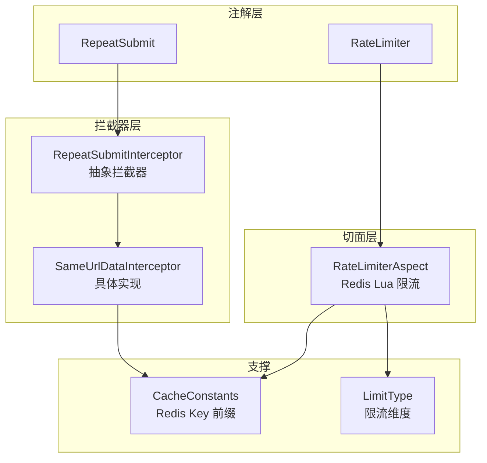
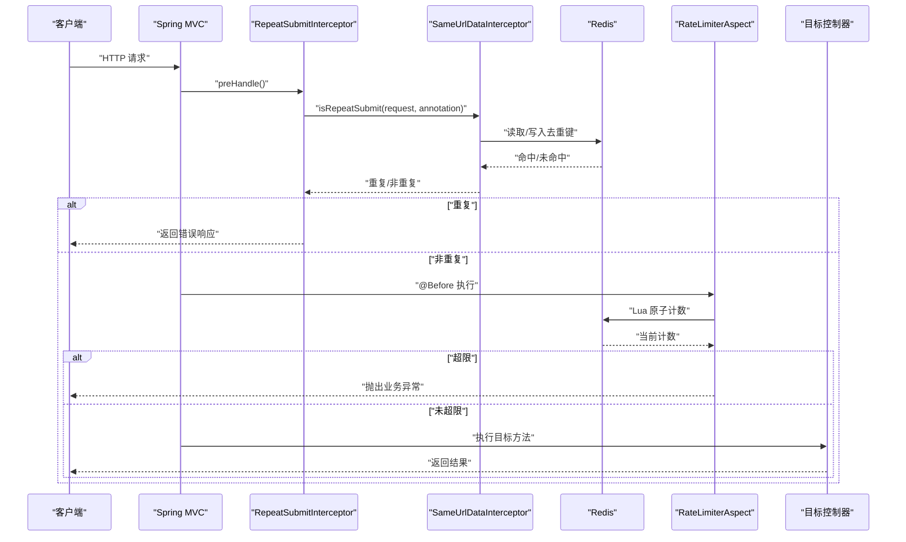
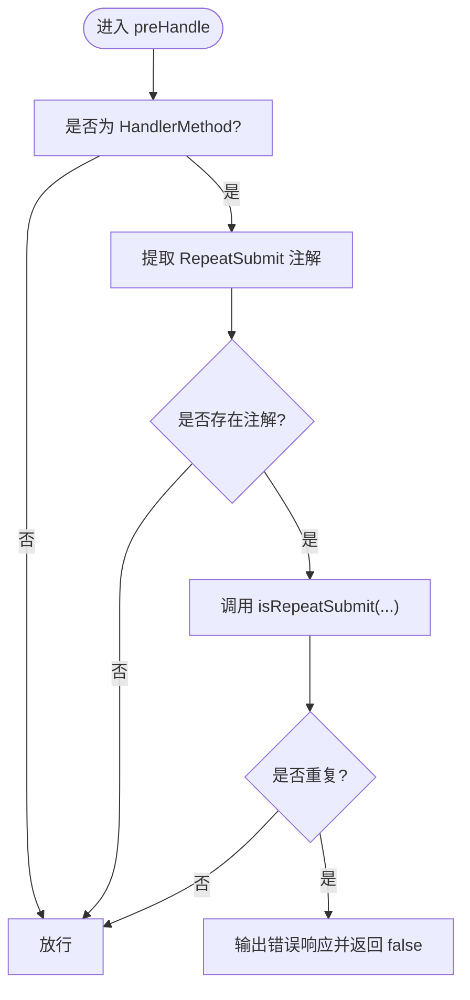
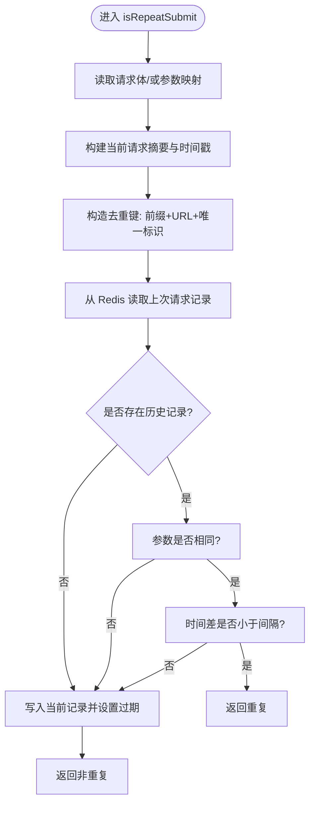
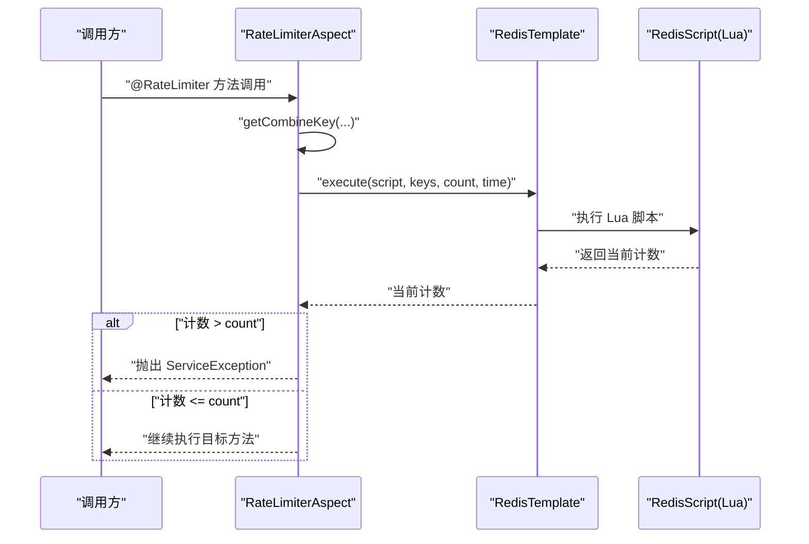
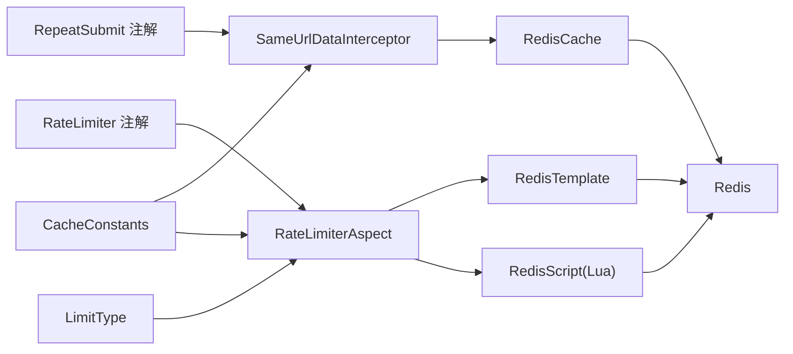

# 请求重复与防刷防护

<cite>
**本文引用的文件**
- [RepeatSubmitInterceptor.java](file://ruoyi-framework/src/main/java/com/ruoyi/framework/interceptor/RepeatSubmitInterceptor.java)
- [SameUrlDataInterceptor.java](file://ruoyi-framework/src/main/java/com/ruoyi/framework/interceptor/impl/SameUrlDataInterceptor.java)
- [RepeatSubmit.java](file://ruoyi-common/src/main/java/com/ruoyi/common/annotation/RepeatSubmit.java)
- [RateLimiter.java](file://ruoyi-common/src/main/java/com/ruoyi/common/annotation/RateLimiter.java)
- [RateLimiterAspect.java](file://ruoyi-framework/src/main/java/com/ruoyi/framework/aspectj/RateLimiterAspect.java)
- [LimitType.java](file://ruoyi-common/src/main/java/com/ruoyi/common/enums/LimitType.java)
- [CacheConstants.java](file://ruoyi-common/src/main/java/com/ruoyi/common/constant/CacheConstants.java)
</cite>

## 目录
1. [简介](#简介)
2. [项目结构](#项目结构)
3. [核心组件](#核心组件)
4. [架构总览](#架构总览)
5. [详细组件分析](#详细组件分析)
6. [依赖关系分析](#依赖关系分析)
7. [性能考量](#性能考量)
8. [故障排查指南](#故障排查指南)
9. [结论](#结论)
10. [附录](#附录)

## 简介
本文件系统化梳理港好住信息系统中的“请求重复与防刷防护”机制，重点围绕以下能力展开：
- 重复提交拦截器 RepeatSubmitInterceptor 的实现原理：请求去重算法、幂等性控制思路、分布式锁机制说明
- 相同 URL 数据拦截器 SameUrlDataInterceptor 的防刷策略：请求频率限制、IP 访问控制、用户行为分析
- 重复提交注解 RepeatSubmit 与限流注解 RateLimiter 的使用方法：参数配置、生效范围、异常处理
- 限流切面 RateLimiterAspect 的实现机制：Lua 脚本计数、滑动窗口/令牌桶近似、并发控制
- 防刷效果监控、性能影响评估与安全策略调优建议

## 项目结构
本节聚焦与防重复、防刷相关的核心代码位置与职责划分：
- 拦截器层
  - RepeatSubmitInterceptor：抽象拦截器，统一入口与注解解析
  - SameUrlDataInterceptor：具体实现，基于 Redis 的“相同 URL+参数+时间窗口”去重
- 注解层
  - RepeatSubmit：声明式防重复提交
  - RateLimiter：声明式限流
- 切面层
  - RateLimiterAspect：基于 Redis Lua 脚本的限流切面
- 常量与枚举
  - CacheConstants：Redis Key 前缀
  - LimitType：限流维度（默认/按 IP）

图表来源
- [RepeatSubmitInterceptor.java:14-56](file://ruoyi-framework/src/main/java/com/ruoyi/framework/interceptor/RepeatSubmitInterceptor.java#L14-L56)
- [SameUrlDataInterceptor.java:19-111](file://ruoyi-framework/src/main/java/com/ruoyi/framework/interceptor/impl/SameUrlDataInterceptor.java#L19-L111)
- [RepeatSubmit.java:10-32](file://ruoyi-common/src/main/java/com/ruoyi/common/annotation/RepeatSubmit.java#L10-L32)
- [RateLimiter.java:11-41](file://ruoyi-common/src/main/java/com/ruoyi/common/annotation/RateLimiter.java#L11-L41)
- [RateLimiterAspect.java:22-90](file://ruoyi-framework/src/main/java/com/ruoyi/framework/aspectj/RateLimiterAspect.java#L22-L90)
- [CacheConstants.java:30-44](file://ruoyi-common/src/main/java/com/ruoyi/common/constant/CacheConstants.java#L30-L44)
- [LimitType.java:9-21](file://ruoyi-common/src/main/java/com/ruoyi/common/enums/LimitType.java#L9-L21)

章节来源
- [RepeatSubmitInterceptor.java:14-56](file://ruoyi-framework/src/main/java/com/ruoyi/framework/interceptor/RepeatSubmitInterceptor.java#L14-L56)
- [SameUrlDataInterceptor.java:19-111](file://ruoyi-framework/src/main/java/com/ruoyi/framework/interceptor/impl/SameUrlDataInterceptor.java#L19-L111)
- [RepeatSubmit.java:10-32](file://ruoyi-common/src/main/java/com/ruoyi/common/annotation/RepeatSubmit.java#L10-L32)
- [RateLimiter.java:11-41](file://ruoyi-common/src/main/java/com/ruoyi/common/annotation/RateLimiter.java#L11-L41)
- [RateLimiterAspect.java:22-90](file://ruoyi-framework/src/main/java/com/ruoyi/framework/aspectj/RateLimiterAspect.java#L22-L90)
- [CacheConstants.java:30-44](file://ruoyi-common/src/main/java/com/ruoyi/common/constant/CacheConstants.java#L30-L44)
- [LimitType.java:9-21](file://ruoyi-common/src/main/java/com/ruoyi/common/enums/LimitType.java#L9-L21)

## 核心组件
- RepeatSubmitInterceptor：统一处理标注了 RepeatSubmit 的控制器方法，通过 isRepeatSubmit 抽象方法交由子类实现具体去重逻辑；若检测到重复提交，直接返回错误响应并中断后续处理
- SameUrlDataInterceptor：基于 Redis 的“相同 URL+请求头唯一标识+参数体”的组合键，记录最近一次请求的时间戳与参数摘要；在指定时间窗口内若参数与时间均一致，则判定为重复提交
- RepeatSubmit 注解：提供时间间隔与提示消息两个关键参数，用于控制重复提交的容忍窗口与错误提示
- RateLimiter 注解：提供限流键、时间窗口、阈值与限流维度（默认/按 IP）四个参数，用于声明式限流
- RateLimiterAspect：在目标方法执行前，计算组合键，调用 Redis Lua 脚本进行原子计数，超过阈值抛出业务异常，否则放行
- CacheConstants：提供重复提交与限流的 Redis Key 前缀，确保命名规范与隔离
- LimitType：定义限流维度，支持全局与按 IP 两种模式

章节来源
- [RepeatSubmitInterceptor.java:14-56](file://ruoyi-framework/src/main/java/com/ruoyi/framework/interceptor/RepeatSubmitInterceptor.java#L14-L56)
- [SameUrlDataInterceptor.java:19-111](file://ruoyi-framework/src/main/java/com/ruoyi/framework/interceptor/impl/SameUrlDataInterceptor.java#L19-L111)
- [RepeatSubmit.java:22-31](file://ruoyi-common/src/main/java/com/ruoyi/common/annotation/RepeatSubmit.java#L22-L31)
- [RateLimiter.java:24-40](file://ruoyi-common/src/main/java/com/ruoyi/common/annotation/RateLimiter.java#L24-L40)
- [RateLimiterAspect.java:49-88](file://ruoyi-framework/src/main/java/com/ruoyi/framework/aspectj/RateLimiterAspect.java#L49-L88)
- [CacheConstants.java:30-44](file://ruoyi-common/src/main/java/com/ruoyi/common/constant/CacheConstants.java#L30-L44)
- [LimitType.java:9-21](file://ruoyi-common/src/main/java/com/ruoyi/common/enums/LimitType.java#L9-L21)

## 架构总览
下图展示从请求进入 Web 容器到拦截与限流处理的关键路径。

图表来源
- [RepeatSubmitInterceptor.java:22-45](file://ruoyi-framework/src/main/java/com/ruoyi/framework/interceptor/RepeatSubmitInterceptor.java#L22-L45)
- [SameUrlDataInterceptor.java:40-85](file://ruoyi-framework/src/main/java/com/ruoyi/framework/interceptor/impl/SameUrlDataInterceptor.java#L40-L85)
- [RateLimiterAspect.java:49-74](file://ruoyi-framework/src/main/java/com/ruoyi/framework/aspectj/RateLimiterAspect.java#L49-L74)

## 详细组件分析

### 重复提交拦截器 RepeatSubmitInterceptor
- 设计要点
  - 统一入口：拦截所有 HandlerMethod，提取 RepeatSubmit 注解
  - 抽象实现：isRepeatSubmit 由子类实现，便于扩展不同去重策略
  - 快速失败：一旦判定重复，立即输出错误响应并阻断后续处理
- 关键流程
  - 解析注解参数（间隔时间、提示消息）
  - 调用子类 isRepeatSubmit 进行判定
  - 返回布尔值决定是否继续

图表来源
- [RepeatSubmitInterceptor.java:22-45](file://ruoyi-framework/src/main/java/com/ruoyi/framework/interceptor/RepeatSubmitInterceptor.java#L22-L45)

章节来源
- [RepeatSubmitInterceptor.java:14-56](file://ruoyi-framework/src/main/java/com/ruoyi/framework/interceptor/RepeatSubmitInterceptor.java#L14-L56)

### 相同 URL 数据拦截器 SameUrlDataInterceptor
- 防刷策略
  - 去重键构成：CacheConstants.REPEAT_SUBMIT_KEY + 请求 URL + 请求头唯一标识（如令牌头）
  - 参数比较：对请求体或表单参数进行序列化摘要对比
  - 时间窗口：以毫秒为单位的间隔时间，小于该间隔即视为重复
  - 存储介质：Redis，键有效期由注解 interval 决定
- 幂等性控制思路
  - 通过“URL+唯一标识+参数摘要+时间窗口”的强约束，降低重复提交概率
  - 与业务幂等设计结合：例如订单号、外部流水号等业务级幂等键可作为补充
- 分布式锁机制说明
  - 当前实现基于 Redis 单点操作与过期时间，不涉及分布式锁（如 SET key value NX EX ttl）
  - 若需更强一致性，可在 Redis 上引入 RedLock 或使用 Lua 原子脚本实现带 CAS 的去重更新

图表来源
- [SameUrlDataInterceptor.java:40-85](file://ruoyi-framework/src/main/java/com/ruoyi/framework/interceptor/impl/SameUrlDataInterceptor.java#L40-L85)
- [CacheConstants.java:30-34](file://ruoyi-common/src/main/java/com/ruoyi/common/constant/CacheConstants.java#L30-L34)

章节来源
- [SameUrlDataInterceptor.java:19-111](file://ruoyi-framework/src/main/java/com/ruoyi/framework/interceptor/impl/SameUrlDataInterceptor.java#L19-L111)
- [CacheConstants.java:30-34](file://ruoyi-common/src/main/java/com/ruoyi/common/constant/CacheConstants.java#L30-L34)

### 重复提交注解 RepeatSubmit
- 参数说明
  - interval：时间间隔（毫秒），用于判定重复的时间窗口
  - message：重复提交时的提示消息
- 使用建议
  - 对高风险写操作（如支付、下单、退款）建议设置较短间隔
  - 对批量导入、报表导出等长耗时操作可适当放宽间隔
- 生效范围
  - 仅对标注于控制器方法上的 RepeatSubmit 生效
  - 与拦截器链配合，先于业务执行前进行判定

章节来源
- [RepeatSubmit.java:22-31](file://ruoyi-common/src/main/java/com/ruoyi/common/annotation/RepeatSubmit.java#L22-L31)

### 限流注解 RateLimiter 与切面 RateLimiterAspect
- 参数说明
  - key：限流键前缀，默认使用 CacheConstants.RATE_LIMIT_KEY
  - time：时间窗口（秒）
  - count：允许的请求数
  - limitType：限流维度（默认/按 IP）
- 组合键生成
  - 基于注解 key + 限流维度 + 方法签名（类名+方法名）生成唯一键
  - 当 limitType=IP 时，附加客户端 IP
- 实现机制
  - 使用 Redis Lua 脚本进行原子计数，避免竞态
  - 返回当前窗口内的累计次数，超过 count 则抛出业务异常
- 异常处理
  - 超限时抛出 ServiceException，提示“访问过于频繁，请稍候再试”
  - 其他异常统一包装为运行时异常

图表来源
- [RateLimiterAspect.java:49-74](file://ruoyi-framework/src/main/java/com/ruoyi/framework/aspectj/RateLimiterAspect.java#L49-L74)
- [RateLimiterAspect.java:76-88](file://ruoyi-framework/src/main/java/com/ruoyi/framework/aspectj/RateLimiterAspect.java#L76-L88)
- [RateLimiter.java:24-40](file://ruoyi-common/src/main/java/com/ruoyi/common/annotation/RateLimiter.java#L24-L40)
- [LimitType.java:9-21](file://ruoyi-common/src/main/java/com/ruoyi/common/enums/LimitType.java#L9-L21)
- [CacheConstants.java:35-38](file://ruoyi-common/src/main/java/com/ruoyi/common/constant/CacheConstants.java#L35-L38)

章节来源
- [RateLimiter.java:11-41](file://ruoyi-common/src/main/java/com/ruoyi/common/annotation/RateLimiter.java#L11-L41)
- [RateLimiterAspect.java:22-90](file://ruoyi-framework/src/main/java/com/ruoyi/framework/aspectj/RateLimiterAspect.java#L22-L90)
- [LimitType.java:9-21](file://ruoyi-common/src/main/java/com/ruoyi/common/enums/LimitType.java#L9-L21)
- [CacheConstants.java:35-38](file://ruoyi-common/src/main/java/com/ruoyi/common/constant/CacheConstants.java#L35-L38)

## 依赖关系分析
- 组件耦合
  - SameUrlDataInterceptor 依赖 RedisCache 与 CacheConstants
  - RateLimiterAspect 依赖 RedisTemplate、RedisScript 与 LimitType
  - 两者均通过注解驱动，与业务方法解耦
- 外部依赖
  - Redis：用于去重键与限流计数
  - Spring AOP/AspectJ：用于切面织入
- 潜在循环依赖
  - 当前结构无明显循环依赖；注意避免在拦截器中直接调用被限流的目标方法

图表来源
- [SameUrlDataInterceptor.java:36-37](file://ruoyi-framework/src/main/java/com/ruoyi/framework/interceptor/impl/SameUrlDataInterceptor.java#L36-L37)
- [RateLimiterAspect.java:33-47](file://ruoyi-framework/src/main/java/com/ruoyi/framework/aspectj/RateLimiterAspect.java#L33-L47)
- [LimitType.java:9-21](file://ruoyi-common/src/main/java/com/ruoyi/common/enums/LimitType.java#L9-L21)
- [CacheConstants.java:30-44](file://ruoyi-common/src/main/java/com/ruoyi/common/constant/CacheConstants.java#L30-L44)

章节来源
- [SameUrlDataInterceptor.java:36-37](file://ruoyi-framework/src/main/java/com/ruoyi/framework/interceptor/impl/SameUrlDataInterceptor.java#L36-L37)
- [RateLimiterAspect.java:33-47](file://ruoyi-framework/src/main/java/com/ruoyi/framework/aspectj/RateLimiterAspect.java#L33-L47)
- [LimitType.java:9-21](file://ruoyi-common/src/main/java/com/ruoyi/common/enums/LimitType.java#L9-L21)
- [CacheConstants.java:30-44](file://ruoyi-common/src/main/java/com/ruoyi/common/constant/CacheConstants.java#L30-L44)

## 性能考量
- Redis 访问
  - 去重与限流均依赖 Redis，网络延迟与 QPS 是主要瓶颈
  - 建议：合理设置过期时间与窗口大小，避免热键集中；必要时对热点键做分片
- Lua 脚本
  - 限流采用 Lua 原子计数，减少往返；仍需关注脚本复杂度与键数量
- 并发控制
  - 限流为单键原子计数，天然具备并发安全性；重复提交依赖 Redis 单点写入与过期
- CPU 与内存
  - 参数摘要与 Map 序列化存在少量 CPU/内存开销；对高频接口建议开启参数摘要缓存或更严格的限流

[本节为通用性能讨论，无需列出章节来源]

## 故障排查指南
- 重复提交误判
  - 症状：正常请求被拦截
  - 排查：确认请求头唯一标识是否正确传递；核对 URL 是否一致；检查时间窗口是否过短
  - 参考路径：[SameUrlDataInterceptor.java:63-66](file://ruoyi-framework/src/main/java/com/ruoyi/framework/interceptor/impl/SameUrlDataInterceptor.java#L63-L66)
- 限流误伤
  - 症状：正常流量被限流
  - 排查：确认组合键是否唯一；limitType 是否按预期（默认 vs IP）；time/count 设置是否合理
  - 参考路径：[RateLimiterAspect.java:76-88](file://ruoyi-framework/src/main/java/com/ruoyi/framework/aspectj/RateLimiterAspect.java#L76-L88)
- Redis 不可用
  - 症状：限流/去重失败
  - 排查：检查 Redis 连接、权限、容量；必要时降级为本地缓存或关闭限流
- 异常抛出
  - 症状：业务异常或运行时异常
  - 排查：区分 ServiceException（业务限流）与 RuntimeException（系统异常）

章节来源
- [SameUrlDataInterceptor.java:63-66](file://ruoyi-framework/src/main/java/com/ruoyi/framework/interceptor/impl/SameUrlDataInterceptor.java#L63-L66)
- [RateLimiterAspect.java:60-73](file://ruoyi-framework/src/main/java/com/ruoyi/framework/aspectj/RateLimiterAspect.java#L60-L73)
- [RateLimiterAspect.java:76-88](file://ruoyi-framework/src/main/java/com/ruoyi/framework/aspectj/RateLimiterAspect.java#L76-L88)

## 结论
港好住信息系统的防重复与防刷体系以“注解 + 拦截器/切面 + Redis”为核心，实现了：
- 基于 URL+参数+时间窗口的重复提交拦截
- 基于 Redis Lua 的原子限流控制
- 可配置的限流维度（默认/按 IP）
在实际部署中，建议结合业务场景优化参数、监控命中率与延迟，并在高峰期适度放宽限流阈值，保障用户体验与系统稳定。

[本节为总结性内容，无需列出章节来源]

## 附录

### 使用方法与最佳实践
- 在控制器方法上添加 RepeatSubmit 注解，设置合理的 interval 与 message
  - 参考路径：[RepeatSubmit.java:22-31](file://ruoyi-common/src/main/java/com/ruoyi/common/annotation/RepeatSubmit.java#L22-L31)
- 在需要限流的方法上添加 RateLimiter 注解，选择合适的 time/count 与 limitType
  - 参考路径：[RateLimiter.java:24-40](file://ruoyi-common/src/main/java/com/ruoyi/common/annotation/RateLimiter.java#L24-L40)
- 通过 CacheConstants 统一管理 Redis Key 前缀，避免冲突
  - 参考路径：[CacheConstants.java:30-44](file://ruoyi-common/src/main/java/com/ruoyi/common/constant/CacheConstants.java#L30-L44)

### 安全策略调优建议
- 重复提交
  - 对高风险接口缩短 interval，结合业务幂等键进一步加固
  - 对移动端/浏览器端，确保请求头唯一标识稳定传递
- 限流
  - 按接口维度精细化配置；对白名单/管理员通道放行
  - 结合 IP 维度限流，抵御恶意刷量
  - 监控限流命中率与错误率，动态调整阈值

[本节为通用建议，无需列出章节来源]