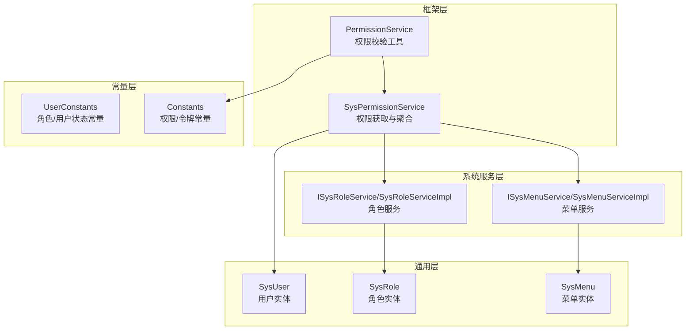
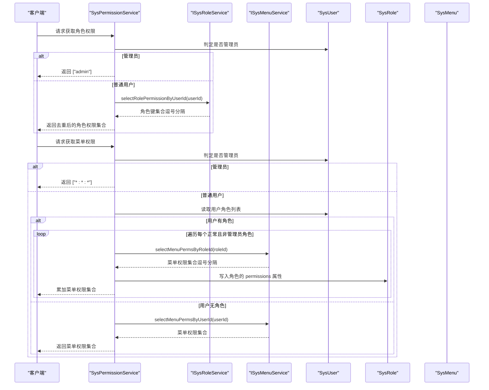
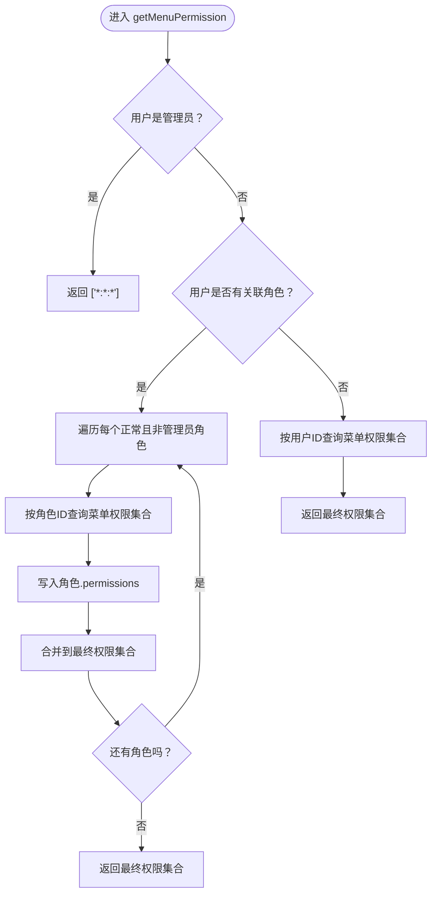
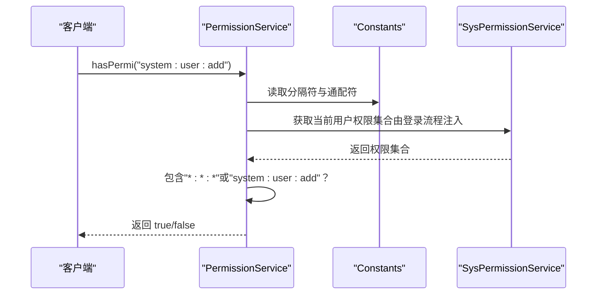
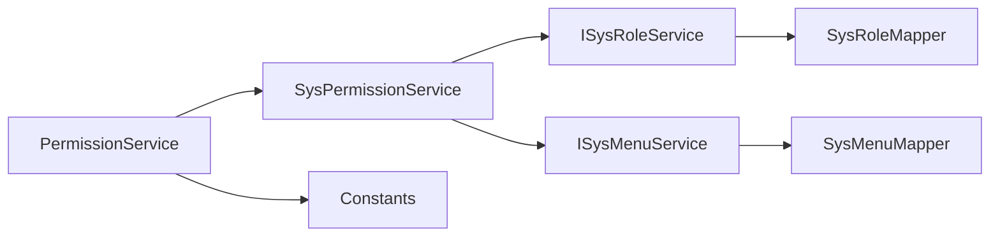

# 基于角色的访问控制（RBAC）

<cite>
**本文引用的文件**
- [SysPermissionService.java](file://ruoyi-framework/src/main/java/com/ruoyi/framework/web/service/SysPermissionService.java)
- [SysRole.java](file://ruoyi-common/src/main/java/com/ruoyi/common/core/domain/entity/SysRole.java)
- [SysUser.java](file://ruoyi-common/src/main/java/com/ruoyi/common/core/domain/entity/SysUser.java)
- [SysMenu.java](file://ruoyi-common/src/main/java/com/ruoyi/common/core/domain/entity/SysMenu.java)
- [ISysRoleService.java](file://ruoyi-system/src/main/java/com/ruoyi/system/service/ISysRoleService.java)
- [SysRoleServiceImpl.java](file://ruoyi-system/src/main/java/com/ruoyi/system/service/impl/SysRoleServiceImpl.java)
- [ISysMenuService.java](file://ruoyi-system/src/main/java/com/ruoyi/system/service/ISysMenuService.java)
- [SysMenuServiceImpl.java](file://ruoyi-system/src/main/java/com/ruoyi/system/service/impl/SysMenuServiceImpl.java)
- [UserConstants.java](file://ruoyi-common/src/main/java/com/ruoyi/common/constant/UserConstants.java)
- [Constants.java](file://ruoyi-common/src/main/java/com/ruoyi/common/constant/Constants.java)
- [PermissionService.java](file://ruoyi-framework/src/main/java/com/ruoyi/framework/web/service/PermissionService.java)
</cite>

## 目录
1. [引言](#引言)
2. [项目结构](#项目结构)
3. [核心组件](#核心组件)
4. [架构总览](#架构总览)
5. [详细组件分析](#详细组件分析)
6. [依赖分析](#依赖分析)
7. [性能考虑](#性能考虑)
8. [故障排查指南](#故障排查指南)
9. [结论](#结论)
10. [附录](#附录)

## 引言
本文件面向港好住信息系统，系统性梳理并说明基于角色的访问控制（RBAC）权限模型的实现与使用。重点覆盖：
- 用户-角色-权限三层关系模型的设计与数据结构
- SysPermissionService 中权限获取机制：getRolePermission() 与 getMenuPermission() 的实现逻辑
- 管理员特殊权限处理与普通用户的权限继承关系
- 角色权限与菜单权限的区别与联系
- 权限字符串格式规范（如 admin、*:*:*）
- 角色状态管理、权限缓存策略、权限验证流程
- 角色配置示例、权限分配最佳实践、常见权限问题排查指南

## 项目结构
围绕 RBAC 的关键代码分布在如下模块：
- 框架层：权限处理与校验服务
- 通用层：实体模型（用户、角色、菜单）
- 系统服务层：角色与菜单的服务接口与实现
- 常量层：权限与用户状态常量

图表来源
- [SysPermissionService.java:1-89](file://ruoyi-framework/src/main/java/com/ruoyi/framework/web/service/SysPermissionService.java#L1-L89)
- [SysRoleServiceImpl.java:1-200](file://ruoyi-system/src/main/java/com/ruoyi/system/service/impl/SysRoleServiceImpl.java#L1-L200)
- [SysMenuServiceImpl.java:1-200](file://ruoyi-system/src/main/java/com/ruoyi/system/service/impl/SysMenuServiceImpl.java#L1-L200)
- [SysRole.java:1-242](file://ruoyi-common/src/main/java/com/ruoyi/common/core/domain/entity/SysRole.java#L1-L242)
- [SysUser.java:1-339](file://ruoyi-common/src/main/java/com/ruoyi/common/core/domain/entity/SysUser.java#L1-L339)
- [SysMenu.java:1-275](file://ruoyi-common/src/main/java/com/ruoyi/common/core/domain/entity/SysMenu.java#L1-L275)
- [UserConstants.java:1-82](file://ruoyi-common/src/main/java/com/ruoyi/common/constant/UserConstants.java#L1-L82)
- [Constants.java:1-174](file://ruoyi-common/src/main/java/com/ruoyi/common/constant/Constants.java#L1-L174)
- [PermissionService.java:42-159](file://ruoyi-framework/src/main/java/com/ruoyi/framework/web/service/PermissionService.java#L42-L159)

章节来源
- [SysPermissionService.java:1-89](file://ruoyi-framework/src/main/java/com/ruoyi/framework/web/service/SysPermissionService.java#L1-L89)
- [SysRoleServiceImpl.java:1-200](file://ruoyi-system/src/main/java/com/ruoyi/system/service/impl/SysRoleServiceImpl.java#L1-L200)
- [SysMenuServiceImpl.java:1-200](file://ruoyi-system/src/main/java/com/ruoyi/system/service/impl/SysMenuServiceImpl.java#L1-L200)
- [SysRole.java:1-242](file://ruoyi-common/src/main/java/com/ruoyi/common/core/domain/entity/SysRole.java#L1-L242)
- [SysUser.java:1-339](file://ruoyi-common/src/main/java/com/ruoyi/common/core/domain/entity/SysUser.java#L1-L339)
- [SysMenu.java:1-275](file://ruoyi-common/src/main/java/com/ruoyi/common/core/domain/entity/SysMenu.java#L1-L275)
- [UserConstants.java:1-82](file://ruoyi-common/src/main/java/com/ruoyi/common/constant/UserConstants.java#L1-L82)
- [Constants.java:1-174](file://ruoyi-common/src/main/java/com/ruoyi/common/constant/Constants.java#L1-L174)
- [PermissionService.java:42-159](file://ruoyi-framework/src/main/java/com/ruoyi/framework/web/service/PermissionService.java#L42-L159)

## 核心组件
- 用户实体（SysUser）：承载用户基本信息、所属角色列表、管理员判定等能力
- 角色实体（SysRole）：承载角色元数据、角色键（roleKey）、状态、数据范围、菜单/部门勾选严格模式、权限集合等
- 菜单实体（SysMenu）：承载菜单树形结构、类型（目录/菜单/按钮）、可见性、状态、权限字符串（perms）
- 角色服务（ISysRoleService/SysRoleServiceImpl）：提供按用户查询角色、角色权限（roleKey）解析、角色状态与数据范围校验等
- 菜单服务（ISysMenuService/SysMenuServiceImpl）：提供按用户/角色查询菜单、菜单权限（perms）解析、构建前端路由等
- 权限服务（SysPermissionService）：聚合用户的角色权限与菜单权限，处理管理员特殊逻辑
- 权限校验（PermissionService）：对外暴露 hasPermi()/hasAnyPermi() 等校验入口，支持“*:*:*”通配与逗号分隔多权限
- 常量（UserConstants/Constants）：统一管理角色/用户状态、菜单类型、权限分隔符、管理员标识、通配符等

章节来源
- [SysUser.java:83-339](file://ruoyi-common/src/main/java/com/ruoyi/common/core/domain/entity/SysUser.java#L83-L339)
- [SysRole.java:22-242](file://ruoyi-common/src/main/java/com/ruoyi/common/core/domain/entity/SysRole.java#L22-L242)
- [SysMenu.java:21-275](file://ruoyi-common/src/main/java/com/ruoyi/common/core/domain/entity/SysMenu.java#L21-L275)
- [ISysRoleService.java:14-184](file://ruoyi-system/src/main/java/com/ruoyi/system/service/ISysRoleService.java#L14-L184)
- [SysRoleServiceImpl.java:78-116](file://ruoyi-system/src/main/java/com/ruoyi/system/service/impl/SysRoleServiceImpl.java#L78-L116)
- [ISysMenuService.java:14-145](file://ruoyi-system/src/main/java/com/ruoyi/system/service/ISysMenuService.java#L14-L145)
- [SysMenuServiceImpl.java:88-122](file://ruoyi-system/src/main/java/com/ruoyi/system/service/impl/SysMenuServiceImpl.java#L88-L122)
- [SysPermissionService.java:30-87](file://ruoyi-framework/src/main/java/com/ruoyi/framework/web/service/SysPermissionService.java#L30-L87)
- [PermissionService.java:42-159](file://ruoyi-framework/src/main/java/com/ruoyi/framework/web/service/PermissionService.java#L42-L159)
- [UserConstants.java:15-28](file://ruoyi-common/src/main/java/com/ruoyi/common/constant/UserConstants.java#L15-L28)
- [Constants.java:74-92](file://ruoyi-common/src/main/java/com/ruoyi/common/constant/Constants.java#L74-L92)

## 架构总览
下图展示从用户到角色再到菜单权限的聚合路径，以及管理员的特例处理。

图表来源
- [SysPermissionService.java:36-87](file://ruoyi-framework/src/main/java/com/ruoyi/framework/web/service/SysPermissionService.java#L36-L87)
- [ISysRoleService.java:42-47](file://ruoyi-system/src/main/java/com/ruoyi/system/service/ISysRoleService.java#L42-L47)
- [SysRoleServiceImpl.java:104-116](file://ruoyi-system/src/main/java/com/ruoyi/system/service/impl/SysRoleServiceImpl.java#L104-L116)
- [ISysMenuService.java:34-47](file://ruoyi-system/src/main/java/com/ruoyi/system/service/ISysMenuService.java#L34-L47)
- [SysMenuServiceImpl.java:89-122](file://ruoyi-system/src/main/java/com/ruoyi/system/service/impl/SysMenuServiceImpl.java#L89-L122)

## 详细组件分析

### 用户-角色-权限三层关系模型
- 用户（SysUser）持有角色列表（roles），并通过 isAdmin() 快速判断是否为超级管理员
- 角色（SysRole）包含角色键（roleKey），用于表达角色级权限；同时可携带 permissions 集合，用于承载该角色的菜单权限
- 菜单（SysMenu）包含权限字符串（perms），通常为“模块:业务:操作”的三段式或通配符形式
- 关系要点
  - 用户与角色为多对多关系，通过中间表维护
  - 角色与菜单为多对多关系，通过中间表维护
  - 角色状态（启用/停用）与菜单状态共同决定最终可用权限
  - 管理员（用户或角色）拥有最高权限，绕过常规校验

章节来源
- [SysUser.java:83-339](file://ruoyi-common/src/main/java/com/ruoyi/common/core/domain/entity/SysUser.java#L83-L339)
- [SysRole.java:22-242](file://ruoyi-common/src/main/java/com/ruoyi/common/core/domain/entity/SysRole.java#L22-L242)
- [SysMenu.java:21-275](file://ruoyi-common/src/main/java/com/ruoyi/common/core/domain/entity/SysMenu.java#L21-L275)
- [UserConstants.java:15-28](file://ruoyi-common/src/main/java/com/ruoyi/common/constant/UserConstants.java#L15-L28)

### SysPermissionService 权限获取机制
- getRolePermission()：返回用户的角色权限集合
  - 管理员直接返回 ["admin"]
  - 普通用户通过角色服务按用户查询角色权限（roleKey），并对逗号分隔的多个权限进行拆分与去重
- getMenuPermission()：返回用户的菜单权限集合
  - 管理员直接返回 ["*:*:*"]
  - 普通用户优先使用角色维度的菜单权限；若用户无角色，则回退到按用户维度查询菜单权限
  - 对每个正常且非管理员角色，先查询其菜单权限集合，写入角色的 permissions 属性，再累加到最终集合

图表来源
- [SysPermissionService.java:57-87](file://ruoyi-framework/src/main/java/com/ruoyi/framework/web/service/SysPermissionService.java#L57-L87)
- [ISysMenuService.java:34-47](file://ruoyi-system/src/main/java/com/ruoyi/system/service/ISysMenuService.java#L34-L47)
- [SysMenuServiceImpl.java:89-122](file://ruoyi-system/src/main/java/com/ruoyi/system/service/impl/SysMenuServiceImpl.java#L89-L122)

章节来源
- [SysPermissionService.java:36-87](file://ruoyi-framework/src/main/java/com/ruoyi/framework/web/service/SysPermissionService.java#L36-L87)
- [SysRoleServiceImpl.java:104-116](file://ruoyi-system/src/main/java/com/ruoyi/system/service/impl/SysRoleServiceImpl.java#L104-L116)
- [SysMenuServiceImpl.java:89-122](file://ruoyi-system/src/main/java/com/ruoyi/system/service/impl/SysMenuServiceImpl.java#L89-L122)

### 管理员特殊权限处理与继承关系
- 管理员判定
  - 用户级：SysUser.isAdmin() 或静态 isAdmin(userId)
  - 角色级：SysRole.isAdmin() 或静态 isAdmin(roleId)，其中 roleId=1 为内置管理员
- 特殊处理
  - 角色权限：getRolePermission() 直接返回 ["admin"]
  - 菜单权限：getMenuPermission() 直接返回 ["*:*:*"]
- 继承关系
  - 普通用户：权限来自其角色集合与菜单映射
  - 管理员：忽略角色与菜单状态，直接获得全部权限

章节来源
- [SysUser.java:115-123](file://ruoyi-common/src/main/java/com/ruoyi/common/core/domain/entity/SysUser.java#L115-L123)
- [SysRole.java:87-95](file://ruoyi-common/src/main/java/com/ruoyi/common/core/domain/entity/SysRole.java#L87-L95)
- [SysPermissionService.java:36-87](file://ruoyi-framework/src/main/java/com/ruoyi/framework/web/service/SysPermissionService.java#L36-L87)

### 角色权限与菜单权限的区别与联系
- 角色权限（roleKey）
  - 表达角色层面的权限标识，通常为逗号分隔的多个值
  - 由 SysRoleServiceImpl 解析并返回给上层
- 菜单权限（perms）
  - 表达菜单/按钮级别的具体权限字符串，通常为“模块:业务:操作”
  - 由 SysMenuServiceImpl 解析并返回给上层
- 联系
  - 角色权限与菜单权限共同构成用户最终权限集合
  - 管理员在两套体系下均拥有最高权限

章节来源
- [SysRoleServiceImpl.java:104-116](file://ruoyi-system/src/main/java/com/ruoyi/system/service/impl/SysRoleServiceImpl.java#L104-L116)
- [SysMenuServiceImpl.java:89-122](file://ruoyi-system/src/main/java/com/ruoyi/system/service/impl/SysMenuServiceImpl.java#L89-L122)
- [SysMenu.java:63-64](file://ruoyi-common/src/main/java/com/ruoyi/common/core/domain/entity/SysMenu.java#L63-L64)

### 权限字符串格式规范
- 角色权限（roleKey）
  - 多个权限以逗号分隔，例如："role:create,role:update"
- 菜单权限（perms）
  - 三段式格式：“模块:业务:操作”，例如 "system:user:list"
  - 通配符格式：“*:*:*” 表示所有权限
- 常量定义
  - 通配符：Constants.ALL_PERMISSION = "*:*:*"
  - 管理员角色标识：Constants.SUPER_ADMIN = "admin"
  - 分隔符：Constants.PERMISSION_DELIMETER = ","

章节来源
- [Constants.java:74-92](file://ruoyi-common/src/main/java/com/ruoyi/common/constant/Constants.java#L74-L92)
- [SysMenuServiceImpl.java:89-122](file://ruoyi-system/src/main/java/com/ruoyi/system/service/impl/SysMenuServiceImpl.java#L89-L122)
- [SysRoleServiceImpl.java:104-116](file://ruoyi-system/src/main/java/com/ruoyi/system/service/impl/SysRoleServiceImpl.java#L104-L116)

### 角色状态管理
- 角色状态字段：SysRole.status（启用/停用）
- 常量：UserConstants.ROLE_NORMAL = "0"，ROLE_DISABLE = "1"
- 在权限聚合时，仅对状态为正常的角色生效，并排除管理员角色的重复叠加

章节来源
- [SysRole.java:48-50](file://ruoyi-common/src/main/java/com/ruoyi/common/core/domain/entity/SysRole.java#L48-L50)
- [UserConstants.java:24-28](file://ruoyi-common/src/main/java/com/ruoyi/common/constant/UserConstants.java#L24-L28)
- [SysPermissionService.java:73-78](file://ruoyi-framework/src/main/java/com/ruoyi/framework/web/service/SysPermissionService.java#L73-L78)

### 权限缓存策略
- 当前实现未在 SysPermissionService 中显式声明缓存注解
- 实务建议
  - 在高并发场景下，可在角色/菜单服务层引入缓存（如 Redis），并结合失效策略
  - 缓存键建议采用“用户ID+时间戳”或“用户ID+角色版本号”组合，确保权限变更后及时失效
  - 对管理员权限可单独缓存“全量权限”键，减少分支判断开销

[本节为通用建议，不直接分析具体文件，故无章节来源]

### 权限验证流程
- 外部校验入口：PermissionService.hasPermi()/hasAnyPermi()
- 核心逻辑
  - 将请求的权限字符串按逗号拆分
  - 若当前用户权限集合包含 Constants.ALL_PERMISSION 或目标权限字符串，则放行
- 与 SysPermissionService 的衔接
  - 上层在登录后将用户权限注入上下文（如 LoginUser.permissions）
  - PermissionService 从上下文中读取权限集合进行匹配

图表来源
- [PermissionService.java:42-159](file://ruoyi-framework/src/main/java/com/ruoyi/framework/web/service/PermissionService.java#L42-L159)
- [Constants.java:74-92](file://ruoyi-common/src/main/java/com/ruoyi/common/constant/Constants.java#L74-L92)
- [SysPermissionService.java:36-87](file://ruoyi-framework/src/main/java/com/ruoyi/framework/web/service/SysPermissionService.java#L36-L87)

章节来源
- [PermissionService.java:42-159](file://ruoyi-framework/src/main/java/com/ruoyi/framework/web/service/PermissionService.java#L42-L159)
- [Constants.java:74-92](file://ruoyi-common/src/main/java/com/ruoyi/common/constant/Constants.java#L74-L92)

## 依赖分析
- 组件耦合
  - SysPermissionService 依赖 ISysRoleService 与 ISysMenuService
  - SysRoleServiceImpl 与 SysMenuServiceImpl 依赖各自 Mapper 与实体
  - PermissionService 依赖 Constants 与 SysPermissionService（间接）
- 可能的循环依赖
  - 当前各层职责清晰，未见直接循环依赖
- 外部依赖
  - Spring 注解驱动（@Service、@Autowired）
  - MyBatis Plus（Mapper 接口）
  - 工具类（StringUtils、SecurityUtils）

图表来源
- [SysPermissionService.java:24-28](file://ruoyi-framework/src/main/java/com/ruoyi/framework/web/service/SysPermissionService.java#L24-L28)
- [ISysRoleService.java:14-184](file://ruoyi-system/src/main/java/com/ruoyi/system/service/ISysRoleService.java#L14-L184)
- [ISysMenuService.java:14-145](file://ruoyi-system/src/main/java/com/ruoyi/system/service/ISysMenuService.java#L14-L145)
- [PermissionService.java:42-159](file://ruoyi-framework/src/main/java/com/ruoyi/framework/web/service/PermissionService.java#L42-L159)

章节来源
- [SysPermissionService.java:24-28](file://ruoyi-framework/src/main/java/com/ruoyi/framework/web/service/SysPermissionService.java#L24-L28)
- [ISysRoleService.java:14-184](file://ruoyi-system/src/main/java/com/ruoyi/system/service/ISysRoleService.java#L14-L184)
- [ISysMenuService.java:14-145](file://ruoyi-system/src/main/java/com/ruoyi/system/service/ISysMenuService.java#L14-L145)
- [PermissionService.java:42-159](file://ruoyi-framework/src/main/java/com/ruoyi/framework/web/service/PermissionService.java#L42-L159)

## 性能考虑
- 权限解析复杂度
  - 角色权限：O(n)（n 为角色数），每角色拆分逗号分隔串
  - 菜单权限：O(m)（m 为菜单数），每菜单拆分逗号分隔串
- 建议优化
  - 使用 Set 去重，避免重复计算
  - 对管理员权限做短路返回，减少后续查询
  - 在高并发场景下引入缓存与失效策略，降低数据库压力

[本节为通用建议，不直接分析具体文件，故无章节来源]

## 故障排查指南
- 现象：用户无法看到任何菜单
  - 检查用户是否被赋予角色，且角色状态为启用
  - 检查角色与菜单的关联是否正确
  - 检查菜单状态是否为启用
- 现象：用户提示无权限但应有权限
  - 检查角色的 roleKey 是否包含所需权限
  - 检查菜单的 perms 是否为“模块:业务:操作”格式
  - 检查是否误将用户置为停用状态
- 现象：管理员也无法访问
  - 检查用户或角色是否为管理员（roleId=1 或 userId=1）
  - 检查权限字符串是否为“*:*:*”或“admin”
- 建议
  - 在登录后打印用户权限集合，便于定位
  - 对权限变更增加审计日志，记录用户、角色、菜单、权限变化

[本节为通用建议，不直接分析具体文件，故无章节来源]

## 结论
港好住信息系统基于 RBAC 的权限模型以用户-角色-菜单为核心，通过 SysPermissionService 聚合角色与菜单权限，并以管理员特例简化最高权限处理。角色权限与菜单权限分别由角色键与菜单权限字符串表达，二者共同决定最终可用功能。建议在生产环境中引入权限缓存与失效策略，并完善权限变更审计，以提升性能与可维护性。

[本节为总结性内容，不直接分析具体文件，故无章节来源]

## 附录

### 角色配置示例（参考）
- 管理员角色
  - 角色键（roleKey）：admin
  - 状态：启用
  - 菜单：全量（由管理员特例放行）
- 普通角色
  - 角色键（roleKey）：system:user:list,system:user:add
  - 状态：启用
  - 菜单：绑定“用户管理”相关菜单，权限字符串为“system:user:*”

[本节为示例性内容，不直接分析具体文件，故无章节来源]

### 权限分配最佳实践
- 角色键（roleKey）应尽量语义化，避免过长或过宽
- 菜单权限（perms）遵循“模块:业务:操作”三段式，便于前端与后端统一校验
- 对高频操作的权限建议集中收敛，减少分散配置
- 管理员角色仅保留必要角色键，避免过度授权

[本节为通用建议，不直接分析具体文件，故无章节来源]