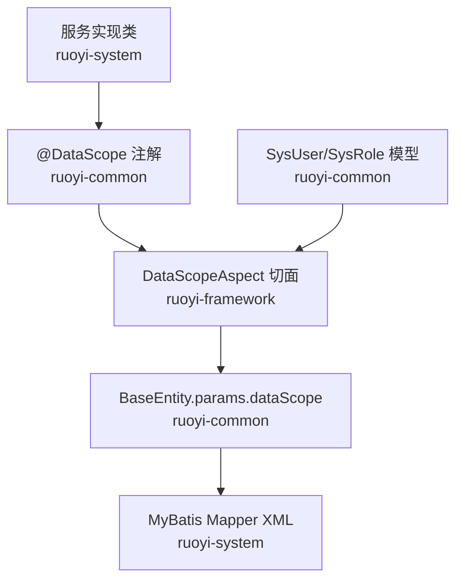
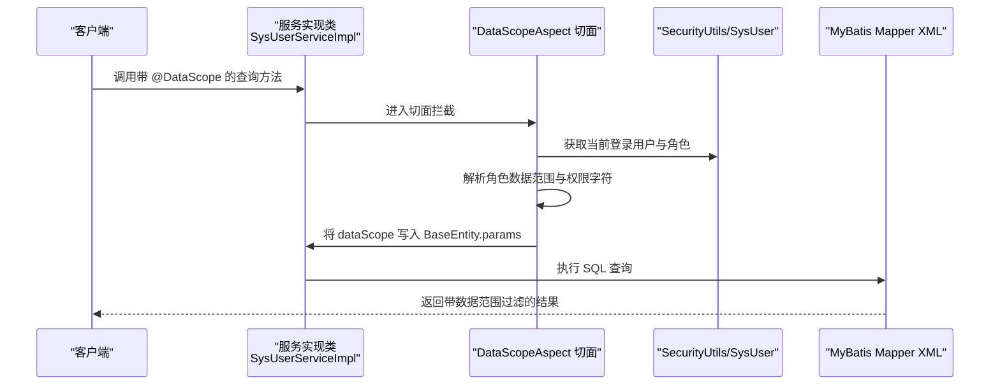
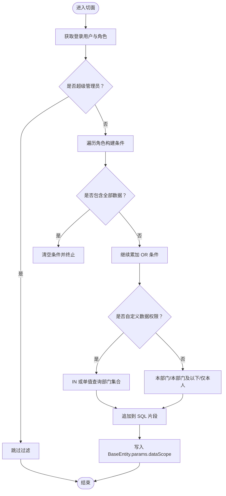
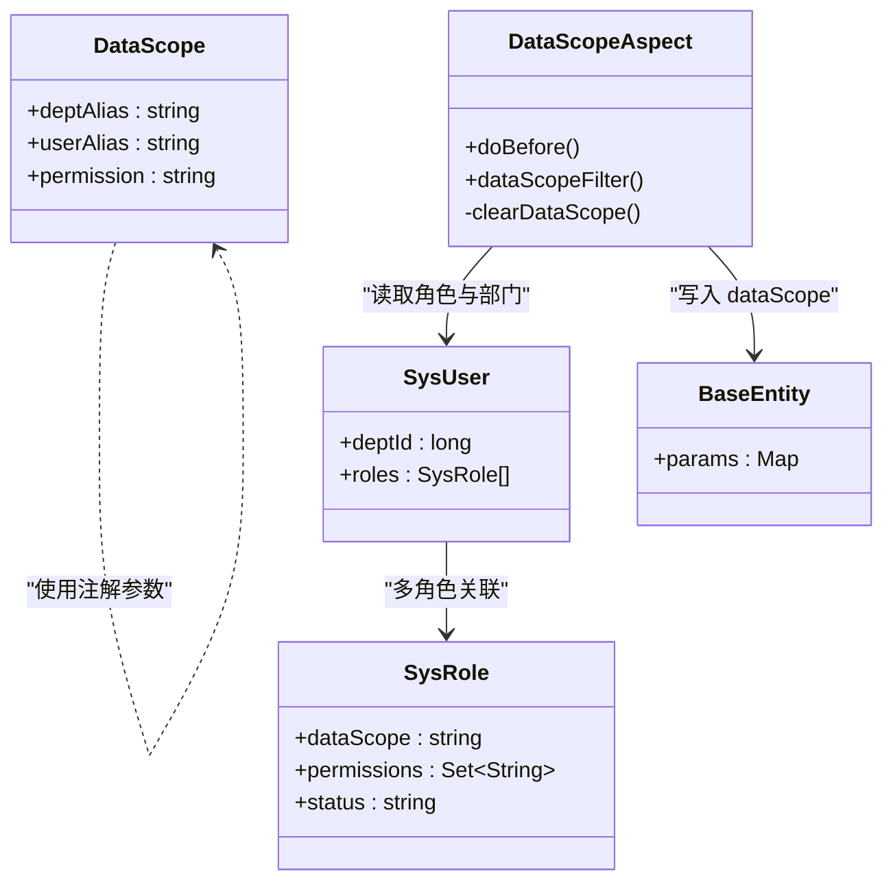

# 数据范围权限

<cite>
**本文引用的文件**
- [DataScope.java](file://ruoyi-common/src/main/java/com/ruoyi/common/annotation/DataScope.java)
- [DataScopeAspect.java](file://ruoyi-framework/src/main/java/com/ruoyi/framework/aspectj/DataScopeAspect.java)
- [SysRole.java](file://ruoyi-common/src/main/java/com/ruoyi/common/core/domain/entity/SysRole.java)
- [SysUser.java](file://ruoyi-common/src/main/java/com/ruoyi/common/core/domain/entity/SysUser.java)
- [BaseEntity.java](file://ruoyi-common/src/main/java/com/ruoyi/common/core/domain/BaseEntity.java)
- [SysUserServiceImpl.java](file://ruoyi-system/src/main/java/com/ruoyi/system/service/impl/SysUserServiceImpl.java)
- [SysDeptServiceImpl.java](file://ruoyi-system/src/main/java/com/ruoyi/system/service/impl/SysDeptServiceImpl.java)
- [SysRoleServiceImpl.java](file://ruoyi-system/src/main/java/com/ruoyi/system/service/impl/SysRoleServiceImpl.java)
- [SysUserMapper.xml](file://ruoyi-system/src/main/resources/mapper/system/SysUserMapper.xml)
- [HzContractServiceImpl.java](file://ruoyi-system/src/main/java/com/ruoyi/system/service/impl/HzContractServiceImpl.java)
- [系统表.md](file://docs/数据字典/系统表.md)
</cite>

## 目录
1. [简介](#简介)
2. [项目结构](#项目结构)
3. [核心组件](#核心组件)
4. [架构总览](#架构总览)
5. [详细组件分析](#详细组件分析)
6. [依赖关系分析](#依赖关系分析)
7. [性能考量](#性能考量)
8. [故障排查指南](#故障排查指南)
9. [结论](#结论)
10. [附录](#附录)

## 简介
本文件系统化阐述港好住信息系统中的“数据范围权限”能力，围绕以下目标展开：
- 概念与实现原理：基于部门、基于岗位、基于自定义条件的权限过滤。
- 注解使用：@DataScope 的参数配置、数据权限范围定义、注解生效机制。
- 切面实现：DataScopeAspect 的拦截与拼接逻辑、SQL 注入防护、与业务解耦。
- 权限类型：全部数据、本部门、本部门及以下、指定部门、仅本人。
- 实战示例：配置步骤、验证方法、性能优化策略。
- 故障排查与安全注意事项。

## 项目结构
数据范围权限涉及注解、切面、领域模型、服务层与 MyBatis 映射文件协同工作：
- 注解层：定义 @DataScope，声明 SQL 别名与权限字符。
- 切面层：解析用户角色与权限，动态拼接 dataScope 过滤条件。
- 模型层：SysUser、SysRole、BaseEntity 提供上下文与参数容器。
- 服务层：在查询方法上标注 @DataScope，驱动切面生效。
- 映射层：MyBatis XML 中通过 ${params.dataScope} 注入过滤条件。

图表来源
- [DataScope.java:1-34](file://ruoyi-common/src/main/java/com/ruoyi/common/annotation/DataScope.java#L1-L34)
- [DataScopeAspect.java:1-185](file://ruoyi-framework/src/main/java/com/ruoyi/framework/aspectj/DataScopeAspect.java#L1-L185)
- [BaseEntity.java:108-122](file://ruoyi-common/src/main/java/com/ruoyi/common/core/domain/BaseEntity.java#L108-L122)
- [SysUserMapper.xml:85-87](file://ruoyi-system/src/main/resources/mapper/system/SysUserMapper.xml#L85-L87)

章节来源
- [DataScope.java:1-34](file://ruoyi-common/src/main/java/com/ruoyi/common/annotation/DataScope.java#L1-L34)
- [DataScopeAspect.java:1-185](file://ruoyi-framework/src/main/java/com/ruoyi/framework/aspectj/DataScopeAspect.java#L1-L185)
- [BaseEntity.java:108-122](file://ruoyi-common/src/main/java/com/ruoyi/common/core/domain/BaseEntity.java#L108-L122)
- [SysUserMapper.xml:85-87](file://ruoyi-system/src/main/resources/mapper/system/SysUserMapper.xml#L85-L87)

## 核心组件
- @DataScope 注解：声明查询方法的部门别名、用户别名与权限字符，驱动切面进行数据范围过滤。
- DataScopeAspect 切面：在方法执行前解析用户权限与角色数据范围，生成 SQL 片段并写入 BaseEntity.params.dataScope。
- BaseEntity：统一承载查询参数，dataScope 作为特殊键注入到 MyBatis。
- SysUser/SysRole：提供用户所属角色、角色数据范围、角色权限集合等上下文。
- Mapper XML：在查询语句末尾通过 ${params.dataScope} 注入过滤条件。

章节来源
- [DataScope.java:18-33](file://ruoyi-common/src/main/java/com/ruoyi/common/annotation/DataScope.java#L18-L33)
- [DataScopeAspect.java:66-170](file://ruoyi-framework/src/main/java/com/ruoyi/framework/aspectj/DataScopeAspect.java#L66-L170)
- [BaseEntity.java:108-122](file://ruoyi-common/src/main/java/com/ruoyi/common/core/domain/BaseEntity.java#L108-L122)
- [SysRole.java:38-40](file://ruoyi-common/src/main/java/com/ruoyi/common/core/domain/entity/SysRole.java#L38-L40)
- [SysUser.java:83-84](file://ruoyi-common/src/main/java/com/ruoyi/common/core/domain/entity/SysUser.java#L83-L84)

## 架构总览
数据范围权限的调用链路如下：

图表来源
- [SysUserServiceImpl.java:76-81](file://ruoyi-system/src/main/java/com/ruoyi/system/service/impl/SysUserServiceImpl.java#L76-L81)
- [DataScopeAspect.java:59-80](file://ruoyi-framework/src/main/java/com/ruoyi/framework/aspectj/DataScopeAspect.java#L59-L80)
- [SysUserMapper.xml:85-87](file://ruoyi-system/src/main/resources/mapper/system/SysUserMapper.xml#L85-L87)

## 详细组件分析

### 注解与参数配置
- @DataScope 参数
  - deptAlias：部门表别名，用于定位过滤字段。
  - userAlias：用户表别名，用于“仅本人”场景。
  - permission：权限字符，默认从权限上下文中获取，支持多权限逗号分隔。
- 生效机制
  - 方法被 @DataScope 标注后，切面在前置通知阶段解析用户与角色，生成 dataScope 条件并写入 BaseEntity.params。

章节来源
- [DataScope.java:18-33](file://ruoyi-common/src/main/java/com/ruoyi/common/annotation/DataScope.java#L18-L33)
- [DataScopeAspect.java:59-80](file://ruoyi-framework/src/main/java/com/ruoyi/framework/aspectj/DataScopeAspect.java#L59-L80)

### 切面实现逻辑
- 关键常量
  - DATA_SCOPE_ALL、DATA_SCOPE_CUSTOM、DATA_SCOPE_DEPT、DATA_SCOPE_DEPT_AND_CHILD、DATA_SCOPE_SELF。
- 核心流程
  - 获取当前登录用户与角色集合。
  - 若非超级管理员，按角色权限与数据范围逐条拼接 OR 条件。
  - 对“自定义数据权限”角色，聚合角色ID后一次性查询对应部门集合。
  - “仅本人”若未提供 userAlias，则构造不返回任何数据的兜底条件，确保安全。
  - 将最终 SQL 片段写入 BaseEntity.params.dataScope。
- 安全防护
  - 调用前清空 params.dataScope，避免外部传参污染。
  - 使用占位符与字符串格式化，不直接拼接原始输入。

图表来源
- [DataScopeAspect.java:66-170](file://ruoyi-framework/src/main/java/com/ruoyi/framework/aspectj/DataScopeAspect.java#L66-L170)

章节来源
- [DataScopeAspect.java:29-57](file://ruoyi-framework/src/main/java/com/ruoyi/framework/aspectj/DataScopeAspect.java#L29-L57)
- [DataScopeAspect.java:91-170](file://ruoyi-framework/src/main/java/com/ruoyi/framework/aspectj/DataScopeAspect.java#L91-L170)
- [DataScopeAspect.java:172-184](file://ruoyi-framework/src/main/java/com/ruoyi/framework/aspectj/DataScopeAspect.java#L172-L184)

### 数据范围类型与配置
- 全部数据（1）
  - 任意角色拥有该范围时，立即终止拼接，不附加过滤条件。
- 自定义数据权限（2）
  - 聚合所有满足权限的角色ID，一次性查询其关联部门集合，使用 IN 条件。
- 本部门（3）
  - 以当前用户所在部门ID进行等值过滤。
- 本部门及以下（4）
  - 使用部门祖先路径（find_in_set）递归匹配。
- 仅本人（5）
  - 若提供 userAlias，则按用户ID过滤；否则构造兜底条件不返回任何数据。

章节来源
- [SysRole.java:38-40](file://ruoyi-common/src/main/java/com/ruoyi/common/core/domain/entity/SysRole.java#L38-L40)
- [DataScopeAspect.java:114-151](file://ruoyi-framework/src/main/java/com/ruoyi/framework/aspectj/DataScopeAspect.java#L114-L151)

### 注解生效与业务解耦
- 在服务层方法上标注 @DataScope，即可对任意查询方法自动注入数据范围过滤，无需在 Mapper 层重复编写。
- BaseEntity.params 作为统一参数容器，使过滤条件与业务查询参数隔离，便于扩展与维护。

章节来源
- [SysUserServiceImpl.java:76-81](file://ruoyi-system/src/main/java/com/ruoyi/system/service/impl/SysUserServiceImpl.java#L76-L81)
- [SysDeptServiceImpl.java:44-49](file://ruoyi-system/src/main/java/com/ruoyi/system/service/impl/SysDeptServiceImpl.java#L44-L49)
- [SysRoleServiceImpl.java:55-70](file://ruoyi-system/src/main/java/com/ruoyi/system/service/impl/SysRoleServiceImpl.java#L55-L70)
- [BaseEntity.java:108-122](file://ruoyi-common/src/main/java/com/ruoyi/common/core/domain/BaseEntity.java#L108-L122)

### SQL 注入防护与参数注入
- Mapper XML 中通过 ${params.dataScope} 注入切面生成的 SQL 片段，避免硬编码。
- 切面在注入前会清空 dataScope，防止外部请求携带恶意参数。
- 条件拼接采用格式化模板，不直接拼接用户输入。

章节来源
- [SysUserMapper.xml:85-87](file://ruoyi-system/src/main/resources/mapper/system/SysUserMapper.xml#L85-L87)
- [DataScopeAspect.java:172-184](file://ruoyi-framework/src/main/java/com/ruoyi/framework/aspectj/DataScopeAspect.java#L172-L184)
- [DataScopeAspect.java:161-170](file://ruoyi-framework/src/main/java/com/ruoyi/framework/aspectj/DataScopeAspect.java#L161-L170)

### 示例：基于部门的数据权限控制
- 在服务方法上添加 @DataScope(deptAlias = "d")，Mapper 中通过 ${params.dataScope} 注入。
- 若用户角色为“本部门”，则只返回该部门数据；若为“本部门及以下”，则递归匹配祖先路径。

章节来源
- [SysDeptServiceImpl.java:44-49](file://ruoyi-system/src/main/java/com/ruoyi/system/service/impl/SysDeptServiceImpl.java#L44-L49)
- [SysUserMapper.xml:85-87](file://ruoyi-system/src/main/resources/mapper/system/SysUserMapper.xml#L85-L87)

### 示例：基于岗位的数据权限限制
- 岗位维度通常通过用户与岗位关联表 sys_user_post 进行约束。
- 若业务需要按岗位限定数据范围，可在 Mapper 中增加相应 JOIN 条件，并在切面中扩展参数注入逻辑（如在 BaseEntity.params 中加入岗位过滤键）。

章节来源
- [系统表.md:159-167](file://docs/数据字典/系统表.md#L159-L167)

### 示例：基于自定义条件的数据权限过滤
- 当角色数据范围为“自定义数据权限”时，切面会收集满足权限的角色ID，查询 sys_role_dept 获取对应部门集合，再生成 IN 条件注入到 dataScope。
- 该模式适合精细化部门授权场景。

章节来源
- [DataScopeAspect.java:96-130](file://ruoyi-framework/src/main/java/com/ruoyi/framework/aspectj/DataScopeAspect.java#L96-L130)
- [系统表.md:148-156](file://docs/数据字典/系统表.md#L148-L156)

### 示例：仅本人数据权限
- 若 userAlias 未提供，切面会构造“部门ID=0”的兜底条件，确保不返回任何数据。
- 若提供 userAlias，则按用户ID过滤。

章节来源
- [DataScopeAspect.java:140-151](file://ruoyi-framework/src/main/java/com/ruoyi/framework/aspectj/DataScopeAspect.java#L140-L151)

## 依赖关系分析

图表来源
- [DataScope.java:18-33](file://ruoyi-common/src/main/java/com/ruoyi/common/annotation/DataScope.java#L18-L33)
- [DataScopeAspect.java:66-170](file://ruoyi-framework/src/main/java/com/ruoyi/framework/aspectj/DataScopeAspect.java#L66-L170)
- [BaseEntity.java:108-122](file://ruoyi-common/src/main/java/com/ruoyi/common/core/domain/BaseEntity.java#L108-L122)
- [SysUser.java:83-84](file://ruoyi-common/src/main/java/com/ruoyi/common/core/domain/entity/SysUser.java#L83-L84)
- [SysRole.java:38-40](file://ruoyi-common/src/main/java/com/ruoyi/common/core/domain/entity/SysRole.java#L38-L40)

章节来源
- [DataScope.java:18-33](file://ruoyi-common/src/main/java/com/ruoyi/common/annotation/DataScope.java#L18-L33)
- [DataScopeAspect.java:66-170](file://ruoyi-framework/src/main/java/com/ruoyi/framework/aspectj/DataScopeAspect.java#L66-L170)
- [SysUser.java:83-84](file://ruoyi-common/src/main/java/com/ruoyi/common/core/domain/entity/SysUser.java#L83-L84)
- [SysRole.java:38-40](file://ruoyi-common/src/main/java/com/ruoyi/common/core/domain/entity/SysRole.java#L38-L40)

## 性能考量
- 多角色自定义数据权限合并查询
  - 切面在聚合多个自定义角色时，使用 IN 条件一次性查询部门集合，避免多次子查询。
- 角色去重与权限校验
  - 对重复数据范围与禁用状态的角色进行跳过，减少无效拼接。
- SQL 注入防护与参数注入
  - 通过清空 dataScope 并格式化模板，降低风险同时保持灵活性。
- 建议
  - 为 sys_dept.ancestors、sys_role_dept 等关键字段建立索引，提升“本部门及以下”与“自定义部门”查询效率。
  - 控制 dataScope 条件复杂度，避免过度嵌套导致执行计划抖动。

章节来源
- [DataScopeAspect.java:96-130](file://ruoyi-framework/src/main/java/com/ruoyi/framework/aspectj/DataScopeAspect.java#L96-L130)
- [DataScopeAspect.java:172-184](file://ruoyi-framework/src/main/java/com/ruoyi/framework/aspectj/DataScopeAspect.java#L172-L184)

## 故障排查指南
- 现象：查询无结果
  - 检查角色权限是否包含注解中指定的 permission。
  - 确认 dataScope 是否被正确写入 BaseEntity.params。
  - 若“仅本人”未提供 userAlias，将触发兜底条件导致无结果。
- 现象：越权访问
  - 确认切面是否在前置通知阶段清空了 dataScope。
  - 检查 Mapper XML 是否正确使用 ${params.dataScope}。
- 现象：性能异常
  - 检查自定义数据权限角色数量与部门集合规模。
  - 核查 sys_dept.ancestors 与 sys_role_dept 索引是否完善。
- 调试建议
  - 在服务实现类中打印 params.dataScope，确认切面注入内容。
  - 参考 HzContractServiceImpl 的调试方式，在业务层打印 dataScope 参数与查询结果。

章节来源
- [DataScopeAspect.java:155-169](file://ruoyi-framework/src/main/java/com/ruoyi/framework/aspectj/DataScopeAspect.java#L155-L169)
- [SysUserMapper.xml:85-87](file://ruoyi-system/src/main/resources/mapper/system/SysUserMapper.xml#L85-L87)
- [HzContractServiceImpl.java:143-157](file://ruoyi-system/src/main/java/com/ruoyi/system/service/impl/HzContractServiceImpl.java#L143-L157)

## 结论
数据范围权限通过注解 + 切面 + 参数注入的方式，实现了对查询结果的细粒度控制。它既保证了安全性（防注入、兜底策略），又兼顾了灵活性（多角色、多范围、多权限组合）。结合合理的索引与参数设计，可获得稳定且高性能的权限过滤体验。

## 附录

### 常见配置清单
- 在服务方法上添加 @DataScope(deptAlias = "d", userAlias = "u", permission = "业务权限码")
- Mapper XML 中在 where 子句末尾添加 ${params.dataScope}
- 角色数据范围设置：1=全部、2=自定义、3=本部门、4=本部门及以下、5=仅本人

章节来源
- [SysUserServiceImpl.java:76-81](file://ruoyi-system/src/main/java/com/ruoyi/system/service/impl/SysUserServiceImpl.java#L76-L81)
- [SysUserMapper.xml:85-87](file://ruoyi-system/src/main/resources/mapper/system/SysUserMapper.xml#L85-L87)
- [SysRole.java:38-40](file://ruoyi-common/src/main/java/com/ruoyi/common/core/domain/entity/SysRole.java#L38-L40)