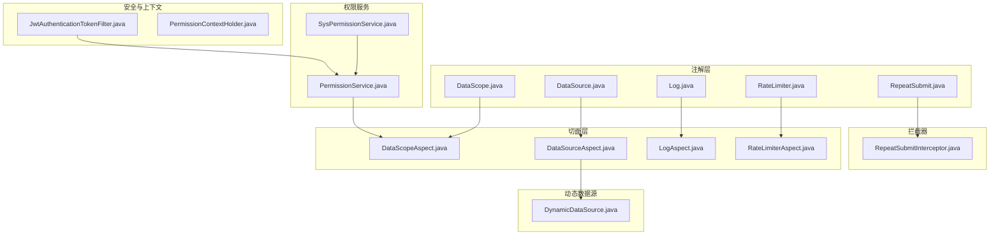
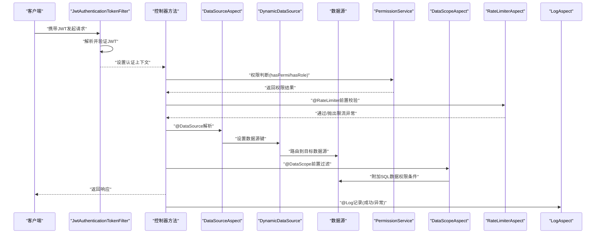
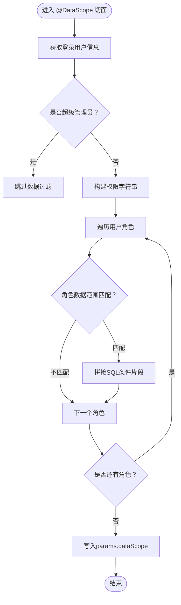
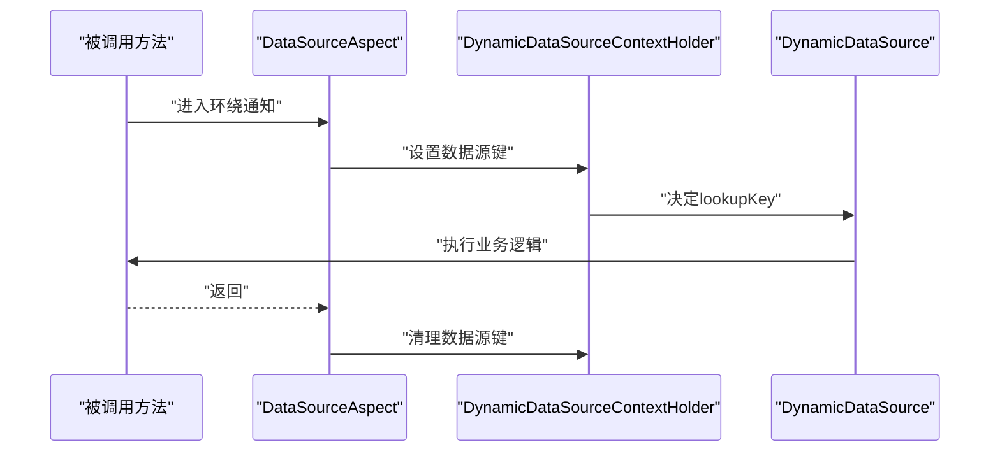
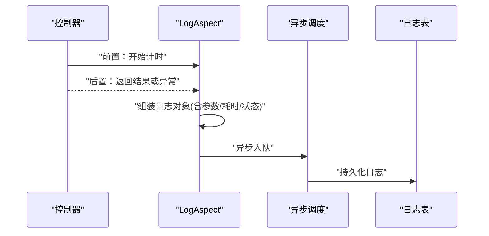
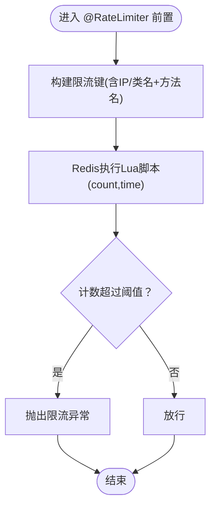
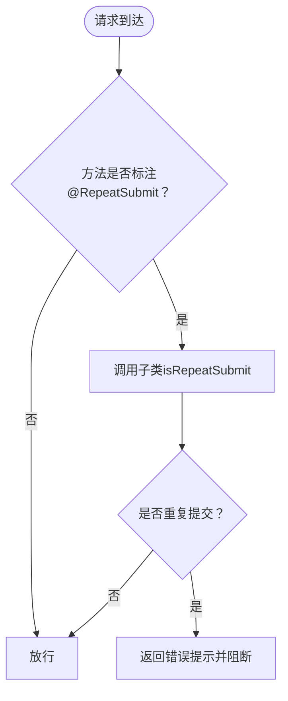
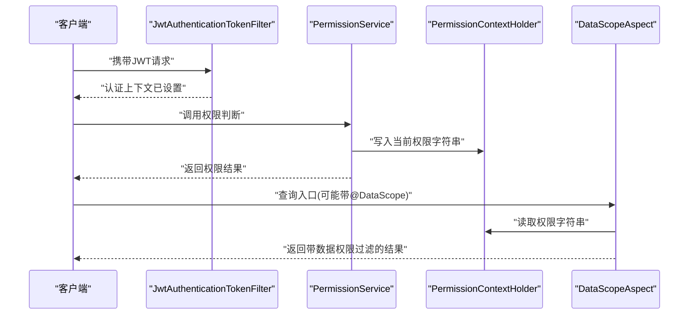
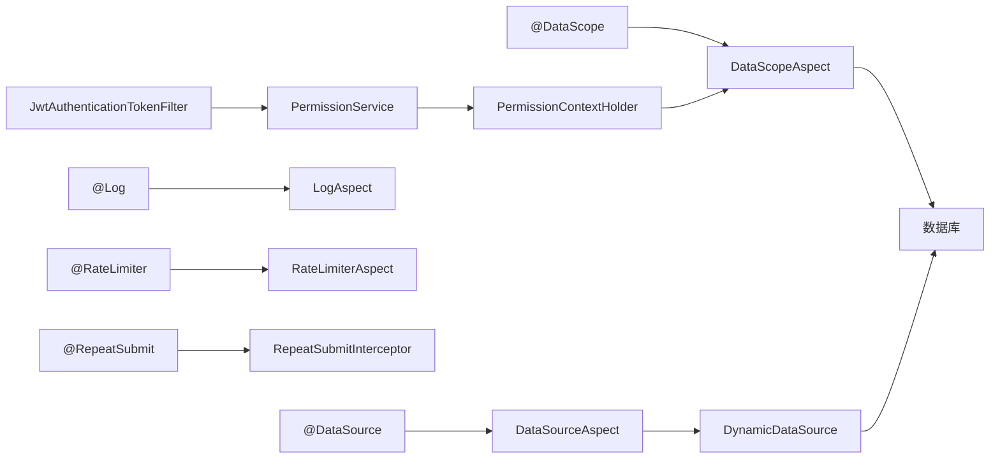

# 权限控制

<cite>
**本文引用的文件**
- [DataScope.java](file://ruoyi-common/src/main/java/com/ruoyi/common/annotation/DataScope.java)
- [DataSource.java](file://ruoyi-common/src/main/java/com/ruoyi/common/annotation/DataSource.java)
- [Log.java](file://ruoyi-common/src/main/java/com/ruoyi/common/annotation/Log.java)
- [RateLimiter.java](file://ruoyi-common/src/main/java/com/ruoyi/common/annotation/RateLimiter.java)
- [RepeatSubmit.java](file://ruoyi-common/src/main/java/com/ruoyi/common/annotation/RepeatSubmit.java)
- [DataScopeAspect.java](file://ruoyi-framework/src/main/java/com/ruoyi/framework/aspectj/DataScopeAspect.java)
- [DataSourceAspect.java](file://ruoyi-framework/src/main/java/com/ruoyi/framework/aspectj/DataSourceAspect.java)
- [LogAspect.java](file://ruoyi-framework/src/main/java/com/ruoyi/framework/aspectj/LogAspect.java)
- [RateLimiterAspect.java](file://ruoyi-framework/src/main/java/com/ruoyi/framework/aspectj/RateLimiterAspect.java)
- [JwtAuthenticationTokenFilter.java](file://ruoyi-framework/src/main/java/com/ruoyi/framework/security/filter/JwtAuthenticationTokenFilter.java)
- [SysPermissionService.java](file://ruoyi-framework/src/main/java/com/ruoyi/framework/web/service/SysPermissionService.java)
- [PermissionService.java](file://ruoyi-framework/src/main/java/com/ruoyi/framework/web/service/PermissionService.java)
- [PermissionContextHolder.java](file://ruoyi-framework/src/main/java/com/ruoyi/framework/security/context/PermissionContextHolder.java)
- [RepeatSubmitInterceptor.java](file://ruoyi-framework/src/main/java/com/ruoyi/framework/interceptor/RepeatSubmitInterceptor.java)
- [DynamicDataSource.java](file://ruoyi-framework/src/main/java/com/ruoyi/framework/datasource/DynamicDataSource.java)
</cite>

## 目录
1. [简介](#简介)
2. [项目结构](#项目结构)
3. [核心组件](#核心组件)
4. [架构总览](#架构总览)
5. [详细组件分析](#详细组件分析)
6. [依赖分析](#依赖分析)
7. [性能考虑](#性能考虑)
8. [故障排查指南](#故障排查指南)
9. [结论](#结论)
10. [附录](#附录)

## 简介
本文件系统性梳理港好住信息系统（基于 RuoYi 框架）的权限控制体系，涵盖多层次权限模型（基于角色的访问控制 RBAC、菜单权限、按钮权限、数据权限），以及权限注解系统（@DataScope、@DataSource、@Log、@RateLimiter、@RepeatSubmit）的使用场景与实现原理。文档还解释权限验证流程（权限获取、匹配、拒绝处理）、动态权限加载、权限缓存策略、权限继承关系等高级特性，并提供权限配置管理、调试工具与性能优化建议。

## 项目结构
权限控制相关代码主要分布在以下模块：
- 注解层：ruoyi-common 的 annotation 包，定义各类权限与治理注解
- 切面层：ruoyi-framework 的 aspectj 包，围绕注解实现横切逻辑
- 安全与上下文：ruoyi-framework 的 security 与 security/context 包，负责认证、鉴权与上下文传递
- 权限服务：ruoyi-framework 的 web/service 包，提供权限判断与菜单/角色权限聚合
- 拦截器：ruoyi-framework 的 interceptor 包，处理重复提交等请求级校验
- 动态数据源：ruoyi-framework 的 datasource 包，支持多数据源按注解切换

图表来源
- [DataScope.java:1-34](file://ruoyi-common/src/main/java/com/ruoyi/common/annotation/DataScope.java#L1-L34)
- [DataSource.java:1-29](file://ruoyi-common/src/main/java/com/ruoyi/common/annotation/DataSource.java#L1-L29)
- [Log.java:1-52](file://ruoyi-common/src/main/java/com/ruoyi/common/annotation/Log.java#L1-L52)
- [RateLimiter.java:1-41](file://ruoyi-common/src/main/java/com/ruoyi/common/annotation/RateLimiter.java#L1-L41)
- [RepeatSubmit.java:1-32](file://ruoyi-common/src/main/java/com/ruoyi/common/annotation/RepeatSubmit.java#L1-L32)
- [DataScopeAspect.java:1-185](file://ruoyi-framework/src/main/java/com/ruoyi/framework/aspectj/DataScopeAspect.java#L1-L185)
- [DataSourceAspect.java:1-73](file://ruoyi-framework/src/main/java/com/ruoyi/framework/aspectj/DataSourceAspect.java#L1-L73)
- [LogAspect.java:1-257](file://ruoyi-framework/src/main/java/com/ruoyi/framework/aspectj/LogAspect.java#L1-L257)
- [RateLimiterAspect.java:1-90](file://ruoyi-framework/src/main/java/com/ruoyi/framework/aspectj/RateLimiterAspect.java#L1-L90)
- [JwtAuthenticationTokenFilter.java:1-45](file://ruoyi-framework/src/main/java/com/ruoyi/framework/security/filter/JwtAuthenticationTokenFilter.java#L1-L45)
- [SysPermissionService.java:1-89](file://ruoyi-framework/src/main/java/com/ruoyi/framework/web/service/SysPermissionService.java#L1-L89)
- [PermissionService.java:1-160](file://ruoyi-framework/src/main/java/com/ruoyi/framework/web/service/PermissionService.java#L1-L160)
- [PermissionContextHolder.java:1-28](file://ruoyi-framework/src/main/java/com/ruoyi/framework/security/context/PermissionContextHolder.java#L1-L28)
- [RepeatSubmitInterceptor.java:1-57](file://ruoyi-framework/src/main/java/com/ruoyi/framework/interceptor/RepeatSubmitInterceptor.java#L1-L57)
- [DynamicDataSource.java:1-26](file://ruoyi-framework/src/main/java/com/ruoyi/framework/datasource/DynamicDataSource.java#L1-L26)

章节来源
- [DataScope.java:1-34](file://ruoyi-common/src/main/java/com/ruoyi/common/annotation/DataScope.java#L1-L34)
- [DataSource.java:1-29](file://ruoyi-common/src/main/java/com/ruoyi/common/annotation/DataSource.java#L1-L29)
- [Log.java:1-52](file://ruoyi-common/src/main/java/com/ruoyi/common/annotation/Log.java#L1-L52)
- [RateLimiter.java:1-41](file://ruoyi-common/src/main/java/com/ruoyi/common/annotation/RateLimiter.java#L1-L41)
- [RepeatSubmit.java:1-32](file://ruoyi-common/src/main/java/com/ruoyi/common/annotation/RepeatSubmit.java#L1-L32)
- [DataScopeAspect.java:1-185](file://ruoyi-framework/src/main/java/com/ruoyi/framework/aspectj/DataScopeAspect.java#L1-L185)
- [DataSourceAspect.java:1-73](file://ruoyi-framework/src/main/java/com/ruoyi/framework/aspectj/DataSourceAspect.java#L1-L73)
- [LogAspect.java:1-257](file://ruoyi-framework/src/main/java/com/ruoyi/framework/aspectj/LogAspect.java#L1-L257)
- [RateLimiterAspect.java:1-90](file://ruoyi-framework/src/main/java/com/ruoyi/framework/aspectj/RateLimiterAspect.java#L1-L90)
- [JwtAuthenticationTokenFilter.java:1-45](file://ruoyi-framework/src/main/java/com/ruoyi/framework/security/filter/JwtAuthenticationTokenFilter.java#L1-L45)
- [SysPermissionService.java:1-89](file://ruoyi-framework/src/main/java/com/ruoyi/framework/web/service/SysPermissionService.java#L1-L89)
- [PermissionService.java:1-160](file://ruoyi-framework/src/main/java/com/ruoyi/framework/web/service/PermissionService.java#L1-L160)
- [PermissionContextHolder.java:1-28](file://ruoyi-framework/src/main/java/com/ruoyi/framework/security/context/PermissionContextHolder.java#L1-L28)
- [RepeatSubmitInterceptor.java:1-57](file://ruoyi-framework/src/main/java/com/ruoyi/framework/interceptor/RepeatSubmitInterceptor.java#L1-L57)
- [DynamicDataSource.java:1-26](file://ruoyi-framework/src/main/java/com/ruoyi/framework/datasource/DynamicDataSource.java#L1-L26)

## 核心组件
- 注解系统
  - @DataScope：用于在查询入口方法上声明数据权限过滤规则，支持部门别名、用户别名与权限字符
  - @DataSource：用于在方法或类上声明数据源切换，支持主从库路由
  - @Log：用于记录操作日志，支持模块、业务类型、操作人类别、请求/响应参数保存与排除字段
  - @RateLimiter：用于接口限流，支持 key、时间窗、次数、限流类型（如按 IP）
  - @RepeatSubmit：用于防止表单重复提交，支持间隔时间与提示消息
- 切面与拦截器
  - DataScopeAspect：解析注解，结合用户角色与权限字符生成 SQL 过滤条件
  - DataSourceAspect：解析注解，切换动态数据源并在方法结束后清理
  - LogAspect：统一记录操作日志，异步落库，支持请求/响应参数脱敏
  - RateLimiterAspect：基于 Redis+Lua 实现原子限流
  - RepeatSubmitInterceptor：抽象拦截器，子类实现具体重复提交判定
- 安全与上下文
  - JwtAuthenticationTokenFilter：解析 JWT，构建认证上下文
  - PermissionContextHolder：在线程上下文中传递当前权限字符串，供数据权限匹配使用
- 权限服务
  - SysPermissionService：聚合角色权限与菜单权限，支持管理员与普通用户的差异化处理
  - PermissionService：提供 hasPermi/hasAnyPermi/hasRole 等权限判断能力，支持“全部权限”快捷匹配

章节来源
- [DataScope.java:14-33](file://ruoyi-common/src/main/java/com/ruoyi/common/annotation/DataScope.java#L14-L33)
- [DataSource.java:18-28](file://ruoyi-common/src/main/java/com/ruoyi/common/annotation/DataSource.java#L18-L28)
- [Log.java:17-51](file://ruoyi-common/src/main/java/com/ruoyi/common/annotation/Log.java#L17-L51)
- [RateLimiter.java:16-40](file://ruoyi-common/src/main/java/com/ruoyi/common/annotation/RateLimiter.java#L16-L40)
- [RepeatSubmit.java:16-31](file://ruoyi-common/src/main/java/com/ruoyi/common/annotation/RepeatSubmit.java#L16-L31)
- [DataScopeAspect.java:25-80](file://ruoyi-framework/src/main/java/com/ruoyi/framework/aspectj/DataScopeAspect.java#L25-L80)
- [DataSourceAspect.java:23-56](file://ruoyi-framework/src/main/java/com/ruoyi/framework/aspectj/DataSourceAspect.java#L23-L56)
- [LogAspect.java:41-137](file://ruoyi-framework/src/main/java/com/ruoyi/framework/aspectj/LogAspect.java#L41-L137)
- [RateLimiterAspect.java:27-74](file://ruoyi-framework/src/main/java/com/ruoyi/framework/aspectj/RateLimiterAspect.java#L27-L74)
- [RepeatSubmitInterceptor.java:19-56](file://ruoyi-framework/src/main/java/com/ruoyi/framework/interceptor/RepeatSubmitInterceptor.java#L19-L56)
- [JwtAuthenticationTokenFilter.java:24-44](file://ruoyi-framework/src/main/java/com/ruoyi/framework/security/filter/JwtAuthenticationTokenFilter.java#L24-L44)
- [PermissionContextHolder.java:12-26](file://ruoyi-framework/src/main/java/com/ruoyi/framework/security/context/PermissionContextHolder.java#L12-L26)
- [SysPermissionService.java:21-88](file://ruoyi-framework/src/main/java/com/ruoyi/framework/web/service/SysPermissionService.java#L21-L88)
- [PermissionService.java:18-159](file://ruoyi-framework/src/main/java/com/ruoyi/framework/web/service/PermissionService.java#L18-L159)

## 架构总览
下图展示权限控制在请求生命周期中的关键交互：认证、权限判断、数据权限过滤、日志记录、限流与重复提交防护。

图表来源
- [JwtAuthenticationTokenFilter.java:30-43](file://ruoyi-framework/src/main/java/com/ruoyi/framework/security/filter/JwtAuthenticationTokenFilter.java#L30-L43)
- [PermissionService.java:27-40](file://ruoyi-framework/src/main/java/com/ruoyi/framework/web/service/PermissionService.java#L27-L40)
- [DataSourceAspect.java:37-55](file://ruoyi-framework/src/main/java/com/ruoyi/framework/aspectj/DataSourceAspect.java#L37-L55)
- [DynamicDataSource.java:21-25](file://ruoyi-framework/src/main/java/com/ruoyi/framework/datasource/DynamicDataSource.java#L21-L25)
- [DataScopeAspect.java:59-80](file://ruoyi-framework/src/main/java/com/ruoyi/framework/aspectj/DataScopeAspect.java#L59-L80)
- [RateLimiterAspect.java:49-74](file://ruoyi-framework/src/main/java/com/ruoyi/framework/aspectj/RateLimiterAspect.java#L49-L74)
- [LogAspect.java:56-83](file://ruoyi-framework/src/main/java/com/ruoyi/framework/aspectj/LogAspect.java#L56-L83)

## 详细组件分析

### 数据权限：@DataScope 与 DataScopeAspect
- 使用场景
  - 在查询列表的方法上标注 @DataScope，自动根据用户角色的数据范围与权限字符生成 SQL 过滤条件
  - 支持“全部、自定义、部门、部门及以下、仅本人”等数据范围策略
- 实现要点
  - 切面在方法执行前解析注解，结合当前登录用户的角色与权限字符，构造 OR 条件串
  - 将最终 SQL 片段写入请求参数对象的扩展字段，供 MyBatis Mapper 使用
  - 若用户无匹配权限或未满足任一角色的数据范围，将强制追加“不查询任何数据”的兜底条件
- 关键流程

图表来源
- [DataScopeAspect.java:66-170](file://ruoyi-framework/src/main/java/com/ruoyi/framework/aspectj/DataScopeAspect.java#L66-L170)

章节来源
- [DataScope.java:14-33](file://ruoyi-common/src/main/java/com/ruoyi/common/annotation/DataScope.java#L14-L33)
- [DataScopeAspect.java:25-185](file://ruoyi-framework/src/main/java/com/ruoyi/framework/aspectj/DataScopeAspect.java#L25-L185)

### 多数据源：@DataSource 与 DataSourceAspect
- 使用场景
  - 在读多写少的场景下，通过注解将查询路由至从库，写操作路由至主库
  - 方法级注解优先于类级注解
- 实现要点
  - 切面在方法前后设置/清理数据源键，确保线程隔离
  - 动态数据源根据当前键选择对应数据源
- 关键流程

图表来源
- [DataSourceAspect.java:37-55](file://ruoyi-framework/src/main/java/com/ruoyi/framework/aspectj/DataSourceAspect.java#L37-L55)
- [DynamicDataSource.java:21-25](file://ruoyi-framework/src/main/java/com/ruoyi/framework/datasource/DynamicDataSource.java#L21-L25)

章节来源
- [DataSource.java:18-28](file://ruoyi-common/src/main/java/com/ruoyi/common/annotation/DataSource.java#L18-L28)
- [DataSourceAspect.java:23-73](file://ruoyi-framework/src/main/java/com/ruoyi/framework/aspectj/DataSourceAspect.java#L23-L73)
- [DynamicDataSource.java:12-26](file://ruoyi-framework/src/main/java/com/ruoyi/framework/datasource/DynamicDataSource.java#L12-L26)

### 操作日志：@Log 与 LogAspect
- 使用场景
  - 记录用户操作行为，包括模块、业务类型、操作人类别、请求/响应参数、耗时、错误信息等
- 实现要点
  - 基于注解元数据与请求上下文组装日志对象
  - 异步写入，避免阻塞主流程
  - 对敏感字段进行脱敏处理
- 关键流程

图表来源
- [LogAspect.java:56-137](file://ruoyi-framework/src/main/java/com/ruoyi/framework/aspectj/LogAspect.java#L56-L137)

章节来源
- [Log.java:17-51](file://ruoyi-common/src/main/java/com/ruoyi/common/annotation/Log.java#L17-L51)
- [LogAspect.java:41-257](file://ruoyi-framework/src/main/java/com/ruoyi/framework/aspectj/LogAspect.java#L41-L257)

### 限流：@RateLimiter 与 RateLimiterAspect
- 使用场景
  - 防止接口被恶意或突发流量冲击，保障系统稳定
- 实现要点
  - 基于 Redis 的 Lua 脚本实现原子计数与过期控制
  - 支持全局/按 IP 等不同维度的限流键组合
- 关键流程

图表来源
- [RateLimiterAspect.java:49-88](file://ruoyi-framework/src/main/java/com/ruoyi/framework/aspectj/RateLimiterAspect.java#L49-L88)
- [RateLimiter.java:16-40](file://ruoyi-common/src/main/java/com/ruoyi/common/annotation/RateLimiter.java#L16-L40)

章节来源
- [RateLimiter.java:16-40](file://ruoyi-common/src/main/java/com/ruoyi/common/annotation/RateLimiter.java#L16-L40)
- [RateLimiterAspect.java:27-90](file://ruoyi-framework/src/main/java/com/ruoyi/framework/aspectj/RateLimiterAspect.java#L27-L90)

### 防重复提交：@RepeatSubmit 与 RepeatSubmitInterceptor
- 使用场景
  - 防止用户在短时间内重复提交相同表单，提升幂等性
- 实现要点
  - 通过注解声明间隔时间与提示消息
  - 子类实现具体的重复判定逻辑（如基于请求参数哈希、时间戳窗口等）
- 关键流程

图表来源
- [RepeatSubmitInterceptor.java:22-56](file://ruoyi-framework/src/main/java/com/ruoyi/framework/interceptor/RepeatSubmitInterceptor.java#L22-L56)
- [RepeatSubmit.java:16-31](file://ruoyi-common/src/main/java/com/ruoyi/common/annotation/RepeatSubmit.java#L16-L31)

章节来源
- [RepeatSubmit.java:16-31](file://ruoyi-common/src/main/java/com/ruoyi/common/annotation/RepeatSubmit.java#L16-L31)
- [RepeatSubmitInterceptor.java:19-57](file://ruoyi-framework/src/main/java/com/ruoyi/framework/interceptor/RepeatSubmitInterceptor.java#L19-L57)

### 权限验证流程：获取、匹配、拒绝处理
- 流程说明
  - 认证阶段：JWT 过滤器解析并验证令牌，填充认证上下文
  - 权限获取：权限服务聚合角色与菜单权限，支持管理员与普通用户差异处理
  - 权限匹配：将当前权限字符串写入请求上下文，供数据权限切面使用；同时提供 hasPermi/hasAnyPermi/hasRole 等判断
  - 拒绝处理：若无权限，返回相应错误（由控制器或全局异常处理）
- 关键流程

图表来源
- [JwtAuthenticationTokenFilter.java:30-43](file://ruoyi-framework/src/main/java/com/ruoyi/framework/security/filter/JwtAuthenticationTokenFilter.java#L30-L43)
- [PermissionService.java:27-40](file://ruoyi-framework/src/main/java/com/ruoyi/framework/web/service/PermissionService.java#L27-L40)
- [PermissionContextHolder.java:16-26](file://ruoyi-framework/src/main/java/com/ruoyi/framework/security/context/PermissionContextHolder.java#L16-L26)
- [DataScopeAspect.java:66-78](file://ruoyi-framework/src/main/java/com/ruoyi/framework/aspectj/DataScopeAspect.java#L66-L78)

章节来源
- [JwtAuthenticationTokenFilter.java:24-44](file://ruoyi-framework/src/main/java/com/ruoyi/framework/security/filter/JwtAuthenticationTokenFilter.java#L24-L44)
- [SysPermissionService.java:36-87](file://ruoyi-framework/src/main/java/com/ruoyi/framework/web/service/SysPermissionService.java#L36-L87)
- [PermissionService.java:18-159](file://ruoyi-framework/src/main/java/com/ruoyi/framework/web/service/PermissionService.java#L18-L159)
- [PermissionContextHolder.java:12-28](file://ruoyi-framework/src/main/java/com/ruoyi/framework/security/context/PermissionContextHolder.java#L12-L28)
- [DataScopeAspect.java:25-80](file://ruoyi-framework/src/main/java/com/ruoyi/framework/aspectj/DataScopeAspect.java#L25-L80)

### 动态权限加载、权限缓存与继承
- 动态权限加载
  - 登录后聚合角色与菜单权限，写入当前用户的权限集合
  - 管理员拥有“全部权限”快捷匹配，普通用户按角色与菜单逐项计算
- 权限缓存策略
  - 建议在用户会话或令牌中缓存权限集合，减少数据库查询
  - 对菜单树与权限字符串可做短期缓存，降低高频读取压力
- 权限继承关系
  - 管理员角色天然继承所有权限
  - 多角色场景下，将各角色的权限合并，形成最终权限集合
- 数据权限继承
  - 角色数据范围与权限字符共同决定 SQL 过滤条件
  - 当存在多个自定义数据权限角色时，采用 IN 查询优化

章节来源
- [SysPermissionService.java:36-87](file://ruoyi-framework/src/main/java/com/ruoyi/framework/web/service/SysPermissionService.java#L36-L87)
- [DataScopeAspect.java:96-153](file://ruoyi-framework/src/main/java/com/ruoyi/framework/aspectj/DataScopeAspect.java#L96-L153)

## 依赖分析
- 组件耦合
  - 切面与注解强绑定，职责清晰：注解定义语义，切面实现横切
  - 权限服务与安全上下文配合，保证权限判断的一致性
  - 数据源切面与动态数据源协作，实现线程隔离的数据源路由
- 外部依赖
  - Redis：限流与可能的权限缓存
  - Spring Security：认证与授权基础
  - MyBatis：数据权限条件注入与执行

图表来源
- [DataScope.java:14-33](file://ruoyi-common/src/main/java/com/ruoyi/common/annotation/DataScope.java#L14-L33)
- [DataScopeAspect.java:25-80](file://ruoyi-framework/src/main/java/com/ruoyi/framework/aspectj/DataScopeAspect.java#L25-L80)
- [DataSource.java:18-28](file://ruoyi-common/src/main/java/com/ruoyi/common/annotation/DataSource.java#L18-L28)
- [DataSourceAspect.java:23-56](file://ruoyi-framework/src/main/java/com/ruoyi/framework/aspectj/DataSourceAspect.java#L23-L56)
- [DynamicDataSource.java:12-26](file://ruoyi-framework/src/main/java/com/ruoyi/framework/datasource/DynamicDataSource.java#L12-L26)
- [Log.java:17-51](file://ruoyi-common/src/main/java/com/ruoyi/common/annotation/Log.java#L17-L51)
- [LogAspect.java:41-137](file://ruoyi-framework/src/main/java/com/ruoyi/framework/aspectj/LogAspect.java#L41-L137)
- [RateLimiter.java:16-40](file://ruoyi-common/src/main/java/com/ruoyi/common/annotation/RateLimiter.java#L16-L40)
- [RateLimiterAspect.java:27-74](file://ruoyi-framework/src/main/java/com/ruoyi/framework/aspectj/RateLimiterAspect.java#L27-L74)
- [RepeatSubmit.java:16-31](file://ruoyi-common/src/main/java/com/ruoyi/common/annotation/RepeatSubmit.java#L16-L31)
- [RepeatSubmitInterceptor.java:19-56](file://ruoyi-framework/src/main/java/com/ruoyi/framework/interceptor/RepeatSubmitInterceptor.java#L19-L56)
- [JwtAuthenticationTokenFilter.java:24-44](file://ruoyi-framework/src/main/java/com/ruoyi/framework/security/filter/JwtAuthenticationTokenFilter.java#L24-L44)
- [PermissionService.java:18-159](file://ruoyi-framework/src/main/java/com/ruoyi/framework/web/service/PermissionService.java#L18-L159)
- [PermissionContextHolder.java:12-28](file://ruoyi-framework/src/main/java/com/ruoyi/framework/security/context/PermissionContextHolder.java#L12-L28)

## 性能考虑
- 限流与降级
  - 使用 @RateLimiter 对热点接口进行限流，结合 Redis Lua 原子计数，降低并发峰值
- 数据权限
  - 多自定义数据权限角色合并时使用 IN 查询，减少多次拼接
  - 将权限字符串与角色数据范围缓存于会话或令牌，减少数据库查询
- 日志异步化
  - 操作日志异步入队，避免阻塞主业务线程
- 数据源路由
  - 使用线程上下文键切换数据源，避免跨线程污染
- 缓存策略
  - 建议对菜单树、权限集合、用户详情等进行短期缓存，结合失效策略与更新机制

## 故障排查指南
- 无权限访问
  - 检查登录用户是否具备所需权限字符串；确认管理员角色是否正确识别
  - 核对权限服务聚合逻辑与菜单权限来源
- 数据权限过滤异常
  - 确认 @DataScope 注解的权限字符与角色权限是否匹配
  - 检查 SQL 过滤条件是否被正确写入请求参数对象
- 重复提交误判
  - 检查 RepeatSubmitInterceptor 的子类实现是否合理（如参数哈希策略）
  - 调整注解的间隔时间与提示消息
- 限流误伤
  - 检查限流键组合是否包含 IP 或类名+方法名，避免跨用户/跨接口误伤
  - 调整时间窗与阈值，结合业务流量特征
- 数据源切换失败
  - 确认注解层级（方法/类）与数据源键是否正确设置
  - 检查动态数据源路由键是否被正确清理

章节来源
- [PermissionService.java:27-159](file://ruoyi-framework/src/main/java/com/ruoyi/framework/web/service/PermissionService.java#L27-L159)
- [DataScopeAspect.java:66-170](file://ruoyi-framework/src/main/java/com/ruoyi/framework/aspectj/DataScopeAspect.java#L66-L170)
- [RepeatSubmitInterceptor.java:22-56](file://ruoyi-framework/src/main/java/com/ruoyi/framework/interceptor/RepeatSubmitInterceptor.java#L22-L56)
- [RateLimiterAspect.java:49-88](file://ruoyi-framework/src/main/java/com/ruoyi/framework/aspectj/RateLimiterAspect.java#L49-L88)
- [DataSourceAspect.java:37-55](file://ruoyi-framework/src/main/java/com/ruoyi/framework/aspectj/DataSourceAspect.java#L37-L55)

## 结论
港好住信息系统通过注解驱动的切面体系实现了细粒度的权限控制：RBAC 权限、菜单/按钮权限、数据权限、日志、限流与防重复提交等能力协同工作。借助线程上下文与动态数据源，系统在保证安全性的同时兼顾性能与可维护性。建议在生产环境中结合缓存与限流策略，持续监控与优化权限相关指标。

## 附录
- 最佳实践
  - 明确权限字符串命名规范，避免歧义
  - 对热点接口开启限流，结合 IP 维度细化
  - 将权限与菜单树进行短期缓存，降低数据库压力
  - 在复杂查询中优先使用 @DataScope，避免手写权限 SQL
  - 对日志记录进行脱敏与分级，平衡审计与性能
- 常见问题
  - “为什么设置了角色但看不到数据？”
    - 检查角色数据范围与权限字符是否匹配，确认 @DataScope 注解是否正确
  - “为什么限流总是触发？”
    - 检查限流键是否包含 IP，调整时间窗与阈值
  - “为什么重复提交拦截无效？”
    - 检查 RepeatSubmitInterceptor 子类的判定逻辑与注解间隔时间