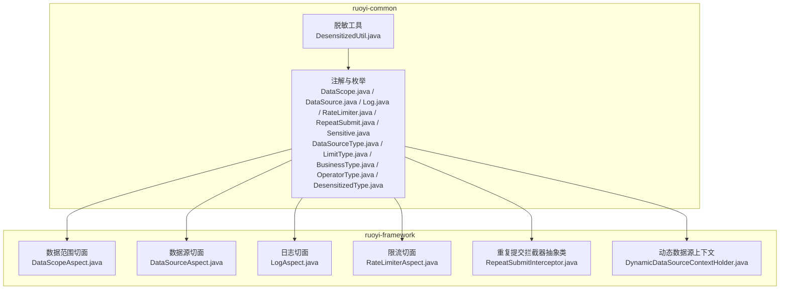
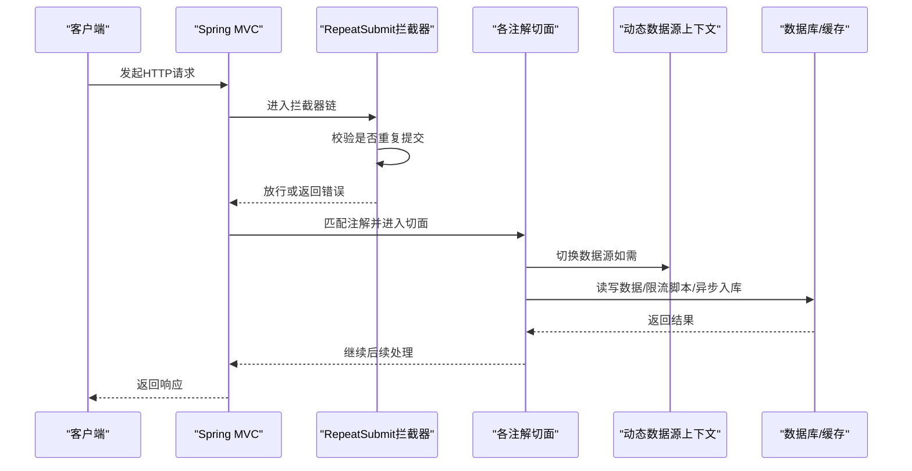
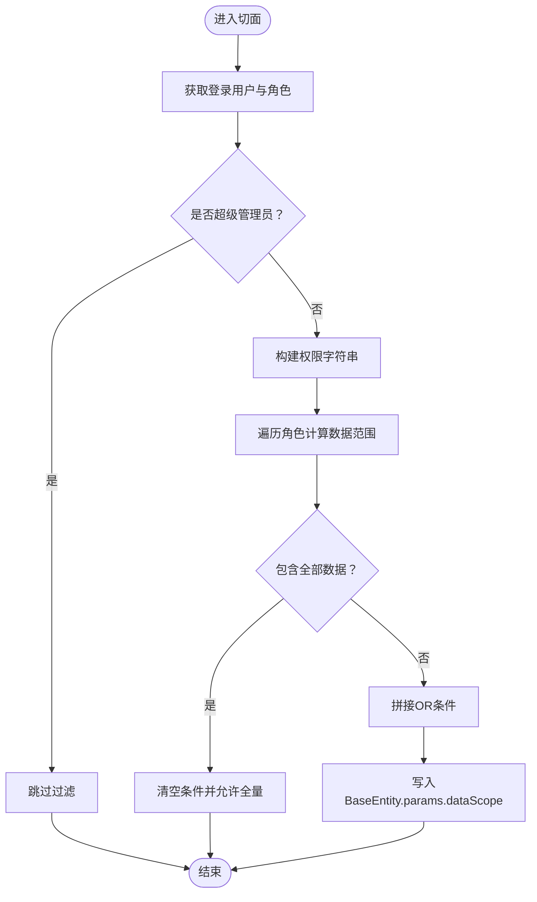
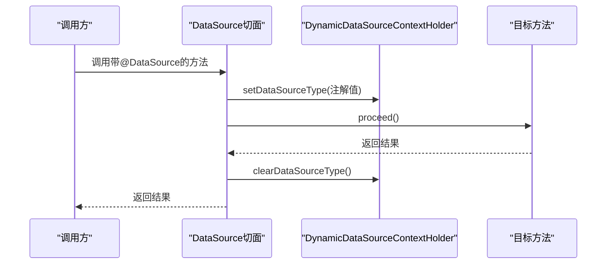
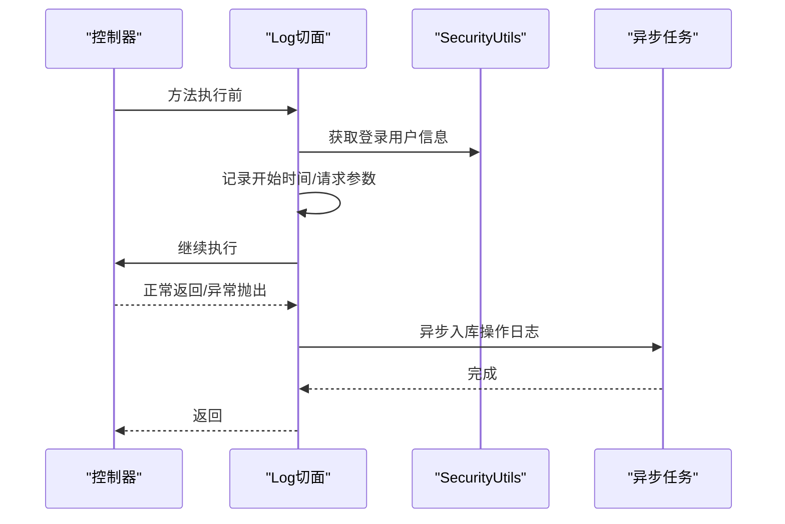
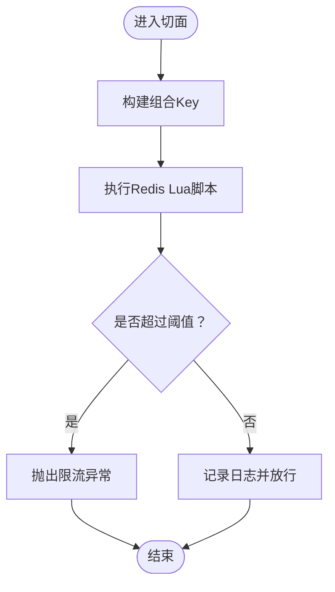
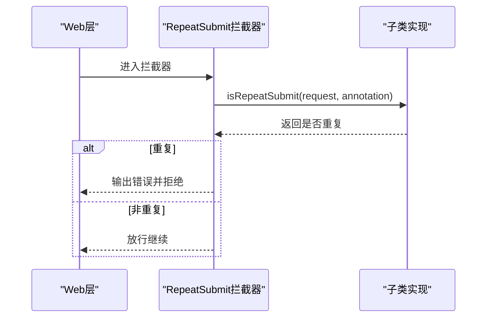
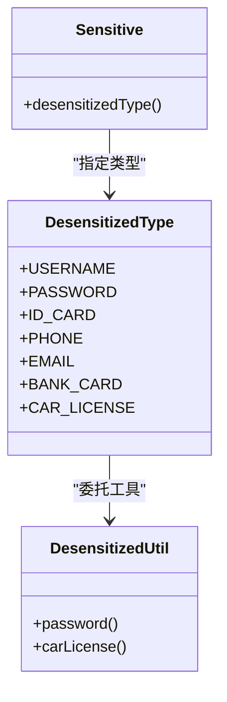
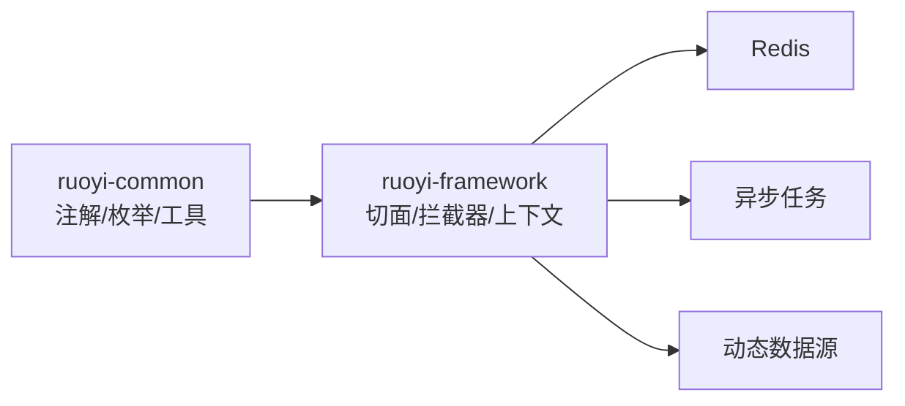

# 权限注解系统

<cite>
**本文引用的文件**
- [DataScope.java](file://ruoyi-common/src/main/java/com/ruoyi/common/annotation/DataScope.java)
- [DataSource.java](file://ruoyi-common/src/main/java/com/ruoyi/common/annotation/DataSource.java)
- [Log.java](file://ruoyi-common/src/main/java/com/ruoyi/common/annotation/Log.java)
- [RateLimiter.java](file://ruoyi-common/src/main/java/com/ruoyi/common/annotation/RateLimiter.java)
- [RepeatSubmit.java](file://ruoyi-common/src/main/java/com/ruoyi/common/annotation/RepeatSubmit.java)
- [Sensitive.java](file://ruoyi-common/src/main/java/com/ruoyi/common/annotation/Sensitive.java)
- [DataScopeAspect.java](file://ruoyi-framework/src/main/java/com/ruoyi/framework/aspectj/DataScopeAspect.java)
- [DataSourceAspect.java](file://ruoyi-framework/src/main/java/com/ruoyi/framework/aspectj/DataSourceAspect.java)
- [LogAspect.java](file://ruoyi-framework/src/main/java/com/ruoyi/framework/aspectj/LogAspect.java)
- [RateLimiterAspect.java](file://ruoyi-framework/src/main/java/com/ruoyi/framework/aspectj/RateLimiterAspect.java)
- [RepeatSubmitInterceptor.java](file://ruoyi-framework/src/main/java/com/ruoyi/framework/interceptor/RepeatSubmitInterceptor.java)
- [DynamicDataSourceContextHolder.java](file://ruoyi-framework/src/main/java/com/ruoyi/framework/datasource/DynamicDataSourceContextHolder.java)
- [DataSourceType.java](file://ruoyi-common/src/main/java/com/ruoyi/common/enums/DataSourceType.java)
- [LimitType.java](file://ruoyi-common/src/main/java/com/ruoyi/common/enums/LimitType.java)
- [BusinessType.java](file://ruoyi-common/src/main/java/com/ruoyi/common/enums/BusinessType.java)
- [OperatorType.java](file://ruoyi-common/src/main/java/com/ruoyi/common/enums/OperatorType.java)
- [DesensitizedType.java](file://ruoyi-common/src/main/java/com/ruoyi/common/enums/DesensitizedType.java)
- [DesensitizedUtil.java](file://ruoyi-common/src/main/java/com/ruoyi/common/utils/DesensitizedUtil.java)
</cite>

## 目录
1. [简介](#简介)
2. [项目结构](#项目结构)
3. [核心组件](#核心组件)
4. [架构总览](#架构总览)
5. [详细组件分析](#详细组件分析)
6. [依赖分析](#依赖分析)
7. [性能考虑](#性能考虑)
8. [故障排查指南](#故障排查指南)
9. [结论](#结论)
10. [附录](#附录)

## 简介
本文件系统性梳理港好住信息系统中的权限注解体系，围绕以下注解展开：@DataScope（数据范围）、@DataSource（数据源切换）、@Log（操作日志）、@RateLimiter（限流）、@RepeatSubmit（防重复提交）、@Sensitive（敏感信息脱敏）。内容涵盖注解定义、切面/拦截器处理逻辑、参数配置方式、在权限控制中的作用与价值、组合使用方式、最佳实践、性能评估、常见配置错误、调试技巧与优化建议。

## 项目结构
权限注解系统主要分布在两个模块：
- ruoyi-common：注解定义与通用枚举、工具类
- ruoyi-framework：对应切面与拦截器、动态数据源上下文

图表来源
- [DataScope.java:1-34](file://ruoyi-common/src/main/java/com/ruoyi/common/annotation/DataScope.java#L1-L34)
- [DataSource.java:1-29](file://ruoyi-common/src/main/java/com/ruoyi/common/annotation/DataSource.java#L1-L29)
- [Log.java:1-52](file://ruoyi-common/src/main/java/com/ruoyi/common/annotation/Log.java#L1-L52)
- [RateLimiter.java:1-41](file://ruoyi-common/src/main/java/com/ruoyi/common/annotation/RateLimiter.java#L1-L41)
- [RepeatSubmit.java:1-32](file://ruoyi-common/src/main/java/com/ruoyi/common/annotation/RepeatSubmit.java#L1-L32)
- [Sensitive.java:1-25](file://ruoyi-common/src/main/java/com/ruoyi/common/annotation/Sensitive.java#L1-L25)
- [DataScopeAspect.java:1-185](file://ruoyi-framework/src/main/java/com/ruoyi/framework/aspectj/DataScopeAspect.java#L1-L185)
- [DataSourceAspect.java:1-73](file://ruoyi-framework/src/main/java/com/ruoyi/framework/aspectj/DataSourceAspect.java#L1-L73)
- [LogAspect.java:1-257](file://ruoyi-framework/src/main/java/com/ruoyi/framework/aspectj/LogAspect.java#L1-L257)
- [RateLimiterAspect.java:1-90](file://ruoyi-framework/src/main/java/com/ruoyi/framework/aspectj/RateLimiterAspect.java#L1-L90)
- [RepeatSubmitInterceptor.java:1-57](file://ruoyi-framework/src/main/java/com/ruoyi/framework/interceptor/RepeatSubmitInterceptor.java#L1-L57)
- [DynamicDataSourceContextHolder.java:1-46](file://ruoyi-framework/src/main/java/com/ruoyi/framework/datasource/DynamicDataSourceContextHolder.java#L1-L46)

章节来源
- [DataScope.java:1-34](file://ruoyi-common/src/main/java/com/ruoyi/common/annotation/DataScope.java#L1-L34)
- [DataSource.java:1-29](file://ruoyi-common/src/main/java/com/ruoyi/common/annotation/DataSource.java#L1-L29)
- [Log.java:1-52](file://ruoyi-common/src/main/java/com/ruoyi/common/annotation/Log.java#L1-L52)
- [RateLimiter.java:1-41](file://ruoyi-common/src/main/java/com/ruoyi/common/annotation/RateLimiter.java#L1-L41)
- [RepeatSubmit.java:1-32](file://ruoyi-common/src/main/java/com/ruoyi/common/annotation/RepeatSubmit.java#L1-L32)
- [Sensitive.java:1-25](file://ruoyi-common/src/main/java/com/ruoyi/common/annotation/Sensitive.java#L1-L25)

## 核心组件
- 注解层：定义横切关注点的声明式边界（目标位置、参数、默认值）
- 切面层：基于AOP在方法执行前后织入权限控制逻辑
- 拦截器层：在Web层拦截请求，处理重复提交等前置校验
- 上下文与工具：动态数据源选择、脱敏策略与工具

章节来源
- [DataScopeAspect.java:1-185](file://ruoyi-framework/src/main/java/com/ruoyi/framework/aspectj/DataScopeAspect.java#L1-L185)
- [DataSourceAspect.java:1-73](file://ruoyi-framework/src/main/java/com/ruoyi/framework/aspectj/DataSourceAspect.java#L1-L73)
- [LogAspect.java:1-257](file://ruoyi-framework/src/main/java/com/ruoyi/framework/aspectj/LogAspect.java#L1-L257)
- [RateLimiterAspect.java:1-90](file://ruoyi-framework/src/main/java/com/ruoyi/framework/aspectj/RateLimiterAspect.java#L1-L90)
- [RepeatSubmitInterceptor.java:1-57](file://ruoyi-framework/src/main/java/com/ruoyi/framework/interceptor/RepeatSubmitInterceptor.java#L1-L57)
- [DynamicDataSourceContextHolder.java:1-46](file://ruoyi-framework/src/main/java/com/ruoyi/framework/datasource/DynamicDataSourceContextHolder.java#L1-L46)

## 架构总览
权限注解系统通过“注解 + 切面/拦截器 + 上下文”的模式，将权限控制从业务代码中剥离，形成可复用、可配置的横切能力。

图表来源
- [RepeatSubmitInterceptor.java:1-57](file://ruoyi-framework/src/main/java/com/ruoyi/framework/interceptor/RepeatSubmitInterceptor.java#L1-L57)
- [DataSourceAspect.java:1-73](file://ruoyi-framework/src/main/java/com/ruoyi/framework/aspectj/DataSourceAspect.java#L1-L73)
- [RateLimiterAspect.java:1-90](file://ruoyi-framework/src/main/java/com/ruoyi/framework/aspectj/RateLimiterAspect.java#L1-L90)
- [LogAspect.java:1-257](file://ruoyi-framework/src/main/java/com/ruoyi/framework/aspectj/LogAspect.java#L1-L257)
- [DynamicDataSourceContextHolder.java:1-46](file://ruoyi-framework/src/main/java/com/ruoyi/framework/datasource/DynamicDataSourceContextHolder.java#L1-L46)

## 详细组件分析

### @DataScope 数据范围注解
- 作用：在查询接口执行前，根据用户的角色数据权限与传递的权限字符串，动态拼接SQL条件，实现“按部门/本人/自定义”等维度的数据可见性控制。
- 关键参数：
  - deptAlias：部门表别名，用于拼接dept_id条件
  - userAlias：用户表别名，用于拼接user_id条件
  - permission：权限字符，默认从权限上下文中获取，支持多值
- 切面处理要点：
  - 在方法执行前清理旧的dataScope参数，避免注入风险
  - 根据用户角色的dataScope类型与权限匹配情况，构造OR条件串
  - 将最终SQL片段放入BaseEntity.params的dataScope键中，供MyBatis参数绑定使用
- 使用场景：
  - 列表查询时自动附加数据范围过滤
  - 管理员与普通用户的可见数据隔离
- 注意事项：
  - 若用户无匹配权限，会强制追加“不查询任何数据”的兜底条件
  - 未设置userAlias且数据权限为“仅本人”，将不返回任何数据

图表来源
- [DataScopeAspect.java:66-170](file://ruoyi-framework/src/main/java/com/ruoyi/framework/aspectj/DataScopeAspect.java#L66-L170)
- [DataScope.java:1-34](file://ruoyi-common/src/main/java/com/ruoyi/common/annotation/DataScope.java#L1-L34)

章节来源
- [DataScope.java:1-34](file://ruoyi-common/src/main/java/com/ruoyi/common/annotation/DataScope.java#L1-L34)
- [DataScopeAspect.java:1-185](file://ruoyi-framework/src/main/java/com/ruoyi/framework/aspectj/DataScopeAspect.java#L1-L185)

### @DataSource 数据源切换注解
- 作用：在方法执行期间切换主/从库，实现读写分离与负载均衡。
- 关键参数：
  - value：目标数据源类型（MASTER/SLAVE），默认MASTER
- 切面处理要点：
  - 优先匹配方法注解，其次匹配类注解，方法优先级更高
  - 执行前后设置/清理数据源上下文，确保线程安全
- 使用场景：
  - 查询类接口标注SLAVE，写入类接口标注MASTER
  - 批量导入/报表统计走从库

图表来源
- [DataSourceAspect.java:37-71](file://ruoyi-framework/src/main/java/com/ruoyi/framework/aspectj/DataSourceAspect.java#L37-L71)
- [DynamicDataSourceContextHolder.java:24-44](file://ruoyi-framework/src/main/java/com/ruoyi/framework/datasource/DynamicDataSourceContextHolder.java#L24-L44)
- [DataSource.java:1-29](file://ruoyi-common/src/main/java/com/ruoyi/common/annotation/DataSource.java#L1-L29)
- [DataSourceType.java:1-20](file://ruoyi-common/src/main/java/com/ruoyi/common/enums/DataSourceType.java#L1-L20)

章节来源
- [DataSource.java:1-29](file://ruoyi-common/src/main/java/com/ruoyi/common/annotation/DataSource.java#L1-L29)
- [DataSourceAspect.java:1-73](file://ruoyi-framework/src/main/java/com/ruoyi/framework/aspectj/DataSourceAspect.java#L1-L73)
- [DynamicDataSourceContextHolder.java:1-46](file://ruoyi-framework/src/main/java/com/ruoyi/framework/datasource/DynamicDataSourceContextHolder.java#L1-L46)

### @Log 操作日志注解
- 作用：自动记录用户操作日志，包括请求URL、IP、方法、耗时、请求/响应参数、异常信息等。
- 关键参数：
  - title：模块标题
  - businessType：业务类型（新增/修改/删除/授权/导出/导入/强制/生成代码/清空）
  - operatorType：操作人类别（后台/手机端/其他）
  - isSaveRequestData/isSaveResponseData：是否保存请求/响应参数
  - excludeParamNames：排除的参数名数组
- 切面处理要点：
  - 基于ThreadLocal记录开始时间，计算耗时
  - 通过异步任务将日志持久化，避免阻塞主线程
  - 自动排除敏感字段（如密码相关），支持扩展排除列表
- 使用场景：
  - 审计追踪、合规留痕、问题定位

图表来源
- [LogAspect.java:56-137](file://ruoyi-framework/src/main/java/com/ruoyi/framework/aspectj/LogAspect.java#L56-L137)
- [BusinessType.java:1-60](file://ruoyi-common/src/main/java/com/ruoyi/common/enums/BusinessType.java#L1-L60)
- [OperatorType.java:1-25](file://ruoyi-common/src/main/java/com/ruoyi/common/enums/OperatorType.java#L1-L25)

章节来源
- [Log.java:1-52](file://ruoyi-common/src/main/java/com/ruoyi/common/annotation/Log.java#L1-L52)
- [LogAspect.java:1-257](file://ruoyi-framework/src/main/java/com/ruoyi/framework/aspectj/LogAspect.java#L1-L257)

### @RateLimiter 限流注解
- 作用：基于Redis的Lua脚本实现精准限流，防止接口被恶意刷取或突发流量压垮。
- 关键参数：
  - key：限流Key前缀（默认统一前缀）
  - time：时间窗口（秒）
  - count：时间窗内允许的次数
  - limitType：限流粒度（默认全局，IP限流可选）
- 切面处理要点：
  - 组合Key：key + IP（若启用IP限流）+ 类名+方法名
  - 使用RedisScript执行原子计数与过期控制
  - 超限时抛出业务异常，提示“访问过于频繁”
- 使用场景：
  - 登录/验证码/注册/支付回调等高敏感接口
  - 防御DDoS与爬虫

图表来源
- [RateLimiterAspect.java:49-88](file://ruoyi-framework/src/main/java/com/ruoyi/framework/aspectj/RateLimiterAspect.java#L49-L88)
- [LimitType.java:1-21](file://ruoyi-common/src/main/java/com/ruoyi/common/enums/LimitType.java#L1-L21)

章节来源
- [RateLimiter.java:1-41](file://ruoyi-common/src/main/java/com/ruoyi/common/annotation/RateLimiter.java#L1-L41)
- [RateLimiterAspect.java:1-90](file://ruoyi-framework/src/main/java/com/ruoyi/framework/aspectj/RateLimiterAspect.java#L1-L90)

### @RepeatSubmit 防重复提交注解
- 作用：在Web层拦截POST/PUT等幂等性较弱的请求，防止用户重复点击导致的重复业务执行。
- 关键参数：
  - interval：最小间隔（毫秒），低于此间隔视为重复
  - message：重复提交时的提示消息
- 实现机制：
  - 通过抽象拦截器读取方法上的注解，交由子类实现具体判断逻辑（如基于Redis的去重Key）
  - 若判定重复，直接输出错误响应并中断后续处理
- 使用场景：
  - 表单提交、支付确认、订单下单等关键业务

图表来源
- [RepeatSubmitInterceptor.java:22-55](file://ruoyi-framework/src/main/java/com/ruoyi/framework/interceptor/RepeatSubmitInterceptor.java#L22-L55)
- [RepeatSubmit.java:1-32](file://ruoyi-common/src/main/java/com/ruoyi/common/annotation/RepeatSubmit.java#L1-L32)

章节来源
- [RepeatSubmit.java:1-32](file://ruoyi-common/src/main/java/com/ruoyi/common/annotation/RepeatSubmit.java#L1-L32)
- [RepeatSubmitInterceptor.java:1-57](file://ruoyi-framework/src/main/java/com/ruoyi/framework/interceptor/RepeatSubmitInterceptor.java#L1-L57)

### @Sensitive 敏感信息注解
- 作用：在序列化阶段对字段进行脱敏，保护隐私与安全。
- 关键参数：
  - desensitizedType：脱敏类型（姓名、密码、身份证、手机号、邮箱、银行卡、车牌等）
- 实现机制：
  - 注解通过@JsonSerialize绑定自定义序列化器
  - 序列化器委托给脱敏工具类，按类型应用正则/固定规则
- 使用场景：
  - 用户信息对外展示、日志输出、接口返回体

图表来源
- [Sensitive.java:1-25](file://ruoyi-common/src/main/java/com/ruoyi/common/annotation/Sensitive.java#L1-L25)
- [DesensitizedType.java:1-60](file://ruoyi-common/src/main/java/com/ruoyi/common/enums/DesensitizedType.java#L1-L60)
- [DesensitizedUtil.java:1-50](file://ruoyi-common/src/main/java/com/ruoyi/common/utils/DesensitizedUtil.java#L1-L50)

章节来源
- [Sensitive.java:1-25](file://ruoyi-common/src/main/java/com/ruoyi/common/annotation/Sensitive.java#L1-L25)
- [DesensitizedType.java:1-60](file://ruoyi-common/src/main/java/com/ruoyi/common/enums/DesensitizedType.java#L1-L60)
- [DesensitizedUtil.java:1-50](file://ruoyi-common/src/main/java/com/ruoyi/common/utils/DesensitizedUtil.java#L1-L50)

## 依赖分析
- 注解与枚举：位于common模块，作为契约定义，被framework模块的切面/拦截器引用
- 切面与拦截器：位于framework模块，依赖common的注解与枚举，同时依赖框架基础设施（Redis、异步任务、动态数据源）
- 动态数据源：通过ThreadLocal在切面执行期间切换数据源，避免跨线程污染

图表来源
- [DataScopeAspect.java:1-185](file://ruoyi-framework/src/main/java/com/ruoyi/framework/aspectj/DataScopeAspect.java#L1-L185)
- [DataSourceAspect.java:1-73](file://ruoyi-framework/src/main/java/com/ruoyi/framework/aspectj/DataSourceAspect.java#L1-L73)
- [LogAspect.java:1-257](file://ruoyi-framework/src/main/java/com/ruoyi/framework/aspectj/LogAspect.java#L1-L257)
- [RateLimiterAspect.java:1-90](file://ruoyi-framework/src/main/java/com/ruoyi/framework/aspectj/RateLimiterAspect.java#L1-L90)
- [RepeatSubmitInterceptor.java:1-57](file://ruoyi-framework/src/main/java/com/ruoyi/framework/interceptor/RepeatSubmitInterceptor.java#L1-L57)
- [DynamicDataSourceContextHolder.java:1-46](file://ruoyi-framework/src/main/java/com/ruoyi/framework/datasource/DynamicDataSourceContextHolder.java#L1-L46)

章节来源
- [DataScopeAspect.java:1-185](file://ruoyi-framework/src/main/java/com/ruoyi/framework/aspectj/DataScopeAspect.java#L1-L185)
- [DataSourceAspect.java:1-73](file://ruoyi-framework/src/main/java/com/ruoyi/framework/aspectj/DataSourceAspect.java#L1-L73)
- [LogAspect.java:1-257](file://ruoyi-framework/src/main/java/com/ruoyi/framework/aspectj/LogAspect.java#L1-L257)
- [RateLimiterAspect.java:1-90](file://ruoyi-framework/src/main/java/com/ruoyi/framework/aspectj/RateLimiterAspect.java#L1-L90)
- [RepeatSubmitInterceptor.java:1-57](file://ruoyi-framework/src/main/java/com/ruoyi/framework/interceptor/RepeatSubmitInterceptor.java#L1-L57)
- [DynamicDataSourceContextHolder.java:1-46](file://ruoyi-framework/src/main/java/com/ruoyi/framework/datasource/DynamicDataSourceContextHolder.java#L1-L46)

## 性能考虑
- 切面与拦截器开销：注解匹配与反射调用存在少量CPU开销，但通常可忽略；关键在于避免在热路径上做昂贵操作
- Redis限流：Lua脚本原子计数，延迟极低；建议合理设置time/count与limitType，避免过度精确导致Key爆炸
- 异步入库：日志写入采用异步队列，不影响主请求时延
- 数据范围过滤：SQL拼接在服务端完成，注意避免在大表上进行复杂函数计算；必要时配合索引与分页
- 动态数据源：ThreadLocal切换成本低，但需确保finally中清理，防止线程池复用造成脏数据

## 故障排查指南
- @DataScope无效
  - 检查是否为超级管理员（会被跳过过滤）
  - 确认permission参数与用户实际权限是否匹配
  - 若未设置userAlias且数据权限为“仅本人”，将不返回任何数据
  - 参考：[DataScopeAspect.java:66-170](file://ruoyi-framework/src/main/java/com/ruoyi/framework/aspectj/DataScopeAspect.java#L66-L170)
- @DataSource切换失败
  - 确认注解是否标注在正确的方法或类上，方法优先级高于类
  - 检查动态数据源配置与线程清理逻辑
  - 参考：[DataSourceAspect.java:37-71](file://ruoyi-framework/src/main/java/com/ruoyi/framework/aspectj/DataSourceAspect.java#L37-L71)
- @Log未入库
  - 检查异步任务线程池是否正常
  - 确认请求参数/响应参数是否被排除（excludeParamNames）
  - 参考：[LogAspect.java:124-136](file://ruoyi-framework/src/main/java/com/ruoyi/framework/aspectj/LogAspect.java#L124-L136)
- @RateLimiter误伤
  - 调整time/count或改为IP限流
  - 检查Key前缀是否一致，避免不同实例间Key冲突
  - 参考：[RateLimiterAspect.java:49-88](file://ruoyi-framework/src/main/java/com/ruoyi/framework/aspectj/RateLimiterAspect.java#L49-L88)
- @RepeatSubmit误判
  - 调整interval至更宽松的时间
  - 确认子类实现的去重策略（如基于Redis Key TTL）
  - 参考：[RepeatSubmitInterceptor.java:22-55](file://ruoyi-framework/src/main/java/com/ruoyi/framework/interceptor/RepeatSubmitInterceptor.java#L22-L55)
- @Sensitive未生效
  - 确认字段上是否标注了@Sensitive
  - 检查序列化器是否被正确绑定
  - 参考：[Sensitive.java:17-25](file://ruoyi-common/src/main/java/com/ruoyi/common/annotation/Sensitive.java#L17-L25)

章节来源
- [DataScopeAspect.java:66-170](file://ruoyi-framework/src/main/java/com/ruoyi/framework/aspectj/DataScopeAspect.java#L66-L170)
- [DataSourceAspect.java:37-71](file://ruoyi-framework/src/main/java/com/ruoyi/framework/aspectj/DataSourceAspect.java#L37-L71)
- [LogAspect.java:124-136](file://ruoyi-framework/src/main/java/com/ruoyi/framework/aspectj/LogAspect.java#L124-L136)
- [RateLimiterAspect.java:49-88](file://ruoyi-framework/src/main/java/com/ruoyi/framework/aspectj/RateLimiterAspect.java#L49-L88)
- [RepeatSubmitInterceptor.java:22-55](file://ruoyi-framework/src/main/java/com/ruoyi/framework/interceptor/RepeatSubmitInterceptor.java#L22-L55)
- [Sensitive.java:17-25](file://ruoyi-common/src/main/java/com/ruoyi/common/annotation/Sensitive.java#L17-L25)

## 结论
权限注解系统通过“注解 + 切面/拦截器 + 上下文”的架构，将数据范围、数据源切换、操作审计、限流、防重复提交与敏感信息脱敏等横切关注点标准化、模块化。其优势在于：
- 降低权限代码侵入性，提升可读性与可维护性
- 通过参数化配置快速适配不同业务场景
- 与异步、Redis、动态数据源等基础设施协同，兼顾性能与安全

## 附录
- 组合使用建议
  - 列表查询：@DataScope + @DataSource(SLAVE) + @Log
  - 写入接口：@DataSource(MASTER) + @Log + @RateLimiter
  - 关键表单：@RepeatSubmit + @Log + @RateLimiter
  - 返回体：对敏感字段使用@Sensitive
- 最佳实践
  - 明确注解职责边界，避免在同一方法上堆叠过多注解
  - 合理设置限流阈值与粒度，结合业务峰值与SLA
  - 数据范围权限字符串应与菜单/功能点一一对应
  - 脱敏策略应遵循最小暴露原则与合规要求
- 性能优化
  - 限流Key设计去冗余，避免过多维度组合
  - 日志参数排除敏感字段，减少序列化与存储开销
  - 数据范围过滤尽量配合索引与分页，避免全表扫描