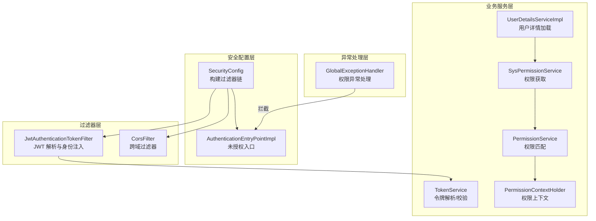
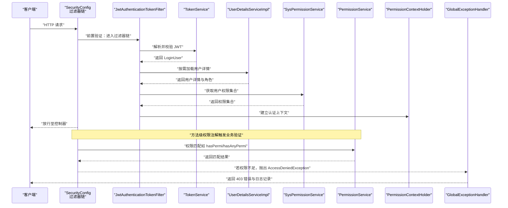
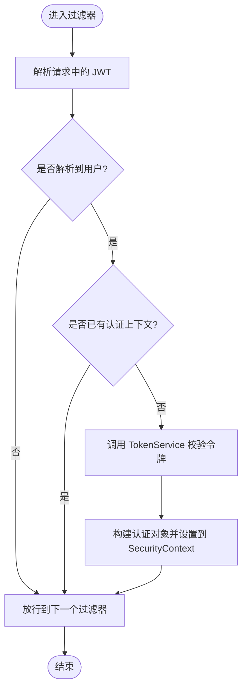
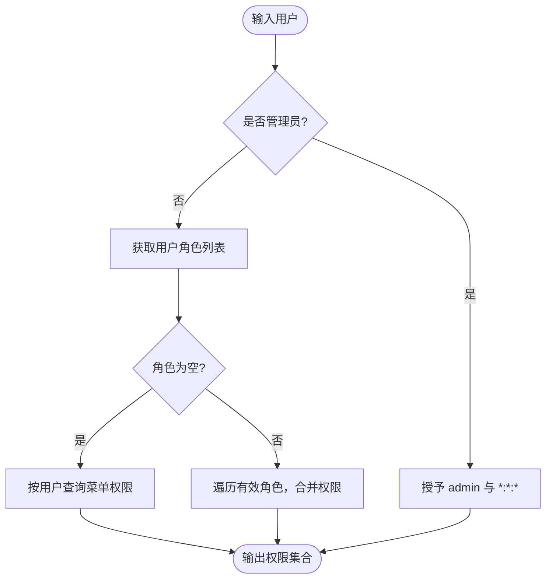
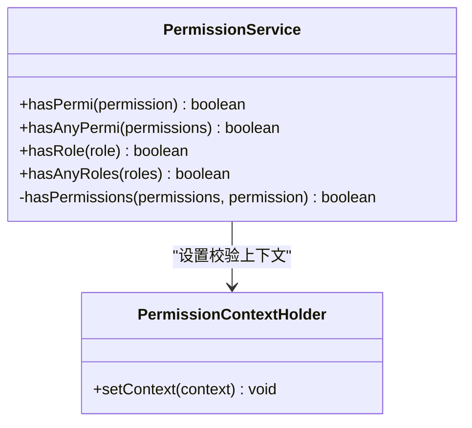
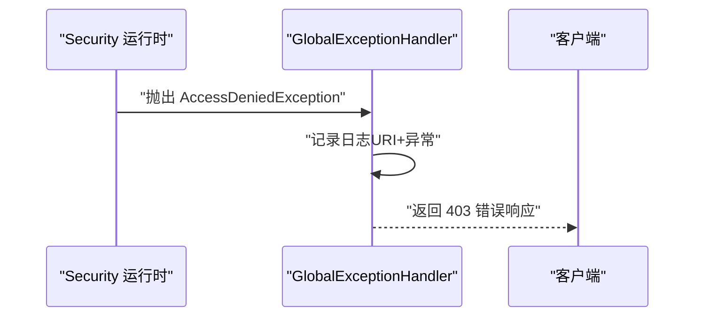
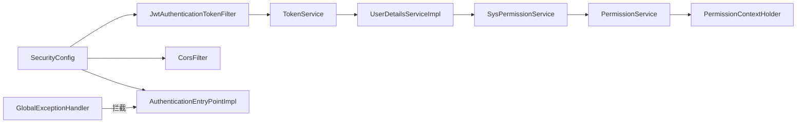

# 权限验证流程

<cite>
**本文引用的文件**
- [JwtAuthenticationTokenFilter.java](file://ruoyi-framework/src/main/java/com/ruoyi/framework/security/filter/JwtAuthenticationTokenFilter.java)
- [SysPermissionService.java](file://ruoyi-framework/src/main/java/com/ruoyi/framework/web/service/SysPermissionService.java)
- [GlobalExceptionHandler.java](file://ruoyi-framework/src/main/java/com/ruoyi/framework/web/exception/GlobalExceptionHandler.java)
- [SecurityConfig.java](file://ruoyi-framework/src/main/java/com/ruoyi/framework/config/SecurityConfig.java)
- [PermissionService.java](file://ruoyi-framework/src/main/java/com/ruoyi/framework/web/service/PermissionService.java)
- [PermissionContextHolder.java](file://ruoyi-framework/src/main/java/com/ruoyi/framework/security/context/PermissionContextHolder.java)
- [AuthenticationEntryPointImpl.java](file://ruoyi-framework/src/main/java/com/ruoyi/framework/security/handle/AuthenticationEntryPointImpl.java)
- [UserDetailsServiceImpl.java](file://ruoyi-framework/src/main/java/com/ruoyi/framework/web/service/UserDetailsServiceImpl.java)
- [SysLoginService.java](file://ruoyi-framework/src/main/java/com/ruoyi/framework/web/service/SysLoginService.java)
- [TokenService.java](file://ruoyi-framework/src/main/java/com/ruoyi/framework/web/service/TokenService.java)
</cite>

## 目录
1. [引言](#引言)
2. [项目结构](#项目结构)
3. [核心组件](#核心组件)
4. [架构总览](#架构总览)
5. [详细组件分析](#详细组件分析)
6. [依赖分析](#依赖分析)
7. [性能考虑](#性能考虑)
8. [故障排查指南](#故障排查指南)
9. [结论](#结论)
10. [附录](#附录)

## 引言
本文件面向港好住信息系统中的权限验证流程，系统采用基于 JWT 的无状态认证与 Spring Security 的方法级权限控制相结合的方式，覆盖从请求进入、JWT 解析与用户身份建立、权限获取与匹配、到异常处理与日志记录的完整生命周期。文档重点说明以下内容：
- 完整的权限验证生命周期：JWT 令牌解析、用户身份认证、权限获取、权限匹配、权限拒绝处理
- 关键组件职责与协作：JwtAuthenticationTokenFilter 过滤器、SysPermissionService 权限服务、GlobalExceptionHandler 异常处理
- 执行顺序：前置验证（过滤器链）、业务验证（方法注解）、后置验证（异常处理）
- 权限缓存策略：权限信息缓存、缓存失效与更新策略
- 性能优化：批量权限检查、异步权限验证、权限预加载
- 诊断方法、常见错误与监控日志方案

## 项目结构
围绕权限验证的相关代码主要集中在 ruoyi-framework 模块，涉及安全配置、过滤器链、权限服务、上下文持有者、全局异常处理以及登录与令牌服务等。

图表来源
- [SecurityConfig.java:85-124](file://ruoyi-framework/src/main/java/com/ruoyi/framework/config/SecurityConfig.java#L85-L124)
- [JwtAuthenticationTokenFilter.java:30-43](file://ruoyi-framework/src/main/java/com/ruoyi/framework/security/filter/JwtAuthenticationTokenFilter.java#L30-L43)
- [TokenService.java](file://ruoyi-framework/src/main/java/com/ruoyi/framework/web/service/TokenService.java)
- [UserDetailsServiceImpl.java](file://ruoyi-framework/src/main/java/com/ruoyi/framework/web/service/UserDetailsServiceImpl.java)
- [SysPermissionService.java:36-87](file://ruoyi-framework/src/main/java/com/ruoyi/framework/web/service/SysPermissionService.java#L36-L87)
- [PermissionService.java:27-158](file://ruoyi-framework/src/main/java/com/ruoyi/framework/web/service/PermissionService.java#L27-L158)
- [PermissionContextHolder.java](file://ruoyi-framework/src/main/java/com/ruoyi/framework/security/context/PermissionContextHolder.java)
- [GlobalExceptionHandler.java:35-41](file://ruoyi-framework/src/main/java/com/ruoyi/framework/web/exception/GlobalExceptionHandler.java#L35-L41)

章节来源
- [SecurityConfig.java:85-124](file://ruoyi-framework/src/main/java/com/ruoyi/framework/config/SecurityConfig.java#L85-L124)
- [JwtAuthenticationTokenFilter.java:30-43](file://ruoyi-framework/src/main/java/com/ruoyi/framework/security/filter/JwtAuthenticationTokenFilter.java#L30-L43)

## 核心组件
- JwtAuthenticationTokenFilter：在过滤器链中解析请求中的 JWT，提取用户信息并建立 Spring Security 的认证上下文，确保后续业务层可直接获取当前登录用户。
- SysPermissionService：负责从用户角色与菜单服务中聚合权限集合，支持管理员全权与普通用户的细粒度权限。
- PermissionService：提供 hasPermi/hasAnyPermi 等便捷方法，进行权限字符串匹配与角色判断，并通过 PermissionContextHolder 记录当前校验上下文。
- GlobalExceptionHandler：统一捕获权限相关异常（如 AccessDeniedException），输出标准化错误响应并记录日志。
- SecurityConfig：定义过滤器链顺序、匿名放行路径、会话策略与方法级权限注解启用。
- TokenService：封装 JWT 的解析与校验细节，供过滤器调用。
- AuthenticationEntryPointImpl：未授权入口处理（通常用于返回 401）。
- UserDetailsServiceImpl：加载用户详情与角色权限，为权限服务提供基础数据。
- SysLoginService：登录流程与令牌签发（与权限验证生命周期衔接）。

章节来源
- [JwtAuthenticationTokenFilter.java:30-43](file://ruoyi-framework/src/main/java/com/ruoyi/framework/security/filter/JwtAuthenticationTokenFilter.java#L30-L43)
- [SysPermissionService.java:36-87](file://ruoyi-framework/src/main/java/com/ruoyi/framework/web/service/SysPermissionService.java#L36-L87)
- [PermissionService.java:27-158](file://ruoyi-framework/src/main/java/com/ruoyi/framework/web/service/PermissionService.java#L27-L158)
- [GlobalExceptionHandler.java:35-41](file://ruoyi-framework/src/main/java/com/ruoyi/framework/web/exception/GlobalExceptionHandler.java#L35-L41)
- [SecurityConfig.java:27-28](file://ruoyi-framework/src/main/java/com/ruoyi/framework/config/SecurityConfig.java#L27-L28)
- [TokenService.java](file://ruoyi-framework/src/main/java/com/ruoyi/framework/web/service/TokenService.java)
- [AuthenticationEntryPointImpl.java](file://ruoyi-framework/src/main/java/com/ruoyi/framework/security/handle/AuthenticationEntryPointImpl.java)
- [UserDetailsServiceImpl.java](file://ruoyi-framework/src/main/java/com/ruoyi/framework/web/service/UserDetailsServiceImpl.java)
- [SysLoginService.java](file://ruoyi-framework/src/main/java/com/ruoyi/framework/web/service/SysLoginService.java)

## 架构总览
下图展示一次请求从进入过滤器链到完成权限验证的整体流程，包括前置验证（JWT 解析与认证）、业务验证（方法级注解）、后置验证（异常处理）。

图表来源
- [SecurityConfig.java:85-124](file://ruoyi-framework/src/main/java/com/ruoyi/framework/config/SecurityConfig.java#L85-L124)
- [JwtAuthenticationTokenFilter.java:30-43](file://ruoyi-framework/src/main/java/com/ruoyi/framework/security/filter/JwtAuthenticationTokenFilter.java#L30-L43)
- [TokenService.java](file://ruoyi-framework/src/main/java/com/ruoyi/framework/web/service/TokenService.java)
- [UserDetailsServiceImpl.java](file://ruoyi-framework/src/main/java/com/ruoyi/framework/web/service/UserDetailsServiceImpl.java)
- [SysPermissionService.java:36-87](file://ruoyi-framework/src/main/java/com/ruoyi/framework/web/service/SysPermissionService.java#L36-L87)
- [PermissionService.java:27-158](file://ruoyi-framework/src/main/java/com/ruoyi/framework/web/service/PermissionService.java#L27-L158)
- [PermissionContextHolder.java](file://ruoyi-framework/src/main/java/com/ruoyi/framework/security/context/PermissionContextHolder.java)
- [GlobalExceptionHandler.java:35-41](file://ruoyi-framework/src/main/java/com/ruoyi/framework/web/exception/GlobalExceptionHandler.java#L35-L41)

## 详细组件分析

### JwtAuthenticationTokenFilter 过滤器工作机制
- 职责：每请求仅执行一次，从请求中解析 JWT，获取 LoginUser；若尚未建立认证上下文，则调用 TokenService 校验并建立认证对象，填充用户权限。
- 关键点：
  - 使用 OncePerRequestFilter 确保每个请求只处理一次
  - 仅在 SecurityContextHolder 中不存在认证时才注入
  - 将用户权限集合作为认证细节传递给后续业务层

图表来源
- [JwtAuthenticationTokenFilter.java:30-43](file://ruoyi-framework/src/main/java/com/ruoyi/framework/security/filter/JwtAuthenticationTokenFilter.java#L30-L43)
- [TokenService.java](file://ruoyi-framework/src/main/java/com/ruoyi/framework/web/service/TokenService.java)

章节来源
- [JwtAuthenticationTokenFilter.java:30-43](file://ruoyi-framework/src/main/java/com/ruoyi/framework/security/filter/JwtAuthenticationTokenFilter.java#L30-L43)

### SysPermissionService 权限服务的验证逻辑
- 职责：聚合用户的角色权限与菜单权限，支持管理员全权放行与普通用户的细粒度权限集合。
- 关键点：
  - 管理员直接赋予“admin”角色与“*:*:*”菜单权限
  - 普通用户通过角色与菜单服务查询权限集合
  - 多角色场景下将各角色权限合并

图表来源
- [SysPermissionService.java:36-87](file://ruoyi-framework/src/main/java/com/ruoyi/framework/web/service/SysPermissionService.java#L36-L87)

章节来源
- [SysPermissionService.java:36-87](file://ruoyi-framework/src/main/java/com/ruoyi/framework/web/service/SysPermissionService.java#L36-L87)

### PermissionService 权限匹配与上下文
- 职责：提供 hasPermi/hasAnyPermi/hasRole 等方法，进行权限字符串与角色匹配；通过 PermissionContextHolder 记录当前校验上下文。
- 关键点：
  - 支持“全部权限”快捷匹配
  - 支持多权限/多角色以分隔符拆分后逐一匹配
  - 与 SecurityUtils 结合获取当前 LoginUser

图表来源
- [PermissionService.java:27-158](file://ruoyi-framework/src/main/java/com/ruoyi/framework/web/service/PermissionService.java#L27-L158)
- [PermissionContextHolder.java](file://ruoyi-framework/src/main/java/com/ruoyi/framework/security/context/PermissionContextHolder.java)

章节来源
- [PermissionService.java:27-158](file://ruoyi-framework/src/main/java/com/ruoyi/framework/web/service/PermissionService.java#L27-L158)
- [PermissionContextHolder.java](file://ruoyi-framework/src/main/java/com/ruoyi/framework/security/context/PermissionContextHolder.java)

### GlobalExceptionHandler 异常处理流程
- 职责：统一捕获权限相关异常（如 AccessDeniedException），输出标准化错误响应并记录日志。
- 关键点：
  - 记录请求 URI 与异常信息
  - 返回统一的 AjaxResult 错误体

图表来源
- [GlobalExceptionHandler.java:35-41](file://ruoyi-framework/src/main/java/com/ruoyi/framework/web/exception/GlobalExceptionHandler.java#L35-L41)

章节来源
- [GlobalExceptionHandler.java:35-41](file://ruoyi-framework/src/main/java/com/ruoyi/framework/web/exception/GlobalExceptionHandler.java#L35-L41)

### 执行顺序：前置验证、业务验证、后置验证
- 前置验证：SecurityConfig 定义过滤器链顺序，先 CORS，再 JwtAuthenticationTokenFilter，最后业务控制器。
- 业务验证：方法级权限注解（如 @PreAuthorize）触发 PermissionService 进行权限匹配。
- 后置验证：异常处理统一拦截 AccessDeniedException 并返回标准错误。

章节来源
- [SecurityConfig.java:118-122](file://ruoyi-framework/src/main/java/com/ruoyi/framework/config/SecurityConfig.java#L118-L122)
- [PermissionService.java:27-158](file://ruoyi-framework/src/main/java/com/ruoyi/framework/web/service/PermissionService.java#L27-L158)
- [GlobalExceptionHandler.java:35-41](file://ruoyi-framework/src/main/java/com/ruoyi/framework/web/exception/GlobalExceptionHandler.java#L35-L41)

## 依赖分析
- 组件耦合关系：
  - SecurityConfig 依赖 JwtAuthenticationTokenFilter、CorsFilter、AuthenticationEntryPointImpl
  - JwtAuthenticationTokenFilter 依赖 TokenService
  - TokenService 依赖用户详情加载与权限聚合服务
  - PermissionService 依赖 SecurityUtils 与 PermissionContextHolder
  - GlobalExceptionHandler 统一处理权限异常
- 可能的循环依赖：当前模块内未见明显循环依赖；若引入外部服务，需避免在 TokenService 中反向依赖业务控制器。

图表来源
- [SecurityConfig.java:85-124](file://ruoyi-framework/src/main/java/com/ruoyi/framework/config/SecurityConfig.java#L85-L124)
- [JwtAuthenticationTokenFilter.java:30-43](file://ruoyi-framework/src/main/java/com/ruoyi/framework/security/filter/JwtAuthenticationTokenFilter.java#L30-L43)
- [TokenService.java](file://ruoyi-framework/src/main/java/com/ruoyi/framework/web/service/TokenService.java)
- [UserDetailsServiceImpl.java](file://ruoyi-framework/src/main/java/com/ruoyi/framework/web/service/UserDetailsServiceImpl.java)
- [SysPermissionService.java:36-87](file://ruoyi-framework/src/main/java/com/ruoyi/framework/web/service/SysPermissionService.java#L36-L87)
- [PermissionService.java:27-158](file://ruoyi-framework/src/main/java/com/ruoyi/framework/web/service/PermissionService.java#L27-L158)
- [PermissionContextHolder.java](file://ruoyi-framework/src/main/java/com/ruoyi/framework/security/context/PermissionContextHolder.java)
- [GlobalExceptionHandler.java:35-41](file://ruoyi-framework/src/main/java/com/ruoyi/framework/web/exception/GlobalExceptionHandler.java#L35-L41)

## 性能考虑
- 批量权限检查：在业务层对多个权限或角色进行一次性判断，减少重复计算与上下文切换。
- 异步权限验证：对于非关键路径的权限预检，可考虑异步化，避免阻塞主请求线程。
- 权限预加载：在用户登录成功后，提前拉取并缓存其权限集合，降低后续请求的数据库访问压力。
- 缓存策略建议：
  - 权限信息缓存：以用户 ID 为键，缓存角色与菜单权限集合，设置合理过期时间
  - 缓存失效：用户角色变更、菜单权限调整时主动失效对应缓存
  - 缓存更新：结合 SysLoginService 登录流程，在签发令牌前刷新权限缓存
- 过滤器链优化：确保 OncePerRequestFilter 的正确使用，避免重复解析与认证

[本节为通用性能指导，不直接分析具体文件]

## 故障排查指南
- 常见验证错误与定位：
  - 403 权限不足：由 GlobalExceptionHandler 捕获 AccessDeniedException，检查控制器方法上的权限注解与用户实际权限集合
  - 401 未认证：由 AuthenticationEntryPointImpl 处理，检查请求头中的 JWT 是否存在、格式是否正确、是否过期
  - 权限匹配失败：检查 PermissionService 的 hasPermi/hasAnyPermi 输入与用户权限集合是否一致
- 日志与监控：
  - GlobalExceptionHandler 已记录请求 URI 与异常信息，可在日志系统中检索
  - 建议在 TokenService 与 SysPermissionService 中增加关键步骤的日志埋点
- 快速复现与修复：
  - 使用最小化请求重现 403/401 场景，核对用户角色与菜单权限
  - 在登录成功后检查权限缓存是否已更新
  - 若为 CORS 导致的跨域问题，确认 SecurityConfig 中 CORS 过滤器顺序与配置

章节来源
- [GlobalExceptionHandler.java:35-41](file://ruoyi-framework/src/main/java/com/ruoyi/framework/web/exception/GlobalExceptionHandler.java#L35-L41)
- [AuthenticationEntryPointImpl.java](file://ruoyi-framework/src/main/java/com/ruoyi/framework/security/handle/AuthenticationEntryPointImpl.java)
- [PermissionService.java:27-158](file://ruoyi-framework/src/main/java/com/ruoyi/framework/web/service/PermissionService.java#L27-L158)

## 结论
港好住信息系统通过“过滤器前置验证 + 方法级业务验证 + 全局异常处理”的三层体系，实现了稳定且可扩展的权限验证流程。JwtAuthenticationTokenFilter 负责 JWT 解析与认证上下文建立，SysPermissionService 与 PermissionService 提供细粒度的权限聚合与匹配能力，GlobalExceptionHandler 统一处理权限异常并输出标准化响应。配合合理的缓存策略与性能优化手段，可在保证安全性的同时提升系统吞吐与用户体验。

[本节为总结性内容，不直接分析具体文件]

## 附录
- 关键流程参考路径：
  - JWT 解析与认证注入：[JwtAuthenticationTokenFilter.java:30-43](file://ruoyi-framework/src/main/java/com/ruoyi/framework/security/filter/JwtAuthenticationTokenFilter.java#L30-L43)
  - 权限获取与聚合：[SysPermissionService.java:36-87](file://ruoyi-framework/src/main/java/com/ruoyi/framework/web/service/SysPermissionService.java#L36-L87)
  - 权限匹配与上下文：[PermissionService.java:27-158](file://ruoyi-framework/src/main/java/com/ruoyi/framework/web/service/PermissionService.java#L27-L158)
  - 异常处理与日志：[GlobalExceptionHandler.java:35-41](file://ruoyi-framework/src/main/java/com/ruoyi/framework/web/exception/GlobalExceptionHandler.java#L35-L41)
  - 过滤器链与方法级权限：[SecurityConfig.java:85-124](file://ruoyi-framework/src/main/java/com/ruoyi/framework/config/SecurityConfig.java#L85-L124)