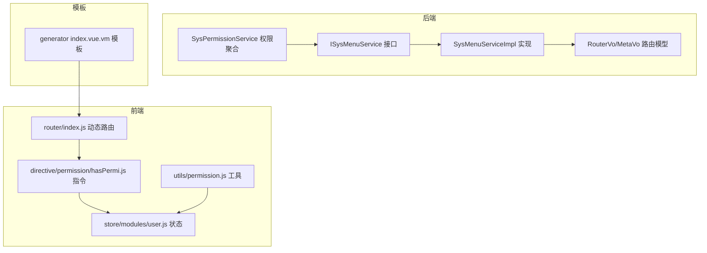
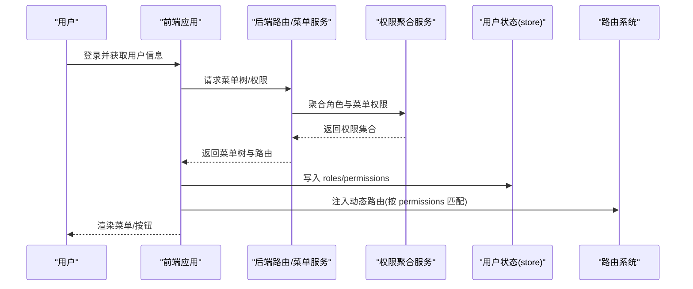
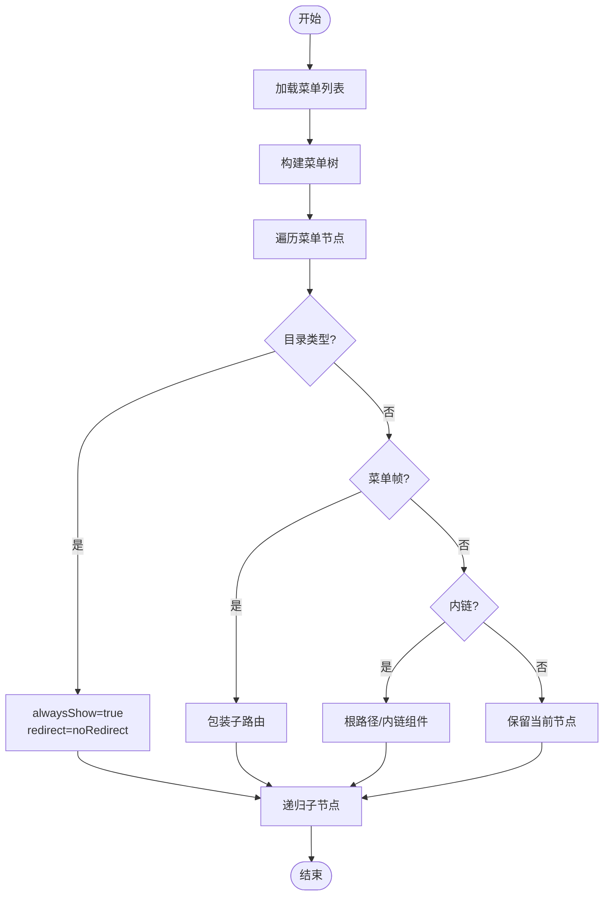
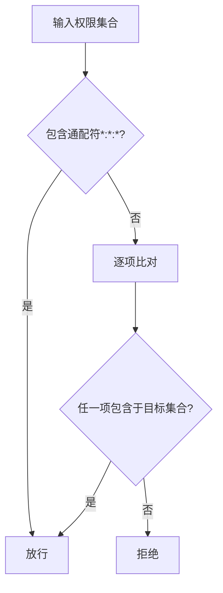
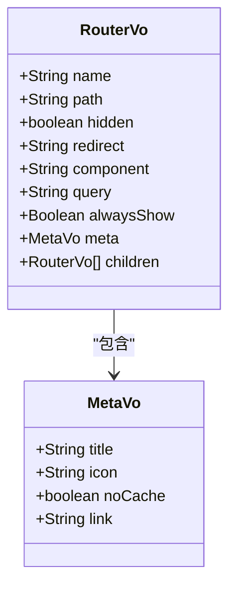
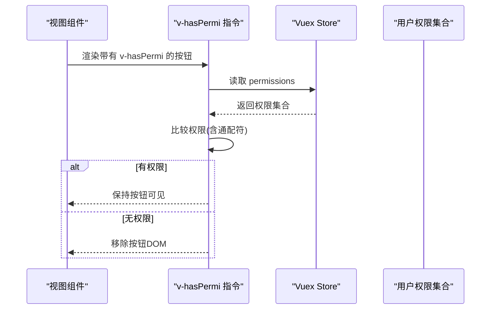
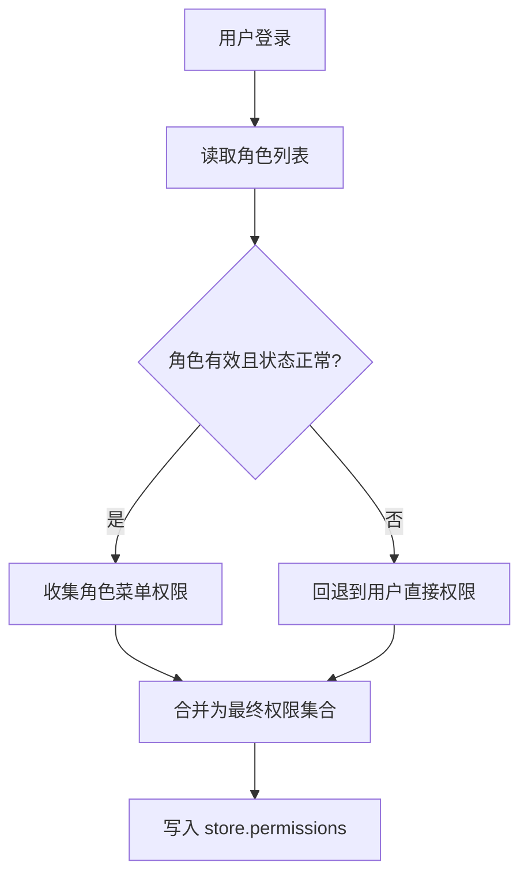
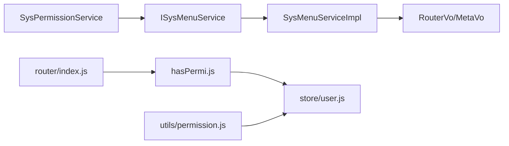

# 菜单与按钮权限

<cite>
**本文引用的文件**
- [ruoyi-system/src/main/java/com/ruoyi/system/service/ISysMenuService.java](file://ruoyi-system/src/main/java/com/ruoyi/system/service/ISysMenuService.java)
- [ruoyi-system/src/main/java/com/ruoyi/system/service/impl/SysMenuServiceImpl.java](file://ruoyi-system/src/main/java/com/ruoyi/system/service/impl/SysMenuServiceImpl.java)
- [ruoyi-system/src/main/java/com/ruoyi/system/domain/vo/RouterVo.java](file://ruoyi-system/src/main/java/com/ruoyi/system/domain/vo/RouterVo.java)
- [ruoyi-system/src/main/java/com/ruoyi/system/domain/vo/MetaVo.java](file://ruoyi-system/src/main/java/com/ruoyi/system/domain/vo/MetaVo.java)
- [ruoyi-framework/src/main/java/com/ruoyi/framework/web/service/SysPermissionService.java](file://ruoyi-framework/src/main/java/com/ruoyi/framework/web/service/SysPermissionService.java)
- [ruoyi-system/src/main/java/com/ruoyi/system/service/ISysRoleService.java](file://ruoyi-system/src/main/java/com/ruoyi/system/service/ISysRoleService.java)
- [ruoyi-ui/src/router/index.js](file://ruoyi-ui/src/router/index.js)
- [ruoyi-ui/src/directive/permission/hasPermi.js](file://ruoyi-ui/src/directive/permission/hasPermi.js)
- [ruoyi-ui/src/utils/permission.js](file://ruoyi-ui/src/utils/permission.js)
- [ruoyi-ui/src/store/modules/user.js](file://ruoyi-ui/src/store/modules/user.js)
- [ruoyi-generator/src/main/resources/vm/vue/index.vue.vm](file://ruoyi-generator/src/main/resources/vm/vue/index.vue.vm)
- [ruoyi-ui/src/views/gangzhu/policy/index.vue](file://ruoyi-ui/src/views/gangzhu/policy/index.vue)
</cite>

## 目录
1. [简介](#简介)
2. [项目结构](#项目结构)
3. [核心组件](#核心组件)
4. [架构总览](#架构总览)
5. [详细组件分析](#详细组件分析)
6. [依赖分析](#依赖分析)
7. [性能考虑](#性能考虑)
8. [故障排查指南](#故障排查指南)
9. [结论](#结论)
10. [附录](#附录)

## 简介
本文件面向港好住信息系统，系统性梳理菜单权限与按钮权限的实现机制，覆盖菜单树形结构设计、菜单权限字符串规则、动态菜单加载算法；按钮权限的控制方式（按钮级权限标识、前端显示控制、后端操作验证）；RouterVo 路由对象在权限控制中的作用；菜单权限与用户权限的匹配算法；以及权限继承关系（角色权限对菜单权限的影响、用户直接权限与角色权限的优先级）。同时提供配置示例、集成方案、调试技巧与性能优化建议。

## 项目结构
围绕权限控制的关键模块分布如下：
- 后端系统模块（ruoyi-system）：菜单服务接口与实现、RouterVo/MetaVo 路由模型、菜单树构建与动态路由组装。
- 权限服务模块（ruoyi-framework）：用户权限聚合器，负责合并角色权限与菜单权限。
- 前端模块（ruoyi-ui）：路由定义（含 permissions 字段）、按钮权限指令 v-hasPermi、工具函数与用户状态存储。
- 代码生成模板（ruoyi-generator）：自动生成带按钮权限注解的前端页面骨架。

**图表来源**
- [ruoyi-system/src/main/java/com/ruoyi/system/service/ISysMenuService.java:1-145](file://ruoyi-system/src/main/java/com/ruoyi/system/service/ISysMenuService.java#L1-L145)
- [ruoyi-system/src/main/java/com/ruoyi/system/service/impl/SysMenuServiceImpl.java:1-544](file://ruoyi-system/src/main/java/com/ruoyi/system/service/impl/SysMenuServiceImpl.java#L1-L544)
- [ruoyi-system/src/main/java/com/ruoyi/system/domain/vo/RouterVo.java:1-149](file://ruoyi-system/src/main/java/com/ruoyi/system/domain/vo/RouterVo.java#L1-L149)
- [ruoyi-system/src/main/java/com/ruoyi/system/domain/vo/MetaVo.java:1-107](file://ruoyi-system/src/main/java/com/ruoyi/system/domain/vo/MetaVo.java#L1-L107)
- [ruoyi-framework/src/main/java/com/ruoyi/framework/web/service/SysPermissionService.java:1-89](file://ruoyi-framework/src/main/java/com/ruoyi/framework/web/service/SysPermissionService.java#L1-L89)
- [ruoyi-ui/src/router/index.js:1-184](file://ruoyi-ui/src/router/index.js#L1-L184)
- [ruoyi-ui/src/directive/permission/hasPermi.js:1-29](file://ruoyi-ui/src/directive/permission/hasPermi.js#L1-L29)
- [ruoyi-ui/src/utils/permission.js:1-47](file://ruoyi-ui/src/utils/permission.js#L1-L47)
- [ruoyi-ui/src/store/modules/user.js:1-126](file://ruoyi-ui/src/store/modules/user.js#L1-L126)
- [ruoyi-generator/src/main/resources/vm/vue/index.vue.vm:70-114](file://ruoyi-generator/src/main/resources/vm/vue/index.vue.vm#L70-L114)

**章节来源**
- [ruoyi-system/src/main/java/com/ruoyi/system/service/ISysMenuService.java:1-145](file://ruoyi-system/src/main/java/com/ruoyi/system/service/ISysMenuService.java#L1-L145)
- [ruoyi-system/src/main/java/com/ruoyi/system/service/impl/SysMenuServiceImpl.java:1-544](file://ruoyi-system/src/main/java/com/ruoyi/system/service/impl/SysMenuServiceImpl.java#L1-L544)
- [ruoyi-ui/src/router/index.js:1-184](file://ruoyi-ui/src/router/index.js#L1-L184)

## 核心组件
- 菜单服务接口与实现：提供菜单列表、菜单树、权限集合查询与路由构建能力。
- 权限聚合服务：整合用户角色与菜单权限，形成最终可用的权限集合。
- 路由模型：RouterVo/MetaVo 描述前端路由元数据与显示信息。
- 前端路由与指令：动态路由按权限注入，按钮级权限通过指令与工具函数控制显示与校验。
- 代码生成模板：自动生成带 v-hasPermi 的按钮权限注解。

**章节来源**
- [ruoyi-system/src/main/java/com/ruoyi/system/service/ISysMenuService.java:1-145](file://ruoyi-system/src/main/java/com/ruoyi/system/service/ISysMenuService.java#L1-L145)
- [ruoyi-system/src/main/java/com/ruoyi/system/service/impl/SysMenuServiceImpl.java:1-544](file://ruoyi-system/src/main/java/com/ruoyi/system/service/impl/SysMenuServiceImpl.java#L1-L544)
- [ruoyi-framework/src/main/java/com/ruoyi/framework/web/service/SysPermissionService.java:1-89](file://ruoyi-framework/src/main/java/com/ruoyi/framework/web/service/SysPermissionService.java#L1-L89)
- [ruoyi-system/src/main/java/com/ruoyi/system/domain/vo/RouterVo.java:1-149](file://ruoyi-system/src/main/java/com/ruoyi/system/domain/vo/RouterVo.java#L1-L149)
- [ruoyi-system/src/main/java/com/ruoyi/system/domain/vo/MetaVo.java:1-107](file://ruoyi-system/src/main/java/com/ruoyi/system/domain/vo/MetaVo.java#L1-L107)
- [ruoyi-ui/src/router/index.js:1-184](file://ruoyi-ui/src/router/index.js#L1-L184)
- [ruoyi-ui/src/directive/permission/hasPermi.js:1-29](file://ruoyi-ui/src/directive/permission/hasPermi.js#L1-L29)
- [ruoyi-ui/src/utils/permission.js:1-47](file://ruoyi-ui/src/utils/permission.js#L1-L47)
- [ruoyi-generator/src/main/resources/vm/vue/index.vue.vm:70-114](file://ruoyi-generator/src/main/resources/vm/vue/index.vue.vm#L70-L114)

## 架构总览
后端通过菜单服务与权限聚合服务，将用户权限与菜单树转换为前端可消费的路由结构；前端根据用户权限动态注入路由，并在页面上以指令与工具函数控制按钮显示与操作校验。

**图表来源**
- [ruoyi-framework/src/main/java/com/ruoyi/framework/web/service/SysPermissionService.java:57-87](file://ruoyi-framework/src/main/java/com/ruoyi/framework/web/service/SysPermissionService.java#L57-L87)
- [ruoyi-system/src/main/java/com/ruoyi/system/service/impl/SysMenuServiceImpl.java:164-214](file://ruoyi-system/src/main/java/com/ruoyi/system/service/impl/SysMenuServiceImpl.java#L164-L214)
- [ruoyi-ui/src/store/modules/user.js:62-96](file://ruoyi-ui/src/store/modules/user.js#L62-L96)
- [ruoyi-ui/src/router/index.js:93-165](file://ruoyi-ui/src/router/index.js#L93-L165)

## 详细组件分析

### 菜单树形结构设计与动态加载
- 菜单树构建：后端将扁平菜单列表按父子关系递归组装为树形结构，支持“目录/菜单/外链/内链”等类型分支。
- 路由构建：将菜单转换为 RouterVo 列表，填充 name/path/component/meta/children 等字段，用于前端渲染。
- 动态路由注入：前端根据用户权限集合，仅注入具备相应 permissions 的动态路由。

**图表来源**
- [ruoyi-system/src/main/java/com/ruoyi/system/service/impl/SysMenuServiceImpl.java:471-531](file://ruoyi-system/src/main/java/com/ruoyi/system/service/impl/SysMenuServiceImpl.java#L471-L531)
- [ruoyi-system/src/main/java/com/ruoyi/system/service/impl/SysMenuServiceImpl.java:164-214](file://ruoyi-system/src/main/java/com/ruoyi/system/service/impl/SysMenuServiceImpl.java#L164-L214)

**章节来源**
- [ruoyi-system/src/main/java/com/ruoyi/system/service/impl/SysMenuServiceImpl.java:222-255](file://ruoyi-system/src/main/java/com/ruoyi/system/service/impl/SysMenuServiceImpl.java#L222-L255)
- [ruoyi-system/src/main/java/com/ruoyi/system/service/impl/SysMenuServiceImpl.java:164-214](file://ruoyi-system/src/main/java/com/ruoyi/system/service/impl/SysMenuServiceImpl.java#L164-L214)

### 菜单权限字符串规则与匹配算法
- 权限字符串规则：后端在菜单权限集合中使用逗号分隔的权限串，前端通过工具函数与指令进行匹配。
- 匹配算法：前端采用“全部权限”通配符与集合包含判断，若任一权限满足即放行。
- 通配符：管理员拥有“*:*:*”通配权限，可访问所有菜单与按钮。

**图表来源**
- [ruoyi-ui/src/utils/permission.js:8-24](file://ruoyi-ui/src/utils/permission.js#L8-L24)
- [ruoyi-ui/src/directive/permission/hasPermi.js:9-27](file://ruoyi-ui/src/directive/permission/hasPermi.js#L9-L27)
- [ruoyi-framework/src/main/java/com/ruoyi/framework/web/service/SysPermissionService.java:60-87](file://ruoyi-framework/src/main/java/com/ruoyi/framework/web/service/SysPermissionService.java#L60-L87)

**章节来源**
- [ruoyi-system/src/main/java/com/ruoyi/system/service/impl/SysMenuServiceImpl.java:88-122](file://ruoyi-system/src/main/java/com/ruoyi/system/service/impl/SysMenuServiceImpl.java#L88-L122)
- [ruoyi-ui/src/utils/permission.js:1-47](file://ruoyi-ui/src/utils/permission.js#L1-L47)
- [ruoyi-ui/src/directive/permission/hasPermi.js:1-29](file://ruoyi-ui/src/directive/permission/hasPermi.js#L1-L29)

### RouterVo 路由对象在权限控制中的作用
- RouterVo 定义了 name/path/hidden/redirect/component/query/alwaysShow/meta/children 等字段，支撑前端菜单渲染与面包屑导航。
- 动态路由中通过 permissions 字段声明访问所需权限，前端据此决定是否注入该路由。
- MetaVo 提供 title/icon/noCache/link 等显示信息，影响侧边栏与标签页标题、图标与缓存策略。

**图表来源**
- [ruoyi-system/src/main/java/com/ruoyi/system/domain/vo/RouterVo.java:1-149](file://ruoyi-system/src/main/java/com/ruoyi/system/domain/vo/RouterVo.java#L1-L149)
- [ruoyi-system/src/main/java/com/ruoyi/system/domain/vo/MetaVo.java:1-107](file://ruoyi-system/src/main/java/com/ruoyi/system/domain/vo/MetaVo.java#L1-L107)

**章节来源**
- [ruoyi-ui/src/router/index.js:93-165](file://ruoyi-ui/src/router/index.js#L93-L165)
- [ruoyi-system/src/main/java/com/ruoyi/system/domain/vo/RouterVo.java:1-149](file://ruoyi-system/src/main/java/com/ruoyi/system/domain/vo/RouterVo.java#L1-L149)
- [ruoyi-system/src/main/java/com/ruoyi/system/domain/vo/MetaVo.java:1-107](file://ruoyi-system/src/main/java/com/ruoyi/system/domain/vo/MetaVo.java#L1-L107)

### 按钮权限控制：标识、显示与验证
- 按钮级权限标识：模板与页面中使用 v-hasPermi 指令或工具函数 checkPermi 对按钮进行权限标注。
- 前端显示控制：指令在 inserted 生命周期读取 store.getters.permissions，若不满足则移除 DOM 节点。
- 后端操作验证：业务接口需结合权限字符串进行二次校验，确保前端不可信环境下的安全。

**图表来源**
- [ruoyi-ui/src/directive/permission/hasPermi.js:9-27](file://ruoyi-ui/src/directive/permission/hasPermi.js#L9-L27)
- [ruoyi-ui/src/utils/permission.js:8-24](file://ruoyi-ui/src/utils/permission.js#L8-L24)
- [ruoyi-ui/src/store/modules/user.js:62-96](file://ruoyi-ui/src/store/modules/user.js#L62-L96)

**章节来源**
- [ruoyi-generator/src/main/resources/vm/vue/index.vue.vm:70-114](file://ruoyi-generator/src/main/resources/vm/vue/index.vue.vm#L70-L114)
- [ruoyi-ui/src/views/gangzhu/policy/index.vue:58-103](file://ruoyi-ui/src/views/gangzhu/policy/index.vue#L58-L103)
- [ruoyi-ui/src/directive/permission/hasPermi.js:1-29](file://ruoyi-ui/src/directive/permission/hasPermi.js#L1-L29)
- [ruoyi-ui/src/utils/permission.js:1-47](file://ruoyi-ui/src/utils/permission.js#L1-L47)

### 权限继承关系：角色与用户的优先级
- 角色权限：用户可能拥有多个角色，后端聚合时将有效角色的菜单权限加入集合。
- 用户直接权限：若用户未绑定角色或角色无效，回退到用户直接权限集合。
- 优先级：管理员拥有通配权限；普通用户优先使用角色权限集合，再叠加用户直接权限。

**图表来源**
- [ruoyi-framework/src/main/java/com/ruoyi/framework/web/service/SysPermissionService.java:57-87](file://ruoyi-framework/src/main/java/com/ruoyi/framework/web/service/SysPermissionService.java#L57-L87)
- [ruoyi-system/src/main/java/com/ruoyi/system/service/impl/SysMenuServiceImpl.java:109-122](file://ruoyi-system/src/main/java/com/ruoyi/system/service/impl/SysMenuServiceImpl.java#L109-L122)

**章节来源**
- [ruoyi-framework/src/main/java/com/ruoyi/framework/web/service/SysPermissionService.java:1-89](file://ruoyi-framework/src/main/java/com/ruoyi/framework/web/service/SysPermissionService.java#L1-L89)
- [ruoyi-system/src/main/java/com/ruoyi/system/service/ISysRoleService.java:39-47](file://ruoyi-system/src/main/java/com/ruoyi/system/service/ISysRoleService.java#L39-L47)

### 菜单权限配置示例与按钮权限实现案例
- 菜单权限配置示例：后端菜单表中维护权限字符串，前端动态路由 permissions 字段与之对应。
- 按钮权限实现案例：页面按钮使用 v-hasPermi="['模块:功能:动作']"，如 ["system:user:add","system:user:edit"]。
- 代码生成：模板自动生成带 v-hasPermi 的按钮，减少手工维护成本。

**章节来源**
- [ruoyi-ui/src/router/index.js:93-165](file://ruoyi-ui/src/router/index.js#L93-L165)
- [ruoyi-generator/src/main/resources/vm/vue/index.vue.vm:70-114](file://ruoyi-generator/src/main/resources/vm/vue/index.vue.vm#L70-L114)
- [ruoyi-ui/src/views/gangzhu/policy/index.vue:58-103](file://ruoyi-ui/src/views/gangzhu/policy/index.vue#L58-L103)

### 前端集成方案
- 路由集成：在路由定义中为需要权限控制的页面设置 permissions 字段，前端按权限注入动态路由。
- 指令集成：在按钮与菜单项上使用 v-hasPermi 指令，实现细粒度显示控制。
- 工具集成：checkPermi/checkRole 提供编程式权限校验，便于复杂逻辑场景。

**章节来源**
- [ruoyi-ui/src/router/index.js:93-165](file://ruoyi-ui/src/router/index.js#L93-L165)
- [ruoyi-ui/src/directive/permission/hasPermi.js:1-29](file://ruoyi-ui/src/directive/permission/hasPermi.js#L1-L29)
- [ruoyi-ui/src/utils/permission.js:1-47](file://ruoyi-ui/src/utils/permission.js#L1-L47)

## 依赖分析
- 后端依赖：菜单服务依赖角色/菜单映射与用户上下文；权限聚合服务依赖菜单服务与角色服务。
- 前端依赖：指令与工具函数依赖 store 中的 roles/permissions；路由系统依赖动态路由配置。

**图表来源**
- [ruoyi-framework/src/main/java/com/ruoyi/framework/web/service/SysPermissionService.java:24-28](file://ruoyi-framework/src/main/java/com/ruoyi/framework/web/service/SysPermissionService.java#L24-L28)
- [ruoyi-system/src/main/java/com/ruoyi/system/service/impl/SysMenuServiceImpl.java:38-45](file://ruoyi-system/src/main/java/com/ruoyi/system/service/impl/SysMenuServiceImpl.java#L38-L45)
- [ruoyi-system/src/main/java/com/ruoyi/system/domain/vo/RouterVo.java:1-149](file://ruoyi-system/src/main/java/com/ruoyi/system/domain/vo/RouterVo.java#L1-L149)
- [ruoyi-ui/src/router/index.js:93-165](file://ruoyi-ui/src/router/index.js#L93-L165)
- [ruoyi-ui/src/directive/permission/hasPermi.js:6-12](file://ruoyi-ui/src/directive/permission/hasPermi.js#L6-L12)
- [ruoyi-ui/src/utils/permission.js:1-47](file://ruoyi-ui/src/utils/permission.js#L1-L47)
- [ruoyi-ui/src/store/modules/user.js:1-126](file://ruoyi-ui/src/store/modules/user.js#L1-L126)

**章节来源**
- [ruoyi-framework/src/main/java/com/ruoyi/framework/web/service/SysPermissionService.java:1-89](file://ruoyi-framework/src/main/java/com/ruoyi/framework/web/service/SysPermissionService.java#L1-L89)
- [ruoyi-system/src/main/java/com/ruoyi/system/service/impl/SysMenuServiceImpl.java:1-544](file://ruoyi-system/src/main/java/com/ruoyi/system/service/impl/SysMenuServiceImpl.java#L1-L544)
- [ruoyi-ui/src/router/index.js:1-184](file://ruoyi-ui/src/router/index.js#L1-L184)

## 性能考虑
- 权限集合缓存：前端 store 中缓存 roles/permissions，避免重复请求与计算。
- 菜单树复用：后端构建一次菜单树并在多处使用，减少重复遍历。
- 指令与工具函数：尽量批量比较权限，避免频繁 DOM 操作。
- 动态路由按需注入：仅注入用户具备权限的路由，降低前端渲染压力。

## 故障排查指南
- 按钮不显示：
  - 检查 v-hasPermi 的权限值是否正确，是否包含在 store.getters.permissions 中。
  - 确认用户登录后已写入 permissions。
- 路由无法进入：
  - 检查动态路由 permissions 字段与后端菜单权限是否一致。
  - 确认权限聚合逻辑已生效。
- 权限变更不生效：
  - 确认用户重新登录或刷新权限后，store 中的 permissions 已更新。
  - 检查后端权限聚合逻辑是否正确合并角色与用户直接权限。

**章节来源**
- [ruoyi-ui/src/directive/permission/hasPermi.js:9-27](file://ruoyi-ui/src/directive/permission/hasPermi.js#L9-L27)
- [ruoyi-ui/src/utils/permission.js:8-24](file://ruoyi-ui/src/utils/permission.js#L8-L24)
- [ruoyi-ui/src/store/modules/user.js:62-96](file://ruoyi-ui/src/store/modules/user.js#L62-L96)
- [ruoyi-ui/src/router/index.js:93-165](file://ruoyi-ui/src/router/index.js#L93-L165)

## 结论
港好住信息系统通过后端菜单服务与权限聚合、前端动态路由与指令控制，实现了完整的菜单与按钮权限体系。RouterVo 作为前后端约定的数据载体，承载了菜单树与路由元数据；权限字符串规则与匹配算法保证了细粒度的访问控制；角色与用户权限的继承关系确保了灵活的权限组合。配合代码生成模板与工具函数，可高效完成权限配置与集成。

## 附录
- 关键接口与方法参考：
  - 菜单权限查询：ISysMenuService.selectMenuPermsByUserId/selectMenuPermsByRoleId
  - 菜单树构建：ISysMenuService.buildMenuTree/buildMenuTreeSelect
  - 路由构建：ISysMenuService.buildMenus
  - 权限聚合：SysPermissionService.getMenuPermission/getRolePermission
  - 前端指令与工具：v-hasPermi、checkPermi/checkRole
  - 动态路由定义：router/index.js 中的 dynamicRoutes 与 permissions 字段

**章节来源**
- [ruoyi-system/src/main/java/com/ruoyi/system/service/ISysMenuService.java:39-87](file://ruoyi-system/src/main/java/com/ruoyi/system/service/ISysMenuService.java#L39-L87)
- [ruoyi-system/src/main/java/com/ruoyi/system/service/impl/SysMenuServiceImpl.java:164-214](file://ruoyi-system/src/main/java/com/ruoyi/system/service/impl/SysMenuServiceImpl.java#L164-L214)
- [ruoyi-framework/src/main/java/com/ruoyi/framework/web/service/SysPermissionService.java:57-87](file://ruoyi-framework/src/main/java/com/ruoyi/framework/web/service/SysPermissionService.java#L57-L87)
- [ruoyi-ui/src/router/index.js:93-165](file://ruoyi-ui/src/router/index.js#L93-L165)
- [ruoyi-ui/src/directive/permission/hasPermi.js:1-29](file://ruoyi-ui/src/directive/permission/hasPermi.js#L1-L29)
- [ruoyi-ui/src/utils/permission.js:1-47](file://ruoyi-ui/src/utils/permission.js#L1-L47)