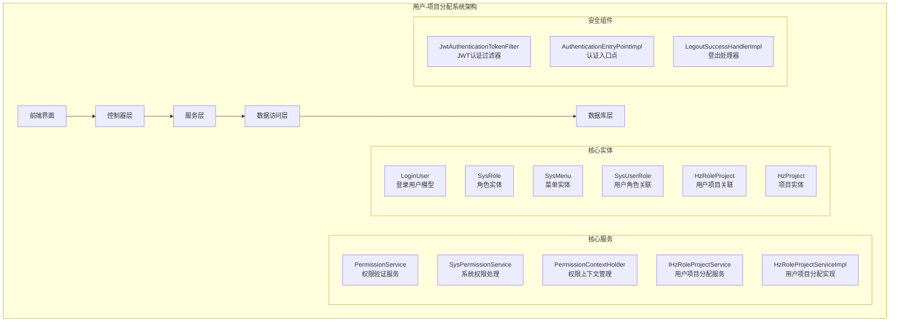
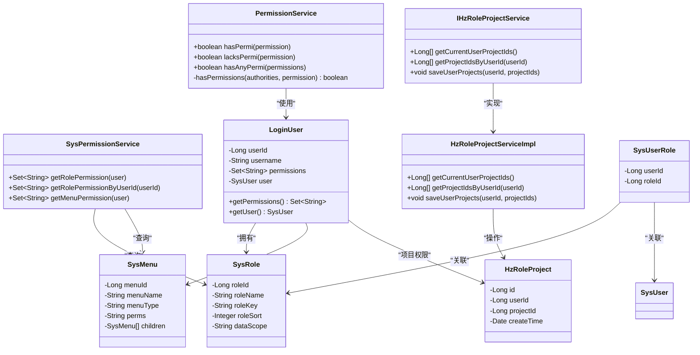
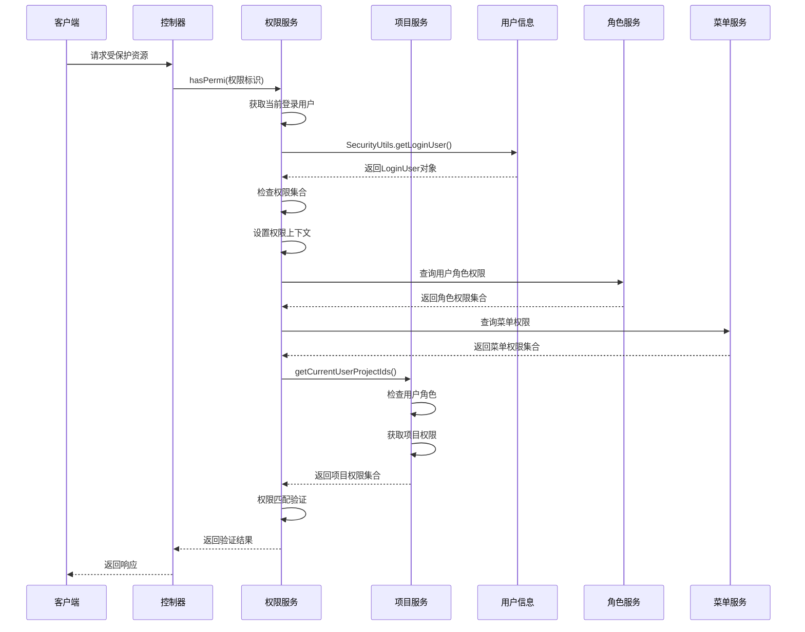
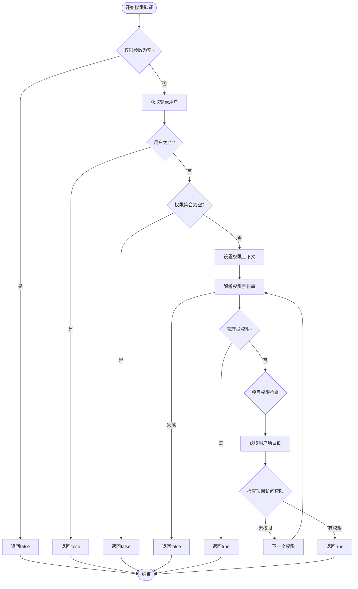
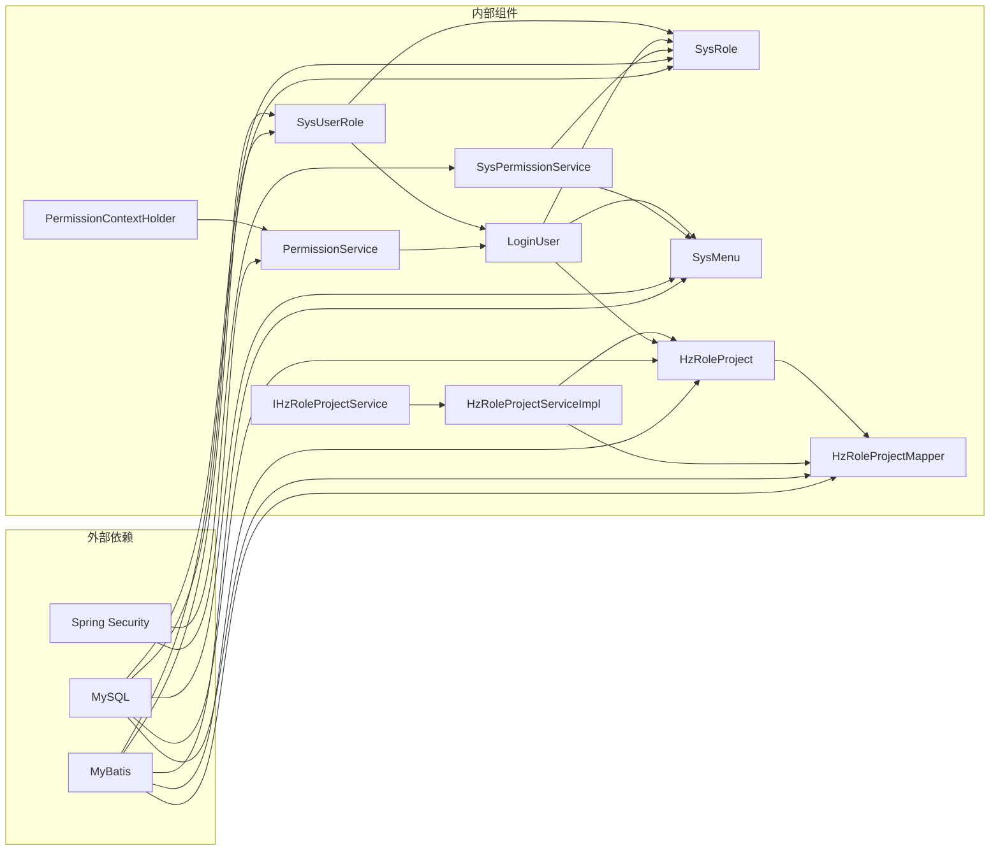

# 角色项目权限映射

<cite>
**本文档引用的文件**
- [PermissionService.java](file://ruoyi-framework/src/main/java/com/ruoyi/framework/web/service/PermissionService.java)
- [SysPermissionService.java](file://ruoyi-framework/src/main/java/com/ruoyi/framework/web/service/SysPermissionService.java)
- [PermissionContextHolder.java](file://ruoyi-framework/src/main/java/com/ruoyi/framework/security/context/PermissionContextHolder.java)
- [LoginUser.java](file://ruoyi-common/src/main/java/com/ruoyi/common/core/domain/model/LoginUser.java)
- [SysRole.java](file://ruoyi-common/src/main/java/com/ruoyi/common/core/domain/entity/SysRole.java)
- [SysMenu.java](file://ruoyi-common/src/main/java/com/ruoyi/common/core/domain/entity/SysMenu.java)
- [SysUserRole.java](file://ruoyi-system/src/main/java/com/ruoyi/system/domain/SysUserRole.java)
- [HzRoleProject.java](file://ruoyi-system/src/main/java/com/ruoyi/system/domain/HzRoleProject.java)
- [IHzRoleProjectService.java](file://ruoyi-system/src/main/java/com/ruoyi/system/service/IHzRoleProjectService.java)
- [HzRoleProjectServiceImpl.java](file://ruoyi-system/src/main/java/com/ruoyi/system/service/impl/HzRoleProjectServiceImpl.java)
- [HzRoleProjectMapper.java](file://ruoyi-system/src/main/java/com/ruoyi/system/mapper/HzRoleProjectMapper.java)
- [SysUserController.java](file://ruoyi-admin/src/main/java/com/ruoyi/web/controller/system/SysUserController.java)
- [index.vue](file://ruoyi-ui/src/views/system/user/index.vue)
</cite>

## 更新摘要
**所做更改**
- 更新了架构概述以反映从角色-项目权限映射到用户-项目分配系统的重构
- 新增了用户-项目分配系统的详细组件分析
- 更新了权限验证流程以体现新的项目权限控制机制
- 添加了新的数据结构和实体关系说明
- 更新了依赖关系分析以反映新的系统架构

## 目录
1. [简介](#简介)
2. [项目结构](#项目结构)
3. [核心组件](#核心组件)
4. [架构概览](#架构概览)
5. [详细组件分析](#详细组件分析)
6. [依赖关系分析](#依赖关系分析)
7. [性能考虑](#性能考虑)
8. [故障排除指南](#故障排除指南)
9. [结论](#结论)

## 简介

本文件深入分析了重构后的用户-项目分配系统，这是基于RuoYi框架构建的企业级权限管理系统的重要升级版本。该系统实现了从传统的角色-项目权限映射向更灵活的用户-项目直接分配的架构重构，支持管理员直接为用户分配项目，而非基于角色的间接分配。

重构后的系统保持了完整的RBAC（基于角色的访问控制）模型，但将项目权限控制从角色层面下移到用户层面，通过HzRoleProject实体建立用户与项目的直接映射关系。这种设计提供了更高的灵活性和精确性，允许管理员针对具体用户进行项目权限的精细化管理。

## 项目结构

重构后的权限系统在项目中的组织结构如下：

**图表来源**
- [IHzRoleProjectService.java:13-39](file://ruoyi-system/src/main/java/com/ruoyi/system/service/IHzRoleProjectService.java#L13-L39)
- [HzRoleProjectServiceImpl.java:24-75](file://ruoyi-system/src/main/java/com/ruoyi/system/service/impl/HzRoleProjectServiceImpl.java#L24-L75)

**章节来源**
- [IHzRoleProjectService.java:1-40](file://ruoyi-system/src/main/java/com/ruoyi/system/service/IHzRoleProjectService.java#L1-L40)
- [HzRoleProjectServiceImpl.java:1-75](file://ruoyi-system/src/main/java/com/ruoyi/system/service/impl/HzRoleProjectServiceImpl.java#L1-L75)

## 核心组件

### 权限验证服务

PermissionService作为权限系统的核心组件，继续提供了三种主要的权限验证方法：

1. **hasPermi()**: 验证用户是否具备指定权限
2. **lacksPermi()**: 验证用户是否不具备指定权限  
3. **hasAnyPermi()**: 验证用户是否具有任意一个权限

该服务通过SecurityUtils获取当前登录用户信息，并利用PermissionContextHolder设置权限上下文，最终调用hasPermissions方法进行权限匹配。

### 系统权限处理

SysPermissionService负责处理用户权限逻辑，主要包括：
- 获取角色数据权限
- 处理管理员特殊权限
- 管理用户角色关联

### 权限上下文管理

PermissionContextHolder提供了一个线程安全的权限上下文存储机制，用于在请求生命周期内传递权限信息。

### 用户项目分配服务

**新增** IHzRoleProjectService是重构后新增的核心组件，专门负责用户-项目分配管理：

- **getCurrentUserProjectIds()**: 获取当前登录用户绑定的项目ID列表
  - 管理员不限制（返回null）
  - 物业角色：返回其绑定的项目ID列表
  
- **getProjectIdsByUserId(userId)**: 根据用户ID查询绑定的项目ID列表
  
- **saveUserProjects(userId, projectIds)**: 保存用户-项目绑定关系（先删后增）

**章节来源**
- [PermissionService.java:27-80](file://ruoyi-framework/src/main/java/com/ruoyi/framework/web/service/PermissionService.java#L27-L80)
- [SysPermissionService.java:36-49](file://ruoyi-framework/src/main/java/com/ruoyi/framework/web/service/SysPermissionService.java#L36-L49)
- [PermissionContextHolder.java:12-27](file://ruoyi-framework/src/main/java/com/ruoyi/framework/security/context/PermissionContextHolder.java#L12-L27)
- [IHzRoleProjectService.java:15-39](file://ruoyi-system/src/main/java/com/ruoyi/system/service/IHzRoleProjectService.java#L15-L39)

## 架构概览

重构后的权限系统采用分层架构设计，确保职责分离和可维护性：

**图表来源**
- [PermissionService.java:18-80](file://ruoyi-framework/src/main/java/com/ruoyi/framework/web/service/PermissionService.java#L18-L80)
- [SysPermissionService.java:21-49](file://ruoyi-framework/src/main/java/com/ruoyi/framework/web/service/SysPermissionService.java#L21-L49)
- [IHzRoleProjectService.java:13-39](file://ruoyi-system/src/main/java/com/ruoyi/system/service/IHzRoleProjectService.java#L13-L39)
- [HzRoleProjectServiceImpl.java:24-75](file://ruoyi-system/src/main/java/com/ruoyi/system/service/impl/HzRoleProjectServiceImpl.java#L24-L75)
- [LoginUser.java:241-266](file://ruoyi-common/src/main/java/com/ruoyi/common/core/domain/model/LoginUser.java#L241-L266)
- [SysRole.java:18-40](file://ruoyi-common/src/main/java/com/ruoyi/common/core/domain/entity/SysRole.java#L18-L40)
- [SysMenu.java:54-274](file://ruoyi-common/src/main/java/com/ruoyi/common/core/domain/entity/SysMenu.java#L54-L274)
- [SysUserRole.java:11-46](file://ruoyi-system/src/main/java/com/ruoyi/system/domain/SysUserRole.java#L11-L46)
- [HzRoleProject.java:15-66](file://ruoyi-system/src/main/java/com/ruoyi/system/domain/HzRoleProject.java#L15-L66)

## 详细组件分析

### 权限验证流程

重构后的权限验证采用链式调用模式，从控制器到服务层再到数据访问层：

**图表来源**
- [PermissionService.java:27-40](file://ruoyi-framework/src/main/java/com/ruoyi/framework/web/service/PermissionService.java#L27-L40)
- [SysPermissionService.java:36-49](file://ruoyi-framework/src/main/java/com/ruoyi/framework/web/service/SysPermissionService.java#L36-L49)
- [HzRoleProjectServiceImpl.java:26-47](file://ruoyi-system/src/main/java/com/ruoyi/system/service/impl/HzRoleProjectServiceImpl.java#L26-L47)

### 权限数据结构

重构后的权限系统核心数据结构包括：

#### LoginUser模型
LoginUser作为权限系统的核心载体，包含：
- 用户基本信息（userId、username、user对象）
- 权限集合（permissions）
- 过期时间（expireTime）

#### 角色实体
SysRole定义了角色的基本属性：
- 角色ID和名称
- 角色权限标识（roleKey）
- 角色排序和数据范围
- 数据权限控制（1-5级）

#### 菜单实体
SysMenu描述了菜单的权限属性：
- 菜单类型（目录、菜单、按钮）
- 权限字符串（perms）
- 显示状态和菜单状态
- 图标和子菜单关系

#### 用户角色关联
SysUserRole建立了用户与角色的多对多关系：
- 用户ID和角色ID
- 支持一个用户拥有多个角色

#### 用户项目关联
**新增** HzRoleProject建立了用户与项目的直接映射关系：
- 主键ID、用户ID和项目ID
- 创建时间记录
- 支持一个用户绑定多个项目

**章节来源**
- [LoginUser.java:241-266](file://ruoyi-common/src/main/java/com/ruoyi/common/core/domain/model/LoginUser.java#L241-L266)
- [SysRole.java:18-40](file://ruoyi-common/src/main/java/com/ruoyi/common/core/domain/entity/SysRole.java#L18-L40)
- [SysMenu.java:54-274](file://ruoyi-common/src/main/java/com/ruoyi/common/core/domain/entity/SysMenu.java#L54-L274)
- [SysUserRole.java:11-46](file://ruoyi-system/src/main/java/com/ruoyi/system/domain/SysUserRole.java#L11-L46)
- [HzRoleProject.java:15-66](file://ruoyi-system/src/main/java/com/ruoyi/system/domain/HzRoleProject.java#L15-L66)

### 权限验证算法

重构后的权限验证采用递归匹配算法，支持复杂的权限组合：

**图表来源**
- [PermissionService.java:27-80](file://ruoyi-framework/src/main/java/com/ruoyi/framework/web/service/PermissionService.java#L27-L80)
- [HzRoleProjectServiceImpl.java:26-47](file://ruoyi-system/src/main/java/com/ruoyi/system/service/impl/HzRoleProjectServiceImpl.java#L26-L47)

**章节来源**
- [PermissionService.java:27-80](file://ruoyi-framework/src/main/java/com/ruoyi/framework/web/service/PermissionService.java#L27-L80)
- [HzRoleProjectServiceImpl.java:26-47](file://ruoyi-system/src/main/java/com/ruoyi/system/service/impl/HzRoleProjectServiceImpl.java#L26-L47)

## 依赖关系分析

重构后的权限系统各组件之间的依赖关系如下：

**图表来源**
- [PermissionService.java:1-12](file://ruoyi-framework/src/main/java/com/ruoyi/framework/web/service/PermissionService.java#L1-L12)
- [SysPermissionService.java:1-15](file://ruoyi-framework/src/main/java/com/ruoyi/framework/web/service/SysPermissionService.java#L1-L15)
- [IHzRoleProjectService.java:1-12](file://ruoyi-system/src/main/java/com/ruoyi/system/service/IHzRoleProjectService.java#L1-L12)
- [HzRoleProjectServiceImpl.java:1-12](file://ruoyi-system/src/main/java/com/ruoyi/system/service/impl/HzRoleProjectServiceImpl.java#L1-L12)

### 组件耦合度分析

系统采用了低耦合的设计原则：
- **高内聚**: 每个类专注于单一职责
- **松耦合**: 通过接口和抽象类实现解耦
- **依赖注入**: 使用Spring容器管理依赖关系

**章节来源**
- [SysMenuServiceImpl.java:33-45](file://ruoyi-system/src/main/java/com/ruoyi/system/service/impl/SysMenuServiceImpl.java#L33-L45)
- [SysMenuController.java:29-34](file://ruoyi-admin/src/main/java/com/ruoyi/web/controller/system/SysMenuController.java#L29-L34)

## 性能考虑

### 缓存策略

重构后的权限系统实现了多层次的缓存机制：
- **用户权限缓存**: 缓存用户的角色和权限信息
- **菜单树缓存**: 缓存菜单树结构以减少数据库查询
- **权限上下文缓存**: 在请求范围内缓存权限验证结果
- **项目权限缓存**: 缓存用户项目权限以减少重复查询

### 查询优化

系统通过以下方式优化数据库查询：
- **批量查询**: 一次性获取用户的所有角色和权限
- **索引优化**: 在用户ID、角色ID、项目ID等关键字段上建立索引
- **懒加载**: 仅在需要时加载关联数据
- **项目权限预加载**: 在用户登录时预加载项目权限信息

### 并发处理

重构后的权限验证支持高并发场景：
- **线程安全**: PermissionContextHolder使用请求作用域
- **无状态设计**: 权限服务不保存会话状态
- **连接池**: 使用数据库连接池提高并发性能
- **事务管理**: 使用@Transactional注解确保数据一致性

## 故障排除指南

### 常见权限问题

1. **权限验证失败**
   - 检查用户是否正确登录
   - 验证权限字符串格式是否正确
   - 确认用户角色是否包含目标权限
   - 检查用户是否绑定了相应的项目权限

2. **菜单显示异常**
   - 检查SysMenu表的perms字段
   - 验证菜单状态和可见性设置
   - 确认用户角色的数据范围权限
   - 检查用户项目权限绑定情况

3. **项目权限问题**
   - **章节来源**
   - 检查HzRoleProject表中用户项目绑定
   - 验证项目状态和权限配置
   - 确认管理员角色的特殊权限

4. **权限缓存问题**
   - 清除用户权限缓存
   - 检查缓存配置和过期时间
   - 验证缓存键的生成规则
   - 检查项目权限缓存的一致性

### 调试技巧

- 使用PermissionContextHolder.getContext()获取当前权限上下文
- 通过日志记录权限验证过程
- 利用断点调试权限匹配逻辑
- 检查用户项目权限的获取流程

**章节来源**
- [PermissionContextHolder.java:16-26](file://ruoyi-framework/src/main/java/com/ruoyi/framework/security/context/PermissionContextHolder.java#L16-L26)
- [HzRoleProjectServiceImpl.java:26-47](file://ruoyi-system/src/main/java/com/ruoyi/system/service/impl/HzRoleProjectServiceImpl.java#L26-L47)

## 结论

重构后的用户-项目分配系统是一个设计精良的企业级权限管理解决方案。系统通过从角色-项目权限映射向用户-项目直接分配的架构升级，提供了更高灵活性和精确性的权限控制能力。

该系统的主要优势包括：
- **完整性**: 覆盖了从用户到菜单再到项目的完整权限链路
- **灵活性**: 支持直接的用户项目权限分配，无需通过角色间接控制
- **精确性**: 允许管理员针对具体用户进行项目权限的精细化管理
- **可扩展性**: 模块化设计便于功能扩展和定制
- **性能**: 多层次缓存和优化查询提升系统性能

通过深入理解重构后的权限系统的设计原理和实现细节，开发者可以更好地维护和扩展系统功能，为企业应用提供可靠且灵活的权限保障。新的用户-项目分配机制特别适用于需要精细权限控制的物业管理系统，为不同角色的用户提供了更加精准的项目访问权限管理。