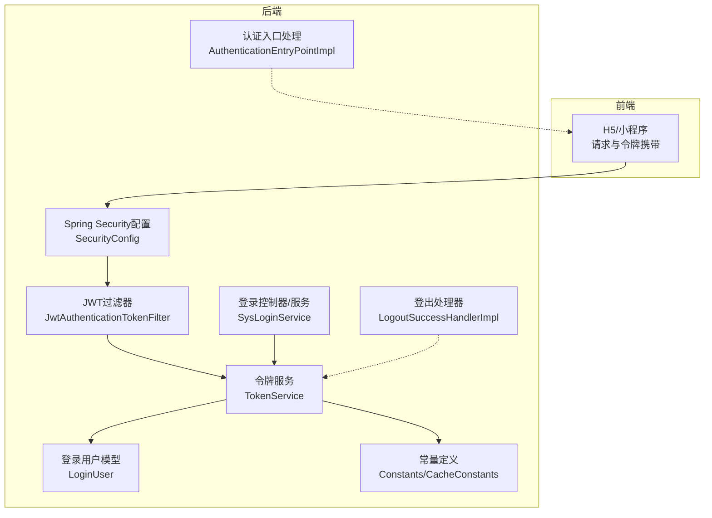
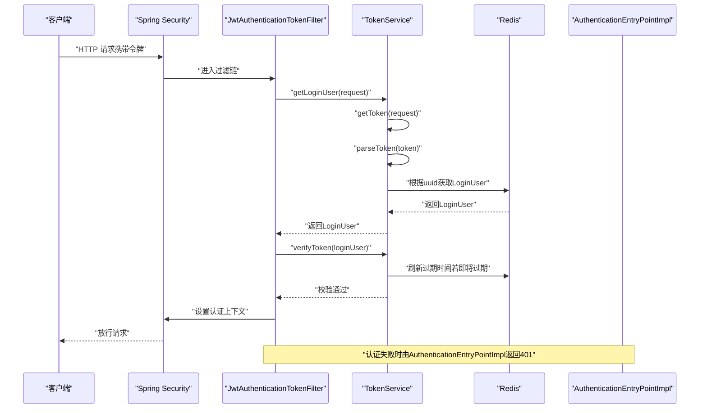
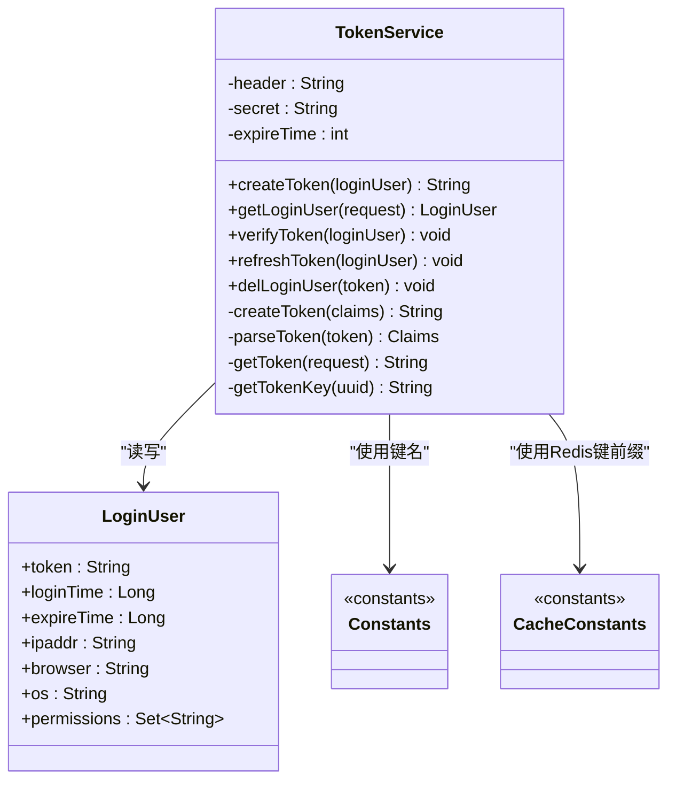
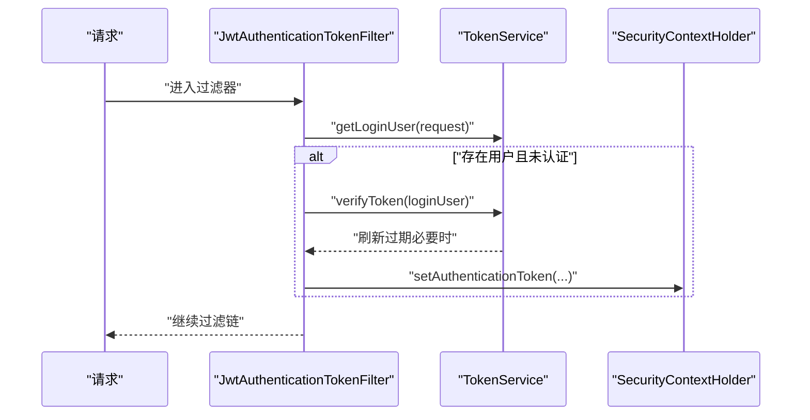
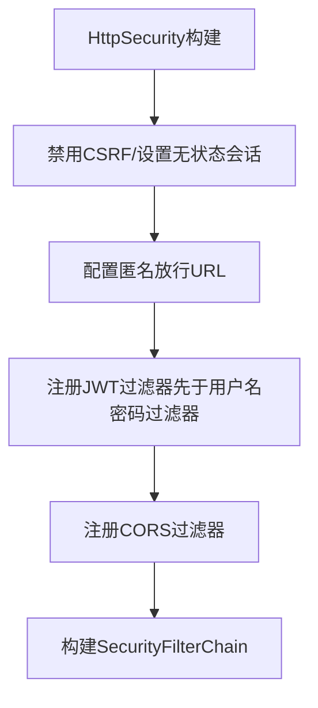
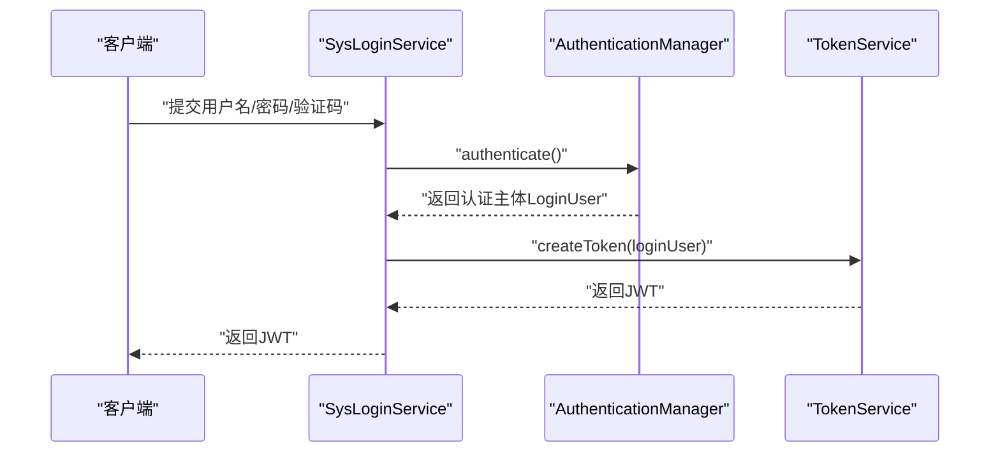
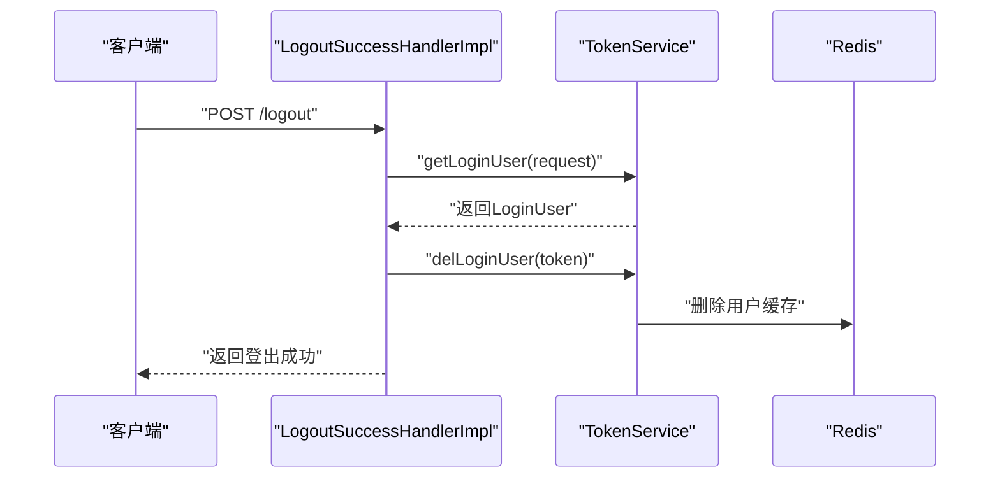
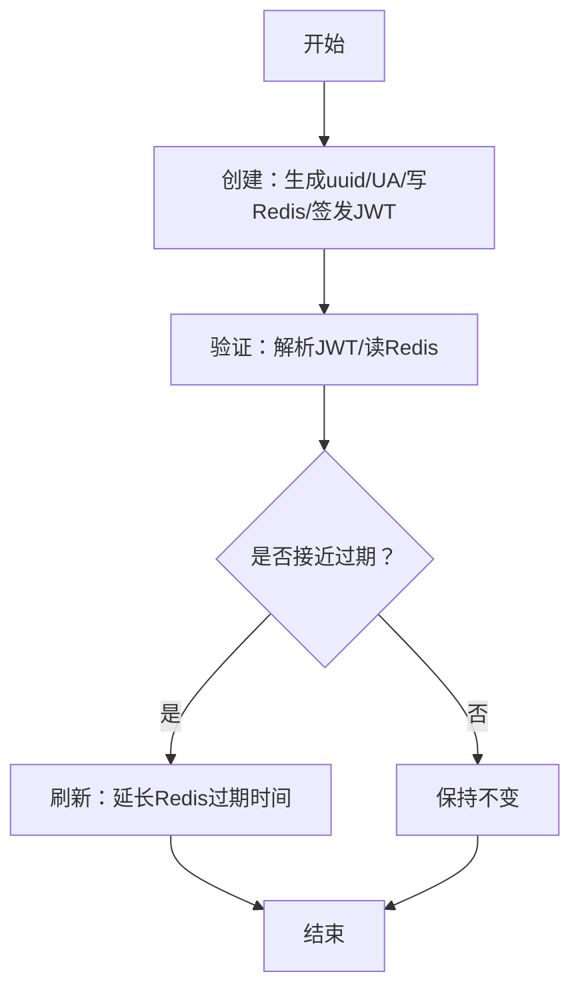
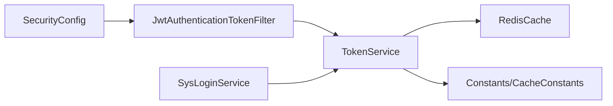

# JWT令牌管理

<cite>
**本文引用的文件**
- [ruoyi-framework/src/main/java/com/ruoyi/framework/web/service/TokenService.java](file://ruoyi-framework/src/main/java/com/ruoyi/framework/web/service/TokenService.java)
- [ruoyi-framework/src/main/java/com/ruoyi/framework/security/filter/JwtAuthenticationTokenFilter.java](file://ruoyi-framework/src/main/java/com/ruoyi/framework/security/filter/JwtAuthenticationTokenFilter.java)
- [ruoyi-framework/src/main/java/com/ruoyi/framework/config/SecurityConfig.java](file://ruoyi-framework/src/main/java/com/ruoyi/framework/config/SecurityConfig.java)
- [ruoyi-framework/src/main/java/com/ruoyi/framework/security/handle/AuthenticationEntryPointImpl.java](file://ruoyi-framework/src/main/java/com/ruoyi/framework/security/handle/AuthenticationEntryPointImpl.java)
- [ruoyi-framework/src/main/java/com/ruoyi/framework/security/handle/LogoutSuccessHandlerImpl.java](file://ruoyi-framework/src/main/java/com/ruoyi/framework/security/handle/LogoutSuccessHandlerImpl.java)
- [ruoyi-framework/src/main/java/com/ruoyi/framework/web/service/SysLoginService.java](file://ruoyi-framework/src/main/java/com/ruoyi/framework/web/service/SysLoginService.java)
- [ruoyi-common/src/main/java/com/ruoyi/common/constant/Constants.java](file://ruoyi-common/src/main/java/com/ruoyi/common/constant/Constants.java)
- [ruoyi-common/src/main/java/com/ruoyi/common/constant/CacheConstants.java](file://ruoyi-common/src/main/java/com/ruoyi/common/constant/CacheConstants.java)
- [ruoyi-common/src/main/java/com/ruoyi/common/core/domain/model/LoginUser.java](file://ruoyi-common/src/main/java/com/ruoyi/common/core/domain/model/LoginUser.java)
- [ruoyi-admin/src/main/resources/application.yml](file://ruoyi-admin/src/main/resources/application.yml)
- [ruoyi-admin/src/main/java/com/ruoyi/web/controller/monitor/CacheController.java](file://ruoyi-admin/src/main/java/com/ruoyi/web/controller/monitor/CacheController.java)
</cite>

## 目录
1. [简介](#简介)
2. [项目结构](#项目结构)
3. [核心组件](#核心组件)
4. [架构总览](#架构总览)
5. [详细组件分析](#详细组件分析)
6. [依赖分析](#依赖分析)
7. [性能考虑](#性能考虑)
8. [故障排查指南](#故障排查指南)
9. [结论](#结论)
10. [附录](#附录)

## 简介
本文件面向“JWT令牌管理系统”的设计与实现，围绕以下目标展开：令牌生成算法、签名机制、有效期配置；令牌的创建、验证、刷新、失效处理的完整生命周期；请求头传递机制、过滤器验证流程、安全存储策略；过期处理、自动刷新、异常令牌处理等安全策略；配置参数、性能优化建议、安全最佳实践；以及调试方法与常见问题排查。

## 项目结构
本项目采用前后端分离与多模块组织方式，JWT相关能力主要集中在框架层与通用工具层：
- 框架层（ruoyi-framework）：Spring Security配置、JWT过滤器、认证入口与登出处理器、登录服务与令牌服务
- 通用层（ruoyi-common）：常量定义（含JWT相关键）、缓存键前缀
- 控制台与演示（ruoyi-admin、Demo）：配置示例、缓存监控接口
- 前端（ruoyi-ui、uniapp-h5）：调用示例与权限控制

图表来源
- [ruoyi-framework/src/main/java/com/ruoyi/framework/config/SecurityConfig.java:86-124](file://ruoyi-framework/src/main/java/com/ruoyi/framework/config/SecurityConfig.java#L86-L124)
- [ruoyi-framework/src/main/java/com/ruoyi/framework/security/filter/JwtAuthenticationTokenFilter.java:30-43](file://ruoyi-framework/src/main/java/com/ruoyi/framework/security/filter/JwtAuthenticationTokenFilter.java#L30-L43)
- [ruoyi-framework/src/main/java/com/ruoyi/framework/web/service/TokenService.java:62-83](file://ruoyi-framework/src/main/java/com/ruoyi/framework/web/service/TokenService.java#L62-L83)
- [ruoyi-framework/src/main/java/com/ruoyi/framework/web/service/SysLoginService.java:63-100](file://ruoyi-framework/src/main/java/com/ruoyi/framework/web/service/SysLoginService.java#L63-L100)
- [ruoyi-common/src/main/java/com/ruoyi/common/constant/Constants.java:104-136](file://ruoyi-common/src/main/java/com/ruoyi/common/constant/Constants.java#L104-L136)
- [ruoyi-common/src/main/java/com/ruoyi/common/constant/CacheConstants.java:11-13](file://ruoyi-common/src/main/java/com/ruoyi/common/constant/CacheConstants.java#L11-L13)

章节来源
- [ruoyi-framework/src/main/java/com/ruoyi/framework/config/SecurityConfig.java:86-124](file://ruoyi-framework/src/main/java/com/ruoyi/framework/config/SecurityConfig.java#L86-L124)
- [ruoyi-framework/src/main/java/com/ruoyi/framework/security/filter/JwtAuthenticationTokenFilter.java:30-43](file://ruoyi-framework/src/main/java/com/ruoyi/framework/security/filter/JwtAuthenticationTokenFilter.java#L30-L43)
- [ruoyi-framework/src/main/java/com/ruoyi/framework/web/service/TokenService.java:62-83](file://ruoyi-framework/src/main/java/com/ruoyi/framework/web/service/TokenService.java#L62-L83)
- [ruoyi-framework/src/main/java/com/ruoyi/framework/web/service/SysLoginService.java:63-100](file://ruoyi-framework/src/main/java/com/ruoyi/framework/web/service/SysLoginService.java#L63-L100)
- [ruoyi-common/src/main/java/com/ruoyi/common/constant/Constants.java:104-136](file://ruoyi-common/src/main/java/com/ruoyi/common/constant/Constants.java#L104-L136)
- [ruoyi-common/src/main/java/com/ruoyi/common/constant/CacheConstants.java:11-13](file://ruoyi-common/src/main/java/com/ruoyi/common/constant/CacheConstants.java#L11-L13)

## 核心组件
- 令牌服务（TokenService）：负责令牌创建、解析、有效期校验与自动刷新、用户代理信息注入、Redis缓存交互
- JWT过滤器（JwtAuthenticationTokenFilter）：拦截请求，提取令牌、解析用户信息、设置认证上下文
- 安全配置（SecurityConfig）：启用无状态会话、注册JWT过滤器、匿名放行规则、认证失败处理
- 登录服务（SysLoginService）：完成账号密码认证、生成令牌
- 登录用户模型（LoginUser）：承载用户身份、权限、登录设备与过期时间等
- 常量与缓存键（Constants/CacheConstants）：统一令牌前缀、JWT字段键、Redis键前缀

章节来源
- [ruoyi-framework/src/main/java/com/ruoyi/framework/web/service/TokenService.java:36-46](file://ruoyi-framework/src/main/java/com/ruoyi/framework/web/service/TokenService.java#L36-L46)
- [ruoyi-framework/src/main/java/com/ruoyi/framework/security/filter/JwtAuthenticationTokenFilter.java:24-43](file://ruoyi-framework/src/main/java/com/ruoyi/framework/security/filter/JwtAuthenticationTokenFilter.java#L24-L43)
- [ruoyi-framework/src/main/java/com/ruoyi/framework/config/SecurityConfig.java:98-124](file://ruoyi-framework/src/main/java/com/ruoyi/framework/config/SecurityConfig.java#L98-L124)
- [ruoyi-framework/src/main/java/com/ruoyi/framework/web/service/SysLoginService.java:63-100](file://ruoyi-framework/src/main/java/com/ruoyi/framework/web/service/SysLoginService.java#L63-L100)
- [ruoyi-common/src/main/java/com/ruoyi/common/core/domain/model/LoginUser.java:30-42](file://ruoyi-common/src/main/java/com/ruoyi/common/core/domain/model/LoginUser.java#L30-L42)
- [ruoyi-common/src/main/java/com/ruoyi/common/constant/Constants.java:104-136](file://ruoyi-common/src/main/java/com/ruoyi/common/constant/Constants.java#L104-L136)
- [ruoyi-common/src/main/java/com/ruoyi/common/constant/CacheConstants.java:11-13](file://ruoyi-common/src/main/java/com/ruoyi/common/constant/CacheConstants.java#L11-L13)

## 架构总览
下图展示从请求到认证、令牌解析与自动刷新的整体流程：

图表来源
- [ruoyi-framework/src/main/java/com/ruoyi/framework/security/filter/JwtAuthenticationTokenFilter.java:30-43](file://ruoyi-framework/src/main/java/com/ruoyi/framework/security/filter/JwtAuthenticationTokenFilter.java#L30-L43)
- [ruoyi-framework/src/main/java/com/ruoyi/framework/web/service/TokenService.java:62-83](file://ruoyi-framework/src/main/java/com/ruoyi/framework/web/service/TokenService.java#L62-L83)
- [ruoyi-framework/src/main/java/com/ruoyi/framework/web/service/TokenService.java:133-141](file://ruoyi-framework/src/main/java/com/ruoyi/framework/web/service/TokenService.java#L133-L141)
- [ruoyi-framework/src/main/java/com/ruoyi/framework/config/SecurityConfig.java:96-98](file://ruoyi-framework/src/main/java/com/ruoyi/framework/config/SecurityConfig.java#L96-L98)
- [ruoyi-framework/src/main/java/com/ruoyi/framework/security/handle/AuthenticationEntryPointImpl.java:26-33](file://ruoyi-framework/src/main/java/com/ruoyi/framework/security/handle/AuthenticationEntryPointImpl.java#L26-L33)

## 详细组件分析

### 组件A：令牌服务（TokenService）
- 令牌生成算法与签名机制
  - 使用对称签名算法对载荷进行签名，签名密钥来自配置项
  - 载荷包含用户标识键、用户名等
- 有效期配置
  - 令牌有效期由配置项提供，单位为分钟
  - 登录时将用户信息写入Redis，并设置过期时间
- 生命周期管理
  - 创建：生成唯一令牌标识，填充用户代理信息，写入Redis
  - 验证：解析JWT，从Redis读取用户信息
  - 刷新：当距离过期时间小于阈值（毫秒级计算），自动延长Redis过期时间
  - 失效：登出时删除Redis中的用户缓存
- 请求头传递机制
  - 默认请求头名为配置项，值以特定前缀开头，过滤器会去除前缀后解析
- 安全存储策略
  - 用户信息以键前缀+uuid的形式存储在Redis，便于按令牌快速定位与清理

图表来源
- [ruoyi-framework/src/main/java/com/ruoyi/framework/web/service/TokenService.java:36-46](file://ruoyi-framework/src/main/java/com/ruoyi/framework/web/service/TokenService.java#L36-L46)
- [ruoyi-framework/src/main/java/com/ruoyi/framework/web/service/TokenService.java:114-125](file://ruoyi-framework/src/main/java/com/ruoyi/framework/web/service/TokenService.java#L114-L125)
- [ruoyi-framework/src/main/java/com/ruoyi/framework/web/service/TokenService.java:133-141](file://ruoyi-framework/src/main/java/com/ruoyi/framework/web/service/TokenService.java#L133-L141)
- [ruoyi-framework/src/main/java/com/ruoyi/framework/web/service/TokenService.java:178-198](file://ruoyi-framework/src/main/java/com/ruoyi/framework/web/service/TokenService.java#L178-L198)
- [ruoyi-common/src/main/java/com/ruoyi/common/constant/Constants.java:104-136](file://ruoyi-common/src/main/java/com/ruoyi/common/constant/Constants.java#L104-L136)
- [ruoyi-common/src/main/java/com/ruoyi/common/constant/CacheConstants.java:11-13](file://ruoyi-common/src/main/java/com/ruoyi/common/constant/CacheConstants.java#L11-L13)

章节来源
- [ruoyi-framework/src/main/java/com/ruoyi/framework/web/service/TokenService.java:36-46](file://ruoyi-framework/src/main/java/com/ruoyi/framework/web/service/TokenService.java#L36-L46)
- [ruoyi-framework/src/main/java/com/ruoyi/framework/web/service/TokenService.java:62-83](file://ruoyi-framework/src/main/java/com/ruoyi/framework/web/service/TokenService.java#L62-L83)
- [ruoyi-framework/src/main/java/com/ruoyi/framework/web/service/TokenService.java:114-125](file://ruoyi-framework/src/main/java/com/ruoyi/framework/web/service/TokenService.java#L114-L125)
- [ruoyi-framework/src/main/java/com/ruoyi/framework/web/service/TokenService.java:133-141](file://ruoyi-framework/src/main/java/com/ruoyi/framework/web/service/TokenService.java#L133-L141)
- [ruoyi-framework/src/main/java/com/ruoyi/framework/web/service/TokenService.java:178-198](file://ruoyi-framework/src/main/java/com/ruoyi/framework/web/service/TokenService.java#L178-L198)
- [ruoyi-common/src/main/java/com/ruoyi/common/constant/Constants.java:104-136](file://ruoyi-common/src/main/java/com/ruoyi/common/constant/Constants.java#L104-L136)
- [ruoyi-common/src/main/java/com/ruoyi/common/constant/CacheConstants.java:11-13](file://ruoyi-common/src/main/java/com/ruoyi/common/constant/CacheConstants.java#L11-L13)

### 组件B：JWT过滤器（JwtAuthenticationTokenFilter）
- 过滤器职责
  - 从请求头中提取令牌
  - 调用令牌服务解析用户信息
  - 若尚未设置认证上下文，则将用户信息写入认证上下文
- 与安全配置的关系
  - 在用户名密码过滤器之前执行，确保在认证阶段即完成令牌解析

图表来源
- [ruoyi-framework/src/main/java/com/ruoyi/framework/security/filter/JwtAuthenticationTokenFilter.java:30-43](file://ruoyi-framework/src/main/java/com/ruoyi/framework/security/filter/JwtAuthenticationTokenFilter.java#L30-L43)
- [ruoyi-framework/src/main/java/com/ruoyi/framework/web/service/TokenService.java:133-141](file://ruoyi-framework/src/main/java/com/ruoyi/framework/web/service/TokenService.java#L133-L141)

章节来源
- [ruoyi-framework/src/main/java/com/ruoyi/framework/security/filter/JwtAuthenticationTokenFilter.java:30-43](file://ruoyi-framework/src/main/java/com/ruoyi/framework/security/filter/JwtAuthenticationTokenFilter.java#L30-L43)

### 组件C：安全配置（SecurityConfig）
- 无状态会话策略
  - 禁用会话，基于令牌认证
- 匿名放行
  - 对登录、注册、验证码、静态资源、Swagger等接口放行
- 过滤器链
  - 注册JWT过滤器与CORS过滤器，保证跨域与令牌解析顺序

图表来源
- [ruoyi-framework/src/main/java/com/ruoyi/framework/config/SecurityConfig.java:86-124](file://ruoyi-framework/src/main/java/com/ruoyi/framework/config/SecurityConfig.java#L86-L124)

章节来源
- [ruoyi-framework/src/main/java/com/ruoyi/framework/config/SecurityConfig.java:86-124](file://ruoyi-framework/src/main/java/com/ruoyi/framework/config/SecurityConfig.java#L86-L124)

### 组件D：登录服务（SysLoginService）
- 登录流程
  - 校验验证码（可选）
  - 用户名/密码认证
  - 记录登录信息
  - 生成JWT令牌并返回给客户端

图表来源
- [ruoyi-framework/src/main/java/com/ruoyi/framework/web/service/SysLoginService.java:63-100](file://ruoyi-framework/src/main/java/com/ruoyi/framework/web/service/SysLoginService.java#L63-L100)
- [ruoyi-framework/src/main/java/com/ruoyi/framework/web/service/TokenService.java:114-125](file://ruoyi-framework/src/main/java/com/ruoyi/framework/web/service/TokenService.java#L114-L125)

章节来源
- [ruoyi-framework/src/main/java/com/ruoyi/framework/web/service/SysLoginService.java:63-100](file://ruoyi-framework/src/main/java/com/ruoyi/framework/web/service/SysLoginService.java#L63-L100)

### 组件E：登出与异常处理
- 登出处理
  - 从请求解析用户信息，删除Redis中的用户缓存，记录登出日志
- 认证失败处理
  - 返回未授权状态与错误信息

图表来源
- [ruoyi-framework/src/main/java/com/ruoyi/framework/security/handle/LogoutSuccessHandlerImpl.java:38-51](file://ruoyi-framework/src/main/java/com/ruoyi/framework/security/handle/LogoutSuccessHandlerImpl.java#L38-L51)
- [ruoyi-framework/src/main/java/com/ruoyi/framework/web/service/TokenService.java:99-106](file://ruoyi-framework/src/main/java/com/ruoyi/framework/web/service/TokenService.java#L99-L106)

章节来源
- [ruoyi-framework/src/main/java/com/ruoyi/framework/security/handle/LogoutSuccessHandlerImpl.java:38-51](file://ruoyi-framework/src/main/java/com/ruoyi/framework/security/handle/LogoutSuccessHandlerImpl.java#L38-L51)
- [ruoyi-framework/src/main/java/com/ruoyi/framework/security/handle/AuthenticationEntryPointImpl.java:26-33](file://ruoyi-framework/src/main/java/com/ruoyi/framework/security/handle/AuthenticationEntryPointImpl.java#L26-L33)

### 组件F：令牌生命周期（创建-验证-刷新-失效）
- 创建
  - 生成唯一令牌标识，填充用户代理信息，写入Redis并设置过期时间
  - 构造JWT载荷并签名返回
- 验证
  - 从请求头解析令牌，解析签名，从Redis读取用户信息
- 刷新
  - 当距离过期时间小于阈值，延长Redis过期时间
- 失效
  - 登出时删除Redis中的用户缓存

图表来源
- [ruoyi-framework/src/main/java/com/ruoyi/framework/web/service/TokenService.java:114-125](file://ruoyi-framework/src/main/java/com/ruoyi/framework/web/service/TokenService.java#L114-L125)
- [ruoyi-framework/src/main/java/com/ruoyi/framework/web/service/TokenService.java:133-141](file://ruoyi-framework/src/main/java/com/ruoyi/framework/web/service/TokenService.java#L133-L141)
- [ruoyi-framework/src/main/java/com/ruoyi/framework/web/service/TokenService.java:148-155](file://ruoyi-framework/src/main/java/com/ruoyi/framework/web/service/TokenService.java#L148-L155)
- [ruoyi-framework/src/main/java/com/ruoyi/framework/web/service/TokenService.java:99-106](file://ruoyi-framework/src/main/java/com/ruoyi/framework/web/service/TokenService.java#L99-L106)

章节来源
- [ruoyi-framework/src/main/java/com/ruoyi/framework/web/service/TokenService.java:114-125](file://ruoyi-framework/src/main/java/com/ruoyi/framework/web/service/TokenService.java#L114-L125)
- [ruoyi-framework/src/main/java/com/ruoyi/framework/web/service/TokenService.java:133-141](file://ruoyi-framework/src/main/java/com/ruoyi/framework/web/service/TokenService.java#L133-L141)
- [ruoyi-framework/src/main/java/com/ruoyi/framework/web/service/TokenService.java:148-155](file://ruoyi-framework/src/main/java/com/ruoyi/framework/web/service/TokenService.java#L148-L155)
- [ruoyi-framework/src/main/java/com/ruoyi/framework/web/service/TokenService.java:99-106](file://ruoyi-framework/src/main/java/com/ruoyi/framework/web/service/TokenService.java#L99-L106)

## 依赖分析
- 组件耦合
  - SecurityConfig注册JwtAuthenticationTokenFilter与CORS过滤器，形成认证链
  - JwtAuthenticationTokenFilter依赖TokenService进行令牌解析与用户信息读取
  - TokenService依赖RedisCache进行用户信息持久化与读取
  - SysLoginService在认证成功后委托TokenService生成JWT
- 外部依赖
  - JWT库用于签名与解析
  - Redis用于用户信息缓存与令牌生命周期管理

图表来源
- [ruoyi-framework/src/main/java/com/ruoyi/framework/config/SecurityConfig.java:118-122](file://ruoyi-framework/src/main/java/com/ruoyi/framework/config/SecurityConfig.java#L118-L122)
- [ruoyi-framework/src/main/java/com/ruoyi/framework/security/filter/JwtAuthenticationTokenFilter.java:27-28](file://ruoyi-framework/src/main/java/com/ruoyi/framework/security/filter/JwtAuthenticationTokenFilter.java#L27-L28)
- [ruoyi-framework/src/main/java/com/ruoyi/framework/web/service/TokenService.java:54-55](file://ruoyi-framework/src/main/java/com/ruoyi/framework/web/service/TokenService.java#L54-L55)
- [ruoyi-framework/src/main/java/com/ruoyi/framework/web/service/SysLoginService.java:39-40](file://ruoyi-framework/src/main/java/com/ruoyi/framework/web/service/SysLoginService.java#L39-L40)

章节来源
- [ruoyi-framework/src/main/java/com/ruoyi/framework/config/SecurityConfig.java:118-122](file://ruoyi-framework/src/main/java/com/ruoyi/framework/config/SecurityConfig.java#L118-L122)
- [ruoyi-framework/src/main/java/com/ruoyi/framework/security/filter/JwtAuthenticationTokenFilter.java:27-28](file://ruoyi-framework/src/main/java/com/ruoyi/framework/security/filter/JwtAuthenticationTokenFilter.java#L27-L28)
- [ruoyi-framework/src/main/java/com/ruoyi/framework/web/service/TokenService.java:54-55](file://ruoyi-framework/src/main/java/com/ruoyi/framework/web/service/TokenService.java#L54-L55)
- [ruoyi-framework/src/main/java/com/ruoyi/framework/web/service/SysLoginService.java:39-40](file://ruoyi-framework/src/main/java/com/ruoyi/framework/web/service/SysLoginService.java#L39-L40)

## 性能考虑
- Redis热点键
  - 登录用户键以令牌uuid为后缀，读写频繁，建议合理设置Redis实例规格与连接池参数
- 过期刷新阈值
  - 在即将过期时刷新Redis过期时间，避免频繁解析JWT带来的CPU压力
- 令牌长度与负载
  - JWT载荷仅包含必要字段，减少体积，提高网络传输效率
- 无状态设计
  - 基于令牌的无状态认证降低服务器会话存储成本

## 故障排查指南
- 常见问题
  - 401未授权：检查请求头是否正确携带令牌前缀，确认签名密钥一致
  - 令牌过期：确认令牌有效期配置与客户端刷新逻辑
  - 登录后仍提示未登录：检查过滤器是否在用户名密码过滤器之前执行
  - 登出无效：确认登出接口调用与Redis缓存清理
- 调试方法
  - 查看Redis中是否存在以登录令牌键前缀开头的键
  - 在认证入口处理器中观察返回的错误信息
  - 使用缓存监控接口查看缓存命中与清理情况

章节来源
- [ruoyi-framework/src/main/java/com/ruoyi/framework/security/handle/AuthenticationEntryPointImpl.java:26-33](file://ruoyi-framework/src/main/java/com/ruoyi/framework/security/handle/AuthenticationEntryPointImpl.java#L26-L33)
- [ruoyi-admin/src/main/java/com/ruoyi/web/controller/monitor/CacheController.java:88-121](file://ruoyi-admin/src/main/java/com/ruoyi/web/controller/monitor/CacheController.java#L88-L121)
- [ruoyi-common/src/main/java/com/ruoyi/common/constant/CacheConstants.java:11-13](file://ruoyi-common/src/main/java/com/ruoyi/common/constant/CacheConstants.java#L11-L13)

## 结论
本JWT令牌管理系统通过明确的组件分工与清晰的生命周期管理，实现了安全、可扩展的无状态认证能力。结合Redis缓存与自动刷新机制，在保障安全性的同时兼顾了性能与用户体验。建议在生产环境中严格管理密钥与有效期配置，并配合完善的监控与告警体系。

## 附录

### 配置参数说明
- token.header：请求头名称（默认Authorization）
- token.secret：签名密钥（默认示例值）
- token.expireTime：令牌有效期（分钟）

章节来源
- [ruoyi-admin/src/main/resources/application.yml:95-102](file://ruoyi-admin/src/main/resources/application.yml#L95-L102)

### 请求头传递机制
- 客户端应在请求头中携带令牌，格式为“令牌前缀 + 令牌字符串”
- 服务端过滤器会去除前缀后解析令牌

章节来源
- [ruoyi-common/src/main/java/com/ruoyi/common/constant/Constants.java:104-106](file://ruoyi-common/src/main/java/com/ruoyi/common/constant/Constants.java#L104-L106)
- [ruoyi-framework/src/main/java/com/ruoyi/framework/web/service/TokenService.java:218-226](file://ruoyi-framework/src/main/java/com/ruoyi/framework/web/service/TokenService.java#L218-L226)

### 安全最佳实践
- 密钥管理：定期轮换签名密钥，避免硬编码在配置文件中
- 传输安全：强制HTTPS，防止令牌在传输过程中被窃取
- 令牌回收：登出时立即删除Redis中的用户缓存
- 最小权限：JWT载荷仅包含必要字段，避免泄露敏感信息
- 监控告警：关注Redis命中率与认证失败率指标