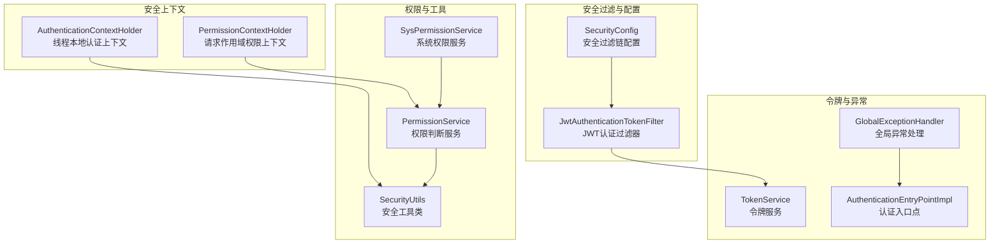
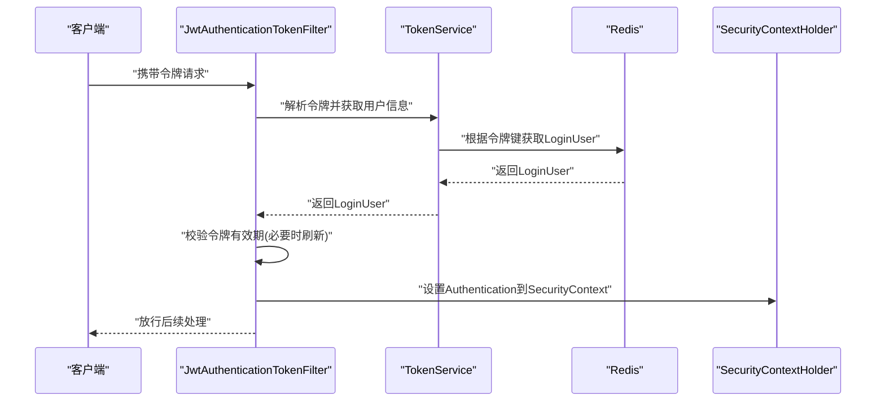
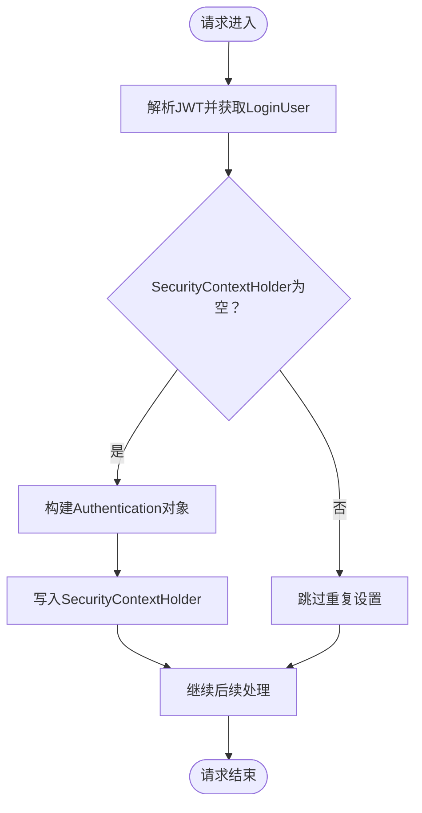
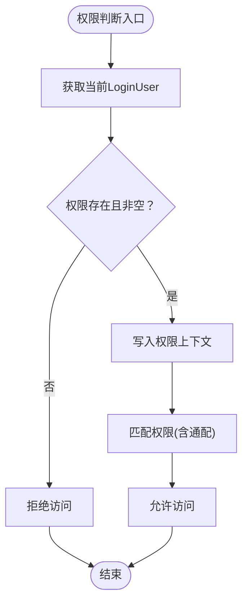
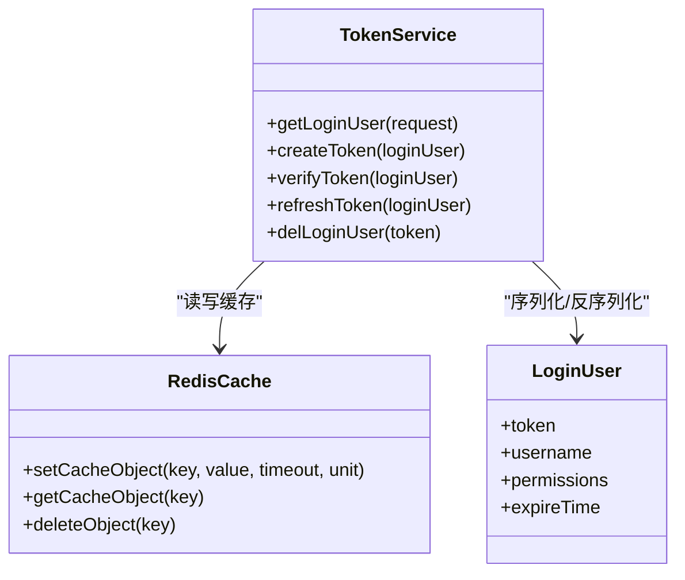
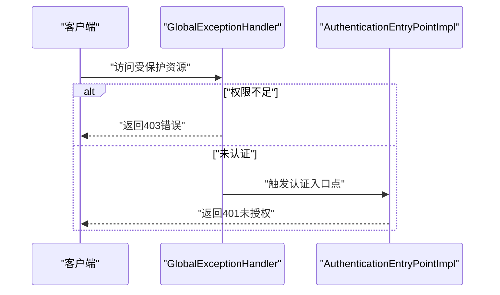
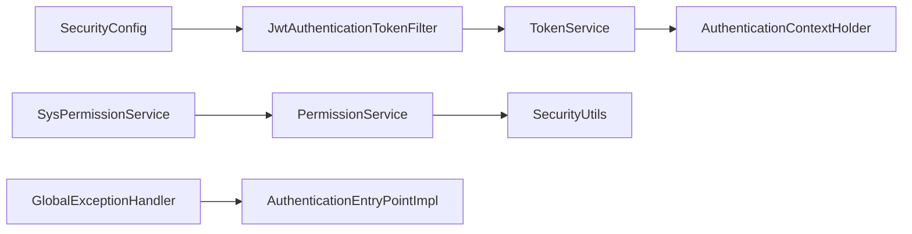

# 安全上下文管理

<cite>
**本文引用的文件**
- [AuthenticationContextHolder.java](file://ruoyi-framework/src/main/java/com/ruoyi/framework/security/context/AuthenticationContextHolder.java)
- [PermissionContextHolder.java](file://ruoyi-framework/src/main/java/com/ruoyi/framework/security/context/PermissionContextHolder.java)
- [JwtAuthenticationTokenFilter.java](file://ruoyi-framework/src/main/java/com/ruoyi/framework/security/filter/JwtAuthenticationTokenFilter.java)
- [SecurityConfig.java](file://ruoyi-framework/src/main/java/com/ruoyi/framework/config/SecurityConfig.java)
- [TokenService.java](file://ruoyi-framework/src/main/java/com/ruoyi/framework/web/service/TokenService.java)
- [PermissionService.java](file://ruoyi-framework/src/main/java/com/ruoyi/framework/web/service/PermissionService.java)
- [SysPermissionService.java](file://ruoyi-framework/src/main/java/com/ruoyi/framework/web/service/SysPermissionService.java)
- [SecurityUtils.java](file://ruoyi-common/src/main/java/com/ruoyi/common/utils/SecurityUtils.java)
- [GlobalExceptionHandler.java](file://ruoyi-framework/src/main/java/com/ruoyi/framework/web/exception/GlobalExceptionHandler.java)
- [AuthenticationEntryPointImpl.java](file://ruoyi-framework/src/main/java/com/ruoyi/framework/security/handle/AuthenticationEntryPointImpl.java)
- [CacheController.java](file://ruoyi-admin/src/main/java/com/ruoyi/web/controller/monitor/CacheController.java)
- [LoginUser.java](file://ruoyi-common/src/main/java/com/ruoyi/common/core/domain/model/LoginUser.java)
</cite>

## 目录
1. [引言](#引言)
2. [项目结构](#项目结构)
3. [核心组件](#核心组件)
4. [架构总览](#架构总览)
5. [详细组件分析](#详细组件分析)
6. [依赖关系分析](#依赖关系分析)
7. [性能考量](#性能考量)
8. [故障排查指南](#故障排查指南)
9. [结论](#结论)
10. [附录](#附录)

## 引言
本文件围绕“安全上下文管理”主题，系统梳理认证上下文与权限上下文的生命周期、存储与获取机制、线程安全与内存管理、权限解析与缓存策略、全局异常处理中的安全异常捕获与分类处理，并提供配置参数、调试与性能监控方法，以及异常排查与性能诊断的专业指南。

## 项目结构
安全上下文管理涉及后端框架层与通用工具层的关键组件，主要分布如下：
- 框架安全上下文：认证上下文与权限上下文容器
- 安全过滤链：基于JWT的认证过滤器与Spring Security配置
- 权限服务：权限与角色判断、权限解析与缓存
- 工具与异常：安全工具类、全局异常处理与认证入口点
- 缓存监控：Redis缓存键命名与运维清理

图表来源
- [AuthenticationContextHolder.java:10-28](file://ruoyi-framework/src/main/java/com/ruoyi/framework/security/context/AuthenticationContextHolder.java#L10-L28)
- [PermissionContextHolder.java:12-27](file://ruoyi-framework/src/main/java/com/ruoyi/framework/security/context/PermissionContextHolder.java#L12-L27)
- [JwtAuthenticationTokenFilter.java:25-44](file://ruoyi-framework/src/main/java/com/ruoyi/framework/security/filter/JwtAuthenticationTokenFilter.java#L25-L44)
- [SecurityConfig.java:86-124](file://ruoyi-framework/src/main/java/com/ruoyi/framework/config/SecurityConfig.java#L86-L124)
- [PermissionService.java:19-160](file://ruoyi-framework/src/main/java/com/ruoyi/framework/web/service/PermissionService.java#L19-L160)
- [SysPermissionService.java:22-49](file://ruoyi-framework/src/main/java/com/ruoyi/framework/web/service/SysPermissionService.java#L22-L49)
- [SecurityUtils.java:21-179](file://ruoyi-common/src/main/java/com/ruoyi/common/utils/SecurityUtils.java#L21-L179)
- [TokenService.java:32-233](file://ruoyi-framework/src/main/java/com/ruoyi/framework/web/service/TokenService.java#L32-L233)
- [GlobalExceptionHandler.java:28-146](file://ruoyi-framework/src/main/java/com/ruoyi/framework/web/exception/GlobalExceptionHandler.java#L28-L146)
- [AuthenticationEntryPointImpl.java:22-34](file://ruoyi-framework/src/main/java/com/ruoyi/framework/security/handle/AuthenticationEntryPointImpl.java#L22-L34)

章节来源
- [SecurityConfig.java:86-124](file://ruoyi-framework/src/main/java/com/ruoyi/framework/config/SecurityConfig.java#L86-L124)
- [JwtAuthenticationTokenFilter.java:25-44](file://ruoyi-framework/src/main/java/com/ruoyi/framework/security/filter/JwtAuthenticationTokenFilter.java#L25-L44)

## 核心组件
- 认证上下文容器：基于ThreadLocal的线程本地存储，提供获取、设置与清理能力，确保每个线程独立持有自己的认证对象。
- 权限上下文容器：基于RequestContextHolder的请求作用域存储，用于在一次请求内传递权限上下文信息，便于权限判断与日志记录。
- JWT认证过滤器：从请求头提取令牌，解析用户信息，校验令牌有效期并在必要时刷新缓存，最终将认证信息写入SecurityContextHolder。
- 权限服务：封装权限与角色判断逻辑，支持单权限、任一权限、角色判断等场景，并通过上下文容器记录当前判断的权限。
- 系统权限服务：负责从用户角色与菜单中聚合权限集合，形成用户可用权限集。
- 安全工具类：提供获取当前用户、用户ID、部门ID、密码加密与匹配、权限/角色判断等便捷方法。
- 令牌服务：负责令牌创建、解析、有效期校验与自动刷新、用户UA/IP位置信息注入、Redis缓存键命名与过期时间管理。
- 全局异常处理：对权限校验失败、请求方式不支持、业务异常等进行统一拦截与格式化输出；认证入口点负责未授权访问的统一响应。
- 缓存监控：提供Redis缓存信息查看与按前缀/键清理能力，便于运维定位令牌与缓存问题。

章节来源
- [AuthenticationContextHolder.java:10-28](file://ruoyi-framework/src/main/java/com/ruoyi/framework/security/context/AuthenticationContextHolder.java#L10-L28)
- [PermissionContextHolder.java:12-27](file://ruoyi-framework/src/main/java/com/ruoyi/framework/security/context/PermissionContextHolder.java#L12-L27)
- [JwtAuthenticationTokenFilter.java:25-44](file://ruoyi-framework/src/main/java/com/ruoyi/framework/security/filter/JwtAuthenticationTokenFilter.java#L25-L44)
- [PermissionService.java:19-160](file://ruoyi-framework/src/main/java/com/ruoyi/framework/web/service/PermissionService.java#L19-L160)
- [SysPermissionService.java:22-49](file://ruoyi-framework/src/main/java/com/ruoyi/framework/web/service/SysPermissionService.java#L22-L49)
- [SecurityUtils.java:21-179](file://ruoyi-common/src/main/java/com/ruoyi/common/utils/SecurityUtils.java#L21-L179)
- [TokenService.java:32-233](file://ruoyi-framework/src/main/java/com/ruoyi/framework/web/service/TokenService.java#L32-L233)
- [GlobalExceptionHandler.java:28-146](file://ruoyi-framework/src/main/java/com/ruoyi/framework/web/exception/GlobalExceptionHandler.java#L28-L146)
- [AuthenticationEntryPointImpl.java:22-34](file://ruoyi-framework/src/main/java/com/ruoyi/framework/security/handle/AuthenticationEntryPointImpl.java#L22-L34)
- [CacheController.java:30-122](file://ruoyi-admin/src/main/java/com/ruoyi/web/controller/monitor/CacheController.java#L30-L122)

## 架构总览
整体安全架构采用“无状态+JWT”的认证模型，结合Spring Security的过滤链与自定义上下文容器，实现认证与权限控制的解耦与高效执行。

图表来源
- [JwtAuthenticationTokenFilter.java:30-43](file://ruoyi-framework/src/main/java/com/ruoyi/framework/security/filter/JwtAuthenticationTokenFilter.java#L30-L43)
- [TokenService.java:62-83](file://ruoyi-framework/src/main/java/com/ruoyi/framework/web/service/TokenService.java#L62-L83)
- [AuthenticationContextHolder.java:14-27](file://ruoyi-framework/src/main/java/com/ruoyi/framework/security/context/AuthenticationContextHolder.java#L14-L27)

章节来源
- [SecurityConfig.java:86-124](file://ruoyi-framework/src/main/java/com/ruoyi/framework/config/SecurityConfig.java#L86-L124)
- [JwtAuthenticationTokenFilter.java:25-44](file://ruoyi-framework/src/main/java/com/ruoyi/framework/security/filter/JwtAuthenticationTokenFilter.java#L25-L44)

## 详细组件分析

### 认证上下文生命周期管理
- 创建：JWT过滤器在请求到达时，从令牌解析出用户信息并创建Authentication对象。
- 存储：将Authentication写入SecurityContextHolder（线程本地），供后续业务与方法级安全使用。
- 获取：通过SecurityUtils或AuthenticationContextHolder获取当前线程的认证信息。
- 清理：在请求结束或退出登录时移除线程本地上下文，避免线程复用导致的数据残留。

图表来源
- [JwtAuthenticationTokenFilter.java:34-42](file://ruoyi-framework/src/main/java/com/ruoyi/framework/security/filter/JwtAuthenticationTokenFilter.java#L34-L42)
- [AuthenticationContextHolder.java:14-27](file://ruoyi-framework/src/main/java/com/ruoyi/framework/security/context/AuthenticationContextHolder.java#L14-L27)

章节来源
- [AuthenticationContextHolder.java:10-28](file://ruoyi-framework/src/main/java/com/ruoyi/framework/security/context/AuthenticationContextHolder.java#L10-L28)
- [JwtAuthenticationTokenFilter.java:25-44](file://ruoyi-framework/src/main/java/com/ruoyi/framework/security/filter/JwtAuthenticationTokenFilter.java#L25-L44)

### 权限上下文维护与解析
- 维护机制：权限服务在每次权限判断前，将当前判断的权限字符串写入请求作用域上下文，便于审计与日志追踪。
- 解析过程：从SecurityUtils获取当前LoginUser，读取其权限集合，支持通配与精确匹配，同时兼容超级管理员与角色判断。
- 缓存策略：权限集合来源于LoginUser，LoginUser由TokenService在Redis中缓存，令牌有效期临近阈值会自动刷新缓存，降低数据库压力。

图表来源
- [PermissionService.java:27-40](file://ruoyi-framework/src/main/java/com/ruoyi/framework/web/service/PermissionService.java#L27-L40)
- [SecurityUtils.java:72-82](file://ruoyi-common/src/main/java/com/ruoyi/common/utils/SecurityUtils.java#L72-L82)

章节来源
- [PermissionService.java:19-160](file://ruoyi-framework/src/main/java/com/ruoyi/framework/web/service/PermissionService.java#L19-L160)
- [SysPermissionService.java:22-49](file://ruoyi-framework/src/main/java/com/ruoyi/framework/web/service/SysPermissionService.java#L22-L49)
- [SecurityUtils.java:21-179](file://ruoyi-common/src/main/java/com/ruoyi/common/utils/SecurityUtils.java#L21-L179)

### 权限缓存策略
- LoginUser缓存：TokenService将LoginUser以令牌UUID为键缓存至Redis，有效期由配置项控制，临近阈值自动刷新。
- 缓存键命名：统一使用常量前缀，便于运维检索与清理。
- 运维清理：提供按前缀与键的清理接口，支持快速定位与释放令牌占用。

图表来源
- [TokenService.java:62-155](file://ruoyi-framework/src/main/java/com/ruoyi/framework/web/service/TokenService.java#L62-L155)
- [LoginUser.java:236-266](file://ruoyi-common/src/main/java/com/ruoyi/common/core/domain/model/LoginUser.java#L236-L266)

章节来源
- [TokenService.java:32-233](file://ruoyi-framework/src/main/java/com/ruoyi/framework/web/service/TokenService.java#L32-L233)
- [CacheController.java:30-122](file://ruoyi-admin/src/main/java/com/ruoyi/web/controller/monitor/CacheController.java#L30-L122)

### 全局异常处理中的安全异常捕获
- 权限校验失败：捕获AccessDeniedException，记录请求URI与错误信息，返回统一错误响应。
- 认证失败：通过AuthenticationEntryPointImpl统一返回未授权响应，包含请求URI与提示信息。
- 其他异常：对业务异常、请求方式不支持、参数类型不匹配等进行分类处理，保证前端可读性与一致性。

图表来源
- [GlobalExceptionHandler.java:35-41](file://ruoyi-framework/src/main/java/com/ruoyi/framework/web/exception/GlobalExceptionHandler.java#L35-L41)
- [AuthenticationEntryPointImpl.java:26-33](file://ruoyi-framework/src/main/java/com/ruoyi/framework/security/handle/AuthenticationEntryPointImpl.java#L26-L33)

章节来源
- [GlobalExceptionHandler.java:28-146](file://ruoyi-framework/src/main/java/com/ruoyi/framework/web/exception/GlobalExceptionHandler.java#L28-L146)
- [AuthenticationEntryPointImpl.java:22-34](file://ruoyi-framework/src/main/java/com/ruoyi/framework/security/handle/AuthenticationEntryPointImpl.java#L22-L34)

### 线程安全、内存管理与性能优化
- 线程安全：认证上下文使用ThreadLocal，天然隔离线程；权限上下文使用RequestContextHolder，按请求作用域隔离，避免跨线程污染。
- 内存管理：请求结束后应清理认证上下文，防止线程池复用导致的内存泄漏；令牌缓存设置合理过期时间并启用自动刷新。
- 性能优化：权限判断采用Set.contains与通配匹配，复杂度低；令牌解析与缓存命中优先，减少数据库访问；过滤器链顺序合理，避免重复认证。

章节来源
- [AuthenticationContextHolder.java:10-28](file://ruoyi-framework/src/main/java/com/ruoyi/framework/security/context/AuthenticationContextHolder.java#L10-L28)
- [PermissionContextHolder.java:12-27](file://ruoyi-framework/src/main/java/com/ruoyi/framework/security/context/PermissionContextHolder.java#L12-L27)
- [TokenService.java:133-155](file://ruoyi-framework/src/main/java/com/ruoyi/framework/web/service/TokenService.java#L133-L155)

### 配置参数与调试方法
- 配置参数
  - 令牌头部字段：token.header
  - 令牌密钥：token.secret
  - 令牌有效期（分钟）：token.expireTime
- 调试方法
  - 查看Redis缓存：通过缓存监控接口查看令牌键与值，定位用户登录状态。
  - 清理缓存：按前缀或键清理，模拟用户登出或修复异常状态。
  - 日志审计：关注全局异常处理器与认证入口点的日志输出，定位权限与认证问题。

章节来源
- [TokenService.java:37-46](file://ruoyi-framework/src/main/java/com/ruoyi/framework/web/service/TokenService.java#L37-L46)
- [CacheController.java:88-122](file://ruoyi-admin/src/main/java/com/ruoyi/web/controller/monitor/CacheController.java#L88-L122)

## 依赖关系分析
- 认证链路：SecurityConfig定义过滤链，JwtAuthenticationTokenFilter负责令牌解析与认证写入；TokenService提供令牌解析与缓存；SecurityContextHolder承载认证上下文。
- 权限链路：PermissionService与SysPermissionService共同完成权限聚合与判断；SecurityUtils提供便捷方法；PermissionContextHolder记录权限上下文。
- 异常链路：SecurityConfig注册异常处理与认证入口点；GlobalExceptionHandler统一拦截各类异常；AuthenticationEntryPointImpl处理未授权。

图表来源
- [SecurityConfig.java:86-124](file://ruoyi-framework/src/main/java/com/ruoyi/framework/config/SecurityConfig.java#L86-L124)
- [JwtAuthenticationTokenFilter.java:25-44](file://ruoyi-framework/src/main/java/com/ruoyi/framework/security/filter/JwtAuthenticationTokenFilter.java#L25-L44)
- [TokenService.java:32-233](file://ruoyi-framework/src/main/java/com/ruoyi/framework/web/service/TokenService.java#L32-L233)
- [PermissionService.java:19-160](file://ruoyi-framework/src/main/java/com/ruoyi/framework/web/service/PermissionService.java#L19-L160)
- [SysPermissionService.java:22-49](file://ruoyi-framework/src/main/java/com/ruoyi/framework/web/service/SysPermissionService.java#L22-L49)
- [GlobalExceptionHandler.java:28-146](file://ruoyi-framework/src/main/java/com/ruoyi/framework/web/exception/GlobalExceptionHandler.java#L28-L146)
- [AuthenticationEntryPointImpl.java:22-34](file://ruoyi-framework/src/main/java/com/ruoyi/framework/security/handle/AuthenticationEntryPointImpl.java#L22-L34)

章节来源
- [SecurityConfig.java:86-124](file://ruoyi-framework/src/main/java/com/ruoyi/framework/config/SecurityConfig.java#L86-L124)

## 性能考量
- 令牌解析与缓存：优先命中Redis缓存，避免频繁数据库查询；临近有效期自动刷新，降低抖动。
- 权限判断：使用Set.contains与通配匹配，时间复杂度低；避免在热点路径上重复计算权限集合。
- 过滤器链：将JWT过滤器置于登录/注销过滤器之前，减少重复认证与上下文污染。
- 日志与监控：统一异常处理与认证入口点，便于定位性能瓶颈与安全风险。

## 故障排查指南
- 认证失败（401）
  - 检查请求头是否包含正确的令牌字段与前缀；确认令牌未过期或即将过期。
  - 查看认证入口点日志，核对请求URI与错误原因。
- 权限不足（403）
  - 使用权限服务判断当前用户权限集合，核对所需权限与通配规则。
  - 检查系统权限聚合逻辑，确认角色与菜单权限映射正确。
- 缓存异常
  - 通过缓存监控接口查看令牌键是否存在与值是否正确。
  - 如需恢复，按前缀或键清理缓存，重新登录验证。
- 线程上下文泄漏
  - 确认请求结束时已清理认证上下文；避免在异步线程中误用上下文。

章节来源
- [AuthenticationEntryPointImpl.java:26-33](file://ruoyi-framework/src/main/java/com/ruoyi/framework/security/handle/AuthenticationEntryPointImpl.java#L26-L33)
- [GlobalExceptionHandler.java:35-41](file://ruoyi-framework/src/main/java/com/ruoyi/framework/web/exception/GlobalExceptionHandler.java#L35-L41)
- [CacheController.java:88-122](file://ruoyi-admin/src/main/java/com/ruoyi/web/controller/monitor/CacheController.java#L88-L122)

## 结论
该安全上下文管理体系通过“线程本地认证上下文 + 请求作用域权限上下文 + JWT + Redis缓存 + 统一异常处理”的组合，实现了高内聚、低耦合、高性能且易运维的安全控制。遵循本文提供的生命周期管理、权限解析与缓存策略、异常处理与调试方法，可在生产环境中稳定运行并快速定位问题。

## 附录
- 关键配置项
  - token.header：令牌请求头字段名
  - token.secret：JWT签名密钥
  - token.expireTime：令牌有效期（分钟）
- 常用缓存键前缀
  - 登录令牌键前缀：用于识别用户登录态
- 运维建议
  - 定期清理过期令牌与异常键；
  - 监控Redis内存与命令统计；
  - 在灰度发布期间关注权限变更带来的影响。