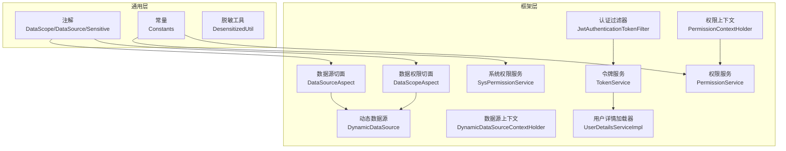
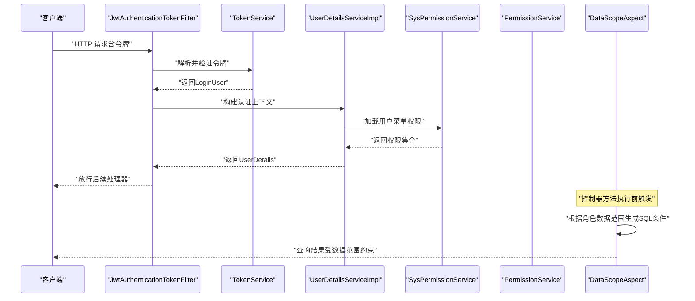
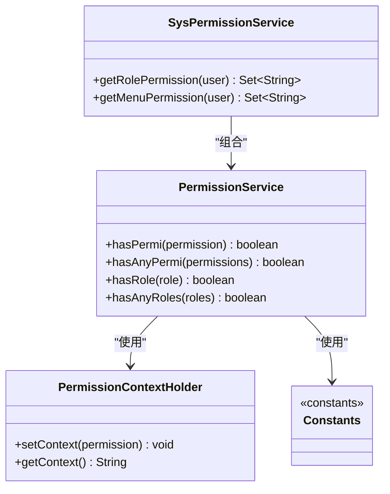
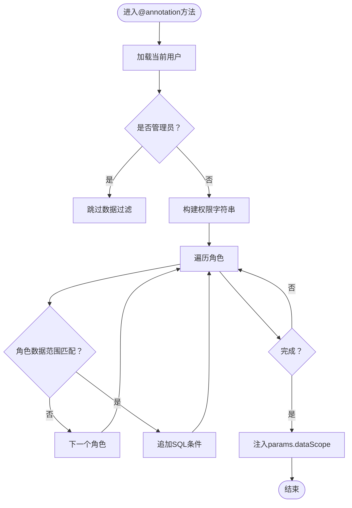
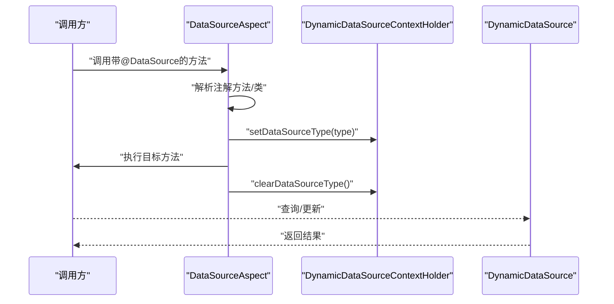
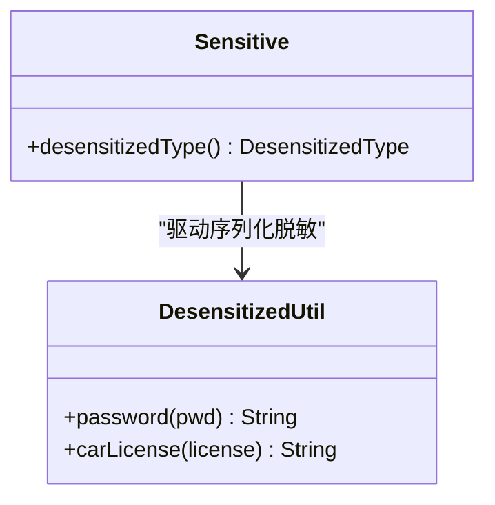
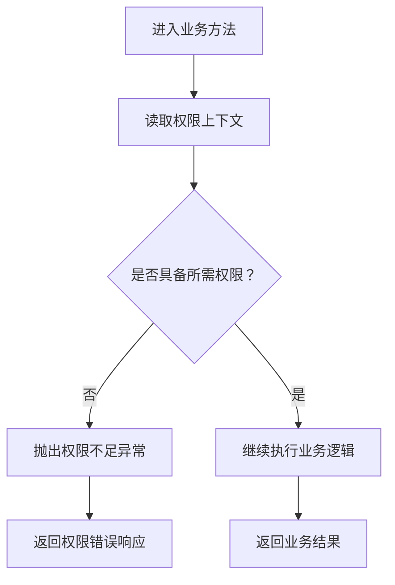
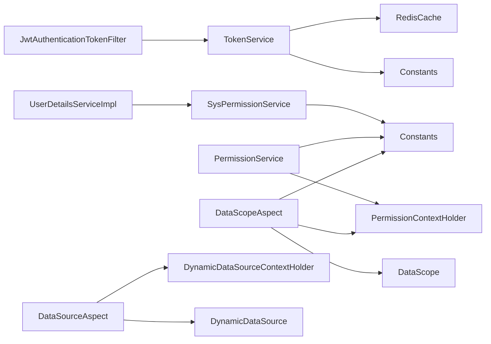

# 权限控制系统

<cite>
**本文引用的文件**
- [JwtAuthenticationTokenFilter.java](file://ruoyi-framework/src/main/java/com/ruoyi/framework/security/filter/JwtAuthenticationTokenFilter.java)
- [PermissionService.java](file://ruoyi-framework/src/main/java/com/ruoyi/framework/web/service/PermissionService.java)
- [SysPermissionService.java](file://ruoyi-framework/src/main/java/com/ruoyi/framework/web/service/SysPermissionService.java)
- [DataScope.java](file://ruoyi-common/src/main/java/com/ruoyi/common/annotation/DataScope.java)
- [DataSource.java](file://ruoyi-common/src/main/java/com/ruoyi/common/annotation/DataSource.java)
- [DataScopeAspect.java](file://ruoyi-framework/src/main/java/com/ruoyi/framework/aspectj/DataScopeAspect.java)
- [DataSourceAspect.java](file://ruoyi-framework/src/main/java/com/ruoyi/framework/aspectj/DataSourceAspect.java)
- [PermissionContextHolder.java](file://ruoyi-framework/src/main/java/com/ruoyi/framework/security/context/PermissionContextHolder.java)
- [TokenService.java](file://ruoyi-framework/src/main/java/com/ruoyi/framework/web/service/TokenService.java)
- [Constants.java](file://ruoyi-common/src/main/java/com/ruoyi/common/constant/Constants.java)
- [DynamicDataSource.java](file://ruoyi-framework/src/main/java/com/ruoyi/framework/datasource/DynamicDataSource.java)
- [DynamicDataSourceContextHolder.java](file://ruoyi-framework/src/main/java/com/ruoyi/framework/datasource/DynamicDataSourceContextHolder.java)
- [Sensitive.java](file://ruoyi-common/src/main/java/com/ruoyi/common/annotation/Sensitive.java)
- [DesensitizedUtil.java](file://ruoyi-common/src/main/java/com/ruoyi/common/utils/DesensitizedUtil.java)
- [UserDetailsServiceImpl.java](file://ruoyi-framework/src/main/java/com/ruoyi/framework/web/service/UserDetailsServiceImpl.java)
</cite>

## 目录
1. [简介](#简介)
2. [项目结构](#项目结构)
3. [核心组件](#核心组件)
4. [架构总览](#架构总览)
5. [详细组件分析](#详细组件分析)
6. [依赖关系分析](#依赖关系分析)
7. [性能考虑](#性能考虑)
8. [故障排除指南](#故障排除指南)
9. [结论](#结论)
10. [附录](#附录)

## 简介
本文件系统化梳理权限控制体系，围绕基于角色的访问控制（RBAC）架构展开，涵盖角色管理、权限分配、菜单权限、按钮权限；深入解析数据权限控制机制（数据范围注解、动态数据源切换、敏感数据保护）；阐述权限验证流程（接口权限检查、参数权限验证、操作权限控制）；解释权限缓存策略、权限继承关系、权限更新同步等性能优化方案，并提供权限配置管理、权限审计日志、权限异常处理等实用功能说明与故障排除指南。

## 项目结构
权限控制相关能力主要分布在框架层与通用工具层：
- 框架层（ruoyi-framework）：认证过滤器、权限服务、数据权限切面、数据源切面、动态数据源、用户详情加载器等
- 通用层（ruoyi-common）：权限注解（数据范围、数据源、敏感）、常量定义、脱敏工具等

**图表来源**
- [DataScope.java:1-34](file://ruoyi-common/src/main/java/com/ruoyi/common/annotation/DataScope.java#L1-L34)
- [DataSource.java:1-29](file://ruoyi-common/src/main/java/com/ruoyi/common/annotation/DataSource.java#L1-L29)
- [Sensitive.java:1-25](file://ruoyi-common/src/main/java/com/ruoyi/common/annotation/Sensitive.java#L1-L25)
- [Constants.java:1-174](file://ruoyi-common/src/main/java/com/ruoyi/common/constant/Constants.java#L1-L174)
- [JwtAuthenticationTokenFilter.java:1-45](file://ruoyi-framework/src/main/java/com/ruoyi/framework/security/filter/JwtAuthenticationTokenFilter.java#L1-L45)
- [PermissionService.java:1-160](file://ruoyi-framework/src/main/java/com/ruoyi/framework/web/service/PermissionService.java#L1-L160)
- [SysPermissionService.java:1-89](file://ruoyi-framework/src/main/java/com/ruoyi/framework/web/service/SysPermissionService.java#L1-L89)
- [DataScopeAspect.java:1-185](file://ruoyi-framework/src/main/java/com/ruoyi/framework/aspectj/DataScopeAspect.java#L1-L185)
- [DataSourceAspect.java:1-73](file://ruoyi-framework/src/main/java/com/ruoyi/framework/aspectj/DataSourceAspect.java#L1-L73)
- [DynamicDataSource.java:1-26](file://ruoyi-framework/src/main/java/com/ruoyi/framework/datasource/DynamicDataSource.java#L1-L26)
- [DynamicDataSourceContextHolder.java:1-46](file://ruoyi-framework/src/main/java/com/ruoyi/framework/datasource/DynamicDataSourceContextHolder.java#L1-L46)
- [PermissionContextHolder.java:1-28](file://ruoyi-framework/src/main/java/com/ruoyi/framework/security/context/PermissionContextHolder.java#L1-L28)
- [TokenService.java:1-233](file://ruoyi-framework/src/main/java/com/ruoyi/framework/web/service/TokenService.java#L1-L233)
- [UserDetailsServiceImpl.java:1-67](file://ruoyi-framework/src/main/java/com/ruoyi/framework/web/service/UserDetailsServiceImpl.java#L1-L67)

**章节来源**
- [JwtAuthenticationTokenFilter.java:1-45](file://ruoyi-framework/src/main/java/com/ruoyi/framework/security/filter/JwtAuthenticationTokenFilter.java#L1-L45)
- [PermissionService.java:1-160](file://ruoyi-framework/src/main/java/com/ruoyi/framework/web/service/PermissionService.java#L1-L160)
- [SysPermissionService.java:1-89](file://ruoyi-framework/src/main/java/com/ruoyi/framework/web/service/SysPermissionService.java#L1-L89)
- [DataScope.java:1-34](file://ruoyi-common/src/main/java/com/ruoyi/common/annotation/DataScope.java#L1-L34)
- [DataSource.java:1-29](file://ruoyi-common/src/main/java/com/ruoyi/common/annotation/DataSource.java#L1-L29)
- [Sensitive.java:1-25](file://ruoyi-common/src/main/java/com/ruoyi/common/annotation/Sensitive.java#L1-L25)
- [DesensitizedUtil.java:1-50](file://ruoyi-common/src/main/java/com/ruoyi/common/utils/DesensitizedUtil.java#L1-L50)
- [Constants.java:1-174](file://ruoyi-common/src/main/java/com/ruoyi/common/constant/Constants.java#L1-L174)
- [DynamicDataSource.java:1-26](file://ruoyi-framework/src/main/java/com/ruoyi/framework/datasource/DynamicDataSource.java#L1-L26)
- [DynamicDataSourceContextHolder.java:1-46](file://ruoyi-framework/src/main/java/com/ruoyi/framework/datasource/DynamicDataSourceContextHolder.java#L1-L46)
- [PermissionContextHolder.java:1-28](file://ruoyi-framework/src/main/java/com/ruoyi/framework/security/context/PermissionContextHolder.java#L1-L28)
- [TokenService.java:1-233](file://ruoyi-framework/src/main/java/com/ruoyi/framework/web/service/TokenService.java#L1-L233)
- [UserDetailsServiceImpl.java:1-67](file://ruoyi-framework/src/main/java/com/ruoyi/framework/web/service/UserDetailsServiceImpl.java#L1-L67)

## 核心组件
- 认证与会话
  - 令牌过滤器：在请求进入时解析并验证令牌，构建认证上下文
  - 令牌服务：负责令牌签发、校验、续期、Redis缓存
  - 用户详情加载器：按用户名加载用户、校验状态、装配菜单权限
- 权限判定
  - 系统权限服务：聚合角色与菜单权限，支持管理员全权放行
  - 权限服务：提供hasPermi/hasAnyPermi/hasRole等判定能力
  - 权限上下文：在线程维度保存当前请求的权限上下文
- 数据权限
  - 数据范围注解：标注方法进行数据范围过滤
  - 数据权限切面：根据角色数据范围生成SQL条件并注入查询参数
- 数据源
  - 数据源注解：标注方法或类进行数据源切换
  - 数据源切面：在方法执行前后设置/清理动态数据源
  - 动态数据源：根据上下文路由到目标数据源
- 敏感数据保护
  - 脱敏注解与工具：对字段进行序列化脱敏

**章节来源**
- [JwtAuthenticationTokenFilter.java:19-45](file://ruoyi-framework/src/main/java/com/ruoyi/framework/security/filter/JwtAuthenticationTokenFilter.java#L19-L45)
- [TokenService.java:57-170](file://ruoyi-framework/src/main/java/com/ruoyi/framework/web/service/TokenService.java#L57-L170)
- [UserDetailsServiceImpl.java:37-65](file://ruoyi-framework/src/main/java/com/ruoyi/framework/web/service/UserDetailsServiceImpl.java#L37-L65)
- [SysPermissionService.java:30-87](file://ruoyi-framework/src/main/java/com/ruoyi/framework/web/service/SysPermissionService.java#L30-L87)
- [PermissionService.java:21-158](file://ruoyi-framework/src/main/java/com/ruoyi/framework/web/service/PermissionService.java#L21-L158)
- [PermissionContextHolder.java:12-27](file://ruoyi-framework/src/main/java/com/ruoyi/framework/security/context/PermissionContextHolder.java#L12-L27)
- [DataScope.java:9-33](file://ruoyi-common/src/main/java/com/ruoyi/common/annotation/DataScope.java#L9-L33)
- [DataScopeAspect.java:59-170](file://ruoyi-framework/src/main/java/com/ruoyi/framework/aspectj/DataScopeAspect.java#L59-L170)
- [DataSource.java:11-28](file://ruoyi-common/src/main/java/com/ruoyi/common/annotation/DataSource.java#L11-L28)
- [DataSourceAspect.java:37-56](file://ruoyi-framework/src/main/java/com/ruoyi/framework/aspectj/DataSourceAspect.java#L37-L56)
- [DynamicDataSource.java:12-26](file://ruoyi-framework/src/main/java/com/ruoyi/framework/datasource/DynamicDataSource.java#L12-L26)
- [DynamicDataSourceContextHolder.java:11-45](file://ruoyi-framework/src/main/java/com/ruoyi/framework/datasource/DynamicDataSourceContextHolder.java#L11-L45)
- [Sensitive.java:12-24](file://ruoyi-common/src/main/java/com/ruoyi/common/annotation/Sensitive.java#L12-L24)
- [DesensitizedUtil.java:8-49](file://ruoyi-common/src/main/java/com/ruoyi/common/utils/DesensitizedUtil.java#L8-L49)

## 架构总览
下图展示从请求到权限判定与数据过滤的关键交互：

**图表来源**
- [JwtAuthenticationTokenFilter.java:30-43](file://ruoyi-framework/src/main/java/com/ruoyi/framework/security/filter/JwtAuthenticationTokenFilter.java#L30-L43)
- [TokenService.java:62-83](file://ruoyi-framework/src/main/java/com/ruoyi/framework/web/service/TokenService.java#L62-L83)
- [UserDetailsServiceImpl.java:37-65](file://ruoyi-framework/src/main/java/com/ruoyi/framework/web/service/UserDetailsServiceImpl.java#L37-L65)
- [SysPermissionService.java:57-87](file://ruoyi-framework/src/main/java/com/ruoyi/framework/web/service/SysPermissionService.java#L57-L87)
- [PermissionService.java:27-40](file://ruoyi-framework/src/main/java/com/ruoyi/framework/web/service/PermissionService.java#L27-L40)
- [DataScopeAspect.java:59-80](file://ruoyi-framework/src/main/java/com/ruoyi/framework/aspectj/DataScopeAspect.java#L59-L80)

## 详细组件分析

### RBAC 权限模型与判定
- 角色与权限
  - 系统权限服务聚合用户的角色与菜单权限，管理员角色拥有通配权限
  - 权限服务提供精确权限与“任一权限”判定，支持角色与“任一角色”判定
- 权限上下文
  - 权限上下文在线程内保存当前请求的权限字符串，供数据权限切面读取
- 常量与分隔符
  - 通配权限标识、管理员角色键、权限与角色分隔符等统一管理

**图表来源**
- [SysPermissionService.java:30-87](file://ruoyi-framework/src/main/java/com/ruoyi/framework/web/service/SysPermissionService.java#L30-L87)
- [PermissionService.java:21-158](file://ruoyi-framework/src/main/java/com/ruoyi/framework/web/service/PermissionService.java#L21-L158)
- [PermissionContextHolder.java:12-27](file://ruoyi-framework/src/main/java/com/ruoyi/framework/security/context/PermissionContextHolder.java#L12-L27)
- [Constants.java:74-92](file://ruoyi-common/src/main/java/com/ruoyi/common/constant/Constants.java#L74-L92)

**章节来源**
- [SysPermissionService.java:30-87](file://ruoyi-framework/src/main/java/com/ruoyi/framework/web/service/SysPermissionService.java#L30-L87)
- [PermissionService.java:21-158](file://ruoyi-framework/src/main/java/com/ruoyi/framework/web/service/PermissionService.java#L21-L158)
- [PermissionContextHolder.java:12-27](file://ruoyi-framework/src/main/java/com/ruoyi/framework/security/context/PermissionContextHolder.java#L12-L27)
- [Constants.java:74-92](file://ruoyi-common/src/main/java/com/ruoyi/common/constant/Constants.java#L74-L92)

### 数据权限控制机制
- 注解与切面
  - 方法级注解标注数据范围过滤规则，切面在前置通知阶段生效
  - 支持部门别名、用户别名、权限字符等参数
- 数据范围策略
  - 全部数据、自定义数据、部门数据、部门及子部门、仅本人
  - 多角色权限匹配与SQL条件拼接，避免重复条件
- 参数注入
  - 将拼接好的SQL条件注入到查询参数中，供MyBatis等使用

**图表来源**
- [DataScopeAspect.java:59-170](file://ruoyi-framework/src/main/java/com/ruoyi/framework/aspectj/DataScopeAspect.java#L59-L170)
- [DataScope.java:9-33](file://ruoyi-common/src/main/java/com/ruoyi/common/annotation/DataScope.java#L9-L33)

**章节来源**
- [DataScope.java:9-33](file://ruoyi-common/src/main/java/com/ruoyi/common/annotation/DataScope.java#L9-L33)
- [DataScopeAspect.java:59-170](file://ruoyi-framework/src/main/java/com/ruoyi/framework/aspectj/DataScopeAspect.java#L59-L170)

### 动态数据源切换
- 注解与切面
  - 方法或类级别注解声明目标数据源类型
  - 切面在方法执行前后设置/清理数据源上下文
- 动态路由
  - 动态数据源根据上下文查找目标数据源并路由

**图表来源**
- [DataSourceAspect.java:37-56](file://ruoyi-framework/src/main/java/com/ruoyi/framework/aspectj/DataSourceAspect.java#L37-L56)
- [DynamicDataSourceContextHolder.java:24-44](file://ruoyi-framework/src/main/java/com/ruoyi/framework/datasource/DynamicDataSourceContextHolder.java#L24-L44)
- [DynamicDataSource.java:21-25](file://ruoyi-framework/src/main/java/com/ruoyi/framework/datasource/DynamicDataSource.java#L21-L25)

**章节来源**
- [DataSource.java:11-28](file://ruoyi-common/src/main/java/com/ruoyi/common/annotation/DataSource.java#L11-L28)
- [DataSourceAspect.java:37-56](file://ruoyi-framework/src/main/java/com/ruoyi/framework/aspectj/DataSourceAspect.java#L37-L56)
- [DynamicDataSourceContextHolder.java:24-44](file://ruoyi-framework/src/main/java/com/ruoyi/framework/datasource/DynamicDataSourceContextHolder.java#L24-L44)
- [DynamicDataSource.java:21-25](file://ruoyi-framework/src/main/java/com/ruoyi/framework/datasource/DynamicDataSource.java#L21-L25)

### 敏感数据保护
- 注解与序列化
  - 字段级注解指定脱敏类型，配合JSON序列化器输出脱敏值
- 工具函数
  - 提供密码、车牌等常见场景的脱敏策略

**图表来源**
- [Sensitive.java:12-24](file://ruoyi-common/src/main/java/com/ruoyi/common/annotation/Sensitive.java#L12-L24)
- [DesensitizedUtil.java:8-49](file://ruoyi-common/src/main/java/com/ruoyi/common/utils/DesensitizedUtil.java#L8-L49)

**章节来源**
- [Sensitive.java:12-24](file://ruoyi-common/src/main/java/com/ruoyi/common/annotation/Sensitive.java#L12-L24)
- [DesensitizedUtil.java:8-49](file://ruoyi-common/src/main/java/com/ruoyi/common/utils/DesensitizedUtil.java#L8-L49)

### 权限验证流程
- 接口权限检查
  - 通过权限服务的hasPermi/hasAnyPermi进行精确或任一权限校验
- 参数权限验证
  - 可结合数据范围注解与上下文权限字符串进行参数级权限判断
- 操作权限控制
  - 在业务方法执行前后通过切面与权限服务进行操作级控制

**图表来源**
- [PermissionService.java:27-80](file://ruoyi-framework/src/main/java/com/ruoyi/framework/web/service/PermissionService.java#L27-L80)
- [PermissionContextHolder.java:16-26](file://ruoyi-framework/src/main/java/com/ruoyi/framework/security/context/PermissionContextHolder.java#L16-L26)

**章节来源**
- [PermissionService.java:27-80](file://ruoyi-framework/src/main/java/com/ruoyi/framework/web/service/PermissionService.java#L27-L80)
- [PermissionContextHolder.java:16-26](file://ruoyi-framework/src/main/java/com/ruoyi/framework/security/context/PermissionContextHolder.java#L16-L26)

## 依赖关系分析
- 组件耦合
  - 认证过滤器依赖令牌服务；令牌服务依赖Redis缓存与常量配置
  - 用户详情加载器依赖系统权限服务与用户服务
  - 权限服务依赖权限上下文与常量
  - 数据权限切面依赖注解、上下文、常量与用户信息
  - 数据源切面依赖注解与动态数据源上下文
- 外部依赖
  - Spring Security、Spring AOP、Redis、JWT

**图表来源**
- [JwtAuthenticationTokenFilter.java:1-45](file://ruoyi-framework/src/main/java/com/ruoyi/framework/security/filter/JwtAuthenticationTokenFilter.java#L1-L45)
- [TokenService.java:1-233](file://ruoyi-framework/src/main/java/com/ruoyi/framework/web/service/TokenService.java#L1-L233)
- [UserDetailsServiceImpl.java:1-67](file://ruoyi-framework/src/main/java/com/ruoyi/framework/web/service/UserDetailsServiceImpl.java#L1-L67)
- [SysPermissionService.java:1-89](file://ruoyi-framework/src/main/java/com/ruoyi/framework/web/service/SysPermissionService.java#L1-L89)
- [PermissionService.java:1-160](file://ruoyi-framework/src/main/java/com/ruoyi/framework/web/service/PermissionService.java#L1-L160)
- [PermissionContextHolder.java:1-28](file://ruoyi-framework/src/main/java/com/ruoyi/framework/security/context/PermissionContextHolder.java#L1-L28)
- [DataScopeAspect.java:1-185](file://ruoyi-framework/src/main/java/com/ruoyi/framework/aspectj/DataScopeAspect.java#L1-L185)
- [DataSourceAspect.java:1-73](file://ruoyi-framework/src/main/java/com/ruoyi/framework/aspectj/DataSourceAspect.java#L1-L73)
- [DynamicDataSource.java:1-26](file://ruoyi-framework/src/main/java/com/ruoyi/framework/datasource/DynamicDataSource.java#L1-L26)
- [DynamicDataSourceContextHolder.java:1-46](file://ruoyi-framework/src/main/java/com/ruoyi/framework/datasource/DynamicDataSourceContextHolder.java#L1-L46)
- [Constants.java:1-174](file://ruoyi-common/src/main/java/com/ruoyi/common/constant/Constants.java#L1-L174)

**章节来源**
- [Constants.java:74-92](file://ruoyi-common/src/main/java/com/ruoyi/common/constant/Constants.java#L74-L92)

## 性能考虑
- 缓存策略
  - 令牌与用户信息缓存在Redis，减少数据库与JWT解析压力
  - 令牌有效期临近阈值自动续期，降低频繁刷新开销
- 权限继承与合并
  - 多角色权限合并，避免重复计算；管理员直接放行，减少分支判断
- SQL条件去重
  - 数据权限切面避免重复条件拼接，提升SQL可读性与执行效率
- 动态数据源
  - 切换与清理在finally块中执行，确保资源释放，避免连接泄漏

**章节来源**
- [TokenService.java:127-155](file://ruoyi-framework/src/main/java/com/ruoyi/framework/web/service/TokenService.java#L127-L155)
- [SysPermissionService.java:30-87](file://ruoyi-framework/src/main/java/com/ruoyi/framework/web/service/SysPermissionService.java#L30-L87)
- [DataScopeAspect.java:119-153](file://ruoyi-framework/src/main/java/com/ruoyi/framework/aspectj/DataScopeAspect.java#L119-L153)
- [DataSourceAspect.java:47-55](file://ruoyi-framework/src/main/java/com/ruoyi/framework/aspectj/DataSourceAspect.java#L47-L55)

## 故障排除指南
- 令牌无效或过期
  - 现象：认证失败、无法获取用户信息
  - 排查：确认请求头中令牌格式、密钥配置、Redis缓存是否存在
  - 参考路径：[TokenService.java:62-83](file://ruoyi-framework/src/main/java/com/ruoyi/framework/web/service/TokenService.java#L62-L83)
- 权限不足
  - 现象：接口返回无权限或被拦截
  - 排查：核对用户角色与权限、菜单权限是否正确下发、权限字符串是否匹配
  - 参考路径：[PermissionService.java:27-80](file://ruoyi-framework/src/main/java/com/ruoyi/framework/web/service/PermissionService.java#L27-L80)
- 数据范围异常
  - 现象：查询不到数据或越权看到他人数据
  - 排查：确认角色数据范围配置、注解参数（部门别名、用户别名、权限字符）、SQL条件注入
  - 参考路径：[DataScopeAspect.java:91-170](file://ruoyi-framework/src/main/java/com/ruoyi/framework/aspectj/DataScopeAspect.java#L91-L170)
- 数据源切换失败
  - 现象：读写错库、连接超时
  - 排查：确认注解使用位置、上下文清理时机、目标数据源配置
  - 参考路径：[DataSourceAspect.java:37-56](file://ruoyi-framework/src/main/java/com/ruoyi/framework/aspectj/DataSourceAspect.java#L37-L56)
- 脱敏字段未生效
  - 现象：敏感字段明文输出
  - 排查：确认字段是否标注脱敏注解、序列化器是否启用
  - 参考路径：[Sensitive.java:12-24](file://ruoyi-common/src/main/java/com/ruoyi/common/annotation/Sensitive.java#L12-L24)

**章节来源**
- [TokenService.java:62-83](file://ruoyi-framework/src/main/java/com/ruoyi/framework/web/service/TokenService.java#L62-L83)
- [PermissionService.java:27-80](file://ruoyi-framework/src/main/java/com/ruoyi/framework/web/service/PermissionService.java#L27-L80)
- [DataScopeAspect.java:91-170](file://ruoyi-framework/src/main/java/com/ruoyi/framework/aspectj/DataScopeAspect.java#L91-L170)
- [DataSourceAspect.java:37-56](file://ruoyi-framework/src/main/java/com/ruoyi/framework/aspectj/DataSourceAspect.java#L37-L56)
- [Sensitive.java:12-24](file://ruoyi-common/src/main/java/com/ruoyi/common/annotation/Sensitive.java#L12-L24)

## 结论
本权限控制系统以RBAC为核心，结合令牌认证、权限判定、数据权限过滤、动态数据源与敏感数据保护，形成完整的多层防护体系。通过注解驱动与切面编程实现横切关注点的解耦，借助Redis缓存与上下文管理提升性能与稳定性。建议在生产环境中完善权限审计、异常监控与配置校验，确保权限策略的正确性与可追溯性。

## 附录
- 关键常量与分隔符
  - 通配权限、管理员角色键、权限/角色分隔符等集中定义，便于全局一致
  - 参考路径：[Constants.java:74-92](file://ruoyi-common/src/main/java/com/ruoyi/common/constant/Constants.java#L74-L92)
- 权限配置建议
  - 角色与菜单权限分离配置，避免硬编码；为管理员保留最高权限但需严格审计
- 数据权限最佳实践
  - 明确部门别名与用户别名，确保SQL条件准确；对“仅本人”场景提供默认兜底
- 动态数据源最佳实践
  - 明确读写分离策略，避免跨库事务；确保finally块清理上下文