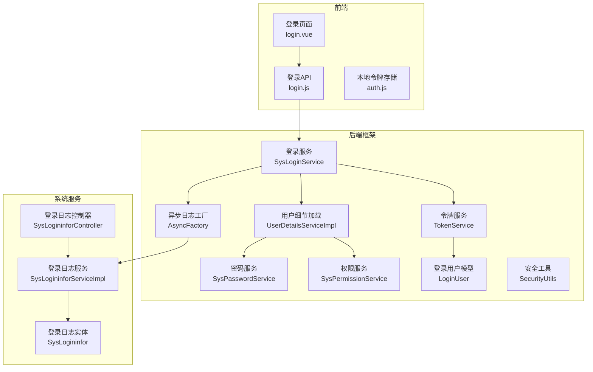
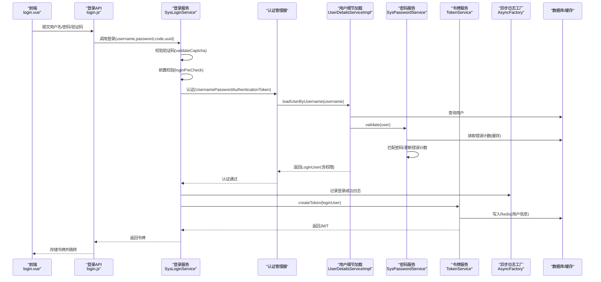
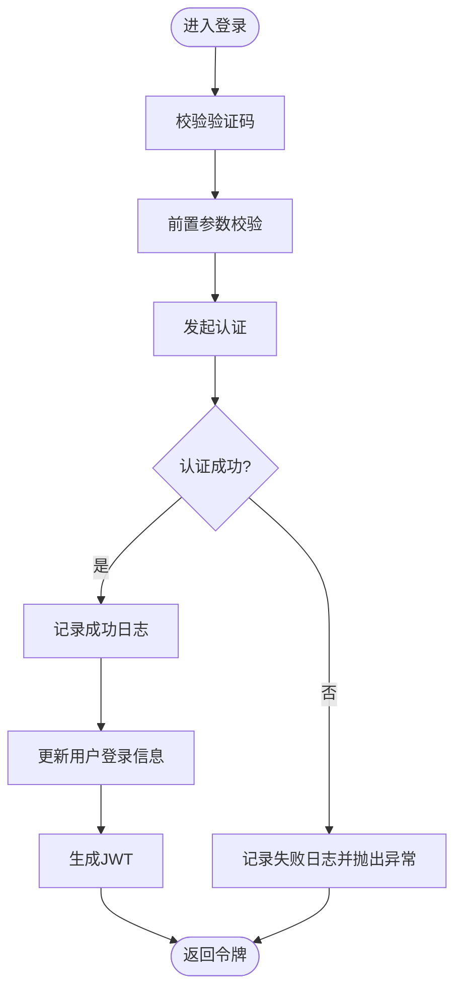
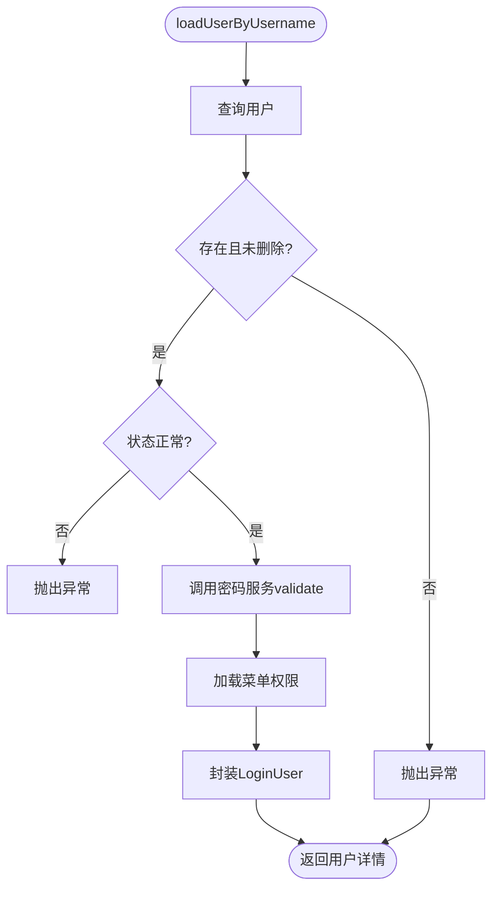
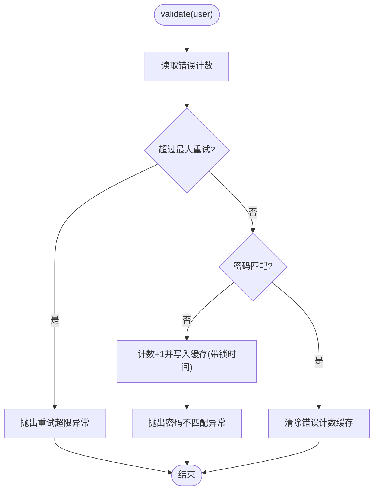
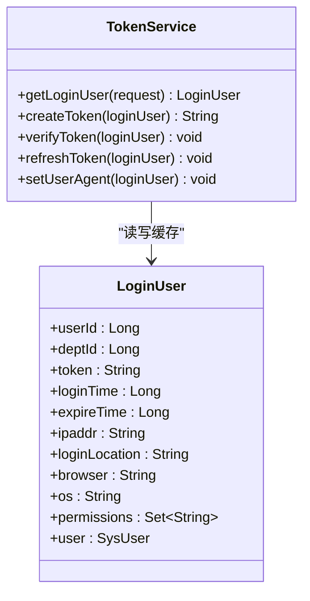
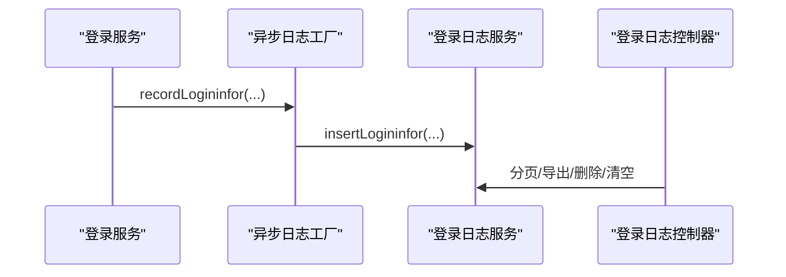
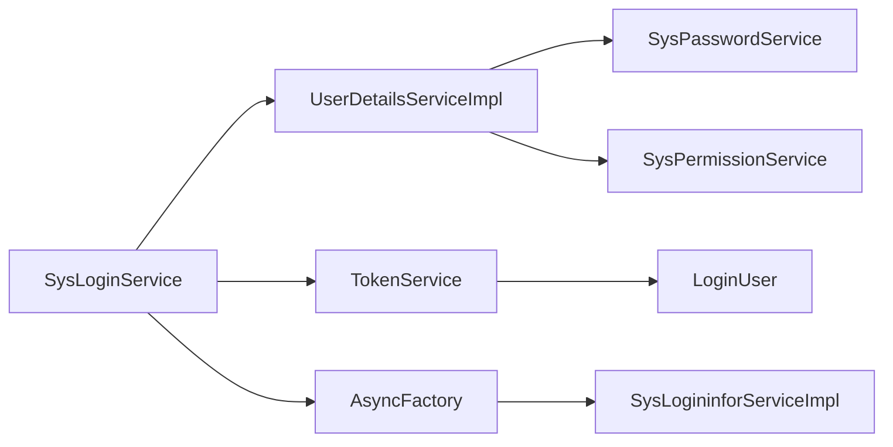

# 用户认证流程

<cite>
**本文引用的文件**
- [SysLoginService.java](file://ruoyi-framework/src/main/java/com/ruoyi/framework/web/service/SysLoginService.java)
- [UserDetailsServiceImpl.java](file://ruoyi-framework/src/main/java/com/ruoyi/framework/web/service/UserDetailsServiceImpl.java)
- [SysPasswordService.java](file://ruoyi-framework/src/main/java/com/ruoyi/framework/web/service/SysPasswordService.java)
- [TokenService.java](file://ruoyi-framework/src/main/java/com/ruoyi/framework/web/service/TokenService.java)
- [SysPermissionService.java](file://ruoyi-framework/src/main/java/com/ruoyi/framework/web/service/SysPermissionService.java)
- [LoginUser.java](file://ruoyi-common/src/main/java/com/ruoyi/common/core/domain/model/LoginUser.java)
- [SecurityUtils.java](file://ruoyi-common/src/main/java/com/ruoyi/common/utils/SecurityUtils.java)
- [AsyncFactory.java](file://ruoyi-framework/src/main/java/com/ruoyi/framework/manager/factory/AsyncFactory.java)
- [SysLogininforController.java](file://ruoyi-admin/src/main/java/com/ruoyi/web/controller/monitor/SysLogininforController.java)
- [SysLogininforServiceImpl.java](file://ruoyi-system/src/main/java/com/ruoyi/system/service/impl/SysLogininforServiceImpl.java)
- [SysLogininfor.java](file://ruoyi-system/src/main/java/com/ruoyi/system/domain/SysLogininfor.java)
- [login.vue](file://ruoyi-ui/src/views/login.vue)
- [login.js](file://ruoyi-ui/src/api/login.js)
- [auth.js](file://ruoyi-ui/src/utils/auth.js)
- [CaptchaException.java](file://ruoyi-common/src/main/java/com/ruoyi/common/exception/user/CaptchaException.java)
- [CaptchaExpireException.java](file://ruoyi-common/src/main/java/com/ruoyi/common/exception/user/CaptchaExpireException.java)
- [UserPasswordRetryLimitExceedException.java](file://ruoyi-common/src/main/java/com/ruoyi/common/exception/user/UserPasswordRetryLimitExceedException.java)
</cite>

## 目录
1. [简介](#简介)
2. [项目结构](#项目结构)
3. [核心组件](#核心组件)
4. [架构总览](#架构总览)
5. [详细组件分析](#详细组件分析)
6. [依赖关系分析](#依赖关系分析)
7. [性能考量](#性能考量)
8. [故障排查指南](#故障排查指南)
9. [结论](#结论)
10. [附录](#附录)

## 简介
本文件面向“用户认证流程”的完整说明，覆盖从前端登录表单到后端鉴权与会话管理的全流程，包括用户名密码验证、验证码校验、登录成功处理、用户详情加载、账户状态检查、登录日志记录、密码加密存储、密码重试限制与账户锁定、权限加载与会话管理、异常处理与安全审计、性能优化与问题诊断等主题。

## 项目结构
围绕认证的关键模块分布如下：
- 前端：登录页面与API调用
- 后端框架：认证入口、用户细节加载、密码校验、权限加载、令牌签发与校验
- 系统服务：登录日志持久化与查询
- 工具与常量：安全工具、异步日志工厂、异常类型

**图表来源**
- [login.vue](file://ruoyi-ui/src/views/login.vue)
- [login.js](file://ruoyi-ui/src/api/login.js)
- [auth.js](file://ruoyi-ui/src/utils/auth.js)
- [SysLoginService.java](file://ruoyi-framework/src/main/java/com/ruoyi/framework/web/service/SysLoginService.java)
- [UserDetailsServiceImpl.java](file://ruoyi-framework/src/main/java/com/ruoyi/framework/web/service/UserDetailsServiceImpl.java)
- [SysPasswordService.java](file://ruoyi-framework/src/main/java/com/ruoyi/framework/web/service/SysPasswordService.java)
- [SysPermissionService.java](file://ruoyi-framework/src/main/java/com/ruoyi/framework/web/service/SysPermissionService.java)
- [TokenService.java](file://ruoyi-framework/src/main/java/com/ruoyi/framework/web/service/TokenService.java)
- [LoginUser.java](file://ruoyi-common/src/main/java/com/ruoyi/common/core/domain/model/LoginUser.java)
- [SecurityUtils.java](file://ruoyi-common/src/main/java/com/ruoyi/common/utils/SecurityUtils.java)
- [AsyncFactory.java](file://ruoyi-framework/src/main/java/com/ruoyi/framework/manager/factory/AsyncFactory.java)
- [SysLogininforController.java](file://ruoyi-admin/src/main/java/com/ruoyi/web/controller/monitor/SysLogininforController.java)
- [SysLogininforServiceImpl.java](file://ruoyi-system/src/main/java/com/ruoyi/system/service/impl/SysLogininforServiceImpl.java)
- [SysLogininfor.java](file://ruoyi-system/src/main/java/com/ruoyi/system/domain/SysLogininfor.java)

**章节来源**
- [login.vue](file://ruoyi-ui/src/views/login.vue)
- [login.js](file://ruoyi-ui/src/api/login.js)
- [auth.js](file://ruoyi-ui/src/utils/auth.js)
- [SysLoginService.java](file://ruoyi-framework/src/main/java/com/ruoyi/framework/web/service/SysLoginService.java)
- [UserDetailsServiceImpl.java](file://ruoyi-framework/src/main/java/com/ruoyi/framework/web/service/UserDetailsServiceImpl.java)
- [SysPasswordService.java](file://ruoyi-framework/src/main/java/com/ruoyi/framework/web/service/SysPasswordService.java)
- [SysPermissionService.java](file://ruoyi-framework/src/main/java/com/ruoyi/framework/web/service/SysPermissionService.java)
- [TokenService.java](file://ruoyi-framework/src/main/java/com/ruoyi/framework/web/service/TokenService.java)
- [LoginUser.java](file://ruoyi-common/src/main/java/com/ruoyi/common/core/domain/model/LoginUser.java)
- [SecurityUtils.java](file://ruoyi-common/src/main/java/com/ruoyi/common/utils/SecurityUtils.java)
- [AsyncFactory.java](file://ruoyi-framework/src/main/java/com/ruoyi/framework/manager/factory/AsyncFactory.java)
- [SysLogininforController.java](file://ruoyi-admin/src/main/java/com/ruoyi/web/controller/monitor/SysLogininforController.java)
- [SysLogininforServiceImpl.java](file://ruoyi-system/src/main/java/com/ruoyi/system/service/impl/SysLogininforServiceImpl.java)
- [SysLogininfor.java](file://ruoyi-system/src/main/java/com/ruoyi/system/domain/SysLogininfor.java)

## 核心组件
- 登录服务：负责验证码校验、前置参数校验、调用Spring Security认证、记录登录日志、生成JWT令牌
- 用户细节加载：按用户名查询用户、状态校验、密码校验、权限加载
- 密码服务：密码匹配、错误计数与锁定、重试上限控制
- 权限服务：基于角色与菜单的权限集计算
- 令牌服务：JWT签发、刷新、用户代理与地理位置填充、Redis缓存
- 登录日志：异步记录登录行为、支持导出与清理
- 前端登录：验证码获取、表单校验、提交登录、本地令牌存储

**章节来源**
- [SysLoginService.java](file://ruoyi-framework/src/main/java/com/ruoyi/framework/web/service/SysLoginService.java)
- [UserDetailsServiceImpl.java](file://ruoyi-framework/src/main/java/com/ruoyi/framework/web/service/UserDetailsServiceImpl.java)
- [SysPasswordService.java](file://ruoyi-framework/src/main/java/com/ruoyi/framework/web/service/SysPasswordService.java)
- [SysPermissionService.java](file://ruoyi-framework/src/main/java/com/ruoyi/framework/web/service/SysPermissionService.java)
- [TokenService.java](file://ruoyi-framework/src/main/java/com/ruoyi/framework/web/service/TokenService.java)
- [AsyncFactory.java](file://ruoyi-framework/src/main/java/com/ruoyi/framework/manager/factory/AsyncFactory.java)
- [login.vue](file://ruoyi-ui/src/views/login.vue)
- [login.js](file://ruoyi-ui/src/api/login.js)

## 架构总览
下图展示了从用户输入到登录成功的端到端流程，包括异常路径与审计记录。

**图表来源**
- [login.vue](file://ruoyi-ui/src/views/login.vue)
- [login.js](file://ruoyi-ui/src/api/login.js)
- [SysLoginService.java](file://ruoyi-framework/src/main/java/com/ruoyi/framework/web/service/SysLoginService.java)
- [UserDetailsServiceImpl.java](file://ruoyi-framework/src/main/java/com/ruoyi/framework/web/service/UserDetailsServiceImpl.java)
- [SysPasswordService.java](file://ruoyi-framework/src/main/java/com/ruoyi/framework/web/service/SysPasswordService.java)
- [TokenService.java](file://ruoyi-framework/src/main/java/com/ruoyi/framework/web/service/TokenService.java)
- [AsyncFactory.java](file://ruoyi-framework/src/main/java/com/ruoyi/framework/manager/factory/AsyncFactory.java)

## 详细组件分析

### 登录服务（SysLoginService）
- 职责
  - 验证码校验：读取Redis中的验证码并比对，过期与不匹配抛出对应异常
  - 前置校验：用户名/密码长度范围校验、黑名单IP拦截
  - 调用认证：构造认证令牌并委托Spring Security完成认证
  - 成功处理：记录登录日志、更新用户最近登录信息、生成JWT
- 关键点
  - 使用异步工厂记录登录日志，区分成功与失败
  - 清理认证上下文，避免线程污染
  - 通过配置开关控制验证码启用

**图表来源**
- [SysLoginService.java](file://ruoyi-framework/src/main/java/com/ruoyi/framework/web/service/SysLoginService.java)
- [AsyncFactory.java](file://ruoyi-framework/src/main/java/com/ruoyi/framework/manager/factory/AsyncFactory.java)

**章节来源**
- [SysLoginService.java](file://ruoyi-framework/src/main/java/com/ruoyi/framework/web/service/SysLoginService.java)
- [CaptchaException.java](file://ruoyi-common/src/main/java/com/ruoyi/common/exception/user/CaptchaException.java)
- [CaptchaExpireException.java](file://ruoyi-common/src/main/java/com/ruoyi/common/exception/user/CaptchaExpireException.java)

### 用户细节加载（UserDetailsServiceImpl）
- 职责
  - 按用户名查询用户，不存在、已删除、已停用均抛出异常
  - 调用密码服务进行密码校验与重试限制
  - 加载菜单权限并封装为LoginUser
- 关键点
  - 严格的状态检查，确保账户可用性
  - 权限来源于权限服务的菜单权限聚合

**图表来源**
- [UserDetailsServiceImpl.java](file://ruoyi-framework/src/main/java/com/ruoyi/framework/web/service/UserDetailsServiceImpl.java)
- [SysPermissionService.java](file://ruoyi-framework/src/main/java/com/ruoyi/framework/web/service/SysPermissionService.java)
- [SysPasswordService.java](file://ruoyi-framework/src/main/java/com/ruoyi/framework/web/service/SysPasswordService.java)

**章节来源**
- [UserDetailsServiceImpl.java](file://ruoyi-framework/src/main/java/com/ruoyi/framework/web/service/UserDetailsServiceImpl.java)
- [SysPermissionService.java](file://ruoyi-framework/src/main/java/com/ruoyi/framework/web/service/SysPermissionService.java)

### 密码服务（SysPasswordService）
- 职责
  - 读取Redis中的错误计数，超过阈值则锁定
  - 匹配明文与加密密码，不匹配递增计数并设置锁定时间
  - 成功登录清除错误计数缓存
- 配置
  - 最大重试次数与锁定时间由配置注入
- 关键点
  - 使用BCrypt进行密码匹配
  - 使用统一的缓存键前缀

**图表来源**
- [SysPasswordService.java](file://ruoyi-framework/src/main/java/com/ruoyi/framework/web/service/SysPasswordService.java)
- [SecurityUtils.java](file://ruoyi-common/src/main/java/com/ruoyi/common/utils/SecurityUtils.java)

**章节来源**
- [SysPasswordService.java](file://ruoyi-framework/src/main/java/com/ruoyi/framework/web/service/SysPasswordService.java)
- [UserPasswordRetryLimitExceedException.java](file://ruoyi-common/src/main/java/com/ruoyi/common/exception/user/UserPasswordRetryLimitExceedException.java)
- [SecurityUtils.java](file://ruoyi-common/src/main/java/com/ruoyi/common/utils/SecurityUtils.java)

### 权限服务（SysPermissionService）
- 职责
  - 角色权限：管理员拥有全部角色权限
  - 菜单权限：管理员拥有通配权限；普通用户按角色与用户维度聚合
- 关键点
  - 多角色场景下为每个角色设置权限集合，便于后续数据权限匹配

**章节来源**
- [SysPermissionService.java](file://ruoyi-framework/src/main/java/com/ruoyi/framework/web/service/SysPermissionService.java)

### 令牌服务（TokenService）
- 职责
  - JWT签发：生成UUID作为令牌标识，放入JWT声明
  - 令牌缓存：以令牌UUID为键，将LoginUser写入Redis并设置过期
  - 用户代理与位置：解析UA、IP并填充登录地点、浏览器、操作系统
  - 令牌刷新：临近过期自动刷新缓存
- 关键点
  - 令牌头名称、密钥、过期时间可配置
  - 从令牌解析用户信息时，先解析JWT再从Redis读取LoginUser

**图表来源**
- [TokenService.java](file://ruoyi-framework/src/main/java/com/ruoyi/framework/web/service/TokenService.java)
- [LoginUser.java](file://ruoyi-common/src/main/java/com/ruoyi/common/core/domain/model/LoginUser.java)

**章节来源**
- [TokenService.java](file://ruoyi-framework/src/main/java/com/ruoyi/framework/web/service/TokenService.java)
- [LoginUser.java](file://ruoyi-common/src/main/java/com/ruoyi/common/core/domain/model/LoginUser.java)

### 登录日志与审计
- 异步记录：登录成功/失败均通过异步工厂记录到SysLogininfor
- 控制器能力：分页查询、导出、删除、清空、手动解锁（清除重试计数）
- 实体字段：用户名、IP、登录地点、浏览器、操作系统、消息、状态、时间

**图表来源**
- [AsyncFactory.java](file://ruoyi-framework/src/main/java/com/ruoyi/framework/manager/factory/AsyncFactory.java)
- [SysLogininforController.java](file://ruoyi-admin/src/main/java/com/ruoyi/web/controller/monitor/SysLogininforController.java)
- [SysLogininforServiceImpl.java](file://ruoyi-system/src/main/java/com/ruoyi/system/service/impl/SysLogininforServiceImpl.java)
- [SysLogininfor.java](file://ruoyi-system/src/main/java/com/ruoyi/system/domain/SysLogininfor.java)

**章节来源**
- [AsyncFactory.java](file://ruoyi-framework/src/main/java/com/ruoyi/framework/manager/factory/AsyncFactory.java)
- [SysLogininforController.java](file://ruoyi-admin/src/main/java/com/ruoyi/web/controller/monitor/SysLogininforController.java)
- [SysLogininforServiceImpl.java](file://ruoyi-system/src/main/java/com/ruoyi/system/service/impl/SysLogininforServiceImpl.java)
- [SysLogininfor.java](file://ruoyi-system/src/main/java/com/ruoyi/system/domain/SysLogininfor.java)

### 前端登录流程
- 表单：用户名、密码、验证码（可选）、记住密码
- 行为：提交时校验必填项，根据配置决定是否显示验证码；登录成功后写入本地令牌并跳转
- 验证码：点击更换图片，携带uuid参与服务端校验

**章节来源**
- [login.vue](file://ruoyi-ui/src/views/login.vue)
- [login.js](file://ruoyi-ui/src/api/login.js)
- [auth.js](file://ruoyi-ui/src/utils/auth.js)

## 依赖关系分析
- 组件内聚与耦合
  - 登录服务依赖认证管理器、用户服务、配置服务、Redis缓存、异步工厂
  - 用户细节加载依赖用户服务、密码服务、权限服务
  - 密码服务依赖Redis缓存与安全工具
  - 令牌服务依赖Redis缓存、UA/IP解析、JWT签名
  - 登录日志依赖异步工厂与持久化服务
- 外部依赖
  - Spring Security用于认证
  - Redis用于验证码与登录态缓存
  - JWT用于令牌签名与解析

**图表来源**
- [SysLoginService.java](file://ruoyi-framework/src/main/java/com/ruoyi/framework/web/service/SysLoginService.java)
- [UserDetailsServiceImpl.java](file://ruoyi-framework/src/main/java/com/ruoyi/framework/web/service/UserDetailsServiceImpl.java)
- [SysPasswordService.java](file://ruoyi-framework/src/main/java/com/ruoyi/framework/web/service/SysPasswordService.java)
- [SysPermissionService.java](file://ruoyi-framework/src/main/java/com/ruoyi/framework/web/service/SysPermissionService.java)
- [TokenService.java](file://ruoyi-framework/src/main/java/com/ruoyi/framework/web/service/TokenService.java)
- [AsyncFactory.java](file://ruoyi-framework/src/main/java/com/ruoyi/framework/manager/factory/AsyncFactory.java)
- [SysLogininforServiceImpl.java](file://ruoyi-system/src/main/java/com/ruoyi/system/service/impl/SysLogininforServiceImpl.java)

**章节来源**
- [SysLoginService.java](file://ruoyi-framework/src/main/java/com/ruoyi/framework/web/service/SysLoginService.java)
- [UserDetailsServiceImpl.java](file://ruoyi-framework/src/main/java/com/ruoyi/framework/web/service/UserDetailsServiceImpl.java)
- [SysPasswordService.java](file://ruoyi-framework/src/main/java/com/ruoyi/framework/web/service/SysPasswordService.java)
- [SysPermissionService.java](file://ruoyi-framework/src/main/java/com/ruoyi/framework/web/service/SysPermissionService.java)
- [TokenService.java](file://ruoyi-framework/src/main/java/com/ruoyi/framework/web/service/TokenService.java)
- [AsyncFactory.java](file://ruoyi-framework/src/main/java/com/ruoyi/framework/manager/factory/AsyncFactory.java)
- [SysLogininforServiceImpl.java](file://ruoyi-system/src/main/java/com/ruoyi/system/service/impl/SysLogininforServiceImpl.java)

## 性能考量
- 缓存优先：验证码与密码错误计数均使用Redis，降低数据库压力
- 异步日志：登录日志写入采用异步任务，避免阻塞主流程
- 令牌刷新：临近过期自动刷新，减少频繁重建登录态的开销
- 密码匹配：使用BCrypt，兼顾安全性与可接受的性能
- 建议
  - 合理设置令牌过期时间与刷新阈值
  - 对高并发场景增加Redis连接池与读写分离
  - 对登录接口开启必要的限流与防刷策略

[本节为通用建议，无需特定文件引用]

## 故障排查指南
- 常见异常与定位
  - 验证码过期/错误：检查验证码开关与Redis键是否存在
  - 密码错误/重试超限：查看错误计数缓存与锁定时间
  - 用户不存在/已停用/已删除：核对用户状态与配置
  - 黑名单IP：确认配置项与当前IP匹配
- 审计与恢复
  - 登录日志：通过控制器进行分页查询、导出、清理
  - 手动解锁：调用解锁接口清除重试计数
- 前端问题
  - 验证码不显示：确认后端返回的验证码开关与图片
  - 登录后无权限：检查权限服务是否正确加载菜单权限

**章节来源**
- [CaptchaExpireException.java](file://ruoyi-common/src/main/java/com/ruoyi/common/exception/user/CaptchaExpireException.java)
- [CaptchaException.java](file://ruoyi-common/src/main/java/com/ruoyi/common/exception/user/CaptchaException.java)
- [UserPasswordRetryLimitExceedException.java](file://ruoyi-common/src/main/java/com/ruoyi/common/exception/user/UserPasswordRetryLimitExceedException.java)
- [SysLogininforController.java](file://ruoyi-admin/src/main/java/com/ruoyi/web/controller/monitor/SysLogininforController.java)

## 结论
该认证体系以Spring Security为核心，结合Redis缓存与JWT令牌，实现了完整的登录验证、权限加载与会话管理流程。通过验证码、密码重试限制与黑名单等多层安全措施，配合异步日志与可视化审计，既保证了安全性也兼顾了可观测性与可维护性。

[本节为总结，无需特定文件引用]

## 附录
- 安全最佳实践
  - 密码加密：使用BCrypt，禁止明文存储
  - 令牌安全：设置合理过期时间与刷新阈值，避免长时间有效令牌
  - 输入校验：前后端共同校验，防止越界与注入
  - 审计留痕：登录、操作日志完整记录，保留至少90天
  - 资源保护：对敏感接口启用权限注解与数据范围控制

[本节为通用建议，无需特定文件引用]