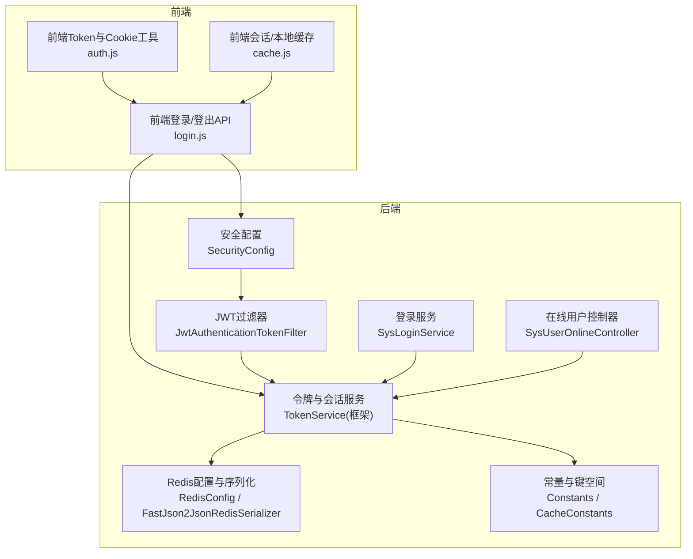
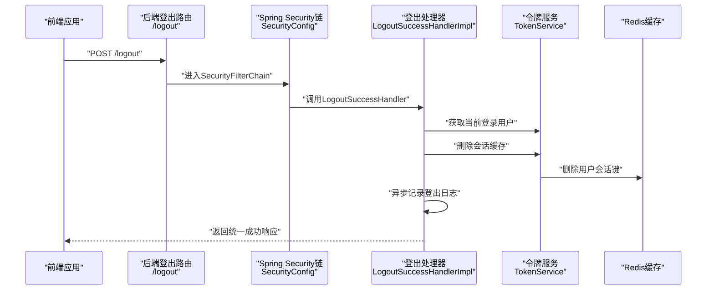
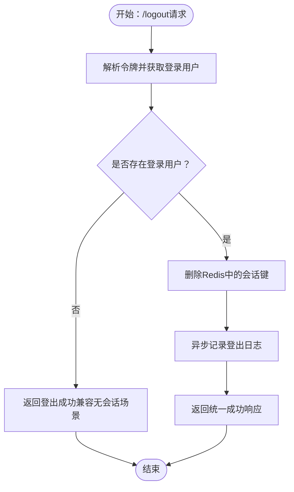
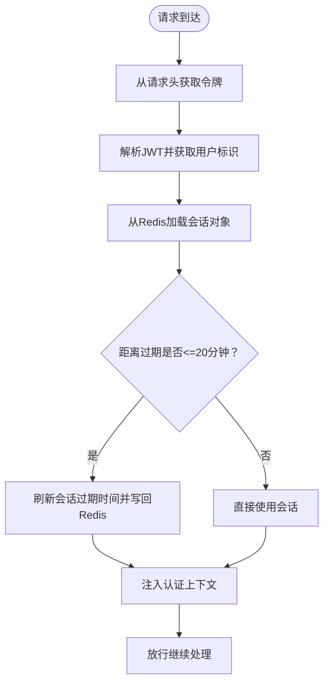
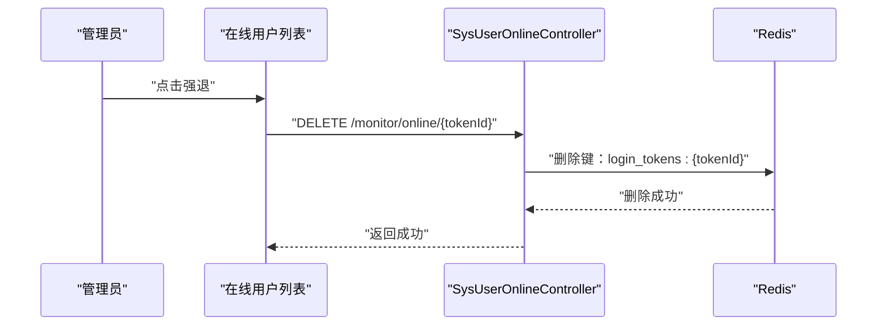
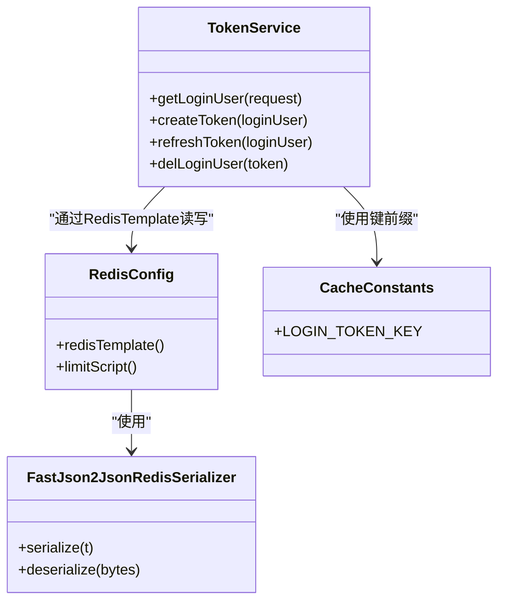
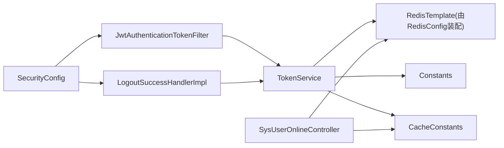

# 登出与会话管理

<cite>
**本文引用的文件**
- [LogoutSuccessHandlerImpl.java](file://ruoyi-framework/src/main/java/com/ruoyi/framework/security/handle/LogoutSuccessHandlerImpl.java)
- [TokenService.java（框架）](file://ruoyi-framework/src/main/java/com/ruoyi/framework/web/service/TokenService.java)
- [JwtAuthenticationTokenFilter.java](file://ruoyi-framework/src/main/java/com/ruoyi/framework/security/filter/JwtAuthenticationTokenFilter.java)
- [SecurityConfig.java](file://ruoyi-framework/src/main/java/com/ruoyi/framework/config/SecurityConfig.java)
- [RedisConfig.java](file://ruoyi-framework/src/main/java/com/ruoyi/framework/config/RedisConfig.java)
- [FastJson2JsonRedisSerializer.java](file://ruoyi-framework/src/main/java/com/ruoyi/framework/config/FastJson2JsonRedisSerializer.java)
- [Constants.java](file://ruoyi-common/src/main/java/com/ruoyi/common/constant/Constants.java)
- [CacheConstants.java](file://ruoyi-common/src/main/java/com/ruoyi/common/constant/CacheConstants.java)
- [SysUserOnlineController.java](file://ruoyi-admin/src/main/java/com/ruoyi/web/controller/monitor/SysUserOnlineController.java)
- [login.js（前端）](file://ruoyi-ui/src/api/login.js)
- [auth.js（前端）](file://ruoyi-ui/src/utils/auth.js)
- [cache.js（前端）](file://ruoyi-ui/src/plugins/cache.js)
- [application.yml（后端）](file://ruoyi-admin/src/main/resources/application.yml)
- [SysLoginService.java](file://ruoyi-framework/src/main/java/com/ruoyi/framework/web/service/SysLoginService.java)
</cite>

## 目录
1. [简介](#简介)
2. [项目结构](#项目结构)
3. [核心组件](#核心组件)
4. [架构总览](#架构总览)
5. [详细组件分析](#详细组件分析)
6. [依赖关系分析](#依赖关系分析)
7. [性能考量](#性能考量)
8. [故障排查指南](#故障排查指南)
9. [结论](#结论)
10. [附录](#附录)

## 简介
本文件聚焦“登出与会话管理”，系统性阐述用户登出流程（会话销毁、令牌清除、权限清理）、会话超时与续期机制、并发会话控制与强制下线、Redis 会话存储与持久化、分布式会话一致性、登出成功与失败处理及异常恢复、配置参数与安全策略、性能优化与问题排查实践。文档面向前后端开发者与运维工程师，既提供代码级分析，也给出可视化图示与实操建议。

## 项目结构
围绕会话与登出的关键代码分布如下：
- 后端安全与会话
  - 安全配置与登出处理器：SecurityConfig、LogoutSuccessHandlerImpl
  - 会话与令牌服务：TokenService（框架）、JwtAuthenticationTokenFilter
  - Redis 序列化与模板：RedisConfig、FastJson2JsonRedisSerializer
  - 常量与键空间：Constants、CacheConstants
  - 登录流程与会话写入：SysLoginService
- 后端监控与强制下线：SysUserOnlineController
- 前端登录/登出与本地缓存：login.js、auth.js、cache.js
- 后端配置：application.yml（token 与 Redis）

图表来源
- [SecurityConfig.java:86-124](file://ruoyi-framework/src/main/java/com/ruoyi/framework/config/SecurityConfig.java#L86-L124)
- [JwtAuthenticationTokenFilter.java:25-44](file://ruoyi-framework/src/main/java/com/ruoyi/framework/security/filter/JwtAuthenticationTokenFilter.java#L25-L44)
- [TokenService.java（框架）:32-233](file://ruoyi-framework/src/main/java/com/ruoyi/framework/web/service/TokenService.java#L32-L233)
- [RedisConfig.java:24-41](file://ruoyi-framework/src/main/java/com/ruoyi/framework/config/RedisConfig.java#L24-L41)
- [FastJson2JsonRedisSerializer.java:17-52](file://ruoyi-framework/src/main/java/com/ruoyi/framework/config/FastJson2JsonRedisSerializer.java#L17-L52)
- [Constants.java:100-121](file://ruoyi-common/src/main/java/com/ruoyi/common/constant/Constants.java#L100-L121)
- [CacheConstants.java:11-13](file://ruoyi-common/src/main/java/com/ruoyi/common/constant/CacheConstants.java#L11-L13)
- [SysLoginService.java:63-100](file://ruoyi-framework/src/main/java/com/ruoyi/framework/web/service/SysLoginService.java#L63-L100)
- [SysUserOnlineController.java:77-82](file://ruoyi-admin/src/main/java/com/ruoyi/web/controller/monitor/SysUserOnlineController.java#L77-L82)
- [login.js（前端）:43-48](file://ruoyi-ui/src/api/login.js#L43-L48)
- [auth.js（前端）:1-15](file://ruoyi-ui/src/utils/auth.js#L1-L15)
- [cache.js（前端）:1-79](file://ruoyi-ui/src/plugins/cache.js#L1-L79)

章节来源
- [SecurityConfig.java:86-124](file://ruoyi-framework/src/main/java/com/ruoyi/framework/config/SecurityConfig.java#L86-L124)
- [TokenService.java（框架）:32-233](file://ruoyi-framework/src/main/java/com/ruoyi/framework/web/service/TokenService.java#L32-L233)
- [RedisConfig.java:24-41](file://ruoyi-framework/src/main/java/com/ruoyi/framework/config/RedisConfig.java#L24-L41)
- [Constants.java:100-121](file://ruoyi-common/src/main/java/com/ruoyi/common/constant/Constants.java#L100-L121)
- [CacheConstants.java:11-13](file://ruoyi-common/src/main/java/com/ruoyi/common/constant/CacheConstants.java#L11-L13)
- [SysLoginService.java:63-100](file://ruoyi-framework/src/main/java/com/ruoyi/framework/web/service/SysLoginService.java#L63-L100)
- [SysUserOnlineController.java:77-82](file://ruoyi-admin/src/main/java/com/ruoyi/web/controller/monitor/SysUserOnlineController.java#L77-L82)
- [login.js（前端）:43-48](file://ruoyi-ui/src/api/login.js#L43-L48)
- [auth.js（前端）:1-15](file://ruoyi-ui/src/utils/auth.js#L1-L15)
- [cache.js（前端）:1-79](file://ruoyi-ui/src/plugins/cache.js#L1-L79)

## 核心组件
- 登出处理器：负责在登出成功时删除会话缓存并记录日志，返回统一结果。
- 令牌与会话服务：负责获取/创建/刷新/删除会话；基于 Redis 存储会话对象；解析 JWT 令牌并提取用户标识。
- JWT 过滤器：每次请求解析令牌、校验有效期并注入认证上下文。
- 安全配置：启用无状态会话、注册登出处理器、挂载 JWT 过滤器与 CORS 过滤器。
- Redis 配置：统一键值与对象序列化策略，保障会话对象的读写一致性。
- 在线用户与强制下线：提供列表查询与按令牌键强退能力。
- 前端：提供登出 API 调用、Token Cookie 管理、会话/本地缓存工具。

章节来源
- [LogoutSuccessHandlerImpl.java:28-53](file://ruoyi-framework/src/main/java/com/ruoyi/framework/security/handle/LogoutSuccessHandlerImpl.java#L28-L53)
- [TokenService.java（框架）:62-106](file://ruoyi-framework/src/main/java/com/ruoyi/framework/web/service/TokenService.java#L62-L106)
- [JwtAuthenticationTokenFilter.java:30-43](file://ruoyi-framework/src/main/java/com/ruoyi/framework/security/filter/JwtAuthenticationTokenFilter.java#L30-L43)
- [SecurityConfig.java:86-124](file://ruoyi-framework/src/main/java/com/ruoyi/framework/config/SecurityConfig.java#L86-L124)
- [RedisConfig.java:24-41](file://ruoyi-framework/src/main/java/com/ruoyi/framework/config/RedisConfig.java#L24-L41)
- [SysUserOnlineController.java:77-82](file://ruoyi-admin/src/main/java/com/ruoyi/web/controller/monitor/SysUserOnlineController.java#L77-L82)
- [login.js（前端）:43-48](file://ruoyi-ui/src/api/login.js#L43-L48)
- [auth.js（前端）:1-15](file://ruoyi-ui/src/utils/auth.js#L1-L15)
- [cache.js（前端）:1-79](file://ruoyi-ui/src/plugins/cache.js#L1-L79)

## 架构总览
下图展示从客户端发起登出到后端完成会话清理与日志记录的端到端流程，并标注关键组件交互。

图表来源
- [SecurityConfig.java:117-117](file://ruoyi-framework/src/main/java/com/ruoyi/framework/config/SecurityConfig.java#L117-L117)
- [LogoutSuccessHandlerImpl.java:38-51](file://ruoyi-framework/src/main/java/com/ruoyi/framework/security/handle/LogoutSuccessHandlerImpl.java#L38-L51)
- [TokenService.java（框架）:99-106](file://ruoyi-framework/src/main/java/com/ruoyi/framework/web/service/TokenService.java#L99-L106)
- [RedisConfig.java:24-41](file://ruoyi-framework/src/main/java/com/ruoyi/framework/config/RedisConfig.java#L24-L41)

## 详细组件分析

### 登出流程与会话销毁
- 登出入口：/logout，由 SecurityConfig 注册为登出路由，使用 LogoutSuccessHandlerImpl 处理。
- 处理步骤：
  - 从请求中解析当前令牌，获取 LoginUser。
  - 调用 TokenService.delLoginUser(token) 删除 Redis 中的会话对象。
  - 异步记录登出日志。
  - 返回统一 AjaxResult.success 的响应体。
- 前端调用：login.js 提供 logout 方法，向 /logout 发起 POST 请求；auth.js 管理 Cookie 中的 Token；cache.js 提供会话/本地缓存工具。

图表来源
- [LogoutSuccessHandlerImpl.java:38-51](file://ruoyi-framework/src/main/java/com/ruoyi/framework/security/handle/LogoutSuccessHandlerImpl.java#L38-L51)
- [TokenService.java（框架）:99-106](file://ruoyi-framework/src/main/java/com/ruoyi/framework/web/service/TokenService.java#L99-L106)
- [login.js（前端）:43-48](file://ruoyi-ui/src/api/login.js#L43-L48)
- [auth.js（前端）:13-15](file://ruoyi-ui/src/utils/auth.js#L13-L15)

章节来源
- [SecurityConfig.java:117-117](file://ruoyi-framework/src/main/java/com/ruoyi/framework/config/SecurityConfig.java#L117-L117)
- [LogoutSuccessHandlerImpl.java:38-51](file://ruoyi-framework/src/main/java/com/ruoyi/framework/security/handle/LogoutSuccessHandlerImpl.java#L38-L51)
- [TokenService.java（框架）:99-106](file://ruoyi-framework/src/main/java/com/ruoyi/framework/web/service/TokenService.java#L99-L106)
- [login.js（前端）:43-48](file://ruoyi-ui/src/api/login.js#L43-L48)
- [auth.js（前端）:13-15](file://ruoyi-ui/src/utils/auth.js#L13-L15)

### 会话超时与续期机制
- 令牌有效期：由配置项 token.expireTime 决定（默认 30 分钟）。
- 续期策略：JwtAuthenticationTokenFilter 在每次请求时，若会话剩余有效期小于 20 分钟，调用 TokenService.verifyToken 刷新 Redis 中的会话过期时间。
- 令牌签发与解析：TokenService.createToken 生成 JWT；parseToken 解析并校验签名；getUsernameFromToken 提取用户名。

图表来源
- [JwtAuthenticationTokenFilter.java:34-41](file://ruoyi-framework/src/main/java/com/ruoyi/framework/security/filter/JwtAuthenticationTokenFilter.java#L34-L41)
- [TokenService.java（框架）:133-155](file://ruoyi-framework/src/main/java/com/ruoyi/framework/web/service/TokenService.java#L133-L155)
- [application.yml（后端）:95-102](file://ruoyi-admin/src/main/resources/application.yml#L95-L102)

章节来源
- [JwtAuthenticationTokenFilter.java:34-41](file://ruoyi-framework/src/main/java/com/ruoyi/framework/security/filter/JwtAuthenticationTokenFilter.java#L34-L41)
- [TokenService.java（框架）:133-155](file://ruoyi-framework/src/main/java/com/ruoyi/framework/web/service/TokenService.java#L133-L155)
- [application.yml（后端）:95-102](file://ruoyi-admin/src/main/resources/application.yml#L95-L102)

### 并发会话控制与强制下线
- 并发控制：当前实现未显式限制同一账号的并发会话数量，会话以令牌维度存储于 Redis，不同令牌即视为不同会话。
- 强制下线：管理员可通过“在线用户”页面选择某会话并执行“强退”。后端根据 tokenId 拼接 Redis 键并删除对应会话对象，立即使该会话失效。

图表来源
- [SysUserOnlineController.java:77-82](file://ruoyi-admin/src/main/java/com/ruoyi/web/controller/monitor/SysUserOnlineController.java#L77-L82)
- [CacheConstants.java:11-13](file://ruoyi-common/src/main/java/com/ruoyi/common/constant/CacheConstants.java#L11-L13)

章节来源
- [SysUserOnlineController.java:77-82](file://ruoyi-admin/src/main/java/com/ruoyi/web/controller/monitor/SysUserOnlineController.java#L77-L82)
- [CacheConstants.java:11-13](file://ruoyi-common/src/main/java/com/ruoyi/common/constant/CacheConstants.java#L11-L13)

### Redis 会话存储策略与持久化
- 键空间：login_tokens:{uuid}，其中 uuid 为令牌标识。
- 序列化：RedisConfig 使用 FastJson2JsonRedisSerializer 作为对象序列化器，确保 LoginUser 可被正确序列化与反序列化。
- 过期策略：会话对象随令牌过期时间设置 TTL，续期时重新写入相同键并更新过期时间。
- 安全白名单：FastJson2JsonRedisSerializer 使用 JSON_WHITELIST_STR 限制可解析包名，降低反序列化风险。

图表来源
- [RedisConfig.java:24-41](file://ruoyi-framework/src/main/java/com/ruoyi/framework/config/RedisConfig.java#L24-L41)
- [FastJson2JsonRedisSerializer.java:17-52](file://ruoyi-framework/src/main/java/com/ruoyi/framework/config/FastJson2JsonRedisSerializer.java#L17-L52)
- [TokenService.java（框架）:62-155](file://ruoyi-framework/src/main/java/com/ruoyi/framework/web/service/TokenService.java#L62-L155)
- [CacheConstants.java:11-13](file://ruoyi-common/src/main/java/com/ruoyi/common/constant/CacheConstants.java#L11-L13)

章节来源
- [RedisConfig.java:24-41](file://ruoyi-framework/src/main/java/com/ruoyi/framework/config/RedisConfig.java#L24-L41)
- [FastJson2JsonRedisSerializer.java:17-52](file://ruoyi-framework/src/main/java/com/ruoyi/framework/config/FastJson2JsonRedisSerializer.java#L17-L52)
- [TokenService.java（框架）:62-155](file://ruoyi-framework/src/main/java/com/ruoyi/framework/web/service/TokenService.java#L62-L155)
- [CacheConstants.java:11-13](file://ruoyi-common/src/main/java/com/ruoyi/common/constant/CacheConstants.java#L11-L13)

### 登录与会话写入
- 登录流程：SysLoginService.login 完成验证码校验、前置校验、认证、记录登录日志，最终调用 TokenService.createToken 生成令牌并写入 Redis。
- 会话写入：TokenService.refreshToken 将 LoginUser 以键 login_tokens:{token} 写入 Redis，并设置过期时间。

章节来源
- [SysLoginService.java:63-100](file://ruoyi-framework/src/main/java/com/ruoyi/framework/web/service/SysLoginService.java#L63-L100)
- [TokenService.java（框架）:148-155](file://ruoyi-framework/src/main/java/com/ruoyi/framework/web/service/TokenService.java#L148-L155)

### 前端登出与本地清理
- 登出 API：login.js 调用 /logout。
- Token 清理：auth.js 移除 Cookie 中的 Token。
- 会话/本地缓存：cache.js 提供 sessionStorage/localStorage 工具，可在登出后主动清理。

章节来源
- [login.js（前端）:43-48](file://ruoyi-ui/src/api/login.js#L43-L48)
- [auth.js（前端）:13-15](file://ruoyi-ui/src/utils/auth.js#L13-L15)
- [cache.js（前端）:1-79](file://ruoyi-ui/src/plugins/cache.js#L1-L79)

## 依赖关系分析
- 组件耦合
  - SecurityConfig 依赖 LogoutSuccessHandlerImpl、JwtAuthenticationTokenFilter、CorsFilter。
  - JwtAuthenticationTokenFilter 依赖 TokenService。
  - TokenService 依赖 RedisTemplate（由 RedisConfig 提供）、Constants、CacheConstants。
  - LogoutSuccessHandlerImpl 依赖 TokenService 与异步日志工厂。
  - SysUserOnlineController 依赖 RedisCache 与 CacheConstants。
- 外部依赖
  - Redis：用于会话存储与过期控制。
  - Spring Security：无状态会话、登出链路、异常处理。
  - JWT：令牌签发与解析。

图表来源
- [SecurityConfig.java:86-124](file://ruoyi-framework/src/main/java/com/ruoyi/framework/config/SecurityConfig.java#L86-L124)
- [LogoutSuccessHandlerImpl.java:28-53](file://ruoyi-framework/src/main/java/com/ruoyi/framework/security/handle/LogoutSuccessHandlerImpl.java#L28-L53)
- [JwtAuthenticationTokenFilter.java:25-44](file://ruoyi-framework/src/main/java/com/ruoyi/framework/security/filter/JwtAuthenticationTokenFilter.java#L25-L44)
- [TokenService.java（框架）:32-233](file://ruoyi-framework/src/main/java/com/ruoyi/framework/web/service/TokenService.java#L32-L233)
- [RedisConfig.java:24-41](file://ruoyi-framework/src/main/java/com/ruoyi/framework/config/RedisConfig.java#L24-L41)
- [CacheConstants.java:11-13](file://ruoyi-common/src/main/java/com/ruoyi/common/constant/CacheConstants.java#L11-L13)
- [SysUserOnlineController.java:77-82](file://ruoyi-admin/src/main/java/com/ruoyi/web/controller/monitor/SysUserOnlineController.java#L77-L82)

章节来源
- [SecurityConfig.java:86-124](file://ruoyi-framework/src/main/java/com/ruoyi/framework/config/SecurityConfig.java#L86-L124)
- [TokenService.java（框架）:32-233](file://ruoyi-framework/src/main/java/com/ruoyi/framework/web/service/TokenService.java#L32-L233)
- [RedisConfig.java:24-41](file://ruoyi-framework/src/main/java/com/ruoyi/framework/config/RedisConfig.java#L24-L41)
- [CacheConstants.java:11-13](file://ruoyi-common/src/main/java/com/ruoyi/common/constant/CacheConstants.java#L11-L13)
- [SysUserOnlineController.java:77-82](file://ruoyi-admin/src/main/java/com/ruoyi/web/controller/monitor/SysUserOnlineController.java#L77-L82)

## 性能考量
- 无状态会话：SecurityConfig 设置 SessionCreationPolicy.STATELESS，避免服务器端会话粘滞，提升横向扩展能力。
- Redis 序列化：FastJson2JsonRedisSerializer 减少序列化开销，配合 StringRedisSerializer 优化键空间存储。
- 续期阈值：20 分钟阈值减少频繁续期带来的写放大，平衡用户体验与性能。
- 异步日志：登出日志通过异步任务提交，避免阻塞主流程。
- 建议
  - 合理设置 token.expireTime 与 Redis 连接池参数，结合压测评估峰值 QPS。
  - 对高频续期场景可考虑批量续期或合并写入策略（需评估一致性）。

章节来源
- [SecurityConfig.java:98-98](file://ruoyi-framework/src/main/java/com/ruoyi/framework/config/SecurityConfig.java#L98-L98)
- [RedisConfig.java:24-41](file://ruoyi-framework/src/main/java/com/ruoyi/framework/config/RedisConfig.java#L24-L41)
- [TokenService.java（框架）:133-155](file://ruoyi-framework/src/main/java/com/ruoyi/framework/web/service/TokenService.java#L133-L155)
- [application.yml（后端）:95-102](file://ruoyi-admin/src/main/resources/application.yml#L95-L102)

## 故障排查指南
- 登出无效或仍可访问
  - 检查 /logout 是否命中 SecurityConfig 的登出路由。
  - 确认 LogoutSuccessHandlerImpl 是否成功删除 Redis 中 login_tokens:{token}。
  - 核对前端是否移除了 Cookie 中的 Token。
- 会话未续期
  - 检查 JwtAuthenticationTokenFilter 是否正确解析令牌并调用 verifyToken。
  - 确认 Redis 中对应键的 TTL 是否更新。
- 强制下线不生效
  - 确认 SysUserOnlineController 删除的键格式与 CacheConstants.LOGIN_TOKEN_KEY 一致。
  - 检查 Redis 中是否存在 login_tokens:{tokenId}。
- Redis 连接/序列化异常
  - 检查 RedisConfig 的序列化器配置与 FastJson2JsonRedisSerializer 白名单。
  - 关注序列化/反序列化报错与键空间命名规范。

章节来源
- [SecurityConfig.java:117-117](file://ruoyi-framework/src/main/java/com/ruoyi/framework/config/SecurityConfig.java#L117-L117)
- [LogoutSuccessHandlerImpl.java:38-51](file://ruoyi-framework/src/main/java/com/ruoyi/framework/security/handle/LogoutSuccessHandlerImpl.java#L38-L51)
- [JwtAuthenticationTokenFilter.java:34-41](file://ruoyi-framework/src/main/java/com/ruoyi/framework/security/filter/JwtAuthenticationTokenFilter.java#L34-L41)
- [TokenService.java（框架）:99-155](file://ruoyi-framework/src/main/java/com/ruoyi/framework/web/service/TokenService.java#L99-L155)
- [SysUserOnlineController.java:77-82](file://ruoyi-admin/src/main/java/com/ruoyi/web/controller/monitor/SysUserOnlineController.java#L77-L82)
- [RedisConfig.java:24-41](file://ruoyi-framework/src/main/java/com/ruoyi/framework/config/RedisConfig.java#L24-L41)
- [FastJson2JsonRedisSerializer.java:17-52](file://ruoyi-framework/src/main/java/com/ruoyi/framework/config/FastJson2JsonRedisSerializer.java#L17-L52)
- [CacheConstants.java:11-13](file://ruoyi-common/src/main/java/com/ruoyi/common/constant/CacheConstants.java#L11-L13)

## 结论
本项目采用“JWT + Redis 会话存储 + 无状态会话”的组合方案，实现了简洁高效的登出与会话管理：登出时删除 Redis 会话并记录日志；请求时自动续期会话；管理员可按令牌键进行强制下线。通过合理的配置与序列化策略，系统具备良好的扩展性与安全性。建议在生产环境中结合压测与监控持续优化 Redis 连接池与令牌过期策略，并完善登出失败回滚与异常恢复机制。

## 附录

### 会话配置参数与安全策略
- token.header：令牌请求头键名（默认 Authorization）。
- token.secret：JWT 签名密钥。
- token.expireTime：令牌有效期（分钟，默认 30）。
- Redis 连接与池化：host、port、database、password、timeout、lettuce.pool.*。
- 安全策略：无状态会话、CSRF 禁用、CORS 过滤器挂载、JWT 过滤器优先。

章节来源
- [application.yml（后端）:95-102](file://ruoyi-admin/src/main/resources/application.yml#L95-L102)
- [SecurityConfig.java:90-122](file://ruoyi-framework/src/main/java/com/ruoyi/framework/config/SecurityConfig.java#L90-L122)
- [RedisConfig.java:72-94](file://ruoyi-framework/src/main/java/com/ruoyi/framework/config/RedisConfig.java#L72-L94)