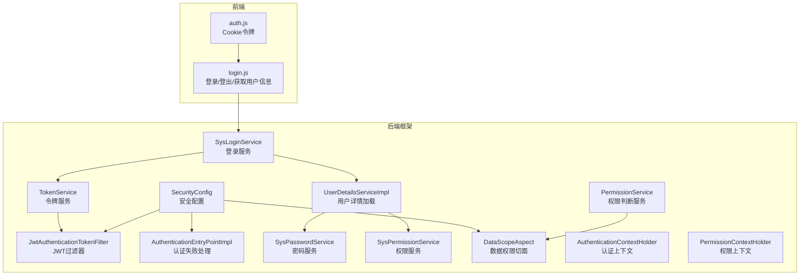
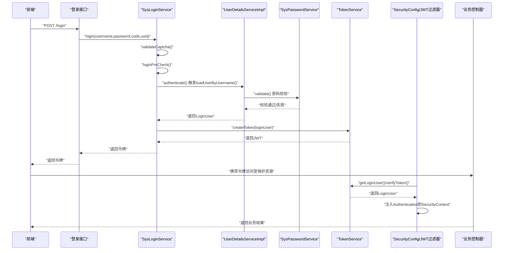
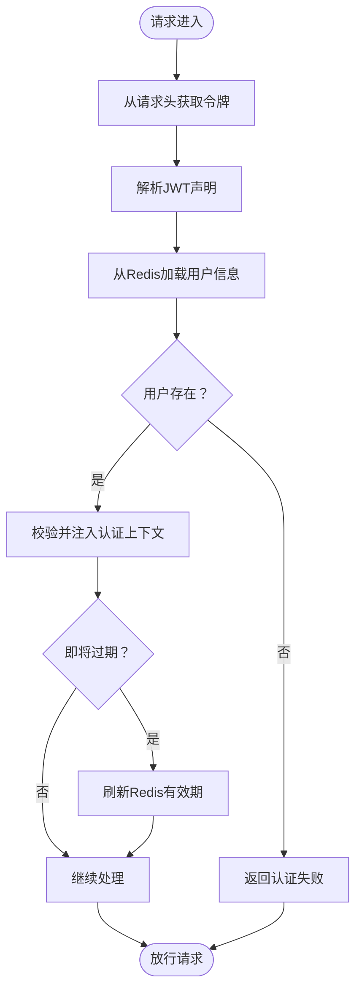
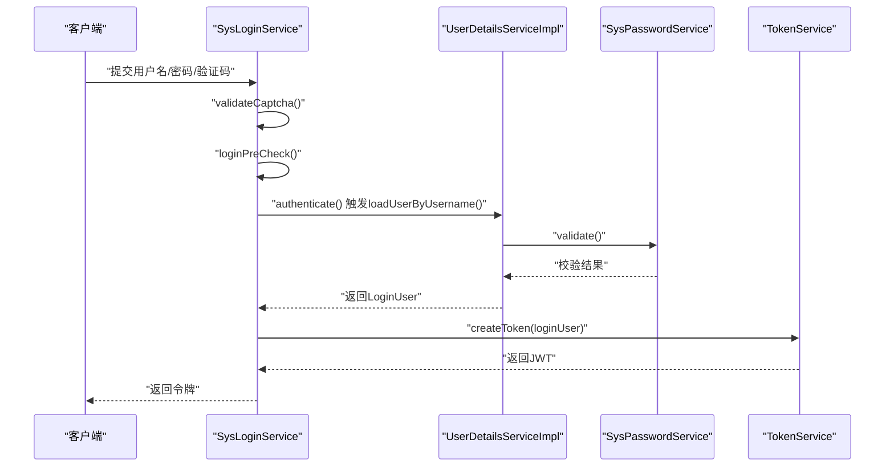
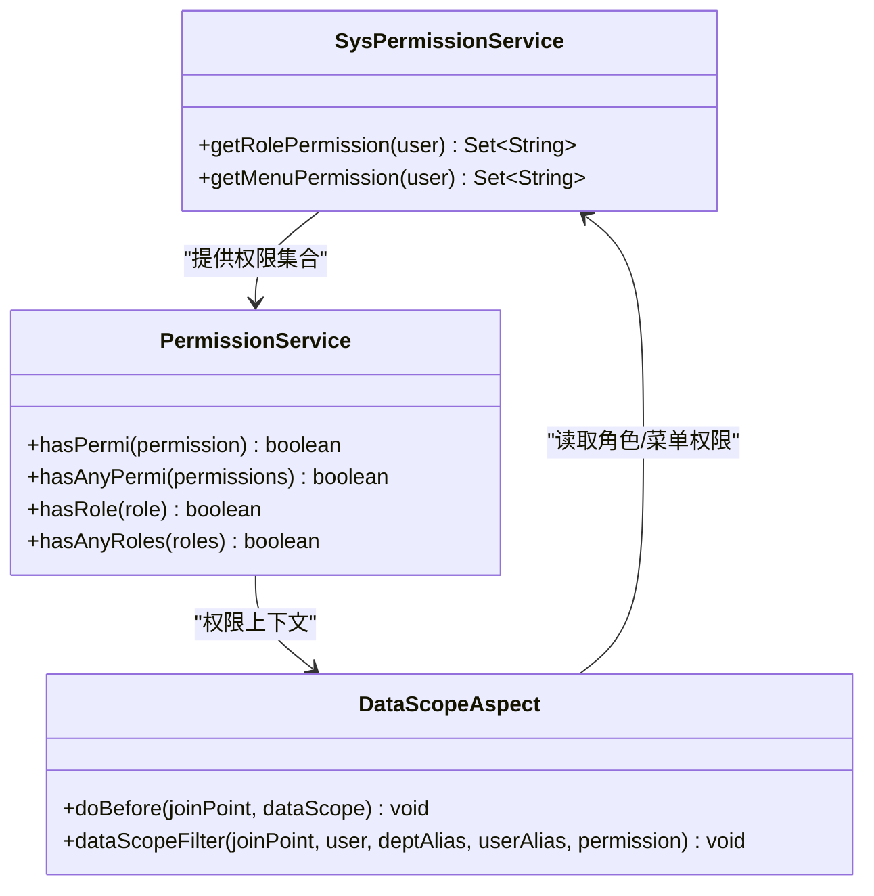
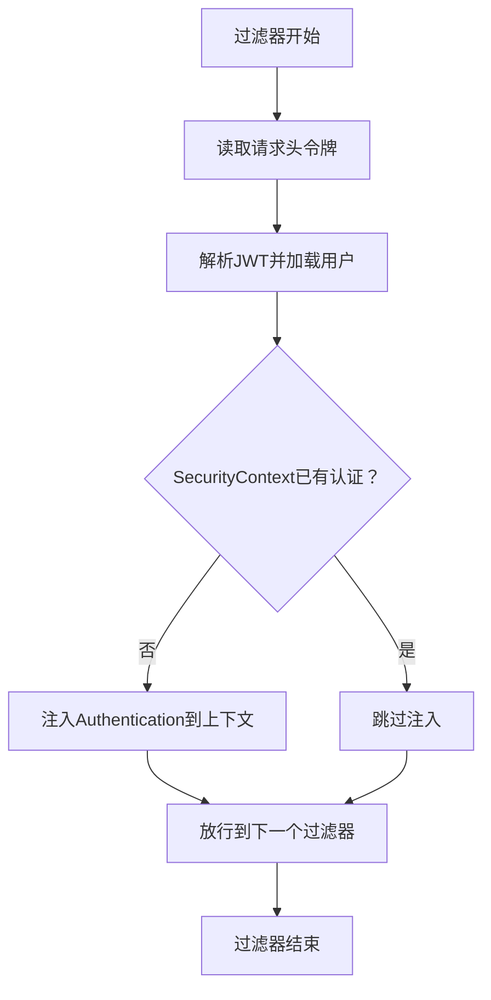
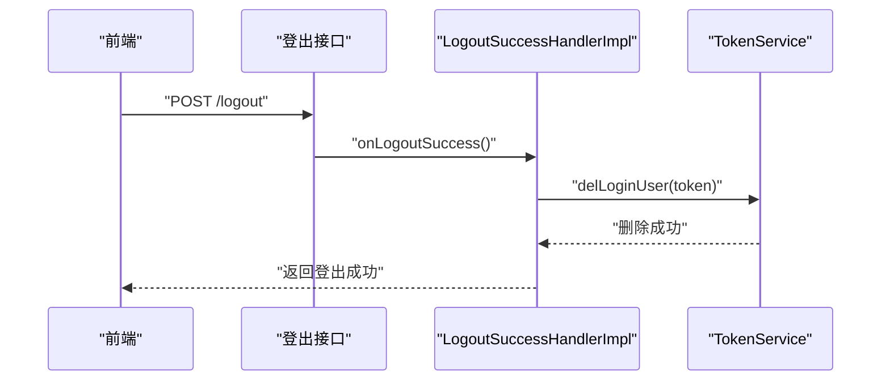
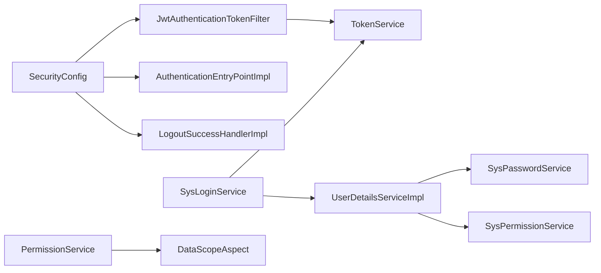

# 认证与授权

<cite>
**本文引用的文件**   
- [JwtAuthenticationTokenFilter.java](file://ruoyi-framework/src/main/java/com/ruoyi/framework/security/filter/JwtAuthenticationTokenFilter.java)
- [SecurityConfig.java](file://ruoyi-framework/src/main/java/com/ruoyi/framework/config/SecurityConfig.java)
- [AuthenticationEntryPointImpl.java](file://ruoyi-framework/src/main/java/com/ruoyi/framework/security/handle/AuthenticationEntryPointImpl.java)
- [LogoutSuccessHandlerImpl.java](file://ruoyi-framework/src/main/java/com/ruoyi/framework/security/handle/LogoutSuccessHandlerImpl.java)
- [TokenService.java](file://ruoyi-framework/src/main/java/com/ruoyi/framework/web/service/TokenService.java)
- [SysLoginService.java](file://ruoyi-framework/src/main/java/com/ruoyi/framework/web/service/SysLoginService.java)
- [SysPasswordService.java](file://ruoyi-framework/src/main/java/com/ruoyi/framework/web/service/SysPasswordService.java)
- [UserDetailsServiceImpl.java](file://ruoyi-framework/src/main/java/com/ruoyi/framework/web/service/UserDetailsServiceImpl.java)
- [SysPermissionService.java](file://ruoyi-framework/src/main/java/com/ruoyi/framework/web/service/SysPermissionService.java)
- [PermissionService.java](file://ruoyi-framework/src/main/java/com/ruoyi/framework/web/service/PermissionService.java)
- [DataScopeAspect.java](file://ruoyi-framework/src/main/java/com/ruoyi/framework/aspectj/DataScopeAspect.java)
- [AuthenticationContextHolder.java](file://ruoyi-framework/src/main/java/com/ruoyi/framework/security/context/AuthenticationContextHolder.java)
- [PermissionContextHolder.java](file://ruoyi-framework/src/main/java/com/ruoyi/framework/security/context/PermissionContextHolder.java)
- [application.yml](file://ruoyi-admin/src/main/resources/application.yml)
- [auth.js](file://ruoyi-ui/src/utils/auth.js)
- [login.js](file://ruoyi-ui/src/api/login.js)
</cite>

## 目录
1. [简介](#简介)
2. [项目结构](#项目结构)
3. [核心组件](#核心组件)
4. [架构总览](#架构总览)
5. [详细组件分析](#详细组件分析)
6. [依赖分析](#依赖分析)
7. [性能考虑](#性能考虑)
8. [故障排除指南](#故障排除指南)
9. [结论](#结论)
10. [附录](#附录)

## 简介
本文件面向港好住信息系统，系统性梳理并解释其认证与授权机制，重点覆盖：
- 基于 JWT 的令牌认证体系：令牌生成算法、有效期管理、刷新机制、失效处理策略
- 用户认证流程：登录验证、用户详情加载、权限解析、上下文存储
- 权限控制架构：基于角色的访问控制（RBAC）、菜单权限、按钮权限、数据权限
- 认证过滤器工作原理、权限上下文管理、登出处理
- 认证配置、令牌安全策略、权限缓存机制的最佳实践
- 认证异常处理、权限验证失败处理的故障排除指南

## 项目结构
围绕认证与授权的关键代码分布在后端框架模块与前端工具模块中：
- 后端框架层：Spring Security 配置、JWT 过滤器、认证入口、登出处理器、令牌服务、登录/密码/权限服务、权限上下文、数据权限切面
- 前端工具层：Cookie 令牌读写、登录/登出/获取用户信息 API 请求封装

**图表来源**
- [SecurityConfig.java:27-124](file://ruoyi-framework/src/main/java/com/ruoyi/framework/config/SecurityConfig.java#L27-L124)
- [JwtAuthenticationTokenFilter.java:25-44](file://ruoyi-framework/src/main/java/com/ruoyi/framework/security/filter/JwtAuthenticationTokenFilter.java#L25-L44)
- [AuthenticationEntryPointImpl.java:22-34](file://ruoyi-framework/src/main/java/com/ruoyi/framework/security/handle/AuthenticationEntryPointImpl.java#L22-L34)
- [SysLoginService.java:37-100](file://ruoyi-framework/src/main/java/com/ruoyi/framework/web/service/SysLoginService.java#L37-L100)
- [SysPasswordService.java:22-87](file://ruoyi-framework/src/main/java/com/ruoyi/framework/web/service/SysPasswordService.java#L22-L87)
- [UserDetailsServiceImpl.java:24-67](file://ruoyi-framework/src/main/java/com/ruoyi/framework/web/service/UserDetailsServiceImpl.java#L24-L67)
- [TokenService.java:32-233](file://ruoyi-framework/src/main/java/com/ruoyi/framework/web/service/TokenService.java#L32-L233)
- [SysPermissionService.java:22-89](file://ruoyi-framework/src/main/java/com/ruoyi/framework/web/service/SysPermissionService.java#L22-L89)
- [PermissionService.java:18-160](file://ruoyi-framework/src/main/java/com/ruoyi/framework/web/service/PermissionService.java#L18-L160)
- [DataScopeAspect.java:25-101](file://ruoyi-framework/src/main/java/com/ruoyi/framework/aspectj/DataScopeAspect.java#L25-L101)
- [auth.js:1-16](file://ruoyi-ui/src/utils/auth.js#L1-L16)
- [login.js:1-60](file://ruoyi-ui/src/api/login.js#L1-L60)

**章节来源**
- [SecurityConfig.java:27-124](file://ruoyi-framework/src/main/java/com/ruoyi/framework/config/SecurityConfig.java#L27-L124)
- [application.yml:95-102](file://ruoyi-admin/src/main/resources/application.yml#L95-L102)

## 核心组件
- 认证过滤器：在请求进入业务层前，从请求头提取令牌，解析用户信息，完成身份注入
- 安全配置：注册过滤器链、跨域过滤器、登出处理器、认证失败处理器、允许匿名访问的路径
- 令牌服务：负责令牌生成、解析、有效期校验与自动刷新、用户信息缓存
- 登录服务：验证码校验、登录前置校验、调用 Spring Security 完成认证、生成令牌
- 用户详情服务：按用户名加载用户、状态校验、密码校验、构建登录用户对象
- 密码服务：密码匹配、错误次数与锁定控制
- 权限服务：角色权限与菜单权限计算、权限字符串集合
- 权限判断服务：提供 hasPermi/hasAnyPermi/hasRole 等便捷判断
- 数据权限切面：根据角色数据权限范围动态拼接 SQL 过滤条件
- 上下文管理：认证上下文与权限上下文线程本地存储
- 前端工具：Cookie 存取令牌、登录/登出/获取用户信息 API

**章节来源**
- [JwtAuthenticationTokenFilter.java:25-44](file://ruoyi-framework/src/main/java/com/ruoyi/framework/security/filter/JwtAuthenticationTokenFilter.java#L25-L44)
- [SecurityConfig.java:27-124](file://ruoyi-framework/src/main/java/com/ruoyi/framework/config/SecurityConfig.java#L27-L124)
- [TokenService.java:32-233](file://ruoyi-framework/src/main/java/com/ruoyi/framework/web/service/TokenService.java#L32-L233)
- [SysLoginService.java:37-100](file://ruoyi-framework/src/main/java/com/ruoyi/framework/web/service/SysLoginService.java#L37-L100)
- [UserDetailsServiceImpl.java:24-67](file://ruoyi-framework/src/main/java/com/ruoyi/framework/web/service/UserDetailsServiceImpl.java#L24-L67)
- [SysPasswordService.java:22-87](file://ruoyi-framework/src/main/java/com/ruoyi/framework/web/service/SysPasswordService.java#L22-L87)
- [SysPermissionService.java:22-89](file://ruoyi-framework/src/main/java/com/ruoyi/framework/web/service/SysPermissionService.java#L22-L89)
- [PermissionService.java:18-160](file://ruoyi-framework/src/main/java/com/ruoyi/framework/web/service/PermissionService.java#L18-L160)
- [DataScopeAspect.java:25-101](file://ruoyi-framework/src/main/java/com/ruoyi/framework/aspectj/DataScopeAspect.java#L25-L101)
- [AuthenticationContextHolder.java:10-28](file://ruoyi-framework/src/main/java/com/ruoyi/framework/security/context/AuthenticationContextHolder.java#L10-L28)
- [PermissionContextHolder.java](file://ruoyi-framework/src/main/java/com/ruoyi/framework/security/context/PermissionContextHolder.java)

## 架构总览
认证与授权的整体流程如下：
- 前端通过登录接口提交用户名/密码/验证码，后端进行验证码与登录前置校验
- 使用 Spring Security 完成认证，加载用户详情并进行密码校验
- 认证成功后生成令牌，并将用户信息写入 Redis 缓存
- 请求到达时，JWT 过滤器从请求头解析令牌，校验并注入认证上下文
- 权限判断由权限服务与注解配合完成；数据权限通过切面动态注入过滤条件

**图表来源**
- [SysLoginService.java:63-100](file://ruoyi-framework/src/main/java/com/ruoyi/framework/web/service/SysLoginService.java#L63-L100)
- [UserDetailsServiceImpl.java:37-65](file://ruoyi-framework/src/main/java/com/ruoyi/framework/web/service/UserDetailsServiceImpl.java#L37-L65)
- [SysPasswordService.java:44-77](file://ruoyi-framework/src/main/java/com/ruoyi/framework/web/service/SysPasswordService.java#L44-L77)
- [TokenService.java:114-125](file://ruoyi-framework/src/main/java/com/ruoyi/framework/web/service/TokenService.java#L114-L125)
- [JwtAuthenticationTokenFilter.java:31-42](file://ruoyi-framework/src/main/java/com/ruoyi/framework/security/filter/JwtAuthenticationTokenFilter.java#L31-L42)
- [SecurityConfig.java:116-123](file://ruoyi-framework/src/main/java/com/ruoyi/framework/config/SecurityConfig.java#L116-L123)

## 详细组件分析

### 令牌认证与生命周期
- 令牌生成：使用 UUID 作为令牌标识，将标识放入 JWT 的声明中，使用对称密钥签名
- 令牌解析：从请求头读取令牌，解析声明，获取用户令牌标识，再从 Redis 中取出用户信息
- 有效期管理：令牌在 Redis 中以分钟为单位过期；服务端还维护了过期时间字段
- 刷新机制：当距离过期时间小于阈值时，自动刷新 Redis 缓存有效期
- 失效处理：登出时删除 Redis 中的用户缓存；认证失败统一返回未授权

**图表来源**
- [TokenService.java:62-83](file://ruoyi-framework/src/main/java/com/ruoyi/framework/web/service/TokenService.java#L62-L83)
- [TokenService.java:133-141](file://ruoyi-framework/src/main/java/com/ruoyi/framework/web/service/TokenService.java#L133-L141)
- [TokenService.java:148-155](file://ruoyi-framework/src/main/java/com/ruoyi/framework/web/service/TokenService.java#L148-L155)
- [JwtAuthenticationTokenFilter.java:31-42](file://ruoyi-framework/src/main/java/com/ruoyi/framework/security/filter/JwtAuthenticationTokenFilter.java#L31-L42)

**章节来源**
- [TokenService.java:32-233](file://ruoyi-framework/src/main/java/com/ruoyi/framework/web/service/TokenService.java#L32-L233)
- [JwtAuthenticationTokenFilter.java:25-44](file://ruoyi-framework/src/main/java/com/ruoyi/framework/security/filter/JwtAuthenticationTokenFilter.java#L25-L44)

### 登录验证与用户详情加载
- 登录流程：验证码校验、登录前置校验、Spring Security 认证、记录登录日志、生成令牌
- 用户详情加载：按用户名查询用户，校验状态与删除标记，执行密码校验，构建 LoginUser 并注入权限
- 密码校验：错误次数与锁定时间控制，匹配成功清除缓存

**图表来源**
- [SysLoginService.java:63-100](file://ruoyi-framework/src/main/java/com/ruoyi/framework/web/service/SysLoginService.java#L63-L100)
- [UserDetailsServiceImpl.java:37-65](file://ruoyi-framework/src/main/java/com/ruoyi/framework/web/service/UserDetailsServiceImpl.java#L37-L65)
- [SysPasswordService.java:44-77](file://ruoyi-framework/src/main/java/com/ruoyi/framework/web/service/SysPasswordService.java#L44-L77)
- [TokenService.java:114-125](file://ruoyi-framework/src/main/java/com/ruoyi/framework/web/service/TokenService.java#L114-L125)

**章节来源**
- [SysLoginService.java:37-177](file://ruoyi-framework/src/main/java/com/ruoyi/framework/web/service/SysLoginService.java#L37-L177)
- [UserDetailsServiceImpl.java:24-67](file://ruoyi-framework/src/main/java/com/ruoyi/framework/web/service/UserDetailsServiceImpl.java#L24-L67)
- [SysPasswordService.java:22-87](file://ruoyi-framework/src/main/java/com/ruoyi/framework/web/service/SysPasswordService.java#L22-L87)

### 权限控制架构（RBAC）
- 角色权限：管理员拥有所有角色；普通用户通过角色服务获取角色权限集合
- 菜单权限：管理员拥有通配权限；普通用户通过菜单服务获取菜单权限字符串集合
- 权限判断：提供 hasPermi/hasAnyPermi/hasRole 等便捷方法，支持“全部权限”快速匹配
- 数据权限：通过切面对业务方法进行拦截，依据角色数据权限范围动态拼接 SQL 过滤条件

**图表来源**
- [SysPermissionService.java:22-89](file://ruoyi-framework/src/main/java/com/ruoyi/framework/web/service/SysPermissionService.java#L22-L89)
- [PermissionService.java:18-160](file://ruoyi-framework/src/main/java/com/ruoyi/framework/web/service/PermissionService.java#L18-L160)
- [DataScopeAspect.java:25-101](file://ruoyi-framework/src/main/java/com/ruoyi/framework/aspectj/DataScopeAspect.java#L25-L101)

**章节来源**
- [SysPermissionService.java:22-89](file://ruoyi-framework/src/main/java/com/ruoyi/framework/web/service/SysPermissionService.java#L22-L89)
- [PermissionService.java:18-160](file://ruoyi-framework/src/main/java/com/ruoyi/framework/web/service/PermissionService.java#L18-L160)
- [DataScopeAspect.java:25-101](file://ruoyi-framework/src/main/java/com/ruoyi/framework/aspectj/DataScopeAspect.java#L25-L101)

### 认证过滤器与上下文管理
- 认证过滤器：从请求头读取令牌，解析用户信息，若上下文中无认证则注入 Authentication
- 上下文管理：提供认证上下文与权限上下文的线程本地存储，便于权限判断与数据权限切面使用

**图表来源**
- [JwtAuthenticationTokenFilter.java:31-42](file://ruoyi-framework/src/main/java/com/ruoyi/framework/security/filter/JwtAuthenticationTokenFilter.java#L31-L42)
- [AuthenticationContextHolder.java:10-28](file://ruoyi-framework/src/main/java/com/ruoyi/framework/security/context/AuthenticationContextHolder.java#L10-L28)
- [PermissionContextHolder.java](file://ruoyi-framework/src/main/java/com/ruoyi/framework/security/context/PermissionContextHolder.java)

**章节来源**
- [JwtAuthenticationTokenFilter.java:25-44](file://ruoyi-framework/src/main/java/com/ruoyi/framework/security/filter/JwtAuthenticationTokenFilter.java#L25-L44)
- [AuthenticationContextHolder.java:10-28](file://ruoyi-framework/src/main/java/com/ruoyi/framework/security/context/AuthenticationContextHolder.java#L10-L28)
- [PermissionContextHolder.java](file://ruoyi-framework/src/main/java/com/ruoyi/framework/security/context/PermissionContextHolder.java)

### 登出处理
- 登出流程：从请求中获取用户信息，删除 Redis 中的用户缓存，记录登出日志，返回成功响应

**图表来源**
- [LogoutSuccessHandlerImpl.java:28-53](file://ruoyi-framework/src/main/java/com/ruoyi/framework/security/handle/LogoutSuccessHandlerImpl.java#L28-L53)
- [TokenService.java:99-106](file://ruoyi-framework/src/main/java/com/ruoyi/framework/web/service/TokenService.java#L99-L106)

**章节来源**
- [LogoutSuccessHandlerImpl.java:28-53](file://ruoyi-framework/src/main/java/com/ruoyi/framework/security/handle/LogoutSuccessHandlerImpl.java#L28-L53)
- [TokenService.java:99-106](file://ruoyi-framework/src/main/java/com/ruoyi/framework/web/service/TokenService.java#L99-L106)

### 前端认证与交互
- 令牌存储：使用 Cookie 存储令牌键值
- 登录/登出/获取用户信息：封装通用请求方法，登录时关闭令牌头，登出时清空令牌

**章节来源**
- [auth.js:1-16](file://ruoyi-ui/src/utils/auth.js#L1-L16)
- [login.js:1-60](file://ruoyi-ui/src/api/login.js#L1-L60)

## 依赖分析
- 组件耦合
  - SecurityConfig 将 JwtAuthenticationTokenFilter、CorsFilter、LogoutFilter 组织到过滤器链
  - JwtAuthenticationTokenFilter 依赖 TokenService 完成令牌解析与注入
  - SysLoginService 依赖 UserDetailsServiceImpl、SysPasswordService、TokenService 完成登录全流程
  - 权限相关服务与切面相互协作，形成 RBAC 与数据权限控制闭环
- 外部依赖
  - Redis 用于令牌与用户信息缓存
  - JWT 用于令牌签名与解析
  - Spring Security 用于认证与授权基础设施

**图表来源**
- [SecurityConfig.java:27-124](file://ruoyi-framework/src/main/java/com/ruoyi/framework/config/SecurityConfig.java#L27-L124)
- [JwtAuthenticationTokenFilter.java:25-44](file://ruoyi-framework/src/main/java/com/ruoyi/framework/security/filter/JwtAuthenticationTokenFilter.java#L25-L44)
- [SysLoginService.java:37-100](file://ruoyi-framework/src/main/java/com/ruoyi/framework/web/service/SysLoginService.java#L37-L100)
- [UserDetailsServiceImpl.java:24-67](file://ruoyi-framework/src/main/java/com/ruoyi/framework/web/service/UserDetailsServiceImpl.java#L24-L67)
- [SysPasswordService.java:22-87](file://ruoyi-framework/src/main/java/com/ruoyi/framework/web/service/SysPasswordService.java#L22-L87)
- [SysPermissionService.java:22-89](file://ruoyi-framework/src/main/java/com/ruoyi/framework/web/service/SysPermissionService.java#L22-L89)
- [PermissionService.java:18-160](file://ruoyi-framework/src/main/java/com/ruoyi/framework/web/service/PermissionService.java#L18-L160)
- [DataScopeAspect.java:25-101](file://ruoyi-framework/src/main/java/com/ruoyi/framework/aspectj/DataScopeAspect.java#L25-L101)

**章节来源**
- [SecurityConfig.java:27-124](file://ruoyi-framework/src/main/java/com/ruoyi/framework/config/SecurityConfig.java#L27-L124)

## 性能考虑
- 令牌与用户信息缓存：Redis 缓存用户信息，避免重复查询数据库
- 令牌有效期刷新：临近过期自动刷新缓存，减少频繁重建用户信息
- 过滤器链优化：JWT 过滤器仅在必要时注入认证上下文，避免重复认证
- 数据权限切面：在业务方法执行前进行权限过滤，减少无效查询

[本节为通用建议，不直接分析具体文件]

## 故障排除指南
- 认证失败
  - 现象：返回未授权
  - 可能原因：令牌缺失/无效、用户不存在/已停用、密码错误
  - 处理：检查请求头令牌、确认用户状态、核对密码与验证码
- 令牌过期
  - 现象：请求被拒绝
  - 处理：前端重新登录获取新令牌；服务端会在即将过期时自动刷新缓存
- 登出后仍可访问
  - 现象：登出后仍可访问
  - 处理：确认登出接口已调用且 Redis 中用户缓存已被删除
- 权限判断失败
  - 现象：按钮/菜单不可见或接口报权限不足
  - 处理：检查角色与菜单权限配置、确认权限字符串正确、核对数据权限范围

**章节来源**
- [AuthenticationEntryPointImpl.java:22-34](file://ruoyi-framework/src/main/java/com/ruoyi/framework/security/handle/AuthenticationEntryPointImpl.java#L22-L34)
- [LogoutSuccessHandlerImpl.java:28-53](file://ruoyi-framework/src/main/java/com/ruoyi/framework/security/handle/LogoutSuccessHandlerImpl.java#L28-L53)
- [TokenService.java:133-141](file://ruoyi-framework/src/main/java/com/ruoyi/framework/web/service/TokenService.java#L133-L141)
- [PermissionService.java:27-40](file://ruoyi-framework/src/main/java/com/ruoyi/framework/web/service/PermissionService.java#L27-L40)

## 结论
港好住信息系统采用成熟的 Spring Security + JWT + Redis 的认证与授权方案，结合 RBAC 与数据权限切面，实现了完整的登录认证、权限判断与数据隔离能力。通过合理的令牌生命周期管理与上下文存储，系统在保证安全性的同时兼顾了性能与可维护性。

[本节为总结性内容，不直接分析具体文件]

## 附录
- 认证配置要点
  - 令牌头名称、密钥、有效期在配置文件中集中管理
  - 允许匿名访问的路径在安全配置中明确声明
- 令牌安全策略
  - 对称密钥签名、短有效期、临近刷新、登出即废
- 权限缓存机制
  - 用户信息与权限集合缓存在 Redis，降低数据库压力
- 最佳实践
  - 前端统一通过 Cookie 存储令牌，接口请求头不带令牌
  - 登录/登出/获取用户信息接口保持无状态
  - 权限判断优先使用注解与服务方法，避免硬编码

**章节来源**
- [application.yml:95-102](file://ruoyi-admin/src/main/resources/application.yml#L95-L102)
- [SecurityConfig.java:109-123](file://ruoyi-framework/src/main/java/com/ruoyi/framework/config/SecurityConfig.java#L109-L123)
- [auth.js:1-16](file://ruoyi-ui/src/utils/auth.js#L1-L16)
- [login.js:1-60](file://ruoyi-ui/src/api/login.js#L1-L60)