# 定时任务系统

<cite>
**本文引用的文件**
- [ScheduleConfig.java](file://ruoyi-quartz/src/main/java/com/ruoyi/quartz/config/ScheduleConfig.java)
- [AbstractQuartzJob.java](file://ruoyi-quartz/src/main/java/com/ruoyi/quartz/util/AbstractQuartzJob.java)
- [QuartzDisallowConcurrentExecution.java](file://ruoyi-quartz/src/main/java/com/ruoyi/quartz/util/QuartzDisallowConcurrentExecution.java)
- [QuartzJobExecution.java](file://ruoyi-quartz/src/main/java/com/ruoyi/quartz/util/QuartzJobExecution.java)
- [CronUtils.java](file://ruoyi-quartz/src/main/java/com/ruoyi/quartz/util/CronUtils.java)
- [SysJob.java](file://ruoyi-quartz/src/main/java/com/ruoyi/quartz/domain/SysJob.java)
- [SysJobLog.java](file://ruoyi-quartz/src/main/java/com/ruoyi/quartz/domain/SysJobLog.java)
- [ContractExpireTask.java](file://ruoyi-quartz/src/main/java/com/ruoyi/quartz/task/ContractExpireTask.java)
- [HouseOrderExpireTask.java](file://ruoyi-quartz/src/main/java/com/ruoyi/quartz/task/HouseOrderExpireTask.java)
- [RentReminderTask.java](file://ruoyi-quartz/src/main/java/com/ruoyi/quartz/task/RentReminderTask.java)
- [ISysJobService.java](file://ruoyi-quartz/src/main/java/com/ruoyi/quartz/service/ISysJobService.java)
- [ISysJobLogService.java](file://ruoyi-quartz/src/main/java/com/ruoyi/quartz/service/ISysJobLogService.java)
- [JobInvokeUtil.java](file://ruoyi-quartz/src/main/java/com/ruoyi/quartz/util/JobInvokeUtil.java)
- [ScheduleUtils.java](file://ruoyi-quartz/src/main/java/com/ruoyi/quartz/util/ScheduleUtils.java)
- [SysJobMapper.xml](file://ruoyi-quartz/src/main/resources/mapper/quartz/SysJobMapper.xml)
- [SysJobLogMapper.xml](file://ruoyi-quartz/src/main/resources/mapper/quartz/SysJobLogMapper.xml)
- [Quartz定时任务表.md](file://docs/数据字典/Quartz定时任务表.md)
- [HzBatchTenantMapper.java](file://ruoyi-system/src/main/java/com/ruoyi/system/mapper/HzBatchTenantMapper.java)
- [HzBatchTenant.java](file://ruoyi-system/src/main/java/com/ruoyi/system/domain/HzBatchTenant.java)
- [HzBatchAllocationServiceImpl.java](file://ruoyi-system/src/main/java/com/ruoyi/system/service/impl/HzBatchAllocationServiceImpl.java)
- [WechatPayService.java](file://ruoyi-system/src/main/java/com/ruoyi/system/service/WechatPayService.java)
- [IHzHouseOrderService.java](file://ruoyi-system/src/main/java/com/ruoyi/system/service/IHzHouseOrderService.java)
- [IHzContractService.java](file://ruoyi-system/src/main/java/com/ruoyi/system/service/IHzContractService.java)
- [DateUtils.java](file://ruoyi-common/src/main/java/com/ruoyi/common/utils/DateUtils.java)
</cite>

## 更新摘要
**变更内容**
- 新增微信支付恢复机制：在 ContractExpireTask 中实现了 recoverLostWechatNotify() 方法，实现自动化恢复机制，扫描未支付但微信已成功的账单，每5分钟检查最近24小时内的账单
- 新增微信支付服务依赖：ContractExpireTask 注入 WechatPayService 用于微信查单
- 新增订单服务依赖：ContractExpireTask 注入 IHzHouseOrderService 用于支付后的状态推进
- 新增日期工具依赖：ContractExpireTask 注入 DateUtils 用于时间戳处理
- 合同到期豁免逻辑调整：ContractExpireTask中移除了批量配租用户的合同到期豁免机制，现在所有用户类别（包括批量配租用户）都遵循相同的合同到期处理规则

## 目录
1. [简介](#简介)
2. [项目结构](#项目结构)
3. [核心组件](#核心组件)
4. [架构总览](#架构总览)
5. [详细组件分析](#详细组件分析)
6. [微信支付恢复机制](#微信支付恢复机制)
7. [批量租户豁免机制变更](#批量租户豁免机制变更)
8. [依赖分析](#依赖分析)
9. [性能考虑](#性能考虑)
10. [故障排查指南](#故障排查指南)
11. [结论](#结论)
12. [附录](#附录)

## 简介
本文件面向港好住信息系统"定时任务系统"的运维与开发人员，系统性阐述基于 Quartz 的调度框架集成与配置，覆盖任务调度器配置、作业工厂设置、集群部署、并发控制、失败重试、任务持久化、监控与日志、运维能力（动态任务、暂停/恢复、异常处理）、以及测试与调优方法。文档同时对合同到期检查、房源状态更新、账单生成、租期提醒、订单过期处理等业务任务进行深入剖析，帮助读者快速理解并安全地扩展与维护定时任务体系。

**更新** 系统新增了微信支付恢复机制，通过 recoverLostWechatNotify() 方法实现自动化恢复机制，扫描未支付但微信已成功的账单，每5分钟检查最近24小时内的账单，显著提升了支付流程的可靠性和用户体验。

## 项目结构
定时任务相关代码集中在 ruoyi-quartz 模块，主要分为以下层次：
- 配置层：调度器与 Quartz 参数配置
- 适配层：抽象作业基类、并发控制策略、Cron 工具
- 业务层：具体业务任务（合同到期、订单过期、租期提醒等）
- 领域模型：SysJob、SysJobLog
- 服务接口：ISysJobService、ISysJobLogService
- 工具层：JobInvokeUtil、ScheduleUtils

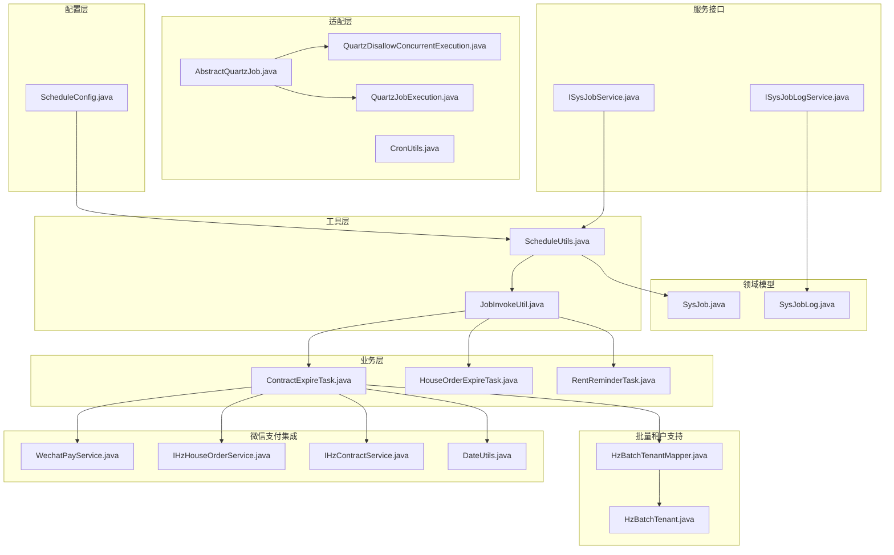

**图表来源**
- [ScheduleConfig.java:1-58](file://ruoyi-quartz/src/main/java/com/ruoyi/quartz/config/ScheduleConfig.java#L1-L58)
- [AbstractQuartzJob.java:1-107](file://ruoyi-quartz/src/main/java/com/ruoyi/quartz/util/AbstractQuartzJob.java#L1-L107)
- [QuartzDisallowConcurrentExecution.java:1-22](file://ruoyi-quartz/src/main/java/com/ruoyi/quartz/util/QuartzDisallowConcurrentExecution.java#L1-L22)
- [QuartzJobExecution.java:1-20](file://ruoyi-quartz/src/main/java/com/ruoyi/quartz/util/QuartzJobExecution.java#L1-L20)
- [CronUtils.java:1-64](file://ruoyi-quartz/src/main/java/com/ruoyi/quartz/util/CronUtils.java#L1-L64)
- [ContractExpireTask.java:1-798](file://ruoyi-quartz/src/main/java/com/ruoyi/quartz/task/ContractExpireTask.java#L1-L798)
- [HouseOrderExpireTask.java:1-41](file://ruoyi-quartz/src/main/java/com/ruoyi/quartz/task/HouseOrderExpireTask.java#L1-L41)
- [RentReminderTask.java:1-185](file://ruoyi-quartz/src/main/java/com/ruoyi/quartz/task/RentReminderTask.java#L1-L185)
- [SysJob.java:1-172](file://ruoyi-quartz/src/main/java/com/ruoyi/quartz/domain/SysJob.java#L1-L172)
- [SysJobLog.java:1-156](file://ruoyi-quartz/src/main/java/com/ruoyi/quartz/domain/SysJobLog.java#L1-L156)
- [ISysJobService.java:1-103](file://ruoyi-quartz/src/main/java/com/ruoyi/quartz/service/ISysJobService.java#L1-L103)
- [ISysJobLogService.java:1-57](file://ruoyi-quartz/src/main/java/com/ruoyi/quartz/service/ISysJobLogService.java#L1-L57)
- [JobInvokeUtil.java:1-183](file://ruoyi-quartz/src/main/java/com/ruoyi/quartz/util/JobInvokeUtil.java#L1-L183)
- [ScheduleUtils.java:1-142](file://ruoyi-quartz/src/main/java/com/ruoyi/quartz/util/ScheduleUtils.java#L1-L142)
- [HzBatchTenantMapper.java:12-15](file://ruoyi-system/src/main/java/com/ruoyi/system/mapper/HzBatchTenantMapper.java#L12-L15)
- [HzBatchTenant.java:13-158](file://ruoyi-system/src/main/java/com/ruoyi/system/domain/HzBatchTenant.java#L13-L158)
- [WechatPayService.java:28](file://ruoyi-system/src/main/java/com/ruoyi/system/service/WechatPayService.java#L28)
- [IHzHouseOrderService.java:63](file://ruoyi-system/src/main/java/com/ruoyi/system/service/IHzHouseOrderService.java#L63)
- [IHzContractService.java:1](file://ruoyi-system/src/main/java/com/ruoyi/system/service/IHzContractService.java#L1)
- [DateUtils.java:57-60](file://ruoyi-common/src/main/java/com/ruoyi/common/utils/DateUtils.java#L57-L60)

**章节来源**
- [ScheduleConfig.java:1-58](file://ruoyi-quartz/src/main/java/com/ruoyi/quartz/config/ScheduleConfig.java#L1-L58)
- [ScheduleUtils.java:1-142](file://ruoyi-quartz/src/main/java/com/ruoyi/quartz/util/ScheduleUtils.java#L1-L142)

## 核心组件
- 调度器配置：提供 Quartz 的线程池、JobStore、集群参数、启动延迟、覆盖现有任务等配置入口，支持单机/集群部署模式切换。
- 抽象作业基类：统一任务生命周期（前置/后置钩子）、执行计时、异常捕获与日志落库。
- 并发控制策略：禁止并发与允许并发两种执行策略，分别对应不同的 Quartz 作业实现。
- Cron 工具：校验表达式有效性、计算下一次执行时间。
- 业务任务：合同到期检查与房源释放、订单过期处理、租期提醒、**微信支付恢复**。
- 领域模型：SysJob（任务定义）、SysJobLog（任务日志）。
- 服务接口：任务 CRUD、启停、立即执行、日志查询与清理。
- 调度工具：根据 SysJob 构建 JobDetail/Trigger、Misfire 策略处理、白名单校验。

**更新** 系统新增微信支付恢复机制，ContractExpireTask 现在集成了 WechatPayService、IHzHouseOrderService 和 DateUtils 依赖，增强了支付流程的可靠性和用户体验。

**章节来源**
- [AbstractQuartzJob.java:1-107](file://ruoyi-quartz/src/main/java/com/ruoyi/quartz/util/AbstractQuartzJob.java#L1-L107)
- [QuartzDisallowConcurrentExecution.java:1-22](file://ruoyi-quartz/src/main/java/com/ruoyi/quartz/util/QuartzDisallowConcurrentExecution.java#L1-L22)
- [QuartzJobExecution.java:1-20](file://ruoyi-quartz/src/main/java/com/ruoyi/quartz/util/QuartzJobExecution.java#L1-L20)
- [CronUtils.java:1-64](file://ruoyi-quartz/src/main/java/com/ruoyi/quartz/util/CronUtils.java#L1-L64)
- [SysJob.java:1-172](file://ruoyi-quartz/src/main/java/com/ruoyi/quartz/domain/SysJob.java#L1-L172)
- [SysJobLog.java:1-156](file://ruoyi-quartz/src/main/java/com/ruoyi/quartz/domain/SysJobLog.java#L1-L156)
- [ISysJobService.java:1-103](file://ruoyi-quartz/src/main/java/com/ruoyi/quartz/service/ISysJobService.java#L1-L103)
- [ISysJobLogService.java:1-57](file://ruoyi-quartz/src/main/java/com/ruoyi/quartz/service/ISysJobLogService.java#L1-L57)
- [JobInvokeUtil.java:1-183](file://ruoyi-quartz/src/main/java/com/ruoyi/quartz/util/JobInvokeUtil.java#L1-L183)
- [ScheduleUtils.java:1-142](file://ruoyi-quartz/src/main/java/com/ruoyi/quartz/util/ScheduleUtils.java#L1-L142)

## 架构总览
系统采用 Quartz 作为核心调度引擎，通过 Spring 管理调度器与作业映射，结合 SysJob 与 SysJobLog 实现任务定义、执行与审计。调度流程如下：

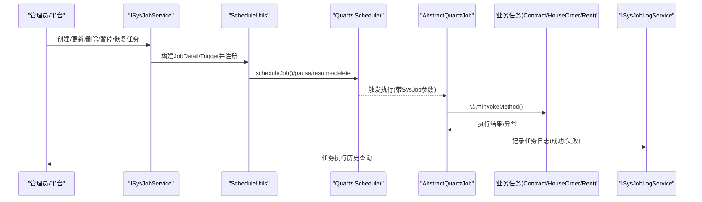

**图表来源**
- [ISysJobService.java:1-103](file://ruoyi-quartz/src/main/java/com/ruoyi/quartz/service/ISysJobService.java#L1-L103)
- [ScheduleUtils.java:1-142](file://ruoyi-quartz/src/main/java/com/ruoyi/quartz/util/ScheduleUtils.java#L1-L142)
- [AbstractQuartzJob.java:1-107](file://ruoyi-quartz/src/main/java/com/ruoyi/quartz/util/AbstractQuartzJob.java#L1-L107)
- [JobInvokeUtil.java:1-183](file://ruoyi-quartz/src/main/java/com/ruoyi/quartz/util/JobInvokeUtil.java#L1-L183)
- [ISysJobLogService.java:1-57](file://ruoyi-quartz/src/main/java/com/ruoyi/quartz/service/ISysJobLogService.java#L1-L57)

## 详细组件分析

### 组件A：调度器与集群配置
- 单机/集群模式：通过注释可见，单机部署可禁用持久化配置，直接使用内存调度；集群部署启用 LocalDataSourceJobStore 与集群参数，确保多实例一致性。
- 关键参数：线程池大小、优先级、JobStore 表前缀、集群检查间隔、Misfire 阈值、覆盖现有任务、启动延迟、自动启动。
- 集群要点：isClustered=true、clusterCheckinInterval 控制心跳、maxMisfiresToHandleAtATime 限制一次性处理的错失触发数量。

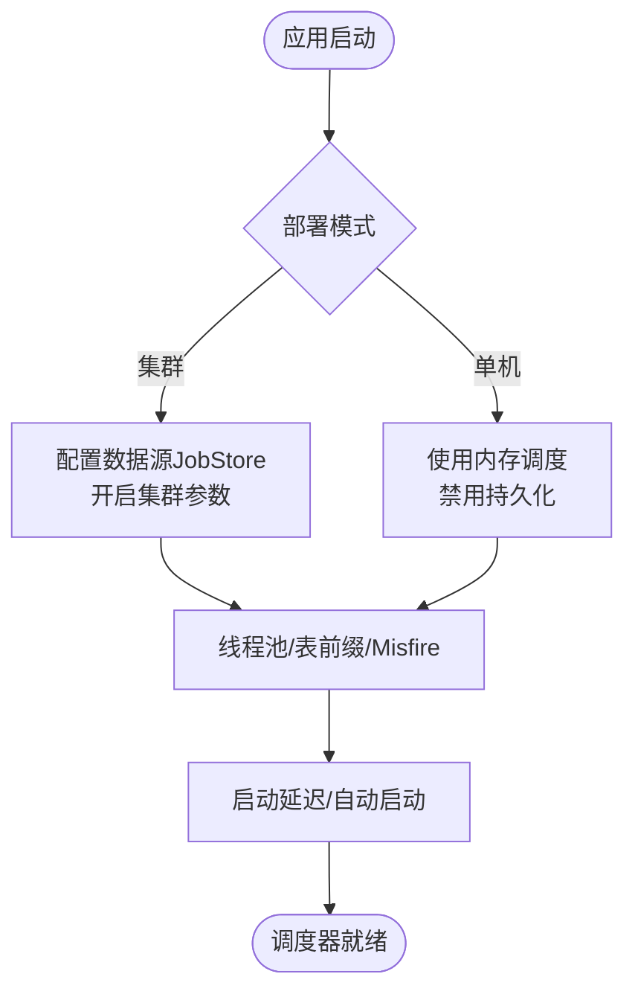

**图表来源**
- [ScheduleConfig.java:1-58](file://ruoyi-quartz/src/main/java/com/ruoyi/quartz/config/ScheduleConfig.java#L1-L58)

**章节来源**
- [ScheduleConfig.java:1-58](file://ruoyi-quartz/src/main/java/com/ruoyi/quartz/config/ScheduleConfig.java#L1-L58)

### 组件B：作业生命周期与日志
- 生命周期：before 记录开始时间，after 统计耗时、写入成功/失败状态与异常信息，最终持久化到 SysJobLog。
- 异常处理：捕获执行期异常，截断异常消息长度，保证日志可读性。
- 并发策略：通过 SysJob.concurrent 决定使用允许并发或禁止并发的执行器。

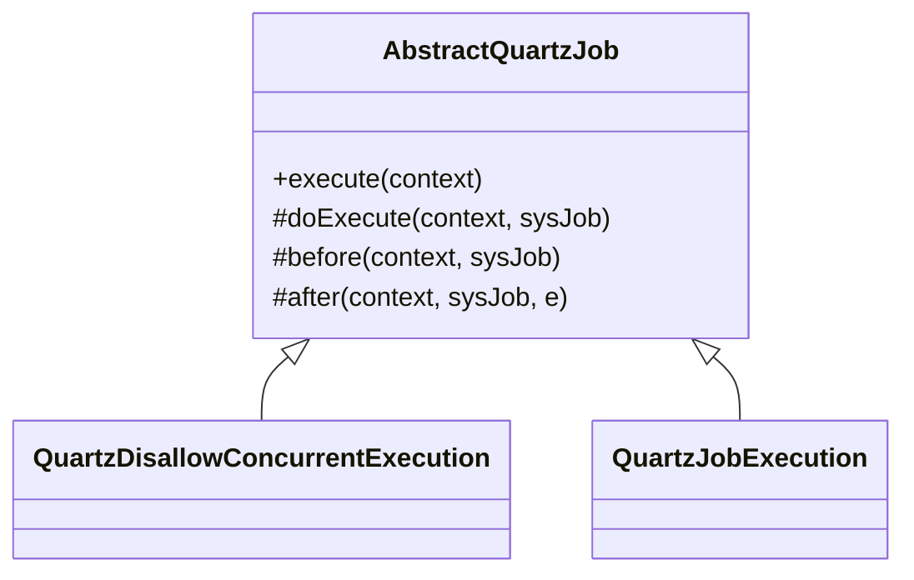

**图表来源**
- [AbstractQuartzJob.java:1-107](file://ruoyi-quartz/src/main/java/com/ruoyi/quartz/util/AbstractQuartzJob.java#L1-L107)
- [QuartzDisallowConcurrentExecution.java:1-22](file://ruoyi-quartz/src/main/java/com/ruoyi/quartz/util/QuartzDisallowConcurrentExecution.java#L1-L22)
- [QuartzJobExecution.java:1-20](file://ruoyi-quartz/src/main/java/com/ruoyi/quartz/util/QuartzJobExecution.java#L1-L20)

**章节来源**
- [AbstractQuartzJob.java:1-107](file://ruoyi-quartz/src/main/java/com/ruoyi/quartz/util/AbstractQuartzJob.java#L1-L107)

### 组件C：Cron 表达式工具
- 校验表达式有效性与错误消息提取。
- 计算下一次有效执行时间，用于任务过期判断与可视化展示。

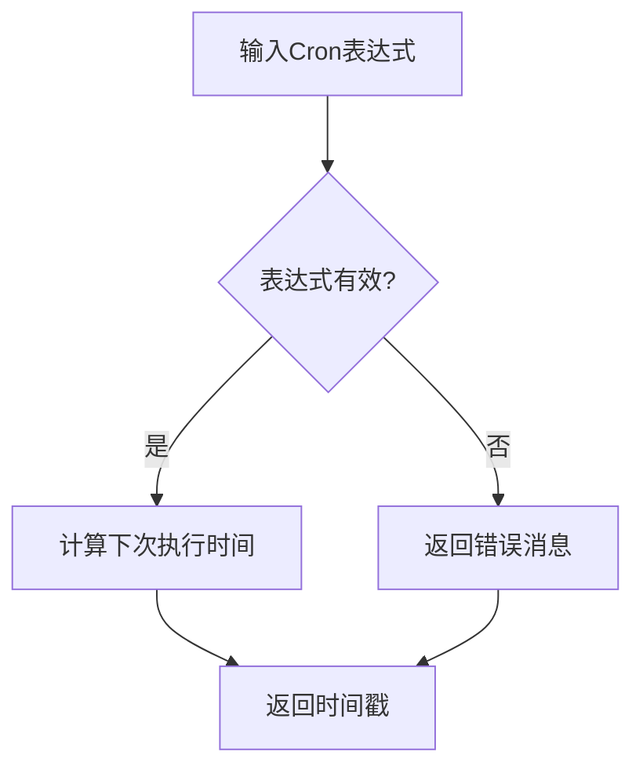

**图表来源**
- [CronUtils.java:1-64](file://ruoyi-quartz/src/main/java/com/ruoyi/quartz/util/CronUtils.java#L1-L64)

**章节来源**
- [CronUtils.java:1-64](file://ruoyi-quartz/src/main/java/com/ruoyi/quartz/util/CronUtils.java#L1-L64)

### 组件D：任务调度工具与 Misfire 策略
- 作业类选择：根据 SysJob.concurrent 选择并发/禁止并发执行器。
- Trigger 构建：基于 Cron 表达式与 Misfire 策略生成触发器。
- 白名单校验：限制可执行的目标包路径，提升安全性。
- 过期判断：利用 CronUtils 计算下一次执行时间，避免过期任务入队。

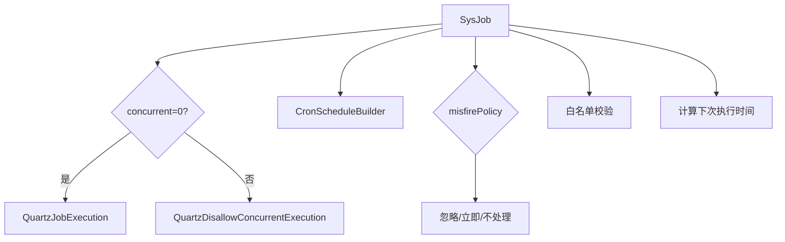

**图表来源**
- [ScheduleUtils.java:1-142](file://ruoyi-quartz/src/main/java/com/ruoyi/quartz/util/ScheduleUtils.java#L1-L142)
- [CronUtils.java:1-64](file://ruoyi-quartz/src/main/java/com/ruoyi/quartz/util/CronUtils.java#L1-L64)

**章节来源**
- [ScheduleUtils.java:1-142](file://ruoyi-quartz/src/main/java/com/ruoyi/quartz/util/ScheduleUtils.java#L1-L142)

### 组件E：业务任务设计与实现

#### 合同到期检查与房源释放
**更新** ContractExpireTask任务包含四个核心功能模块，现已移除批量配租用户的合同到期豁免机制，并新增微信支付恢复机制：

##### 主要功能模块

**模块1：合同到期自动释放（每天凌晨1点执行）**
- 任务目标：定期检查到期合同并释放房源，联动软删未完成的入住单，发送到期通知。
- 触发策略：每天01:00执行。
- 关键逻辑：
  - 查询到期日 < 当天 且 合同状态为"履行中(3)" 且未续租的合同
  - 将合同状态更新为"已到期(4)"，房源状态改为"空置(0)"
  - 软删对应入住单，发送到期通知提醒
  - **批量配租用户不再豁免**：所有到期合同均按统一规则处理

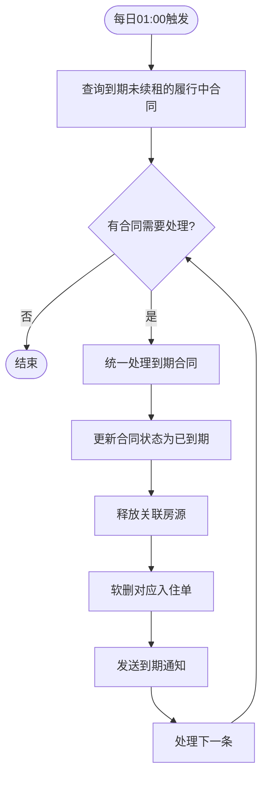

**图表来源**
- [ContractExpireTask.java:102-160](file://ruoyi-quartz/src/main/java/com/ruoyi/quartz/task/ContractExpireTask.java#L102-L160)

**模块2：合同超时失效处理（每分钟检查一次）**
- 任务目标：检查并处理超时的合同，释放被锁定的房源。
- 触发策略：每分钟执行一次。
- 关键逻辑：包含三种超时规则的处理机制，现已移除批量配租用户豁免。

**规则A：签署后30分钟未缴押金**
- 条件：contract_status='2'（已签署），sign_time IS NOT NULL，del_flag='0'
- 处理：如果 sign_time + 30分钟 < NOW() 且无已支付押金账单 → 失效
- **新增微信支付恢复机制**：在失效前主动向微信查单，防止回调丢失导致误失效
- **批量配租用户不再豁免**：所有用户类型均按统一规则检查

**规则B：未签署合同60分钟超时**
- 条件：contract_status='0'（待签署），del_flag='0'
- 处理：如果 create_time + 60分钟 < NOW() → 标记超时失效
- **批量配租用户不再豁免**：所有用户类型均按统一规则检查

**规则C：押金已缴后3日未上传资料**
- 条件：contract_status='2'（已签署），del_flag='0'
- 处理：押金已缴且 pay_time + 3天 < NOW() 且无已提交资料 → 标记超时失效
- **批量配租用户不再豁免**：所有用户类型均按统一规则检查

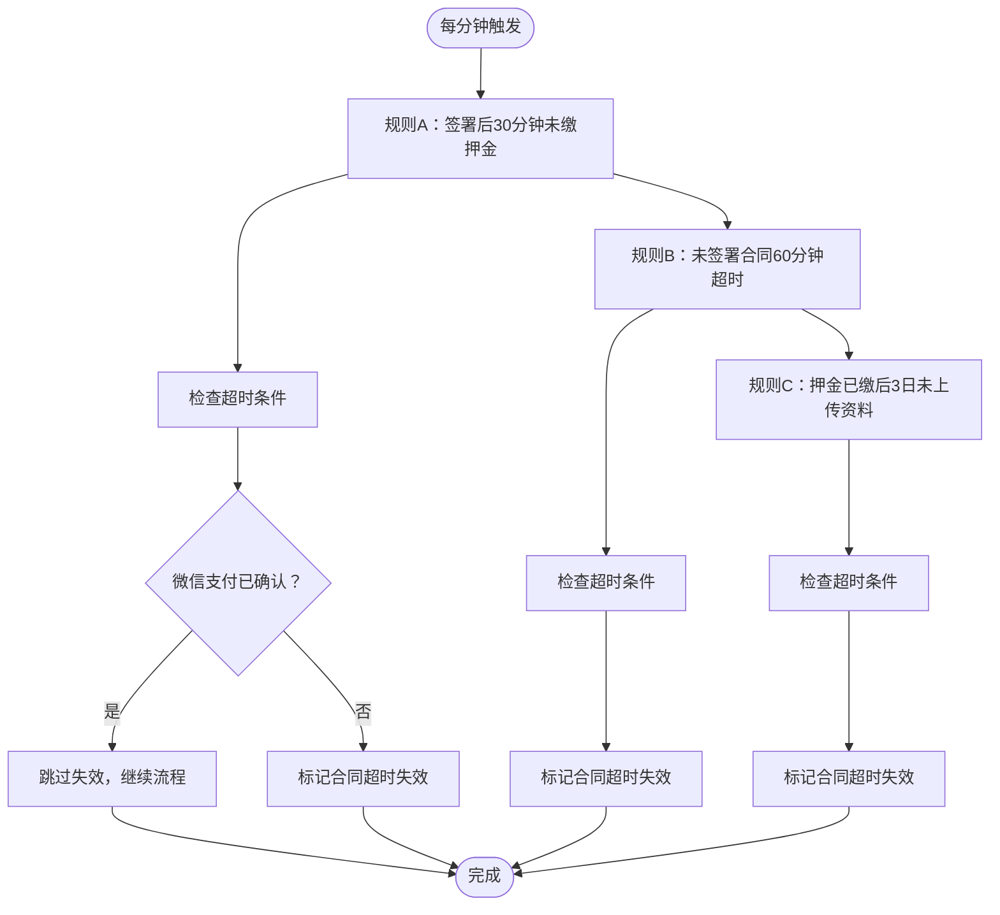

**图表来源**
- [ContractExpireTask.java:165-325](file://ruoyi-quartz/src/main/java/com/ruoyi/quartz/task/ContractExpireTask.java#L165-L325)

**模块3：入住超时自动解约和退款（每小时执行）**
**更新** 这是ContractExpireTask任务的第三个核心功能，专门处理入住超时的情况，现已移除批量配租用户的入住超时豁免机制。

- 任务目标：对符合条件的合同进行入住超时自动解约，并执行微信原路退款。
- 触发策略：每小时整点执行。
- 关键逻辑：
  - 总开关控制：auto.cancel.enabled=true时才执行
  - 启用日期控制：仅对启用日之后创建的新合同生效
  - 超时时间配置：默认72小时，可通过auto.cancel.timeout-hours配置
  - 阶段提醒：24h/48h/60h/70h按整点提醒
  - 自动解约：超过timeoutHours自动解约并退款
  - **批量配租用户不再豁免**：所有用户类型均按统一规则执行

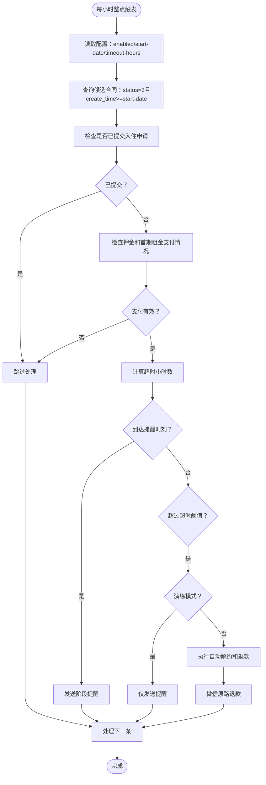

**图表来源**
- [ContractExpireTask.java:542-663](file://ruoyi-quartz/src/main/java/com/ruoyi/quartz/task/ContractExpireTask.java#L542-L663)

**模块4：微信支付回调丢失恢复（每5分钟执行一次）**
**新增** 这是ContractExpireTask任务的第四个核心功能，专门处理微信支付回调丢失的问题，确保所有已支付的账单都能正确更新状态。

- 任务目标：扫描最近24小时内未支付但微信已成功的账单，自动恢复支付状态。
- 触发策略：每5分钟执行一次。
- 关键逻辑：
  - 扫描范围：hz_bill中bill_status='0'且last_out_trade_no非空的账单
  - 时间窗口：update_time在最近24小时内的账单
  - 支付类型：不限制bill_type，覆盖押金、租金、水电燃、物业费等所有类型
  - 恢复机制：通过微信查单确认SUCCESS后，补录本地账单状态并触发相关流程

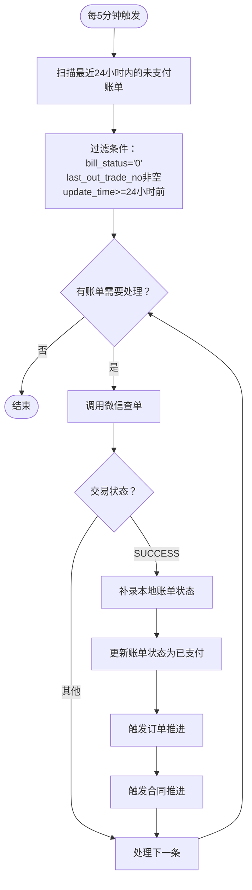

**图表来源**
- [ContractExpireTask.java:407-477](file://ruoyi-quartz/src/main/java/com/ruoyi/quartz/task/ContractExpireTask.java#L407-L477)

**章节来源**
- [ContractExpireTask.java:1-798](file://ruoyi-quartz/src/main/java/com/ruoyi/quartz/task/ContractExpireTask.java#L1-L798)

#### 选房预订单过期处理
- 任务目标：检查并处理过期的选房预订单，释放被锁定的房源。
- 触发策略：每分钟检查一次，调用订单服务处理过期订单。

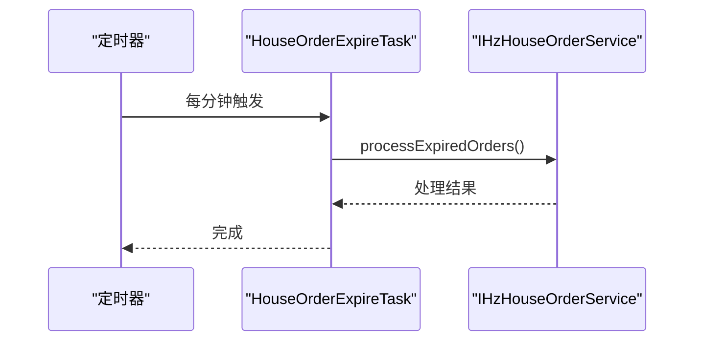

**图表来源**
- [HouseOrderExpireTask.java:1-41](file://ruoyi-quartz/src/main/java/com/ruoyi/quartz/task/HouseOrderExpireTask.java#L1-L41)

**章节来源**
- [HouseOrderExpireTask.java:1-41](file://ruoyi-quartz/src/main/java/com/ruoyi/quartz/task/HouseOrderExpireTask.java#L1-L41)

#### 租金催交提醒
**更新** 增强租金催交提醒功能，在baseWrapper()方法中增加合同状态过滤条件，排除已到期(4)、已解约(5)、超时失效(6)的合同，提高提醒准确性。

- 任务目标：按档位发送房租催交提醒（T-7、T-3、逾期），避免重复发送。
- 触发策略：每天9:00执行。
- 关键逻辑：
  - 构造查询条件（租金+待支付+未删除）。
  - 在baseWrapper()方法中增加合同状态过滤：排除已到期(4)、已解约(5)、超时失效(6)状态的合同。
  - 分档发送并去重（用户+消息标题+账单周期+当日）。
  - 构建消息内容，包含账单周期、金额、应付日期等。

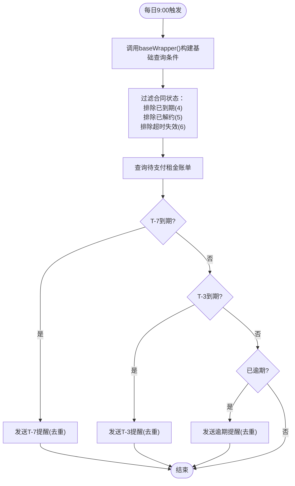

**图表来源**
- [RentReminderTask.java:1-185](file://ruoyi-quartz/src/main/java/com/ruoyi/quartz/task/RentReminderTask.java#L1-L185)

**章节来源**
- [RentReminderTask.java:1-185](file://ruoyi-quartz/src/main/java/com/ruoyi/quartz/task/RentReminderTask.java#L1-L185)

### 组件F：任务执行与调用
- JobInvokeUtil：解析 invoke_target 字符串，支持 Bean 名称与全限定类名两种方式，自动识别参数类型（字符串、布尔、长整型、双精度、整型），反射调用目标方法。
- ScheduleUtils：根据 SysJob 构建 JobDetail/Trigger，处理 Misfire 策略，执行白名单校验，避免危险调用。

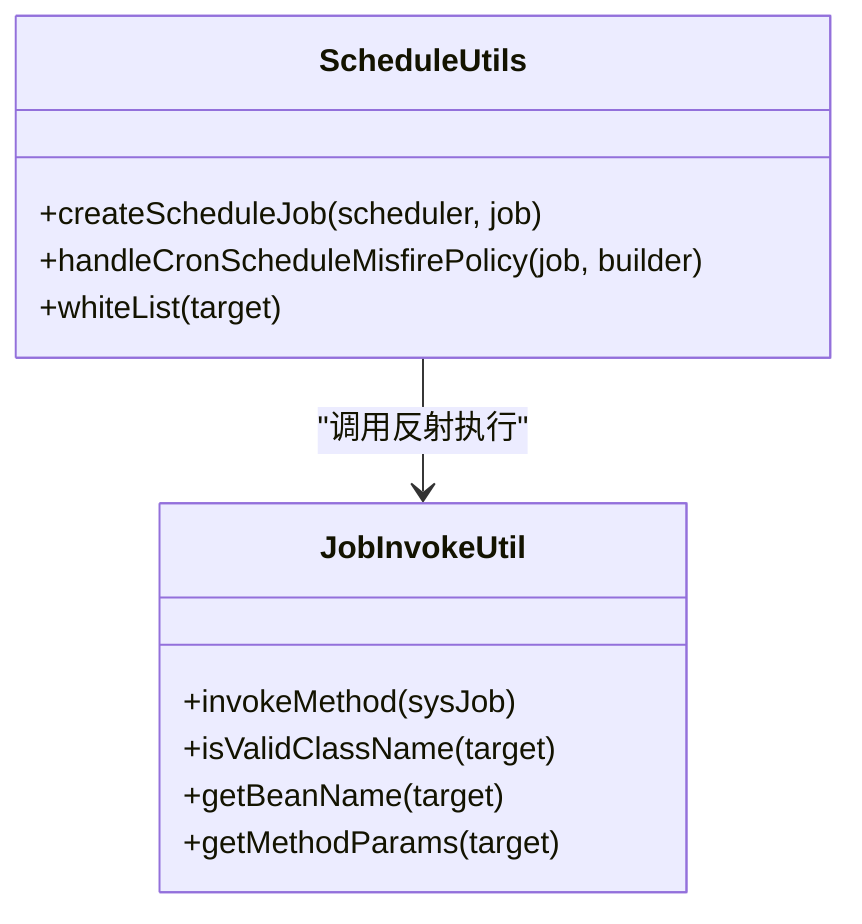

**图表来源**
- [JobInvokeUtil.java:1-183](file://ruoyi-quartz/src/main/java/com/ruoyi/quartz/util/JobInvokeUtil.java#L1-L183)
- [ScheduleUtils.java:1-142](file://ruoyi-quartz/src/main/java/com/ruoyi/quartz/util/ScheduleUtils.java#L1-L142)

**章节来源**
- [JobInvokeUtil.java:1-183](file://ruoyi-quartz/src/main/java/com/ruoyi/quartz/util/JobInvokeUtil.java#L1-L183)
- [ScheduleUtils.java:1-142](file://ruoyi-quartz/src/main/java/com/ruoyi/quartz/util/ScheduleUtils.java#L1-L142)

## 微信支付恢复机制

### 机制概述
系统新增了微信支付恢复机制，通过 recoverLostWechatNotify() 方法实现自动化恢复机制，扫描未支付但微信已成功的账单，每5分钟检查最近24小时内的账单。该机制解决了支付回调丢失导致的状态不一致问题，确保所有已支付的账单都能正确更新状态。

### 核心功能实现

**微信支付恢复方法**
- 方法名称：recoverLostWechatNotify()
- 功能：扫描最近24小时内的未支付账单，主动向微信查单确认支付状态
- 触发策略：每5分钟执行一次
- 返回值：补回的账单数量

**扫描范围与条件**
1. **账单状态**：bill_status='0'（未支付）
2. **微信标识**：last_out_trade_no非空且不为空字符串
3. **时间窗口**：update_time在最近24小时内的账单
4. **业务范围**：不限制bill_type，覆盖押金、租金、水电燃、物业费等所有类型

**查单与恢复流程**
1. 查询符合条件的候选账单
2. 对每个账单调用微信查单接口
3. 检查交易状态是否为SUCCESS
4. 如果微信确认已支付，则补录本地账单状态
5. 触发相关业务流程推进

**支付确认处理**
当微信确认已支付时，系统会：
- 补录本地账单状态为已支付（bill_status='1'）
- 设置支付时间和交易号
- 触发订单状态推进（onDepositPaid）
- 触发合同状态推进（tryAdvanceContractToFulfilling）

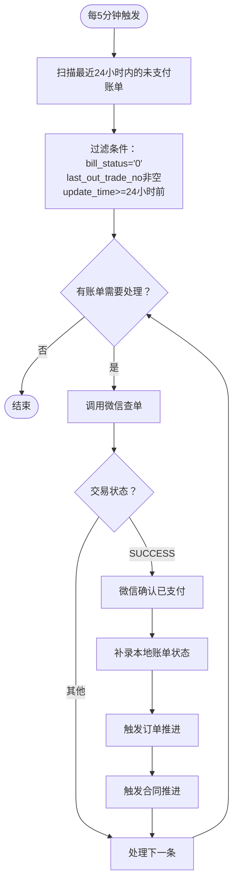

**图表来源**
- [ContractExpireTask.java:407-477](file://ruoyi-quartz/src/main/java/com/ruoyi/quartz/task/ContractExpireTask.java#L407-L477)

**章节来源**
- [ContractExpireTask.java:407-477](file://ruoyi-quartz/src/main/java/com/ruoyi/quartz/task/ContractExpireTask.java#L407-L477)

## 批量租户豁免机制变更

### 变更说明
**重要更新** ContractExpireTask中已完全移除批量配租用户的合同到期豁免机制：

1. **合同到期释放**：所有到期合同（包括批量配租用户）均会被释放，不再区分用户类型
2. **超时失效检查**：批量配租用户不再享受豁免，所有用户类型均按标准时效规则执行
3. **入住超时解约**：批量配租用户不再豁免入住超时自动解约，统一按配置的超时阈值执行
4. **微信支付恢复**：批量配租用户同样适用微信支付恢复机制，所有用户类型均按统一规则处理

### 豁免机制移除位置
- **规则A检查**：第196行注释已移除"批次配租用户押金缴纳时效与普通用户相同，不豁免"
- **规则B检查**：第241-244行批量租户豁免逻辑已完全移除
- **规则C检查**：第279-282行批量租户豁免逻辑已完全移除
- **入住超时解约**：第589-592行批量租户豁免逻辑已完全移除
- **微信支付恢复**：第409行注释明确指出"不限bill_type"，覆盖所有用户类型的账单

### 影响分析
- **政策一致性**：确保所有用户类型（包括批量配租用户）均遵循相同的合同管理规则
- **管理简化**：移除复杂的用户类型判断逻辑，简化业务流程
- **合规性**：统一的处理规则符合政策执行的一致性要求
- **支付可靠性**：批量配租用户同样享受微信支付恢复机制，提升整体支付可靠性

**章节来源**
- [ContractExpireTask.java:196](file://ruoyi-quartz/src/main/java/com/ruoyi/quartz/task/ContractExpireTask.java#L196)
- [ContractExpireTask.java:241-244](file://ruoyi-quartz/src/main/java/com/ruoyi/quartz/task/ContractExpireTask.java#L241-L244)
- [ContractExpireTask.java:279-282](file://ruoyi-quartz/src/main/java/com/ruoyi/quartz/task/ContractExpireTask.java#L279-L282)
- [ContractExpireTask.java:589-592](file://ruoyi-quartz/src/main/java/com/ruoyi/quartz/task/ContractExpireTask.java#L589-L592)
- [ContractExpireTask.java:409](file://ruoyi-quartz/src/main/java/com/ruoyi/quartz/task/ContractExpireTask.java#L409)

## 依赖分析
- 低耦合高内聚：业务任务通过 Spring Bean 注入，隔离业务逻辑与调度框架。
- 关键依赖链：
  - ISysJobService -> ScheduleUtils -> Quartz Scheduler
  - AbstractQuartzJob -> JobInvokeUtil -> 业务任务
  - SysJob -> CronUtils（下一次执行时间）
  - ISysJobLogService -> SysJobLog（审计）
  - **ContractExpireTask -> HzBatchTenantMapper -> HzBatchTenant**（批量租户支持，现已移除豁免逻辑）
  - **ContractExpireTask -> WechatPayService**（微信支付查单）
  - **ContractExpireTask -> IHzHouseOrderService**（支付后状态推进）
  - **ContractExpireTask -> IHzContractService**（合同状态管理）
  - **ContractExpireTask -> DateUtils**（时间戳处理）

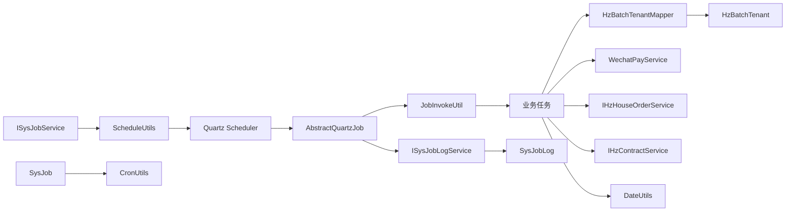

**图表来源**
- [ISysJobService.java:1-103](file://ruoyi-quartz/src/main/java/com/ruoyi/quartz/service/ISysJobService.java#L1-L103)
- [ScheduleUtils.java:1-142](file://ruoyi-quartz/src/main/java/com/ruoyi/quartz/util/ScheduleUtils.java#L1-L142)
- [AbstractQuartzJob.java:1-107](file://ruoyi-quartz/src/main/java/com/ruoyi/quartz/util/AbstractQuartzJob.java#L1-L107)
- [JobInvokeUtil.java:1-183](file://ruoyi-quartz/src/main/java/com/ruoyi/quartz/util/JobInvokeUtil.java#L1-L183)
- [SysJob.java:1-172](file://ruoyi-quartz/src/main/java/com/ruoyi/quartz/domain/SysJob.java#L1-L172)
- [CronUtils.java:1-64](file://ruoyi-quartz/src/main/java/com/ruoyi/quartz/util/CronUtils.java#L1-L64)
- [ISysJobLogService.java:1-57](file://ruoyi-quartz/src/main/java/com/ruoyi/quartz/service/ISysJobLogService.java#L1-L57)
- [SysJobLog.java:1-156](file://ruoyi-quartz/src/main/java/com/ruoyi/quartz/domain/SysJobLog.java#L1-L156)
- [ContractExpireTask.java:84-94](file://ruoyi-quartz/src/main/java/com/ruoyi/quartz/task/ContractExpireTask.java#L84-L94)
- [HzBatchTenantMapper.java:12-15](file://ruoyi-system/src/main/java/com/ruoyi/system/mapper/HzBatchTenantMapper.java#L12-L15)
- [WechatPayService.java:28](file://ruoyi-system/src/main/java/com/ruoyi/system/service/WechatPayService.java#L28)
- [IHzHouseOrderService.java:63](file://ruoyi-system/src/main/java/com/ruoyi/system/service/IHzHouseOrderService.java#L63)
- [IHzContractService.java:1](file://ruoyi-system/src/main/java/com/ruoyi/system/service/IHzContractService.java#L1)
- [DateUtils.java:57-60](file://ruoyi-common/src/main/java/com/ruoyi/common/utils/DateUtils.java#L57-L60)

**章节来源**
- [ISysJobService.java:1-103](file://ruoyi-quartz/src/main/java/com/ruoyi/quartz/service/ISysJobService.java#L1-L103)
- [ISysJobLogService.java:1-57](file://ruoyi-quartz/src/main/java/com/ruoyi/quartz/service/ISysJobLogService.java#L1-L57)

## 性能考虑
- 线程池规模：根据任务复杂度与数据库负载调整线程数，避免过度并发导致锁争用。
- Cron 表达式优化：尽量使用稳定的固定频率，减少瞬时峰值。
- 任务拆分：将大范围扫描拆分为分页/分批处理，降低单次执行时长。
- 日志与监控：合理设置日志级别，避免频繁 I/O；结合 SysJobLog 进行性能趋势分析。
- 集群一致性：确保数据库 JobStore 与集群参数一致，避免重复执行或丢失触发。
- **批量租户查询优化**：批量租户检测逻辑已移除，简化了查询流程，提升了整体性能。
- **微信查单性能**：微信支付查单操作会增加额外的网络请求，建议合理控制查单频率和批量处理数量。
- **微信支付恢复优化**：通过限制24小时时间窗口和批量处理机制，避免对微信支付接口造成过大压力。

**更新** ContractExpireTask任务的性能优化：
- 合同到期检查：使用精确的查询条件避免全表扫描
- 超时失效处理：移除批量租户豁免逻辑，简化了判断流程
- 入住超时解约：移除批量租户豁免逻辑，统一处理规则
- 租金催交提醒：在baseWrapper()中增加合同状态过滤，减少无效查询
- **微信支付恢复**：通过24小时时间窗口限制和批量处理，优化了性能表现
- **微信查单兜底**：查单操作按需触发，避免不必要的网络请求

## 故障排查指南
- 任务未执行
  - 检查 SysJob.status 是否为暂停；确认 Cron 表达式有效；核对 Misfire 策略。
  - 使用 CronUtils 计算下一次执行时间验证。
- 任务重复执行/并发冲突
  - 检查 SysJob.concurrent 设置；必要时改为禁止并发。
- 任务异常
  - 查看 SysJobLog 中异常信息；定位具体业务分支；修复后重试。
- 安全风险
  - 确认 JobInvokeUtil.whiteList 校验通过；避免直接使用全限定类名调用不受控代码。

**更新** ContractExpireTask任务的故障排查要点：
- 合同到期释放：检查合同状态转换逻辑和房源状态更新
- 超时失效处理：验证三种规则的触发条件和数据库查询
- 入住超时解约：确认配置开关、启用日期和超时阈值设置正确
- 微信退款：检查transaction_no是否存在和退款接口调用
- 租金催交提醒：验证baseWrapper()中的合同状态过滤条件是否正确应用
- **批量租户处理**：确认isBatchTenant()方法不再返回true，所有用户类型均按统一规则处理
- **微信支付恢复**：检查WechatPayService的可用性、网络连接和微信支付配置
- **微信支付恢复机制**：验证每5分钟任务的执行状态和日志输出

**章节来源**
- [SysJobLog.java:1-156](file://ruoyi-quartz/src/main/java/com/ruoyi/quartz/domain/SysJobLog.java#L1-L156)
- [ScheduleUtils.java:1-142](file://ruoyi-quartz/src/main/java/com/ruoyi/quartz/util/ScheduleUtils.java#L1-L142)
- [CronUtils.java:1-64](file://ruoyi-quartz/src/main/java/com/ruoyi/quartz/util/CronUtils.java#L1-L64)

## 结论
本定时任务系统以 Quartz 为核心，结合 Spring 管理与 SysJob/SysJobLog 模型，实现了从任务定义、调度、执行到审计的完整闭环。通过并发控制、Misfire 策略、白名单校验与完善的日志记录，系统在保证可靠性的同时具备良好的可观测性与可运维性。业务侧的合同到期、订单过期、租期提醒、**微信支付恢复**等任务均以清晰的流程与边界实现，便于扩展与演进。

**更新** 系统通过新增微信支付恢复机制显著提升了支付流程的可靠性和用户体验，通过 recoverLostWechatNotify() 方法实现自动化恢复机制，扫描未支付但微信已成功的账单，每5分钟检查最近24小时内的账单。同时，合同到期豁免机制的调整进一步完善了系统的合同管理能力，通过移除批量配租用户的合同到期豁免逻辑，确保了政策执行的一致性和公平性。

## 附录
- 任务配置管理
  - 通过 ISysJobService 提供的任务 CRUD 与启停接口，实现任务的动态管理。
  - SysJob 字段涵盖任务名称、组、Cron 表达式、Misfire 策略、并发控制与状态。
- 动态任务添加
  - 使用 ScheduleUtils.createScheduleJob 注册新任务；若任务已存在则先删除再创建。
- 任务暂停/恢复
  - 通过 changeStatus/pauseJob/resumeJob 控制任务状态；SysJob.status=1 暂停。
- 异常处理
  - AbstractQuartzJob 统一捕获异常并记录；ISysJobLogService 提供日志查询与清理。
- 测试方法
  - 单元测试：针对 CronUtils 的表达式校验与下一次执行时间计算。
  - 集成测试：构造 SysJob 并通过 ScheduleUtils 注册，观察 Quartz 调度与 SysJobLog 记录。
- 性能调优
  - 调整线程池大小与并发策略；优化 Cron 表达式与任务粒度；监控数据库连接与锁等待。
- 故障排查
  - 依据 SysJobLog 快速定位失败原因；核对 CronUtils 计算与 Misfire 策略；检查白名单与权限。

**更新** ContractExpireTask任务的配置示例：
- 合同到期释放：invoke_target = contractExpireTask.execute()，cron_expression = 0 0 1 * * ?（每天01:00）
- 超时合同检查：invoke_target = contractExpireTask.checkExpiredContracts()，cron_expression = 0 * * * * ?（每分钟）
- 入住超时解约：invoke_target = contractExpireTask.processCheckinTimeoutAutoCancel()，cron_expression = 0 0 * * * ?（每小时）
- 微信支付恢复：invoke_target = contractExpireTask.recoverLostWechatNotify()，cron_expression = 0 */5 * * * ?（每5分钟）
- 租金催交提醒：invoke_target = rentReminderTask.execute()，cron_expression = 0 0 9 * * ?（每天09:00）
- **批量租户处理**：所有用户类型均按统一规则处理，不再区分批量配租用户
- **微信支付恢复**：系统自动检测并恢复微信支付状态，无需人工干预