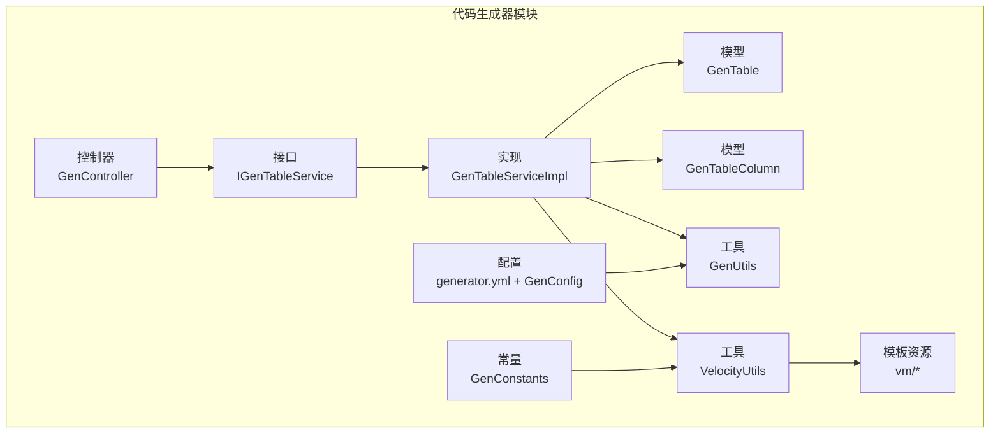
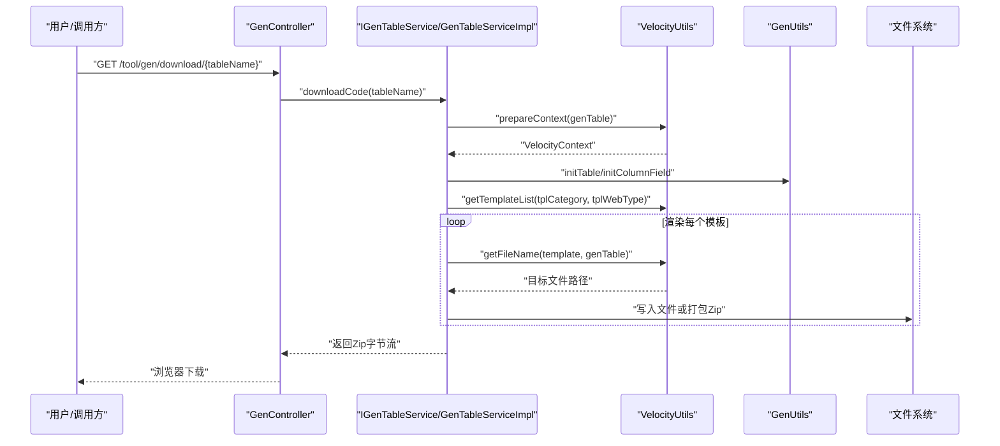
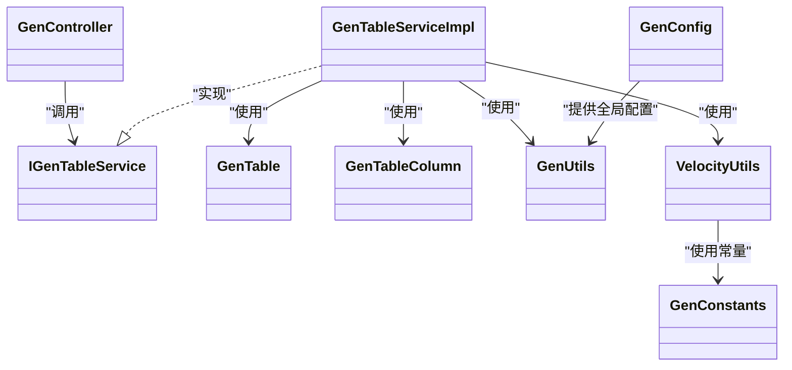

# 代码生成器使用

<cite>
**本文引用的文件**
- [generator.yml](file://ruoyi-generator/src/main/resources/generator.yml)
- [GenController.java](file://ruoyi-generator/src/main/java/com/ruoyi/generator/controller/GenController.java)
- [IGenTableService.java](file://ruoyi-generator/src/main/java/com/ruoyi/generator/service/IGenTableService.java)
- [GenTableServiceImpl.java](file://ruoyi-generator/src/main/java/com/ruoyi/generator/service/GenTableServiceImpl.java)
- [GenTable.java](file://ruoyi-generator/src/main/java/com/ruoyi/generator/domain/GenTable.java)
- [GenTableColumn.java](file://ruoyi-generator/src/main/java/com/ruoyi/generator/domain/GenTableColumn.java)
- [GenUtils.java](file://ruoyi-generator/src/main/java/com/ruoyi/generator/util/GenUtils.java)
- [VelocityUtils.java](file://ruoyi-generator/src/main/java/com/ruoyi/generator/util/VelocityUtils.java)
- [GenConfig.java](file://ruoyi-generator/src/main/java/com/ruoyi/generator/config/GenConfig.java)
- [GenConstants.java](file://ruoyi-common/src/main/java/com/ruoyi/common/constant/GenConstants.java)
- [domain.java.vm](file://ruoyi-generator/src/main/resources/vm/java/domain.java.vm)
- [mapper.java.vm](file://ruoyi-generator/src/main/resources/vm/java/mapper.java.vm)
- [service.java.vm](file://ruoyi-generator/src/main/resources/vm/java/service.java.vm)
- [controller.java.vm](file://ruoyi-generator/src/main/resources/vm/java/controller.java.vm)
- [serviceImpl.java.vm](file://ruoyi-generator/src/main/resources/vm/java/serviceImpl.java.vm)
- [mapper.xml.vm](file://ruoyi-generator/src/main/resources/vm/xml/mapper.xml.vm)
- [api.js.vm](file://ruoyi-generator/src/main/resources/vm/js/api.js.vm)
- [index.vue.vm](file://ruoyi-generator/src/main/resources/vm/vue/index.vue.vm)
- [index-tree.vue.vm](file://ruoyi-generator/src/main/resources/vm/vue/index-tree.vue.vm)
</cite>

## 目录
1. [简介](#简介)
2. [项目结构](#项目结构)
3. [核心组件](#核心组件)
4. [架构总览](#架构总览)
5. [详细组件分析](#详细组件分析)
6. [依赖关系分析](#依赖关系分析)
7. [性能与扩展性](#性能与扩展性)
8. [使用流程与操作指南](#使用流程与操作指南)
9. [配置文件详解：generator.yml](#配置文件详解generatoryml)
10. [模板开发与自定义](#模板开发与自定义)
11. [高级用法与最佳实践](#高级用法与最佳实践)
12. [故障排查](#故障排查)
13. [结论](#结论)

## 简介
本指南面向港好住信息系统开发团队，系统讲解“代码生成器”的功能特性、配置与使用方法，涵盖从数据库表结构到后端 Java 实体、Mapper、Service、Controller，以及前端 Vue 页面与 API 的完整 CRUD 代码一键生成能力。文档同时提供 generator.yml 参数详解、模板开发技巧、批量生成与增量更新策略、性能优化建议及常见问题排查，帮助团队高效落地标准化开发。

## 项目结构
代码生成器位于 ruoyi-generator 模块，采用“Velocity 模板 + 配置驱动 + 控制器编排”的架构设计，核心文件组织如下：
- 配置与常量：generator.yml、GenConfig、GenConstants
- 控制层：GenController（REST API）
- 业务层：IGenTableService、GenTableServiceImpl（生成、预览、下载、同步）
- 领域模型：GenTable、GenTableColumn（表与列元数据）
- 工具类：GenUtils（表/列初始化）、VelocityUtils（上下文构建、模板选择、文件名解析）
- 模板资源：vm/java、vm/xml、vm/js、vm/vue

图表来源
- [GenController.java:46-263](file://ruoyi-generator/src/main/java/com/ruoyi/generator/controller/GenController.java#L46-L263)
- [IGenTableService.java:12-131](file://ruoyi-generator/src/main/java/com/ruoyi/generator/service/IGenTableService.java#L12-L131)
- [GenTableServiceImpl.java:44-200](file://ruoyi-generator/src/main/java/com/ruoyi/generator/service/GenTableServiceImpl.java#L44-L200)
- [GenTable.java:16-385](file://ruoyi-generator/src/main/java/com/ruoyi/generator/domain/GenTable.java#L16-L385)
- [GenTableColumn.java:12-374](file://ruoyi-generator/src/main/java/com/ruoyi/generator/domain/GenTableColumn.java#L12-L374)
- [GenUtils.java:16-258](file://ruoyi-generator/src/main/java/com/ruoyi/generator/util/GenUtils.java#L16-L258)
- [VelocityUtils.java:21-409](file://ruoyi-generator/src/main/java/com/ruoyi/generator/util/VelocityUtils.java#L21-L409)
- [generator.yml:1-12](file://ruoyi-generator/src/main/resources/generator.yml#L1-L12)

章节来源
- [GenController.java:46-263](file://ruoyi-generator/src/main/java/com/ruoyi/generator/controller/GenController.java#L46-L263)
- [GenTableServiceImpl.java:44-200](file://ruoyi-generator/src/main/java/com/ruoyi/generator/service/GenTableServiceImpl.java#L44-L200)
- [VelocityUtils.java:21-160](file://ruoyi-generator/src/main/java/com/ruoyi/generator/util/VelocityUtils.java#L21-L160)

## 核心组件
- 配置中心 GenConfig：从 generator.yml 读取作者、包名、表前缀、自动去前缀、是否允许覆盖等全局参数。
- 业务接口 IGenTableService：定义生成、预览、下载、同步、导入、校验等能力。
- 业务实现 GenTableServiceImpl：负责 Velocity 模板渲染、Zip 打包、文件写出、批量生成、同步数据库。
- 领域模型 GenTable/GenTableColumn：承载表与列元数据、模板分类、HTML 控件类型、字典类型、查询方式等。
- 工具类 GenUtils：表名转类名、模块名/业务名提取、列类型映射、默认字段行为（插入/编辑/列表/查询）。
- 工具类 VelocityUtils：模板选择、VelocityContext 构建、文件名解析、导入包/字典/权限前缀、树/子表上下文注入。
- 模板资源：Java 实体、Mapper、Service、ServiceImpl、Controller、Mapper XML、API JS、Vue 页面等。

章节来源
- [GenConfig.java:13-88](file://ruoyi-generator/src/main/java/com/ruoyi/generator/config/GenConfig.java#L13-L88)
- [IGenTableService.java:12-131](file://ruoyi-generator/src/main/java/com/ruoyi/generator/service/IGenTableService.java#L12-L131)
- [GenTableServiceImpl.java:44-200](file://ruoyi-generator/src/main/java/com/ruoyi/generator/service/GenTableServiceImpl.java#L44-L200)
- [GenTable.java:16-385](file://ruoyi-generator/src/main/java/com/ruoyi/generator/domain/GenTable.java#L16-L385)
- [GenTableColumn.java:12-374](file://ruoyi-generator/src/main/java/com/ruoyi/generator/domain/GenTableColumn.java#L12-L374)
- [GenUtils.java:16-258](file://ruoyi-generator/src/main/java/com/ruoyi/generator/util/GenUtils.java#L16-L258)
- [VelocityUtils.java:21-409](file://ruoyi-generator/src/main/java/com/ruoyi/generator/util/VelocityUtils.java#L21-L409)

## 架构总览
代码生成器的调用链路如下：前端/控制台请求 -> GenController -> IGenTableService -> GenTableServiceImpl -> VelocityUtils/GenUtils -> 模板渲染 -> 输出 Zip 或写入本地（受 allowOverwrite 限制）。

图表来源
- [GenController.java:198-248](file://ruoyi-generator/src/main/java/com/ruoyi/generator/controller/GenController.java#L198-L248)
- [IGenTableService.java:94-122](file://ruoyi-generator/src/main/java/com/ruoyi/generator/service/IGenTableService.java#L94-L122)
- [GenTableServiceImpl.java:198-200](file://ruoyi-generator/src/main/java/com/ruoyi/generator/service/GenTableServiceImpl.java#L198-L200)
- [VelocityUtils.java:37-160](file://ruoyi-generator/src/main/java/com/ruoyi/generator/util/VelocityUtils.java#L37-L160)
- [GenUtils.java:21-30](file://ruoyi-generator/src/main/java/com/ruoyi/generator/util/GenUtils.java#L21-L30)

## 详细组件分析

### 控制器：GenController
- 提供列表、详情、数据库表列表、字段列表、导入表、创建表、修改保存、删除、预览、下载、生成代码、同步数据库、批量生成等接口。
- 权限注解保证安全访问；下载与生成接口分别支持 Zip 下载与自定义路径生成（受 allowOverwrite 限制）。

章节来源
- [GenController.java:46-263](file://ruoyi-generator/src/main/java/com/ruoyi/generator/controller/GenController.java#L46-L263)

### 业务接口与实现：IGenTableService / GenTableServiceImpl
- IGenTableService 定义了生成、预览、下载、同步、导入、校验等契约。
- GenTableServiceImpl 实现：
  - 导入表：初始化表与列元数据，写入数据库。
  - 预览：渲染模板并返回文件内容映射。
  - 下载：Zip 打包多文件返回。
  - 生成：按模板渲染并写入本地（需 allowOverwrite=true）。
  - 同步：根据数据库差异更新 GenTable/GenTableColumn。
  - 批量：支持多表名批量下载。

章节来源
- [IGenTableService.java:12-131](file://ruoyi-generator/src/main/java/com/ruoyi/generator/service/IGenTableService.java#L12-L131)
- [GenTableServiceImpl.java:44-200](file://ruoyi-generator/src/main/java/com/ruoyi/generator/service/GenTableServiceImpl.java#L44-L200)

### 领域模型：GenTable 与 GenTableColumn
- GenTable：表元数据、模板类别（crud/tree/sub）、前后端模板类型、包名/模块/业务名、作者、生成路径、主键列、子表、列集合、树/上级菜单等选项。
- GenTableColumn：列元数据、Java 类型/字段、是否主键/自增、必填、插入/编辑/列表/查询、查询类型、HTML 控件类型、字典类型、排序等。

章节来源
- [GenTable.java:16-385](file://ruoyi-generator/src/main/java/com/ruoyi/generator/domain/GenTable.java#L16-L385)
- [GenTableColumn.java:12-374](file://ruoyi-generator/src/main/java/com/ruoyi/generator/domain/GenTableColumn.java#L12-L374)

### 工具类：GenUtils 与 VelocityUtils
- GenUtils：表名转类名（支持自动去前缀与表前缀）、模块/业务名提取、列类型映射（字符串/文本域/时间/数字）、默认字段行为、关键字替换、列长度解析。
- VelocityUtils：模板选择（根据模板类别与前端类型选择 Vue 版本）、VelocityContext 构建（表、列、导入包、字典、权限前缀、树/子表上下文）、文件名解析、包前缀、字典组、权限前缀、树字段、展开列等。

章节来源
- [GenUtils.java:16-258](file://ruoyi-generator/src/main/java/com/ruoyi/generator/util/GenUtils.java#L16-L258)
- [VelocityUtils.java:21-409](file://ruoyi-generator/src/main/java/com/ruoyi/generator/util/VelocityUtils.java#L21-L409)

### 模板资源概览
- Java 层：domain.java.vm、mapper.java.vm、service.java.vm、serviceImpl.java.vm、controller.java.vm、sub-domain.java.vm、mapper.xml.vm
- 前端：api.js.vm、index.vue.vm、index-tree.vue.vm（含 v3 版本）

章节来源
- [domain.java.vm:1-106](file://ruoyi-generator/src/main/resources/vm/java/domain.java.vm#L1-L106)
- [mapper.java.vm:1-92](file://ruoyi-generator/src/main/resources/vm/java/mapper.java.vm#L1-L92)
- [service.java.vm:1-62](file://ruoyi-generator/src/main/resources/vm/java/service.java.vm#L1-L62)
- [controller.java.vm](file://ruoyi-generator/src/main/resources/vm/java/controller.java.vm)
- [serviceImpl.java.vm](file://ruoyi-generator/src/main/resources/vm/java/serviceImpl.java.vm)
- [mapper.xml.vm](file://ruoyi-generator/src/main/resources/vm/xml/mapper.xml.vm)
- [api.js.vm:1-45](file://ruoyi-generator/src/main/resources/vm/js/api.js.vm#L1-L45)
- [index.vue.vm:1-603](file://ruoyi-generator/src/main/resources/vm/vue/index.vue.vm#L1-L603)
- [index-tree.vue.vm](file://ruoyi-generator/src/main/resources/vm/vue/index-tree.vue.vm)

## 依赖关系分析
- 控制器依赖业务接口；业务实现依赖 Mapper、GenUtils、VelocityUtils。
- VelocityUtils 依赖 GenConstants 常量与日期/字符串工具。
- 模板依赖 Velocity 语法与 VelocityUtils 注入的上下文变量。

图表来源
- [GenController.java:46-263](file://ruoyi-generator/src/main/java/com/ruoyi/generator/controller/GenController.java#L46-L263)
- [IGenTableService.java:12-131](file://ruoyi-generator/src/main/java/com/ruoyi/generator/service/IGenTableService.java#L12-L131)
- [GenTableServiceImpl.java:44-200](file://ruoyi-generator/src/main/java/com/ruoyi/generator/service/GenTableServiceImpl.java#L44-L200)
- [GenTable.java:16-385](file://ruoyi-generator/src/main/java/com/ruoyi/generator/domain/GenTable.java#L16-L385)
- [GenTableColumn.java:12-374](file://ruoyi-generator/src/main/java/com/ruoyi/generator/domain/GenTableColumn.java#L12-L374)
- [GenUtils.java:16-258](file://ruoyi-generator/src/main/java/com/ruoyi/generator/util/GenUtils.java#L16-L258)
- [VelocityUtils.java:21-409](file://ruoyi-generator/src/main/java/com/ruoyi/generator/util/VelocityUtils.java#L21-L409)
- [GenConstants.java:8-118](file://ruoyi-common/src/main/java/com/ruoyi/common/constant/GenConstants.java#L8-L118)
- [GenConfig.java:13-88](file://ruoyi-generator/src/main/java/com/ruoyi/generator/config/GenConfig.java#L13-L88)

## 性能与扩展性
- 模板渲染：Velocity 渲染在内存中进行，Zip 打包一次性完成，适合中小规模批量生成。
- 扩展性：通过新增模板文件与 VelocityUtils.getTemplateList 扩展生成产物；通过 GenConstants 增加模板类别与控件类型。
- I/O：生成到本地受 allowOverwrite 限制，避免误覆盖；建议在 CI 中统一走下载 Zip 方式。

[本节为通用建议，无需列出章节来源]

## 使用流程与操作指南

### 1) 数据库连接与表结构准备
- 确保数据库可连通，代码生成器可枚举数据库表与列信息。
- 在系统中选择“代码生成”菜单，进入“数据库表”页面，查看可用表。

章节来源
- [GenController.java:86-93](file://ruoyi-generator/src/main/java/com/ruoyi/generator/controller/GenController.java#L86-L93)

### 2) 选择表并导入
- 在“数据库表”页勾选需要生成的表，点击“导入”，系统会读取表与列元数据并初始化 GenTable/GenTableColumn。
- 可在“业务表”页调整模板类别（crud/tree/sub）、前端类型（element-ui/element-plus）、包名/模块/业务名、作者、生成路径等。

章节来源
- [GenController.java:112-122](file://ruoyi-generator/src/main/java/com/ruoyi/generator/controller/GenController.java#L112-L122)
- [GenTableServiceImpl.java:170-196](file://ruoyi-generator/src/main/java/com/ruoyi/generator/service/GenTableServiceImpl.java#L170-L196)

### 3) 预览与生成
- 点击“预览”可查看各模板渲染结果，核对无误后再执行生成。
- 下载方式：点击“下载”将所有产物打包为 zip 返回浏览器下载。
- 自定义路径生成：点击“生成代码（自定义路径）”，需确保 generator.yml 中 allowOverwrite=true。

章节来源
- [GenController.java:188-223](file://ruoyi-generator/src/main/java/com/ruoyi/generator/controller/GenController.java#L188-L223)
- [GenTableServiceImpl.java:198-200](file://ruoyi-generator/src/main/java/com/ruoyi/generator/service/GenTableServiceImpl.java#L198-L200)

### 4) 同步数据库
- 当数据库结构变更后，可在“同步数据库”中刷新 GenTable/GenTableColumn，保持与数据库一致。

章节来源
- [GenController.java:226-235](file://ruoyi-generator/src/main/java/com/ruoyi/generator/controller/GenController.java#L226-L235)

### 5) 批量生成
- 在“批量生成代码”中传入多个表名，系统将打包下载。

章节来源
- [GenController.java:238-248](file://ruoyi-generator/src/main/java/com/ruoyi/generator/controller/GenController.java#L238-L248)

## 配置文件详解：generator.yml
- author：生成代码的作者信息，用于模板注释。
- packageName：默认生成包路径，通常对应模块包名。
- autoRemovePre：是否自动去除表前缀。
- tablePrefix：表前缀列表（多个用逗号分隔），与 autoRemovePre 配合使用。
- allowOverwrite：是否允许生成文件覆盖到本地（自定义路径）。若为 false，自定义路径生成将被拒绝。

章节来源
- [generator.yml:1-12](file://ruoyi-generator/src/main/resources/generator.yml#L1-L12)
- [GenConfig.java:13-88](file://ruoyi-generator/src/main/java/com/ruoyi/generator/config/GenConfig.java#L13-L88)

## 模板开发与自定义

### 模板语法与变量
- Velocity 语法：模板中使用 #if/#foreach/#set 等指令，结合 VelocityUtils 注入的上下文变量。
- 常用上下文变量：
  - 表：table、columns、pkColumn、className、ClassName、businessName、BusinessName、moduleName、packageName、author、datetime、importList、permissionPrefix、dicts
  - 树表：treeCode、treeParentCode、treeName、expandColumn
  - 主子表：subTable、subTableName、subTableFkName、subClassName、subclassName、subImportList
  - 前端类型：tplWebType（element-ui/element-plus），影响 Vue 模板选择

章节来源
- [VelocityUtils.java:37-160](file://ruoyi-generator/src/main/java/com/ruoyi/generator/util/VelocityUtils.java#L37-L160)
- [domain.java.vm:1-106](file://ruoyi-generator/src/main/resources/vm/java/domain.java.vm#L1-L106)
- [index.vue.vm:1-603](file://ruoyi-generator/src/main/resources/vm/vue/index.vue.vm#L1-L603)

### 模板结构与选择逻辑
- 模板选择：根据模板类别（crud/tree/sub）与前端类型（element-ui/element-plus）决定渲染哪些模板。
- 文件名解析：根据模板类型与 GenTable 信息计算最终输出路径（Java、XML、Vue、API）。

章节来源
- [VelocityUtils.java:130-227](file://ruoyi-generator/src/main/java/com/ruoyi/generator/util/VelocityUtils.java#L130-L227)

### 开发步骤
- 新增模板：在 vm/ 目录下新增 .vm 文件。
- 注册模板：在 VelocityUtils.getTemplateList 中加入新模板路径。
- 注入上下文：在 VelocityUtils.prepareContext 或相应 set*VelocityContext 方法中注入所需变量。
- 验证生成：预览或下载验证生成效果。

章节来源
- [VelocityUtils.java:130-160](file://ruoyi-generator/src/main/java/com/ruoyi/generator/util/VelocityUtils.java#L130-L160)

## 高级用法与最佳实践

### 批量代码生成
- 使用“批量生成代码”接口传入多个表名，系统打包下载，适合快速初始化多个模块。

章节来源
- [GenController.java:238-248](file://ruoyi-generator/src/main/java/com/ruoyi/generator/controller/GenController.java#L238-L248)

### 增量更新与同步
- 当数据库结构变化时，使用“同步数据库”刷新元数据，再重新生成，确保代码与数据库一致。

章节来源
- [GenController.java:226-235](file://ruoyi-generator/src/main/java/com/ruoyi/generator/controller/GenController.java#L226-L235)

### 模板定制与扩展
- 根据业务需要新增模板（如 Swagger 文档、单元测试、导入导出等），并在 VelocityUtils 中注册。
- 对于复杂页面（树形、主子表），利用模板中的条件分支与上下文变量生成差异化 UI。

章节来源
- [VelocityUtils.java:130-160](file://ruoyi-generator/src/main/java/com/ruoyi/generator/util/VelocityUtils.java#L130-L160)

### 生成路径与覆盖策略
- 允许覆盖：generator.yml 中 allowOverwrite=true 时，可直接生成到本地；否则仅支持下载 Zip。
- 建议：在团队协作中统一使用下载 Zip 的方式，避免多人本地覆盖冲突。

章节来源
- [GenController.java:210-223](file://ruoyi-generator/src/main/java/com/ruoyi/generator/controller/GenController.java#L210-L223)
- [GenConfig.java:77-86](file://ruoyi-generator/src/main/java/com/ruoyi/generator/config/GenConfig.java#L77-L86)

## 故障排查

- 生成失败或空 ZIP
  - 检查模板变量是否缺失（如 permissionPrefix、dicts），确认 VelocityUtils 注入完整。
  - 确认模板路径与 getTemplateList 返回一致。
- 自定义路径生成被拒绝
  - 检查 generator.yml 中 allowOverwrite 是否为 true。
- 预览正常但下载为空
  - 确认模板渲染未抛异常；检查 getFileName 解析的输出路径是否存在非法字符。
- 字段类型映射异常
  - 检查 GenUtils 中列类型映射与数据库类型是否匹配；必要时扩展 COLUMNTYPE_* 常量。
- 树表/主子表生成异常
  - 确认 options 中树/子表字段配置正确；检查 VelocityUtils 的 setTreeVelocityContext/setSubVelocityContext 注入。

章节来源
- [GenTableServiceImpl.java:198-200](file://ruoyi-generator/src/main/java/com/ruoyi/generator/service/GenTableServiceImpl.java#L198-L200)
- [VelocityUtils.java:130-227](file://ruoyi-generator/src/main/java/com/ruoyi/generator/util/VelocityUtils.java#L130-L227)
- [GenUtils.java:35-131](file://ruoyi-generator/src/main/java/com/ruoyi/generator/util/GenUtils.java#L35-L131)
- [GenConfig.java:77-86](file://ruoyi-generator/src/main/java/com/ruoyi/generator/config/GenConfig.java#L77-L86)

## 结论
港好住信息系统代码生成器以 Velocity 模板为核心，结合配置驱动与清晰的业务层接口，实现了从数据库表结构到前后端完整 CRUD 代码的一键生成。通过 generator.yml 的灵活配置与模板体系的可扩展性，团队可以快速适配不同业务场景，提升开发效率并保证代码风格一致性。建议在团队内统一使用下载 Zip 的生成方式，配合“同步数据库”与“批量生成”实现高效迭代。