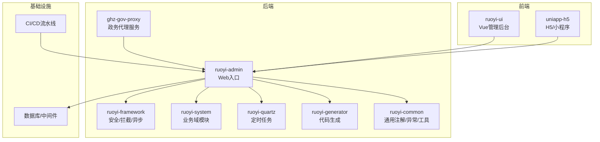
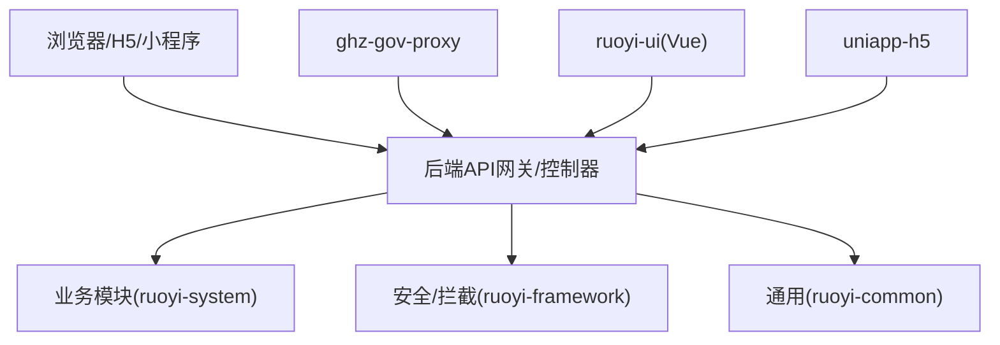
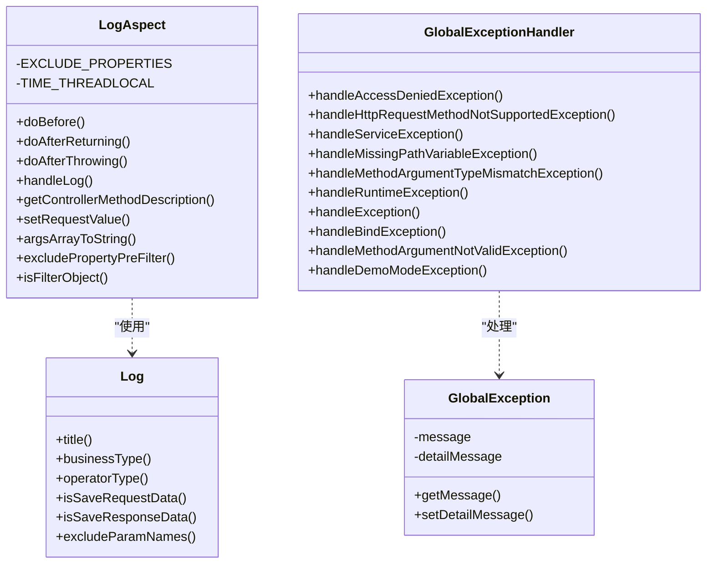
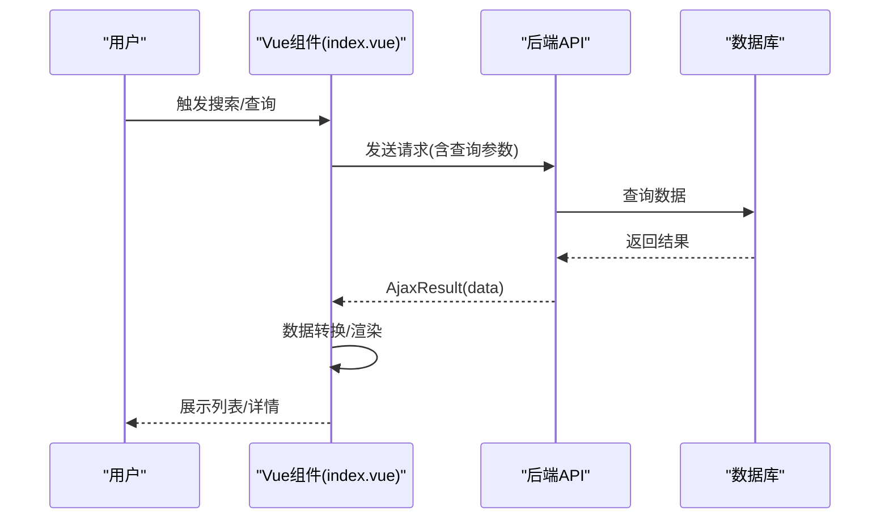
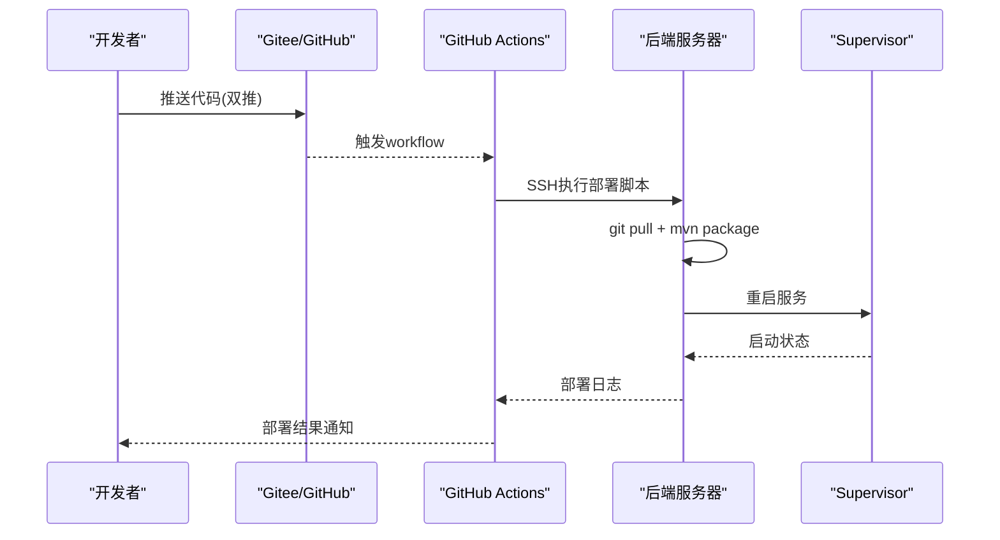
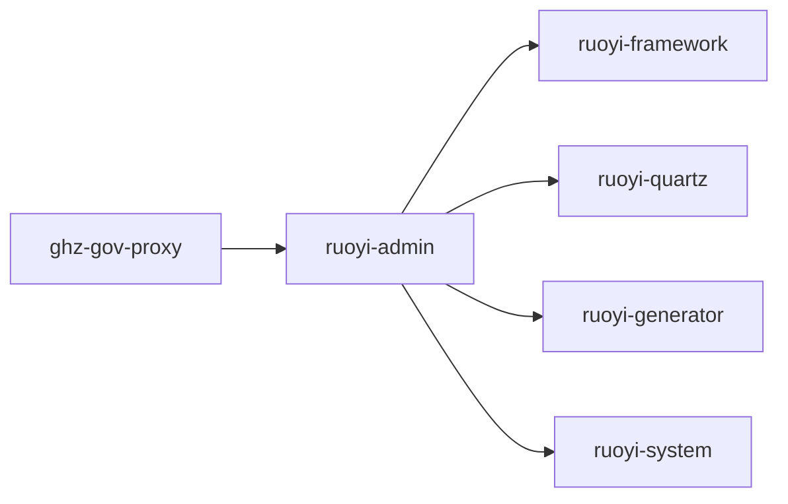

# 代码规范与最佳实践

<cite>
**本文引用的文件**
- [ruoyi-common/src/main/java/com/ruoyi/common/annotation/Log.java](file://ruoyi-common/src/main/java/com/ruoyi/common/annotation/Log.java)
- [ruoyi-framework/src/main/java/com/ruoyi/framework/aspectj/LogAspect.java](file://ruoyi-framework/src/main/java/com/ruoyi/framework/aspectj/LogAspect.java)
- [ruoyi-common/src/main/java/com/ruoyi/common/exception/GlobalException.java](file://ruoyi-common/src/main/java/com/ruoyi/common/exception/GlobalException.java)
- [ruoyi-framework/src/main/java/com/ruoyi/framework/web/exception/GlobalExceptionHandler.java](file://ruoyi-framework/src/main/java/com/ruoyi/framework/web/exception/GlobalExceptionHandler.java)
- [ruoyi-ui/package.json](file://ruoyi-ui/package.json)
- [uniapp-h5/package.json](file://uniapp-h5/package.json)
- [ruoyi-admin/pom.xml](file://ruoyi-admin/pom.xml)
- [ghz-gov-proxy/pom.xml](file://ghz-gov-proxy/pom.xml)
- [ruoyi-ui/src/views/gangzhu/house/index.vue](file://ruoyi-ui/src/views/gangzhu/house/index.vue)
- [uniapp-h5/pages/house/all.vue](file://uniapp-h5/pages/house/all.vue)
- [技术方案.md](file://技术方案.md)
- [gitee的ci-cd方案.md](file://gitee的ci-cd方案.md)
</cite>

## 目录
1. [引言](#引言)
2. [项目结构](#项目结构)
3. [核心组件](#核心组件)
4. [架构总览](#架构总览)
5. [详细组件分析](#详细组件分析)
6. [依赖分析](#依赖分析)
7. [性能考虑](#性能考虑)
8. [故障排查指南](#故障排查指南)
9. [结论](#结论)
10. [附录](#附录)

## 引言
本指南面向港好住信息系统开发团队，系统化梳理后端Java、前端Vue/UniApp、以及Git与CI/CD相关的代码规范与最佳实践，覆盖命名约定、类设计原则、异常处理、日志记录、注解使用、组件开发规范、跨平台开发规范、API设计规范、注释与文档标准、测试与质量保证、重构与性能优化、安全实践、质量检查工具与自动化流程等内容，帮助团队统一标准、提升协作效率与系统稳定性。

## 项目结构
本项目采用多模块Maven工程组织，后端基于Spring Boot与RuoYi框架，前端包含Vue管理后台与UniApp H5/小程序两套UI，辅以政务数据代理服务与SDK示例。整体结构清晰，模块职责边界明确，便于规范化开发与持续演进。

图表来源
- [ruoyi-admin/pom.xml:18-107](file://ruoyi-admin/pom.xml#L18-L107)
- [ghz-gov-proxy/pom.xml:27-94](file://ghz-gov-proxy/pom.xml#L27-L94)

章节来源
- [ruoyi-admin/pom.xml:18-107](file://ruoyi-admin/pom.xml#L18-L107)
- [ghz-gov-proxy/pom.xml:27-94](file://ghz-gov-proxy/pom.xml#L27-L94)

## 核心组件
围绕“日志记录”“全局异常处理”“前端构建与依赖管理”“跨平台组件与API调用”“CI/CD部署流程”等主题，形成贯穿前后端的关键规范与实现基线。

章节来源
- [ruoyi-common/src/main/java/com/ruoyi/common/annotation/Log.java:11-51](file://ruoyi-common/src/main/java/com/ruoyi/common/annotation/Log.java#L11-L51)
- [ruoyi-framework/src/main/java/com/ruoyi/framework/aspectj/LogAspect.java:36-137](file://ruoyi-framework/src/main/java/com/ruoyi/framework/aspectj/LogAspect.java#L36-L137)
- [ruoyi-common/src/main/java/com/ruoyi/common/exception/GlobalException.java:3-57](file://ruoyi-common/src/main/java/com/ruoyi/common/exception/GlobalException.java#L3-L57)
- [ruoyi-framework/src/main/java/com/ruoyi/framework/web/exception/GlobalExceptionHandler.java:22-145](file://ruoyi-framework/src/main/java/com/ruoyi/framework/web/exception/GlobalExceptionHandler.java#L22-L145)
- [ruoyi-ui/package.json:1-74](file://ruoyi-ui/package.json#L1-L74)
- [uniapp-h5/package.json:1-6](file://uniapp-h5/package.json#L1-L6)
- [gitee的ci-cd方案.md:1-328](file://gitee的ci-cd方案.md#L1-L328)

## 架构总览
系统采用“后端微模块 + 前端双端”的架构，后端通过统一的Web入口聚合各业务模块，前端分别提供管理后台与H5/小程序体验，并通过统一的API与后端交互。政务数据通过代理服务对接外部接口，确保安全与可控。

图表来源
- [ruoyi-admin/pom.xml:39-55](file://ruoyi-admin/pom.xml#L39-L55)
- [ruoyi-ui/package.json:26-50](file://ruoyi-ui/package.json#L26-L50)
- [uniapp-h5/package.json:1-6](file://uniapp-h5/package.json#L1-L6)

## 详细组件分析

### Java编码规范与最佳实践

- 命名约定
  - 包名：小写，采用反向域名或领域语义，如com.ruoyi、com.ghz。
  - 类名：帕斯卡命名，体现职责与领域，如GlobalExceptionHandler、LogAspect。
  - 方法/字段：驼峰命名，方法强调动作，字段强调状态，如doBefore、EXCLUDE_PROPERTIES。
  - 常量：全大写+下划线，如EXCLUDE_PROPERTIES、TIME_THREADLOCAL。
  - 注解与枚举：语义明确，如BusinessType、OperatorType。

- 类设计原则
  - 单一职责：日志切面仅处理操作日志记录，异常处理器仅处理异常映射。
  - 开闭原则：通过注解与AOP扩展日志维度，不修改既有控制器逻辑。
  - 依赖注入：组件使用@Component与@RestControllerAdvice，遵循Spring容器管理。

- 注解使用
  - 自定义注解@Log用于标记控制器方法的操作日志记录，支持模块、业务类型、请求/响应参数保存、排除字段等。
  - 注解生命周期：RetentionPolicy.RUNTIME，确保运行期可读取。

- 异常处理
  - 自定义全局异常GlobalException用于携带message与detailMessage，便于前后端区分提示与调试信息。
  - 全局异常处理器GlobalExceptionHandler统一捕获各类运行时异常、业务异常、参数校验异常等，返回AjaxResult，避免泄露内部堆栈细节。

- 日志记录
  - LogAspect通过AOP在方法执行前后记录操作日志，自动填充IP、URL、方法签名、请求参数、响应结果、耗时、状态等。
  - 敏感字段过滤：内置password等字段排除，支持注解excludeParamNames二次排除。
  - 异步落库：通过AsyncManager异步记录，避免阻塞主线程。

图表来源
- [ruoyi-common/src/main/java/com/ruoyi/common/annotation/Log.java:17-51](file://ruoyi-common/src/main/java/com/ruoyi/common/annotation/Log.java#L17-L51)
- [ruoyi-framework/src/main/java/com/ruoyi/framework/aspectj/LogAspect.java:41-256](file://ruoyi-framework/src/main/java/com/ruoyi/framework/aspectj/LogAspect.java#L41-L256)
- [ruoyi-common/src/main/java/com/ruoyi/common/exception/GlobalException.java:8-57](file://ruoyi-common/src/main/java/com/ruoyi/common/exception/GlobalException.java#L8-L57)
- [ruoyi-framework/src/main/java/com/ruoyi/framework/web/exception/GlobalExceptionHandler.java:27-145](file://ruoyi-framework/src/main/java/com/ruoyi/framework/web/exception/GlobalExceptionHandler.java#L27-L145)

章节来源
- [ruoyi-common/src/main/java/com/ruoyi/common/annotation/Log.java:11-51](file://ruoyi-common/src/main/java/com/ruoyi/common/annotation/Log.java#L11-L51)
- [ruoyi-framework/src/main/java/com/ruoyi/framework/aspectj/LogAspect.java:36-137](file://ruoyi-framework/src/main/java/com/ruoyi/framework/aspectj/LogAspect.java#L36-L137)
- [ruoyi-common/src/main/java/com/ruoyi/common/exception/GlobalException.java:3-57](file://ruoyi-common/src/main/java/com/ruoyi/common/exception/GlobalException.java#L3-L57)
- [ruoyi-framework/src/main/java/com/ruoyi/framework/web/exception/GlobalExceptionHandler.java:22-145](file://ruoyi-framework/src/main/java/com/ruoyi/framework/web/exception/GlobalExceptionHandler.java#L22-L145)

### JavaScript/TypeScript开发规范与Vue组件规范

- Vue组件开发规范
  - 单文件组件：模板、脚本、样式分离，保持单一职责。
  - 数据模型：使用响应式data，结合computed与watch处理派生状态。
  - 生命周期：在onLoad/onMounted等生命周期钩子中进行初始化与资源释放。
  - 事件与交互：通过$emit与父组件通信，避免直接操作DOM。
  - 样式：scoped样式隔离，组件样式命名采用BEM或语义化前缀。

- API接口设计规范
  - 统一响应格式：后端返回AjaxResult，包含code/msg/data等字段，前端统一解析。
  - 参数校验：后端使用@Valid与全局异常处理器，前端进行基础校验与友好提示。
  - 错误处理：前端捕获HTTP错误与业务错误，统一toast提示与日志上报。

- 示例：ruoyi-ui房源管理页面
  - 搜索与筛选：通过queryForm绑定查询参数，支持项目、楼栋、单元、状态等筛选。
  - 列表展示：el-table展示房源状态、精选、浏览次数等关键指标，支持分页。
  - 对话框：新增/修改/详情对话框，表单校验与提交流程清晰。
  - 权限指令：v-hasPermi控制按钮可见性，避免越权操作。

- 示例：uniapp-h5项目列表页
  - 搜索：支持关键词搜索与分页加载。
  - 数据转换：transformProjectData将后端数据映射为前端展示格式。
  - 图片处理：getImageUrl统一拼接静态资源与后端域名。
  - 错误提示：使用uni.showToast进行错误反馈。

图表来源
- [ruoyi-ui/src/views/gangzhu/house/index.vue:1-234](file://ruoyi-ui/src/views/gangzhu/house/index.vue#L1-L234)

章节来源
- [ruoyi-ui/src/views/gangzhu/house/index.vue:1-234](file://ruoyi-ui/src/views/gangzhu/house/index.vue#L1-L234)
- [uniapp-h5/pages/house/all.vue:63-195](file://uniapp-h5/pages/house/all.vue#L63-L195)

### uni-app跨平台开发规范
- 平台差异：H5与小程序在API、组件、样式方面存在差异，需通过条件编译与能力检测适配。
- 路由与页面：pages.json统一声明页面路径与样式，避免硬编码。
- 网络请求：封装统一的request工具，处理鉴权、重试、超时与错误提示。
- 资源管理：静态资源放置/static目录，网络图片拼接后端域名，避免跨域与路径问题。
- 组件复用：将公共组件抽取为独立模块，如ImageUpload、Pagination等。

章节来源
- [uniapp-h5/pages/house/all.vue:63-195](file://uniapp-h5/pages/house/all.vue#L63-L195)
- [uniapp-h5/package.json:1-6](file://uniapp-h5/package.json#L1-L6)

### Git版本控制规范
- 分支管理策略
  - main/master：稳定发布分支，仅允许通过PR合并。
  - develop：开发主分支，日常功能在此合并。
  - feature/*：功能开发分支，完成后合并至develop。
  - release/*：预发布分支，进行最终测试与修复。
  - hotfix/*：线上紧急修复分支，修复后同时合并至main与develop。

- 提交信息格式
  - 类型: 模块/简要描述
  - 示例: feat(system): 新增房源状态枚举与校验
  - 示例: fix(ui): 修复列表页筛选失效问题
  - 示例: chore(deps): 升级Element UI到最新版本
  - 示例: docs(readme): 更新部署流程说明

- 代码审查流程
  - PR必须关联Issue或需求文档，描述变更动机、影响范围与测试要点。
  - 至少一名Reviewer批准，冲突解决后方可合并。
  - 合并前确保通过CI检查与本地测试。

- 合并策略
  - Feature分支：squash合并，保留整洁提交历史。
  - Hotfix分支：rebase合并，保持线性历史。

### 代码注释与文档标准
- Java注释
  - 类与方法使用标准Javadoc，说明用途、参数、返回值、异常与注意事项。
  - 关键业务逻辑添加行内注释，解释复杂算法或特殊处理。
  - TODO/FIXME标记临时问题，明确负责人与截止日期。

- 前端注释
  - 组件方法添加函数注释，说明入参、出参与副作用。
  - API调用处添加调用链注释，便于追踪数据来源。
  - 样式命名遵循语义化，必要时添加注释说明作用域与兼容性。

- 文档编写
  - 技术方案与流程图：使用Mermaid绘制，便于版本管理与协作。
  - API文档：基于后端注解生成OpenAPI文档，前端按契约联调。
  - 部署与运维：提供可执行的部署脚本与CI/CD配置说明。

章节来源
- [技术方案.md:1-800](file://技术方案.md#L1-L800)

### 测试与质量保证
- 单元测试
  - Java：使用JUnit与Mockito对Service/Util进行单元测试，覆盖正常与异常分支。
  - 前端：使用Jest/Vue Test Utils对组件与工具函数进行测试，关注交互与渲染。
- 集成测试
  - 接口测试：使用Postman或Swagger对核心API进行冒烟与回归测试。
  - 端到端测试：使用Cypress或Playwright对关键业务流程进行端到端验证。
- 质量度量
  - 代码覆盖率：目标行覆盖率≥80%，分支覆盖率≥70%。
  - 规范检查：SonarQube/SpotBugs/PMD/ESLint等工具定期扫描。

### 代码重构指导原则
- 优先级：高频Bug、性能瓶颈、安全风险、可读性差的模块。
- 步骤：拆分大函数、消除重复代码、抽象公共逻辑、优化数据结构与算法。
- 风险控制：小步快跑，每次改动后运行测试与回归验证。

### 性能优化技巧
- 后端
  - 缓存：热点数据使用Redis缓存，设置合理TTL与淘汰策略。
  - 分页：大数据量查询强制分页，避免一次性加载。
  - 异步：耗时操作异步化，如日志、通知、报表生成。
  - 连接池：数据库连接池与线程池参数按QPS与RT调优。
- 前端
  - 懒加载：路由与组件懒加载，减少首屏体积。
  - 虚拟滚动：长列表使用虚拟滚动，降低DOM压力。
  - 图片优化：压缩与CDN加速，按需加载与占位图。
  - 状态管理：Vuex/Pinia按模块拆分，避免全局污染。

### 安全编码实践
- 输入校验：前后端双重校验，防止SQL注入、XSS、CSRF。
- 权限控制：RBAC权限模型，接口粒度校验与按钮级权限指令。
- 敏感信息：脱敏日志、加密存储、最小暴露原则。
- 传输安全：HTTPS/TLS，Token刷新与过期处理。
- 第三方集成：统一SDK封装与超时重试，异常降级与审计日志。

### 代码质量检查工具与自动化流程
- Java
  - SonarQube：静态扫描与质量门禁。
  - SpotBugs/PMD：缺陷与规范检查。
  - Checkstyle：编码风格统一。
- 前端
  - ESLint：JS/TS/HTML/CSS规范检查。
  - Stylelint：CSS规范检查。
  - Prettier：代码格式化。
- CI/CD
  - GitHub Actions：触发部署脚本，服务器侧拉取代码并编译重启。
  - 依赖镜像：服务器配置Maven阿里云镜像，加速依赖下载。
  - 健康检查：部署后等待并检查服务状态，失败自动回滚。

图表来源
- [gitee的ci-cd方案.md:10-256](file://gitee的ci-cd方案.md#L10-L256)

章节来源
- [gitee的ci-cd方案.md:1-328](file://gitee的ci-cd方案.md#L1-L328)

## 依赖分析
- 后端依赖
  - ruoyi-admin依赖ruoyi-framework、ruoyi-quartz、ruoyi-generator等模块，引入Spring Doc、MySQL驱动、微信支付SDK、e签宝SDK等。
  - ghz-gov-proxy依赖HTTP客户端、JSON解析、WebSocket、加密库等，封装政务接口调用。
- 前端依赖
  - ruoyi-ui基于Vue2与Element UI，依赖axios、jsencrypt、nprogress等。
  - uniapp-h5依赖smooth-signature等插件，适配H5与小程序环境。

图表来源
- [ruoyi-admin/pom.xml:39-55](file://ruoyi-admin/pom.xml#L39-L55)
- [ghz-gov-proxy/pom.xml:27-94](file://ghz-gov-proxy/pom.xml#L27-L94)

章节来源
- [ruoyi-admin/pom.xml:18-107](file://ruoyi-admin/pom.xml#L18-L107)
- [ghz-gov-proxy/pom.xml:27-94](file://ghz-gov-proxy/pom.xml#L27-L94)

## 性能考虑
- 后端
  - 控制日志体量，避免大对象频繁序列化；异步记录操作日志。
  - 合理设置分页大小与索引，避免全表扫描。
  - 缓存热点数据，如字典、配置、用户信息。
- 前端
  - 首屏优化：拆分vendor与业务包，按需加载。
  - 图片与媒体：CDN加速、懒加载、WebP格式。
  - 交互优化：节流防抖、骨架屏与占位图。

## 故障排查指南
- 日志定位
  - 查看后端日志：GlobalExceptionHandler统一记录异常，结合LogAspect记录的操作日志定位问题。
  - 前端错误：通过控制台与Network面板定位接口错误与参数问题。
- 常见问题
  - 依赖下载慢：服务器配置Maven镜像，首次构建耗时较长属正常。
  - 部署失败：检查Supervisor状态与日志，确认回滚是否生效。
  - 跨平台差异：uniapp组件与API差异，使用条件编译与能力检测。

章节来源
- [ruoyi-framework/src/main/java/com/ruoyi/framework/web/exception/GlobalExceptionHandler.java:95-113](file://ruoyi-framework/src/main/java/com/ruoyi/framework/web/exception/GlobalExceptionHandler.java#L95-L113)
- [ruoyi-framework/src/main/java/com/ruoyi/framework/aspectj/LogAspect.java:127-136](file://ruoyi-framework/src/main/java/com/ruoyi/framework/aspectj/LogAspect.java#L127-L136)
- [gitee的ci-cd方案.md:277-327](file://gitee的ci-cd方案.md#L277-L327)

## 结论
本指南从Java编码、前端开发、Git与CI/CD三个维度，结合项目现有实现，给出了可落地的规范与最佳实践。建议团队在日常开发中严格执行命名、注释、异常与日志、权限与安全、性能与质量等规范，持续完善自动化流程，提升系统稳定性与交付效率。

## 附录
- 术语表
  - AjaxResult：后端统一响应包装对象。
  - SysOperLog：操作日志实体。
  - GlobalException：全局异常类。
  - LogAspect：操作日志AOP切面。
  - GlobalExceptionHandler：全局异常处理器。
  - CI/CD：持续集成与持续部署。
- 参考文档
  - 技术方案与流程图：见技术方案.md。
  - CI/CD部署方案：见gitee的ci-cd方案.md。