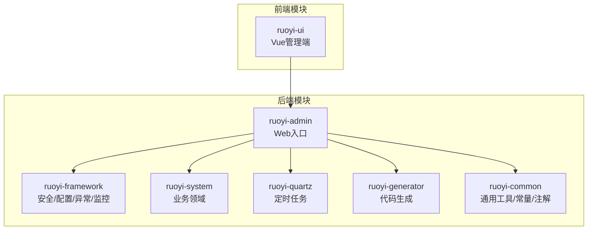
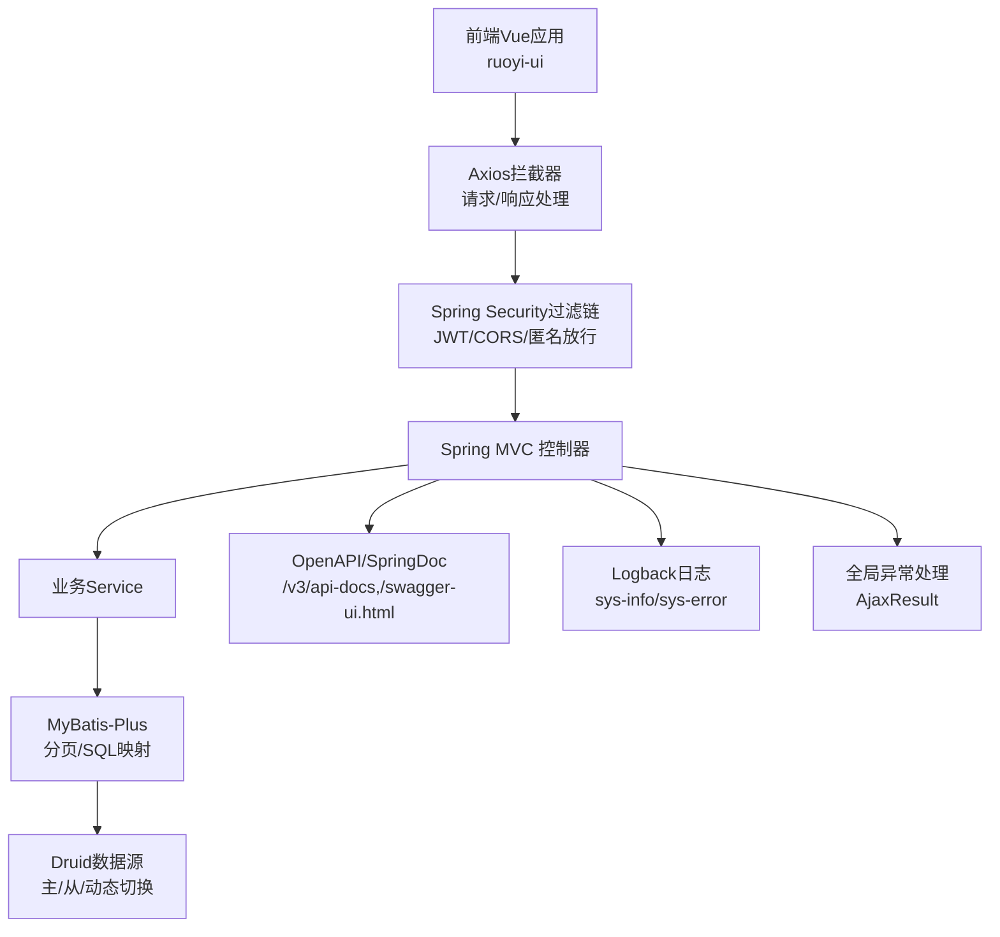
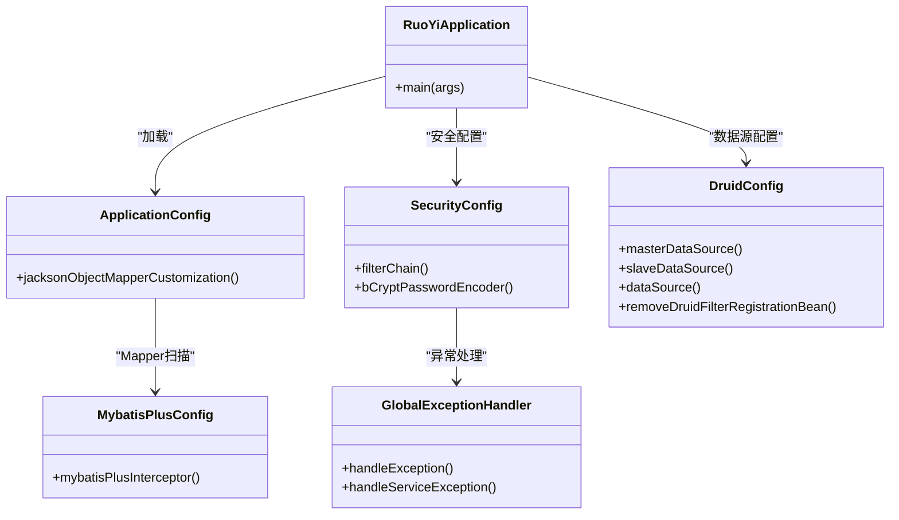
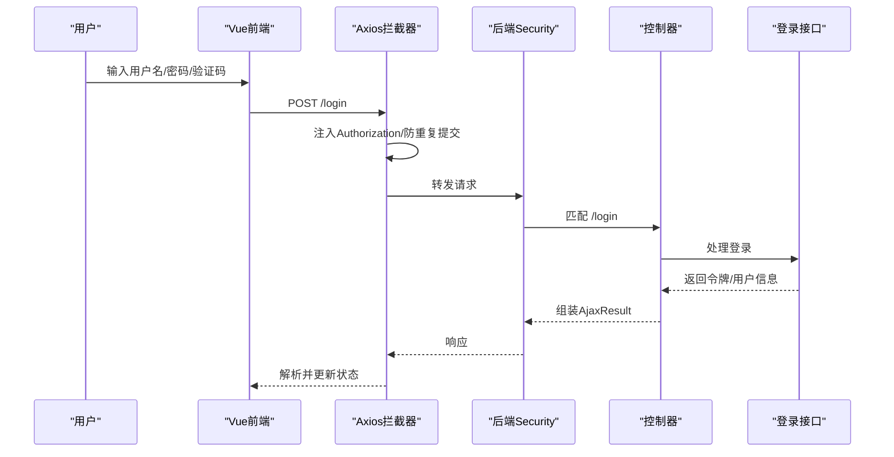
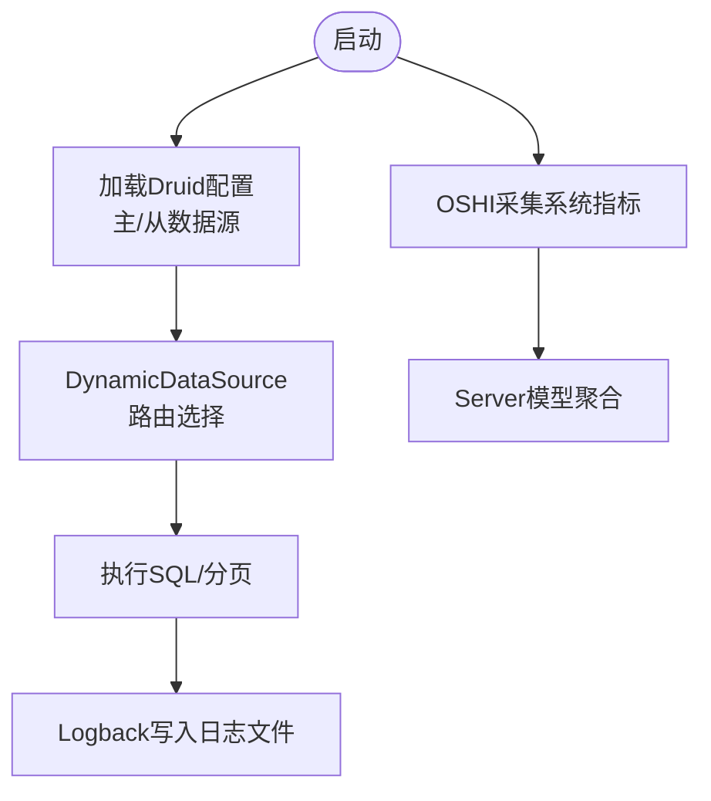
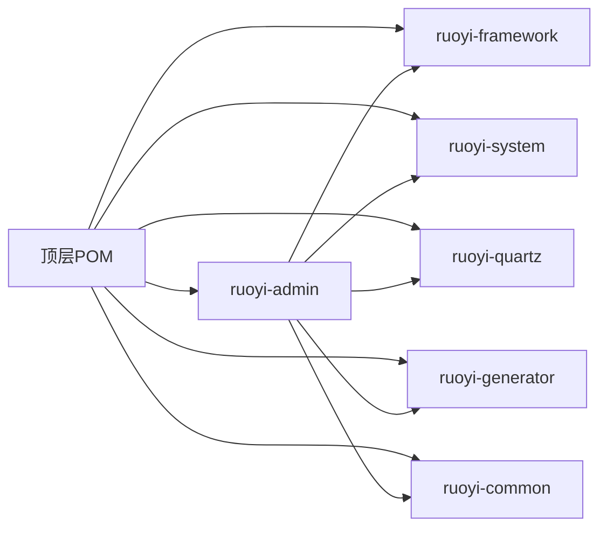

# 开发工具与调试技巧

<cite>
**本文引用的文件**   
- [pom.xml](file://pom.xml)
- [ruoyi-admin/pom.xml](file://ruoyi-admin/pom.xml)
- [ruoyi-admin/src/main/resources/application.yml](file://ruoyi-admin/src/main/resources/application.yml)
- [ruoyi-admin/src/main/resources/logback.xml](file://ruoyi-admin/src/main/resources/logback.xml)
- [ruoyi-admin/src/main/java/com/ruoyi/RuoYiApplication.java](file://ruoyi-admin/src/main/java/com/ruoyi/RuoYiApplication.java)
- [ruoyi-framework/src/main/java/com/ruoyi/framework/config/ApplicationConfig.java](file://ruoyi-framework/src/main/java/com/ruoyi/framework/config/ApplicationConfig.java)
- [ruoyi-framework/src/main/java/com/ruoyi/framework/config/DruidConfig.java](file://ruoyi-framework/src/main/java/com/ruoyi/framework/config/DruidConfig.java)
- [ruoyi-framework/src/main/java/com/ruoyi/framework/config/SecurityConfig.java](file://ruoyi-framework/src/main/java/com/ruoyi/framework/config/SecurityConfig.java)
- [ruoyi-framework/src/main/java/com/ruoyi/framework/config/MybatisPlusConfig.java](file://ruoyi-framework/src/main/java/com/ruoyi/framework/config/MybatisPlusConfig.java)
- [ruoyi-framework/src/main/java/com/ruoyi/framework/web/domain/Server.java](file://ruoyi-framework/src/main/java/com/ruoyi/framework/web/domain/Server.java)
- [ruoyi-framework/src/main/java/com/ruoyi/framework/web/exception/GlobalExceptionHandler.java](file://ruoyi-framework/src/main/java/com/ruoyi/framework/web/exception/GlobalExceptionHandler.java)
- [ruoyi-ui/package.json](file://ruoyi-ui/package.json)
- [ruoyi-ui/vue.config.js](file://ruoyi-ui/vue.config.js)
- [ruoyi-ui/src/utils/request.js](file://ruoyi-ui/src/utils/request.js)
- [ruoyi-ui/src/api/login.js](file://ruoyi-ui/src/api/login.js)
- [bin/run.bat](file://bin/run.bat)
</cite>

## 目录
1. [简介](#简介)
2. [项目结构](#项目结构)
3. [核心组件](#核心组件)
4. [架构总览](#架构总览)
5. [详细组件分析](#详细组件分析)
6. [依赖分析](#依赖分析)
7. [性能考虑](#性能考虑)
8. [故障排查指南](#故障排查指南)
9. [结论](#结论)
10. [附录](#附录)

## 简介
本指南面向港好住信息系统开发团队，聚焦开发过程中的工具与调试技巧，涵盖接口测试、文档生成、数据库管理、日志分析、断点调试、网络请求调试、数据库查询调试、性能分析（JVM/前端/数据库）、代码质量分析（SonarQube/静态分析/覆盖率）、常见问题诊断（内存泄漏/性能瓶颈/并发/网络异常），以及开发效率提升与自动化脚本实践。文档结合仓库现有配置与代码，给出可落地的实操建议与可视化图示。

## 项目结构
本项目采用多模块 Maven 结构，后端基于 Spring Boot 3 + MyBatis-Plus，前端基于 Vue 2 + Element UI，配合 Druid 数据源、OpenAPI/SpringDoc 文档、安全与跨域配置、统一异常处理与日志体系。

图表来源
- [pom.xml:184-192](file://pom.xml#L184-L192)
- [ruoyi-admin/pom.xml:10-140](file://ruoyi-admin/pom.xml#L10-L140)

章节来源
- [pom.xml:184-192](file://pom.xml#L184-L192)
- [ruoyi-admin/pom.xml:10-140](file://ruoyi-admin/pom.xml#L10-L140)

## 核心组件
- 启动入口与排除自动数据源配置，便于自定义多数据源与 Druid 初始化
- 安全与跨域：基于 Spring Security 的无状态 JWT 过滤链，开放匿名访问路径与 Swagger/Druid 页面
- ORM 与分页：MyBatis-Plus 分页插件，MySQL 适配
- 数据源：Druid 多数据源与去广告过滤器
- 统一日志：Logback 滚动文件与控制台输出
- 前端请求：Axios 拦截器、重复提交防护、统一错误提示
- 文档：springdoc-openapi 自动生成 OpenAPI/Swagger UI

章节来源
- [RuoYiApplication.java:12-21](file://ruoyi-admin/src/main/java/com/ruoyi/RuoYiApplication.java#L12-L21)
- [SecurityConfig.java:86-124](file://ruoyi-framework/src/main/java/com/ruoyi/framework/config/SecurityConfig.java#L86-L124)
- [MybatisPlusConfig.java:20-26](file://ruoyi-framework/src/main/java/com/ruoyi/framework/config/MybatisPlusConfig.java#L20-L26)
- [DruidConfig.java:35-79](file://ruoyi-framework/src/main/java/com/ruoyi/framework/config/DruidConfig.java#L35-L79)
- [logback.xml:1-93](file://ruoyi-admin/src/main/resources/logback.xml#L1-L93)
- [request.js:23-80](file://ruoyi-ui/src/utils/request.js#L23-L80)
- [application.yml:135-148](file://ruoyi-admin/src/main/resources/application.yml#L135-L148)

## 架构总览
后端通过 Web 入口对外提供 REST API，前端通过 Axios 发起请求，经由安全过滤链与业务控制器处理，持久层使用 MyBatis-Plus 与 Druid 数据源，日志与异常统一收敛。

图表来源
- [SecurityConfig.java:86-124](file://ruoyi-framework/src/main/java/com/ruoyi/framework/config/SecurityConfig.java#L86-L124)
- [MybatisPlusConfig.java:20-26](file://ruoyi-framework/src/main/java/com/ruoyi/framework/config/MybatisPlusConfig.java#L20-L26)
- [DruidConfig.java:35-79](file://ruoyi-framework/src/main/java/com/ruoyi/framework/config/DruidConfig.java#L35-L79)
- [application.yml:135-148](file://ruoyi-admin/src/main/resources/application.yml#L135-L148)
- [logback.xml:1-93](file://ruoyi-admin/src/main/resources/logback.xml#L1-L93)
- [GlobalExceptionHandler.java:27-146](file://ruoyi-framework/src/main/java/com/ruoyi/framework/web/exception/GlobalExceptionHandler.java#L27-L146)

## 详细组件分析

### 后端启动与配置组件
- 启动类排除数据源自动装配，确保自定义 Druid 初始化生效
- Mapper 扫描路径集中配置，便于统一管理
- OpenAPI/SpringDoc 文档路径与分组扫描配置

图表来源
- [RuoYiApplication.java:12-21](file://ruoyi-admin/src/main/java/com/ruoyi/RuoYiApplication.java#L12-L21)
- [ApplicationConfig.java:22-37](file://ruoyi-framework/src/main/java/com/ruoyi/framework/config/ApplicationConfig.java#L22-L37)
- [SecurityConfig.java:86-134](file://ruoyi-framework/src/main/java/com/ruoyi/framework/config/SecurityConfig.java#L86-L134)
- [MybatisPlusConfig.java:20-26](file://ruoyi-framework/src/main/java/com/ruoyi/framework/config/MybatisPlusConfig.java#L20-L26)
- [DruidConfig.java:35-125](file://ruoyi-framework/src/main/java/com/ruoyi/framework/config/DruidConfig.java#L35-L125)
- [GlobalExceptionHandler.java:27-146](file://ruoyi-framework/src/main/java/com/ruoyi/framework/web/exception/GlobalExceptionHandler.java#L27-L146)

章节来源
- [RuoYiApplication.java:12-21](file://ruoyi-admin/src/main/java/com/ruoyi/RuoYiApplication.java#L12-L21)
- [ApplicationConfig.java:22-37](file://ruoyi-framework/src/main/java/com/ruoyi/framework/config/ApplicationConfig.java#L22-L37)
- [SecurityConfig.java:86-134](file://ruoyi-framework/src/main/java/com/ruoyi/framework/config/SecurityConfig.java#L86-L134)
- [MybatisPlusConfig.java:20-26](file://ruoyi-framework/src/main/java/com/ruoyi/framework/config/MybatisPlusConfig.java#L20-L26)
- [DruidConfig.java:35-125](file://ruoyi-framework/src/main/java/com/ruoyi/framework/config/DruidConfig.java#L35-L125)
- [GlobalExceptionHandler.java:27-146](file://ruoyi-framework/src/main/java/com/ruoyi/framework/web/exception/GlobalExceptionHandler.java#L27-L146)

### 前端请求与登录流程
- Axios 拦截器：自动注入 Authorization、GET 参数序列化、重复提交检测、二进制下载处理
- 登录接口：POST /login，验证码接口 /captchaImage
- 开发代理：将 /api 前缀代理至后端，同时代理 /v3/api-docs 到 Swagger UI

图表来源
- [request.js:23-80](file://ruoyi-ui/src/utils/request.js#L23-L80)
- [login.js:4-20](file://ruoyi-ui/src/api/login.js#L4-L20)
- [vue.config.js:37-51](file://ruoyi-ui/vue.config.js#L37-L51)
- [SecurityConfig.java:100-115](file://ruoyi-framework/src/main/java/com/ruoyi/framework/config/SecurityConfig.java#L100-L115)

章节来源
- [request.js:23-131](file://ruoyi-ui/src/utils/request.js#L23-L131)
- [login.js:4-60](file://ruoyi-ui/src/api/login.js#L4-L60)
- [vue.config.js:37-51](file://ruoyi-ui/vue.config.js#L37-L51)
- [SecurityConfig.java:100-115](file://ruoyi-framework/src/main/java/com/ruoyi/framework/config/SecurityConfig.java#L100-L115)

### 数据库与日志组件
- Druid 多数据源：主/从数据源按条件启用，动态路由
- 日志：控制台 + 按日期滚动的 info/error 文件，用户操作日志独立 logger
- 服务器监控：基于 OSHI 的 CPU/内存/JVM/磁盘采集

图表来源
- [DruidConfig.java:35-79](file://ruoyi-framework/src/main/java/com/ruoyi/framework/config/DruidConfig.java#L35-L79)
- [logback.xml:16-92](file://ruoyi-admin/src/main/resources/logback.xml#L16-L92)
- [Server.java:108-240](file://ruoyi-framework/src/main/java/com/ruoyi/framework/web/domain/Server.java#L108-L240)

章节来源
- [DruidConfig.java:35-125](file://ruoyi-framework/src/main/java/com/ruoyi/framework/config/DruidConfig.java#L35-L125)
- [logback.xml:16-92](file://ruoyi-admin/src/main/resources/logback.xml#L16-L92)
- [Server.java:108-240](file://ruoyi-framework/src/main/java/com/ruoyi/framework/web/domain/Server.java#L108-L240)

## 依赖分析
- 后端依赖管理集中在顶层 POM，模块间通过 artifactId 引用
- ruoyi-admin 作为 Web 入口，依赖 framework/system/quartz/generator/common，并引入第三方 SDK 与支付/签名依赖
- 前端依赖 Vue 2 与 Element UI，开发脚本与构建配置位于 vue.config.js

图表来源
- [pom.xml:184-192](file://pom.xml#L184-L192)
- [ruoyi-admin/pom.xml:39-56](file://ruoyi-admin/pom.xml#L39-L56)

章节来源
- [pom.xml:184-192](file://pom.xml#L184-L192)
- [ruoyi-admin/pom.xml:39-56](file://ruoyi-admin/pom.xml#L39-L56)

## 性能考虑
- JVM 与系统监控
  - 启动脚本设置堆与元空间参数，便于观察内存占用
  - 服务器监控组件提供 CPU/内存/JVM/磁盘使用率，可用于定位性能瓶颈
- 前端性能
  - 构建阶段开启 gzip 压缩与分包策略，减少首屏体积
  - Axios 超时与错误提示，避免长时间挂起
- 数据库性能
  - Druid 提供连接池与 SQL 监控，结合慢查询日志定位热点
  - MyBatis-Plus 分页插件，避免一次性拉取大量数据
- 配置建议
  - 调整 Tomcat 线程池与 AcceptCount，提升并发承载
  - Redis 连接池参数按业务峰值调优

章节来源
- [bin/run.bat:9-11](file://bin/run.bat#L9-L11)
- [Server.java:108-240](file://ruoyi-framework/src/main/java/com/ruoyi/framework/web/domain/Server.java#L108-L240)
- [vue.config.js:70-78](file://ruoyi-ui/vue.config.js#L70-L78)
- [request.js:20-21](file://ruoyi-ui/src/utils/request.js#L20-L21)
- [MybatisPlusConfig.java:20-26](file://ruoyi-framework/src/main/java/com/ruoyi/framework/config/MybatisPlusConfig.java#L20-L26)
- [DruidConfig.java:35-79](file://ruoyi-framework/src/main/java/com/ruoyi/framework/config/DruidConfig.java#L35-L79)
- [application.yml:20-36](file://ruoyi-admin/src/main/resources/application.yml#L20-L36)
- [application.yml:72-94](file://ruoyi-admin/src/main/resources/application.yml#L72-L94)

## 故障排查指南
- 断点调试
  - 后端：IDE 设置断点于控制器/Service 层，结合日志查看请求上下文
  - 前端：浏览器开发者工具断点于 Axios 拦截器或 API 调用处
- 日志调试
  - 查看控制台与滚动日志文件，关注 INFO/ERROR 分类
  - 关注用户操作日志与系统异常栈
- 网络请求调试
  - 使用浏览器 Network 面板观察 /api 前缀请求与响应状态
  - 若 Swagger UI 无法访问，确认匿名放行路径与代理配置
- 数据库查询调试
  - 通过 Druid 监控页面查看 SQL 执行情况与连接池状态
  - 使用分页避免全表扫描
- 常见问题定位
  - 403/权限不足：检查 SecurityConfig 的放行路径与 JWT 有效性
  - 500/系统异常：查看全局异常处理器返回的错误信息
  - 超时/网络错误：前端 Axios 错误提示与后端超时配置
  - 内存/GC 问题：结合 JVM 指标与启动参数调整

章节来源
- [logback.xml:16-92](file://ruoyi-admin/src/main/resources/logback.xml#L16-L92)
- [GlobalExceptionHandler.java:35-144](file://ruoyi-framework/src/main/java/com/ruoyi/framework/web/exception/GlobalExceptionHandler.java#L35-L144)
- [SecurityConfig.java:100-123](file://ruoyi-framework/src/main/java/com/ruoyi/framework/config/SecurityConfig.java#L100-L123)
- [DruidConfig.java:84-125](file://ruoyi-framework/src/main/java/com/ruoyi/framework/config/DruidConfig.java#L84-L125)
- [request.js:118-131](file://ruoyi-ui/src/utils/request.js#L118-L131)
- [application.yml:135-148](file://ruoyi-admin/src/main/resources/application.yml#L135-L148)

## 结论
本指南基于仓库现有配置与代码，给出了后端/前端/数据库/日志/安全/文档等全链路的工具与调试方法。建议团队在日常开发中：
- 优先使用内置的 OpenAPI/Swagger 文档与 Druid 监控
- 通过统一异常与日志快速定位问题
- 借助前端拦截器与代理提升联调效率
- 结合服务器监控与分页策略进行性能优化

## 附录

### 开发工具与调试清单
- 接口测试
  - Postman：导入 OpenAPI/Swagger 导出的集合，或直接访问 /v3/api-docs 下载 JSON
  - Swagger UI：/swagger-ui.html
- 文档生成
  - springdoc-openapi 已启用，路径与分组在 application.yml 中配置
- 数据库管理
  - Druid 监控：/druid，含 SQL 与连接池监控
  - MyBatis-Plus 分页：自动注入分页插件
- 日志分析
  - 控制台 + 滚动日志文件，按 INFO/ERROR 分类
  - 用户操作日志独立 logger 输出
- 前端调试
  - 开发代理：/api 前缀代理至后端，/v3/api-docs 也做代理
  - Axios 拦截器：统一注入 Authorization、防重复提交、错误提示
- 性能分析
  - JVM：启动脚本参数与 Server 指标采集
  - 前端：gzip 与分包策略
  - 数据库：Druid 连接池与慢 SQL 监控
- 代码质量
  - 建议集成 SonarQube，结合静态分析与覆盖率统计
- 自动化与效率
  - Maven/Gradle 构建脚本、前后端开发脚本、部署脚本
  - 前端构建产物与代理配置

章节来源
- [application.yml:135-148](file://ruoyi-admin/src/main/resources/application.yml#L135-L148)
- [DruidConfig.java:84-125](file://ruoyi-framework/src/main/java/com/ruoyi/framework/config/DruidConfig.java#L84-L125)
- [MybatisPlusConfig.java:20-26](file://ruoyi-framework/src/main/java/com/ruoyi/framework/config/MybatisPlusConfig.java#L20-L26)
- [logback.xml:16-92](file://ruoyi-admin/src/main/resources/logback.xml#L16-L92)
- [vue.config.js:37-51](file://ruoyi-ui/vue.config.js#L37-L51)
- [request.js:23-131](file://ruoyi-ui/src/utils/request.js#L23-L131)
- [bin/run.bat:9-11](file://bin/run.bat#L9-L11)
- [ruoyi-ui/package.json:7-12](file://ruoyi-ui/package.json#L7-L12)