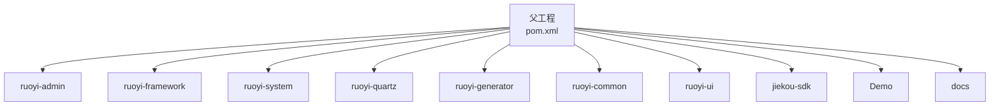
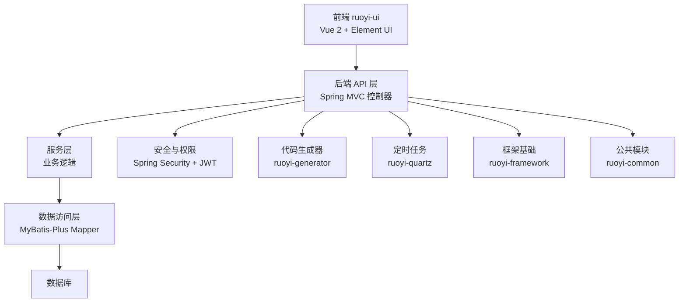
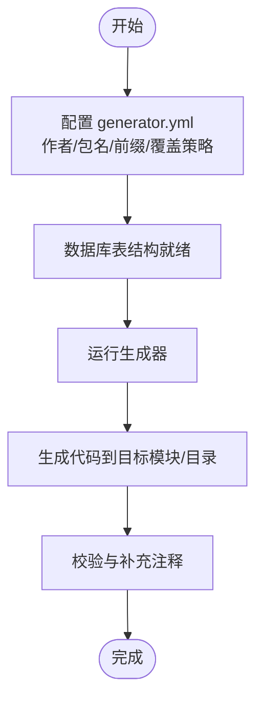
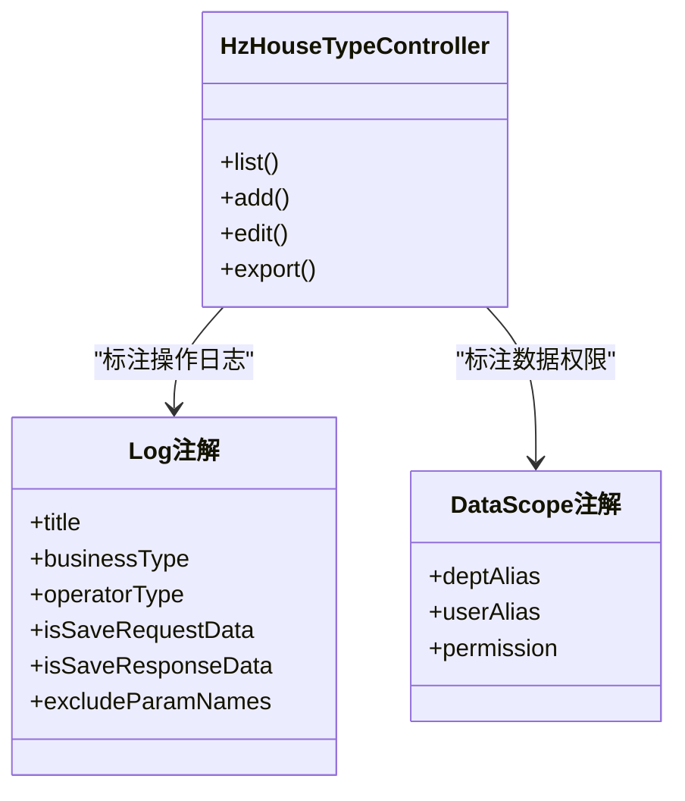
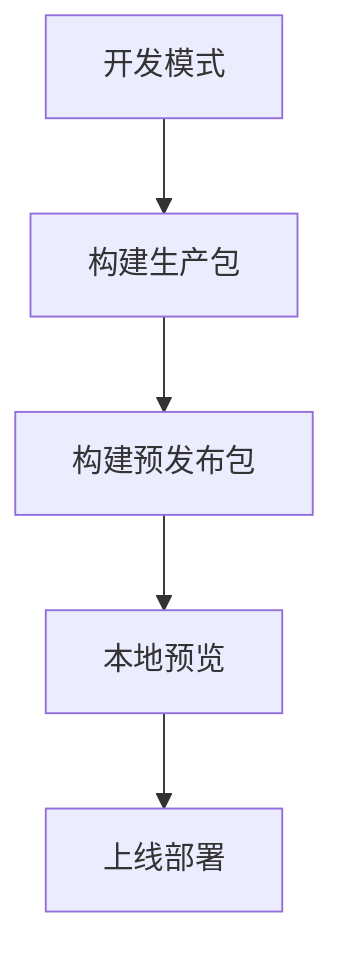
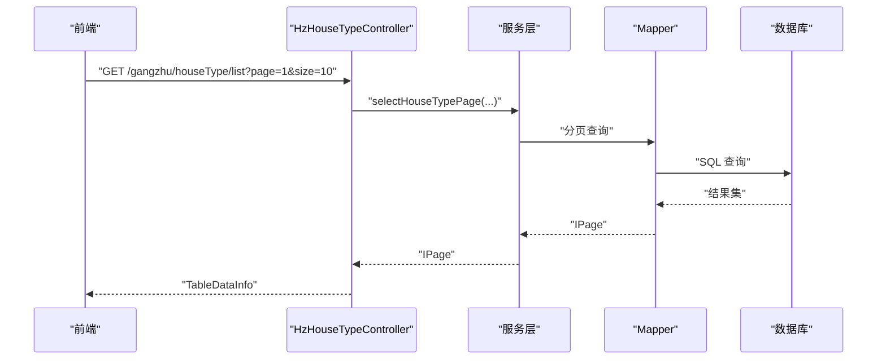
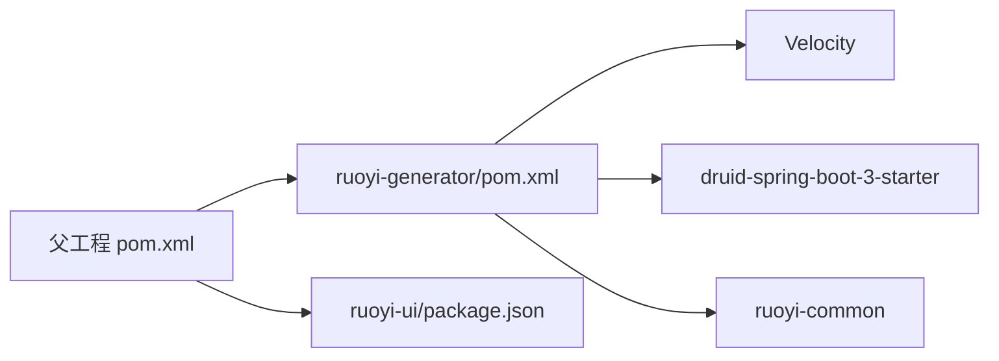

# 开发指南

<cite>
**本文引用的文件**
- [pom.xml](file://pom.xml)
- [ruoyi-generator/pom.xml](file://ruoyi-generator/pom.xml)
- [ruoyi-generator/src/main/resources/generator.yml](file://ruoyi-generator/src/main/resources/generator.yml)
- [ruoyi-common/src/main/java/com/ruoyi/common/constant/Constants.java](file://ruoyi-common/src/main/java/com/ruoyi/common/constant/Constants.java)
- [ruoyi-common/src/main/java/com/ruoyi/common/constant/UserConstants.java](file://ruoyi-common/src/main/java/com/ruoyi/common/constant/UserConstants.java)
- [ruoyi-common/src/main/java/com/ruoyi/common/annotation/Log.java](file://ruoyi-common/src/main/java/com/ruoyi/common/annotation/Log.java)
- [ruoyi-common/src/main/java/com/ruoyi/common/annotation/DataScope.java](file://ruoyi-common/src/main/java/com/ruoyi/common/annotation/DataScope.java)
- [ruoyi-common/src/main/java/com/ruoyi/common/annotation/Excel.java](file://ruoyi-common/src/main/java/com/ruoyi/common/annotation/Excel.java)
- [ruoyi-framework/src/main/java/com/ruoyi/framework/config/ApplicationConfig.java](file://ruoyi-framework/src/main/java/com/ruoyi/framework/config/ApplicationConfig.java)
- [ruoyi-system/src/main/java/com/ruoyi/system/controller/HzHouseTypeController.java](file://ruoyi-system/src/main/java/com/ruoyi/system/controller/HzHouseTypeController.java)
- [ruoyi-ui/package.json](file://ruoyi-ui/package.json)
- [ruoyi-ui/.editorconfig](file://ruoyi-ui/.editorconfig)
- [ruoyi-ui/src/settings.js](file://ruoyi-ui/src/settings.js)
- [docs/数据字典/01-房源管理.md](file://docs/数据字典/01-房源管理.md)
</cite>

## 目录
1. [简介](#简介)
2. [项目结构](#项目结构)
3. [核心组件](#核心组件)
4. [架构总览](#架构总览)
5. [详细组件分析](#详细组件分析)
6. [依赖分析](#依赖分析)
7. [性能考虑](#性能考虑)
8. [故障排查指南](#故障排查指南)
9. [结论](#结论)
10. [附录](#附录)

## 简介
本开发指南面向港好住信息系统（基于 RuoYi 体系）的后端与前端开发者，目标是帮助团队统一开发环境、规范编码与提交、高效使用代码生成器、遵循组件与 API 设计原则，并提供常见问题的解决方案与性能优化建议。文档同时给出工具推荐、调试技巧与团队协作规范，确保跨模块协作的一致性与可维护性。

## 项目结构
本仓库采用多模块 Maven 结构，后端由若干子模块组成，前端为独立 Vue 2 项目，另有接口 SDK 与演示资源。核心模块包括：
- 后端父工程：统一版本、依赖与插件管理
- ruoyi-admin：管理端应用入口
- ruoyi-framework：安全、拦截、事务、异步、定时任务等基础设施
- ruoyi-system：业务模块（如房源、户型、合同等）
- ruoyi-quartz：定时任务模块
- ruoyi-generator：代码生成器
- ruoyi-common：公共常量、注解、工具与异常体系
- ruoyi-ui：Vue 管理后台前端
- jiekou-sdk：外部接口 SDK（Java 版本族）
- Demo：前后端演示与文档
- docs：数据字典与开发文档

图表来源
- [pom.xml:184-191](file://pom.xml#L184-L191)

章节来源
- [pom.xml:1-240](file://pom.xml#L1-L240)

## 核心组件
- 代码生成器：基于 Velocity 模板，支持 Java/JS/Vue/XML 等多语言代码与前端页面生成，可配置作者、包名、表前缀与覆盖策略。
- 常量与注解：集中定义系统常量、用户常量、日志注解、数据权限注解、Excel 导出注解等，统一业务与基础设施行为。
- 前端工程：Vue CLI 项目，包含 Element UI、Axios、路由、Vuex、权限指令与主题配置。
- 应用配置：MyBatis Mapper 扫描、Jackson 时区配置、AOP 代理启用等。

章节来源
- [ruoyi-generator/src/main/resources/generator.yml:1-12](file://ruoyi-generator/src/main/resources/generator.yml#L1-L12)
- [ruoyi-common/src/main/java/com/ruoyi/common/constant/Constants.java:1-174](file://ruoyi-common/src/main/java/com/ruoyi/common/constant/Constants.java#L1-L174)
- [ruoyi-common/src/main/java/com/ruoyi/common/constant/UserConstants.java:1-82](file://ruoyi-common/src/main/java/com/ruoyi/common/constant/UserConstants.java#L1-L82)
- [ruoyi-common/src/main/java/com/ruoyi/common/annotation/Log.java:1-52](file://ruoyi-common/src/main/java/com/ruoyi/common/annotation/Log.java#L1-L52)
- [ruoyi-common/src/main/java/com/ruoyi/common/annotation/DataScope.java:1-34](file://ruoyi-common/src/main/java/com/ruoyi/common/annotation/DataScope.java#L1-L34)
- [ruoyi-common/src/main/java/com/ruoyi/common/annotation/Excel.java:1-198](file://ruoyi-common/src/main/java/com/ruoyi/common/annotation/Excel.java#L1-L198)
- [ruoyi-framework/src/main/java/com/ruoyi/framework/config/ApplicationConfig.java:1-38](file://ruoyi-framework/src/main/java/com/ruoyi/framework/config/ApplicationConfig.java#L1-L38)
- [ruoyi-ui/package.json:1-74](file://ruoyi-ui/package.json#L1-L74)
- [ruoyi-ui/.editorconfig:1-23](file://ruoyi-ui/.editorconfig#L1-L23)
- [ruoyi-ui/src/settings.js:1-57](file://ruoyi-ui/src/settings.js#L1-L57)

## 架构总览
后端采用 Spring Boot + MyBatis-Plus + Spring Security + JWT 的分层架构，前端 Vue 通过 Axios 访问后端 REST API。定时任务模块提供周期性业务处理能力；代码生成器辅助快速落地 CRUD 与前端页面；公共模块提供统一常量、注解与工具。

图表来源
- [pom.xml:184-191](file://pom.xml#L184-L191)
- [ruoyi-generator/pom.xml:1-40](file://ruoyi-generator/pom.xml#L1-L40)
- [ruoyi-framework/src/main/java/com/ruoyi/framework/config/ApplicationConfig.java:17-37](file://ruoyi-framework/src/main/java/com/ruoyi/framework/config/ApplicationConfig.java#L17-L37)

## 详细组件分析

### 代码生成器使用指南
- 生成范围：支持 Java 实体、Mapper、Service、Controller、前端 JS API、前端 Vue 页面、XML 映射等。
- 配置项：作者、默认包名、是否自动去除表前缀、表前缀集合、是否允许覆盖本地文件等。
- 使用步骤（概述）：
  1) 在 generator.yml 中配置作者、包名、表前缀与覆盖策略；
  2) 在数据库中准备表结构；
  3) 运行生成器模块，输出到指定模块或自定义目录；
  4) 校验生成代码，补充业务细节与注释。
- 注意事项：
  - 若需生成前端页面，确保前端模板目录存在对应 vm 文件；
  - 覆盖策略需谨慎，避免误覆盖手写代码；
  - 生成后建议进行静态检查与基本单元测试。

图表来源
- [ruoyi-generator/src/main/resources/generator.yml:1-12](file://ruoyi-generator/src/main/resources/generator.yml#L1-L12)

章节来源
- [ruoyi-generator/pom.xml:18-37](file://ruoyi-generator/pom.xml#L18-L37)
- [ruoyi-generator/src/main/resources/generator.yml:1-12](file://ruoyi-generator/src/main/resources/generator.yml#L1-L12)

### 日志与权限注解规范
- @Log：用于记录操作日志，支持模块、功能类型、操作人类别、是否保存请求/响应参数、排除字段等。
- @DataScope：用于数据权限过滤，支持部门别名、用户别名与权限字符。
- 使用建议：
  - 对敏感操作与变更操作统一加上 @Log；
  - 对涉及多租户/部门的数据查询统一加上 @DataScope；
  - 合理设置 isSaveRequestData/isSaveResponseData 与 excludeParamNames，避免泄露敏感信息。

图表来源
- [ruoyi-common/src/main/java/com/ruoyi/common/annotation/Log.java:20-51](file://ruoyi-common/src/main/java/com/ruoyi/common/annotation/Log.java#L20-L51)
- [ruoyi-common/src/main/java/com/ruoyi/common/annotation/DataScope.java:17-33](file://ruoyi-common/src/main/java/com/ruoyi/common/annotation/DataScope.java#L17-L33)
- [ruoyi-system/src/main/java/com/ruoyi/system/controller/HzHouseTypeController.java:39-116](file://ruoyi-system/src/main/java/com/ruoyi/system/controller/HzHouseTypeController.java#L39-L116)

章节来源
- [ruoyi-common/src/main/java/com/ruoyi/common/annotation/Log.java:1-52](file://ruoyi-common/src/main/java/com/ruoyi/common/annotation/Log.java#L1-L52)
- [ruoyi-common/src/main/java/com/ruoyi/common/annotation/DataScope.java:1-34](file://ruoyi-common/src/main/java/com/ruoyi/common/annotation/DataScope.java#L1-L34)
- [ruoyi-system/src/main/java/com/ruoyi/system/controller/HzHouseTypeController.java:1-200](file://ruoyi-system/src/main/java/com/ruoyi/system/controller/HzHouseTypeController.java#L1-L200)

### Excel 导出注解规范
- @Excel：支持字段排序、名称、日期格式、字典类型、读取转换表达式、分隔符、精度与舍入规则、列宽高、提示信息、组合框、统计行、导出类型、列类型、颜色与对齐方式、处理器与参数等。
- 使用建议：
  - 对导出字段明确排序与列宽，保证表格美观；
  - 使用字典类型与读取转换表达式统一枚举展示；
  - 对金额类字段设置精度与舍入规则；
  - 导出时注意字段数量与性能，必要时分批导出。

章节来源
- [ruoyi-common/src/main/java/com/ruoyi/common/annotation/Excel.java:1-198](file://ruoyi-common/src/main/java/com/ruoyi/common/annotation/Excel.java#L1-L198)

### 前端工程与编辑规范
- 依赖与脚本：Vue CLI、Element UI、Axios、路由、Vuex 等；提供 dev/build/stage/preview 脚本。
- 编辑器配置：EditorConfig 统一缩进风格、字符集、换行符、末尾换行与尾随空白处理。
- 主题与布局：settings.js 控制标题、侧边栏主题、顶部导航、标签页、固定头部、Logo、版权等。

图表来源
- [ruoyi-ui/package.json:7-12](file://ruoyi-ui/package.json#L7-L12)
- [ruoyi-ui/.editorconfig:5-17](file://ruoyi-ui/.editorconfig#L5-L17)
- [ruoyi-ui/src/settings.js:1-57](file://ruoyi-ui/src/settings.js#L1-L57)

章节来源
- [ruoyi-ui/package.json:1-74](file://ruoyi-ui/package.json#L1-L74)
- [ruoyi-ui/.editorconfig:1-23](file://ruoyi-ui/.editorconfig#L1-L23)
- [ruoyi-ui/src/settings.js:1-57](file://ruoyi-ui/src/settings.js#L1-L57)

### 常量与业务常量
- Constants：统一定义系统常量（如成功/失败标识、令牌前缀、资源映射路径、定时任务白名单与违规字符等）。
- UserConstants：用户、角色、部门、字典、菜单类型等状态与长度限制常量。
- 使用建议：
  - 严禁魔法数，统一从常量类引用；
  - 对状态枚举与权限标识保持一致命名与取值。

章节来源
- [ruoyi-common/src/main/java/com/ruoyi/common/constant/Constants.java:1-174](file://ruoyi-common/src/main/java/com/ruoyi/common/constant/Constants.java#L1-L174)
- [ruoyi-common/src/main/java/com/ruoyi/common/constant/UserConstants.java:1-82](file://ruoyi-common/src/main/java/com/ruoyi/common/constant/UserConstants.java#L1-L82)

### 应用配置与 MyBatis 扫描
- ApplicationConfig：启用 AOP 代理、Mapper 扫描路径、Jackson 时区配置。
- 使用建议：
  - Mapper 扫描路径应覆盖所有业务模块；
  - 时区配置统一为系统默认时区，避免跨时区显示问题。

章节来源
- [ruoyi-framework/src/main/java/com/ruoyi/framework/config/ApplicationConfig.java:17-37](file://ruoyi-framework/src/main/java/com/ruoyi/framework/config/ApplicationConfig.java#L17-L37)

### API 设计与控制器示例
- 控制器示例：HzHouseTypeController 展示了分页查询、导出、增删改查、图片关联与批量保存等典型场景。
- 权限控制：使用 @PreAuthorize 与统一权限标识，确保接口安全。
- 日志记录：对增删改查操作使用 @Log 记录业务类型与操作详情。
- 建议：
  - 统一返回结构（AjaxResult/TableDataInfo），便于前端处理；
  - 对批量操作提供幂等与并发保护；
  - 对导出接口提供分页与超大数据量的分批处理。

图表来源
- [ruoyi-system/src/main/java/com/ruoyi/system/controller/HzHouseTypeController.java:39-55](file://ruoyi-system/src/main/java/com/ruoyi/system/controller/HzHouseTypeController.java#L39-L55)

章节来源
- [ruoyi-system/src/main/java/com/ruoyi/system/controller/HzHouseTypeController.java:1-200](file://ruoyi-system/src/main/java/com/ruoyi/system/controller/HzHouseTypeController.java#L1-L200)

### 数据模型参考（以房源管理为例）
以下为“房源管理”相关核心表的字段说明，用于理解业务实体与字段约束，便于 API 设计与前端交互。

```mermaid
erDiagram
HZ_PROJECT {
bigint project_id PK
varchar project_name
varchar project_code
char project_type
varchar address
decimal longitude
decimal latitude
int total_buildings
int total_houses
int available_houses
text project_intro
varchar facilities
varchar transportation
bigint manager_id
varchar manager_name
varchar manager_phone
char status
int sort_order
varchar create_by
datetime create_time
varchar update_by
datetime update_time
varchar remark
char del_flag
}
HZ_BUILDING {
bigint building_id PK
bigint project_id FK
varchar building_name
varchar building_code
int total_floors
int total_units
int total_houses
char status
int sort_order
varchar create_by
datetime create_time
varchar update_by
datetime update_time
varchar remark
char del_flag
}
HZ_UNIT {
bigint unit_id PK
bigint building_id FK
varchar unit_name
varchar unit_code
int total_houses
char status
int sort_order
varchar create_by
datetime create_time
varchar update_by
datetime update_time
varchar remark
char del_flag
}
HZ_HOUSE {
bigint house_id PK
bigint project_id FK
bigint building_id FK
bigint unit_id FK
varchar house_code
varchar house_no
int floor
bigint house_type_id FK
varchar house_type_name
decimal area
decimal rent_price
decimal deposit
varchar orientation
varchar decoration
varchar facilities
char house_status
char is_featured
int view_count
char status
varchar create_by
datetime create_time
varchar update_by
datetime update_time
varchar remark
char del_flag
}
HZ_HOUSE_IMAGE {
bigint image_id PK
bigint house_id FK
varchar image_url
char image_type
char is_cover
int sort_order
varchar create_by
datetime create_time
varchar update_by
datetime update_time
varchar remark
char del_flag
}
HZ_HOUSE_VR {
bigint vr_id PK
bigint house_id FK
varchar vr_name
varchar vr_url
int sort_order
varchar create_by
datetime create_time
varchar update_by
datetime update_time
varchar remark
char del_flag
}
HZ_HOUSE_TYPE {
bigint house_type_id PK
varchar house_type_name
varchar house_type_code
int bedroom_count
int livingroom_count
int bathroom_count
int kitchen_count
int balcony_count
decimal typical_area
varchar layout_image
char status
int sort_order
varchar create_by
datetime create_time
varchar update_by
datetime update_time
varchar remark
char del_flag
}
HZ_PROJECT_MANAGER {
bigint manager_id PK
bigint user_id
varchar manager_name
varchar phone
varchar email
varchar id_card
char status
varchar create_by
datetime create_time
varchar update_by
datetime update_time
varchar remark
char del_flag
}
HZ_PROJECT ||--o{ HZ_BUILDING : "包含"
HZ_BUILDING ||--o{ HZ_UNIT : "包含"
HZ_UNIT ||--o{ HZ_HOUSE : "包含"
HZ_HOUSE ||--o{ HZ_HOUSE_IMAGE : "拥有"
HZ_HOUSE ||--o{ HZ_HOUSE_VR : "拥有"
HZ_HOUSE }o--|| HZ_HOUSE_TYPE : "属于"
HZ_PROJECT ||--o{ HZ_PROJECT_MANAGER : "负责"
```

图表来源
- [docs/数据字典/01-房源管理.md:1-203](file://docs/数据字典/01-房源管理.md#L1-L203)

章节来源
- [docs/数据字典/01-房源管理.md:1-203](file://docs/数据字典/01-房源管理.md#L1-L203)

## 依赖分析
- 父工程统一管理 Java 版本、编码、插件与依赖版本，子模块按需引入。
- 代码生成器依赖 Velocity 与 druid starter，以及 ruoyi-common。
- 前端工程依赖 Vue 2、Element UI、Axios、路由与 Vuex 等。

图表来源
- [pom.xml:15-36](file://pom.xml#L15-L36)
- [ruoyi-generator/pom.xml:18-37](file://ruoyi-generator/pom.xml#L18-L37)
- [ruoyi-ui/package.json:26-51](file://ruoyi-ui/package.json#L26-L51)

章节来源
- [pom.xml:1-240](file://pom.xml#L1-L240)
- [ruoyi-generator/pom.xml:1-40](file://ruoyi-generator/pom.xml#L1-L40)
- [ruoyi-ui/package.json:1-74](file://ruoyi-ui/package.json#L1-L74)

## 性能考虑
- 代码生成器：
  - 对大表导出建议分页与异步任务，避免阻塞线程；
  - 生成前端页面时注意模板复杂度，减少不必要的重复渲染。
- 前端：
  - 合理使用懒加载与虚拟滚动，降低首屏压力；
  - 图片与 VR 资源建议 CDN 与缓存策略。
- 后端：
  - 分页查询必须带条件与索引，避免全表扫描；
  - 对热点数据使用缓存，结合缓存更新策略；
  - 定时任务并发与重试策略需谨慎配置，防止抖动。

## 故障排查指南
- 生成器无法覆盖本地文件
  - 检查 generator.yml 中 allowOverwrite 配置；
  - 确认生成目标目录权限与文件占用。
- 前端样式或缩进异常
  - 检查 .editorconfig 配置是否生效；
  - 确认 IDE 插件与工作区根目录一致。
- 接口返回乱码或时区错误
  - 检查 ApplicationConfig 的 Jackson 时区配置；
  - 确认响应头 Content-Type 与字符集。
- 权限不足或未登录
  - 检查 @PreAuthorize 权限标识与用户角色；
  - 核对 JWT 令牌与过期时间。

章节来源
- [ruoyi-generator/src/main/resources/generator.yml:11-12](file://ruoyi-generator/src/main/resources/generator.yml#L11-L12)
- [ruoyi-ui/.editorconfig:5-17](file://ruoyi-ui/.editorconfig#L5-L17)
- [ruoyi-framework/src/main/java/com/ruoyi/framework/config/ApplicationConfig.java:32-36](file://ruoyi-framework/src/main/java/com/ruoyi/framework/config/ApplicationConfig.java#L32-L36)
- [ruoyi-common/src/main/java/com/ruoyi/common/constant/Constants.java:99-111](file://ruoyi-common/src/main/java/com/ruoyi/common/constant/Constants.java#L99-L111)

## 结论
本指南围绕开发环境、代码规范、代码生成器、组件与 API 设计、测试与文档、问题排查与性能优化等方面提供了系统化的实践建议。建议团队在日常开发中严格遵循注解与常量规范、统一前端编辑器配置、规范使用代码生成器与权限注解，并持续完善测试与文档，以保障系统的稳定性与可维护性。

## 附录
- 开发环境建议
  - JDK 17+，Maven 3.6+，Node.js 8+，npm 3+；
  - IDE 安装 EditorConfig、Prettier、ESLint（前端）、Checkstyle/SpotBugs（后端）插件；
  - Git 配置提交签名与分支策略，使用 .gitignore 规范忽略文件。
- 团队协作规范
  - 统一分支命名与合并策略（如 feature/xxx、hotfix/xxx）；
  - 提交信息格式：feat: 添加XXX；fix: 修复XXX；docs: 文档更新等；
  - 代码评审（PR）至少一名 reviewer，关注安全性、性能与可维护性。
- 调试技巧
  - 后端：使用断点与日志级别调整，结合 @Log 快速定位业务轨迹；
  - 前端：利用 Vue DevTools 与 Network 面板，关注接口耗时与错误。
- 常用工具推荐
  - 后端：IDEA + Lombok + MyBatisX + Swagger；
  - 前端：VSCode + Vue Language Features + ESLint + Prettier；
  - 版本控制：Git Extensions 或 GitHub Desktop，配合分支与标签管理。