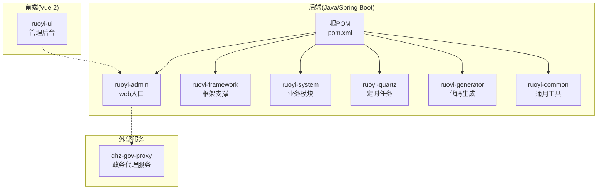
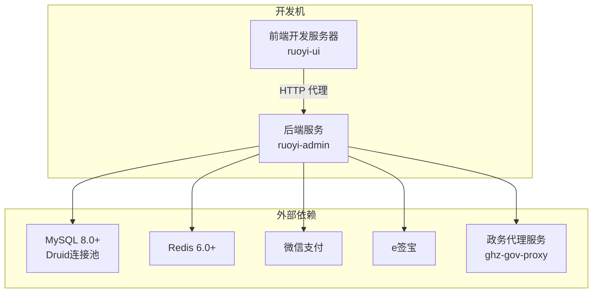
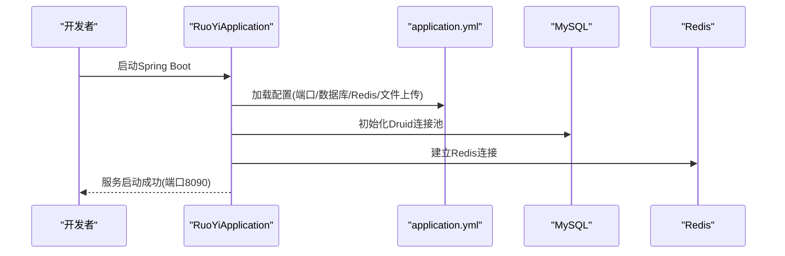
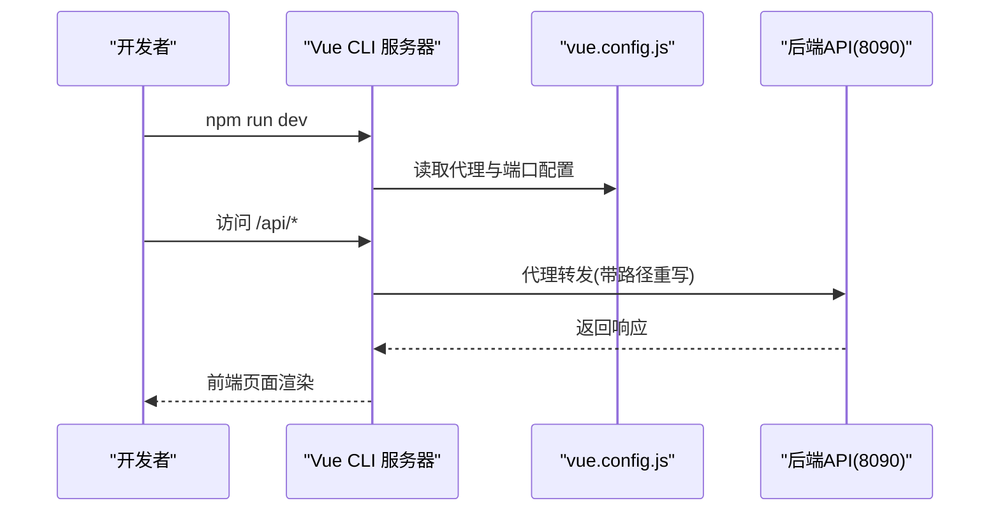
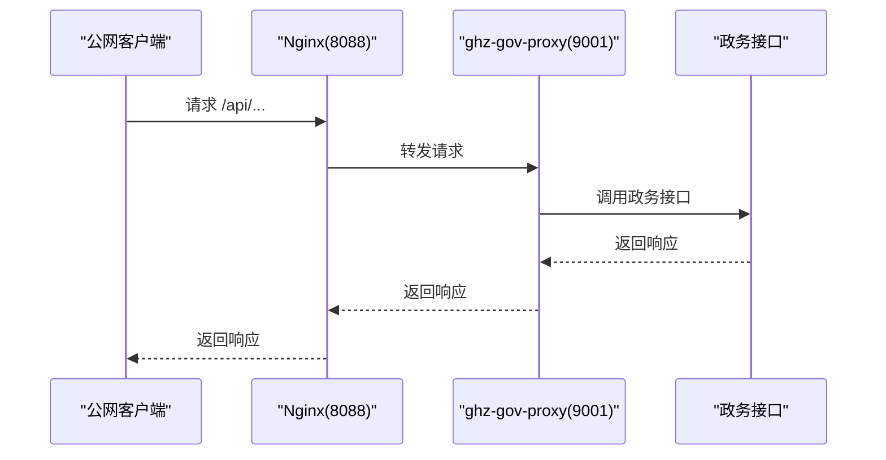
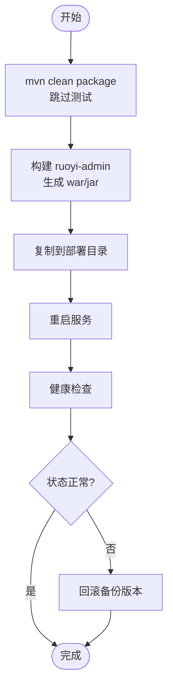
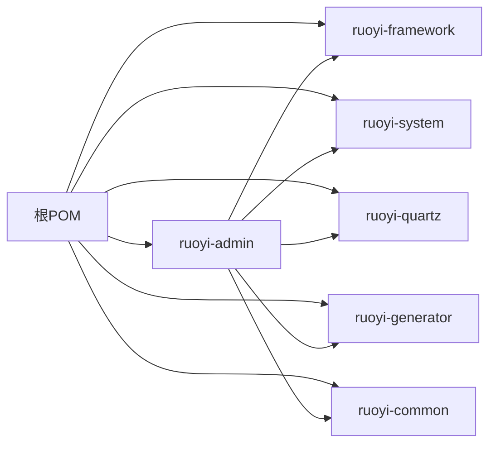

# 开发环境搭建

<cite>
**本文引用的文件**
- [pom.xml](file://pom.xml)
- [ruoyi-admin/pom.xml](file://ruoyi-admin/pom.xml)
- [ruoyi-admin/src/main/resources/application.yml](file://ruoyi-admin/src/main/resources/application.yml)
- [ruoyi-admin/src/main/resources/application-druid.yml](file://ruoyi-admin/src/main/resources/application-druid.yml)
- [ruoyi-admin/src/main/java/com/ruoyi/RuoYiApplication.java](file://ruoyi-admin/src/main/java/com/ruoyi/RuoYiApplication.java)
- [ruoyi-ui/package.json](file://ruoyi-ui/package.json)
- [ruoyi-ui/vue.config.js](file://ruoyi-ui/vue.config.js)
- [ruoyi-ui/babel.config.js](file://ruoyi-ui/babel.config.js)
- [ruoyi-ui/.editorconfig](file://ruoyi-ui/.editorconfig)
- [ruoyi-ui/bin/run-web.bat](file://ruoyi-ui/bin/run-web.bat)
- [bin/run.bat](file://bin/run.bat)
- [bin/package.bat](file://bin/package.bat)
- [server-deploy.sh](file://server-deploy.sh)
- [ghz-gov-proxy/deploy/start.sh](file://ghz-gov-proxy/deploy/start.sh)
- [ghz-gov-proxy/deploy/nginx-ghz-gov-proxy.conf](file://ghz-gov-proxy/deploy/nginx-ghz-gov-proxy.conf)
</cite>

## 目录
1. [简介](#简介)
2. [项目结构](#项目结构)
3. [核心组件](#核心组件)
4. [架构总览](#架构总览)
5. [详细组件分析](#详细组件分析)
6. [依赖关系分析](#依赖关系分析)
7. [性能考虑](#性能考虑)
8. [故障排查指南](#故障排查指南)
9. [结论](#结论)
10. [附录](#附录)

## 简介
本指南面向港好住信息系统开发者，提供从零搭建开发环境的完整步骤，涵盖硬件与软件要求、IDE 配置、Maven 多模块构建、前后端分离启动流程、环境变量与端口冲突处理、网络代理设置以及开发工具与规范建议。文档基于仓库现有配置文件与脚本进行梳理，确保读者能快速、准确地完成本地开发准备。

## 项目结构
本项目采用 Maven 多模块聚合结构，后端主体位于 ruoyi-admin，并通过 ruoyi-ui 提供前端界面。另有独立的政务数据代理服务 ghz-gov-proxy 作为外部接口桥接层。

图表来源
- [pom.xml:184-191](file://pom.xml#L184-L191)
- [ruoyi-admin/pom.xml:1-140](file://ruoyi-admin/pom.xml#L1-L140)

章节来源
- [pom.xml:184-191](file://pom.xml#L184-L191)
- [ruoyi-admin/pom.xml:1-140](file://ruoyi-admin/pom.xml#L1-L140)

## 核心组件
- 后端主模块 ruoyi-admin：Spring Boot Web 入口，负责对外 HTTP 服务、业务接口与集成外部能力（如微信支付、e签宝、政务代理等）。
- 前端 ruoyi-ui：Vue 2 管理后台，提供可视化界面与交互。
- 政务代理 ghz-gov-proxy：独立的 Java 服务，用于转发与代理外部政务接口，减轻后端直接暴露风险。
- 多模块聚合：根 POM 统一管理版本与插件，模块间通过依赖关系协作。

章节来源
- [ruoyi-admin/pom.xml:1-140](file://ruoyi-admin/pom.xml#L1-L140)
- [pom.xml:15-36](file://pom.xml#L15-L36)

## 架构总览
后端通过 Spring Boot 启动，前端通过 Vue CLI 启动本地开发服务器，二者通过代理互通。后端与数据库、Redis、外部接口（政务代理、微信支付、e签宝）交互。

图表来源
- [ruoyi-ui/vue.config.js:33-53](file://ruoyi-ui/vue.config.js#L33-L53)
- [ruoyi-admin/src/main/resources/application.yml:72-94](file://ruoyi-admin/src/main/resources/application.yml#L72-L94)
- [ruoyi-admin/src/main/resources/application.yml:166-178](file://ruoyi-admin/src/main/resources/application.yml#L166-L178)
- [ruoyi-admin/src/main/resources/application.yml:179-198](file://ruoyi-admin/src/main/resources/application.yml#L179-L198)
- [ruoyi-admin/src/main/resources/application.yml:199-218](file://ruoyi-admin/src/main/resources/application.yml#L199-L218)
- [ghz-gov-proxy/deploy/nginx-ghz-gov-proxy.conf:19-38](file://ghz-gov-proxy/deploy/nginx-ghz-gov-proxy.conf#L19-L38)

## 详细组件分析

### 后端启动与配置
- 启动入口：RuoYiApplication 作为 Spring Boot 启动类，排除默认数据源自动装配以便集中管理。
- 服务器端口：默认 8090，可通过 server.port 覆盖。
- 数据库：Druid 连接池，主库地址、账号、密码在 application-druid.yml 中配置。
- Redis：默认本地 127.0.0.1:6379，密码与连接参数可调整。
- Swagger/OpenAPI：springdoc 配置启用 OpenAPI UI。
- 文件上传：支持较大文件，适合 VR 全景图与图片场景。
- 外部集成：微信支付、e签宝、政务代理等通过配置项启用。

图表来源
- [ruoyi-admin/src/main/java/com/ruoyi/RuoYiApplication.java:12-21](file://ruoyi-admin/src/main/java/com/ruoyi/RuoYiApplication.java#L12-L21)
- [ruoyi-admin/src/main/resources/application.yml:20-36](file://ruoyi-admin/src/main/resources/application.yml#L20-L36)
- [ruoyi-admin/src/main/resources/application-druid.yml:1-64](file://ruoyi-admin/src/main/resources/application-druid.yml#L1-L64)

章节来源
- [ruoyi-admin/src/main/java/com/ruoyi/RuoYiApplication.java:12-21](file://ruoyi-admin/src/main/java/com/ruoyi/RuoYiApplication.java#L12-L21)
- [ruoyi-admin/src/main/resources/application.yml:20-36](file://ruoyi-admin/src/main/resources/application.yml#L20-L36)
- [ruoyi-admin/src/main/resources/application.yml:72-94](file://ruoyi-admin/src/main/resources/application.yml#L72-L94)
- [ruoyi-admin/src/main/resources/application.yml:104-134](file://ruoyi-admin/src/main/resources/application.yml#L104-L134)
- [ruoyi-admin/src/main/resources/application.yml:135-148](file://ruoyi-admin/src/main/resources/application.yml#L135-L148)
- [ruoyi-admin/src/main/resources/application.yml:166-178](file://ruoyi-admin/src/main/resources/application.yml#L166-L178)
- [ruoyi-admin/src/main/resources/application.yml:179-198](file://ruoyi-admin/src/main/resources/application.yml#L179-L198)
- [ruoyi-admin/src/main/resources/application.yml:199-218](file://ruoyi-admin/src/main/resources/application.yml#L199-L218)

### 前端启动与代理
- 启动命令：npm run dev 启动 Vue CLI 开发服务器，默认端口由 vue.config.js 指定。
- 代理规则：将 API 前缀重写并转发至后端 8090 端口；同时代理 OpenAPI 文档路径。
- 构建产物：生产构建输出 dist/static，适配 Nginx 部署。

图表来源
- [ruoyi-ui/vue.config.js:33-53](file://ruoyi-ui/vue.config.js#L33-L53)
- [ruoyi-ui/vue.config.js:24-28](file://ruoyi-ui/vue.config.js#L24-L28)
- [ruoyi-ui/package.json:7-12](file://ruoyi-ui/package.json#L7-L12)

章节来源
- [ruoyi-ui/vue.config.js:10-15](file://ruoyi-ui/vue.config.js#L10-L15)
- [ruoyi-ui/vue.config.js:33-53](file://ruoyi-ui/vue.config.js#L33-L53)
- [ruoyi-ui/package.json:7-12](file://ruoyi-ui/package.json#L7-L12)

### 政务代理服务
- 独立运行：提供公网入口与内网转发，Nginx 将 8088 转发至 172.19.25.77:9001。
- 健康检查：/api/v1/gov/ping 用于存活探测。
- 启动脚本：start.sh 支持守护进程、日志与 PID 管理。

图表来源
- [ghz-gov-proxy/deploy/nginx-ghz-gov-proxy.conf:7-44](file://ghz-gov-proxy/deploy/nginx-ghz-gov-proxy.conf#L7-L44)
- [ghz-gov-proxy/deploy/start.sh:13-46](file://ghz-gov-proxy/deploy/start.sh#L13-L46)

章节来源
- [ghz-gov-proxy/deploy/nginx-ghz-gov-proxy.conf:7-44](file://ghz-gov-proxy/deploy/nginx-ghz-gov-proxy.conf#L7-L44)
- [ghz-gov-proxy/deploy/start.sh:13-46](file://ghz-gov-proxy/deploy/start.sh#L13-L46)

### Maven 多模块构建与打包
- 根 POM 统一版本与插件，指定 Java 17、MyBatis-Plus、Druid、MySQL Connector 等依赖版本。
- ruoyi-admin 作为 WAR/JAR 双形态打包，包含 devtools、OpenAPI、MySQL 驱动、定时任务、代码生成、微信支付、e签宝等依赖。
- 打包脚本：Windows 提供 package.bat 与 run.bat，Linux 提供 server-deploy.sh 自动拉取、编译、替换与健康检查。

图表来源
- [bin/package.bat:10](file://bin/package.bat#L10)
- [bin/run.bat:9-11](file://bin/run.bat#L9-L11)
- [server-deploy.sh:13-39](file://server-deploy.sh#L13-L39)

章节来源
- [pom.xml:15-36](file://pom.xml#L15-L36)
- [ruoyi-admin/pom.xml:109-138](file://ruoyi-admin/pom.xml#L109-L138)
- [bin/package.bat:10](file://bin/package.bat#L10)
- [bin/run.bat:9-11](file://bin/run.bat#L9-L11)
- [server-deploy.sh:13-39](file://server-deploy.sh#L13-L39)

## 依赖关系分析
- 版本统一：根 POM 通过 dependencyManagement 统一版本，避免冲突。
- 模块耦合：ruoyi-admin 依赖 framework/system/quartz/generator/common 等模块。
- 外部依赖：MySQL 8.x、Druid、MyBatis-Plus、SpringDoc、Fastjson、Kaptcha、POI、JWT、Apache HttpClient、Gson、commons-codec 等。

图表来源
- [pom.xml:39-182](file://pom.xml#L39-L182)
- [ruoyi-admin/pom.xml:39-56](file://ruoyi-admin/pom.xml#L39-L56)

章节来源
- [pom.xml:39-182](file://pom.xml#L39-L182)
- [ruoyi-admin/pom.xml:39-56](file://ruoyi-admin/pom.xml#L39-L56)

## 性能考虑
- 后端：合理设置 Druid 连接池参数（初始连接、最小空闲、最大活跃、超时），避免连接争用。
- 前端：开启 gzip 压缩与分包策略，减少首屏加载时间。
- 文件上传：根据 VR 图片与视频场景适当提高单文件与总大小限制。
- 定时任务：使用 Quartz 模块时注意任务并发与持久化配置。

## 故障排查指南
- 端口冲突
  - 后端端口：修改 application.yml 中 server.port。
  - 前端端口：修改 vue.config.js 中 devServer.port。
- 代理跨域
  - 确认 vue.config.js 中代理路径与后端 API 前缀一致，且 pathRewrite 正确。
- 数据库连接
  - 校验 application-druid.yml 中的 URL、用户名、密码与网络连通性。
- Redis 连接
  - 校验 host/port/password 与网络连通性。
- 静态资源路径
  - 前端构建后静态资源路径与 Nginx 配置保持一致。
- 健康检查
  - 代理服务可通过 /api/v1/gov/ping 检测，后端可通过 /actuator/health（如启用）检查。

章节来源
- [ruoyi-ui/vue.config.js:33-53](file://ruoyi-ui/vue.config.js#L33-L53)
- [ruoyi-admin/src/main/resources/application.yml:20-36](file://ruoyi-admin/src/main/resources/application.yml#L20-L36)
- [ruoyi-admin/src/main/resources/application.yml:72-94](file://ruoyi-admin/src/main/resources/application.yml#L72-L94)
- [ruoyi-admin/src/main/resources/application-druid.yml:12-14](file://ruoyi-admin/src/main/resources/application-druid.yml#L12-L14)
- [ghz-gov-proxy/deploy/nginx-ghz-gov-proxy.conf:40-43](file://ghz-gov-proxy/deploy/nginx-ghz-gov-proxy.conf#L40-L43)

## 结论
通过本指南，您可以在本地完成港好住信息系统的开发环境搭建：安装 JDK 17+、Node.js 8+、MySQL 8.0+、Redis 6.0+，导入 Maven 多模块项目，配置后端与前端启动参数及代理，完成数据库与缓存连接，并掌握常见问题的排查方法。建议结合 IDE 插件与代码规范工具提升开发效率与一致性。

## 附录

### 硬件与软件要求
- JDK：17（根 POM 指定）
- Maven：标准多模块构建
- Node.js：>= 8.9（前端 package.json 指定）
- MySQL：8.0+（驱动版本 8.2.0）
- Redis：6.0+

章节来源
- [pom.xml:19](file://pom.xml#L19)
- [pom.xml:32](file://pom.xml#L32)
- [ruoyi-ui/package.json:65-68](file://ruoyi-ui/package.json#L65-L68)

### IDE 配置建议
- IntelliJ IDEA
  - 导入根 POM，启用 Maven 自动导入与注解处理。
  - 配置运行配置：RuoYiApplication 启动类，VM Options 可按需添加内存参数。
  - 后端热部署：application.yml 中 devtools.restart.enabled 可开启。
- VS Code
  - 安装 Vue/Java 相关插件，启用 ESLint、Prettier。
  - 前端工作区打开 ruoyi-ui，使用 npm run dev 启动。
  - 后端工作区打开根目录，使用 Maven 插件或终端执行 mvn spring-boot:run。

### 环境变量与配置要点
- 后端
  - server.port：服务端口
  - spring.profiles.active：选择 druid 配置
  - spring.data.redis.*：Redis 连接参数
  - zhenghaoban/wechat/esign/gov.proxy.*：外部集成参数，支持通过环境变量覆盖
- 前端
  - VUE_APP_TITLE：页面标题
  - VUE_APP_BASE_API：API 前缀，需与后端一致
  - NODE_ENV：生产/开发模式影响构建与代理行为

章节来源
- [ruoyi-admin/src/main/resources/application.yml:57-58](file://ruoyi-admin/src/main/resources/application.yml#L57-L58)
- [ruoyi-admin/src/main/resources/application.yml:72-94](file://ruoyi-admin/src/main/resources/application.yml#L72-L94)
- [ruoyi-admin/src/main/resources/application.yml:166-178](file://ruoyi-admin/src/main/resources/application.yml#L166-L178)
- [ruoyi-admin/src/main/resources/application.yml:179-198](file://ruoyi-admin/src/main/resources/application.yml#L179-L198)
- [ruoyi-admin/src/main/resources/application.yml:199-218](file://ruoyi-admin/src/main/resources/application.yml#L199-L218)
- [ruoyi-ui/vue.config.js:10-15](file://ruoyi-ui/vue.config.js#L10-L15)
- [ruoyi-ui/vue.config.js:39-44](file://ruoyi-ui/vue.config.js#L39-L44)

### 开发工具与规范
- 代码格式化：.editorconfig 统一缩进、换行与空白处理。
- 前端构建：Babel development 模式启用 dynamic-import-node 提升热更新速度。
- 版本控制：建议使用 Git，配合分支策略与提交规范。

章节来源
- [ruoyi-ui/.editorconfig:8-17](file://ruoyi-ui/.editorconfig#L8-L17)
- [ruoyi-ui/babel.config.js:6-12](file://ruoyi-ui/babel.config.js#L6-L12)