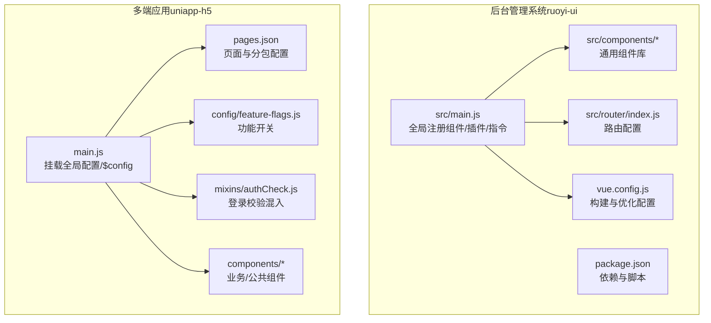
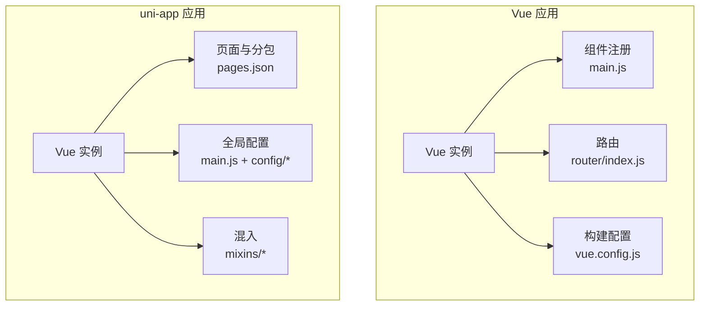
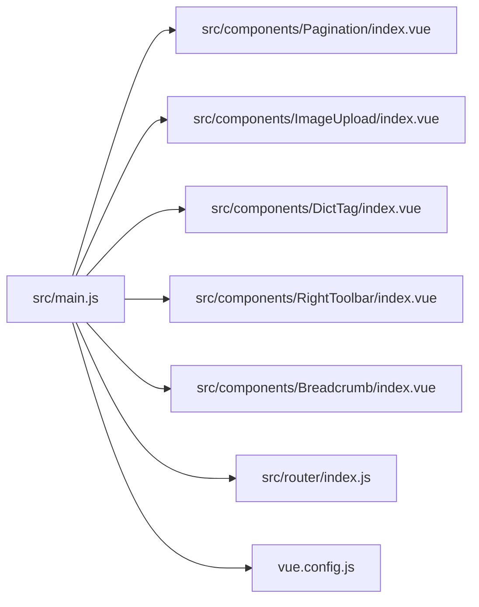

# 组件开发规范

<cite>
**本文档引用的文件**
- [ruoyi-ui/src/main.js](file://ruoyi-ui/src/main.js)
- [ruoyi-ui/src/components/Pagination/index.vue](file://ruoyi-ui/src/components/Pagination/index.vue)
- [ruoyi-ui/src/components/ImageUpload/index.vue](file://ruoyi-ui/src/components/ImageUpload/index.vue)
- [ruoyi-ui/src/components/DictTag/index.vue](file://ruoyi-ui/src/components/DictTag/index.vue)
- [ruoyi-ui/src/components/RightToolbar/index.vue](file://ruoyi-ui/src/components/RightToolbar/index.vue)
- [ruoyi-ui/src/components/Breadcrumb/index.vue](file://ruoyi-ui/src/components/Breadcrumb/index.vue)
- [ruoyi-ui/src/router/index.js](file://ruoyi-ui/src/router/index.js)
- [ruoyi-ui/vue.config.js](file://ruoyi-ui/vue.config.js)
- [ruoyi-ui/package.json](file://ruoyi-ui/package.json)
- [uniapp-h5/main.js](file://uniapp-h5/main.js)
- [uniapp-h5/pages.json](file://uniapp-h5/pages.json)
- [uniapp-h5/components/notice-popup/notice-popup.vue](file://uniapp-h5/components/notice-popup/notice-popup.vue)
- [uniapp-h5/config/feature-flags.js](file://uniapp-h5/config/feature-flags.js)
- [uniapp-h5/mixins/authCheck.js](file://uniapp-h5/mixins/authCheck.js)
</cite>

## 目录
1. [引言](#引言)
2. [项目结构](#项目结构)
3. [核心组件](#核心组件)
4. [架构总览](#架构总览)
5. [组件详解](#组件详解)
6. [依赖关系分析](#依赖关系分析)
7. [性能考量](#性能考量)
8. [故障排查指南](#故障排查指南)
9. [结论](#结论)
10. [附录](#附录)

## 引言
本规范旨在统一港好住信息系统前端组件开发标准，覆盖 Vue.js 组件与 uni-app 跨平台组件两类体系。内容涵盖组件命名、props 定义、事件处理、生命周期管理、组件通信、跨端适配、设计原则、文档规范、测试策略、版本与发布流程、性能优化与高级技巧等，帮助团队建立高质量、可维护、可扩展的组件库。

## 项目结构
本仓库包含两套前端工程：
- 基于 Vue 2 + Element-UI 的后台管理系统（ruoyi-ui）
- 基于 uni-app 的 H5/小程序/App 多端应用（uniapp-h5）

图表来源
- [ruoyi-ui/src/main.js:1-84](file://ruoyi-ui/src/main.js#L1-L84)
- [ruoyi-ui/src/router/index.js:1-184](file://ruoyi-ui/src/router/index.js#L1-L184)
- [ruoyi-ui/vue.config.js:1-138](file://ruoyi-ui/vue.config.js#L1-L138)
- [uniapp-h5/main.js:1-30](file://uniapp-h5/main.js#L1-L30)
- [uniapp-h5/pages.json:1-324](file://uniapp-h5/pages.json#L1-L324)

章节来源
- [ruoyi-ui/src/main.js:1-84](file://ruoyi-ui/src/main.js#L1-L84)
- [ruoyi-ui/src/router/index.js:1-184](file://ruoyi-ui/src/router/index.js#L1-L184)
- [ruoyi-ui/vue.config.js:1-138](file://ruoyi-ui/vue.config.js#L1-L138)
- [uniapp-h5/main.js:1-30](file://uniapp-h5/main.js#L1-L30)
- [uniapp-h5/pages.json:1-324](file://uniapp-h5/pages.json#L1-L324)

## 核心组件
- 后台系统通用组件：分页器、富文本、图片上传、字典标签、右侧工具栏、面包屑导航等。
- uni-app 业务组件：公告弹窗、功能开关、登录校验混入等。

章节来源
- [ruoyi-ui/src/components/Pagination/index.vue:1-114](file://ruoyi-ui/src/components/Pagination/index.vue#L1-L114)
- [ruoyi-ui/src/components/ImageUpload/index.vue:1-273](file://ruoyi-ui/src/components/ImageUpload/index.vue#L1-L273)
- [ruoyi-ui/src/components/DictTag/index.vue:1-90](file://ruoyi-ui/src/components/DictTag/index.vue#L1-L90)
- [ruoyi-ui/src/components/RightToolbar/index.vue:1-187](file://ruoyi-ui/src/components/RightToolbar/index.vue#L1-L187)
- [ruoyi-ui/src/components/Breadcrumb/index.vue:1-104](file://ruoyi-ui/src/components/Breadcrumb/index.vue#L1-L104)
- [uniapp-h5/components/notice-popup/notice-popup.vue:1-166](file://uniapp-h5/components/notice-popup/notice-popup.vue#L1-L166)

## 架构总览
- Vue 2 + Element-UI：全局注册组件、指令与插件，集中挂载工具方法，按需引入第三方库。
- uni-app：通过 pages.json 管理页面与分包，全局配置通过原型或全局属性注入，混入实现横切逻辑（如登录校验）。

图表来源
- [ruoyi-ui/src/main.js:1-84](file://ruoyi-ui/src/main.js#L1-L84)
- [ruoyi-ui/src/router/index.js:1-184](file://ruoyi-ui/src/router/index.js#L1-L184)
- [ruoyi-ui/vue.config.js:1-138](file://ruoyi-ui/vue.config.js#L1-L138)
- [uniapp-h5/main.js:1-30](file://uniapp-h5/main.js#L1-L30)
- [uniapp-h5/pages.json:1-324](file://uniapp-h5/pages.json#L1-L324)

## 组件详解

### Vue 组件开发规范
- 命名约定
  - 组件文件名采用帕斯卡命名（PascalCase），便于在模板中直接引用。
  - 组件 name 属性与文件名一致，利于调试与递归组件场景。
- Props 定义规范
  - 必填项使用 required；可选项提供明确默认值；复杂对象建议使用工厂函数返回默认值。
  - 类型声明清晰，避免使用 any；对布尔值、数值、数组、对象进行严格约束。
- 事件处理规范
  - 子向父通信统一使用 $emit 触发语义化事件名；对外暴露的事件名保持稳定，避免破坏性变更。
  - 对双向绑定场景，优先使用 v-model 或 update:xxx 的组合，保证数据流清晰。
- 生命周期管理
  - 在 created/mounted 中进行初始化；避免在 beforeCreate 中进行异步操作。
  - 注意 keep-alive 缓存带来的 activated/deactivated 生命周期差异。
- 组件通信机制
  - 祖先 -> 后代：props 下传；provide/inject 适用于跨层级注入。
  - 后代 -> 祖先：$emit；对深层级可考虑事件总线或集中状态管理。
  - 兄弟/无亲缘：事件总线、集中状态管理（Vuex/Pinia）、mitt 等轻量事件库。
- 可复用性与可测试性
  - 单一职责：每个组件聚焦一个功能点；复杂视图拆分为多个子组件。
  - 易测试：尽量减少副作用；将异步逻辑抽离为可注入的服务；提供稳定的 props 与事件接口。
- 性能优化
  - 合理使用 v-show/v-if；避免不必要的重渲染；对长列表使用虚拟滚动。
  - 图片懒加载、组件按需加载、路由级分包。

章节来源
- [ruoyi-ui/src/components/Pagination/index.vue:22-63](file://ruoyi-ui/src/components/Pagination/index.vue#L22-L63)
- [ruoyi-ui/src/components/ImageUpload/index.vue:52-94](file://ruoyi-ui/src/components/ImageUpload/index.vue#L52-L94)
- [ruoyi-ui/src/components/DictTag/index.vue:31-48](file://ruoyi-ui/src/components/DictTag/index.vue#L31-L48)
- [ruoyi-ui/src/components/RightToolbar/index.vue:41-79](file://ruoyi-ui/src/components/RightToolbar/index.vue#L41-L79)
- [ruoyi-ui/src/components/Breadcrumb/index.vue:12-18](file://ruoyi-ui/src/components/Breadcrumb/index.vue#L12-L18)

### uni-app 跨平台组件开发规范
- 页面与分包
  - 页面与分包通过 pages.json 统一声明；tabBar、导航栏样式集中配置。
  - 子包按业务域划分，减少首屏体积与包体大小。
- 组件分类与开发标准
  - 页面组件：承载具体业务页面，遵循 pages.json 声明规范。
  - 业务组件：封装业务逻辑与交互，如公告弹窗、表单校验等。
  - 公共组件：纯展示或通用能力，如图标、按钮、弹层等。
- 多端适配
  - 使用条件编译区分 H5、小程序、App 行为差异。
  - 样式单位优先 rpx（小程序）；H5 使用 rem/px；注意不同端的屏幕密度与安全区差异。
  - API 调用通过平台适配层封装，避免直接依赖平台 API。
- 功能开关与灰度
  - 通过配置文件集中控制功能入口，便于快速开关与灰度发布。

章节来源
- [uniapp-h5/pages.json:1-324](file://uniapp-h5/pages.json#L1-L324)
- [uniapp-h5/components/notice-popup/notice-popup.vue:28-36](file://uniapp-h5/components/notice-popup/notice-popup.vue#L28-L36)
- [uniapp-h5/config/feature-flags.js:6-12](file://uniapp-h5/config/feature-flags.js#L6-L12)
- [uniapp-h5/mixins/authCheck.js:10-48](file://uniapp-h5/mixins/authCheck.js#L10-L48)

### 组件设计原则
- 单一职责：每个组件只负责一个功能领域。
- 开闭原则：对扩展开放，对修改封闭；通过插槽、配置与事件扩展行为。
- 里氏替换：父类出现的地方可被子类替换；组件继承或组合时保持接口一致性。
- 依赖倒置：高层策略不依赖低层实现；通过抽象接口与配置驱动行为。
- 可测试性：提供稳定输入输出；将副作用隔离；支持快照与单元测试。
- 可维护性：命名清晰、注释完整、文档齐全；遵循统一的目录与命名规范。

### 组件文档编写规范
- 组件 API 文档
  - props：字段、类型、默认值、是否必填、取值范围与说明。
  - events：事件名、触发时机、回调参数说明。
  - slots：具名插槽与默认插槽说明。
  - methods：公开方法说明与使用示例。
- 使用示例
  - 提供基础用法与典型场景示例；避免冗长代码，突出关键点。
- 注意事项
  - 平台差异、性能影响、内存泄漏风险、权限要求等。
- 版本兼容性
  - 标注最低支持版本、破坏性变更记录与迁移指引。

### 组件测试方法
- 单元测试
  - 使用 Vue Test Utils 或 Vitest 测试组件渲染、事件触发、props 变更。
  - 对复杂逻辑（如上传、分页计算）进行独立函数测试。
- 集成测试
  - 模拟路由与状态管理，验证组件在真实上下文中的表现。
- 回归测试
  - 对关键组件建立快照测试；每次变更后运行回归集，确保不引入回归。

### 组件版本管理、发布流程与升级迁移
- 版本管理
  - 遵循语义化版本（主.次.补丁），破坏性变更提升主版本。
  - 发布前更新 CHANGELOG，记录变更与迁移指引。
- 发布流程
  - 本地自测与代码审查；CI 校验（lint、测试、构建）；制品上传与发布。
- 升级迁移
  - 对外暴露的 props 与事件名保持稳定；必要时提供兼容层与迁移脚本。
  - 提供升级检查清单与常见问题解答。

### 组件性能优化与高级技巧
- 懒加载与分包
  - 页面级懒加载与路由级分包；组件级按需加载。
- 缓存策略
  - 列表分页缓存、字典数据缓存、图片 CDN 缓存。
- 渲染优化
  - v-memo、key 合理设置、避免大对象深拷贝。
- 构建优化
  - Tree-shaking、代码分割、Gzip 压缩、运行时抽离。

## 依赖关系分析

图表来源
- [ruoyi-ui/src/main.js:22-61](file://ruoyi-ui/src/main.js#L22-L61)
- [ruoyi-ui/src/router/index.js:1-184](file://ruoyi-ui/src/router/index.js#L1-L184)
- [ruoyi-ui/vue.config.js:60-136](file://ruoyi-ui/vue.config.js#L60-L136)

章节来源
- [ruoyi-ui/src/main.js:22-61](file://ruoyi-ui/src/main.js#L22-L61)
- [ruoyi-ui/src/router/index.js:1-184](file://ruoyi-ui/src/router/index.js#L1-L184)
- [ruoyi-ui/vue.config.js:60-136](file://ruoyi-ui/vue.config.js#L60-L136)

## 性能考量
- 构建期优化
  - 代码分割与缓存组：将第三方库与公共组件拆分，提升缓存命中率。
  - Gzip 压缩：对静态资源启用压缩，降低传输体积。
  - 运行时优化：移除生产环境 source map，禁用开发工具。
- 运行期优化
  - 组件懒加载与按需引入；图片懒加载与 CDN；合理使用 keep-alive。
  - 避免重复渲染：合理使用计算属性与侦听器；避免不必要的深度监听。

章节来源
- [ruoyi-ui/vue.config.js:60-136](file://ruoyi-ui/vue.config.js#L60-L136)
- [ruoyi-ui/package.json:1-74](file://ruoyi-ui/package.json#L1-L74)

## 故障排查指南
- 组件未生效
  - 检查是否在 main.js 中正确注册；确认组件 name 与文件名一致。
- 路由跳转异常
  - 检查路由配置与命名；避免重复命名导致的导航错误。
- 构建失败或体积过大
  - 检查 vue.config.js 的 splitChunks 与压缩配置；确认未引入未使用依赖。
- uni-app 页面无法打开
  - 检查 pages.json 中路径与分包配置；确认页面存在且命名正确。
- 登录态失效
  - 检查混入中的登录校验逻辑与存储键值；确认跳转逻辑正确。

章节来源
- [ruoyi-ui/src/main.js:50-61](file://ruoyi-ui/src/main.js#L50-L61)
- [ruoyi-ui/src/router/index.js:167-177](file://ruoyi-ui/src/router/index.js#L167-L177)
- [ruoyi-ui/vue.config.js:101-135](file://ruoyi-ui/vue.config.js#L101-L135)
- [uniapp-h5/pages.json:1-324](file://uniapp-h5/pages.json#L1-L324)
- [uniapp-h5/mixins/authCheck.js:16-47](file://uniapp-h5/mixins/authCheck.js#L16-L47)

## 结论
通过统一的组件开发规范、跨端适配策略与完善的性能与测试体系，港好住信息系统能够持续产出高质量、可维护、可扩展的前端组件。建议在团队内定期回顾与更新规范，结合实际业务演进不断优化组件库与开发流程。

## 附录
- 组件 API 示例（示意）
  - 分页器：total/page/limit/pageSizes/layout/background/autoScroll/hidden
  - 图片上传：value/action/data/limit/fileSize/fileType/isShowTip/disabled/drag
  - 字典标签：options/value/showValue/separator
  - 右侧工具栏：showSearch/columns/search/showColumnsType/gutter
  - 面包屑：无对外 props（内部通过路由与 store 计算）
  - 公告弹窗：visible/title/content/maskClosable
  - 功能开关：guaranteed/market
  - 登录校验：混入方法 checkLogin

章节来源
- [ruoyi-ui/src/components/Pagination/index.vue:22-63](file://ruoyi-ui/src/components/Pagination/index.vue#L22-L63)
- [ruoyi-ui/src/components/ImageUpload/index.vue:52-94](file://ruoyi-ui/src/components/ImageUpload/index.vue#L52-L94)
- [ruoyi-ui/src/components/DictTag/index.vue:31-48](file://ruoyi-ui/src/components/DictTag/index.vue#L31-L48)
- [ruoyi-ui/src/components/RightToolbar/index.vue:53-79](file://ruoyi-ui/src/components/RightToolbar/index.vue#L53-L79)
- [ruoyi-ui/src/components/Breadcrumb/index.vue:12-18](file://ruoyi-ui/src/components/Breadcrumb/index.vue#L12-L18)
- [uniapp-h5/components/notice-popup/notice-popup.vue:30-36](file://uniapp-h5/components/notice-popup/notice-popup.vue#L30-L36)
- [uniapp-h5/config/feature-flags.js:6-12](file://uniapp-h5/config/feature-flags.js#L6-L12)
- [uniapp-h5/mixins/authCheck.js:16-47](file://uniapp-h5/mixins/authCheck.js#L16-L47)