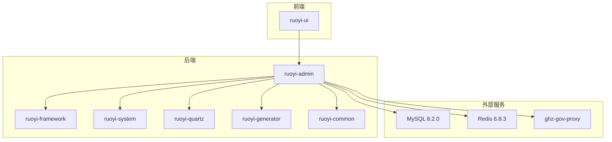
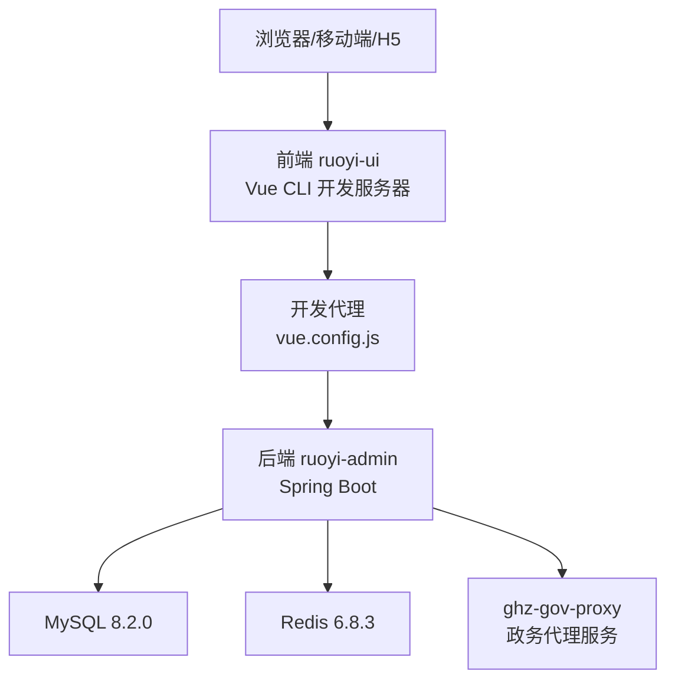
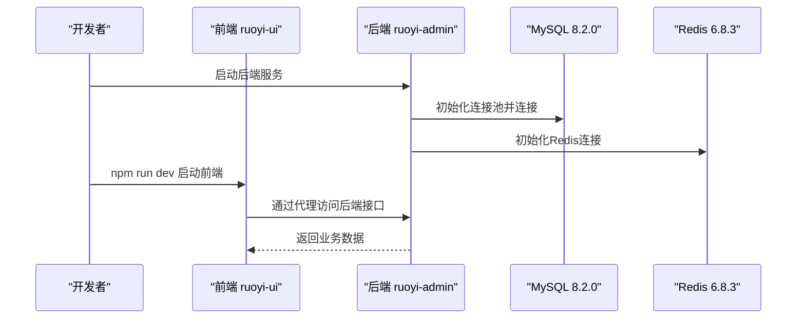
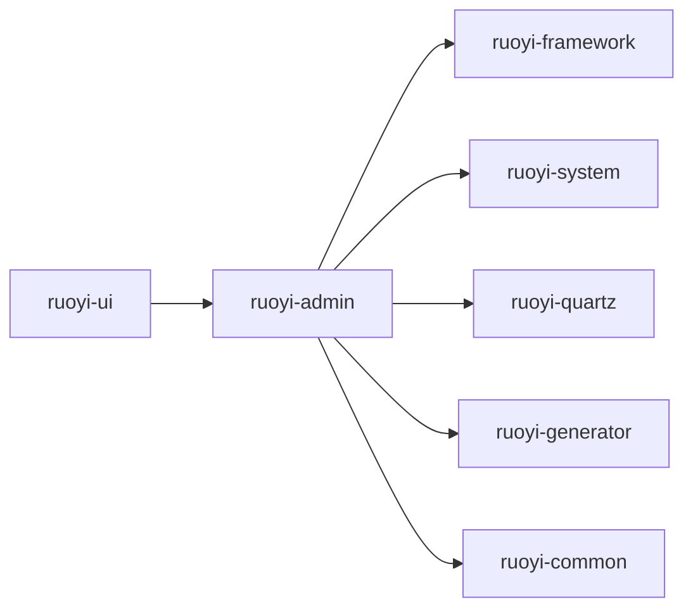

# 快速开始

<cite>
**本文引用的文件**
- [pom.xml](file://pom.xml)
- [ruoyi-admin/pom.xml](file://ruoyi-admin/pom.xml)
- [ruoyi-admin/src/main/resources/application.yml](file://ruoyi-admin/src/main/resources/application.yml)
- [ruoyi-admin/src/main/resources/application-druid.yml](file://ruoyi-admin/src/main/resources/application-druid.yml)
- [ruoyi-ui/package.json](file://ruoyi-ui/package.json)
- [ruoyi-ui/vue.config.js](file://ruoyi-ui/vue.config.js)
- [ruoyi-ui/bin/run-web.bat](file://ruoyi-ui/bin/run-web.bat)
- [bin/run.bat](file://bin/run.bat)
- [server-deploy.sh](file://server-deploy.sh)
- [ghz-gov-proxy/src/main/resources/application.yml](file://ghz-gov-proxy/src/main/resources/application.yml)
- [ghz-gov-proxy/deploy/README.md](file://ghz-gov-proxy/deploy/README.md)
- [ghz-gov-proxy/deploy/港好住后端对接指南.md](file://ghz-gov-proxy/deploy/港好住后端对接指南.md)
- [sql/ghz_2026-04-10.sql](file://sql/ghz_2026-04-10.sql)
</cite>

## 目录
1. [简介](#简介)
2. [项目结构](#项目结构)
3. [核心组件](#核心组件)
4. [架构概览](#架构概览)
5. [详细组件分析](#详细组件分析)
6. [依赖关系分析](#依赖关系分析)
7. [性能考虑](#性能考虑)
8. [故障排查指南](#故障排查指南)
9. [结论](#结论)
10. [附录](#附录)

## 简介
本指南面向新加入港好住信息系统开发团队的成员，帮助你在最短时间内完成本地开发环境搭建与项目启动，并提供生产部署基础步骤与常见问题排查方法。项目基于若依（RuoYi）框架，采用前后端分离架构：后端为 Spring Boot 微服务，前端为 Vue 2 管理系统。

## 项目结构
项目采用 Maven 多模块组织，核心模块包括：
- ruoyi-admin：后端服务入口，提供 Web 接口与业务逻辑
- ruoyi-framework：框架核心配置与安全、拦截器等基础设施
- ruoyi-system：系统业务模块（房源、租户、合同、账单等）
- ruoyi-quartz：定时任务模块
- ruoyi-generator：代码生成模块
- ruoyi-common：通用工具与常量
- ruoyi-ui：前端管理界面
- ghz-gov-proxy：政务数据代理服务（跨网访问政务外网）

**图表来源**
- [pom.xml:184-191](file://pom.xml#L184-L191)
- [ruoyi-admin/pom.xml:18-107](file://ruoyi-admin/pom.xml#L18-L107)

**章节来源**
- [pom.xml:184-191](file://pom.xml#L184-L191)
- [ruoyi-admin/pom.xml:1-140](file://ruoyi-admin/pom.xml#L1-L140)

## 核心组件
- 后端服务 ruoyi-admin：提供 REST 接口、定时任务、代码生成、安全与权限控制等能力
- 前端 ruoyi-ui：Vue 2 管理界面，通过代理访问后端接口
- 数据库 MySQL 8.2.0：存储业务数据，使用 Druid 连接池
- 缓存 Redis 6.8.3：会话、验证码、限流与业务缓存
- 政务代理 ghz-gov-proxy：跨互联网区与政务外网，提供婚姻/社保/公租房/不动产查询代理

**章节来源**
- [ruoyi-admin/src/main/resources/application.yml:20-94](file://ruoyi-admin/src/main/resources/application.yml#L20-L94)
- [ruoyi-admin/src/main/resources/application-druid.yml:1-64](file://ruoyi-admin/src/main/resources/application-druid.yml#L1-L64)
- [ghz-gov-proxy/src/main/resources/application.yml:1-13](file://ghz-gov-proxy/src/main/resources/application.yml#L1-L13)

## 架构概览
后端服务通过 Spring Boot 启动，前端通过 Vue CLI 启动本地开发服务器并通过代理转发到后端。数据库与 Redis 作为后端依赖，政务数据通过 ghz-gov-proxy 跨网访问。

**图表来源**
- [ruoyi-ui/vue.config.js:33-53](file://ruoyi-ui/vue.config.js#L33-L53)
- [ruoyi-admin/src/main/resources/application.yml:20-94](file://ruoyi-admin/src/main/resources/application.yml#L20-L94)
- [ghz-gov-proxy/src/main/resources/application.yml:1-13](file://ghz-gov-proxy/src/main/resources/application.yml#L1-L13)

## 详细组件分析

### 环境要求与安装
- JDK 17+：用于编译与运行后端服务
- MySQL 8.2.0：用于业务数据存储
- Redis 6.8.3：用于缓存与会话
- Node.js 8.9+：用于前端开发与构建
- Maven：用于后端打包与依赖管理

**章节来源**
- [pom.xml:19-36](file://pom.xml#L19-L36)
- [ruoyi-ui/package.json:65-72](file://ruoyi-ui/package.json#L65-L72)

### 克隆与依赖安装
- 克隆仓库到本地
- 后端依赖安装：在项目根目录执行 Maven 打包（跳过测试）
- 前端依赖安装：进入 ruoyi-ui 目录执行 npm install

**章节来源**
- [server-deploy.sh:12-13](file://server-deploy.sh#L12-L13)
- [ruoyi-ui/package.json:1-74](file://ruoyi-ui/package.json#L1-L74)

### 数据库初始化
- 创建数据库与用户（根据实际环境调整）
- 初始化数据库结构与基础数据：导入 sql/ghz_2026-04-10.sql
- 校验表结构与初始数据是否正确

**章节来源**
- [sql/ghz_2026-04-10.sql:1-50](file://sql/ghz_2026-04-10.sql#L1-L50)

### 配置文件修改
- 后端 application.yml：端口、文件上传路径、Redis、MyBatis-Plus、微信/电子签等配置
- 后端 application-druid.yml：数据库连接（master/slave）、Druid 控制台、慢查询日志
- 前端 vue.config.js：开发代理目标地址（指向后端端口）
- 前端 package.json：脚本与依赖版本

**章节来源**
- [ruoyi-admin/src/main/resources/application.yml:1-238](file://ruoyi-admin/src/main/resources/application.yml#L1-L238)
- [ruoyi-admin/src/main/resources/application-druid.yml:1-64](file://ruoyi-admin/src/main/resources/application-druid.yml#L1-L64)
- [ruoyi-ui/vue.config.js:12-53](file://ruoyi-ui/vue.config.js#L12-L53)
- [ruoyi-ui/package.json:1-74](file://ruoyi-ui/package.json#L1-L74)

### 本地开发环境启动
- 启动后端服务：在 ruoyi-admin 目录执行 Maven 打包生成 jar，然后使用 bin/run.bat 启动（或直接 java -jar ruoyi-admin.jar）
- 启动前端应用：在 ruoyi-ui 目录执行 npm run dev，打开浏览器访问前端开发地址
- 数据库与 Redis：确保本地或内网服务可用，后端可正常连接

**图表来源**
- [bin/run.bat:9-11](file://bin/run.bat#L9-L11)
- [ruoyi-ui/bin/run-web.bat:10-10](file://ruoyi-ui/bin/run-web.bat#L10-L10)
- [ruoyi-admin/src/main/resources/application.yml:72-94](file://ruoyi-admin/src/main/resources/application.yml#L72-L94)

**章节来源**
- [bin/run.bat:1-14](file://bin/run.bat#L1-L14)
- [ruoyi-ui/bin/run-web.bat:1-12](file://ruoyi-ui/bin/run-web.bat#L1-L12)

### 生产环境部署
- 后端部署：server-deploy.sh 脚本完成拉取代码、编译打包、备份旧 jar、替换新 jar、健康检查与回滚
- 前端部署：构建产物 dist 部署至 Nginx 或静态托管
- 数据库与 Redis：确保生产环境可达与高可用
- 政务代理：按 ghz-gov-proxy 部署指南在互联网区与政务外网分别部署与联调

**章节来源**
- [server-deploy.sh:1-42](file://server-deploy.sh#L1-L42)
- [ghz-gov-proxy/deploy/README.md:34-100](file://ghz-gov-proxy/deploy/README.md#L34-L100)

## 依赖关系分析
后端模块之间存在清晰的依赖关系：ruoyi-admin 依赖 ruoyi-framework、ruoyi-system、ruoyi-quartz、ruoyi-generator、ruoyi-common；前端 ruoyi-ui 依赖后端 ruoyi-admin 提供的接口。

**图表来源**
- [pom.xml:184-191](file://pom.xml#L184-L191)
- [ruoyi-admin/pom.xml:39-55](file://ruoyi-admin/pom.xml#L39-L55)

**章节来源**
- [pom.xml:184-191](file://pom.xml#L184-L191)
- [ruoyi-admin/pom.xml:1-140](file://ruoyi-admin/pom.xml#L1-L140)

## 性能考虑
- 后端：合理配置 JVM 参数（堆大小、元空间），开启 Druid 慢 SQL 监控，优化数据库连接池参数
- 前端：启用 gzip 压缩、拆分第三方库、减少首屏资源体积
- 缓存：Redis 合理设置过期时间与容量，热点数据本地缓存
- 数据库：索引优化、慢查询分析、读写分离（如启用）

[本节为通用指导，无需特定文件引用]

## 故障排查指南
- 启动失败（后端）：检查 bin/run.bat 启动参数与 JAVA_OPTS，查看日志定位异常
- 启动失败（前端）：检查 ruoyi-ui/package.json 脚本与依赖安装，确认 vue.config.js 代理目标地址
- 数据库连接失败：核对 application-druid.yml 中 master 数据源配置与网络连通性
- Redis 连接失败：核对 application.yml 中 Redis 地址、端口、密码
- 政务代理调用失败：按 ghz-gov-proxy 部署指南逐层联调（L1/L2/L3），检查 API Key 与超时设置
- 健康检查：后端可通过 /v3/api-docs 与 Swagger UI 访问接口文档，确认服务状态

**章节来源**
- [bin/run.bat:9-11](file://bin/run.bat#L9-L11)
- [ruoyi-ui/vue.config.js:33-53](file://ruoyi-ui/vue.config.js#L33-L53)
- [ruoyi-admin/src/main/resources/application-druid.yml:12-14](file://ruoyi-admin/src/main/resources/application-druid.yml#L12-L14)
- [ruoyi-admin/src/main/resources/application.yml:75-81](file://ruoyi-admin/src/main/resources/application.yml#L75-L81)
- [ghz-gov-proxy/deploy/README.md:154-162](file://ghz-gov-proxy/deploy/README.md#L154-L162)

## 结论
通过本快速开始指南，你可以完成环境准备、项目克隆、依赖安装、数据库初始化与配置修改，并成功启动本地开发环境。生产部署可参考 server-deploy.sh 与 ghz-gov-proxy 部署文档，确保跨网链路与安全策略正确配置。遇到问题时，按故障排查指南逐层定位，结合日志与健康检查快速恢复。

[本节为总结，无需特定文件引用]

## 附录

### 常用启动与构建命令
- 后端打包（跳过测试）：mvn clean package -DskipTests -pl ruoyi-admin -am
- 后端启动：bin/run.bat 或 java -jar ruoyi-admin.jar
- 前端启动：npm run dev
- 前端构建：npm run build:prod

**章节来源**
- [server-deploy.sh:12-13](file://server-deploy.sh#L12-L13)
- [bin/run.bat:9-11](file://bin/run.bat#L9-L11)
- [ruoyi-ui/package.json:7-12](file://ruoyi-ui/package.json#L7-L12)

### 关键配置要点
- 后端端口：ruoyi-admin/src/main/resources/application.yml 中 server.port
- 文件上传路径：ruoyi-admin/src/main/resources/application.yml 中 ruoyi.profile
- Redis 连接：ruoyi-admin/src/main/resources/application.yml 中 spring.data.redis
- 数据源：ruoyi-admin/src/main/resources/application-druid.yml 中 master
- 前端代理：ruoyi-ui/vue.config.js 中 devServer.proxy

**章节来源**
- [ruoyi-admin/src/main/resources/application.yml:20-94](file://ruoyi-admin/src/main/resources/application.yml#L20-L94)
- [ruoyi-admin/src/main/resources/application-druid.yml:12-14](file://ruoyi-admin/src/main/resources/application-druid.yml#L12-L14)
- [ruoyi-ui/vue.config.js:37-51](file://ruoyi-ui/vue.config.js#L37-L51)