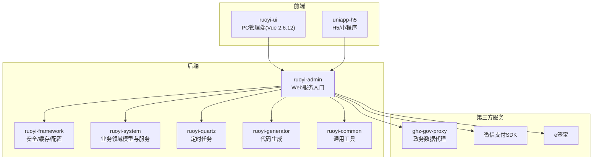
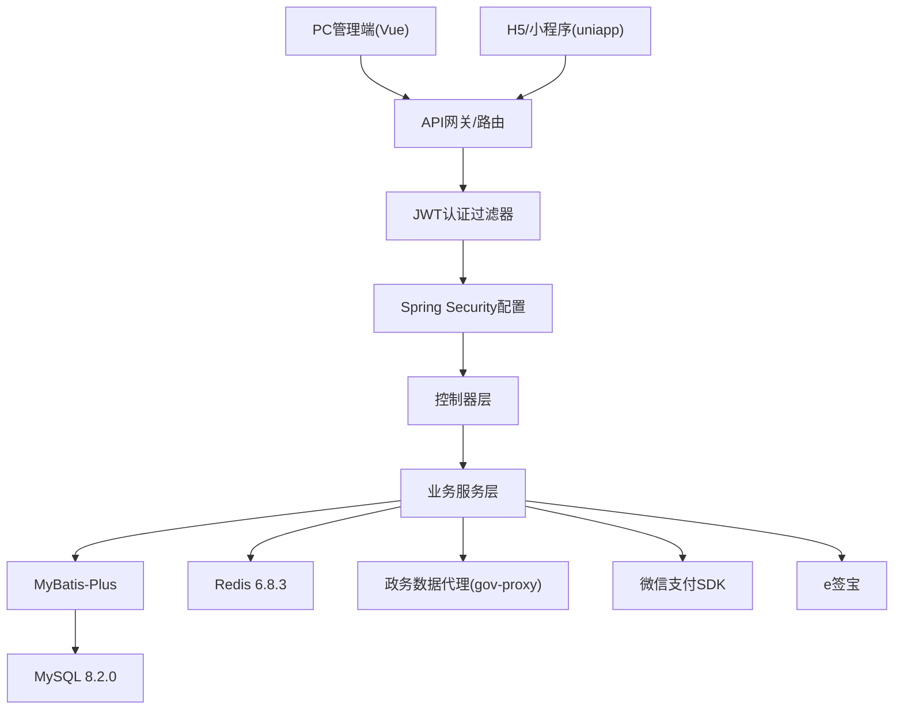
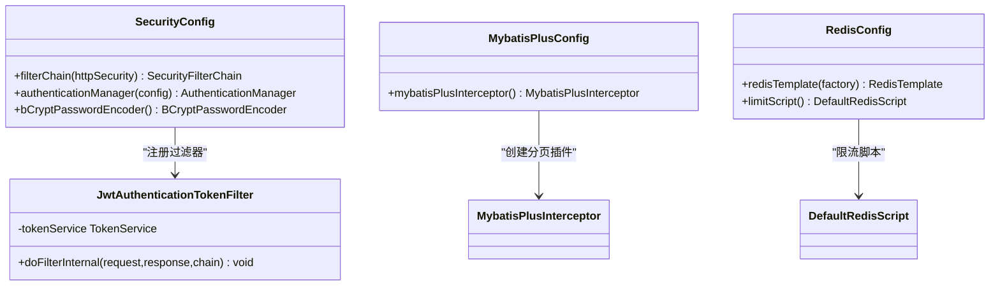
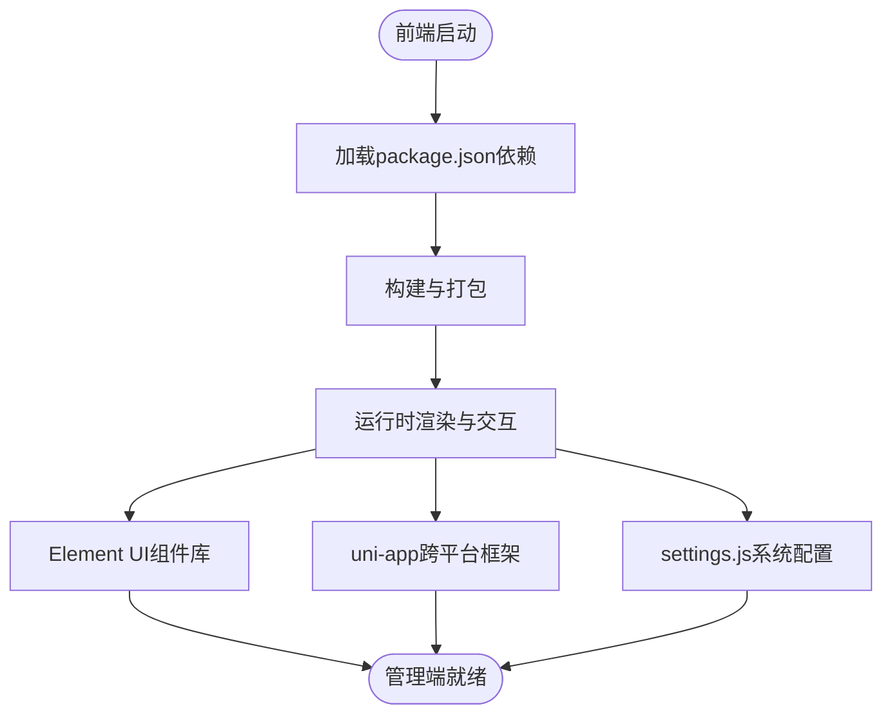
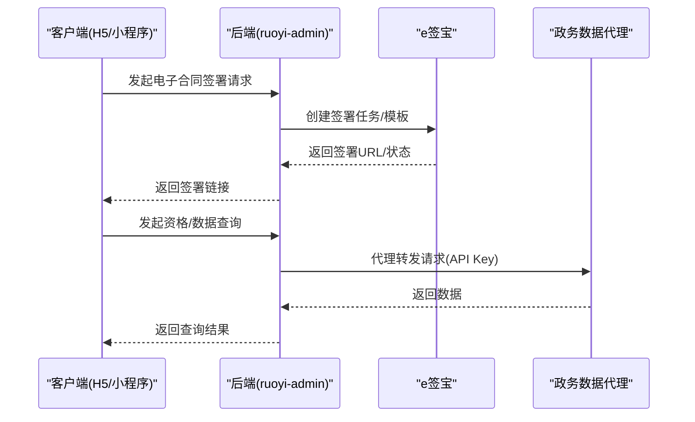
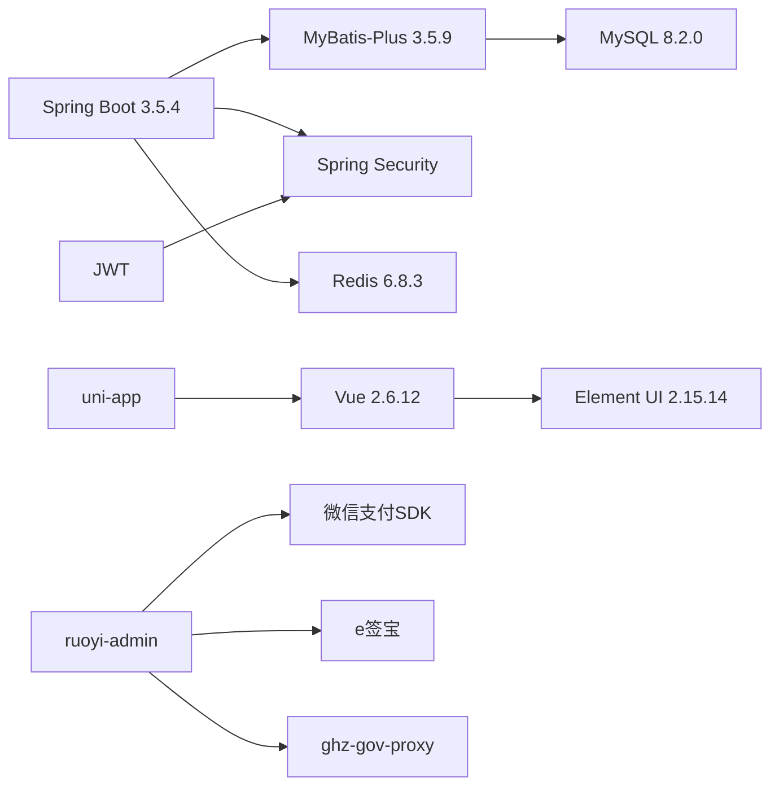

# 技术栈与依赖

<cite>
**本文引用的文件**
- [根POM文件](file://pom.xml)
- [ruoyi-admin 模块POM](file://ruoyi-admin/pom.xml)
- [ruoyi-ui 前端package.json](file://ruoyi-ui/package.json)
- [uniapp-h5 依赖](file://uniapp-h5/package.json)
- [ruoyi-framework 安全配置](file://ruoyi-framework/src/main/java/com/ruoyi/framework/config/SecurityConfig.java)
- [ruoyi-framework MyBatis-Plus配置](file://ruoyi-framework/src/main/java/com/ruoyi/framework/config/MybatisPlusConfig.java)
- [ruoyi-framework Redis配置](file://ruoyi-framework/src/main/java/com/ruoyi/framework/config/RedisConfig.java)
- [ruoyi-admin 应用配置](file://ruoyi-admin/src/main/resources/application.yml)
- [ruoyi-ui 系统设置](file://ruoyi-ui/src/settings.js)
- [ghz-gov-proxy 应用配置](file://ghz-gov-proxy/src/main/resources/application.yml)
- [ruoyi-framework JWT过滤器](file://ruoyi-framework/src/main/java/com/ruoyi/framework/security/filter/JwtAuthenticationTokenFilter.java)
- [ruoyi-system E签宝服务接口](file://ruoyi-system/src/main/java/com/ruoyi/system/service/EsignService.java)
- [ruoyi-admin 微信支付依赖](file://ruoyi-admin/pom.xml)
- [ruoyi-ui 微信小程序登录计划](file://docs/superpowers/plans/2026-04-09-wechat-miniapp-login.md)
- [ruoyi-system 合同全流程设计](file://docs/superpowers/specs/2026-04-11-contract-full-flow.md)
- [ruoyi-system 合同PDF查看下载](file://docs/superpowers/specs/2026-04-12-contract-pdf-view-download.md)
- [政数接口对接文档](file://政数接口对接-开发汇总文档.md)
</cite>

## 目录
1. [简介](#简介)
2. [项目结构](#项目结构)
3. [核心组件](#核心组件)
4. [架构概览](#架构概览)
5. [详细组件分析](#详细组件分析)
6. [依赖分析](#依赖分析)
7. [性能考虑](#性能考虑)
8. [故障排查指南](#故障排查指南)
9. [结论](#结论)
10. [附录](#附录)

## 简介
本文件系统性梳理港好住信息系统的技术栈与依赖关系，重点覆盖后端技术栈（Spring Boot 3.5.4、MyBatis-Plus 3.5.9、MySQL 8.2.0、Redis 6.8.3、JWT认证）、前端技术栈（Vue.js 2.6.12、Element UI 2.15.14、uni-app跨平台框架），以及第三方服务集成（微信支付、电子合同、政务数据接口）。文档从架构设计、组件职责、数据流、处理逻辑、集成点、错误处理与性能特性等方面进行深入解析，并提供技术选型理由、版本兼容性说明、扩展性建议与学习路径。

## 项目结构
系统采用多模块Maven工程组织，后端基于RuoYi框架扩展，前端分为PC管理端（ruoyi-ui）与H5/小程序端（uniapp-h5），并通过独立的政务数据代理服务（ghz-gov-proxy）对接政府接口。核心模块关系如下：

图表来源
- [根POM文件:184-191](file://pom.xml#L184-L191)
- [ruoyi-admin 模块POM:1-140](file://ruoyi-admin/pom.xml#L1-L140)
- [ruoyi-ui 前端package.json:1-74](file://ruoyi-ui/package.json#L1-L74)
- [ghz-gov-proxy 应用配置:1-13](file://ghz-gov-proxy/src/main/resources/application.yml#L1-L13)

章节来源
- [根POM文件:184-191](file://pom.xml#L184-L191)
- [ruoyi-admin 模块POM:1-140](file://ruoyi-admin/pom.xml#L1-L140)
- [ruoyi-ui 前端package.json:1-74](file://ruoyi-ui/package.json#L1-L74)
- [ghz-gov-proxy 应用配置:1-13](file://ghz-gov-proxy/src/main/resources/application.yml#L1-L13)

## 核心组件
- 后端核心框架：基于Spring Boot 3.5.4，统一依赖管理与版本控制，确保组件兼容性与安全性。
- ORM持久层：MyBatis-Plus 3.5.9，提供增强的CRUD能力与分页插件，适配MySQL 8.2.0。
- 缓存与会话：Redis 6.8.3，结合Spring Cache与自定义RedisTemplate，支持限流脚本与高性能读写。
- 安全与认证：基于Spring Security + JWT，无状态认证，支持跨域与匿名访问白名单。
- 前端生态：Vue.js 2.6.12 + Element UI 2.15.14，PC管理端；uni-app跨平台框架，支撑H5与小程序。
- 第三方集成：微信支付（WeChat Pay）、电子合同（e签宝）、政务数据接口代理（ghz-gov-proxy）。

章节来源
- [根POM文件:42-49](file://pom.xml#L42-L49)
- [ruoyi-framework MybatisPlusConfig:1-28](file://ruoyi-framework/src/main/java/com/ruoyi/framework/config/MybatisPlusConfig.java#L1-L28)
- [ruoyi-framework RedisConfig:1-71](file://ruoyi-framework/src/main/java/com/ruoyi/framework/config/RedisConfig.java#L1-L71)
- [ruoyi-framework 安全配置:1-135](file://ruoyi-framework/src/main/java/com/ruoyi/framework/config/SecurityConfig.java#L1-L135)
- [ruoyi-ui 前端package.json:26-51](file://ruoyi-ui/package.json#L26-L51)
- [ruoyi-admin 模块POM:79-98](file://ruoyi-admin/pom.xml#L79-L98)

## 架构概览
系统采用前后端分离架构，后端通过REST接口提供能力，前端分别面向管理端与移动端。安全层统一由JWT过滤器与Spring Security负责，数据访问层由MyBatis-Plus封装，缓存层使用Redis提升性能。第三方服务通过独立SDK或代理服务接入。

图表来源
- [ruoyi-framework 安全配置:86-124](file://ruoyi-framework/src/main/java/com/ruoyi/framework/config/SecurityConfig.java#L86-L124)
- [ruoyi-framework JWT过滤器:1-45](file://ruoyi-framework/src/main/java/com/ruoyi/framework/security/filter/JwtAuthenticationTokenFilter.java#L1-L45)
- [ruoyi-admin 应用配置:95-103](file://ruoyi-admin/src/main/resources/application.yml#L95-L103)
- [ruoyi-admin 模块POM:79-98](file://ruoyi-admin/pom.xml#L79-L98)

## 详细组件分析

### 后端技术栈与配置
- Spring Boot 3.5.4：统一依赖管理，提供自动配置与starter能力，简化开发与部署。
- MyBatis-Plus 3.5.9：增强CRUD与分页，支持逻辑删除、主键策略与驼峰映射。
- MySQL 8.2.0：高版本特性支持，配合驱动与连接池优化性能。
- Redis 6.8.3：高性能缓存与分布式限流，内置Lua脚本实现原子计数。
- JWT认证：无状态认证，支持跨域与匿名访问白名单，结合Spring Security实现细粒度权限控制。

图表来源
- [ruoyi-framework 安全配置:86-134](file://ruoyi-framework/src/main/java/com/ruoyi/framework/config/SecurityConfig.java#L86-L134)
- [ruoyi-framework JWT过滤器:24-44](file://ruoyi-framework/src/main/java/com/ruoyi/framework/security/filter/JwtAuthenticationTokenFilter.java#L24-L44)
- [ruoyi-framework MybatisPlusConfig:14-27](file://ruoyi-framework/src/main/java/com/ruoyi/framework/config/MybatisPlusConfig.java#L14-L27)
- [ruoyi-framework RedisConfig:22-70](file://ruoyi-framework/src/main/java/com/ruoyi/framework/config/RedisConfig.java#L22-L70)

章节来源
- [根POM文件:42-49](file://pom.xml#L42-L49)
- [ruoyi-framework 安全配置:1-135](file://ruoyi-framework/src/main/java/com/ruoyi/framework/config/SecurityConfig.java#L1-L135)
- [ruoyi-framework MybatisPlusConfig:1-28](file://ruoyi-framework/src/main/java/com/ruoyi/framework/config/MybatisPlusConfig.java#L1-L28)
- [ruoyi-framework RedisConfig:1-71](file://ruoyi-framework/src/main/java/com/ruoyi/framework/config/RedisConfig.java#L1-L71)
- [ruoyi-framework JWT过滤器:1-45](file://ruoyi-framework/src/main/java/com/ruoyi/framework/security/filter/JwtAuthenticationTokenFilter.java#L1-L45)

### 前端技术栈与配置
- Vue.js 2.6.12 + Element UI 2.15.14：成熟的管理端UI框架，组件丰富，生态完善。
- uni-app跨平台：一套代码多端运行，支持H5与小程序，降低维护成本。
- ruoyi-ui系统设置：主题、侧边栏、标签页、固定头部等界面配置项。

图表来源
- [ruoyi-ui 前端package.json:26-51](file://ruoyi-ui/package.json#L26-L51)
- [ruoyi-ui 系统设置:1-57](file://ruoyi-ui/src/settings.js#L1-L57)
- [uniapp-h5 依赖:1-6](file://uniapp-h5/package.json#L1-L6)

章节来源
- [ruoyi-ui 前端package.json:1-74](file://ruoyi-ui/package.json#L1-L74)
- [ruoyi-ui 系统设置:1-57](file://ruoyi-ui/src/settings.js#L1-L57)
- [uniapp-h5 依赖:1-6](file://uniapp-h5/package.json#L1-L6)

### 第三方服务集成
- 微信支付：集成wechatpay-java SDK，支持小程序/公众号/APP/H5支付场景，配置证书与回调地址。
- 电子合同：集成e签宝OpenAPI，支持模板签署、实名认证、回调与跳转页面配置。
- 政务数据接口：通过ghz-gov-proxy代理服务统一接入，支持API Key鉴权与公网回调。

图表来源
- [ruoyi-admin 应用配置:199-230](file://ruoyi-admin/src/main/resources/application.yml#L199-L230)
- [ruoyi-system E签宝服务接口](file://ruoyi-system/src/main/java/com/ruoyi/system/service/EsignService.java)
- [ghz-gov-proxy 应用配置:4-8](file://ghz-gov-proxy/src/main/resources/application.yml#L4-L8)

章节来源
- [ruoyi-admin 模块POM:79-98](file://ruoyi-admin/pom.xml#L79-L98)
- [ruoyi-admin 应用配置:179-230](file://ruoyi-admin/src/main/resources/application.yml#L179-L230)
- [ghz-gov-proxy 应用配置:1-13](file://ghz-gov-proxy/src/main/resources/application.yml#L1-L13)

## 依赖分析
- 版本兼容性
  - Spring Boot 3.5.4 + MyBatis-Plus 3.5.9 + MySQL 8.2.0：经依赖管理统一约束，确保ORM与驱动兼容。
  - Spring Security + JWT：基于Jakarta EE 6.0.0与Spring Security 5.3.31，满足CVE修复与安全要求。
  - 前端Vue 2.6.12 + Element UI 2.15.14：稳定组合，适合管理端场景。
- 组件耦合
  - ruoyi-admin作为聚合模块，集中引入第三方SDK与框架模块，降低重复依赖。
  - ruoyi-framework提供横切能力（安全、缓存、配置），被其他模块复用。
- 外部依赖
  - 微信支付、e签宝、Apache HttpClient/Gson/commons-codec等第三方库通过Maven引入。
  - 政务数据通过独立代理服务解耦，便于灰度与运维。

图表来源
- [根POM文件:42-49](file://pom.xml#L42-L49)
- [ruoyi-admin 模块POM:79-98](file://ruoyi-admin/pom.xml#L79-L98)
- [ruoyi-ui 前端package.json:26-51](file://ruoyi-ui/package.json#L26-L51)

章节来源
- [根POM文件:15-36](file://pom.xml#L15-L36)
- [ruoyi-admin 模块POM:1-140](file://ruoyi-admin/pom.xml#L1-L140)
- [ruoyi-ui 前端package.json:1-74](file://ruoyi-ui/package.json#L1-L74)

## 性能考虑
- 数据库层
  - MyBatis-Plus分页插件启用MySQL方言，避免全表扫描；逻辑删除减少物理删除带来的锁竞争。
  - Druid连接池与MySQL驱动优化连接复用与超时控制。
- 缓存层
  - RedisTemplate使用FastJSON序列化与String键策略，提升读写效率；限流脚本保证高并发下的稳定性。
- 安全与网络
  - JWT无状态认证减少会话存储压力；CORS过滤器前置，避免重复认证开销。
  - 前端静态资源与匿名接口白名单减少鉴权成本。
- 第三方服务
  - 微信支付与e签宝异步回调与幂等设计，结合Redis实现去重与重试控制。

章节来源
- [ruoyi-framework MybatisPlusConfig:14-27](file://ruoyi-framework/src/main/java/com/ruoyi/framework/config/MybatisPlusConfig.java#L14-L27)
- [ruoyi-framework RedisConfig:22-70](file://ruoyi-framework/src/main/java/com/ruoyi/framework/config/RedisConfig.java#L22-L70)
- [ruoyi-framework 安全配置:86-124](file://ruoyi-framework/src/main/java/com/ruoyi/framework/config/SecurityConfig.java#L86-L124)
- [ruoyi-admin 应用配置:95-103](file://ruoyi-admin/src/main/resources/application.yml#L95-L103)

## 故障排查指南
- 认证失败
  - 检查JWT过滤器是否正确提取与验证Token，确认Security配置中匿名白名单与CORS顺序。
  - 关注日志中异常处理器输出，定位具体认证异常。
- 缓存问题
  - 校验Redis连接参数与序列化配置，确认限流脚本执行结果。
- 数据库异常
  - 检查MyBatis-Plus分页与逻辑删除配置，确认Mapper XML与实体映射。
- 第三方集成
  - 微信支付：核对证书路径、API v3密钥与回调域名；e签宝：确认模板ID与回调地址；政务数据：核对API Key与代理地址。
- 前端问题
  - 核对settings.js主题与布局配置，检查静态资源路径与CDN配置。

章节来源
- [ruoyi-framework 安全配置:86-124](file://ruoyi-framework/src/main/java/com/ruoyi/framework/config/SecurityConfig.java#L86-L124)
- [ruoyi-framework JWT过滤器:24-44](file://ruoyi-framework/src/main/java/com/ruoyi/framework/security/filter/JwtAuthenticationTokenFilter.java#L24-L44)
- [ruoyi-framework RedisConfig:43-70](file://ruoyi-framework/src/main/java/com/ruoyi/framework/config/RedisConfig.java#L43-L70)
- [ruoyi-framework MybatisPlusConfig:14-27](file://ruoyi-framework/src/main/java/com/ruoyi/framework/config/MybatisPlusConfig.java#L14-L27)
- [ruoyi-admin 应用配置:179-230](file://ruoyi-admin/src/main/resources/application.yml#L179-L230)
- [ruoyi-ui 系统设置:1-57](file://ruoyi-ui/src/settings.js#L1-L57)

## 结论
港好住信息系统采用成熟稳定的全栈技术栈：后端以Spring Boot 3.5.4为核心，结合MyBatis-Plus与Redis实现高性能数据访问与缓存；前端以Vue 2与Element UI为基础，配合uni-app实现多端覆盖。通过JWT无状态认证与Spring Security统一治理，配合微信支付、e签宝与政务数据代理的第三方集成，形成完整的业务闭环。整体架构具备良好的扩展性与可维护性，适合持续演进与功能迭代。

## 附录
- 技术选型理由
  - Spring Boot：现代化开发体验与生态完善，利于快速迭代。
  - MyBatis-Plus：减少样板代码，提升开发效率，适配复杂查询与分页。
  - Redis：高并发场景下的缓存与限流能力，保障系统稳定性。
  - Vue 2 + Element UI：管理端UI成熟稳定，组件生态丰富。
  - uni-app：一套代码多端运行，降低移动端开发成本。
- 学习路径与参考资料
  - 后端：Spring Boot官方文档、MyBatis-Plus指南、Spring Security安全配置、JWT认证实践。
  - 前端：Vue 2官方文档、Element UI组件库、uni-app跨平台开发指南。
  - 第三方：微信支付Java SDK文档、e签宝OpenAPI文档、政务数据接口对接指南。
- 相关文档
  - [微信小程序登录计划](file://docs/superpowers/plans/2026-04-09-wechat-miniapp-login.md)
  - [合同全流程设计](file://docs/superpowers/specs/2026-04-11-contract-full-flow.md)
  - [合同PDF查看下载](file://docs/superpowers/specs/2026-04-12-contract-pdf-view-download.md)
  - [政数接口对接文档](file://政数接口对接-开发汇总文档.md)