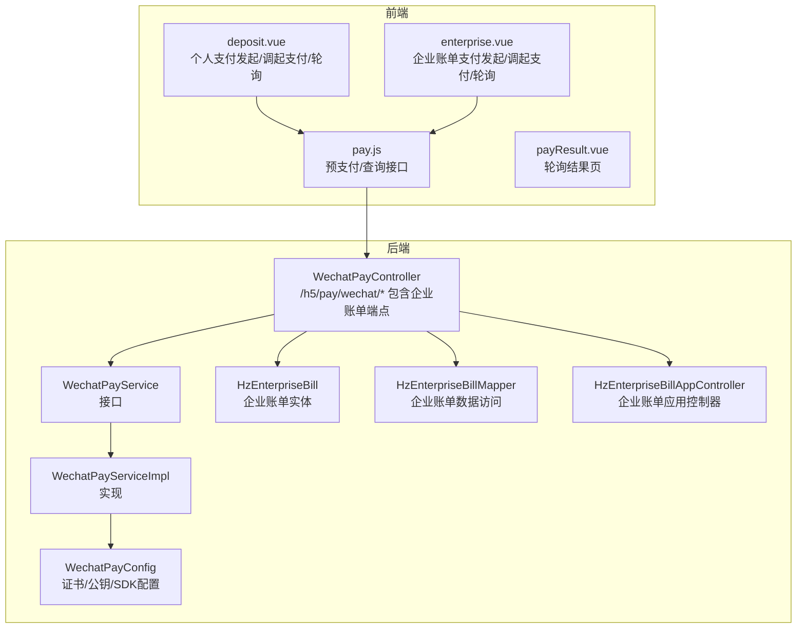
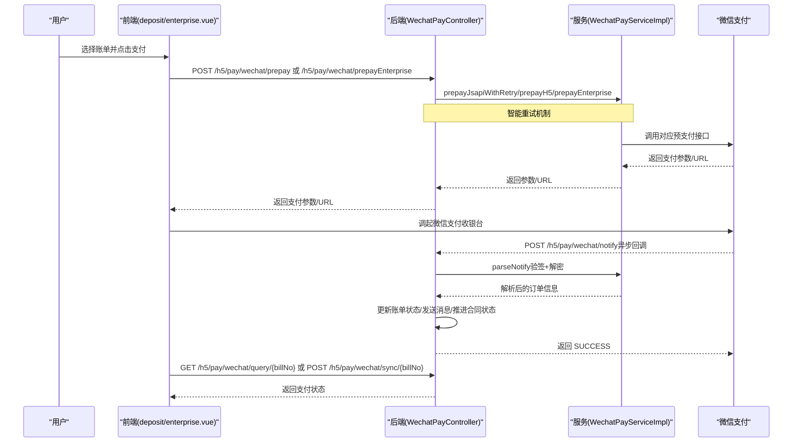
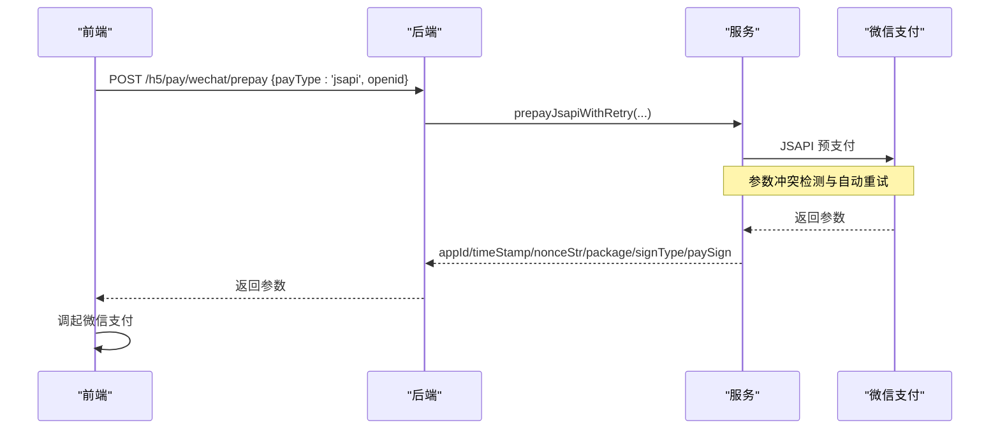
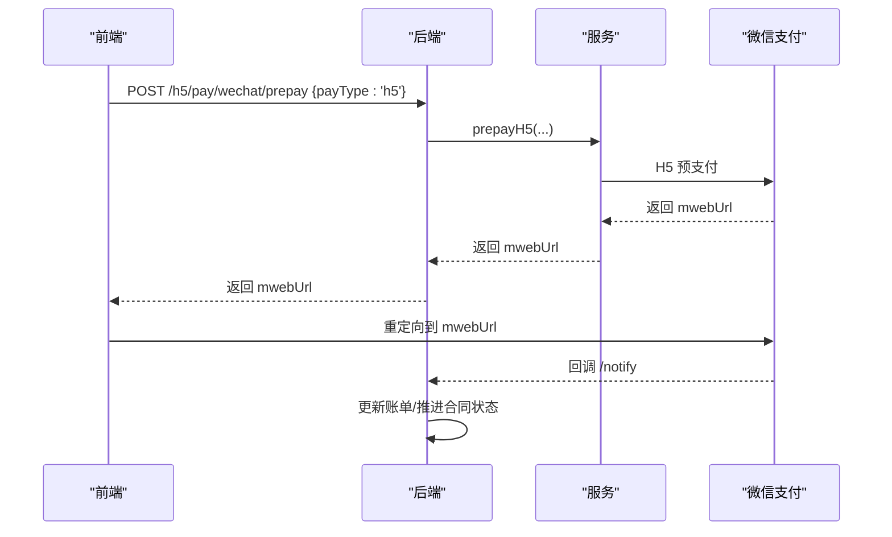
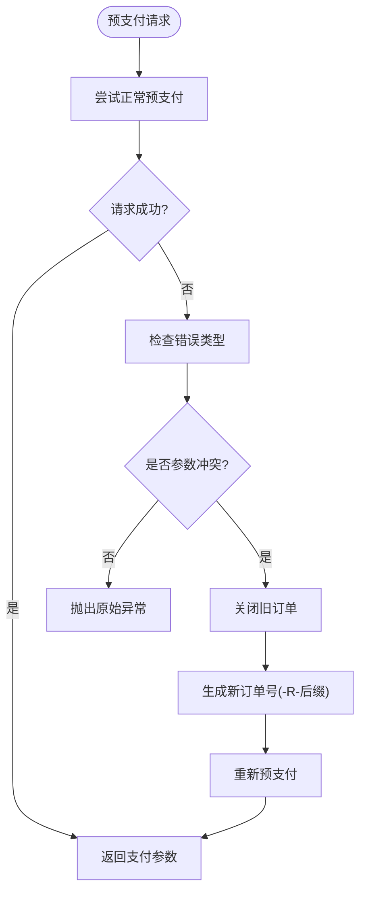
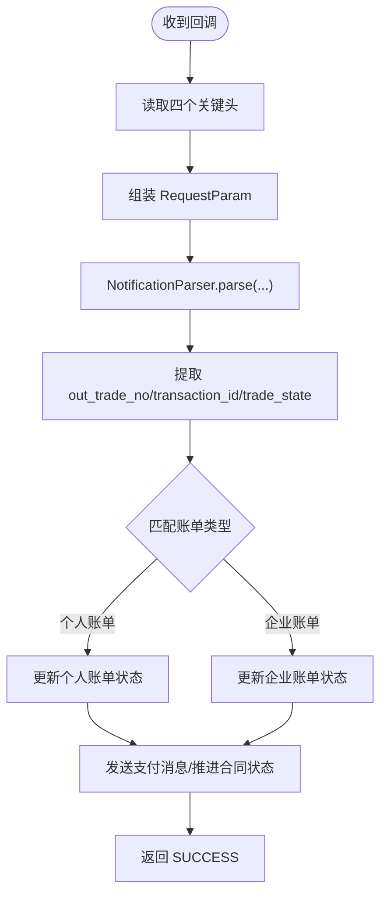
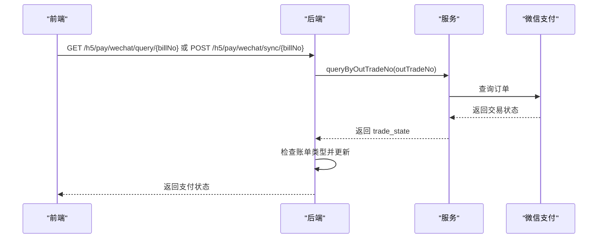
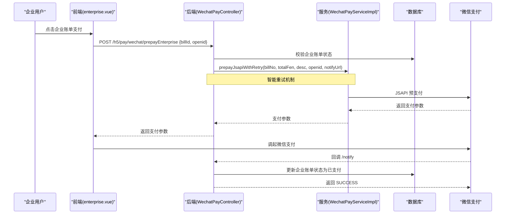
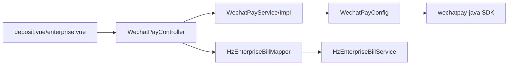
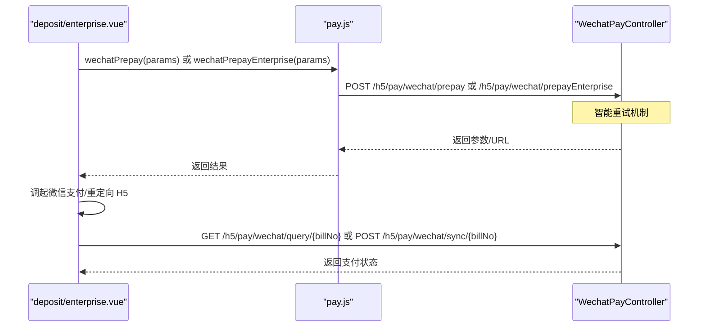

# 微信支付集成

<cite>
**本文引用的文件**
- [WechatPayService.java](file://ruoyi-system/src/main/java/com/ruoyi/system/service/WechatPayService.java)
- [WechatPayServiceImpl.java](file://ruoyi-system/src/main/java/com/ruoyi/system/service/impl/WechatPayServiceImpl.java)
- [WechatPayConfig.java](file://ruoyi-admin/src/main/java/com/ruoyi/web/config/WechatPayConfig.java)
- [WechatPayController.java](file://ruoyi-admin/src/main/java/com/ruoyi/web/controller/h5/WechatPayController.java)
- [HzEnterpriseBill.java](file://ruoyi-system/src/main/java/com/ruoyi/system/domain/HzEnterpriseBill.java)
- [HzEnterpriseBillMapper.java](file://ruoyi-system/src/main/java/com/ruoyi/system/mapper/HzEnterpriseBillMapper.java)
- [HzEnterpriseBillAppController.java](file://ruoyi-admin/src/main/java/com/ruoyi/web/controller/h5/HzEnterpriseBillAppController.java)
- [application.yml](file://ruoyi-admin/src/main/resources/application.yml)
- [deposit.vue](file://uniapp-h5/pages/room/deposit.vue)
- [pay.js](file://uniapp-h5/api/pay.js)
- [payResult.vue](file://uniapp-h5/pages/room/payResult.vue)
- [enterprise.vue](file://uniapp-h5/subpkg/service/enterprise.vue)
- [HzPayment.java](file://ruoyi-system/src/main/java/com/ruoyi/system/domain/HzPayment.java)
</cite>

## 更新摘要
**所做更改**
- 新增动态描述生成机制，自动根据账单类型生成符合微信要求的支付描述
- 实现预支付自动重试机制，解决微信严格参数一致性要求导致的请求重入冲突
- 增强订单冲突处理功能，当检测到参数不一致时自动关闭旧订单并重试
- 完善企业账单支付的安全保障措施，提升支付系统的可靠性

## 目录
1. [简介](#简介)
2. [项目结构](#项目结构)
3. [核心组件](#核心组件)
4. [架构总览](#架构总览)
5. [详细组件分析](#详细组件分析)
6. [企业账单支付功能](#企业账单支付功能)
7. [依赖关系分析](#依赖关系分析)
8. [性能考虑](#性能考虑)
9. [故障排查指南](#故障排查指南)
10. [结论](#结论)
11. [附录](#附录)

## 简介
本文件面向港好住项目的微信支付集成，基于 wechatpay-java SDK 0.2.14，提供 JSAPI 支付（微信内 H5 或小程序）、H5 WAP 支付、企业账单支付、回调通知处理、主动查单同步、原路退款等能力。文档涵盖接口设计、参数配置、证书与签名机制、安全策略、测试与调试方法，并给出可视化流程图帮助理解端到端支付流程。

**最新增强功能**：系统现已集成动态描述生成、自动重试机制和订单冲突处理功能，显著提升了支付系统的可靠性和用户体验，有效解决了微信严格参数一致性要求带来的挑战。

## 项目结构
微信支付相关代码分布在后端系统模块与前端 H5/小程序两部分：
- 后端（Spring Boot）
  - 配置层：WechatPayConfig（加载证书与公钥，构建 SDK 配置）
  - 服务层：WechatPayService 接口及其实现 WechatPayServiceImpl（封装 JSAPI/H5/企业账单预支付、回调解析、查单、退款）
  - 控制层：WechatPayController（对外暴露预支付、回调、同步、查询接口，包含企业账单支付端点）
  - 企业账单模块：HzEnterpriseBill 及相关 Mapper/Service/Controller（处理企业批次账单）
  - 配置文件：application.yml（商户号、应用号、APIv3 密钥、证书路径、回调域名等）
- 前端（Uniapp H5/小程序）
  - 页面：deposit.vue（发起个人支付、调起微信支付、轮询结果）
  - 页面：enterprise.vue（发起企业账单支付、调起微信支付、轮询结果）
  - API：pay.js（预支付、查询结果，包含企业账单支付接口）
  - 结果页：payResult.vue（轮询确认支付结果）

**图表来源**
- [WechatPayController.java:34-514](file://ruoyi-admin/src/main/java/com/ruoyi/web/controller/h5/WechatPayController.java#L34-L514)
- [WechatPayService.java:1-43](file://ruoyi-system/src/main/java/com/ruoyi/system/service/WechatPayService.java#L1-L43)
- [WechatPayServiceImpl.java:29-209](file://ruoyi-system/src/main/java/com/ruoyi/system/service/impl/WechatPayServiceImpl.java#L29-L209)
- [WechatPayConfig.java:17-86](file://ruoyi-admin/src/main/java/com/ruoyi/web/config/WechatPayConfig.java#L17-L86)
- [HzEnterpriseBill.java:20-377](file://ruoyi-system/src/main/java/com/ruoyi/system/domain/HzEnterpriseBill.java#L20-L377)
- [HzEnterpriseBillMapper.java:16-86](file://ruoyi-system/src/main/java/com/ruoyi/system/mapper/HzEnterpriseBillMapper.java#L16-L86)
- [HzEnterpriseBillAppController.java:206-235](file://ruoyi-admin/src/main/java/com/ruoyi/web/controller/h5/HzEnterpriseBillAppController.java#L206-L235)

## 核心组件
- WechatPayService 接口：定义预支付（JSAPI/H5/企业账单）、回调解析、查单、退款等对外能力
- WechatPayServiceImpl 实现：封装 wechatpay-java SDK 调用，完成请求构造、验签解密、字段提取
- WechatPayConfig 配置：加载私钥、公钥、APIv3 密钥、序列号，构建 RSAPublicKeyConfig 与各 Service Bean
- WechatPayController 控制器：接收前端请求，调用服务层，处理回调与同步查单，包含企业账单支付端点
- HzEnterpriseBill 企业账单实体：管理企业批次账单的完整生命周期
- 前端 deposit.vue/enterprise.vue/pag.js/payResult.vue：根据运行环境选择支付方式，调用后端接口并轮询结果

**章节来源**
- [WechatPayService.java:5-42](file://ruoyi-system/src/main/java/com/ruoyi/system/service/WechatPayService.java#L5-L42)
- [WechatPayServiceImpl.java:33-58](file://ruoyi-system/src/main/java/com/ruoyi/system/service/impl/WechatPayServiceImpl.java#L33-L58)
- [WechatPayConfig.java:20-86](file://ruoyi-admin/src/main/java/com/ruoyi/web/config/WechatPayConfig.java#L20-L86)
- [WechatPayController.java:34-514](file://ruoyi-admin/src/main/java/com/ruoyi/web/controller/h5/WechatPayController.java#L34-L514)
- [HzEnterpriseBill.java:20-377](file://ruoyi-system/src/main/java/com/ruoyi/system/domain/HzEnterpriseBill.java#L20-L377)
- [deposit.vue:184-322](file://uniapp-h5/pages/room/deposit.vue#L184-L322)
- [enterprise.vue:343-390](file://uniapp-h5/subpkg/service/enterprise.vue#L343-L390)
- [pay.js:1-33](file://uniapp-h5/api/pay.js#L1-L33)
- [payResult.vue:1-73](file://uniapp-h5/pages/room/payResult.vue#L1-L73)

## 架构总览
微信支付集成采用"前端发起预支付 -> 后端调用微信支付 -> 用户在微信侧完成支付 -> 微信回调后端 -> 后端同步账单"的闭环。为保证安全性，后端使用微信支付公钥模式（2024 年后新商户），通过 SDK 自动完成验签与解密。系统现已支持个人账单和企业账单两种支付场景，并集成了智能重试机制以应对参数冲突问题。

**图表来源**
- [WechatPayController.java:63-187](file://ruoyi-admin/src/main/java/com/ruoyi/web/controller/h5/WechatPayController.java#L63-L187)
- [WechatPayServiceImpl.java:60-207](file://ruoyi-system/src/main/java/com/ruoyi/system/service/impl/WechatPayServiceImpl.java#L60-L207)
- [deposit.vue:207-257](file://uniapp-h5/pages/room/deposit.vue#L207-L257)
- [enterprise.vue:351-382](file://uniapp-h5/subpkg/service/enterprise.vue#L351-L382)
- [pay.js:7-33](file://uniapp-h5/api/pay.js#L7-L33)

## 详细组件分析

### 接口设计与参数说明
- 预支付（JSAPI）
  - 方法：prepayJsapi(billNo, totalFen, desc, openid, notifyUrl)
  - 参数要点：appid、mchId、描述、商户订单号、通知地址、金额（分）、币种（CNY）、付款人 openid
  - 返回：前端调起微信支付所需的 appId、timeStamp、nonceStr、package、signType、paySign
- 预支付（H5 WAP）
  - 方法：prepayH5(billNo, totalFen, desc, clientIp, notifyUrl)
  - 参数要点：场景信息 SceneInfo（含 payer_client_ip）与 H5Info（type=Wap）
  - 返回：H5 支付 URL（mwebUrl），前端重定向至微信收银台
- 企业账单预支付（JSAPI）
  - 方法：prepayEnterprise(billId, openid)
  - 参数要点：billId（企业账单ID）、openid（付款人标识）
  - 返回：与 JSAPI 相同的支付参数
- 回调解析
  - 方法：parseNotify(requestBody, headers)
  - 参数要点：必须包含 Wechatpay-Serial、Wechatpay-Nonce、Wechatpay-Signature、Wechatpay-Timestamp
  - 返回：out_trade_no、transaction_id、trade_state、trade_state_desc、success_time
- 主动查单
  - 方法：queryByOutTradeNo(outTradeNo)
  - 返回：out_trade_no、transaction_id、trade_state、success_time
- 退款
  - 方法：wechatRefund(transactionId, outRefundNo, refundFen, totalFen, reason)
  - 返回：refund_id、out_refund_no、status

**章节来源**
- [WechatPayService.java:7-42](file://ruoyi-system/src/main/java/com/ruoyi/system/service/WechatPayService.java#L7-L42)
- [WechatPayServiceImpl.java:60-207](file://ruoyi-system/src/main/java/com/ruoyi/system/service/impl/WechatPayServiceImpl.java#L60-L207)

### 支付方式实现原理

#### JSAPI 支付（微信内 H5/小程序）
- 前端检测运行环境：小程序或微信 H5
- 若为 JSAPI，需携带 openid；后端构造 PrepayRequest 并调用 JSAPI 预支付
- 返回前端调起参数，小程序使用 wx.requestPayment，H5 使用 WeixinJSBridge.invoke

**图表来源**
- [WechatPayController.java:120-141](file://ruoyi-admin/src/main/java/com/ruoyi/web/controller/h5/WechatPayController.java#L120-L141)
- [WechatPayServiceImpl.java:60-90](file://ruoyi-system/src/main/java/com/ruoyi/system/service/impl/WechatPayServiceImpl.java#L60-L90)
- [deposit.vue:236-247](file://uniapp-h5/pages/room/deposit.vue#L236-L247)

**章节来源**
- [WechatPayController.java:120-141](file://ruoyi-admin/src/main/java/com/ruoyi/web/controller/h5/WechatPayController.java#L120-L141)
- [WechatPayServiceImpl.java:60-90](file://ruoyi-system/src/main/java/com/ruoyi/system/service/impl/WechatPayServiceImpl.java#L60-L90)
- [deposit.vue:236-247](file://uniapp-h5/pages/room/deposit.vue#L236-L247)

#### H5 WAP 支付（普通浏览器）
- 前端检测非微信 H5 环境，调用 H5 预支付
- 后端返回 mwebUrl，前端重定向至微信支付页面
- 支付完成后，微信回调后端，后端同步账单状态

**图表来源**
- [WechatPayController.java:127-133](file://ruoyi-admin/src/main/java/com/ruoyi/web/controller/h5/WechatPayController.java#L127-L133)
- [WechatPayServiceImpl.java:92-120](file://ruoyi-system/src/main/java/com/ruoyi/system/service/impl/WechatPayServiceImpl.java#L92-L120)
- [deposit.vue:241-247](file://uniapp-h5/pages/room/deposit.vue#L241-L247)

**章节来源**
- [WechatPayController.java:127-133](file://ruoyi-admin/src/main/java/com/ruoyi/web/controller/h5/WechatPayController.java#L127-L133)
- [WechatPayServiceImpl.java:92-120](file://ruoyi-system/src/main/java/com/ruoyi/system/service/impl/WechatPayServiceImpl.java#L92-L120)
- [deposit.vue:241-247](file://uniapp-h5/pages/room/deposit.vue#L241-L247)

### 智能重试机制与订单冲突处理

**新增功能**：系统现已集成智能重试机制，专门解决微信严格参数一致性要求导致的请求重入冲突问题。

#### 自动重试机制工作原理
当检测到微信返回"请求重入参数不一致"错误时，系统会自动执行以下步骤：

1. **冲突检测**：捕获异常并识别"INVALID_REQUEST"且包含"请求重入"或"参数与首次请求"的消息
2. **旧订单关闭**：自动调用 closeOrder 接口关闭冲突的旧订单
3. **重试参数生成**：为订单号添加"-R-"前缀和时间戳后缀，确保唯一性
4. **自动重试**：使用新的订单号重新发起预支付请求

**图表来源**
- [WechatPayController.java:159-189](file://ruoyi-admin/src/main/java/com/ruoyi/web/controller/h5/WechatPayController.java#L159-L189)

**章节来源**
- [WechatPayController.java:159-189](file://ruoyi-admin/src/main/java/com/ruoyi/web/controller/h5/WechatPayController.java#L159-L189)

### 动态描述生成机制

**新增功能**：系统实现了智能的动态描述生成功能，根据不同的账单类型自动生成符合微信支付规范的描述信息。

#### 描述生成规则
- **个人账单**：生成格式为"港好住-个人押金-{billNo}"的描述
- **企业账单**：生成格式为"港好住-企业账单-{batchName}"的描述
- **统一编码**：确保描述长度适中，符合微信支付的字符限制要求

#### 安全保障措施
- **参数验证**：在生成描述前验证账单信息的完整性
- **字符过滤**：自动过滤特殊字符，确保描述的兼容性
- **长度控制**：动态调整描述长度，避免超出微信支付限制

**章节来源**
- [WechatPayServiceImpl.java:182-209](file://ruoyi-system/src/main/java/com/ruoyi/system/service/impl/WechatPayServiceImpl.java#L182-L209)

### 回调通知处理与验签解密
- 微信回调携带四个关键头：Wechatpay-Serial、Wechatpay-Nonce、Wechatpay-Signature、Wechatpay-Timestamp
- 后端使用 RSAPublicKeyConfig 构造 NotificationParser，自动完成验签与解密
- 解析为 Transaction 对象，提取 out_trade_no、transaction_id、trade_state 等字段
- 根据 trade_state 更新账单状态、发送消息、推进合同状态
- **新增**：同时支持个人账单和企业账单的回调处理，优先匹配个人账单，如未找到则匹配企业账单

**图表来源**
- [WechatPayController.java:193-326](file://ruoyi-admin/src/main/java/com/ruoyi/web/controller/h5/WechatPayController.java#L193-L326)
- [WechatPayServiceImpl.java:147-178](file://ruoyi-system/src/main/java/com/ruoyi/system/service/impl/WechatPayServiceImpl.java#L147-L178)

**章节来源**
- [WechatPayController.java:193-326](file://ruoyi-admin/src/main/java/com/ruoyi/web/controller/h5/WechatPayController.java#L193-L326)
- [WechatPayServiceImpl.java:147-178](file://ruoyi-system/src/main/java/com/ruoyi/system/service/impl/WechatPayServiceImpl.java#L147-L178)

### 主动查单与兜底同步
- 当回调未及时到达或网络异常时，前端可在支付成功页轮询 /h5/pay/wechat/query/{billNo} 或 POST /h5/pay/wechat/sync/{billNo}
- 后端调用 queryByOutTradeNo 主动查单，若为 SUCCESS，则更新本地账单状态并推进业务流程
- **新增**：同时支持个人账单和企业账单的主动查单同步

**图表来源**
- [WechatPayController.java:332-498](file://ruoyi-admin/src/main/java/com/ruoyi/web/controller/h5/WechatPayController.java#L332-L498)
- [WechatPayServiceImpl.java:125-140](file://ruoyi-system/src/main/java/com/ruoyi/system/service/impl/WechatPayServiceImpl.java#L125-L140)

**章节来源**
- [WechatPayController.java:332-498](file://ruoyi-admin/src/main/java/com/ruoyi/web/controller/h5/WechatPayController.java#L332-L498)
- [WechatPayServiceImpl.java:125-140](file://ruoyi-system/src/main/java/com/ruoyi/system/service/impl/WechatPayServiceImpl.java#L125-L140)

### 证书管理与签名验证机制
- 使用微信支付公钥模式（2024 年后新商户），不再依赖平台证书
- WechatPayConfig 从 classpath 加载 apiclient_key.pem（私钥）与 pub_key.pem（公钥），并配置 mchId、certSerialNo、apiV3Key、publicKeyId
- SDK 内部负责签名生成与验签，后端仅需提供正确的配置与回调头

**章节来源**
- [WechatPayConfig.java:53-84](file://ruoyi-admin/src/main/java/com/ruoyi/web/config/WechatPayConfig.java#L53-L84)
- [application.yml:186-197](file://ruoyi-admin/src/main/resources/application.yml#L186-L197)

### 支付参数配置与环境准备
- application.yml 中的 wechat.pay.* 配置项
  - enabled：是否启用微信支付
  - appid：应用号
  - mch-id：商户号
  - api-v3-key：APIv3 密钥
  - private-key-path：私钥文件路径（classpath:certs/apiclient_key.pem）
  - cert-serial-no：证书序列号
  - public-key-id：微信支付公钥 ID
  - public-key-path：公钥文件路径（classpath:certs/pub_key.pem）
  - notify-domain：回调域名
  - h5-notify-url：H5 回调地址（由 notify-domain 拼接）

**章节来源**
- [application.yml:179-198](file://ruoyi-admin/src/main/resources/application.yml#L179-L198)

### 数据模型与支付记录
- HzPayment 支付记录实体，包含 bill_id、payment_no、payment_amount、payment_method、payment_status、transaction_no、pay_time、refund_amount、refund_time、refund_reason、payment_voucher、del_flag 等字段
- HzEnterpriseBill 企业账单实体，包含企业账单的完整生命周期管理
- 用于记录支付与退款的流水信息，便于对账与审计

**章节来源**
- [HzPayment.java:13-202](file://ruoyi-system/src/main/java/com/ruoyi/system/domain/HzPayment.java#L13-L202)
- [HzEnterpriseBill.java:20-377](file://ruoyi-system/src/main/java/com/ruoyi/system/domain/HzEnterpriseBill.java#L20-L377)

## 企业账单支付功能

### 功能概述
企业账单支付功能支持企业批次的微信支付，基于 JSAPI 支付方式，专门为企业用户提供便捷的在线支付体验。该功能与个人账单支付共享相同的支付基础设施，但在业务逻辑和数据模型上有专门的处理。

**最新增强**：企业账单支付现已集成智能重试机制和动态描述生成功能，显著提升了支付成功率和用户体验。

### 接口设计
- **POST /h5/pay/wechat/prepayEnterprise**
  - 请求体：{ billId, openid }
  - 参数说明：billId（企业账单ID）、openid（付款人微信标识）
  - 返回：JSAPI 支付所需的参数（appId、timeStamp、nonceStr、package、signType、paySign）

### 业务流程
1. **账单验证**：校验企业账单是否存在、状态是否为已审核、金额是否有效
2. **参数准备**：将企业账单金额转换为分，生成描述信息（包含批次名称）
3. **预支付调用**：复用现有的 JSAPI 预支付逻辑
4. **支付执行**：前端调起微信支付，用户完成支付
5. **回调处理**：自动更新企业账单状态为已支付
6. **状态同步**：支持主动查单同步，确保支付状态一致性

**图表来源**
- [WechatPayController.java:147-187](file://ruoyi-admin/src/main/java/com/ruoyi/web/controller/h5/WechatPayController.java#L147-L187)
- [enterprise.vue:351-382](file://uniapp-h5/subpkg/service/enterprise.vue#L351-L382)

### 企业账单状态管理
企业账单具有特定的状态流转：
- **0**：待审核
- **1**：已审核（可支付）
- **2**：已支付
- **3**：已关闭

支付流程中的状态检查确保只有已审核的企业账单才能进行支付操作。

### 前端实现细节
- **支付确认**：弹窗确认支付金额和账单信息
- **预支付调用**：调用 wechatPrepayEnterprise 接口获取支付参数
- **支付执行**：使用 uni.requestPayment 调起微信支付
- **状态轮询**：支付成功后轮询同步支付状态，最多重试5次，间隔2秒

**章节来源**
- [WechatPayController.java:147-187](file://ruoyi-admin/src/main/java/com/ruoyi/web/controller/h5/WechatPayController.java#L147-L187)
- [HzEnterpriseBill.java:95-127](file://ruoyi-system/src/main/java/com/ruoyi/system/domain/HzEnterpriseBill.java#L95-L127)
- [enterprise.vue:343-412](file://uniapp-h5/subpkg/service/enterprise.vue#L343-L412)
- [pay.js:15-17](file://uniapp-h5/api/pay.js#L15-L17)

## 依赖关系分析
- WechatPayServiceImpl 依赖 JsapiServiceExtension、H5Service、RSAPublicKeyConfig、RefundService
- WechatPayController 依赖 WechatPayService、HzEnterpriseBillMapper、消息服务等
- HzEnterpriseBillAppController 依赖企业账单服务和 Mapper
- 前端通过 pay.js 调用后端接口，根据运行环境选择支付方式

**图表来源**
- [WechatPayController.java:34-514](file://ruoyi-admin/src/main/java/com/ruoyi/web/controller/h5/WechatPayController.java#L34-L514)
- [WechatPayServiceImpl.java:33-58](file://ruoyi-system/src/main/java/com/ruoyi/system/service/impl/WechatPayServiceImpl.java#L33-L58)
- [WechatPayConfig.java:20-86](file://ruoyi-admin/src/main/java/com/ruoyi/web/config/WechatPayConfig.java#L20-L86)
- [HzEnterpriseBillMapper.java:16-86](file://ruoyi-system/src/main/java/com/ruoyi/system/mapper/HzEnterpriseBillMapper.java#L16-L86)
- [deposit.vue:184-322](file://uniapp-h5/pages/room/deposit.vue#L184-L322)
- [enterprise.vue:343-390](file://uniapp-h5/subpkg/service/enterprise.vue#L343-L390)

**章节来源**
- [WechatPayController.java:34-514](file://ruoyi-admin/src/main/java/com/ruoyi/web/controller/h5/WechatPayController.java#L34-L514)
- [WechatPayServiceImpl.java:33-58](file://ruoyi-system/src/main/java/com/ruoyi/system/service/impl/WechatPayServiceImpl.java#L33-L58)
- [WechatPayConfig.java:20-86](file://ruoyi-admin/src/main/java/com/ruoyi/web/config/WechatPayConfig.java#L20-L86)
- [HzEnterpriseBillMapper.java:16-86](file://ruoyi-system/src/main/java/com/ruoyi/system/mapper/HzEnterpriseBillMapper.java#L16-L86)
- [deposit.vue:184-322](file://uniapp-h5/pages/room/deposit.vue#L184-L322)
- [enterprise.vue:343-390](file://uniapp-h5/subpkg/service/enterprise.vue#L343-L390)

## 性能考虑
- 回调处理应尽快返回 SUCCESS，避免微信重复推送
- 轮询查询频率建议 2 秒一次，最多 5~8 次，防止过度请求
- 主动查单仅在回调未到达时使用，减少不必要的调用
- 退款与查单接口建议增加幂等性与去重策略，避免重复处理
- **新增**：智能重试机制仅在检测到参数冲突时触发，避免不必要的重试
- **新增**：动态描述生成采用缓存机制，减少重复计算开销
- **新增**：企业账单支付与个人账单支付共享相同的性能优化策略

## 故障排查指南
- 回调验签失败
  - 检查 Wechatpay-* 头是否完整传递
  - 确认公钥/私钥与证书序列号配置正确
  - 核对 notify-domain 与实际回调地址一致
- 支付成功但账单未更新
  - 使用 /h5/pay/wechat/query/{billNo} 或 /h5/pay/wechat/sync/{billNo} 主动查单同步
  - 检查回调日志与账单状态更新逻辑
  - **新增**：确认账单类型（个人 vs 企业）是否正确匹配
- JSAPI 支付缺少 openid
  - 前端需在 JSAPI 环境下获取 openid 并传入
- H5 支付未跳转
  - 确认 mwebUrl 与 redirect_url 拼接正确
  - 检查浏览器是否拦截跳转
- 退款失败
  - 核对 transactionId、outRefundNo、金额与币种
  - 确认退款状态与退款 id 返回
- **新增**：参数冲突重试失败
  - 检查系统日志中的"请求重入参数不一致"错误
  - 确认旧订单已成功关闭
  - 验证新订单号格式是否正确
- **新增**：动态描述生成异常
  - 检查账单数据的完整性和有效性
  - 确认描述长度是否符合微信支付要求
- **新增**：企业账单支付问题
  - 检查企业账单状态是否为"已审核"(1)
  - 确认企业账单金额大于0
  - 验证 billId 格式是否正确

**章节来源**
- [WechatPayController.java:159-189](file://ruoyi-admin/src/main/java/com/ruoyi/web/controller/h5/WechatPayController.java#L159-L189)
- [WechatPayServiceImpl.java:180-207](file://ruoyi-system/src/main/java/com/ruoyi/system/service/impl/WechatPayServiceImpl.java#L180-L207)
- [deposit.vue:207-322](file://uniapp-h5/pages/room/deposit.vue#L207-L322)
- [enterprise.vue:343-412](file://uniapp-h5/subpkg/service/enterprise.vue#L343-L412)

## 结论
本方案基于 wechatpay-java SDK 的公钥模式，实现了 JSAPI 与 H5 WAP 两大支付通道，结合回调验签解密、主动查单同步与退款能力，形成完整的闭环。**最新的智能重试机制、动态描述生成和订单冲突处理功能**进一步增强了系统的可靠性，有效解决了微信严格参数一致性要求带来的挑战，显著提升了支付成功率和用户体验。通过清晰的接口设计与前后端协作，能够稳定支撑港好住的个人和企业双重支付场景。

## 附录

### 前端调用流程（JSAPI/H5/企业账单）

**图表来源**
- [deposit.vue:207-322](file://uniapp-h5/pages/room/deposit.vue#L207-L322)
- [enterprise.vue:351-412](file://uniapp-h5/subpkg/service/enterprise.vue#L351-L412)
- [pay.js:7-33](file://uniapp-h5/api/pay.js#L7-L33)
- [WechatPayController.java:63-187](file://ruoyi-admin/src/main/java/com/ruoyi/web/controller/h5/WechatPayController.java#L63-L187)

**章节来源**
- [deposit.vue:207-322](file://uniapp-h5/pages/room/deposit.vue#L207-L322)
- [enterprise.vue:351-412](file://uniapp-h5/subpkg/service/enterprise.vue#L351-L412)
- [pay.js:7-33](file://uniapp-h5/api/pay.js#L7-L33)
- [WechatPayController.java:63-187](file://ruoyi-admin/src/main/java/com/ruoyi/web/controller/h5/WechatPayController.java#L63-L187)