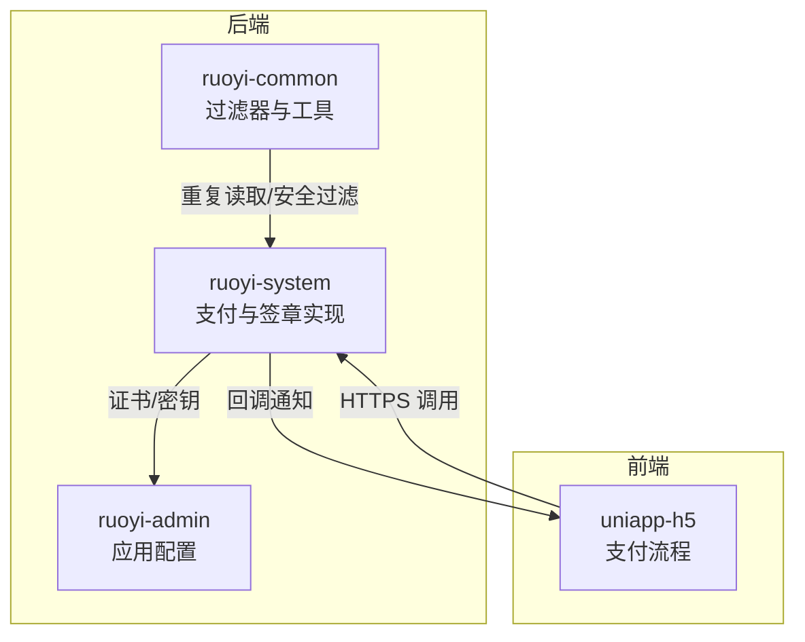
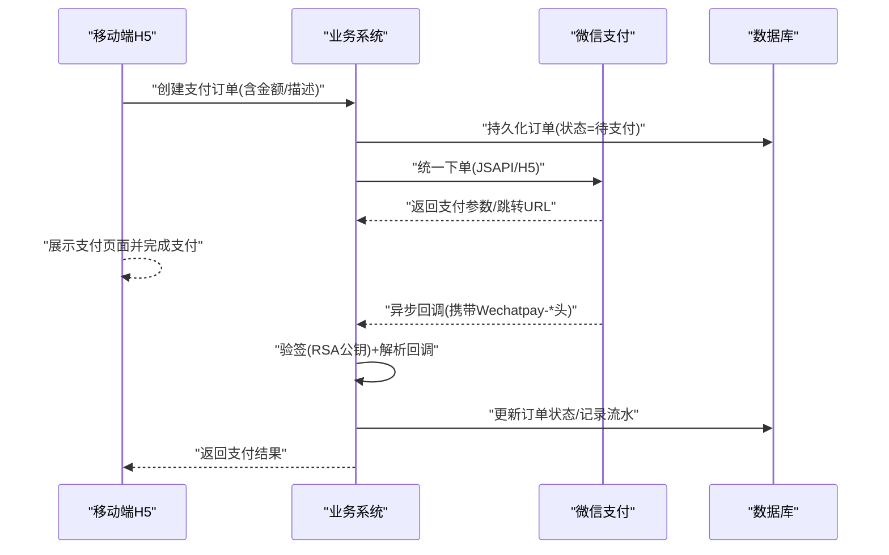
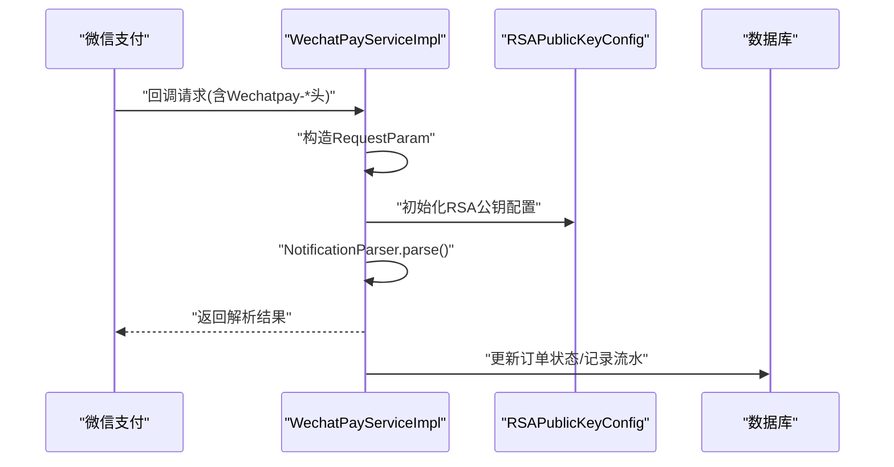
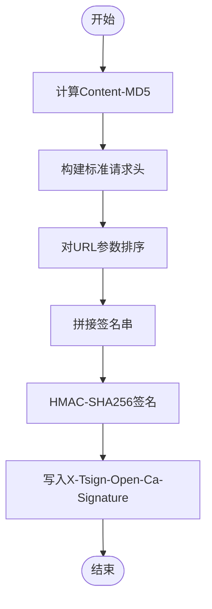
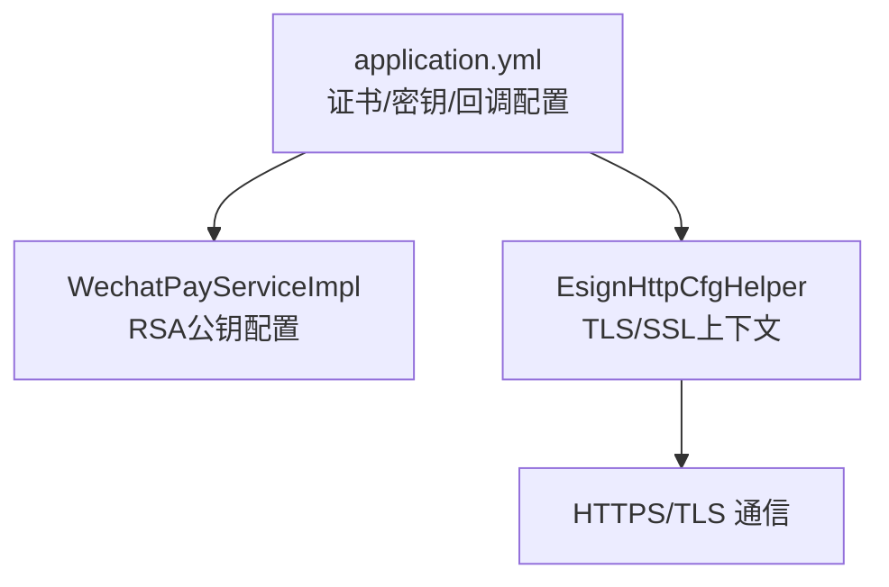
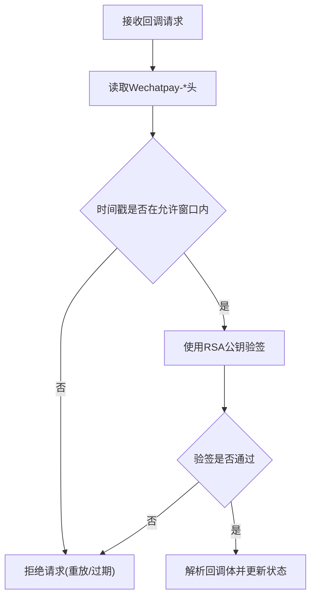
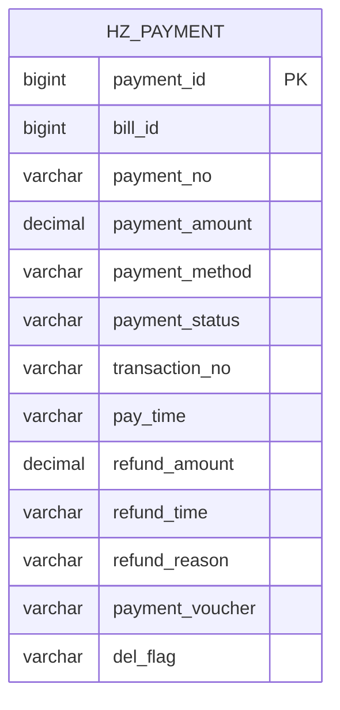
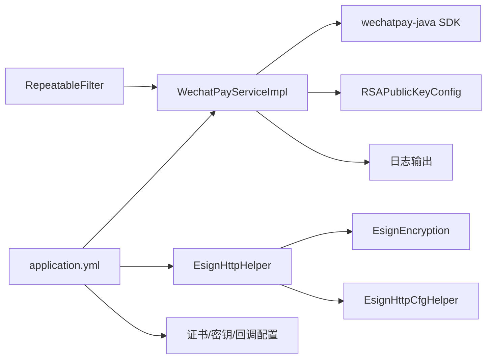

# 支付安全设计

<cite>
**本文引用的文件**   
- [WechatPayServiceImpl.java](file://ruoyi-system/src/main/java/com/ruoyi/system/service/impl/WechatPayServiceImpl.java)
- [EsignEncryption.java](file://ruoyi-system/src/main/java/com/ruoyi/system/esign/EsignEncryption.java)
- [EsignHttpHelper.java](file://ruoyi-system/src/main/java/com/ruoyi/system/esign/EsignHttpHelper.java)
- [application.yml](file://ruoyi-admin/src/main/resources/application.yml)
- [RepeatableFilter.java](file://ruoyi-common/src/main/java/com/ruoyi/common/filter/RepeatableFilter.java)
- [HttpUtils.java](file://ruoyi-common/src/main/java/com/ruoyi/common/utils/http/HttpUtils.java)
- [EsignHttpCfgHelper.java](file://ruoyi-system/src/main/java/com/ruoyi/system/esign/EsignHttpCfgHelper.java)
- [HzPayment.java](file://ruoyi-system/src/main/java/com/ruoyi/system/domain/HzPayment.java)
- [project-wxpay-config.md](file://.claude/projects/-Users-wangwen-Desktop-ghz-ghz/memory/project-wxpay-config.md)
- [技术方案.html](file://技术方案.html)
</cite>

## 目录
1. [简介](#简介)
2. [项目结构](#项目结构)
3. [核心组件](#核心组件)
4. [架构总览](#架构总览)
5. [详细组件分析](#详细组件分析)
6. [依赖分析](#依赖分析)
7. [性能考虑](#性能考虑)
8. [故障排查指南](#故障排查指南)
9. [结论](#结论)
10. [附录](#附录)

## 简介
本文件面向港好住支付系统的安全设计，系统采用“多层防护”的安全策略，覆盖数据传输加密、签名验证、防重放攻击、防篡改保护、密钥与证书管理、日志与审计、异常监控与风控等方面。重点包括：
- 传输层安全：HTTPS/TLS 强制启用，证书校验与主机名校验严格配置
- 签名与验签：微信支付回调使用 RSA 公钥验签，第三方接口使用 HMAC-SHA256 签名
- 防重放与防篡改：时间戳、随机数、请求体 MD5 校验、请求头完整性校验
- 存储与密钥：敏感配置集中于配置文件，证书与密钥文件受控存放
- 审计与风控：统一日志输出、重复提交过滤、回调幂等处理、异常监控与告警

## 项目结构
围绕支付安全的关键模块分布如下：
- ruoyi-system：支付服务实现（微信支付）、电子签章工具链（签名、MD5、HTTP 辅助）
- ruoyi-common：过滤器与通用工具（重复读取请求体、HTTP 安全工具）
- ruoyi-admin：应用配置（微信支付、e签宝、证书路径、回调域名等）
- uniapp-h5：前端支付流程（JSAPI/小程序支付、H5 支付）

**图表来源**
- [WechatPayServiceImpl.java:1-209](file://ruoyi-system/src/main/java/com/ruoyi/system/service/impl/WechatPayServiceImpl.java#L1-L209)
- [EsignHttpHelper.java:1-103](file://ruoyi-system/src/main/java/com/ruoyi/system/esign/EsignHttpHelper.java#L1-L103)
- [application.yml:179-219](file://ruoyi-admin/src/main/resources/application.yml#L179-L219)
- [RepeatableFilter.java:1-52](file://ruoyi-common/src/main/java/com/ruoyi/common/filter/RepeatableFilter.java#L1-L52)

**章节来源**
- [WechatPayServiceImpl.java:1-209](file://ruoyi-system/src/main/java/com/ruoyi/system/service/impl/WechatPayServiceImpl.java#L1-L209)
- [EsignHttpHelper.java:1-103](file://ruoyi-system/src/main/java/com/ruoyi/system/esign/EsignHttpHelper.java#L1-L103)
- [application.yml:179-219](file://ruoyi-admin/src/main/resources/application.yml#L179-L219)
- [RepeatableFilter.java:1-52](file://ruoyi-common/src/main/java/com/ruoyi/common/filter/RepeatableFilter.java#L1-L52)

## 核心组件
- 微信支付回调解析与验签：使用 wechatpay-java SDK 的 NotificationParser，结合 RSAPublicKeyConfig 完成验签与解密，确保回调数据不可篡改且来自微信官方。
- e签宝签名与完整性校验：通过 Content-MD5、时间戳、排序参数、HMAC-SHA256 签名，构建标准化签名串并附加到请求头，保障请求完整性与抗抵赖。
- 传输安全与证书校验：应用配置中明确指定证书路径与公钥信息，HTTP 工具类提供严格的 TLS/SSL 上下文配置，避免弱密码套件与过时协议。
- 重复提交与请求体复用：JSON 请求体可重复读取，避免一次性消费导致的二次解析失败，降低重放与篡改风险。
- 支付数据模型：HzPayment 记录支付流水、状态、第三方交易号、凭证等，支撑审计与对账。

**章节来源**
- [WechatPayServiceImpl.java:142-178](file://ruoyi-system/src/main/java/com/ruoyi/system/service/impl/WechatPayServiceImpl.java#L142-L178)
- [EsignEncryption.java:23-83](file://ruoyi-system/src/main/java/com/ruoyi/system/esign/EsignEncryption.java#L23-L83)
- [EsignHttpHelper.java:46-76](file://ruoyi-system/src/main/java/com/ruoyi/system/esign/EsignHttpHelper.java#L46-L76)
- [application.yml:185-196](file://ruoyi-admin/src/main/resources/application.yml#L185-L196)
- [HttpUtils.java:266-293](file://ruoyi-common/src/main/java/com/ruoyi/common/utils/http/HttpUtils.java#L266-L293)
- [RepeatableFilter.java:27-44](file://ruoyi-common/src/main/java/com/ruoyi/common/filter/RepeatableFilter.java#L27-L44)
- [HzPayment.java:1-202](file://ruoyi-system/src/main/java/com/ruoyi/system/domain/HzPayment.java#L1-L202)

## 架构总览
支付安全架构由“传输层安全 + 签名与验签 + 防重放与防篡改 + 存储与密钥管理 + 审计与风控”构成，整体流程如下：

**图表来源**
- [WechatPayServiceImpl.java:60-120](file://ruoyi-system/src/main/java/com/ruoyi/system/service/impl/WechatPayServiceImpl.java#L60-L120)
- [WechatPayServiceImpl.java:147-178](file://ruoyi-system/src/main/java/com/ruoyi/system/service/impl/WechatPayServiceImpl.java#L147-L178)
- [技术方案.html:1637-1677](file://技术方案.html#L1637-L1677)

## 详细组件分析

### 组件A：微信支付回调解析与验签
- 使用 SDK 的 RequestParam 构造器，强制携带 Wechatpay-Serial、Wechatpay-Nonce、Wechatpay-Signature、Wechatpay-Timestamp 与原始报文体
- 通过 RSAPublicKeyConfig 与 NotificationParser 完成验签与解密，返回 Transaction 对象的关键字段
- 日志记录 outTradeNo 与 tradeState，便于审计与追踪

**图表来源**
- [WechatPayServiceImpl.java:147-178](file://ruoyi-system/src/main/java/com/ruoyi/system/service/impl/WechatPayServiceImpl.java#L147-L178)

**章节来源**
- [WechatPayServiceImpl.java:142-178](file://ruoyi-system/src/main/java/com/ruoyi/system/service/impl/WechatPayServiceImpl.java#L142-L178)
- [project-wxpay-config.md:1-25](file://.claude/projects/-Users-wangwen-Desktop-ghz-ghz/memory/project-wxpay-config.md#L1-L25)

### 组件B：e签宝签名与完整性校验
- Content-MD5：对请求体进行 MD5 计算并 Base64 编码，作为请求头 Content-MD5
- 时间戳：生成毫秒级时间戳，增强抗重放能力
- 签名串拼接：按固定顺序拼接 HTTP 方法、Accept、Content-MD5、Content-Type、Headers、Date、URL
- HMAC-SHA256：使用应用密钥对签名串进行签名，并放入请求头 X-Tsign-Open-Ca-Signature
- URL 参数排序：对 Query 参数按键名排序，防止参数顺序导致的签名不一致

**图表来源**
- [EsignHttpHelper.java:46-76](file://ruoyi-system/src/main/java/com/ruoyi/system/esign/EsignHttpHelper.java#L46-L76)
- [EsignEncryption.java:23-83](file://ruoyi-system/src/main/java/com/ruoyi/system/esign/EsignEncryption.java#L23-L83)

**章节来源**
- [EsignHttpHelper.java:46-76](file://ruoyi-system/src/main/java/com/ruoyi/system/esign/EsignHttpHelper.java#L46-L76)
- [EsignEncryption.java:41-83](file://ruoyi-system/src/main/java/com/ruoyi/system/esign/EsignEncryption.java#L41-L83)

### 组件C：传输层安全与证书校验
- 配置文件中明确指定微信支付证书路径、公钥 ID、API v3 密钥与回调域名
- HTTP 工具类提供 SSLContext 与 TrustManager 配置，确保 TLS 通信安全
- e签宝 HTTP 辅助类支持忽略主机名校验（调试场景），生产建议严格校验

**图表来源**
- [application.yml:185-196](file://ruoyi-admin/src/main/resources/application.yml#L185-L196)
- [EsignHttpCfgHelper.java:226-243](file://ruoyi-system/src/main/java/com/ruoyi/system/esign/EsignHttpCfgHelper.java#L226-L243)
- [HttpUtils.java:266-293](file://ruoyi-common/src/main/java/com/ruoyi/common/utils/http/HttpUtils.java#L266-L293)

**章节来源**
- [application.yml:185-196](file://ruoyi-admin/src/main/resources/application.yml#L185-L196)
- [EsignHttpCfgHelper.java:226-243](file://ruoyi-system/src/main/java/com/ruoyi/system/esign/EsignHttpCfgHelper.java#L226-L243)
- [HttpUtils.java:266-293](file://ruoyi-common/src/main/java/com/ruoyi/common/utils/http/HttpUtils.java#L266-L293)

### 组件D：防重放与防篡改策略
- 时间戳校验：回调请求携带 Wechatpay-Timestamp，服务端可对比时间窗口，拒绝过期请求
- 随机数与签名：Wechatpay-Nonce 与 Wechatpay-Signature 由微信生成，服务端通过 SDK 验签确保未被篡改
- 请求体完整性：微信回调使用 SDK 自动解密与验签，第三方 e签宝使用 Content-MD5 与 HMAC-SHA256 保障
- 请求体复用：RepeatableFilter 将 JSON 请求包装为可重复读取的 RepeatedlyRequestWrapper，避免一次性消费导致的二次解析失败

**图表来源**
- [WechatPayServiceImpl.java:147-178](file://ruoyi-system/src/main/java/com/ruoyi/system/service/impl/WechatPayServiceImpl.java#L147-L178)
- [RepeatableFilter.java:27-44](file://ruoyi-common/src/main/java/com/ruoyi/common/filter/RepeatableFilter.java#L27-L44)

**章节来源**
- [WechatPayServiceImpl.java:147-178](file://ruoyi-system/src/main/java/com/ruoyi/system/service/impl/WechatPayServiceImpl.java#L147-L178)
- [RepeatableFilter.java:27-44](file://ruoyi-common/src/main/java/com/ruoyi/common/filter/RepeatableFilter.java#L27-L44)

### 组件E：支付数据模型与审计
- HzPayment 记录支付流水号、金额、方式、状态、第三方交易号、支付凭证等关键字段
- 支持退款金额、退款时间、退款原因等扩展字段
- 结合日志与数据库记录，形成完整的审计链路

**图表来源**
- [HzPayment.java:1-202](file://ruoyi-system/src/main/java/com/ruoyi/system/domain/HzPayment.java#L1-L202)

**章节来源**
- [HzPayment.java:1-202](file://ruoyi-system/src/main/java/com/ruoyi/system/domain/HzPayment.java#L1-L202)

## 依赖分析
- WechatPayServiceImpl 依赖 wechatpay-java SDK 的 RSAPublicKeyConfig 与 NotificationParser，确保回调解析与验签的正确性
- EsignHttpHelper 依赖 EsignEncryption 提供的 MD5、HMAC-SHA256、URL 排序等工具
- application.yml 为支付与签章提供证书、密钥、回调域名等外部依赖配置
- RepeatableFilter 为后续解析提供可重复读取的请求体

**图表来源**
- [WechatPayServiceImpl.java:4-58](file://ruoyi-system/src/main/java/com/ruoyi/system/service/impl/WechatPayServiceImpl.java#L4-L58)
- [EsignHttpHelper.java:1-103](file://ruoyi-system/src/main/java/com/ruoyi/system/esign/EsignHttpHelper.java#L1-L103)
- [EsignEncryption.java:1-232](file://ruoyi-system/src/main/java/com/ruoyi/system/esign/EsignEncryption.java#L1-L232)
- [application.yml:179-219](file://ruoyi-admin/src/main/resources/application.yml#L179-L219)
- [RepeatableFilter.java:1-52](file://ruoyi-common/src/main/java/com/ruoyi/common/filter/RepeatableFilter.java#L1-L52)

**章节来源**
- [WechatPayServiceImpl.java:4-58](file://ruoyi-system/src/main/java/com/ruoyi/system/service/impl/WechatPayServiceImpl.java#L4-L58)
- [EsignHttpHelper.java:1-103](file://ruoyi-system/src/main/java/com/ruoyi/system/esign/EsignHttpHelper.java#L1-L103)
- [EsignEncryption.java:1-232](file://ruoyi-system/src/main/java/com/ruoyi/system/esign/EsignEncryption.java#L1-L232)
- [application.yml:179-219](file://ruoyi-admin/src/main/resources/application.yml#L179-L219)
- [RepeatableFilter.java:1-52](file://ruoyi-common/src/main/java/com/ruoyi/common/filter/RepeatableFilter.java#L1-L52)

## 性能考虑
- 回调验签与解密：SDK 内部完成，避免重复计算；建议在高并发场景下合理设置线程池与连接池
- 请求体复用：RepeatableFilter 仅对 JSON 类型请求生效，减少不必要的包装成本
- 证书与密钥：建议使用硬件安全模块（HSM）或密钥管理系统（KMS）存储敏感材料，避免明文落盘
- 日志与审计：避免在高频路径中输出大体量日志，建议采样或异步落盘

## 故障排查指南
- 微信回调验签失败
  - 检查 Wechatpay-Serial、Wechatpay-Nonce、Wechatpay-Signature、Wechatpay-Timestamp 是否齐全
  - 确认 RSAPublicKeyConfig 的公钥与证书配置正确
  - 核对回调域名与 application.yml 中的 notify-domain 一致
  - 参考：[WechatPayServiceImpl.java:147-178](file://ruoyi-system/src/main/java/com/ruoyi/system/service/impl/WechatPayServiceImpl.java#L147-L178)，[project-wxpay-config.md:1-25](file://.claude/projects/-Users-wangwen-Desktop-ghz-ghz/memory/project-wxpay-config.md#L1-L25)
- e签宝签名失败
  - 确认 Content-MD5 与签名串拼接顺序一致
  - 检查时间戳与签名密钥是否正确
  - 核对 URL 参数排序与请求头 Accept/Content-Type
  - 参考：[EsignHttpHelper.java:46-76](file://ruoyi-system/src/main/java/com/ruoyi/system/esign/EsignHttpHelper.java#L46-L76)，[EsignEncryption.java:23-83](file://ruoyi-system/src/main/java/com/ruoyi/system/esign/EsignEncryption.java#L23-L83)
- 传输层异常
  - 检查证书路径与权限，确认 TLS 版本与密码套件符合要求
  - 生产环境禁止使用忽略主机名校验的配置
  - 参考：[application.yml:185-196](file://ruoyi-admin/src/main/resources/application.yml#L185-L196)，[EsignHttpCfgHelper.java:226-243](file://ruoyi-system/src/main/java/com/ruoyi/system/esign/EsignHttpCfgHelper.java#L226-L243)，[HttpUtils.java:266-293](file://ruoyi-common/src/main/java/com/ruoyi/common/utils/http/HttpUtils.java#L266-L293)
- 重复提交与二次解析
  - 确认 RepeatableFilter 已启用并对 JSON 请求生效
  - 参考：[RepeatableFilter.java:27-44](file://ruoyi-common/src/main/java/com/ruoyi/common/filter/RepeatableFilter.java#L27-L44)

**章节来源**
- [WechatPayServiceImpl.java:147-178](file://ruoyi-system/src/main/java/com/ruoyi/system/service/impl/WechatPayServiceImpl.java#L147-L178)
- [EsignHttpHelper.java:46-76](file://ruoyi-system/src/main/java/com/ruoyi/system/esign/EsignHttpHelper.java#L46-L76)
- [EsignEncryption.java:23-83](file://ruoyi-system/src/main/java/com/ruoyi/system/esign/EsignEncryption.java#L23-L83)
- [application.yml:185-196](file://ruoyi-admin/src/main/resources/application.yml#L185-L196)
- [EsignHttpCfgHelper.java:226-243](file://ruoyi-system/src/main/java/com/ruoyi/system/esign/EsignHttpCfgHelper.java#L226-L243)
- [HttpUtils.java:266-293](file://ruoyi-common/src/main/java/com/ruoyi/common/utils/http/HttpUtils.java#L266-L293)
- [RepeatableFilter.java:27-44](file://ruoyi-common/src/main/java/com/ruoyi/common/filter/RepeatableFilter.java#L27-L44)

## 结论
港好住支付系统通过“传输层强加密 + 多维签名与验签 + 防重放与防篡改 + 密钥与证书管理 + 审计与风控”的综合设计，有效提升了支付链路的安全性与可靠性。建议在生产环境中持续完善密钥与证书轮换、日志脱敏与审计追踪、异常监控与告警联动，确保支付系统长期稳定运行。

## 附录
- 支付流程参考：[技术方案.html:1637-1677](file://技术方案.html#L1637-L1677)
- 微信支付配置要点：[project-wxpay-config.md:1-25](file://.claude/projects/-Users-wangwen-Desktop-ghz-ghz/memory/project-wxpay-config.md#L1-L25)