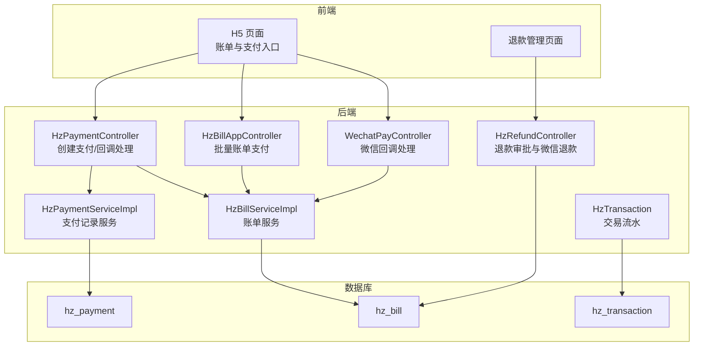
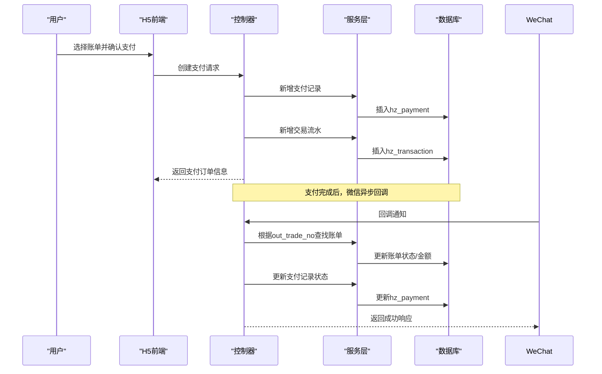
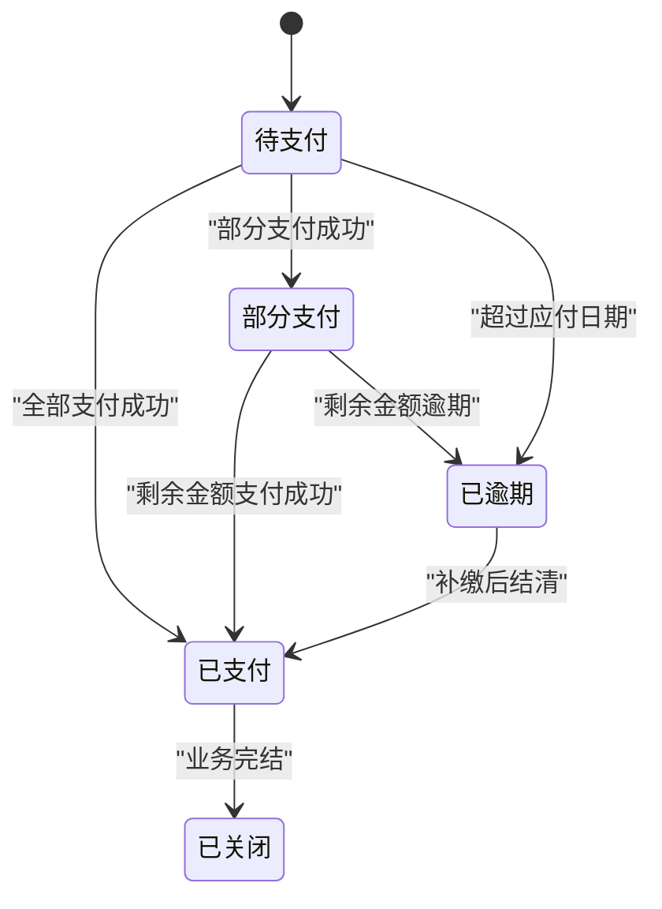
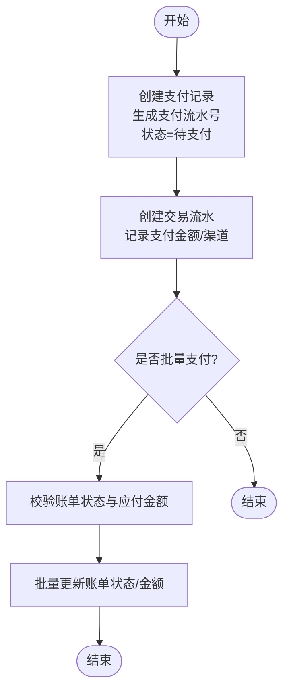
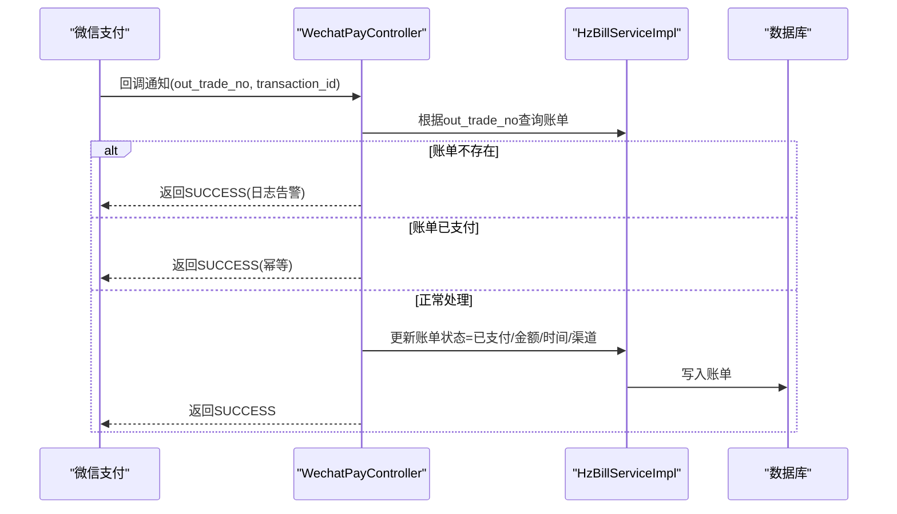
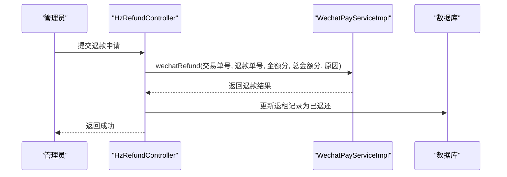
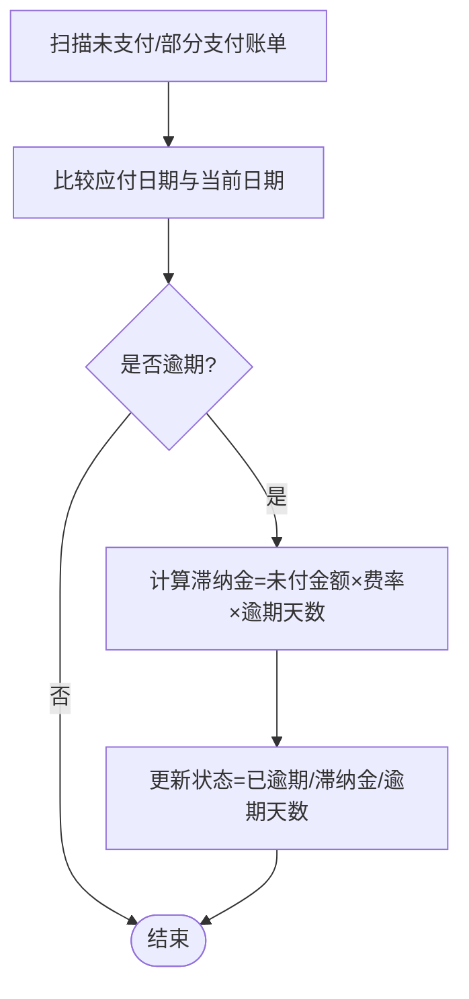
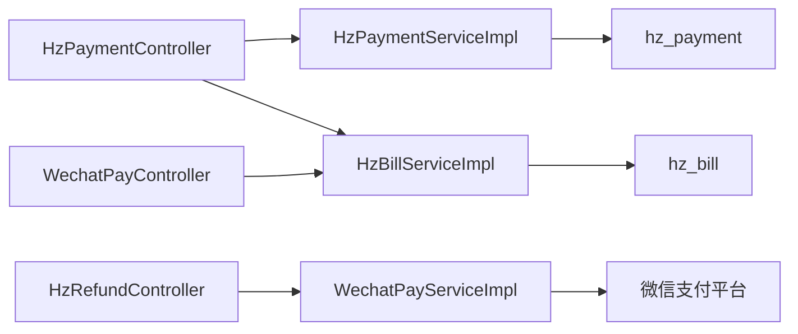
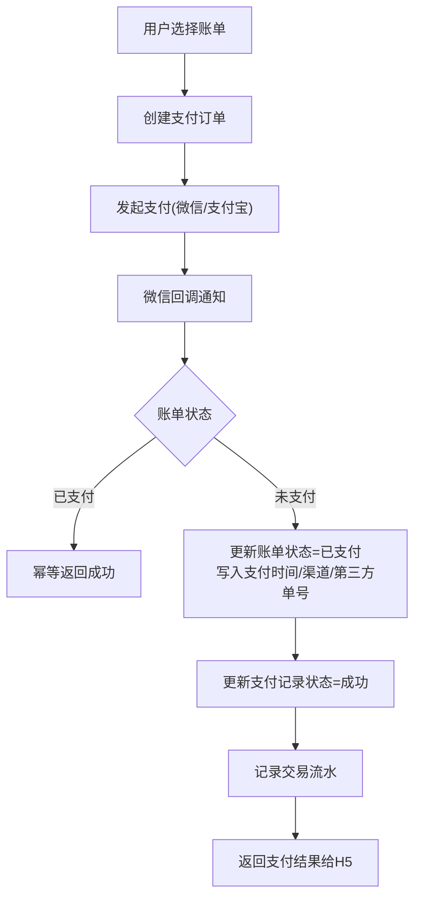

# 支付流程设计

<cite>
**本文引用的文件**
- [HzPayment.java](file://ruoyi-system/src/main/java/com/ruoyi/system/domain/HzPayment.java)
- [HzBill.java](file://ruoyi-system/src/main/java/com/ruoyi/system/domain/HzBill.java)
- [HzTransaction.java](file://ruoyi-system/src/main/java/com/ruoyi/system/domain/HzTransaction.java)
- [IHzPaymentService.java](file://ruoyi-system/src/main/java/com/ruoyi/system/service/IHzPaymentService.java)
- [HzPaymentServiceImpl.java](file://ruoyi-system/src/main/java/com/ruoyi/system/service/impl/HzPaymentServiceImpl.java)
- [IHzBillService.java](file://ruoyi-system/src/main/java/com/ruoyi/system/service/IHzBillService.java)
- [HzBillServiceImpl.java](file://ruoyi-system/src/main/java/com/ruoyi/system/service/impl/HzBillServiceImpl.java)
- [HzPaymentController.java](file://ruoyi-admin/src/main/java/com/ruoyi/web/controller/h5/HzPaymentController.java)
- [WechatPayController.java](file://ruoyi-admin/src/main/java/com/ruoyi/web/controller/h5/WechatPayController.java)
- [HzBillAppController.java](file://ruoyi-admin/src/main/java/com/ruoyi/web/controller/h5/HzBillAppController.java)
- [HzRefundController.java](file://ruoyi-admin/src/main/java/com/ruoyi/web/controller/system/HzRefundController.java)
- [HzRefundServiceImpl.java](file://ruoyi-system/src/main/java/com/ruoyi/system/service/impl/HzRefundServiceImpl.java)
- [技术方案.html](file://技术方案.html)
- [index.vue](file://ruoyi-ui/src/views/gangzhu/refund/index.vue)
</cite>

## 目录
1. [简介](#简介)
2. [项目结构](#项目结构)
3. [核心组件](#核心组件)
4. [架构概览](#架构概览)
5. [详细组件分析](#详细组件分析)
6. [依赖分析](#依赖分析)
7. [性能考虑](#性能考虑)
8. [故障排查指南](#故障排查指南)
9. [结论](#结论)
10. [附录](#附录)

## 简介
本文件面向港好住支付系统，提供从“用户下单创建账单、支付发起、支付状态跟踪、回调通知处理到最终支付完成”的完整闭环设计文档。重点覆盖以下方面：
- 订单创建与账单生成规则
- 支付金额计算与优惠处理
- 支付状态管理（待支付、支付成功、支付失败、部分支付、已逾期、已关闭）
- 支付回调处理（异步通知接收、验签验证、幂等处理、状态更新）
- 退款流程设计与对账处理
- 异常处理与监控指标、性能优化、故障恢复方案

## 项目结构
支付相关能力主要分布在以下层次：
- 控制器层：H5前端交互与微信回调处理
- 服务层：支付、账单、退款、交易流水等业务逻辑
- 领域模型层：支付记录、账单、交易流水等实体定义
- 前端界面：退款流程与状态展示

**图表来源**
- [HzPaymentController.java:79-166](file://ruoyi-admin/src/main/java/com/ruoyi/web/controller/h5/HzPaymentController.java#L79-L166)
- [HzBillAppController.java:169-249](file://ruoyi-admin/src/main/java/com/ruoyi/web/controller/h5/HzBillAppController.java#L169-L249)
- [WechatPayController.java:73-195](file://ruoyi-admin/src/main/java/com/ruoyi/web/controller/h5/WechatPayController.java#L73-L195)
- [HzRefundController.java:1-176](file://ruoyi-admin/src/main/java/com/ruoyi/web/controller/system/HzRefundController.java#L1-L176)
- [HzPaymentServiceImpl.java:61-96](file://ruoyi-system/src/main/java/com/ruoyi/system/service/impl/HzPaymentServiceImpl.java#L61-L96)
- [HzBillServiceImpl.java:116-162](file://ruoyi-system/src/main/java/com/ruoyi/system/service/impl/HzBillServiceImpl.java#L116-L162)

**章节来源**
- [HzPaymentController.java:79-166](file://ruoyi-admin/src/main/java/com/ruoyi/web/controller/h5/HzPaymentController.java#L79-L166)
- [HzBillAppController.java:169-249](file://ruoyi-admin/src/main/java/com/ruoyi/web/controller/h5/HzBillAppController.java#L169-L249)
- [WechatPayController.java:73-195](file://ruoyi-admin/src/main/java/com/ruoyi/web/controller/h5/WechatPayController.java#L73-L195)
- [HzRefundController.java:1-176](file://ruoyi-admin/src/main/java/com/ruoyi/web/controller/system/HzRefundController.java#L1-L176)

## 核心组件
- 支付记录（HzPayment）：承载单笔支付的流水号、金额、方式、状态、第三方交易号、支付凭证等
- 账单（HzBill）：承载账单编号、类型、周期、金额、已付/未付、逾期标记、支付方式与时间等
- 交易流水（HzTransaction）：记录每笔支付/退款的流水号、金额、状态、渠道、第三方单号等
- 支付服务（IHzPaymentService/HzPaymentServiceImpl）：负责支付记录的新增、更新、流水号生成、状态变更
- 账单服务（IHzBillService/HzBillServiceImpl）：负责账单新增、状态更新、逾期检测与滞纳金计算
- 控制器（HzPaymentController/WechatPayController/HzBillAppController）：对外提供支付创建、回调处理、批量支付等接口
- 退款控制（HzRefundController）：支持退款审批与微信原路退款

**章节来源**
- [HzPayment.java:1-202](file://ruoyi-system/src/main/java/com/ruoyi/system/domain/HzPayment.java#L1-L202)
- [HzBill.java:1-354](file://ruoyi-system/src/main/java/com/ruoyi/system/domain/HzBill.java#L1-L354)
- [HzTransaction.java:1-202](file://ruoyi-system/src/main/java/com/ruoyi/system/domain/HzTransaction.java#L1-L202)
- [IHzPaymentService.java:1-88](file://ruoyi-system/src/main/java/com/ruoyi/system/service/IHzPaymentService.java#L1-L88)
- [HzPaymentServiceImpl.java:61-96](file://ruoyi-system/src/main/java/com/ruoyi/system/service/impl/HzPaymentServiceImpl.java#L61-L96)
- [IHzBillService.java](file://ruoyi-system/src/main/java/com/ruoyi/system/service/IHzBillService.java)
- [HzBillServiceImpl.java:116-162](file://ruoyi-system/src/main/java/com/ruoyi/system/service/impl/HzBillServiceImpl.java#L116-L162)

## 架构概览
支付系统采用“控制器-服务-领域模型-数据库”分层架构，结合H5前端与微信回调，形成完整的支付闭环。

**图表来源**
- [HzPaymentController.java:79-166](file://ruoyi-admin/src/main/java/com/ruoyi/web/controller/h5/HzPaymentController.java#L79-L166)
- [WechatPayController.java:73-195](file://ruoyi-admin/src/main/java/com/ruoyi/web/controller/h5/WechatPayController.java#L73-L195)
- [HzPaymentServiceImpl.java:61-96](file://ruoyi-system/src/main/java/com/ruoyi/system/service/impl/HzPaymentServiceImpl.java#L61-L96)
- [HzBillServiceImpl.java:116-162](file://ruoyi-system/src/main/java/com/ruoyi/system/service/impl/HzBillServiceImpl.java#L116-L162)

## 详细组件分析

### 支付记录与账单状态管理
- 支付状态：待支付、支付中、支付成功、支付失败、已退款
- 账单状态：待支付、已支付、部分支付、已逾期、已关闭
- 金额计算：账单金额=已付金额+未付金额；支付成功后按支付金额累加已付、减少未付，并根据是否全部支付更新账单状态

**图表来源**
- [HzBill.java:96-99](file://ruoyi-system/src/main/java/com/ruoyi/system/domain/HzBill.java#L96-L99)
- [HzPayment.java:42-44](file://ruoyi-system/src/main/java/com/ruoyi/system/domain/HzPayment.java#L42-L44)
- [HzBillServiceImpl.java:154-162](file://ruoyi-system/src/main/java/com/ruoyi/system/service/impl/HzBillServiceImpl.java#L154-L162)
- [HzPaymentServiceImpl.java:87-95](file://ruoyi-system/src/main/java/com/ruoyi/system/service/impl/HzPaymentServiceImpl.java#L87-L95)

**章节来源**
- [HzBillServiceImpl.java:164-198](file://ruoyi-system/src/main/java/com/ruoyi/system/service/impl/HzBillServiceImpl.java#L164-L198)
- [HzPaymentController.java:113-132](file://ruoyi-admin/src/main/java/com/ruoyi/web/controller/h5/HzPaymentController.java#L113-L132)

### 支付创建与交易流水
- 创建支付：生成支付流水号，设置默认状态为“待支付”，插入支付记录
- 创建交易流水：记录支付金额、渠道、关联账单与支付记录
- 批量账单支付：校验账单状态与应付金额，生成交易流水号并批量更新账单状态

**图表来源**
- [HzPaymentController.java:79-95](file://ruoyi-admin/src/main/java/com/ruoyi/web/controller/h5/HzPaymentController.java#L79-L95)
- [HzBillAppController.java:169-200](file://ruoyi-admin/src/main/java/com/ruoyi/web/controller/h5/HzBillAppController.java#L169-L200)
- [HzBillAppController.java:202-234](file://ruoyi-admin/src/main/java/com/ruoyi/web/controller/h5/HzBillAppController.java#L202-L234)

**章节来源**
- [HzPaymentServiceImpl.java:61-96](file://ruoyi-system/src/main/java/com/ruoyi/system/service/impl/HzPaymentServiceImpl.java#L61-L96)
- [HzBillAppController.java:169-234](file://ruoyi-admin/src/main/java/com/ruoyi/web/controller/h5/HzBillAppController.java#L169-L234)

### 微信回调处理（异步通知）
- 参数解析与验签：从回调参数中提取out_trade_no与transaction_id
- 幂等处理：若账单已是“已支付”，直接返回成功，避免重复处理
- 状态更新：更新账单状态为“已支付”，写入支付时间、支付方式、第三方交易号
- 成功响应：返回SUCCESS，防止微信重复推送

**图表来源**
- [WechatPayController.java:73-195](file://ruoyi-admin/src/main/java/com/ruoyi/web/controller/h5/WechatPayController.java#L73-L195)
- [HzBillServiceImpl.java:116-162](file://ruoyi-system/src/main/java/com/ruoyi/system/service/impl/HzBillServiceImpl.java#L116-L162)

**章节来源**
- [WechatPayController.java:73-195](file://ruoyi-admin/src/main/java/com/ruoyi/web/controller/h5/WechatPayController.java#L73-L195)

### 退款流程设计
- 退款审批：管理员在后台提交退款申请，填写金额、原因等
- 微信原路退款：调用微信退款接口，传入交易单号、退款单号、金额（分）、原因
- 状态更新：退款完成后，更新退租记录为“已退还”，写入支付方式与备注
- 前端展示：支持查看付款信息、图片凭证、退款进度

**图表来源**
- [HzRefundController.java:147-176](file://ruoyi-admin/src/main/java/com/ruoyi/web/controller/system/HzRefundController.java#L147-L176)
- [index.vue:280-297](file://ruoyi-ui/src/views/gangzhu/refund/index.vue#L280-L297)

**章节来源**
- [HzRefundController.java:1-176](file://ruoyi-admin/src/main/java/com/ruoyi/web/controller/system/HzRefundController.java#L1-L176)
- [index.vue:146-297](file://ruoyi-ui/src/views/gangzhu/refund/index.vue#L146-L297)

### 对账与逾期处理
- 逾期检测：定时扫描未支付/部分支付账单，比较应付日期与当前日期，计算滞纳金并更新状态
- 对账指标：应收、实收、逾期金额、账单数量、收款率等，按时间段统计

**图表来源**
- [HzBillServiceImpl.java:164-198](file://ruoyi-system/src/main/java/com/ruoyi/system/service/impl/HzBillServiceImpl.java#L164-L198)

**章节来源**
- [HzBillServiceImpl.java:164-198](file://ruoyi-system/src/main/java/com/ruoyi/system/service/impl/HzBillServiceImpl.java#L164-L198)

## 依赖分析
- 控制器依赖服务：支付控制器依赖支付与账单服务；微信回调控制器依赖账单服务；退款控制器依赖微信支付服务与账单映射
- 服务依赖持久层：支付、账单、退款服务均依赖对应的Mapper与数据库表
- 前端依赖：退款页面依赖退款API，展示付款信息与退款状态

**图表来源**
- [HzPaymentController.java:79-166](file://ruoyi-admin/src/main/java/com/ruoyi/web/controller/h5/HzPaymentController.java#L79-L166)
- [WechatPayController.java:73-195](file://ruoyi-admin/src/main/java/com/ruoyi/web/controller/h5/WechatPayController.java#L73-L195)
- [HzRefundController.java:147-176](file://ruoyi-admin/src/main/java/com/ruoyi/web/controller/system/HzRefundController.java#L147-L176)

**章节来源**
- [HzPaymentController.java:79-166](file://ruoyi-admin/src/main/java/com/ruoyi/web/controller/h5/HzPaymentController.java#L79-L166)
- [WechatPayController.java:73-195](file://ruoyi-admin/src/main/java/com/ruoyi/web/controller/h5/WechatPayController.java#L73-L195)
- [HzRefundController.java:1-176](file://ruoyi-admin/src/main/java/com/ruoyi/web/controller/system/HzRefundController.java#L1-L176)

## 性能考虑
- 幂等性：微信回调中对“已支付”账单直接返回成功，避免重复处理
- 批量处理：批量账单支付时一次性校验与更新，减少多次往返
- 定时任务：逾期检测与滞纳金计算采用定时扫描，降低实时压力
- 缓存策略：建议对高频查询（如账单详情、租户账单列表）引入缓存，降低数据库压力
- 异步通知：回调处理仅做幂等与状态更新，复杂逻辑放入异步队列处理

## 故障排查指南
- 支付回调未生效
  - 检查out_trade_no与账单bill_no是否一致
  - 查看账单是否已被“已支付”，确认幂等逻辑
  - 核对第三方回调签名与参数完整性
- 支付金额不匹配
  - 批量支付时核对应付总金额与实际支付金额
  - 单笔支付时核对支付金额与账单未付金额
- 退款失败
  - 确认交易单号与退款金额（分）正确
  - 检查账户余额与限额
- 对账异常
  - 核对统计时间段与过滤条件
  - 检查逾期天数与滞纳金计算逻辑

**章节来源**
- [WechatPayController.java:171-195](file://ruoyi-admin/src/main/java/com/ruoyi/web/controller/h5/WechatPayController.java#L171-L195)
- [HzBillAppController.java:193-196](file://ruoyi-admin/src/main/java/com/ruoyi/web/controller/h5/HzBillAppController.java#L193-L196)
- [HzRefundController.java:147-176](file://ruoyi-admin/src/main/java/com/ruoyi/web/controller/system/HzRefundController.java#L147-L176)

## 结论
港好住支付系统以“账单-支付-交易流水-回调-退款-对账”为主线，构建了清晰的业务闭环。通过幂等处理、批量支付、定时逾期检测与微信原路退款等机制，确保支付流程的稳定性与可靠性。建议后续进一步完善优惠券与多账单组合支付的计算逻辑，并加强监控与告警体系，持续提升用户体验与系统韧性。

## 附录
- 业务流程参考图（概念示意）

[本图为概念流程示意，不对应具体源码文件，故不提供图表来源]