# 支付系统设计

<cite>
**本文档引用的文件**
- [WechatPayServiceImpl.java](file://ruoyi-system/src/main/java/com/ruoyi/system/service/impl/WechatPayServiceImpl.java)
- [WechatPayService.java](file://ruoyi-system/src/main/java/com/ruoyi/system/service/WechatPayService.java)
- [WechatPayConfig.java](file://ruoyi-admin/src/main/java/com/ruoyi/web/config/WechatPayConfig.java)
- [HzPaymentController.java](file://ruoyi-admin/src/main/java/com/ruoyi/web/controller/h5/HzPaymentController.java)
- [WechatPayController.java](file://ruoyi-admin/src/main/java/com/ruoyi/web/controller/h5/WechatPayController.java)
- [HzBillController.java](file://ruoyi-admin/src/main/java/com/ruoyi/web/controller/system/HzBillController.java)
- [HzPayment.java](file://ruoyi-system/src/main/java/com/ruoyi/system/domain/HzPayment.java)
- [HzRefundApply.java](file://ruoyi-system/src/main/java/com/ruoyi/system/domain/HzRefundApply.java)
- [HzTransaction.java](file://ruoyi-system/src/main/java/com/ruoyi/system/domain/HzTransaction.java)
- [HzBill.java](file://ruoyi-system/src/main/java/com/ruoyi/system/domain/HzBill.java)
- [IHzPaymentService.java](file://ruoyi-system/src/main/java/com/ruoyi/system/service/IHzPaymentService.java)
- [HzPaymentServiceImpl.java](file://ruoyi-system/src/main/java/com/ruoyi/system/service/impl/HzPaymentServiceImpl.java)
- [IHzTransactionService.java](file://ruoyi-system/src/main/java/com/ruoyi/system/service/IHzTransactionService.java)
- [HzTransactionServiceImpl.java](file://ruoyi-system/src/main/java/com/ruoyi/system/service/impl/HzTransactionServiceImpl.java)
- [ContractExpireTask.java](file://ruoyi-quartz/src/main/java/com/ruoyi/quartz/task/ContractExpireTask.java)
- [pay.js](file://uniapp-h5/api/pay.js)
- [deposit.vue](file://uniapp-h5/pages/room/deposit.vue)
- [bill.vue](file://uniapp-h5/subpkg/affairs/bill.vue)
- [refund/index.vue](file://ruoyi-ui/src/views/gangzhu/refund/index.vue)
- [project-wxpay-config.md](file://.claude/projects/-Users-wangwen-Desktop-ghz-ghz/memory/project-wxpay-config.md)
- [SameUrlDataInterceptor.java](file://ruoyi-framework/src/main/java/com/ruoyi/framework/interceptor/impl/SameUrlDataInterceptor.java)
- [RepeatSubmitInterceptor.java](file://ruoyi-framework/src/main/java/com/ruoyi/framework/interceptor/RepeatSubmitInterceptor.java)
- [RepeatableFilter.java](file://ruoyi-common/src/main/java/com/ruoyi/common/filter/RepeatableFilter.java)
- [RepeatSubmit.java](file://ruoyi-common/src/main/java/com/ruoyi/common/annotation/RepeatSubmit.java)
- [request.js](file://ruoyi-ui/src/utils/request.js)
- [SocialInsuranceService.java](file://ghz-gov-proxy/src/main/java/com/ghz/gov/service/SocialInsuranceService.java)
</cite>

## 更新摘要
**所做更改**
- 新增支付恢复系统章节，详细说明last_out_trade_no字段的作用和支付状态恢复机制
- 更新WeChatPayController的自动持久化机制，包括订单冲突处理和状态恢复功能
- 增强错误处理和日志记录功能，提供更完善的异常处理策略
- 新增支付状态恢复流程图，展示从微信查询到本地状态更新的完整过程

## 目录
1. [引言](#引言)
2. [项目结构](#项目结构)
3. [核心组件](#核心组件)
4. [架构概览](#架构概览)
5. [详细组件分析](#详细组件分析)
6. [支付恢复系统](#支付恢复系统)
7. [依赖分析](#依赖分析)
8. [性能考虑](#性能考虑)
9. [故障排除指南](#故障排除指南)
10. [结论](#结论)
11. [附录](#附录)

## 引言
本设计文档针对港好住信息系统的支付系统进行全面的技术分析，重点涵盖微信支付的集成架构与实现细节。系统支持多种支付方式，包括H5支付、JSAPI支付、Native支付等，并实现了完整的支付闭环流程，包括订单创建、支付发起、支付回调、状态同步、退款处理等功能。

系统采用前后端分离架构，后端基于Spring Boot框架，前端采用uni-app框架，通过统一的支付服务接口实现与微信支付平台的对接。支付系统具备完善的参数配置、证书安全管理、签名验证机制、回调地址配置等技术要点，以及账单管理、支付记录、退款申请、对账处理等业务功能。

**最新更新** 系统现已集成支付恢复系统，包括last_out_trade_no字段、WeChatPayController的自动持久化机制、以及增强的错误处理和日志记录功能，显著提升了系统的健壮性和支付状态的准确性。

## 项目结构
支付系统主要分布在以下模块中：

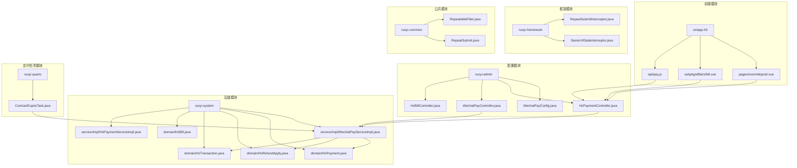
```mermaid
graph TB
subgraph "前端模块"
A[uniapp-h5] --> A1[pages/room/deposit.vue]
A --> A2[subpkg/affairs/bill.vue]
A --> A3[api/pay.js]
end
subgraph "后端模块"
B[ruoyi-system] --> B1[service/impl/WechatPayServiceImpl.java]
B --> B2[domain/HzPayment.java]
B --> B3[domain/HzRefundApply.java]
B --> B4[domain/HzTransaction.java]
B --> B5[domain/HzBill.java]
B --> B6[service/impl/HzPaymentServiceImpl.java]
end
subgraph "配置模块"
C[ruoyi-admin] --> C1[WechatPayConfig.java]
C --> C2[HzPaymentController.java]
C --> C3[WechatPayController.java]
C --> C4[HzBillController.java]
end
subgraph "框架模块"
D[ruoyi-framework] --> D1[RepeatSubmitInterceptor.java]
D --> D2[SameUrlDataInterceptor.java]
end
subgraph "公共模块"
E[ruoyi-common] --> E1[RepeatableFilter.java]
E --> E2[RepeatSubmit.java]
end
subgraph "定时任务模块"
F[ruoyi-quartz] --> F1[ContractExpireTask.java]
end
A1 --> C2
A2 --> C2
A3 --> C2
C2 --> B1
C3 --> B1
B1 --> B2
B1 --> B3
B1 --> B4
F1 --> B1
```

**图表来源**
- [WechatPayServiceImpl.java:1-209](file://ruoyi-system/src/main/java/com/ruoyi/system/service/impl/WechatPayServiceImpl.java#L1-L209)
- [HzPaymentController.java:1-167](file://ruoyi-admin/src/main/java/com/ruoyi/web/controller/h5/HzPaymentController.java#L1-L167)
- [WechatPayController.java:1-200](file://ruoyi-admin/src/main/java/com/ruoyi/web/controller/h5/WechatPayController.java#L1-L200)
- [HzBillController.java:120-170](file://ruoyi-admin/src/main/java/com/ruoyi/web/controller/system/HzBillController.java#L120-L170)
- [ContractExpireTask.java:327-450](file://ruoyi-quartz/src/main/java/com/ruoyi/quartz/task/ContractExpireTask.java#L327-L450)

## 核心组件
支付系统的核心组件包括微信支付服务实现、支付控制器、数据模型、服务接口等。

### 微信支付服务接口
WechatPayService定义了微信支付的核心能力：
- JSAPI预支付：支持微信内H5或小程序调用
- H5 WAP预支付：支持普通浏览器调用
- 回调解析：验签+解密，返回解密后的订单信息
- 主动查单：用于回调未到达时的兜底同步
- 退款申请：支持原路退款
- 关闭订单：支持手动关闭未支付订单

### 支付数据模型
系统定义了完整的支付相关数据模型：

**HzPayment支付记录模型**：包含支付ID、账单ID、支付流水号、支付金额、支付方式、支付状态等字段，支持多种支付方式的记录。

**HzRefundApply退款申请模型**：包含退款编号、支付ID、租户信息、退款金额、退款原因等字段，支持完整的退款申请流程。

**HzTransaction交易流水模型**：包含交易ID、交易流水号、账单ID、支付ID、租户ID等字段，用于记录所有交易流水信息。

**HzBill账单模型**：**新增** 包含last_out_trade_no字段，用于存储实际下到微信的订单号，支持带-R-后缀的重试订单号。

### 增强的错误处理组件
**更新** WechatPayController集成了订单冲突自动处理机制和支付状态恢复功能：

**订单冲突自动处理**：当微信支付返回"请求重入参数不一致"错误时，系统会自动执行以下操作：
- 检测到参数冲突错误（INVALID_REQUEST + "请求重入"或"参数与首次请求"）
- 自动关闭旧订单，避免重复支付
- 使用临时后缀重试预支付请求
- 记录详细的错误日志和处理过程

**自动持久化机制**：**新增** 成功下单后自动将实际订单号写入last_out_trade_no字段：
- 首次下单成功后，将outTradeNo写回last_out_trade_no
- 重试下单时，将重试订单号也持久化到last_out_trade_no
- 提供查询兼容性，优先使用last_out_trade_no进行微信查询

**章节来源**
- [WechatPayService.java:1-43](file://ruoyi-system/src/main/java/com/ruoyi/system/service/WechatPayService.java#L1-L43)
- [HzPayment.java:1-202](file://ruoyi-system/src/main/java/com/ruoyi/system/domain/HzPayment.java#L1-L202)
- [HzRefundApply.java:1-225](file://ruoyi-system/src/main/java/com/ruoyi/system/domain/HzRefundApply.java#L1-L225)
- [HzTransaction.java:1-201](file://ruoyi-system/src/main/java/com/ruoyi/system/domain/HzTransaction.java#L1-L201)
- [HzBill.java:130-150](file://ruoyi-system/src/main/java/com/ruoyi/system/domain/HzBill.java#L130-L150)
- [WechatPayController.java:159-215](file://ruoyi-admin/src/main/java/com/ruoyi/web/controller/h5/WechatPayController.java#L159-L215)

## 架构概览
支付系统采用分层架构设计，实现了清晰的职责分离和良好的扩展性。

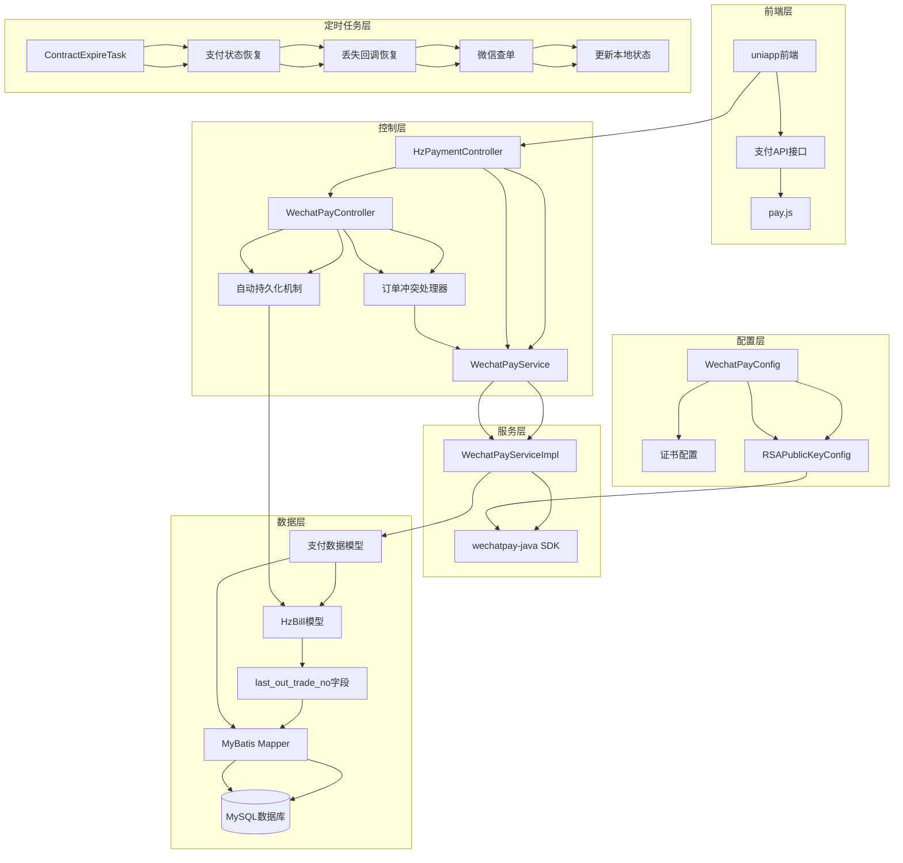
```mermaid
graph TB
subgraph "前端层"
Frontend[uniapp前端] --> API[支付API接口]
API --> PayAPI[pay.js]
end
subgraph "控制层"
Controller[HzPaymentController] --> Service[WechatPayService]
Controller --> EnhancedController[WechatPayController]
EnhancedController --> ConflictHandler[订单冲突处理器]
EnhancedController --> Persistence[自动持久化机制]
end
subgraph "服务层"
Service --> Impl[WechatPayServiceImpl]
Impl --> SDK[wechatpay-java SDK]
end
subgraph "数据层"
Model[支付数据模型] --> BillModel[HzBill模型]
BillModel --> LastOutTradeNo[last_out_trade_no字段]
LastOutTradeNo --> Mapper[MyBatis Mapper]
Mapper --> Database[(MySQL数据库)]
end
subgraph "配置层"
Config[WechatPayConfig] --> Cert[证书配置]
Config --> RSA[RSAPublicKeyConfig]
end
subgraph "定时任务层"
Scheduler[ContractExpireTask] --> Recovery[支付状态恢复]
Recovery --> LostNotify[丢失回调恢复]
LostNotify --> QueryWX[微信查单]
QueryWX --> UpdateLocal[更新本地状态]
end
Frontend --> Controller
Controller --> Service
EnhancedController --> ConflictHandler
EnhancedController --> Persistence
ConflictHandler --> Service
Persistence --> BillModel
Service --> Impl
Impl --> Model
Model --> Mapper
Mapper --> Database
Config --> RSA
RSA --> SDK
Scheduler --> Recovery
Recovery --> LostNotify
LostNotify --> QueryWX
QueryWX --> UpdateLocal
```

**图表来源**
- [WechatPayServiceImpl.java:33-58](file://ruoyi-system/src/main/java/com/ruoyi/system/service/impl/WechatPayServiceImpl.java#L33-L58)
- [WechatPayConfig.java:20-85](file://ruoyi-admin/src/main/java/com/ruoyi/web/config/WechatPayConfig.java#L20-L85)
- [WechatPayController.java:159-215](file://ruoyi-admin/src/main/java/com/ruoyi/web/controller/h5/WechatPayController.java#L159-L215)
- [HzBillController.java:125-169](file://ruoyi-admin/src/main/java/com/ruoyi/web/controller/system/HzBillController.java#L125-L169)
- [ContractExpireTask.java:327-450](file://ruoyi-quartz/src/main/java/com/ruoyi/quartz/task/ContractExpireTask.java#L327-L450)

系统架构特点：
1. **多支付方式支持**：同时支持JSAPI、H5、Native等多种支付方式
2. **统一配置管理**：通过配置类集中管理微信支付的各项参数
3. **安全机制完善**：采用公钥模式配置，确保支付安全
4. **智能错误处理**：集成订单冲突自动处理和支付状态恢复机制
5. **扩展性强**：接口设计支持未来新增支付方式
6. **状态恢复系统**：通过last_out_trade_no字段实现支付状态的可靠恢复

## 详细组件分析

### 微信支付服务实现
WechatPayServiceImpl是微信支付的核心实现类，提供了完整的支付服务能力。

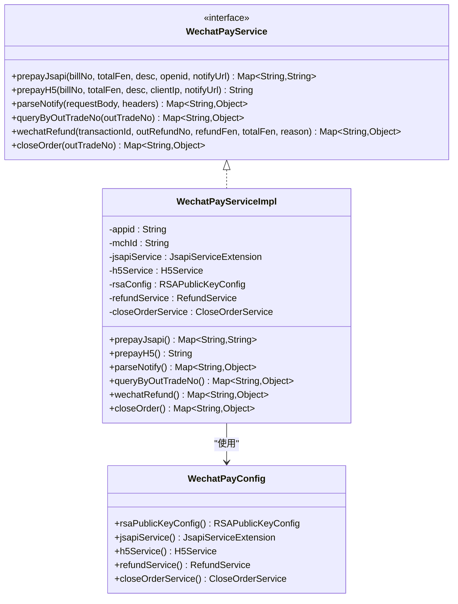
```mermaid
classDiagram
class WechatPayService {
<<interface>>
+prepayJsapi(billNo, totalFen, desc, openid, notifyUrl) Map~String,String~
+prepayH5(billNo, totalFen, desc, clientIp, notifyUrl) String
+parseNotify(requestBody, headers) Map~String,Object~
+queryByOutTradeNo(outTradeNo) Map~String,Object~
+wechatRefund(transactionId, outRefundNo, refundFen, totalFen, reason) Map~String,Object~
+closeOrder(outTradeNo) Map~String,Object~
}
class WechatPayServiceImpl {
-appid : String
-mchId : String
-jsapiService : JsapiServiceExtension
-h5Service : H5Service
-rsaConfig : RSAPublicKeyConfig
-refundService : RefundService
-closeOrderService : CloseOrderService
+prepayJsapi() Map~String,String~
+prepayH5() String
+parseNotify() Map~String,Object~
+queryByOutTradeNo() Map~String,Object~
+wechatRefund() Map~String,Object~
+closeOrder() Map~String,Object~
}
class WechatPayConfig {
+rsaPublicKeyConfig() RSAPublicKeyConfig
+jsapiService() JsapiServiceExtension
+h5Service() H5Service
+refundService() RefundService
+closeOrderService() CloseOrderService
}
WechatPayService <|.. WechatPayServiceImpl
WechatPayServiceImpl --> WechatPayConfig : "使用"
```

**图表来源**
- [WechatPayService.java:5-42](file://ruoyi-system/src/main/java/com/ruoyi/system/service/WechatPayService.java#L5-L42)
- [WechatPayServiceImpl.java:33-58](file://ruoyi-system/src/main/java/com/ruoyi/system/service/impl/WechatPayServiceImpl.java#L33-L58)
- [WechatPayConfig.java:53-84](file://ruoyi-admin/src/main/java/com/ruoyi/web/config/WechatPayConfig.java#L53-L84)

#### JSAPI支付实现
JSAPI支付主要用于微信内H5或小程序场景，实现流程如下：

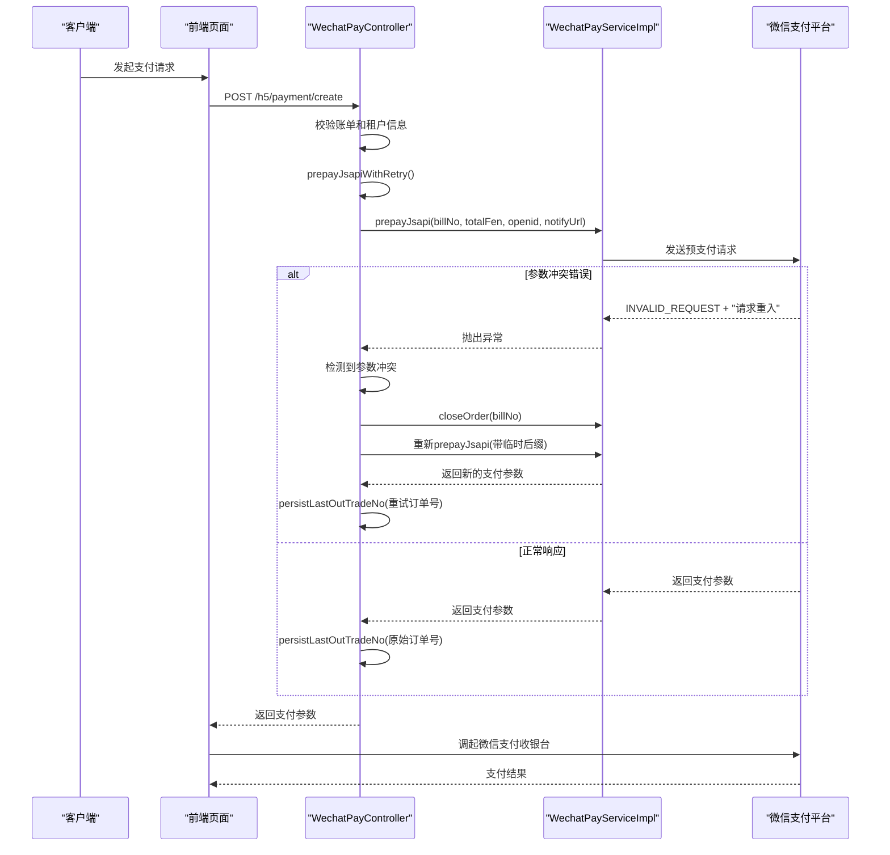
```mermaid
sequenceDiagram
participant Client as "客户端"
participant Frontend as "前端页面"
participant Controller as "WechatPayController"
participant Service as "WechatPayServiceImpl"
participant Wechat as "微信支付平台"
Client->>Frontend : 发起支付请求
Frontend->>Controller : POST /h5/payment/create
Controller->>Controller : 校验账单和租户信息
Controller->>Controller : prepayJsapiWithRetry()
Controller->>Service : prepayJsapi(billNo, totalFen, openid, notifyUrl)
Service->>Wechat : 发送预支付请求
alt 参数冲突错误
Wechat-->>Service : INVALID_REQUEST + "请求重入"
Service-->>Controller : 抛出异常
Controller->>Controller : 检测到参数冲突
Controller->>Service : closeOrder(billNo)
Controller->>Service : 重新prepayJsapi(带临时后缀)
Service-->>Controller : 返回新的支付参数
Controller->>Controller : persistLastOutTradeNo(重试订单号)
else 正常响应
Wechat-->>Service : 返回支付参数
Service-->>Controller : 返回支付参数
Controller->>Controller : persistLastOutTradeNo(原始订单号)
end
Controller-->>Frontend : 返回支付参数
Frontend->>Wechat : 调起微信支付收银台
Wechat-->>Frontend : 支付结果
```

**图表来源**
- [WechatPayServiceImpl.java:60-90](file://ruoyi-system/src/main/java/com/ruoyi/system/service/impl/WechatPayServiceImpl.java#L60-L90)
- [WechatPayController.java:159-215](file://ruoyi-admin/src/main/java/com/ruoyi/web/controller/h5/WechatPayController.java#L159-L215)

#### 支付回调处理
系统实现了完整的支付回调处理机制，包括验签、解密和状态更新：

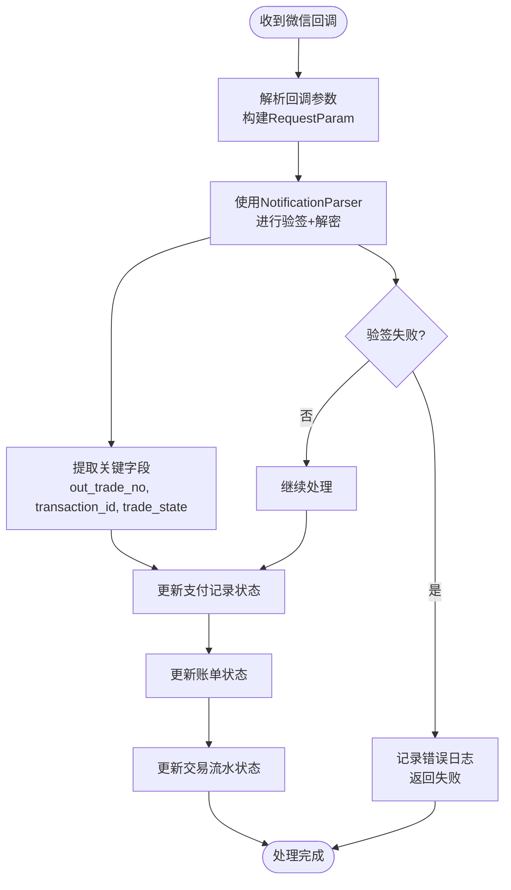
```mermaid
flowchart TD
Start([收到微信回调]) --> Parse["解析回调参数<br/>构建RequestParam"]
Parse --> Verify["使用NotificationParser<br/>进行验签+解密"]
Verify --> Extract["提取关键字段<br/>out_trade_no, transaction_id, trade_state"]
Extract --> Update["更新支付记录状态"]
Update --> BillUpdate["更新账单状态"]
BillUpdate --> TransactionUpdate["更新交易流水状态"]
TransactionUpdate --> End([处理完成])
Verify --> Error{"验签失败?"}
Error --> |是| ErrorHandler["记录错误日志<br/>返回失败"]
Error --> |否| Continue["继续处理"]
ErrorHandler --> End
Continue --> Update
```

**图表来源**
- [WechatPayServiceImpl.java:147-178](file://ruoyi-system/src/main/java/com/ruoyi/system/service/impl/WechatPayServiceImpl.java#L147-L178)
- [HzPaymentController.java:101-147](file://ruoyi-admin/src/main/java/com/ruoyi/web/controller/h5/HzPaymentController.java#L101-L147)

### 支付控制器
HzPaymentController负责处理支付相关的HTTP请求，实现了完整的支付生命周期管理。

#### 支付订单创建
支付订单创建流程包括租户验证、账单校验、金额验证等步骤：

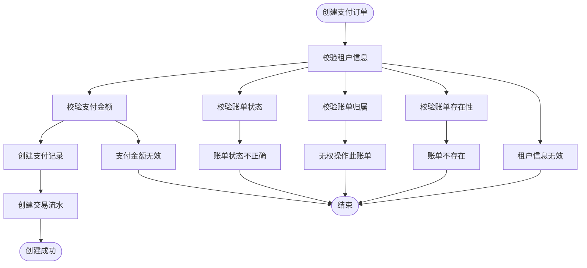
```mermaid
flowchart TD
Create([创建支付订单]) --> TenantCheck["校验租户信息"]
TenantCheck --> BillCheck["校验账单存在性"]
TenantCheck --> OwnerCheck["校验账单归属"]
TenantCheck --> StatusCheck["校验账单状态"]
TenantCheck --> AmountCheck["校验支付金额"]
AmountCheck --> CreatePayment["创建支付记录"]
CreatePayment --> CreateTransaction["创建交易流水"]
CreateTransaction --> Success([创建成功])
TenantCheck --> Error1["租户信息无效"]
BillCheck --> Error2["账单不存在"]
OwnerCheck --> Error3["无权操作此账单"]
StatusCheck --> Error4["账单状态不正确"]
AmountCheck --> Error5["支付金额无效"]
Error1 --> End([结束])
Error2 --> End
Error3 --> End
Error4 --> End
Error5 --> End
```

**图表来源**
- [HzPaymentController.java:43-95](file://ruoyi-admin/src/main/java/com/ruoyi/web/controller/h5/HzPaymentController.java#L43-L95)

#### 支付状态同步
系统提供了主动查单功能，用于回调未到达时的状态同步：

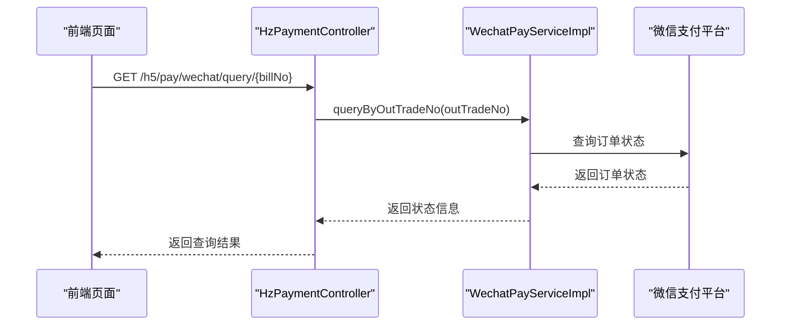
```mermaid
sequenceDiagram
participant Frontend as "前端页面"
participant Controller as "HzPaymentController"
participant Service as "WechatPayServiceImpl"
participant Wechat as "微信支付平台"
Frontend->>Controller : GET /h5/pay/wechat/query/{billNo}
Controller->>Service : queryByOutTradeNo(outTradeNo)
Service->>Wechat : 查询订单状态
Wechat-->>Service : 返回订单状态
Service-->>Controller : 返回状态信息
Controller-->>Frontend : 返回查询结果
```

**图表来源**
- [WechatPayServiceImpl.java:125-140](file://ruoyi-system/src/main/java/com/ruoyi/system/service/impl/WechatPayServiceImpl.java#L125-L140)

### 增强的错误处理机制
**更新** WechatPayController集成了订单冲突自动处理机制和支付状态恢复功能，显著提升了系统的健壮性。

#### 订单冲突自动处理流程
当微信支付返回"请求重入参数不一致"错误时，系统会自动执行以下处理流程：

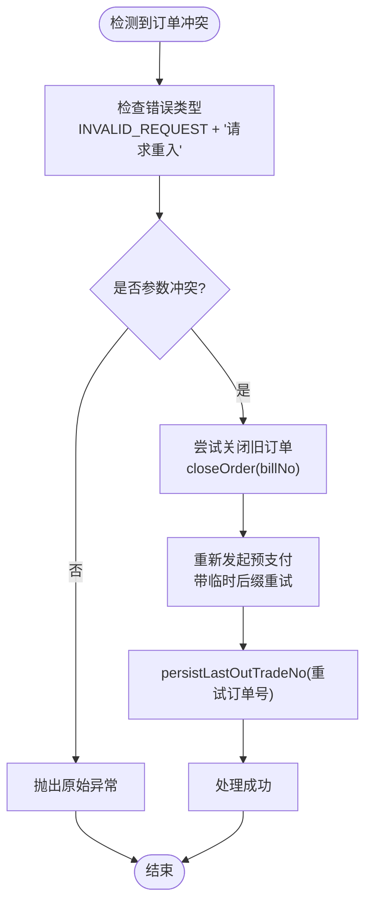
```mermaid
flowchart TD
Conflict([检测到订单冲突]) --> CheckError["检查错误类型<br/>INVALID_REQUEST + '请求重入'"]
CheckError --> IsConflict{"是否参数冲突?"}
IsConflict --> |是| CloseOld["尝试关闭旧订单<br/>closeOrder(billNo)"]
CloseOld --> TryAgain["重新发起预支付<br/>带临时后缀重试"]
TryAgain --> Persist["persistLastOutTradeNo(重试订单号)"]
Persist --> Success["处理成功"]
IsConflict --> |否| ThrowError["抛出原始异常"]
ThrowError --> End([结束])
Success --> End
```

**图表来源**
- [WechatPayController.java:159-215](file://ruoyi-admin/src/main/java/com/ruoyi/web/controller/h5/WechatPayController.java#L159-L215)

#### 自动持久化机制
**新增** 系统实现了last_out_trade_no字段的自动持久化功能：

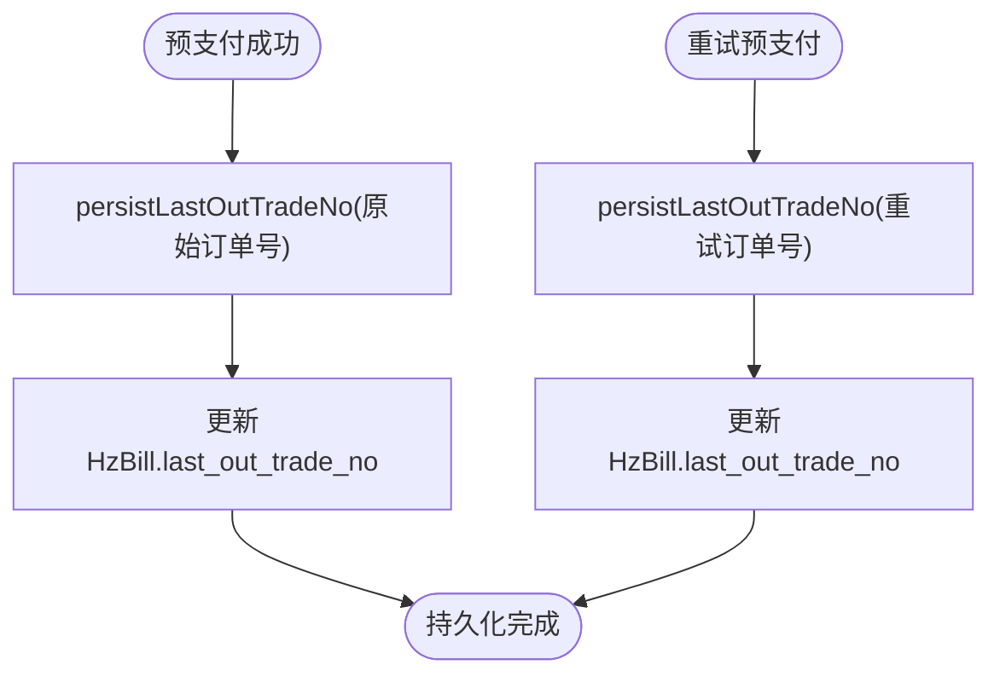
```mermaid
flowchart TD
Prepay([预支付成功]) --> FirstPersist["persistLastOutTradeNo(原始订单号)"]
FirstPersist --> Store["更新HzBill.last_out_trade_no"]
Store --> Success([持久化完成])
TryAgain([重试预支付]) --> RetryPersist["persistLastOutTradeNo(重试订单号)"]
RetryPersist --> StoreRetry["更新HzBill.last_out_trade_no"]
StoreRetry --> Success
```

**图表来源**
- [WechatPayController.java:170-173](file://ruoyi-admin/src/main/java/com/ruoyi/web/controller/h5/WechatPayController.java#L170-L173)
- [WechatPayController.java:191-201](file://ruoyi-admin/src/main/java/com/ruoyi/web/controller/h5/WechatPayController.java#L191-L201)

### 前端支付实现
前端采用uni-app框架，实现了跨平台的支付体验。

#### 支付环境检测
前端能够智能检测运行环境并选择合适的支付方式：

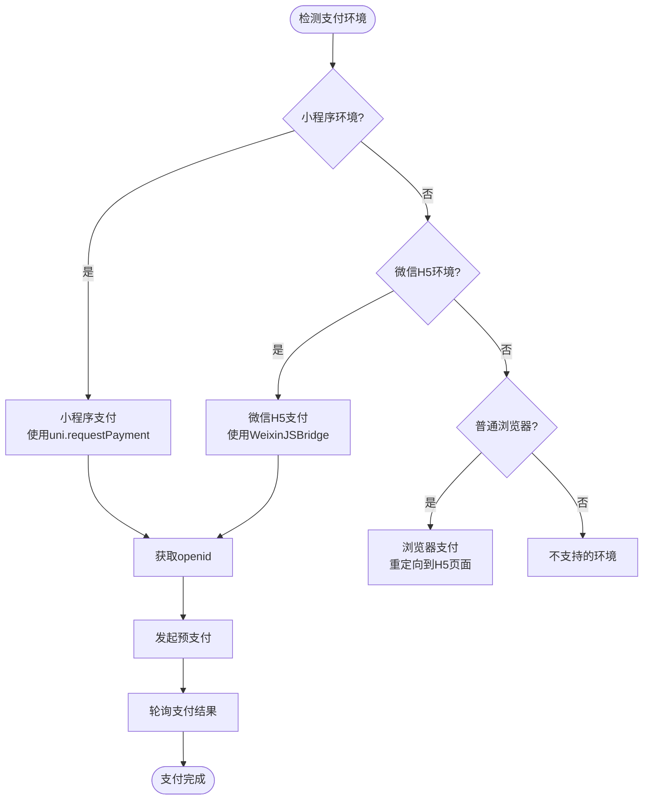
```mermaid
flowchart TD
Detect([检测支付环境]) --> MiniProgram{"小程序环境?"}
MiniProgram --> |是| MiniProgramPay["小程序支付<br/>使用uni.requestPayment"]
MiniProgram --> |否| WechatH5{"微信H5环境?"}
WechatH5 --> |是| WechatH5Pay["微信H5支付<br/>使用WeixinJSBridge"]
WechatH5 --> |否| Browser{"普通浏览器?"}
Browser --> |是| BrowserPay["浏览器支付<br/>重定向到H5页面"]
Browser --> |否| Error["不支持的环境"]
MiniProgramPay --> Openid["获取openid"]
WechatH5Pay --> Openid
Openid --> Prepay["发起预支付"]
Prepay --> Poll["轮询支付结果"]
Poll --> Success([支付完成])
```

**图表来源**
- [deposit.vue:188-257](file://uniapp-h5/pages/room/deposit.vue#L188-L257)

#### 支付结果轮询
前端实现了智能的支付结果轮询机制，确保支付状态的准确性：

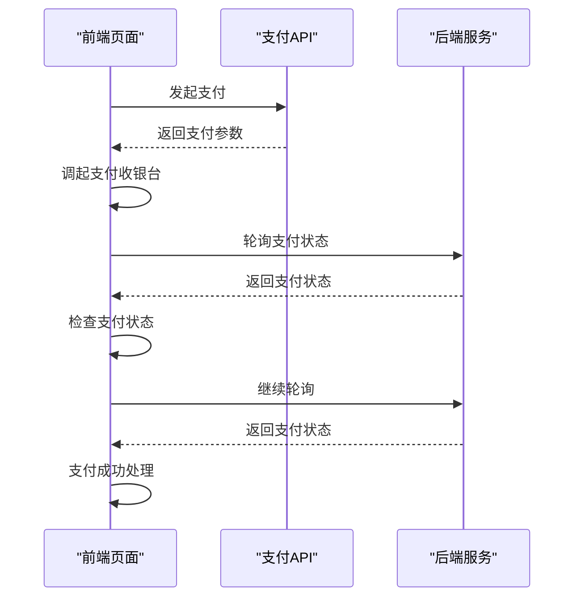
```mermaid
sequenceDiagram
participant Frontend as "前端页面"
participant API as "支付API"
participant Server as "后端服务"
Frontend->>API : 发起支付
API-->>Frontend : 返回支付参数
Frontend->>Frontend : 调起支付收银台
Frontend->>Server : 轮询支付状态
Server-->>Frontend : 返回支付状态
Frontend->>Frontend : 检查支付状态
Frontend->>Server : 继续轮询
Server-->>Frontend : 返回支付状态
Frontend->>Frontend : 支付成功处理
```

**图表来源**
- [deposit.vue:300-317](file://uniapp-h5/pages/room/deposit.vue#L300-L317)

### 退款管理系统
系统提供了完整的退款管理功能，支持租户发起退款申请和管理员审批。

#### 退款申请流程
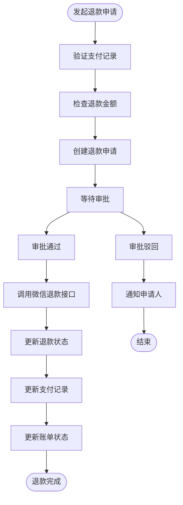
```mermaid
flowchart TD
Apply([发起退款申请]) --> Validate["验证支付记录"]
Validate --> AmountCheck["检查退款金额"]
AmountCheck --> CreateApply["创建退款申请"]
CreateApply --> Approve["等待审批"]
Approve --> ApprovePass["审批通过"]
Approve --> ApproveReject["审批驳回"]
ApprovePass --> WechatRefund["调用微信退款接口"]
WechatRefund --> UpdateApply["更新退款状态"]
UpdateApply --> UpdatePayment["更新支付记录"]
UpdatePayment --> UpdateBill["更新账单状态"]
UpdateBill --> Complete([退款完成])
ApproveReject --> RejectNotice["通知申请人"]
RejectNotice --> End([结束])
```

**图表来源**
- [HzRefundApply.java:1-225](file://ruoyi-system/src/main/java/com/ruoyi/system/domain/HzRefundApply.java#L1-L225)

**章节来源**
- [deposit.vue:188-317](file://uniapp-h5/pages/room/deposit.vue#L188-L317)
- [bill.vue:408-508](file://uniapp-h5/subpkg/affairs/bill.vue#L408-L508)
- [refund/index.vue:280-295](file://ruoyi-ui/src/views/gangzhu/refund/index.vue#L280-L295)

## 支付恢复系统

### last_out_trade_no字段设计
**新增** 系统引入了last_out_trade_no字段来解决支付状态恢复的关键问题。

#### 字段作用
- **存储实际订单号**：记录真正下到微信支付平台的订单号
- **支持重试机制**：当订单发生参数变化时，微信会缓存首次参数，重试订单号可能带有-R-后缀
- **状态恢复依据**：作为支付状态恢复的主要查询依据

#### 字段持久化策略
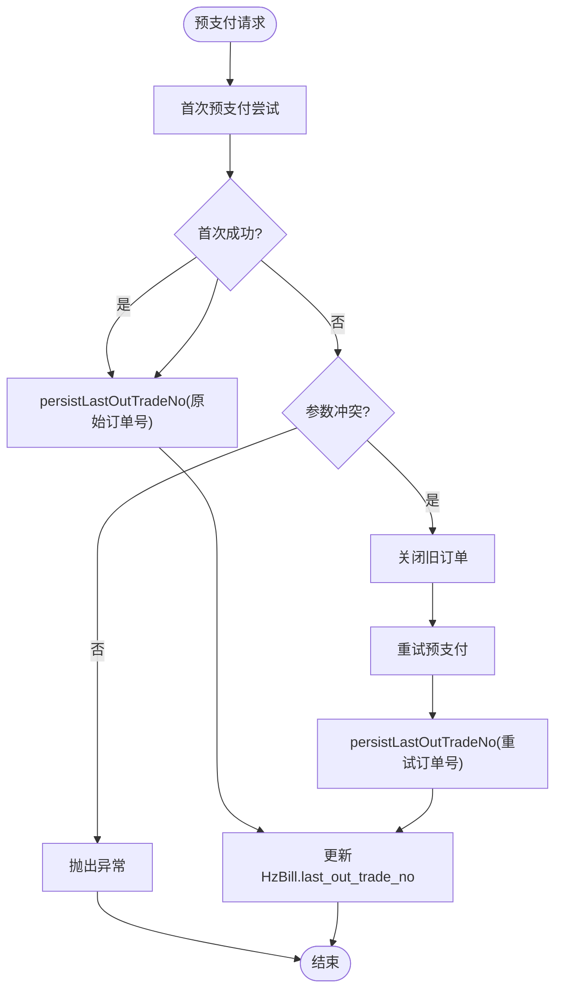
```mermaid
flowchart TD
Prepay([预支付请求]) --> FirstAttempt["首次预支付尝试"]
FirstAttempt --> Success{"首次成功?"}
Success --> |是| PersistFirst["persistLastOutTradeNo(原始订单号)"]
Success --> |否| Conflict{"参数冲突?"}
Conflict --> |是| CloseOld["关闭旧订单"]
CloseOld --> Retry["重试预支付"]
Retry --> PersistRetry["persistLastOutTradeNo(重试订单号)"]
Conflict --> |否| ThrowError["抛出异常"]
Success --> PersistFirst
PersistFirst --> UpdateDB["更新HzBill.last_out_trade_no"]
PersistRetry --> UpdateDB
ThrowError --> End([结束])
UpdateDB --> End
```

**图表来源**
- [WechatPayController.java:170-173](file://ruoyi-admin/src/main/java/com/ruoyi/web/controller/h5/WechatPayController.java#L170-L173)
- [WechatPayController.java:191-201](file://ruoyi-admin/src/main/java/com/ruoyi/web/controller/h5/WechatPayController.java#L191-L201)

### 支付状态恢复机制
**新增** 系统实现了多层次的支付状态恢复机制，确保即使在回调丢失的情况下也能正确恢复支付状态。

#### 合同失效状态恢复
当合同即将失效时，系统会主动检查支付状态：

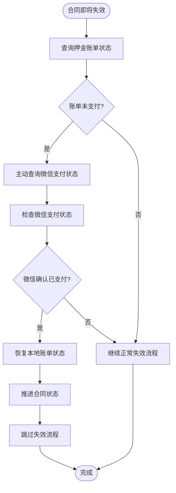
```mermaid
flowchart TD
Expire([合同即将失效]) --> QueryBill["查询押金账单状态"]
QueryBill --> HasUnpaid{"账单未支付?"}
HasUnpaid --> |是| QueryWechat["主动查询微信支付状态"]
QueryWechat --> CheckState["检查微信支付状态"]
CheckState --> Paid{"微信确认已支付?"}
Paid --> |是| Recover["恢复本地账单状态"]
Recover --> Advance["推进合同状态"]
Advance --> SkipExpire["跳过失效流程"]
Paid --> |否| ContinueExpire["继续正常失效流程"]
HasUnpaid --> |否| ContinueExpire
SkipExpire --> End([完成])
ContinueExpire --> End
```

**图表来源**
- [ContractExpireTask.java:332-359](file://ruoyi-quartz/src/main/java/com/ruoyi/quartz/task/ContractExpireTask.java#L332-L359)

#### 丢失回调恢复机制
**新增** 系统实现了专门的丢失回调恢复功能，扫描所有可能丢失回调的账单：

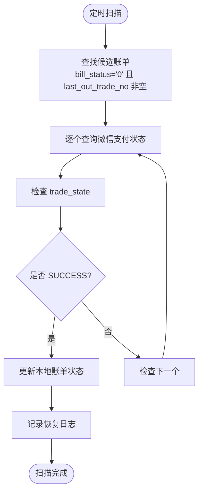
```mermaid
flowchart TD
Scan([定时扫描]) --> Candidates["查找候选账单<br/>bill_status='0' 且 last_out_trade_no 非空"]
Candidates --> QueryWX["逐个查询微信支付状态"]
QueryWX --> CheckState["检查 trade_state"]
CheckState --> IsSuccess{"是否 SUCCESS?"}
IsSuccess --> |是| UpdateLocal["更新本地账单状态"]
UpdateLocal --> LogSuccess["记录恢复日志"]
IsSuccess --> |否| NextCandidate["检查下一个"]
NextCandidate --> QueryWX
LogSuccess --> ScanComplete([扫描完成])
```

**图表来源**
- [ContractExpireTask.java:407-450](file://ruoyi-quartz/src/main/java/com/ruoyi/quartz/task/ContractExpireTask.java#L407-L450)

#### 查询兼容性策略
**更新** 系统实现了智能的查询兼容性策略，确保对历史数据的支持：

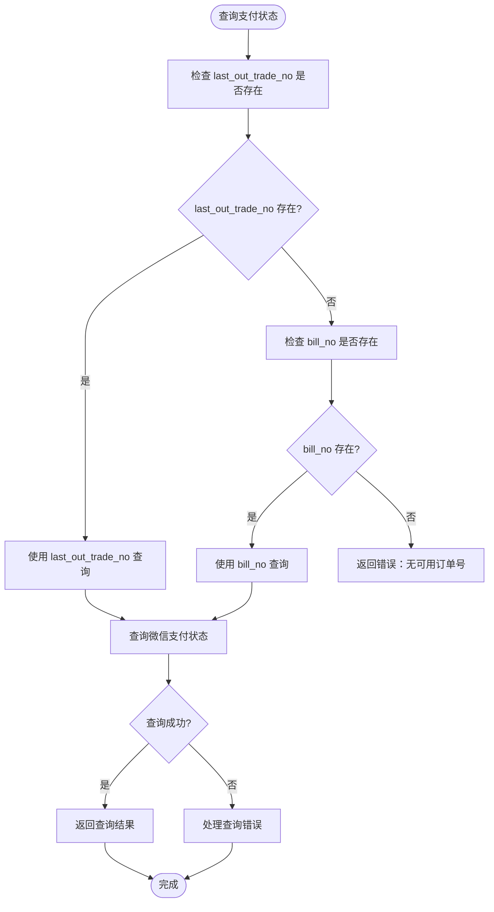
```mermaid
flowchart TD
Query([查询支付状态]) --> CheckLastOut["检查 last_out_trade_no 是否存在"]
CheckLastOut --> HasLastOut{"last_out_trade_no 存在?"}
HasLastOut --> |是| UseLastOut["使用 last_out_trade_no 查询"]
HasLastOut --> |否| CheckBillNo["检查 bill_no 是否存在"]
CheckBillNo --> HasBillNo{"bill_no 存在?"}
HasBillNo --> |是| UseBillNo["使用 bill_no 查询"]
HasBillNo --> |否| Error["返回错误：无可用订单号"]
UseLastOut --> QueryWX["查询微信支付状态"]
UseBillNo --> QueryWX
QueryWX --> Success{"查询成功?"}
Success --> |是| ReturnResult["返回查询结果"]
Success --> |否| HandleError["处理查询错误"]
ReturnResult --> End([完成])
HandleError --> End
```

**图表来源**
- [HzBillController.java:145-169](file://ruoyi-admin/src/main/java/com/ruoyi/web/controller/system/HzBillController.java#L145-L169)

### 增强的日志记录功能
**新增** 系统增强了日志记录功能，提供更详细的错误处理和状态跟踪信息：

#### 日志记录策略
1. **错误处理日志**：记录订单冲突处理的详细过程
2. **状态恢复日志**：记录支付状态恢复的完整流程
3. **查询兼容日志**：记录查询兼容性的决策过程
4. **持久化日志**：记录last_out_trade_no字段的更新情况

#### 日志示例
- `[RecoverLostWechatNotify] 开始扫描可能丢失回调的账单，候选数=15`
- `[RecoverLostWechatNotify] 补回成功 billId=1001, billNo=D20260618001, lastOutTradeNo=D20260618001-R-001, transactionId=42000012345678901234567890123456`
- `持久化 last_out_trade_no 未命中行，billNo=D20260618001, outTradeNo=D20260618001-R-001`

**章节来源**
- [WechatPayController.java:159-215](file://ruoyi-admin/src/main/java/com/ruoyi/web/controller/h5/WechatPayController.java#L159-L215)
- [ContractExpireTask.java:332-450](file://ruoyi-quartz/src/main/java/com/ruoyi/quartz/task/ContractExpireTask.java#L332-L450)
- [HzBillController.java:125-169](file://ruoyi-admin/src/main/java/com/ruoyi/web/controller/system/HzBillController.java#L125-L169)

## 依赖分析
支付系统的依赖关系体现了清晰的分层架构和模块化设计。

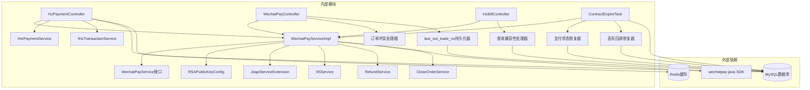
```mermaid
graph TB
subgraph "外部依赖"
SDK[wechatpay-java SDK]
MySQL[(MySQL数据库)]
Redis[(Redis缓存)]
end
subgraph "内部模块"
A[WechatPayServiceImpl] --> B[WechatPayService接口]
A --> C[RSAPublicKeyConfig]
A --> D[JsapiServiceExtension]
A --> E[H5Service]
A --> F[RefundService]
A --> G[CloseOrderService]
H[HzPaymentController] --> A
H --> I[IHzPaymentService]
H --> J[IHzTransactionService]
K[WechatPayController] --> A
K --> L[订单冲突处理器]
K --> M[last_out_trade_no持久化器]
N[HzBillController] --> A
N --> O[查询兼容性处理器]
P[ContractExpireTask] --> A
P --> Q[支付状态恢复器]
P --> R[丢失回调恢复器]
end
A --> SDK
H --> MySQL
H --> Redis
P --> MySQL
Q --> MySQL
R --> MySQL
M --> MySQL
O --> MySQL
```

**图表来源**
- [WechatPayServiceImpl.java:45-57](file://ruoyi-system/src/main/java/com/ruoyi/system/service/impl/WechatPayServiceImpl.java#L45-L57)
- [WechatPayConfig.java:53-84](file://ruoyi-admin/src/main/java/com/ruoyi/web/config/WechatPayConfig.java#L53-L84)
- [WechatPayController.java:159-215](file://ruoyi-admin/src/main/java/com/ruoyi/web/controller/h5/WechatPayController.java#L159-L215)
- [HzBillController.java:125-169](file://ruoyi-admin/src/main/java/com/ruoyi/web/controller/system/HzBillController.java#L125-L169)
- [ContractExpireTask.java:327-450](file://ruoyi-quartz/src/main/java/com/ruoyi/quartz/task/ContractExpireTask.java#L327-L450)

### 核心依赖关系
1. **微信SDK依赖**：系统直接依赖wechatpay-java SDK进行支付操作
2. **数据库依赖**：通过MyBatis框架访问MySQL数据库
3. **缓存依赖**：使用Redis进行重复提交检测和会话管理
4. **配置依赖**：通过Spring Boot配置文件管理支付参数

### 循环依赖检查
经过分析，系统不存在循环依赖问题：
- 控制层不依赖服务层的具体实现
- 服务层不依赖控制层
- 数据模型独立于业务逻辑
- 配置类独立于业务实现

**章节来源**
- [WechatPayServiceImpl.java:1-209](file://ruoyi-system/src/main/java/com/ruoyi/system/service/impl/WechatPayServiceImpl.java#L1-L209)
- [WechatPayConfig.java:1-85](file://ruoyi-admin/src/main/java/com/ruoyi/web/config/WechatPayConfig.java#L1-L85)

## 性能考虑
支付系统在设计时充分考虑了性能优化和用户体验。

### 缓存策略
系统采用了多层次的缓存策略：
1. **Redis缓存**：用于存储重复提交检测信息，避免频繁的数据库查询
2. **本地缓存**：前端页面使用localStorage存储openid等必要信息
3. **数据库缓存**：MyBatis二级缓存优化常用查询

### 异步处理
系统实现了异步处理机制：
1. **支付回调异步处理**：微信回调采用异步方式处理，避免阻塞主线程
2. **状态轮询优化**：前端轮询采用指数退避算法，减少不必要的请求
3. **批量查询**：支持批量查询支付状态，提高效率
4. **订单冲突自动处理**：异步执行订单关闭和重试操作
5. **支付状态恢复**：定时任务异步扫描和恢复支付状态

### 超时控制
系统设置了合理的超时控制：
1. **支付超时**：支付超时时间为30分钟
2. **轮询超时**：前端轮询最大次数为10次，间隔2秒
3. **数据库连接超时**：连接池超时时间为30秒
4. **订单冲突处理超时**：自动重试机制设置合理的超时限制
5. **状态恢复扫描超时**：定时任务设置合理的执行窗口

## 故障排除指南
系统提供了完善的故障排除机制和错误处理策略。

### 常见问题及解决方案

#### 支付回调失败
**问题现象**：支付完成后微信回调未到达，导致支付状态不准确

**解决方案**：
1. 检查回调地址配置是否正确
2. 验证服务器网络连通性
3. 查看回调日志和错误信息
4. 手动触发状态同步查询
5. **新增** 检查last_out_trade_no字段是否正确持久化

#### 重复支付问题
**问题现象**：用户重复点击支付按钮导致重复扣费

**解决方案**：
1. 启用防重复提交拦截器
2. 检查Redis缓存配置
3. 验证请求去重机制
4. 前端增加支付状态提示
5. **新增** 检查订单冲突自动处理机制

#### 证书配置错误
**问题现象**：启动时出现证书相关错误

**解决方案**：
1. 确认使用公钥模式而非证书模式
2. 检查证书文件路径和权限
3. 验证公钥ID和API v3密钥
4. 重新生成和部署证书文件

#### 订单冲突处理
**新增** 当遇到"请求重入参数不一致"错误时：

**问题现象**：同一账单号在不同时间点发起支付，微信返回参数冲突错误

**解决方案**：
1. 系统自动检测参数冲突错误
2. 自动关闭旧订单，避免重复支付
3. 使用临时后缀重试预支付请求
4. **新增** 自动持久化重试订单号到last_out_trade_no
5. 记录详细的错误日志供排查
6. 如自动处理失败，返回给前端具体的错误信息

#### 支付状态恢复
**新增** 合同失效但支付状态异常时：

**问题现象**：合同即将失效，但系统发现可能存在微信已支付但本地未更新的情况

**解决方案**：
1. 定时任务自动查询微信支付状态
2. **新增** 优先使用last_out_trade_no进行查询
3. 如微信确认已支付，自动恢复本地账单状态
4. 触发合同状态推进流程
5. 跳过正常的合同失效流程

#### 丢失回调恢复
**新增** 系统无法自动恢复支付状态时：

**问题现象**：微信支付已完成但本地状态仍为未支付

**解决方案**：
1. **新增** 启用丢失回调恢复定时任务
2. 扫描所有bill_status='0'且last_out_trade_no非空的账单
3. 对每个候选账单查询微信支付状态
4. 如微信确认已支付，自动更新本地账单状态
5. 记录恢复日志便于审计

### 错误处理机制
系统实现了多层次的错误处理：

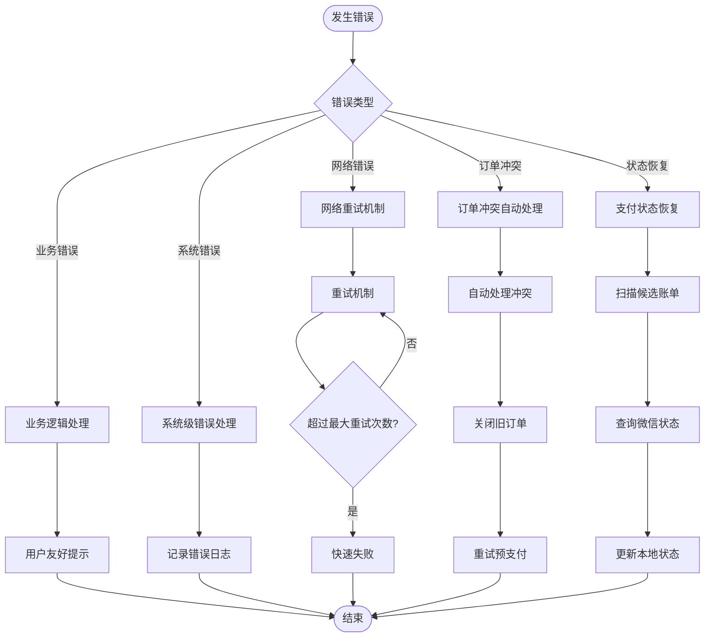
```mermaid
flowchart TD
Error([发生错误]) --> TypeCheck{"错误类型"}
TypeCheck --> |网络错误| Network["网络重试机制"]
TypeCheck --> |业务错误| Business["业务逻辑处理"]
TypeCheck --> |系统错误| System["系统级错误处理"]
TypeCheck --> |订单冲突| Conflict["订单冲突自动处理"]
TypeCheck --> |状态恢复| Recovery["支付状态恢复"]
Network --> Retry["重试机制"]
Retry --> MaxRetry{"超过最大重试次数?"}
MaxRetry --> |是| FailFast["快速失败"]
MaxRetry --> |否| Retry
Business --> UserMsg["用户友好提示"]
System --> LogError["记录错误日志"]
Conflict --> AutoHandle["自动处理冲突"]
AutoHandle --> CloseOrder["关闭旧订单"]
CloseOrder --> RetryPrepay["重试预支付"]
Recovery --> ScanCandidates["扫描候选账单"]
ScanCandidates --> QueryWX["查询微信状态"]
QueryWX --> UpdateLocal["更新本地状态"]
UserMsg --> End([结束])
LogError --> End
FailFast --> End
RetryPrepay --> End
UpdateLocal --> End
```

**图表来源**
- [SameUrlDataInterceptor.java:68-84](file://ruoyi-framework/src/main/java/com/ruoyi/framework/interceptor/impl/SameUrlDataInterceptor.java#L68-L84)
- [WechatPayController.java:159-215](file://ruoyi-admin/src/main/java/com/ruoyi/web/controller/h5/WechatPayController.java#L159-L215)
- [ContractExpireTask.java:407-450](file://ruoyi-quartz/src/main/java/com/ruoyi/quartz/task/ContractExpireTask.java#L407-L450)

### 增强的错误处理策略
**更新** 系统集成了更完善的错误处理策略：

1. **智能重试机制**：根据错误类型决定是否重试
2. **订单冲突自动恢复**：自动处理参数不一致的支付请求
3. **支付状态自动恢复**：定时检查并恢复异常的支付状态
4. **丢失回调恢复**：专门的定时任务处理回调丢失问题
5. **详细日志记录**：记录所有错误处理过程便于排查
6. **last_out_trade_no持久化**：确保支付状态恢复的可靠性

**章节来源**
- [project-wxpay-config.md:1-25](file://.claude/projects/-Users-wangwen-Desktop-ghz-ghz/memory/project-wxpay-config.md#L1-L25)
- [SameUrlDataInterceptor.java:1-110](file://ruoyi-framework/src/main/java/com/ruoyi/framework/interceptor/impl/SameUrlDataInterceptor.java#L1-L110)
- [WechatPayController.java:159-215](file://ruoyi-admin/src/main/java/com/ruoyi/web/controller/h5/WechatPayController.java#L159-L215)
- [ContractExpireTask.java:327-450](file://ruoyi-quartz/src/main/java/com/ruoyi/quartz/task/ContractExpireTask.java#L327-L450)
- [HzBillController.java:125-169](file://ruoyi-admin/src/main/java/com/ruoyi/web/controller/system/HzBillController.java#L125-L169)

## 结论
港好住信息系统的支付系统设计合理，实现了完整的支付闭环和良好的用户体验。系统采用先进的技术架构，支持多种支付方式，具备完善的安全保障和故障处理机制。

### 主要优势
1. **架构设计合理**：分层清晰，职责明确，易于维护和扩展
2. **安全性强**：采用公钥模式配置，完善的签名验证机制
3. **用户体验好**：支持多种支付方式，智能的轮询机制
4. **可扩展性强**：接口设计灵活，便于添加新的支付方式
5. **健壮性提升**：新增订单冲突自动处理和支付状态恢复机制
6. **状态恢复可靠**：通过last_out_trade_no字段确保支付状态的准确性

### 最新改进
**新增功能** 系统现已集成以下重要改进：
- **支付恢复系统**：通过last_out_trade_no字段实现可靠的支付状态恢复
- **自动持久化机制**：WeChatPayController自动处理订单持久化
- **增强错误处理**：智能的错误分类和处理策略
- **丢失回调恢复**：专门的定时任务处理回调丢失问题
- **查询兼容性**：支持历史数据的查询兼容性

### 改进建议
1. **监控告警**：建议增加更完善的支付监控和告警机制
2. **性能优化**：可以进一步优化数据库查询和缓存策略
3. **测试覆盖**：建议增加更多的单元测试和集成测试
4. **日志分析**：建议增加专门的日志分析工具用于错误追踪
5. **状态恢复优化**：可以考虑增加更多维度的状态恢复策略

## 附录

### 支付配置参数说明
系统通过配置文件管理所有支付相关的参数：

| 参数名称 | 用途 | 示例值 |
|---------|------|--------|
| wechat.pay.enabled | 支付开关 | true/false |
| wechat.pay.appid | 微信应用ID | wx74efa287343d0fa2 |
| wechat.pay.mch-id | 商户号 | 1106404234 |
| wechat.pay.api-v3-key | API v3密钥 | FSHwjDLGjooxhXIZQtGYAfimmZyvstGg |
| wechat.pay.notify-url | 回调地址 | https://app.caigon.cn/h5/pay/wechat/notify |

### 支付状态说明
系统使用标准化的支付状态管理：

| 状态码 | 状态名称 | 说明 |
|-------|----------|------|
| 0 | 待支付 | 初始状态 |
| 1 | 支付中 | 支付处理中 |
| 2 | 支付成功 | 支付完成 |
| 3 | 支付失败 | 支付失败 |
| 4 | 已退款 | 已完成退款 |
| 5 | 订单已关闭 | 手动关闭订单 |

### 安全保障措施
1. **证书安全管理**：采用公钥模式，避免平台证书依赖
2. **签名验证机制**：使用NotificationParser自动进行验签
3. **防重放攻击**：通过Redis缓存和重复提交检测防止重复请求
4. **数据加密传输**：所有敏感数据通过HTTPS传输
5. **订单冲突防护**：自动检测和处理参数冲突，防止重复支付
6. **状态恢复保护**：通过last_out_trade_no字段确保状态恢复的准确性

### 错误处理策略
系统实现了多层次的错误处理策略：

| 错误类型 | 处理方式 | 重试策略 | 特殊功能 |
|---------|----------|----------|----------|
| 网络超时 | 自动重试 | 1-2次，指数退避 | 无 |
| 参数错误 | 直接失败 | 不重试 | 无 |
| 支付冲突 | 自动关闭旧订单重试 | 1次 | last_out_trade_no持久化 |
| 微信回调失败 | 主动查单同步 | 定时任务 | 支付状态恢复 |
| 系统异常 | 记录日志人工处理 | 手动干预 | 详细日志记录 |
| 丢失回调 | 专门恢复任务 | 定时扫描 | 丢失回调恢复 |

### 支付状态恢复流程
**更新** 系统的支付状态恢复机制：

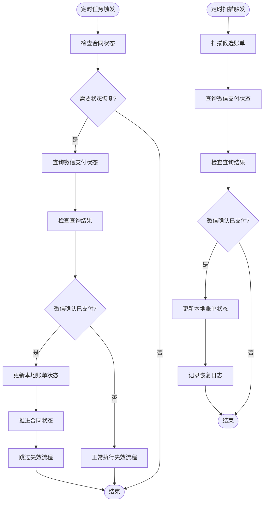
```mermaid
flowchart TD
Start([定时任务触发]) --> CheckContract["检查合同状态"]
CheckContract --> NeedRecover{"需要状态恢复?"}
NeedRecover --> |是| QueryWX["查询微信支付状态"]
QueryWX --> CheckResult["检查查询结果"]
CheckResult --> Paid{"微信确认已支付?"}
Paid --> |是| UpdateLocal["更新本地账单状态"]
UpdateLocal --> AdvanceContract["推进合同状态"]
AdvanceContract --> SkipExpire["跳过失效流程"]
Paid --> |否| NormalExpire["正常执行失效流程"]
NeedRecover --> |否| End([结束])
SkipExpire --> End
NormalExpire --> End
Start2([定时扫描触发]) --> ScanCandidates["扫描候选账单"]
ScanCandidates --> QueryWX2["查询微信支付状态"]
QueryWX2 --> CheckResult2["检查查询结果"]
CheckResult2 --> Paid2{"微信确认已支付?"}
Paid2 --> |是| UpdateLocal2["更新本地账单状态"]
UpdateLocal2 --> LogRecovery["记录恢复日志"]
Paid2 --> |否| End2([结束])
LogRecovery --> End2
```

**图表来源**
- [ContractExpireTask.java:332-450](file://ruoyi-quartz/src/main/java/com/ruoyi/quartz/task/ContractExpireTask.java#L332-L450)

### last_out_trade_no字段使用指南
**新增** 系统中last_out_trade_no字段的使用指南：

#### 字段含义
- **存储内容**：实际下到微信支付平台的订单号
- **格式特征**：可能包含-R-后缀的重试订单号
- **更新时机**：每次成功预支付后自动更新

#### 使用场景
1. **支付状态查询**：优先使用last_out_trade_no进行微信查询
2. **状态恢复**：在回调丢失时恢复支付状态
3. **历史兼容**：支持重试机制上线前的历史数据
4. **审计追踪**：提供完整的支付状态变更记录

#### 查询策略
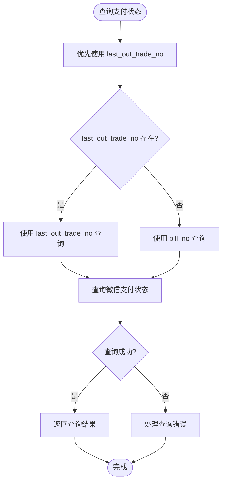
```mermaid
flowchart TD
Query([查询支付状态]) --> Priority["优先使用 last_out_trade_no"]
Priority --> HasLastOut{"last_out_trade_no 存在?"}
HasLastOut --> |是| UseLastOut["使用 last_out_trade_no 查询"]
HasLastOut --> |否| UseBillNo["使用 bill_no 查询"]
UseLastOut --> QueryWX["查询微信支付状态"]
UseBillNo --> QueryWX
QueryWX --> Success{"查询成功?"}
Success --> |是| ReturnResult["返回查询结果"]
Success --> |否| HandleError["处理查询错误"]
ReturnResult --> End([完成])
HandleError --> End
```

**图表来源**
- [WechatPayController.java:453-456](file://ruoyi-admin/src/main/java/com/ruoyi/web/controller/h5/WechatPayController.java#L453-L456)
- [HzBillController.java:145-169](file://ruoyi-admin/src/main/java/com/ruoyi/web/controller/system/HzBillController.java#L145-L169)