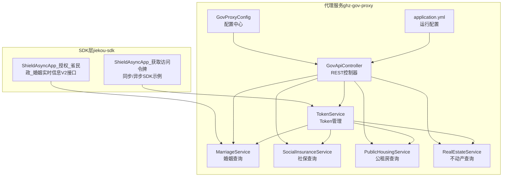
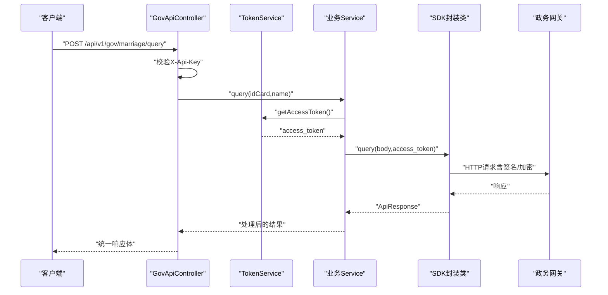
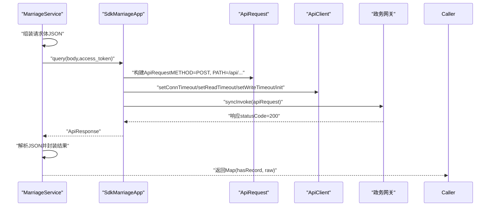
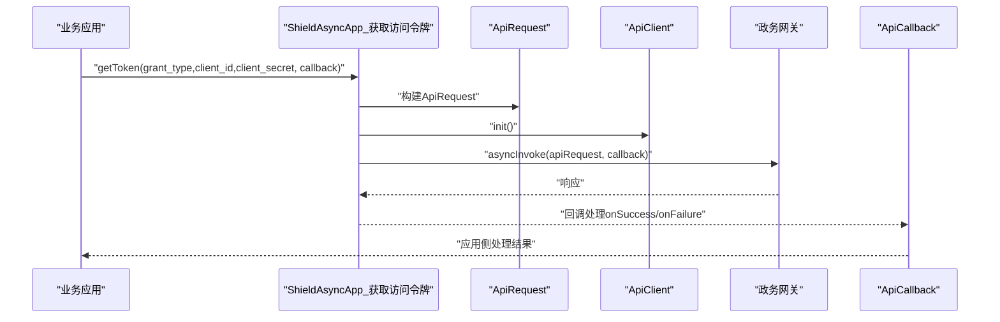
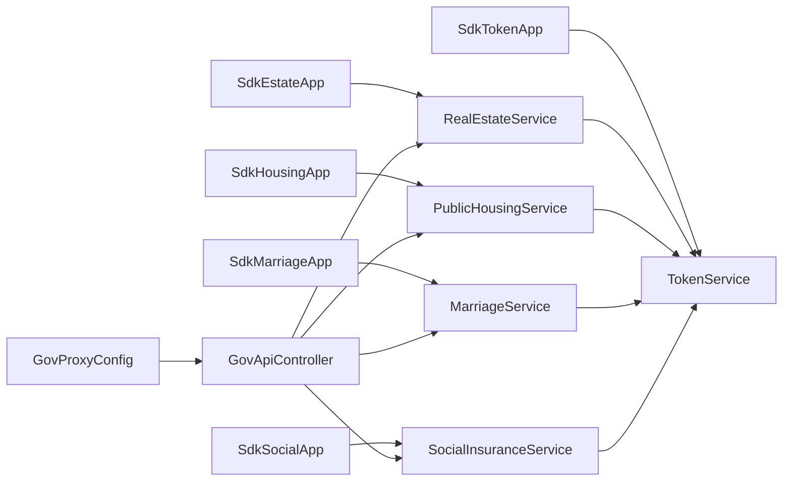

# SDK封装设计

<cite>
**本文引用的文件**
- [SdkEstateApp.java](file://ghz-gov-proxy/src/main/java/com/ghz/gov/sdk/SdkEstateApp.java)
- [SdkHousingApp.java](file://ghz-gov-proxy/src/main/java/com/ghz/gov/sdk/SdkHousingApp.java)
- [SdkMarriageApp.java](file://ghz-gov-proxy/src/main/java/com/ghz/gov/sdk/SdkMarriageApp.java)
- [SdkSocialApp.java](file://ghz-gov-proxy/src/main/java/com/ghz/gov/sdk/SdkSocialApp.java)
- [SdkTokenApp.java](file://ghz-gov-proxy/src/main/java/com/ghz/gov/sdk/SdkTokenApp.java)
- [GovApiController.java](file://ghz-gov-proxy/src/main/java/com/ghz/gov/controller/GovApiController.java)
- [MarriageService.java](file://ghz-gov-proxy/src/main/java/com/ghz/gov/service/MarriageService.java)
- [PublicHousingService.java](file://ghz-gov-proxy/src/main/java/com/ghz/gov/service/PublicHousingService.java)
- [RealEstateService.java](file://ghz-gov-proxy/src/main/java/com/ghz/gov/service/RealEstateService.java)
- [SocialInsuranceService.java](file://ghz-gov-proxy/src/main/java/com/ghz/gov/service/SocialInsuranceService.java)
- [TokenService.java](file://ghz-gov-proxy/src/main/java/com/ghz/gov/service/TokenService.java)
- [GovProxyConfig.java](file://ghz-gov-proxy/src/main/java/com/ghz/gov/config/GovProxyConfig.java)
- [application.yml](file://ghz-gov-proxy/src/main/resources/application.yml)
- [ShieldAsyncApp_获取访问令牌_87BD3A66EA7749EC970C966E3DAAEE41.java](file://jiekou-sdk/java/RELEASE/ShieldAsyncApp_获取访问令牌_87BD3A66EA7749EC970C966E3DAAEE41.java)
- [ShieldAsyncApp_授权_省民政_婚姻实时信息V2接口_67E20E7BE2B14F8CB716D965D5ECF0FA.java](file://jiekou-sdk/java-2/RELEASE/ShieldAsyncApp_授权_省民政_婚姻实时信息V2接口_67E20E7BE2B14F8CB716D965D5ECF0FA.java)
- [GetOAuthTokenTest.java](file://Demo/后端Demo/szzz-open-gateway-demo/szzz-open-gateway-demo/src/main/java/com/digital/cnzz/gateway/demo/application/GetOAuthTokenTest.java)
- [GetUserDetailTest.java](file://Demo/后端Demo/szzz-open-gateway-demo/szzz-open-gateway-demo/src/main/java/com/digital/cnzz/gateway/demo/application/GetUserDetailTest.java)
</cite>

## 目录
1. [引言](#引言)
2. [项目结构](#项目结构)
3. [核心组件](#核心组件)
4. [架构总览](#架构总览)
5. [详细组件分析](#详细组件分析)
6. [依赖分析](#依赖分析)
7. [性能考量](#性能考量)
8. [故障排查指南](#故障排查指南)
9. [结论](#结论)
10. [附录](#附录)

## 引言
本文件面向“政务接口SDK”的设计与实现，聚焦于三类调用形态：同步调用、异步调用、WebSocket（本仓库未提供WebSocket实现，故以现有能力与通用模式说明）。文档从封装模式、接口抽象、参数封装、返回值处理、版本管理与兼容、升级策略、使用场景与集成方式、最佳实践、安装配置、初始化流程、调用示例与错误处理、开发规范与测试方法、性能优化等方面进行系统化阐述，并结合本仓库中的Java SDK实现与Spring Boot代理服务，给出可操作的工程化指导。

## 项目结构
本项目围绕“政务接口代理服务”展开，SDK侧主要位于 jiekou-sdk 目录，代理服务位于 ghz-gov-proxy 目录。前者提供针对不同接口的SDK封装（含同步与异步），后者提供统一的HTTP代理入口与业务服务编排。

图表来源
- [ShieldAsyncApp_获取访问令牌_87BD3A66EA7749EC970C966E3DAAEE41.java:1-79](file://jiekou-sdk/java/RELEASE/ShieldAsyncApp_获取访问令牌_87BD3A66EA7749EC970C966E3DAAEE41.java#L1-L79)
- [ShieldAsyncApp_授权_省民政_婚姻实时信息V2接口_67E20E7BE2B14F8CB716D965D5ECF0FA.java:1-75](file://jiekou-sdk/java-2/RELEASE/ShieldAsyncApp_授权_省民政_婚姻实时信息V2接口_67E20E7BE2B14F8CB716D965D5ECF0FA.java#L1-L75)
- [GovApiController.java:1-149](file://ghz-gov-proxy/src/main/java/com/ghz/gov/controller/GovApiController.java#L1-L149)
- [TokenService.java:1-170](file://ghz-gov-proxy/src/main/java/com/ghz/gov/service/TokenService.java#L1-L170)
- [MarriageService.java:1-98](file://ghz-gov-proxy/src/main/java/com/ghz/gov/service/MarriageService.java#L1-L98)
- [SocialInsuranceService.java:1-110](file://ghz-gov-proxy/src/main/java/com/ghz/gov/service/SocialInsuranceService.java#L1-L110)
- [PublicHousingService.java:1-97](file://ghz-gov-proxy/src/main/java/com/ghz/gov/service/PublicHousingService.java#L1-L97)
- [RealEstateService.java:1-97](file://ghz-gov-proxy/src/main/java/com/ghz/gov/service/RealEstateService.java#L1-L97)
- [GovProxyConfig.java:1-16](file://ghz-gov-proxy/src/main/java/com/ghz/gov/config/GovProxyConfig.java#L1-L16)
- [application.yml:1-13](file://ghz-gov-proxy/src/main/resources/application.yml#L1-L13)

章节来源
- [application.yml:1-13](file://ghz-gov-proxy/src/main/resources/application.yml#L1-L13)
- [GovProxyConfig.java:1-16](file://ghz-gov-proxy/src/main/java/com/ghz/gov/config/GovProxyConfig.java#L1-L16)

## 核心组件
- SDK封装层（jiekou-sdk）
  - 同步/异步SDK示例：提供统一的BaseApp基类能力，封装请求构造、签名策略、加密参数、回调处理等。
  - 示例类：ShieldAsyncApp_获取访问令牌、ShieldAsyncApp_授权_省民政_婚姻实时信息V2接口。
- 代理服务层（ghz-gov-proxy）
  - 控制器：对外暴露REST接口，负责鉴权、参数校验、日志与结果包装。
  - 服务编排：各业务Service封装具体调用逻辑，统一处理重试、异常与返回值。
  - Token管理：集中管理access_token生命周期，支持定时刷新与并发安全。
  - 配置中心：集中管理API Key等运行参数。

章节来源
- [ShieldAsyncApp_获取访问令牌_87BD3A66EA7749EC970C966E3DAAEE41.java:1-79](file://jiekou-sdk/java/RELEASE/ShieldAsyncApp_获取访问令牌_87BD3A66EA7749EC970C966E3DAAEE41.java#L1-L79)
- [ShieldAsyncApp_授权_省民政_婚姻实时信息V2接口_67E20E7BE2B14F8CB716D965D5ECF0FA.java:1-75](file://jiekou-sdk/java-2/RELEASE/ShieldAsyncApp_授权_省民政_婚姻实时信息V2接口_67E20E7BE2B14F8CB716D965D5ECF0FA.java#L1-L75)
- [GovApiController.java:1-149](file://ghz-gov-proxy/src/main/java/com/ghz/gov/controller/GovApiController.java#L1-L149)
- [TokenService.java:1-170](file://ghz-gov-proxy/src/main/java/com/ghz/gov/service/TokenService.java#L1-L170)

## 架构总览
下图展示从客户端到政务接口的完整链路：客户端经代理服务的REST接口发起请求，代理服务通过TokenService获取或刷新access_token，再由各业务Service调用对应SDK进行同步/异步请求，最终返回统一的响应模型。

图表来源
- [GovApiController.java:48-66](file://ghz-gov-proxy/src/main/java/com/ghz/gov/controller/GovApiController.java#L48-L66)
- [TokenService.java:42-53](file://ghz-gov-proxy/src/main/java/com/ghz/gov/service/TokenService.java#L42-L53)
- [MarriageService.java:36-44](file://ghz-gov-proxy/src/main/java/com/ghz/gov/service/MarriageService.java#L36-L44)
- [SdkMarriageApp.java:37-44](file://ghz-gov-proxy/src/main/java/com/ghz/gov/sdk/SdkMarriageApp.java#L37-L44)

## 详细组件分析

### SDK封装模式与接口抽象
- 统一基类能力：SDK类继承自BaseApp，内部持有ApiClient，负责连接超时、读写超时、初始化、签名策略URL、Token URL、公钥/国密公私钥、设备编号、icloudlock开关等。
- 请求构造：通过ApiRequest设置协议、方法、路径、认证类型、签名串等；参数可通过ParamPosition指定位置（FORM/QUERY/BODY）。
- 同步/异步调用：SDK提供syncInvoke与asyncInvoke两种调用方式，异步通过ApiCallback回调处理结果。
- 参数封装：body以byte[]形式注入；query参数通过addParam指定位置与是否必须。
- 返回值处理：统一返回ApiResponse，包含状态码、body、头信息等，便于上层解析与错误处理。

章节来源
- [SdkEstateApp.java:12-46](file://ghz-gov-proxy/src/main/java/com/ghz/gov/sdk/SdkEstateApp.java#L12-L46)
- [SdkHousingApp.java:12-45](file://ghz-gov-proxy/src/main/java/com/ghz/gov/sdk/SdkHousingApp.java#L12-L45)
- [SdkMarriageApp.java:12-45](file://ghz-gov-proxy/src/main/java/com/ghz/gov/sdk/SdkMarriageApp.java#L12-L45)
- [SdkSocialApp.java:12-45](file://ghz-gov-proxy/src/main/java/com/ghz/gov/sdk/SdkSocialApp.java#L12-L45)
- [SdkTokenApp.java:12-46](file://ghz-gov-proxy/src/main/java/com/ghz/gov/sdk/SdkTokenApp.java#L12-L46)
- [ShieldAsyncApp_获取访问令牌_87BD3A66EA7749EC970C966E3DAAEE41.java:14-79](file://jiekou-sdk/java/RELEASE/ShieldAsyncApp_获取访问令牌_87BD3A66EA7749EC970C966E3DAAEE41.java#L14-L79)
- [ShieldAsyncApp_授权_省民政_婚姻实时信息V2接口_67E20E7BE2B14F8CB716D965D5ECF0FA.java:14-75](file://jiekou-sdk/java-2/RELEASE/ShieldAsyncApp_授权_省民政_婚姻实时信息V2接口_67E20E7BE2B14F8CB716D965D5ECF0FA.java#L14-L75)

### 同步调用流程（以婚姻查询为例）

图表来源
- [MarriageService.java:36-91](file://ghz-gov-proxy/src/main/java/com/ghz/gov/service/MarriageService.java#L36-L91)
- [SdkMarriageApp.java:37-44](file://ghz-gov-proxy/src/main/java/com/ghz/gov/sdk/SdkMarriageApp.java#L37-L44)

章节来源
- [MarriageService.java:36-91](file://ghz-gov-proxy/src/main/java/com/ghz/gov/service/MarriageService.java#L36-L91)
- [SdkMarriageApp.java:37-44](file://ghz-gov-proxy/src/main/java/com/ghz/gov/sdk/SdkMarriageApp.java#L37-L44)

### 异步调用流程（SDK示例）

图表来源
- [ShieldAsyncApp_获取访问令牌_87BD3A66EA7749EC970C966E3DAAEE41.java:66-77](file://jiekou-sdk/java/RELEASE/ShieldAsyncApp_获取访问令牌_87BD3A66EA7749EC970C966E3DAAEE41.java#L66-L77)

章节来源
- [ShieldAsyncApp_获取访问令牌_87BD3A66EA7749EC970C966E3DAAEE41.java:66-77](file://jiekou-sdk/java/RELEASE/ShieldAsyncApp_获取访问令牌_87BD3A66EA7749EC970C966E3DAAEE41.java#L66-L77)

### WebSocket调用形态说明
- 本仓库未提供WebSocket SDK实现。若需WebSocket形态，可在SDK层扩展WebSocket客户端，复用签名与加密策略；在代理服务层增加WebSocket端点或通过消息中间件桥接。
- 设计要点：连接管理、心跳保活、断线重连、消息序列化与反序列化、异常恢复策略。

（本小节为概念性说明，不直接分析具体文件）

### 版本管理、向后兼容与升级策略
- 版本标识：SDK类名包含版本号后缀（如“_87BD3A66EA7749EC970C966E3DAAEE41”），便于区分不同版本接口定义。
- 升级策略：
  - 新增版本：保留旧类，新增同名类（带新版本后缀），确保旧业务不中断。
  - 接口变更：保持对外调用签名一致或提供适配层，避免破坏性变更。
  - 配置迁移：通过配置中心（GovProxyConfig）集中管理，避免硬编码。
- 向后兼容：SDK内部参数与路径以类名版本为准，业务侧通过路由或版本参数选择对应SDK实例。

章节来源
- [ShieldAsyncApp_获取访问令牌_87BD3A66EA7749EC970C966E3DAAEE41.java:64-65](file://jiekou-sdk/java/RELEASE/ShieldAsyncApp_获取访问令牌_87BD3A66EA7749EC970C966E3DAAEE41.java#L64-L65)
- [ShieldAsyncApp_授权_省民政_婚姻实时信息V2接口_67E20E7BE2B14F8CB716D965D5ECF0FA.java:63-64](file://jiekou-sdk/java-2/RELEASE/ShieldAsyncApp_授权_省民政_婚姻实时信息V2接口_67E20E7BE2B14F8CB716D965D5ECF0FA.java#L63-L64)
- [GovProxyConfig.java:1-16](file://ghz-gov-proxy/src/main/java/com/ghz/gov/config/GovProxyConfig.java#L1-L16)

### 使用场景、集成方式与最佳实践
- 使用场景
  - 同步调用：对实时性要求高、业务逻辑简单、无需回调的场景。
  - 异步调用：高并发、长耗时、需要回调处理的场景。
  - WebSocket：事件推送、实时订阅、双向通信场景（需自行扩展）。
- 集成方式
  - 将SDK类引入工程，按接口文档配置appId/appSecret/gmAppSecret、host/port、公私钥等。
  - 在代理服务中注册对应Service，控制器暴露REST接口，统一鉴权与日志。
- 最佳实践
  - 参数校验：在控制器与Service层均做参数校验，减少无效调用。
  - 超时与重试：SDK层设置合理超时；Service层对可重试错误（如超时）进行有限次数重试。
  - 日志与监控：记录请求耗时、状态码、异常堆栈，便于定位问题。
  - 安全：敏感参数（Token、密钥）不落盘，通过配置中心管理。

章节来源
- [GovApiController.java:48-66](file://ghz-gov-proxy/src/main/java/com/ghz/gov/controller/GovApiController.java#L48-L66)
- [MarriageService.java:46-63](file://ghz-gov-proxy/src/main/java/com/ghz/gov/service/MarriageService.java#L46-L63)

### 安装配置、初始化流程与调用示例
- 安装配置
  - SDK侧：将SDK类打包为jar，或直接复制源码至工程；配置host、port、公私钥、签名策略URL、Token URL等。
  - 代理服务侧：设置API Key、日志级别、端口等。
- 初始化流程
  - SDK初始化：new ApiClient() -> setConnTimeout/setReadTimeout/setWriteTimeout -> init() -> 设置appId/appSecret/gmAppSecret/host/port/stage/publicKey/gmPublicKey/gmPrivateKey/icloudlock。
  - 代理服务初始化：Spring Boot启动，加载application.yml与GovProxyConfig。
- 调用示例
  - 同步调用：业务Service组装body与access_token，调用SdkXxxApp.query(...)，解析ApiResponse。
  - 异步调用：调用SdkXxxApp.getToken(..., ApiCallback)，在回调中处理结果。
  - 参考示例：jiekou-sdk中的ShieldAsyncApp_*类；后端Demo中的GetOAuthTokenTest、GetUserDetailTest展示了网关SDK的调用流程（可借鉴参数组织与签名验证思路）。

章节来源
- [SdkEstateApp.java:14-36](file://ghz-gov-proxy/src/main/java/com/ghz/gov/sdk/SdkEstateApp.java#L14-L36)
- [application.yml:1-13](file://ghz-gov-proxy/src/main/resources/application.yml#L1-L13)
- [GovProxyConfig.java:10-14](file://ghz-gov-proxy/src/main/java/com/ghz/gov/config/GovProxyConfig.java#L10-L14)
- [ShieldAsyncApp_获取访问令牌_87BD3A66EA7749EC970C966E3DAAEE41.java:16-59](file://jiekou-sdk/java/RELEASE/ShieldAsyncApp_获取访问令牌_87BD3A66EA7749EC970C966E3DAAEE41.java#L16-L59)
- [GetOAuthTokenTest.java:23-66](file://Demo/后端Demo/szzz-open-gateway-demo/szzz-open-gateway-demo/src/main/java/com/digital/cnzz/gateway/demo/application/GetOAuthTokenTest.java#L23-L66)
- [GetUserDetailTest.java:23-66](file://Demo/后端Demo/szzz-open-gateway-demo/szzz-open-gateway-demo/src/main/java/com/digital/cnzz/gateway/demo/application/GetUserDetailTest.java#L23-L66)

### 错误处理与健壮性
- SDK层：统一返回ApiResponse，上层根据statusCode判断；对非200响应抛出异常，记录body与状态。
- 服务层：对特定错误（如超时）进行有限次数重试；记录warn/error日志，必要时抛出运行时异常。
- 控制器层：统一包装响应体，返回标准错误码与提示信息。

章节来源
- [MarriageService.java:65-91](file://ghz-gov-proxy/src/main/java/com/ghz/gov/service/MarriageService.java#L65-L91)
- [PublicHousingService.java:64-90](file://ghz-gov-proxy/src/main/java/com/ghz/gov/service/PublicHousingService.java#L64-L90)
- [RealEstateService.java:64-90](file://ghz-gov-proxy/src/main/java/com/ghz/gov/service/RealEstateService.java#L64-L90)
- [SocialInsuranceService.java:73-103](file://ghz-gov-proxy/src/main/java/com/ghz/gov/service/SocialInsuranceService.java#L73-L103)
- [GovApiController.java:48-66](file://ghz-gov-proxy/src/main/java/com/ghz/gov/controller/GovApiController.java#L48-L66)

### 开发规范与测试方法
- 开发规范
  - 类命名：遵循“SdkXxxApp”或“ShieldXxxApp_接口名_版本号”规则，清晰表达用途与版本。
  - 参数组织：明确ParamPosition（FORM/QUERY/BODY），避免混淆。
  - 配置分离：敏感参数与环境参数全部来自配置中心或外部化配置。
- 测试方法
  - 单元测试：对Service层doQuery/doQueryOnce进行Mock与断言，覆盖正常、异常、重试分支。
  - 集成测试：启动代理服务，调用REST接口，验证鉴权、参数校验、响应格式与日志输出。
  - 性能测试：压测不同调用形态（同步/异步），评估吞吐与延迟。

（本小节为通用规范说明，不直接分析具体文件）

## 依赖分析
SDK类之间无直接依赖，均基于BaseApp与ApiClient；业务Service依赖对应SdkXxxApp与TokenService；控制器依赖各业务Service与配置。

图表来源
- [SdkEstateApp.java:1-47](file://ghz-gov-proxy/src/main/java/com/ghz/gov/sdk/SdkEstateApp.java#L1-L47)
- [SdkHousingApp.java:1-46](file://ghz-gov-proxy/src/main/java/com/ghz/gov/sdk/SdkHousingApp.java#L1-L46)
- [SdkMarriageApp.java:1-46](file://ghz-gov-proxy/src/main/java/com/ghz/gov/sdk/SdkMarriageApp.java#L1-L46)
- [SdkSocialApp.java:1-46](file://ghz-gov-proxy/src/main/java/com/ghz/gov/sdk/SdkSocialApp.java#L1-L46)
- [SdkTokenApp.java:1-47](file://ghz-gov-proxy/src/main/java/com/ghz/gov/sdk/SdkTokenApp.java#L1-L47)
- [RealEstateService.java:1-97](file://ghz-gov-proxy/src/main/java/com/ghz/gov/service/RealEstateService.java#L1-L97)
- [PublicHousingService.java:1-97](file://ghz-gov-proxy/src/main/java/com/ghz/gov/service/PublicHousingService.java#L1-L97)
- [MarriageService.java:1-98](file://ghz-gov-proxy/src/main/java/com/ghz/gov/service/MarriageService.java#L1-L98)
- [SocialInsuranceService.java:1-110](file://ghz-gov-proxy/src/main/java/com/ghz/gov/service/SocialInsuranceService.java#L1-L110)
- [TokenService.java:1-170](file://ghz-gov-proxy/src/main/java/com/ghz/gov/service/TokenService.java#L1-L170)
- [GovApiController.java:1-149](file://ghz-gov-proxy/src/main/java/com/ghz/gov/controller/GovApiController.java#L1-L149)
- [GovProxyConfig.java:1-16](file://ghz-gov-proxy/src/main/java/com/ghz/gov/config/GovProxyConfig.java#L1-L16)

章节来源
- [GovApiController.java:24-35](file://ghz-gov-proxy/src/main/java/com/ghz/gov/controller/GovApiController.java#L24-L35)
- [TokenService.java:31-31](file://ghz-gov-proxy/src/main/java/com/ghz/gov/service/TokenService.java#L31-L31)

## 性能考量
- 超时设置：SDK层对连接、读、写超时分别配置，代理服务层对政务接口响应慢的场景适当放大（如不动产/婚姻可达20+秒）。
- 重试策略：对可重试错误（如超时）进行有限次数重试，降低偶发抖动影响。
- 并发与缓存：TokenService采用并发锁与提前刷新策略，避免频繁刷新与并发竞争。
- 日志与监控：开启DEBUG级别日志，记录耗时与关键指标，便于性能分析。

章节来源
- [SdkEstateApp.java:16-18](file://ghz-gov-proxy/src/main/java/com/ghz/gov/sdk/SdkEstateApp.java#L16-L18)
- [SdkHousingApp.java:16-18](file://ghz-gov-proxy/src/main/java/com/ghz/gov/sdk/SdkHousingApp.java#L16-L18)
- [SdkMarriageApp.java:16-18](file://ghz-gov-proxy/src/main/java/com/ghz/gov/sdk/SdkMarriageApp.java#L16-L18)
- [SdkSocialApp.java:16-18](file://ghz-gov-proxy/src/main/java/com/ghz/gov/sdk/SdkSocialApp.java#L16-L18)
- [TokenService.java:36-37](file://ghz-gov-proxy/src/main/java/com/ghz/gov/service/TokenService.java#L36-L37)
- [application.yml:10-12](file://ghz-gov-proxy/src/main/resources/application.yml#L10-L12)

## 故障排查指南
- 认证失败：检查X-Api-Key是否正确；确认GovProxyConfig与application.yml配置一致。
- 超时与重试：关注日志中的“SHD-1004”或“网关连接后端服务超时”，确认SDK超时配置与网络状况。
- Token异常：查看TokenService日志与状态接口，确认access_token是否有效、是否提前刷新。
- 响应解析：对非200响应，记录body内容，定位后端错误原因。

章节来源
- [GovApiController.java:139-147](file://ghz-gov-proxy/src/main/java/com/ghz/gov/controller/GovApiController.java#L139-L147)
- [TokenService.java:139-146](file://ghz-gov-proxy/src/main/java/com/ghz/gov/service/TokenService.java#L139-L146)
- [MarriageService.java:93-96](file://ghz-gov-proxy/src/main/java/com/ghz/gov/service/MarriageService.java#L93-L96)

## 结论
本SDK封装设计以“统一基类 + 明确职责 + 可扩展形态”为核心，既满足同步/异步调用需求，又通过代理服务实现鉴权、参数校验、日志与统一响应包装。版本化命名与配置中心使升级与维护更可控；重试与超时策略提升稳定性；并发安全与提前刷新保障Token可用性。建议在生产环境中结合压测与监控持续优化超时与重试参数，并完善WebSocket形态以覆盖更多交互场景。

## 附录
- 不同接口类型的SDK实现差异与选择建议
  - 同步调用：适合简单、低延迟、无需回调的场景；实现简洁，易于调试。
  - 异步调用：适合高并发、长耗时、需要回调的场景；需关注回调线程与异常处理。
  - WebSocket：适合事件驱动、实时订阅场景；需自行扩展SDK与代理服务。
- 选择建议
  - 若后端响应普遍较慢（如不动产/婚姻），优先采用异步或增加SDK超时配置。
  - 对实时性要求极高且调用频度较低的场景，可考虑同步直连；否则推荐异步。
  - 对需要事件推送的场景，建议引入WebSocket形态并配套消息队列或长连接管理。

（本小节为通用建议，不直接分析具体文件）