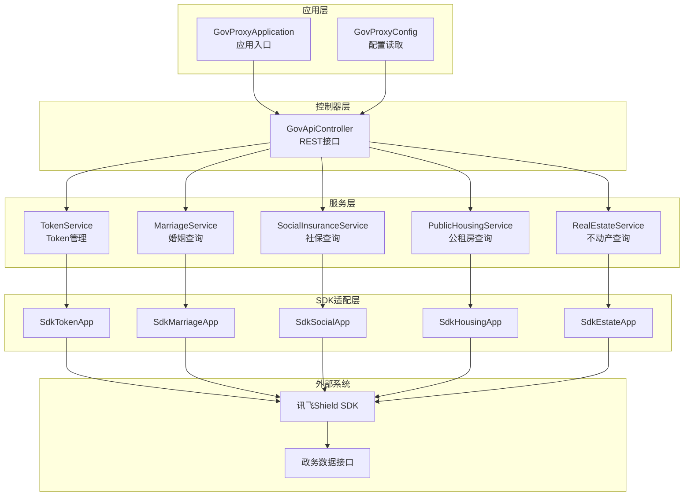
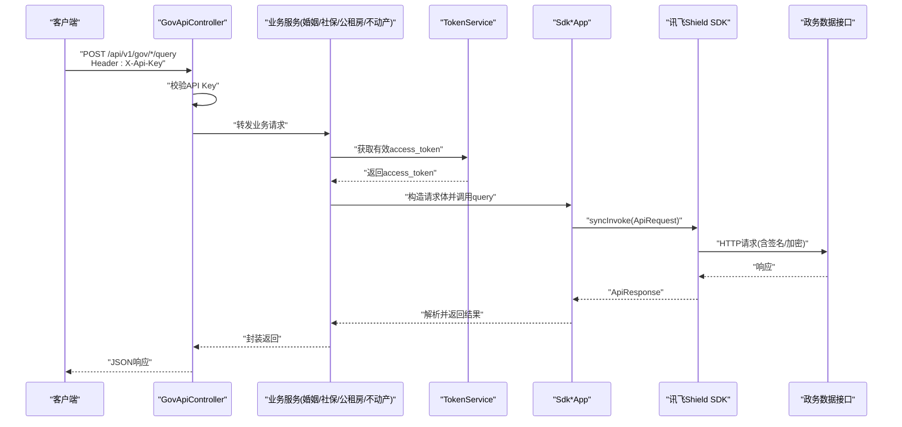
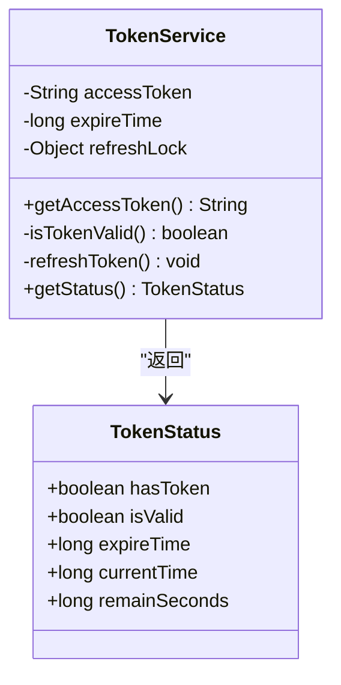
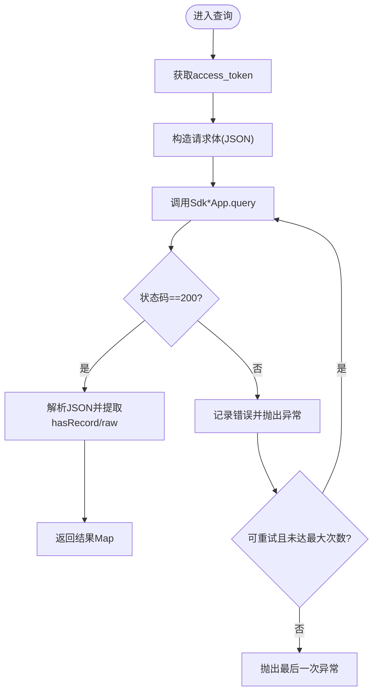
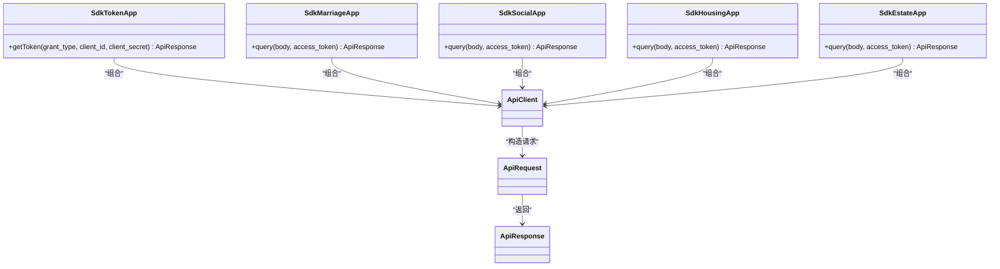
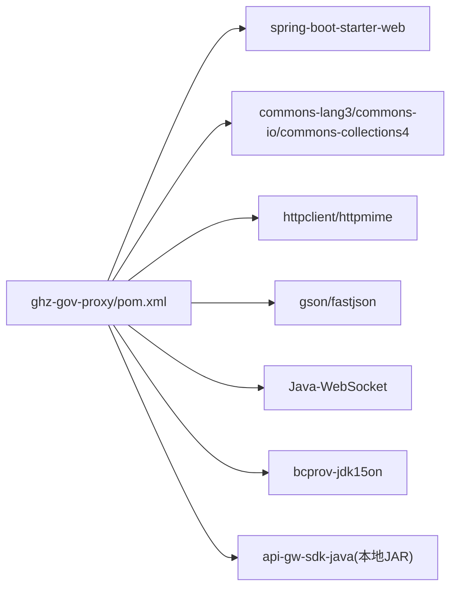

# SDK开发与集成指南

<cite>
**本文档引用的文件**
- [GovProxyApplication.java](file://ghz-gov-proxy/src/main/java/com/ghz/gov/GovProxyApplication.java)
- [GovProxyConfig.java](file://ghz-gov-proxy/src/main/java/com/ghz/gov/config/GovProxyConfig.java)
- [GovApiController.java](file://ghz-gov-proxy/src/main/java/com/ghz/gov/controller/GovApiController.java)
- [TokenService.java](file://ghz-gov-proxy/src/main/java/com/ghz/gov/service/TokenService.java)
- [MarriageService.java](file://ghz-gov-proxy/src/main/java/com/ghz/gov/service/MarriageService.java)
- [SocialInsuranceService.java](file://ghz-gov-proxy/src/main/java/com/ghz/gov/service/SocialInsuranceService.java)
- [PublicHousingService.java](file://ghz-gov-proxy/src/main/java/com/ghz/gov/service/PublicHousingService.java)
- [RealEstateService.java](file://ghz-gov-proxy/src/main/java/com/ghz/gov/service/RealEstateService.java)
- [SdkTokenApp.java](file://ghz-gov-proxy/src/main/java/com/ghz/gov/sdk/SdkTokenApp.java)
- [SdkMarriageApp.java](file://ghz-gov-proxy/src/main/java/com/ghz/gov/sdk/SdkMarriageApp.java)
- [SdkSocialApp.java](file://ghz-gov-proxy/src/main/java/com/ghz/gov/sdk/SdkSocialApp.java)
- [SdkHousingApp.java](file://ghz-gov-proxy/src/main/java/com/ghz/gov/sdk/SdkHousingApp.java)
- [SdkEstateApp.java](file://ghz-gov-proxy/src/main/java/com/ghz/gov/sdk/SdkEstateApp.java)
- [pom.xml](file://ghz-gov-proxy/pom.xml)
- [ShieldAsyncApp_获取访问令牌_87BD3A66EA7749EC970C966E3DAAEE41.java](file://jiekou-sdk/java/RELEASE/ShieldAsyncApp_获取访问令牌_87BD3A66EA7749EC970C966E3DAAEE41.java)
</cite>

## 目录
1. [简介](#简介)
2. [项目结构](#项目结构)
3. [核心组件](#核心组件)
4. [架构总览](#架构总览)
5. [详细组件分析](#详细组件分析)
6. [依赖分析](#依赖分析)
7. [性能考量](#性能考量)
8. [故障排查指南](#故障排查指南)
9. [结论](#结论)
10. [附录](#附录)

## 简介
本指南面向SDK开发者与集成者，系统阐述“港好住”政务数据接口代理服务的SDK开发与集成实践。内容覆盖安装配置、依赖管理、版本控制、初始化与认证、连接建立、测试与调试、性能监控、错误处理与日志、发布与运维、最佳实践与常见问题等，帮助读者快速搭建稳定可靠的SDK集成方案。

## 项目结构
该工程采用多模块分层组织：
- 应用入口与配置：Spring Boot应用启动类与配置类
- 控制器层：对外暴露REST接口，统一鉴权与请求转发
- 服务层：按业务域拆分（婚姻、社保、公租房、不动产），封装SDK调用与重试逻辑
- SDK适配层：对讯飞Shield SDK进行封装，屏蔽底层细节
- 依赖管理：通过Maven集中管理第三方库与本地SDK JAR

图表来源
- [GovProxyApplication.java:1-15](file://ghz-gov-proxy/src/main/java/com/ghz/gov/GovProxyApplication.java#L1-L15)
- [GovProxyConfig.java:1-16](file://ghz-gov-proxy/src/main/java/com/ghz/gov/config/GovProxyConfig.java#L1-L16)
- [GovApiController.java:1-149](file://ghz-gov-proxy/src/main/java/com/ghz/gov/controller/GovApiController.java#L1-L149)
- [TokenService.java:1-170](file://ghz-gov-proxy/src/main/java/com/ghz/gov/service/TokenService.java#L1-L170)
- [MarriageService.java:1-98](file://ghz-gov-proxy/src/main/java/com/ghz/gov/service/MarriageService.java#L1-L98)
- [SocialInsuranceService.java:1-110](file://ghz-gov-proxy/src/main/java/com/ghz/gov/service/SocialInsuranceService.java#L1-L110)
- [PublicHousingService.java:1-97](file://ghz-gov-proxy/src/main/java/com/ghz/gov/service/PublicHousingService.java#L1-L97)
- [RealEstateService.java:1-97](file://ghz-gov-proxy/src/main/java/com/ghz/gov/service/RealEstateService.java#L1-L97)
- [SdkTokenApp.java:1-47](file://ghz-gov-proxy/src/main/java/com/ghz/gov/sdk/SdkTokenApp.java#L1-L47)
- [SdkMarriageApp.java:1-46](file://ghz-gov-proxy/src/main/java/com/ghz/gov/sdk/SdkMarriageApp.java#L1-L46)
- [SdkSocialApp.java:1-46](file://ghz-gov-proxy/src/main/java/com/ghz/gov/sdk/SdkSocialApp.java#L1-L46)
- [SdkHousingApp.java:1-46](file://ghz-gov-proxy/src/main/java/com/ghz/gov/sdk/SdkHousingApp.java#L1-L46)
- [SdkEstateApp.java:1-47](file://ghz-gov-proxy/src/main/java/com/ghz/gov/sdk/SdkEstateApp.java#L1-L47)

章节来源
- [GovProxyApplication.java:1-15](file://ghz-gov-proxy/src/main/java/com/ghz/gov/GovProxyApplication.java#L1-L15)
- [pom.xml:1-108](file://ghz-gov-proxy/pom.xml#L1-L108)

## 核心组件
- 应用入口与配置
  - 应用入口负责启动Spring Boot容器；配置类从属性前缀读取API Key等参数。
- 控制器层
  - 统一REST接口，提供健康检查、各业务查询接口，并在请求进入时进行API Key鉴权。
- 服务层
  - TokenService：懒加载+并发安全+定时刷新的Token管理；各业务服务封装请求体构造与结果解析，并内置重试逻辑。
- SDK适配层
  - 将讯飞Shield SDK封装为领域化的App类，隐藏HTTP客户端、签名策略、超时配置等细节。

章节来源
- [GovProxyApplication.java:1-15](file://ghz-gov-proxy/src/main/java/com/ghz/gov/GovProxyApplication.java#L1-L15)
- [GovProxyConfig.java:1-16](file://ghz-gov-proxy/src/main/java/com/ghz/gov/config/GovProxyConfig.java#L1-L16)
- [GovApiController.java:1-149](file://ghz-gov-proxy/src/main/java/com/ghz/gov/controller/GovApiController.java#L1-L149)
- [TokenService.java:1-170](file://ghz-gov-proxy/src/main/java/com/ghz/gov/service/TokenService.java#L1-L170)
- [MarriageService.java:1-98](file://ghz-gov-proxy/src/main/java/com/ghz/gov/service/MarriageService.java#L1-L98)
- [SocialInsuranceService.java:1-110](file://ghz-gov-proxy/src/main/java/com/ghz/gov/service/SocialInsuranceService.java#L1-L110)
- [PublicHousingService.java:1-97](file://ghz-gov-proxy/src/main/java/com/ghz/gov/service/PublicHousingService.java#L1-L97)
- [RealEstateService.java:1-97](file://ghz-gov-proxy/src/main/java/com/ghz/gov/service/RealEstateService.java#L1-L97)
- [SdkTokenApp.java:1-47](file://ghz-gov-proxy/src/main/java/com/ghz/gov/sdk/SdkTokenApp.java#L1-L47)
- [SdkMarriageApp.java:1-46](file://ghz-gov-proxy/src/main/java/com/ghz/gov/sdk/SdkMarriageApp.java#L1-L46)
- [SdkSocialApp.java:1-46](file://ghz-gov-proxy/src/main/java/com/ghz/gov/sdk/SdkSocialApp.java#L1-L46)
- [SdkHousingApp.java:1-46](file://ghz-gov-proxy/src/main/java/com/ghz/gov/sdk/SdkHousingApp.java#L1-L46)
- [SdkEstateApp.java:1-47](file://ghz-gov-proxy/src/main/java/com/ghz/gov/sdk/SdkEstateApp.java#L1-L47)

## 架构总览
下图展示从客户端到业务服务再到SDK与外部系统的调用链路，以及Token管理与鉴权流程。

图表来源
- [GovApiController.java:47-129](file://ghz-gov-proxy/src/main/java/com/ghz/gov/controller/GovApiController.java#L47-L129)
- [TokenService.java:42-53](file://ghz-gov-proxy/src/main/java/com/ghz/gov/service/TokenService.java#L42-L53)
- [SdkMarriageApp.java:37-44](file://ghz-gov-proxy/src/main/java/com/ghz/gov/sdk/SdkMarriageApp.java#L37-L44)
- [SdkSocialApp.java:37-44](file://ghz-gov-proxy/src/main/java/com/ghz/gov/sdk/SdkSocialApp.java#L37-L44)
- [SdkHousingApp.java:37-44](file://ghz-gov-proxy/src/main/java/com/ghz/gov/sdk/SdkHousingApp.java#L37-L44)
- [SdkEstateApp.java:38-45](file://ghz-gov-proxy/src/main/java/com/ghz/gov/sdk/SdkEstateApp.java#L38-L45)

## 详细组件分析

### 应用与配置
- 应用入口：标准Spring Boot启动类，启用调度功能以便定时刷新Token。
- 配置类：通过@ConfigurationProperties绑定gov.proxy前缀，读取API Key等配置项。

章节来源
- [GovProxyApplication.java:1-15](file://ghz-gov-proxy/src/main/java/com/ghz/gov/GovProxyApplication.java#L1-L15)
- [GovProxyConfig.java:1-16](file://ghz-gov-proxy/src/main/java/com/ghz/gov/config/GovProxyConfig.java#L1-L16)

### 控制器层（GovApiController）
- 接口设计
  - 健康检查：无需API Key，便于探活。
  - 业务接口：婚姻、社保、公租房、不动产查询，均需携带X-Api-Key。
  - Token状态：返回当前Token可用性与过期时间。
- 鉴权机制
  - 从请求头读取X-Api-Key并与配置中的密钥比较，不一致则返回401。
- 错误处理
  - 参数缺失返回400；内部异常捕获并返回500，同时记录错误日志。

章节来源
- [GovApiController.java:37-147](file://ghz-gov-proxy/src/main/java/com/ghz/gov/controller/GovApiController.java#L37-L147)

### Token服务（TokenService）
- 设计要点
  - 懒加载：首次使用时才获取Token。
  - 并发安全：使用同步块与双重检查避免重复刷新。
  - 定时刷新：固定周期触发，提前5分钟刷新，避免临界点失效。
  - 响应解析：解析status与custom字段，确保access_token非空才视为成功。
- 状态查询
  - 提供TokenStatus对象，包含hasToken、isValid、expireTime、remainSeconds等。

图表来源
- [TokenService.java:22-168](file://ghz-gov-proxy/src/main/java/com/ghz/gov/service/TokenService.java#L22-L168)

章节来源
- [TokenService.java:1-170](file://ghz-gov-proxy/src/main/java/com/ghz/gov/service/TokenService.java#L1-L170)

### 业务服务（婚姻/社保/公租房/不动产）
- 统一模式
  - 从TokenService获取access_token。
  - 构造请求体（JSON），调用对应Sdk*App的query方法。
  - 解析响应，提取hasRecord与原始数据，封装为Map。
- 重试策略
  - 对特定超时错误（如SHD-1004或“网关连接后端服务超时”）进行最多3次重试。
- 日志与异常
  - 记录请求耗时、响应摘要；异常时统一包装为运行时异常并上抛。

图表来源
- [MarriageService.java:46-96](file://ghz-gov-proxy/src/main/java/com/ghz/gov/service/MarriageService.java#L46-L96)
- [SocialInsuranceService.java:54-108](file://ghz-gov-proxy/src/main/java/com/ghz/gov/service/SocialInsuranceService.java#L54-L108)
- [PublicHousingService.java:45-95](file://ghz-gov-proxy/src/main/java/com/ghz/gov/service/PublicHousingService.java#L45-L95)
- [RealEstateService.java:45-95](file://ghz-gov-proxy/src/main/java/com/ghz/gov/service/RealEstateService.java#L45-L95)

章节来源
- [MarriageService.java:1-98](file://ghz-gov-proxy/src/main/java/com/ghz/gov/service/MarriageService.java#L1-L98)
- [SocialInsuranceService.java:1-110](file://ghz-gov-proxy/src/main/java/com/ghz/gov/service/SocialInsuranceService.java#L1-L110)
- [PublicHousingService.java:1-97](file://ghz-gov-proxy/src/main/java/com/ghz/gov/service/PublicHousingService.java#L1-L97)
- [RealEstateService.java:1-97](file://ghz-gov-proxy/src/main/java/com/ghz/gov/service/RealEstateService.java#L1-L97)

### SDK适配层（Sdk*App）
- 统一初始化
  - 设置ApiClient超时参数（连接、读、写），初始化后端地址、端口、stage、公私钥等。
- 请求构造
  - 使用ApiRequest指定HTTP方法、路径、认证类型与签名策略，设置body与access_token参数。
- 返回处理
  - 通过syncInvoke发起同步调用，返回ApiResponse供上层解析。

图表来源
- [SdkTokenApp.java:12-45](file://ghz-gov-proxy/src/main/java/com/ghz/gov/sdk/SdkTokenApp.java#L12-L45)
- [SdkMarriageApp.java:12-44](file://ghz-gov-proxy/src/main/java/com/ghz/gov/sdk/SdkMarriageApp.java#L12-L44)
- [SdkSocialApp.java:12-44](file://ghz-gov-proxy/src/main/java/com/ghz/gov/sdk/SdkSocialApp.java#L12-L44)
- [SdkHousingApp.java:12-44](file://ghz-gov-proxy/src/main/java/com/ghz/gov/sdk/SdkHousingApp.java#L12-L44)
- [SdkEstateApp.java:12-45](file://ghz-gov-proxy/src/main/java/com/ghz/gov/sdk/SdkEstateApp.java#L12-L45)

章节来源
- [SdkTokenApp.java:1-47](file://ghz-gov-proxy/src/main/java/com/ghz/gov/sdk/SdkTokenApp.java#L1-L47)
- [SdkMarriageApp.java:1-46](file://ghz-gov-proxy/src/main/java/com/ghz/gov/sdk/SdkMarriageApp.java#L1-L46)
- [SdkSocialApp.java:1-46](file://ghz-gov-proxy/src/main/java/com/ghz/gov/sdk/SdkSocialApp.java#L1-L46)
- [SdkHousingApp.java:1-46](file://ghz-gov-proxy/src/main/java/com/ghz/gov/sdk/SdkHousingApp.java#L1-L46)
- [SdkEstateApp.java:1-47](file://ghz-gov-proxy/src/main/java/com/ghz/gov/sdk/SdkEstateApp.java#L1-L47)

### 示例SDK类（jiekou-sdk）
- 文件定位：仓库中存在基于讯飞Shield SDK生成的示例类，用于演示异步调用与参数配置。
- 参考价值：可作为自定义SDK封装的模板，学习参数位置、认证类型、回调处理等。

章节来源
- [ShieldAsyncApp_获取访问令牌_87BD3A66EA7749EC970C966E3DAAEE41.java:1-79](file://jiekou-sdk/java/RELEASE/ShieldAsyncApp_获取访问令牌_87BD3A66EA7749EC970C966E3DAAEE41.java#L1-L79)

## 依赖分析
- 外部依赖
  - Spring Web Starter：提供Web框架能力。
  - 讯飞Shield SDK：本地JAR方式引入，版本为3.5.1。
  - Apache Commons系列、HttpComponents、Gson、Fastjson、Java-WebSocket、BouncyCastle等：提供通用工具与网络通信支持。
- 版本与安全
  - 显式覆盖Spring Framework版本以修复CVE-2023-20860。
- 构建打包
  - 使用spring-boot-maven-plugin，包含systemScope依赖以便打包本地JAR。

图表来源
- [pom.xml:27-94](file://ghz-gov-proxy/pom.xml#L27-L94)

章节来源
- [pom.xml:1-108](file://ghz-gov-proxy/pom.xml#L1-L108)

## 性能考量
- 超时配置
  - SDK层对连接、读、写超时进行了合理设置；不动产/婚姻接口因后端响应较慢，已适当增大读超时。
- Token刷新策略
  - 固定周期刷新并预留缓冲，避免临界点失效导致请求失败。
- 重试机制
  - 针对特定超时错误进行有限次数重试，提升稳定性。
- 建议
  - 在高并发场景下，结合限流与熔断策略；对热点接口增加本地缓存；监控关键指标（P95/P99延迟、错误率、重试率）。

章节来源
- [SdkEstateApp.java:16-18](file://ghz-gov-proxy/src/main/java/com/ghz/gov/sdk/SdkEstateApp.java#L16-L18)
- [TokenService.java:124-134](file://ghz-gov-proxy/src/main/java/com/ghz/gov/service/TokenService.java#L124-L134)
- [MarriageService.java:46-63](file://ghz-gov-proxy/src/main/java/com/ghz/gov/service/MarriageService.java#L46-L63)
- [SocialInsuranceService.java:54-71](file://ghz-gov-proxy/src/main/java/com/ghz/gov/service/SocialInsuranceService.java#L54-L71)
- [PublicHousingService.java:45-62](file://ghz-gov-proxy/src/main/java/com/ghz/gov/service/PublicHousingService.java#L45-L62)
- [RealEstateService.java:45-62](file://ghz-gov-proxy/src/main/java/com/ghz/gov/service/RealEstateService.java#L45-L62)

## 故障排查指南
- 认证失败（401）
  - 检查请求头X-Api-Key是否正确传递，确认与配置中的API Key一致。
- 参数缺失（400）
  - 确认请求体包含必需字段（如婚姻/社保/公租房/不动产查询的身份证号与姓名）。
- Token获取失败
  - 查看TokenService日志，关注状态码与响应体；确认client_id/client_secret与后端要求一致。
- 接口超时/抖动
  - 观察重试日志；若频繁出现SHD-1004或“网关连接后端服务超时”，建议优化上游限流或扩容。
- 响应解析异常
  - 打印原始响应体，核对字段命名与数据结构；确保SDK版本与后端接口版本匹配。

章节来源
- [GovApiController.java:139-147](file://ghz-gov-proxy/src/main/java/com/ghz/gov/controller/GovApiController.java#L139-L147)
- [TokenService.java:77-118](file://ghz-gov-proxy/src/main/java/com/ghz/gov/service/TokenService.java#L77-L118)
- [MarriageService.java:69-90](file://ghz-gov-proxy/src/main/java/com/ghz/gov/service/MarriageService.java#L69-L90)
- [SocialInsuranceService.java:77-102](file://ghz-gov-proxy/src/main/java/com/ghz/gov/service/SocialInsuranceService.java#L77-L102)
- [PublicHousingService.java:68-89](file://ghz-gov-proxy/src/main/java/com/ghz/gov/service/PublicHousingService.java#L68-L89)
- [RealEstateService.java:68-89](file://ghz-gov-proxy/src/main/java/com/ghz/gov/service/RealEstateService.java#L68-L89)

## 结论
本指南基于现有代码实现了从应用启动、鉴权、Token管理、业务封装到SDK适配的全链路梳理。通过统一的SDK封装与健壮的重试/日志/监控策略，能够有效提升集成的稳定性与可维护性。建议在生产环境中进一步完善限流熔断、可观测性与自动化运维能力。

## 附录

### 安装与配置
- 环境要求
  - JDK 1.8
  - Maven
- 依赖安装
  - 本地JAR：将api-gw-sdk-java-V3.5.1.jar放置于ghz-gov-proxy/lib目录
  - 其他依赖由Maven自动下载
- 启动应用
  - 使用Maven插件或直接运行主类启动

章节来源
- [pom.xml:87-93](file://ghz-gov-proxy/pom.xml#L87-L93)
- [GovProxyApplication.java:11-13](file://ghz-gov-proxy/src/main/java/com/ghz/gov/GovProxyApplication.java#L11-L13)

### 依赖管理与版本控制
- 版本锁定
  - Spring Framework显式升级以修复安全漏洞
- 本地依赖
  - 通过systemScope引入本地JAR，便于离线构建与一致性管理
- 发布策略
  - 建议配合CI/CD流水线，统一构建与制品管理

章节来源
- [pom.xml:21-25](file://ghz-gov-proxy/pom.xml#L21-L25)
- [pom.xml:87-93](file://ghz-gov-proxy/pom.xml#L87-L93)

### 初始化与认证流程
- 初始化
  - 应用启动后，各Sdk*App完成ApiClient初始化与参数配置
- 认证
  - 控制器层校验X-Api-Key；TokenService负责access_token的获取与刷新

章节来源
- [SdkTokenApp.java:14-35](file://ghz-gov-proxy/src/main/java/com/ghz/gov/sdk/SdkTokenApp.java#L14-L35)
- [GovApiController.java:139-143](file://ghz-gov-proxy/src/main/java/com/ghz/gov/controller/GovApiController.java#L139-L143)
- [TokenService.java:65-119](file://ghz-gov-proxy/src/main/java/com/ghz/gov/service/TokenService.java#L65-L119)

### 测试与调试
- 单元测试建议
  - Mock TokenService与Sdk*App，隔离网络依赖
  - 验证重试逻辑与错误分支
- 调试技巧
  - 开启DEBUG日志级别，关注请求耗时与重试次数
  - 使用抓包工具观察HTTP请求与响应

章节来源
- [MarriageService.java:46-63](file://ghz-gov-proxy/src/main/java/com/ghz/gov/service/MarriageService.java#L46-L63)
- [SocialInsuranceService.java:54-71](file://ghz-gov-proxy/src/main/java/com/ghz/gov/service/SocialInsuranceService.java#L54-L71)
- [PublicHousingService.java:45-62](file://ghz-gov-proxy/src/main/java/com/ghz/gov/service/PublicHousingService.java#L45-L62)
- [RealEstateService.java:45-62](file://ghz-gov-proxy/src/main/java/com/ghz/gov/service/RealEstateService.java#L45-L62)

### 错误处理与日志
- 统一日志
  - 记录请求耗时、关键参数与响应摘要
- 错误分类
  - 参数错误、鉴权失败、后端异常、超时重试等
- 恢复策略
  - 重试、降级与熔断

章节来源
- [GovApiController.java:51-65](file://ghz-gov-proxy/src/main/java/com/ghz/gov/controller/GovApiController.java#L51-L65)
- [TokenService.java:115-118](file://ghz-gov-proxy/src/main/java/com/ghz/gov/service/TokenService.java#L115-L118)
- [MarriageService.java:87-90](file://ghz-gov-proxy/src/main/java/com/ghz/gov/service/MarriageService.java#L87-L90)

### 发布与运维
- 构建
  - 使用Maven插件打包，包含本地JAR
- 部署
  - 部署至目标服务器，配置API Key与运行参数
- 监控
  - 关注接口延迟、错误率、Token刷新成功率与重试次数

章节来源
- [pom.xml:96-106](file://ghz-gov-proxy/pom.xml#L96-L106)
- [GovProxyConfig.java:10-11](file://ghz-gov-proxy/src/main/java/com/ghz/gov/config/GovProxyConfig.java#L10-L11)

### 最佳实践
- 分层清晰：控制器只做鉴权与路由，业务逻辑下沉至服务层
- 并发安全：Token刷新加锁，避免竞态
- 可观测性：埋点关键指标，完善告警
- 安全性：严格鉴权、最小权限、密钥轮换
- 可靠性：重试策略、超时与熔断、降级预案

[本节为通用指导，无需列出具体文件来源]