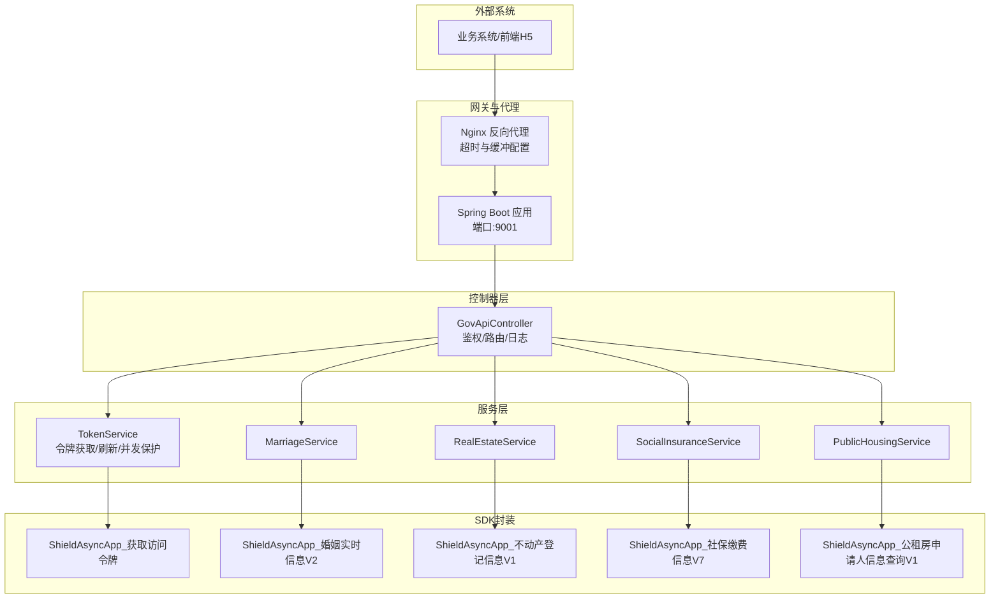
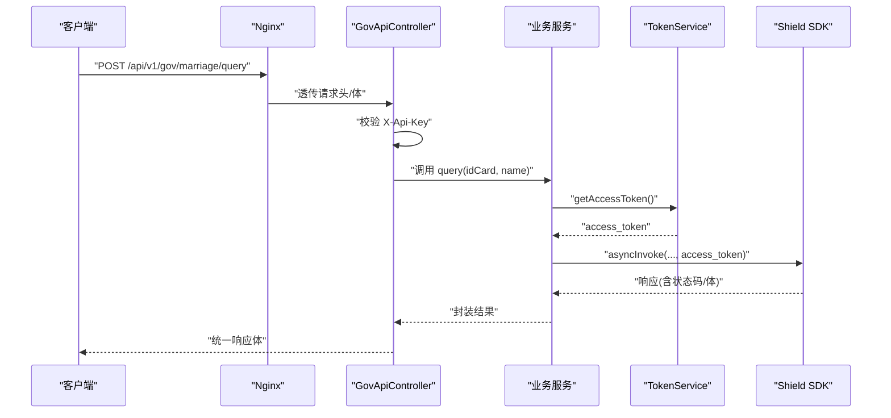
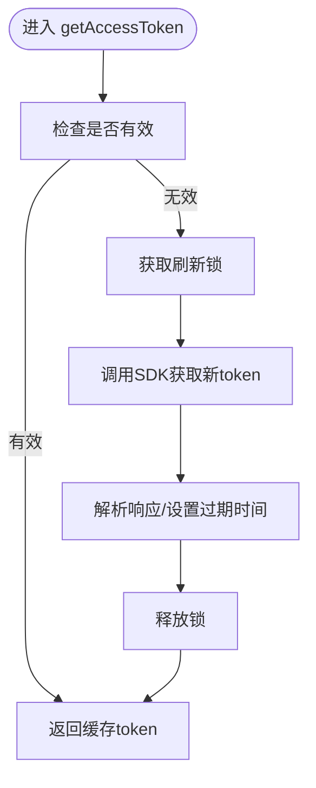
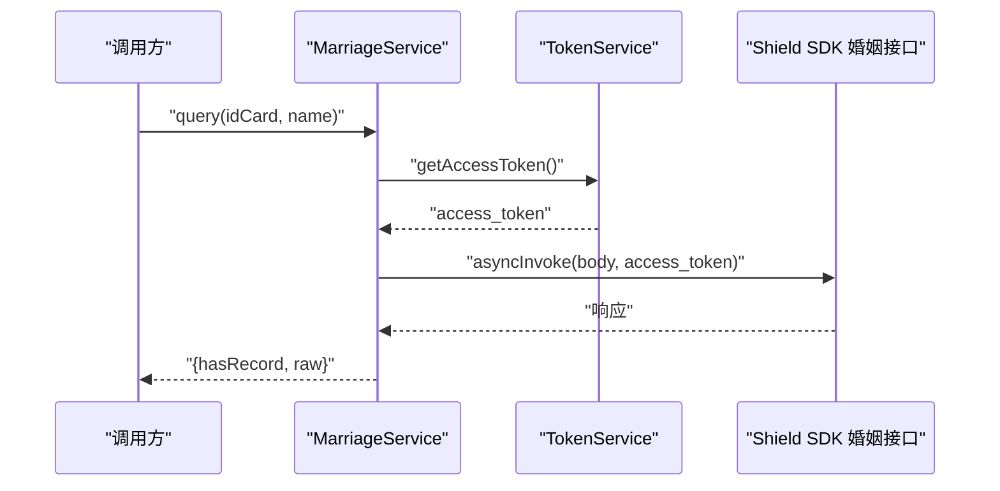
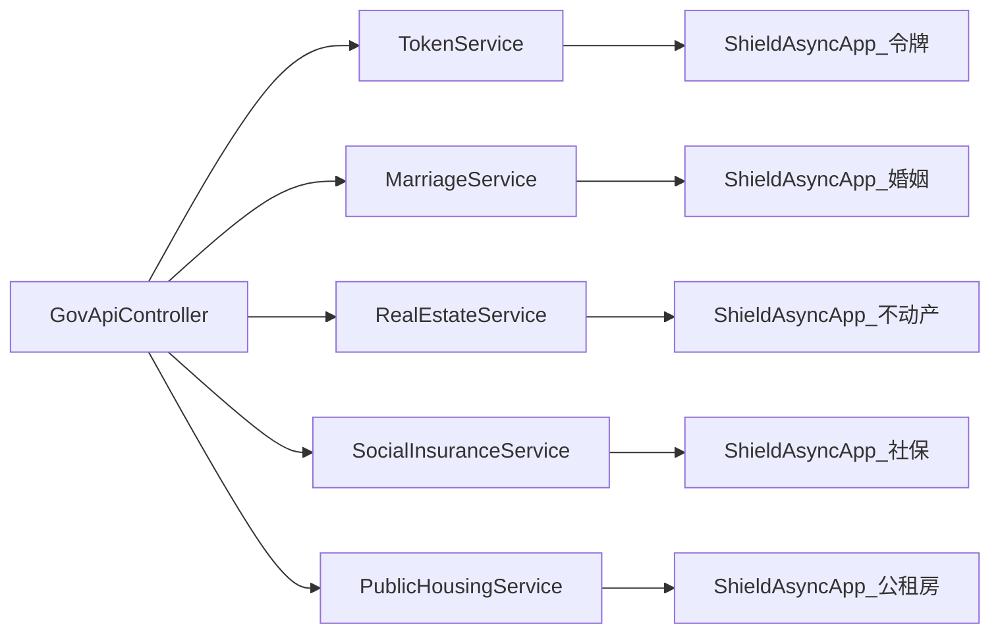

# SDK接口类型详解

<cite>
**本文引用的文件**
- [GovProxyApplication.java](file://ghz-gov-proxy/src/main/java/com/ghz/gov/GovProxyApplication.java)
- [GovApiController.java](file://ghz-gov-proxy/src/main/java/com/ghz/gov/controller/GovApiController.java)
- [ApiResponse.java](file://ghz-gov-proxy/src/main/java/com/ghz/gov/dto/ApiResponse.java)
- [GovProxyConfig.java](file://ghz-gov-proxy/src/main/java/com/ghz/gov/config/GovProxyConfig.java)
- [TokenService.java](file://ghz-gov-proxy/src/main/java/com/ghz/gov/service/TokenService.java)
- [MarriageService.java](file://ghz-gov-proxy/src/main/java/com/ghz/gov/service/MarriageService.java)
- [SocialInsuranceService.java](file://ghz-gov-proxy/src/main/java/com/ghz/gov/service/SocialInsuranceService.java)
- [PublicHousingService.java](file://ghz-gov-proxy/src/main/java/com/ghz/gov/service/PublicHousingService.java)
- [RealEstateService.java](file://ghz-gov-proxy/src/main/java/com/ghz/gov/service/RealEstateService.java)
- [ShieldAsyncApp_获取访问令牌_87BD3A66EA7749EC970C966E3DAAEE41.java](file://jiekou-sdk/java/RELEASE/ShieldAsyncApp_获取访问令牌_87BD3A66EA7749EC970C966E3DAAEE41.java)
- [ShieldAsyncApp_授权_省民政_婚姻实时信息V2接口_67E20E7BE2B14F8CB716D965D5ECF0FA.java](file://jiekou-sdk/java-2/RELEASE/ShieldAsyncApp_授权_省民政_婚姻实时信息V2接口_67E20E7BE2B14F8CB716D965D5ECF0FA.java)
- [ShieldAsyncApp_授权_不动产登记信息V1_4D90543CC15F4933A0614AE2B9B2935B.java](file://jiekou-sdk/java-3/RELEASE/ShieldAsyncApp_授权_不动产登记信息V1_4D90543CC15F4933A0614AE2B9B2935B.java)
- [ShieldAsyncApp_授权省人社_参保单位社会保险缴费信息V7_548E6780B5974C92B3CE92274AC14375.java](file://jiekou-sdk/java-4/RELEASE/ShieldAsyncApp_授权省人社_参保单位社会保险缴费信息V7_548E6780B5974C92B3CE92274AC14375.java)
- [ShieldAsyncApp_公租房申请人信息查询V1_12842C37F2F542E18E76279B0DCD3415.java](file://jiekou-sdk/java-5/RELEASE/ShieldAsyncApp_公租房申请人信息查询V1_12842C37F2F542E18E76279B0DCD3415.java)
- [application.yml](file://ghz-gov-proxy/src/main/resources/application.yml)
- [nginx-ghz-gov-proxy.conf](file://ghz-gov-proxy/deploy/nginx-ghz-gov-proxy.conf)
- [GetOAuthTokenTest.java](file://Demo/后端Demo/szzz-open-gateway-demo/szzz-open-gateway-demo/src/main/java/com/digital/cnzz/gateway/demo/application/GetOAuthTokenTest.java)
- [userAuth.html](file://Demo/前端Demo/userAuth.html)
</cite>

## 目录
1. [引言](#引言)
2. [项目结构](#项目结构)
3. [核心组件](#核心组件)
4. [架构总览](#架构总览)
5. [详细组件分析](#详细组件分析)
6. [依赖分析](#依赖分析)
7. [性能考量](#性能考量)
8. [故障排查指南](#故障排查指南)
9. [结论](#结论)
10. [附录](#附录)

## 引言
本文件面向需要集成政务接口的开发者与运维人员，系统化梳理并讲解SDK接口类型在本项目中的实现方式与工程实践。重点覆盖以下业务领域：
- 获取访问令牌（OAuth2）
- 婚姻实时信息
- 不动产登记
- 社保缴费信息
- 公租房申请

内容涵盖：业务场景与数据结构、调用频率与限流策略、参数定义与验证规则、返回值格式与错误码、异常处理机制、使用示例与集成步骤、版本管理与兼容性策略、性能优化与安全防护、监控告警与运维建议。

## 项目结构
本项目采用Spring Boot微服务架构，围绕“代理控制器 + 业务服务 + SDK封装”的分层组织：
- 控制器层：统一对外暴露RESTful接口，负责鉴权与参数校验
- 服务层：封装各政务接口的调用逻辑，内置重试与日志
- SDK层：基于飞桨Shield SDK生成的Java封装类，屏蔽底层通信细节
- 配置层：集中管理API Key与日志级别
- 部署层：Nginx反向代理配置，透传请求头与设置超时

图表来源
- [GovProxyApplication.java:1-15](file://ghz-gov-proxy/src/main/java/com/ghz/gov/GovProxyApplication.java#L1-L15)
- [GovApiController.java:18-149](file://ghz-gov-proxy/src/main/java/com/ghz/gov/controller/GovApiController.java#L18-L149)
- [TokenService.java:21-170](file://ghz-gov-proxy/src/main/java/com/ghz/gov/service/TokenService.java#L21-L170)
- [MarriageService.java:20-98](file://ghz-gov-proxy/src/main/java/com/ghz/gov/service/MarriageService.java#L20-L98)
- [RealEstateService.java:20-97](file://ghz-gov-proxy/src/main/java/com/ghz/gov/service/RealEstateService.java#L20-L97)
- [SocialInsuranceService.java:22-110](file://ghz-gov-proxy/src/main/java/com/ghz/gov/service/SocialInsuranceService.java#L22-L110)
- [PublicHousingService.java:20-97](file://ghz-gov-proxy/src/main/java/com/ghz/gov/service/PublicHousingService.java#L20-L97)
- [ShieldAsyncApp_获取访问令牌_87BD3A66EA7749EC970C966E3DAAEE41.java:14-79](file://jiekou-sdk/java/RELEASE/ShieldAsyncApp_获取访问令牌_87BD3A66EA7749EC970C966E3DAAEE41.java#L14-L79)
- [ShieldAsyncApp_授权_省民政_婚姻实时信息V2接口_67E20E7BE2B14F8CB716D965D5ECF0FA.java:14-75](file://jiekou-sdk/java-2/RELEASE/ShieldAsyncApp_授权_省民政_婚姻实时信息V2接口_67E20E7BE2B14F8CB716D965D5ECF0FA.java#L14-L75)
- [ShieldAsyncApp_授权_不动产登记信息V1_4D90543CC15F4933A0614AE2B9B2935B.java:14-75](file://jiekou-sdk/java-3/RELEASE/ShieldAsyncApp_授权_不动产登记信息V1_4D90543CC15F4933A0614AE2B9B2935B.java#L14-L75)
- [ShieldAsyncApp_授权省人社_参保单位社会保险缴费信息V7_548E6780B5974C92B3CE92274AC14375.java:14-75](file://jiekou-sdk/java-4/RELEASE/ShieldAsyncApp_授权省人社_参保单位社会保险缴费信息V7_548E6780B5974C92B3CE92274AC14375.java#L14-L75)
- [ShieldAsyncApp_公租房申请人信息查询V1_12842C37F2F542E18E76279B0DCD3415.java:14-75](file://jiekou-sdk/java-5/RELEASE/ShieldAsyncApp_公租房申请人信息查询V1_12842C37F2F542E18E76279B0DCD3415.java#L14-L75)

章节来源
- [application.yml:1-13](file://ghz-gov-proxy/src/main/resources/application.yml#L1-L13)
- [nginx-ghz-gov-proxy.conf:7-45](file://ghz-gov-proxy/deploy/nginx-ghz-gov-proxy.conf#L7-L45)

## 核心组件
- 统一响应模型：统一返回结构，包含状态码、消息与数据体，便于前端与下游系统解析
- 配置中心：集中管理API Key与日志级别
- 令牌服务：懒加载+定时刷新+并发保护，避免多实例/多线程同时刷新
- 业务服务：封装各接口请求体构造、重试策略、结果解析与日志记录
- SDK封装：屏蔽HTTP通信、签名与加密细节，提供同步/异步调用入口

章节来源
- [ApiResponse.java:6-34](file://ghz-gov-proxy/src/main/java/com/ghz/gov/dto/ApiResponse.java#L6-L34)
- [GovProxyConfig.java:8-16](file://ghz-gov-proxy/src/main/java/com/ghz/gov/config/GovProxyConfig.java#L8-L16)
- [TokenService.java:22-170](file://ghz-gov-proxy/src/main/java/com/ghz/gov/service/TokenService.java#L22-L170)
- [MarriageService.java:20-98](file://ghz-gov-proxy/src/main/java/com/ghz/gov/service/MarriageService.java#L20-L98)
- [RealEstateService.java:20-97](file://ghz-gov-proxy/src/main/java/com/ghz/gov/service/RealEstateService.java#L20-L97)
- [SocialInsuranceService.java:22-110](file://ghz-gov-proxy/src/main/java/com/ghz/gov/service/SocialInsuranceService.java#L22-L110)
- [PublicHousingService.java:20-97](file://ghz-gov-proxy/src/main/java/com/ghz/gov/service/PublicHousingService.java#L20-L97)

## 架构总览
整体调用链路从Nginx反向代理进入Spring Boot应用，经控制器鉴权后路由至对应业务服务，业务服务通过TokenService获取或刷新access_token，再调用SDK封装类访问政务接口，最终将统一格式的响应返回客户端。

图表来源
- [GovApiController.java:48-66](file://ghz-gov-proxy/src/main/java/com/ghz/gov/controller/GovApiController.java#L48-L66)
- [MarriageService.java:36-91](file://ghz-gov-proxy/src/main/java/com/ghz/gov/service/MarriageService.java#L36-L91)
- [TokenService.java:42-53](file://ghz-gov-proxy/src/main/java/com/ghz/gov/service/TokenService.java#L42-L53)
- [ShieldAsyncApp_授权_省民政_婚姻实时信息V2接口_67E20E7BE2B14F8CB716D965D5ECF0FA.java:66-73](file://jiekou-sdk/java-2/RELEASE/ShieldAsyncApp_授权_省民政_婚姻实时信息V2接口_67E20E7BE2B14F8CB716D965D5ECF0FA.java#L66-L73)

## 详细组件分析

### 获取访问令牌（OAuth2）
- 业务场景：政务平台OAuth2客户端凭据模式获取access_token，有效期约30分钟，定时刷新以规避过期
- 参数定义与验证：
  - grant_type：固定为client_credentials
  - client_id/client_secret：由政务平台提供，用于身份认证
- 返回值与错误处理：
  - 成功：提取custom.access_token，计算过期时间
  - 失败：解析status.code/text或body，抛出运行时异常
- 重试与并发：
  - 懒加载：若未过期则直接返回
  - 并发保护：刷新期间加锁，避免重复刷新
  - 定时刷新：每25分钟执行一次，留5分钟余量
- 使用示例与集成：
  - 在业务服务中通过TokenService.getAccessToken()获取令牌
  - 将access_token作为查询类接口的URL参数传递

图表来源
- [TokenService.java:42-119](file://ghz-gov-proxy/src/main/java/com/ghz/gov/service/TokenService.java#L42-L119)
- [ShieldAsyncApp_获取访问令牌_87BD3A66EA7749EC970C966E3DAAEE41.java:66-77](file://jiekou-sdk/java/RELEASE/ShieldAsyncApp_获取访问令牌_87BD3A66EA7749EC970C966E3DAAEE41.java#L66-L77)

章节来源
- [TokenService.java:22-170](file://ghz-gov-proxy/src/main/java/com/ghz/gov/service/TokenService.java#L22-L170)
- [application.yml:5-8](file://ghz-gov-proxy/src/main/resources/application.yml#L5-L8)
- [nginx-ghz-gov-proxy.conf:32-34](file://ghz-gov-proxy/deploy/nginx-ghz-gov-proxy.conf#L32-L34)

### 婚姻实时信息
- 业务场景：查询个人婚姻登记状态，支持“未婚”等状态判断
- 请求参数：
  - idCard：身份证号
  - name：姓名
- 请求体构造与调用：
  - 组装JSON：{"sfzh": "...", "xm": "..."}
  - 通过ShieldAsyncApp_授权_省民政_婚姻实时信息V2接口调用
- 结果解析：
  - 读取data列表或total计数，判定是否存在记录
  - 返回字段：hasRecord（布尔）、raw（原始响应）
- 重试策略：
  - 针对特定超时错误码进行最多3次重试

图表来源
- [MarriageService.java:36-91](file://ghz-gov-proxy/src/main/java/com/ghz/gov/service/MarriageService.java#L36-L91)
- [ShieldAsyncApp_授权_省民政_婚姻实时信息V2接口_67E20E7BE2B14F8CB716D965D5ECF0FA.java:66-73](file://jiekou-sdk/java-2/RELEASE/ShieldAsyncApp_授权_省民政_婚姻实时信息V2接口_67E20E7BE2B14F8CB716D965D5ECF0FA.java#L66-L73)

章节来源
- [GovApiController.java:48-66](file://ghz-gov-proxy/src/main/java/com/ghz/gov/controller/GovApiController.java#L48-L66)
- [MarriageService.java:20-98](file://ghz-gov-proxy/src/main/java/com/ghz/gov/service/MarriageService.java#L20-L98)

### 不动产登记
- 业务场景：查询个人不动产登记信息
- 请求参数：
  - personCertNo：身份证号
  - personName：姓名
- 请求体构造与调用：
  - 组装JSON：{"personCertNo": "...", "personName": "..."}
  - 通过ShieldAsyncApp_授权_不动产登记信息V1调用
- 结果解析：
  - 读取data列表或total计数，判定是否存在记录
  - 返回字段：hasRecord（布尔）、raw（原始响应）

章节来源
- [RealEstateService.java:35-90](file://ghz-gov-proxy/src/main/java/com/ghz/gov/service/RealEstateService.java#L35-L90)
- [ShieldAsyncApp_授权_不动产登记信息V1_4D90543CC15F4933A0614AE2B9B2935B.java:66-73](file://jiekou-sdk/java-3/RELEASE/ShieldAsyncApp_授权_不动产登记信息V1_4D90543CC15F4933A0614AE2B9B2935B.java#L66-L73)

### 社保缴费信息
- 业务场景：查询个人近12个月的社保缴费记录
- 请求参数：
  - AAC002：身份证号
  - AAC003：姓名
  - STARTDATE/ENDDATE：起止月份（YYYYMM），默认近12个月
- 请求体构造与调用：
  - 组装JSON并设置时间范围
  - 通过ShieldAsyncApp_授权省人社_参保单位社会保险缴费信息V7调用
- 结果解析：
  - 读取data列表或total计数，判定是否存在记录
  - 返回字段：hasRecord（布尔）、records（可选）、raw（原始响应）

章节来源
- [SocialInsuranceService.java:38-103](file://ghz-gov-proxy/src/main/java/com/ghz/gov/service/SocialInsuranceService.java#L38-L103)
- [ShieldAsyncApp_授权省人社_参保单位社会保险缴费信息V7_548E6780B5974C92B3CE92274AC14375.java:66-73](file://jiekou-sdk/java-4/RELEASE/ShieldAsyncApp_授权省人社_参保单位社会保险缴费信息V7_548E6780B5974C92B3CE92274AC14375.java#L66-L73)

### 公租房申请
- 业务场景：查询个人公租房申请人信息
- 请求参数：
  - card_num：身份证号
  - name：姓名
- 请求体构造与调用：
  - 组装JSON：{"card_num": "...", "name": "..."}
  - 通过ShieldAsyncApp_公租房申请人信息查询V1调用
- 结果解析：
  - 读取data列表或total计数，判定是否存在记录
  - 返回字段：hasRecord（布尔）、raw（原始响应）

章节来源
- [PublicHousingService.java:35-90](file://ghz-gov-proxy/src/main/java/com/ghz/gov/service/PublicHousingService.java#L35-L90)
- [ShieldAsyncApp_公租房申请人信息查询V1_12842C37F2F542E18E76279B0DCD3415.java:66-73](file://jiekou-sdk/java-5/RELEASE/ShieldAsyncApp_公租房申请人信息查询V1_12842C37F2F542E18E76279B0DCD3415.java#L66-L73)

## 依赖分析
- 控制器依赖服务层；服务层依赖TokenService与Shield SDK封装类
- 配置类提供API Key与日志级别
- Nginx负责反向代理、超时与缓冲配置

图表来源
- [GovApiController.java:24-35](file://ghz-gov-proxy/src/main/java/com/ghz/gov/controller/GovApiController.java#L24-L35)
- [TokenService.java:31](file://ghz-gov-proxy/src/main/java/com/ghz/gov/service/TokenService.java#L31)
- [MarriageService.java:28](file://ghz-gov-proxy/src/main/java/com/ghz/gov/service/MarriageService.java#L28)
- [RealEstateService.java:28](file://ghz-gov-proxy/src/main/java/com/ghz/gov/service/RealEstateService.java#L28)
- [SocialInsuranceService.java:30](file://ghz-gov-proxy/src/main/java/com/ghz/gov/service/SocialInsuranceService.java#L30)
- [PublicHousingService.java:28](file://ghz-gov-proxy/src/main/java/com/ghz/gov/service/PublicHousingService.java#L28)

章节来源
- [GovProxyApplication.java:1-15](file://ghz-gov-proxy/src/main/java/com/ghz/gov/GovProxyApplication.java#L1-L15)
- [application.yml:1-13](file://ghz-gov-proxy/src/main/resources/application.yml#L1-L13)

## 性能考量
- 超时与缓冲
  - Nginx设置较长读取超时以适配政务接口最慢响应时间
  - 关闭代理缓冲，确保实时性
- 令牌缓存与刷新
  - 懒加载+并发锁+定时刷新，降低频繁获取令牌带来的抖动
- 重试策略
  - 针对特定超时错误码进行有限次数重试，提升成功率
- 日志与监控
  - 统一响应模型便于埋点与观测
  - 建议结合业务指标（成功率、耗时、错误码分布）完善监控告警

章节来源
- [nginx-ghz-gov-proxy.conf:30-38](file://ghz-gov-proxy/deploy/nginx-ghz-gov-proxy.conf#L30-L38)
- [TokenService.java:42-134](file://ghz-gov-proxy/src/main/java/com/ghz/gov/service/TokenService.java#L42-L134)
- [MarriageService.java:46-96](file://ghz-gov-proxy/src/main/java/com/ghz/gov/service/MarriageService.java#L46-L96)
- [RealEstateService.java:45-95](file://ghz-gov-proxy/src/main/java/com/ghz/gov/service/RealEstateService.java#L45-L95)
- [SocialInsuranceService.java:54-108](file://ghz-gov-proxy/src/main/java/com/ghz/gov/service/SocialInsuranceService.java#L54-L108)
- [PublicHousingService.java:45-95](file://ghz-gov-proxy/src/main/java/com/ghz/gov/service/PublicHousingService.java#L45-L95)

## 故障排查指南
- 认证失败
  - 检查请求头X-Api-Key是否正确传递
  - 确认配置文件中的API Key与调用端一致
- 令牌获取异常
  - 查看令牌服务日志，确认响应状态码与自定义字段
  - 核对client_id/client_secret与政务平台配置
- 接口调用失败
  - 检查响应体与状态码，定位具体错误
  - 观察是否触发重试逻辑与错误码匹配
- 超时问题
  - 检查Nginx超时配置与网络连通性
  - 评估上游接口性能，必要时调整重试策略

章节来源
- [GovApiController.java:139-147](file://ghz-gov-proxy/src/main/java/com/ghz/gov/controller/GovApiController.java#L139-L147)
- [TokenService.java:65-119](file://ghz-gov-proxy/src/main/java/com/ghz/gov/service/TokenService.java#L65-L119)
- [MarriageService.java:65-91](file://ghz-gov-proxy/src/main/java/com/ghz/gov/service/MarriageService.java#L65-L91)
- [RealEstateService.java:64-90](file://ghz-gov-proxy/src/main/java/com/ghz/gov/service/RealEstateService.java#L64-L90)
- [SocialInsuranceService.java:73-103](file://ghz-gov-proxy/src/main/java/com/ghz/gov/service/SocialInsuranceService.java#L73-L103)
- [PublicHousingService.java:64-90](file://ghz-gov-proxy/src/main/java/com/ghz/gov/service/PublicHousingService.java#L64-L90)
- [nginx-ghz-gov-proxy.conf:32-34](file://ghz-gov-proxy/deploy/nginx-ghz-gov-proxy.conf#L32-L34)

## 结论
本项目通过清晰的分层设计与标准化的SDK封装，实现了对多类政务接口的统一接入与治理。配合令牌缓存与定时刷新、请求重试与日志监控，能够在保证稳定性的同时满足政务接口的高可用要求。建议在生产环境中进一步完善版本管理、灰度发布与安全审计机制。

## 附录

### 接口参数与返回规范

- 通用请求头
  - X-Api-Key：业务系统调用时必须提供
- 通用响应体
  - code：状态码（200表示成功）
  - message：描述信息
  - data：业务数据

章节来源
- [GovApiController.java:139-147](file://ghz-gov-proxy/src/main/java/com/ghz/gov/controller/GovApiController.java#L139-L147)
- [ApiResponse.java:6-34](file://ghz-gov-proxy/src/main/java/com/ghz/gov/dto/ApiResponse.java#L6-L34)

### 集成步骤与示例

- 获取访问令牌
  - 通过ShieldAsyncApp_获取访问令牌接口，使用client_credentials模式
  - 在业务服务中调用TokenService.getAccessToken()获取并缓存
- 调用婚姻/不动产/社保/公租房接口
  - 组装请求体字段，调用对应Shield SDK封装类
  - 将access_token作为查询参数传递
- 前端授权与网关对接（参考Demo）
  - 前端H5通过JSBridge发起授权，获取授权码
  - 后端通过Open Gateway SDK换取OAuth Token

章节来源
- [ShieldAsyncApp_获取访问令牌_87BD3A66EA7749EC970C966E3DAAEE41.java:66-77](file://jiekou-sdk/java/RELEASE/ShieldAsyncApp_获取访问令牌_87BD3A66EA7749EC970C966E3DAAEE41.java#L66-L77)
- [ShieldAsyncApp_授权_省民政_婚姻实时信息V2接口_67E20E7BE2B14F8CB716D965D5ECF0FA.java:66-73](file://jiekou-sdk/java-2/RELEASE/ShieldAsyncApp_授权_省民政_婚姻实时信息V2接口_67E20E7BE2B14F8CB716D965D5ECF0FA.java#L66-L73)
- [GetOAuthTokenTest.java:23-66](file://Demo/后端Demo/szzz-open-gateway-demo/szzz-open-gateway-demo/src/main/java/com/digital/cnzz/gateway/demo/application/GetOAuthTokenTest.java#L23-L66)
- [userAuth.html:22-40](file://Demo/前端Demo/userAuth.html#L22-L40)

### 版本管理与兼容性
- SDK版本标识：每个Shield封装类包含版本注释，便于追踪接口版本
- 升级策略：建议先在测试环境验证SDK变更，再灰度到生产
- 兼容性：保持请求体字段命名与时间格式一致，避免上游接口变更导致失败

章节来源
- [ShieldAsyncApp_授权_省民政_婚姻实时信息V2接口_67E20E7BE2B14F8CB716D965D5ECF0FA.java:63-64](file://jiekou-sdk/java-2/RELEASE/ShieldAsyncApp_授权_省民政_婚姻实时信息V2接口_67E20E7BE2B14F8CB716D965D5ECF0FA.java#L63-L64)
- [ShieldAsyncApp_授权_不动产登记信息V1_4D90543CC15F4933A0614AE2B9B2935B.java:63-64](file://jiekou-sdk/java-3/RELEASE/ShieldAsyncApp_授权_不动产登记信息V1_4D90543CC15F4933A0614AE2B9B2935B.java#L63-L64)
- [ShieldAsyncApp_授权省人社_参保单位社会保险缴费信息V7_548E6780B5974C92B3CE92274AC14375.java:63-64](file://jiekou-sdk/java-4/RELEASE/ShieldAsyncApp_授权省人社_参保单位社会保险缴费信息V7_548E6780B5974C92B3CE92274AC14375.java#L63-L64)
- [ShieldAsyncApp_公租房申请人信息查询V1_12842C37F2F542E18E76279B0DCD3415.java:63-64](file://jiekou-sdk/java-5/RELEASE/ShieldAsyncApp_公租房申请人信息查询V1_12842C37F2F542E18E76279B0DCD3415.java#L63-L64)