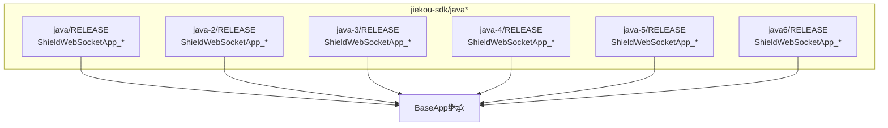
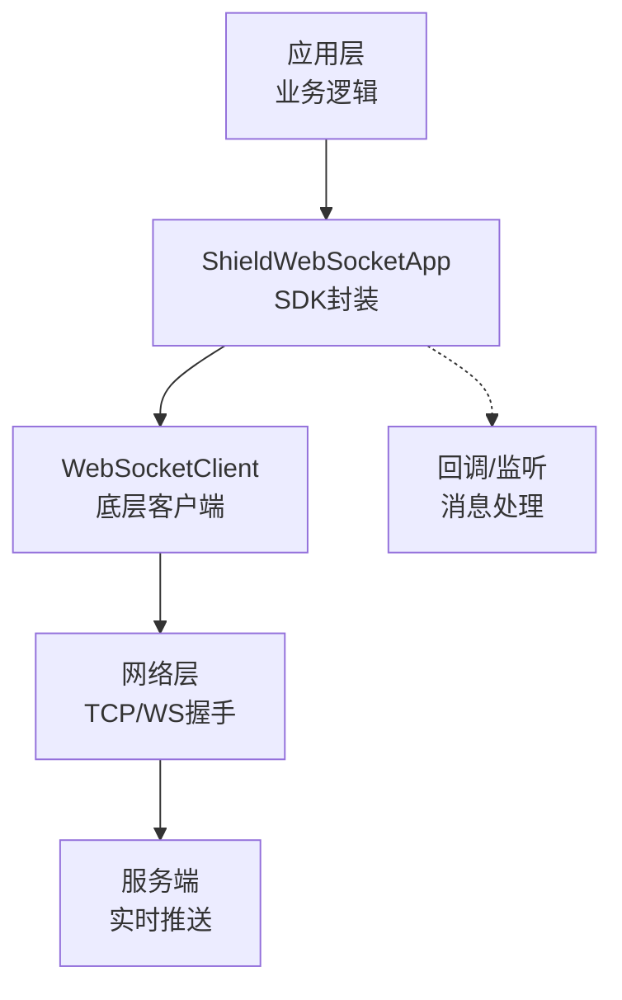
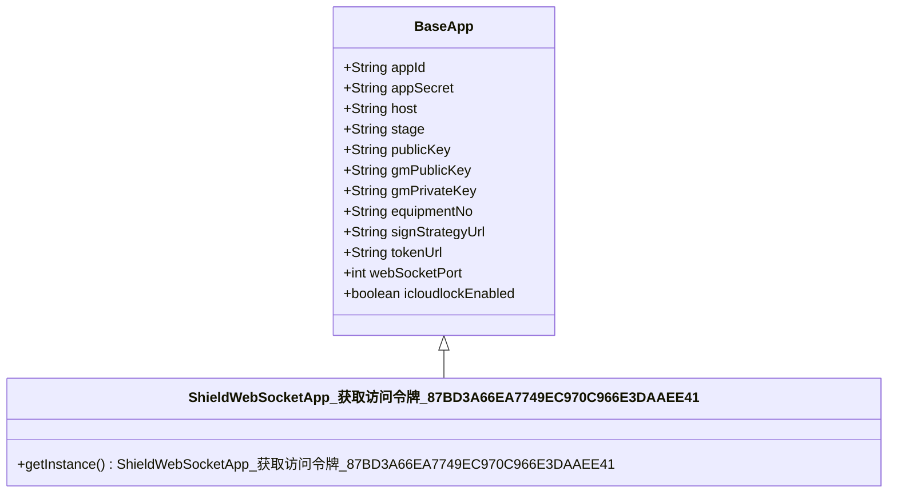
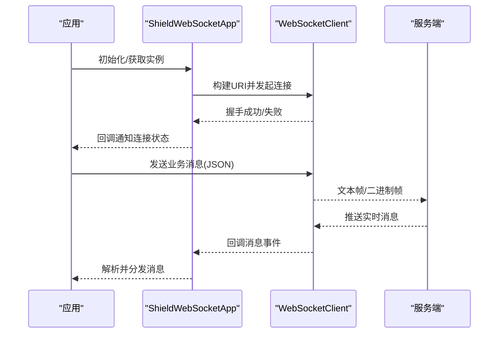
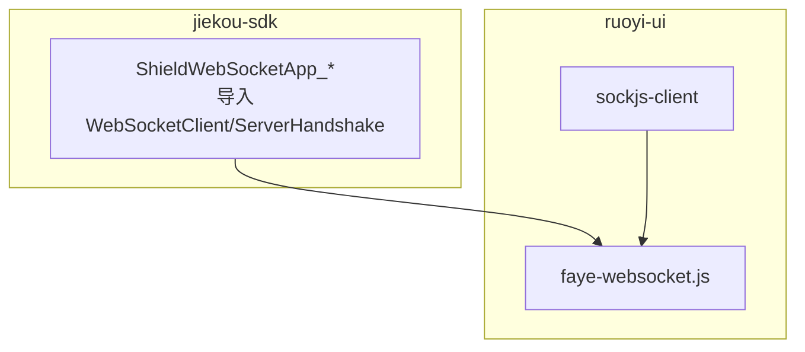

# WebSocket SDK设计

<cite>
**本文引用的文件**
- [ShieldWebSocketApp_获取访问令牌_87BD3A66EA7749EC970C966E3DAAEE41.java](file://jiekou-sdk/java/RELEASE/ShieldWebSocketApp_获取访问令牌_87BD3A66EA7749EC970C966E3DAAEE41.java)
- [ShieldWebSocketApp_授权_省民政_婚姻实时信息V2接口_67E20E7BE2B14F8CB716D965D5ECF0FA.java](file://jiekou-sdk/java-2/RELEASE/ShieldWebSocketApp_授权_省民政_婚姻实时信息V2接口_67E20E7BE2B14F8CB716D965D5ECF0FA.java)
- [ShieldWebSocketApp_授权_不动产登记信息V1_4D90543CC15F4933A0614AE2B9B2935B.java](file://jiekou-sdk/java-3/RELEASE/ShieldWebSocketApp_授权_不动产登记信息V1_4D90543CC15F4933A0614AE2B9B2935B.java)
- [ShieldWebSocketApp_授权省人社_参保单位社会保险缴费信息V7_548E6780B5974C92B3CE92274AC14375.java](file://jiekou-sdk/java-4/RELEASE/ShieldWebSocketApp_授权省人社_参保单位社会保险缴费信息V7_548E6780B5974C92B3CE92274AC14375.java)
- [ShieldWebSocketApp_公租房申请人信息查询V1_12842C37F2F542E18E76279B0DCD3415.java](file://jiekou-sdk/java-5/RELEASE/ShieldWebSocketApp_公租房申请人信息查询V1_12842C37F2F542E18E76279B0DCD3415.java)
- [ShieldWebSocketApp_省人社参保人员社会保险缴费信息v7_D411ED5DBBF14AB1BE46CE5AE152131E.java](file://jiekou-sdk/java6/RELEASE/ShieldWebSocketApp_省人社参保人员社会保险缴费信息v7_D411ED5DBBF14AB1BE46CE5AE152131E.java)
- [faye-websocket.js](file://ruoyi-ui/node_modules/faye-websocket/lib/faye/websocket.js)
- [README.md（faye-websocket）](file://ruoyi-ui/node_modules/faye-websocket/README.md)
- [package-lock.json（sockjs-client）](file://ruoyi-ui/package-lock.json)
</cite>

## 目录
1. [引言](#引言)
2. [项目结构](#项目结构)
3. [核心组件](#核心组件)
4. [架构总览](#架构总览)
5. [组件详解](#组件详解)
6. [依赖关系分析](#依赖关系分析)
7. [性能考量](#性能考量)
8. [故障排查指南](#故障排查指南)
9. [结论](#结论)
10. [附录](#附录)

## 引言
本文件面向需要在Java应用中集成WebSocket实时通信能力的开发者，系统化梳理ShieldWebSocketApp系列SDK的设计与实现要点。通过对多个接口适配器类的共性分析，结合底层WebSocket客户端库的使用方式，给出连接管理、消息编解码、心跳机制、断线重连、性能优化与运维监控等方面的实践建议。同时对比HTTP同步/异步调用模式，帮助读者在不同业务场景下做出合理的技术选型。

## 项目结构
ShieldWebSocketApp位于“jiekou-sdk”模块下的多套接口适配器中，每套适配器均以“ShieldWebSocketApp_接口名称”的命名方式呈现，继承自统一的BaseApp基类，并通过构造函数注入应用标识、密钥、主机地址、端口、签名策略与令牌获取路径等参数。该结构体现了“按接口维度生成SDK”的工程化策略，便于在不同业务场景下快速替换配置并接入对应的WebSocket服务端。

图表来源
- [ShieldWebSocketApp_获取访问令牌_87BD3A66EA7749EC970C966E3DAAEE41.java:10-32](file://jiekou-sdk/java/RELEASE/ShieldWebSocketApp_获取访问令牌_87BD3A66EA7749EC970C966E3DAAEE41.java#L10-L32)
- [ShieldWebSocketApp_授权_省民政_婚姻实时信息V2接口_67E20E7BE2B14F8CB716D965D5ECF0FA.java:10-32](file://jiekou-sdk/java-2/RELEASE/ShieldWebSocketApp_授权_省民政_婚姻实时信息V2接口_67E20E7BE2B14F8CB716D965D5ECF0FA.java#L10-L32)
- [ShieldWebSocketApp_授权_不动产登记信息V1_4D90543CC15F4933A0614AE2B9B2935B.java:10-32](file://jiekou-sdk/java-3/RELEASE/ShieldWebSocketApp_授权_不动产登记信息V1_4D90543CC15F4933A0614AE2B9B2935B.java#L10-L32)
- [ShieldWebSocketApp_授权省人社_参保单位社会保险缴费信息V7_548E6780B5974C92B3CE92274AC14375.java:10-32](file://jiekou-sdk/java-4/RELEASE/ShieldWebSocketApp_授权省人社_参保单位社会保险缴费信息V7_548E6780B5974C92B3CE92274AC14375.java#L10-L32)
- [ShieldWebSocketApp_公租房申请人信息查询V1_12842C37F2F542E18E76279B0DCD3415.java:10-32](file://jiekou-sdk/java-5/RELEASE/ShieldWebSocketApp_公租房申请人信息查询V1_12842C37F2F542E18E76279B0DCD3415.java#L10-L32)
- [ShieldWebSocketApp_省人社参保人员社会保险缴费信息v7_D411ED5DBBF14AB1BE46CE5AE152131E.java:10-32](file://jiekou-sdk/java6/RELEASE/ShieldWebSocketApp_省人社参保人员社会保险缴费信息v7_D411ED5DBBF14AB1BE46CE5AE152131E.java#L10-L32)

章节来源
- [ShieldWebSocketApp_获取访问令牌_87BD3A66EA7749EC970C966E3DAAEE41.java:1-47](file://jiekou-sdk/java/RELEASE/ShieldWebSocketApp_获取访问令牌_87BD3A66EA7749EC970C966E3DAAEE41.java#L1-L47)
- [ShieldWebSocketApp_授权_省民政_婚姻实时信息V2接口_67E20E7BE2B14F8CB716D965D5ECF0FA.java:1-10](file://jiekou-sdk/java-2/RELEASE/ShieldWebSocketApp_授权_省民政_婚姻实时信息V2接口_67E20E7BE2B14F8CB716D965D5ECF0FA.java#L1-L10)
- [ShieldWebSocketApp_授权_不动产登记信息V1_4D90543CC15F4933A0614AE2B9B2935B.java:1-10](file://jiekou-sdk/java-3/RELEASE/ShieldWebSocketApp_授权_不动产登记信息V1_4D90543CC15F4933A0614AE2B9B2935B.java#L1-L10)
- [ShieldWebSocketApp_授权省人社_参保单位社会保险缴费信息V7_548E6780B5974C92B3CE92274AC14375.java:1-10](file://jiekou-sdk/java-4/RELEASE/ShieldWebSocketApp_授权省人社_参保单位社会保险缴费信息V7_548E6780B5974C92B3CE92274AC14375.java#L1-L10)
- [ShieldWebSocketApp_公租房申请人信息查询V1_12842C37F2F542E18E76279B0DCD3415.java:1-10](file://jiekou-sdk/java-5/RELEASE/ShieldWebSocketApp_公租房申请人信息查询V1_12842C37F2F542E18E76279B0DCD3415.java#L1-L10)
- [ShieldWebSocketApp_省人社参保人员社会保险缴费信息v7_D411ED5DBBF14AB1BE46CE5AE152131E.java:1-10](file://jiekou-sdk/java6/RELEASE/ShieldWebSocketApp_省人社参保人员社会保险缴费信息v7_D411ED5DBBF14AB1BE46CE5AE152131E.java#L1-L10)

## 核心组件
- ShieldWebSocketApp系列类：每个接口适配器均继承自BaseApp，负责初始化应用级参数（如appId、appSecret、host、port、tokenUrl、signStrategyUrl等），并通过静态工厂方法提供单例实例，确保全局唯一且线程安全。
- 底层WebSocket客户端：通过org.java_websocket.client.WebSocketClient进行连接建立、消息收发与事件回调处理；同时引入ServerHandshake用于握手阶段的数据校验。
- 消息编解码：采用JSON作为默认消息载体，便于跨语言互通与服务端解析。
- 连接与会话：通过构造URI并传入主机、端口与路径，完成WebSocket握手与会话建立。
- 断线与重连：通过单例模式与外部重连策略配合，实现连接异常后的恢复尝试。
- 心跳与保活：在实际业务中通常通过周期性发送ping/pong或业务心跳包维持长连接活跃度。

章节来源
- [ShieldWebSocketApp_获取访问令牌_87BD3A66EA7749EC970C966E3DAAEE41.java:10-47](file://jiekou-sdk/java/RELEASE/ShieldWebSocketApp_获取访问令牌_87BD3A66EA7749EC970C966E3DAAEE41.java#L10-L47)
- [ShieldWebSocketApp_授权_省民政_婚姻实时信息V2接口_67E20E7BE2B14F8CB716D965D5ECF0FA.java:4-6](file://jiekou-sdk/java-2/RELEASE/ShieldWebSocketApp_授权_省民政_婚姻实时信息V2接口_67E20E7BE2B14F8CB716D965D5ECF0FA.java#L4-L6)
- [ShieldWebSocketApp_授权_不动产登记信息V1_4D90543CC15F4933A0614AE2B9B2935B.java:4-6](file://jiekou-sdk/java-3/RELEASE/ShieldWebSocketApp_授权_不动产登记信息V1_4D90543CC15F4933A0614AE2B9B2935B.java#L4-L6)
- [ShieldWebSocketApp_授权省人社_参保单位社会保险缴费信息V7_548E6780B5974C92B3CE92274AC14375.java:4-6](file://jiekou-sdk/java-4/RELEASE/ShieldWebSocketApp_授权省人社_参保单位社会保险缴费信息V7_548E6780B5974C92B3CE92274AC14375.java#L4-L6)
- [ShieldWebSocketApp_公租房申请人信息查询V1_12842C37F2F542E18E76279B0DCD3415.java:4-6](file://jiekou-sdk/java-5/RELEASE/ShieldWebSocketApp_公租房申请人信息查询V1_12842C37F2F542E18E76279B0DCD3415.java#L4-L6)
- [ShieldWebSocketApp_省人社参保人员社会保险缴费信息v7_D411ED5DBBF14AB1BE46CE5AE152131E.java:4-6](file://jiekou-sdk/java6/RELEASE/ShieldWebSocketApp_省人社参保人员社会保险缴费信息v7_D411ED5DBBF14AB1BE46CE5AE152131E.java#L4-L6)

## 架构总览
下图展示了ShieldWebSocketApp在整体系统中的位置与交互关系：应用通过SDK发起WebSocket连接，经由网络到达服务端；SDK负责消息编解码、心跳维护与断线重连；上层业务通过回调或监听机制接收实时数据。

图表来源
- [ShieldWebSocketApp_获取访问令牌_87BD3A66EA7749EC970C966E3DAAEE41.java:10-32](file://jiekou-sdk/java/RELEASE/ShieldWebSocketApp_获取访问令牌_87BD3A66EA7749EC970C966E3DAAEE41.java#L10-L32)
- [faye-websocket.js:43-43](file://ruoyi-ui/node_modules/faye-websocket/lib/faye/websocket.js#L43-L43)

## 组件详解

### 连接管理
- 单例模式：通过静态工厂方法提供全局唯一实例，避免重复初始化与资源浪费。
- 参数注入：在构造函数中设置appId、appSecret、host、stage、publicKey、gmPublicKey、gmPrivateKey、equipmentNo、signStrategyUrl、tokenUrl、webSocketPort、icloudlockEnabled等关键配置。
- URI构建：基于host、port与路径组合形成WebSocket连接地址，用于握手与会话建立。
- 握手校验：利用ServerHandshake在握手阶段进行数据校验，确保连接安全性。

图表来源
- [ShieldWebSocketApp_获取访问令牌_87BD3A66EA7749EC970C966E3DAAEE41.java:10-47](file://jiekou-sdk/java/RELEASE/ShieldWebSocketApp_获取访问令牌_87BD3A66EA7749EC970C966E3DAAEE41.java#L10-L47)

章节来源
- [ShieldWebSocketApp_获取访问令牌_87BD3A66EA7749EC970C966E3DAAEE41.java:10-47](file://jiekou-sdk/java/RELEASE/ShieldWebSocketApp_获取访问令牌_87BD3A66EA7749EC970C966E3DAAEE41.java#L10-L47)

### 消息编解码
- JSON编解码：SDK默认采用JSON作为消息载体，便于跨语言互通与服务端解析。
- 字段约定：通过BaseApp中的字段（如appId、appSecret、tokenUrl、signStrategyUrl等）参与请求参数与响应解析。
- 扩展性：若需支持二进制帧或多协议，可在上层业务中扩展编解码器。

章节来源
- [ShieldWebSocketApp_获取访问令牌_87BD3A66EA7749EC970C966E3DAAEE41.java:3-6](file://jiekou-sdk/java/RELEASE/ShieldWebSocketApp_获取访问令牌_87BD3A66EA7749EC970C966E3DAAEE41.java#L3-L6)

### 心跳机制
- 保活策略：在实际业务中通常通过周期性发送ping/pong或业务心跳包维持长连接活跃度。
- 触发时机：可结合业务空闲阈值与网络状况动态调整心跳频率。
- 失败处理：心跳超时应触发断线检测与重连流程。

（本节为通用实现建议，不直接对应具体源码）

### 双向通信与消息队列
- 双向通信：WebSocket支持全双工通信，客户端与服务端可同时发送与接收消息。
- 消息队列：在高并发场景下，可在SDK内部或业务层引入消息队列缓冲未处理事件，降低丢包风险并提升吞吐量。
- 顺序保障：通过序列号或时间戳确保消息有序处理。

（本节为通用实现建议，不直接对应具体源码）

### 断线重连
- 重连策略：指数退避、最大重试次数、抖动因子等参数可配置，避免雪崩效应。
- 触发条件：连接异常、心跳超时、服务端主动断开等情况触发重连。
- 状态恢复：重连成功后需重新鉴权与订阅主题，确保数据一致性。

（本节为通用实现建议，不直接对应具体源码）

### 协议实现细节与帧格式
- 握手阶段：遵循RFC 6455标准，使用ServerHandshake进行握手校验。
- 帧格式：支持文本帧与二进制帧，结合JSON或自定义二进制协议进行数据传输。
- 控制帧：ping/pong用于保活，close用于优雅断开。

章节来源
- [ShieldWebSocketApp_授权_省民政_婚姻实时信息V2接口_67E20E7BE2B14F8CB716D965D5ECF0FA.java:5-6](file://jiekou-sdk/java-2/RELEASE/ShieldWebSocketApp_授权_省民政_婚姻实时信息V2接口_67E20E7BE2B14F8CB716D965D5ECF0FA.java#L5-L6)
- [ShieldWebSocketApp_授权_不动产登记信息V1_4D90543CC15F4933A0614AE2B9B2935B.java:5-6](file://jiekou-sdk/java-3/RELEASE/ShieldWebSocketApp_授权_不动产登记信息V1_4D90543CC15F4933A0614AE2B9B2935B.java#L5-L6)
- [ShieldWebSocketApp_授权省人社_参保单位社会保险缴费信息V7_548E6780B5974C92B3CE92274AC14375.java:5-6](file://jiekou-sdk/java-4/RELEASE/ShieldWebSocketApp_授权省人社_参保单位社会保险缴费信息V7_548E6780B5974C92B3CE92274AC14375.java#L5-L6)
- [ShieldWebSocketApp_公租房申请人信息查询V1_12842C37F2F542E18E76279B0DCD3415.java:5-6](file://jiekou-sdk/java-5/RELEASE/ShieldWebSocketApp_公租房申请人信息查询V1_12842C37F2F542E18E76279B0DCD3415.java#L5-L6)
- [ShieldWebSocketApp_省人社参保人员社会保险缴费信息v7_D411ED5DBBF14AB1BE46CE5AE152131E.java:5-6](file://jiekou-sdk/java6/RELEASE/ShieldWebSocketApp_省人社参保人员社会保险缴费信息v7_D411ED5DBBF14AB1BE46CE5AE152131E.java#L5-L6)

### 实时性保证、延迟控制与带宽优化
- 实时性：优先使用WebSocket全双工通道，减少HTTP轮询带来的延迟。
- 延迟控制：通过心跳频率、批处理与压缩策略降低端到端延迟。
- 带宽优化：启用压缩（如permessage-deflate）、合并小包、限流与背压控制。

（本节为通用实现建议，不直接对应具体源码）

### 集成步骤与配置
- 步骤一：引入SDK依赖（根据接口适配器选择对应版本）
- 步骤二：初始化ShieldWebSocketApp实例（推荐使用单例）
- 步骤三：配置host、port、tokenUrl、signStrategyUrl等参数
- 步骤四：建立连接并注册回调/监听
- 步骤五：发送业务消息并处理服务端推送

章节来源
- [ShieldWebSocketApp_获取访问令牌_87BD3A66EA7749EC970C966E3DAAEE41.java:10-32](file://jiekou-sdk/java/RELEASE/ShieldWebSocketApp_获取访问令牌_87BD3A66EA7749EC970C966E3DAAEE41.java#L10-L32)

### 消息处理流程

图表来源
- [ShieldWebSocketApp_获取访问令牌_87BD3A66EA7749EC970C966E3DAAEE41.java:10-32](file://jiekou-sdk/java/RELEASE/ShieldWebSocketApp_获取访问令牌_87BD3A66EA7749EC970C966E3DAAEE41.java#L10-L32)
- [faye-websocket.js:43-43](file://ruoyi-ui/node_modules/faye-websocket/lib/faye/websocket.js#L43-L43)

## 依赖关系分析
- SDK对WebSocket客户端库的依赖：各接口适配器均导入WebSocketClient与ServerHandshake，用于连接与握手。
- 前端WebSocket参考：ruoyi-ui中的faye-websocket提供了浏览器端WebSocket客户端实现，可用于前端联调与兼容性验证。
- 客户端生态：sockjs-client依赖faye-websocket，体现跨平台WebSocket生态的互通性。

图表来源
- [ShieldWebSocketApp_获取访问令牌_87BD3A66EA7749EC970C966E3DAAEE41.java:4-6](file://jiekou-sdk/java/RELEASE/ShieldWebSocketApp_获取访问令牌_87BD3A66EA7749EC970C966E3DAAEE41.java#L4-L6)
- [faye-websocket.js:43-43](file://ruoyi-ui/node_modules/faye-websocket/lib/faye/websocket.js#L43-L43)
- [README.md（faye-websocket）:94-177](file://ruoyi-ui/node_modules/faye-websocket/README.md#L94-L177)
- [package-lock.json（sockjs-client）:14856-14874](file://ruoyi-ui/package-lock.json#L14856-L14874)

章节来源
- [ShieldWebSocketApp_授权_省民政_婚姻实时信息V2接口_67E20E7BE2B14F8CB716D965D5ECF0FA.java:4-6](file://jiekou-sdk/java-2/RELEASE/ShieldWebSocketApp_授权_省民政_婚姻实时信息V2接口_67E20E7BE2B14F8CB716D965D5ECF0FA.java#L4-L6)
- [ShieldWebSocketApp_授权_不动产登记信息V1_4D90543CC15F4933A0614AE2B9B2935B.java:4-6](file://jiekou-sdk/java-3/RELEASE/ShieldWebSocketApp_授权_不动产登记信息V1_4D90543CC15F4933A0614AE2B9B2935B.java#L4-L6)
- [ShieldWebSocketApp_授权省人社_参保单位社会保险缴费信息V7_548E6780B5974C92B3CE92274AC14375.java:4-6](file://jiekou-sdk/java-4/RELEASE/ShieldWebSocketApp_授权省人社_参保单位社会保险缴费信息V7_548E6780B5974C92B3CE92274AC14375.java#L4-L6)
- [ShieldWebSocketApp_公租房申请人信息查询V1_12842C37F2F542E18E76279B0DCD3415.java:4-6](file://jiekou-sdk/java-5/RELEASE/ShieldWebSocketApp_公租房申请人信息查询V1_12842C37F2F542E18E76279B0DCD3415.java#L4-L6)
- [ShieldWebSocketApp_省人社参保人员社会保险缴费信息v7_D411ED5DBBF14AB1BE46CE5AE152131E.java:4-6](file://jiekou-sdk/java6/RELEASE/ShieldWebSocketApp_省人社参保人员社会保险缴费信息v7_D411ED5DBBF14AB1BE46CE5AE152131E.java#L4-L6)
- [faye-websocket.js:43-43](file://ruoyi-ui/node_modules/faye-websocket/lib/faye/websocket.js#L43-L43)
- [README.md（faye-websocket）:94-177](file://ruoyi-ui/node_modules/faye-websocket/README.md#L94-L177)
- [package-lock.json（sockjs-client）:14856-14874](file://ruoyi-ui/package-lock.json#L14856-L14874)

## 性能考量
- 连接池与复用：在高并发场景下，考虑连接复用与池化策略，减少握手成本。
- 压缩与分片：启用压缩与大包分片，平衡带宽与CPU消耗。
- 心跳与保活：合理的心跳间隔与超时阈值，避免频繁保活造成额外开销。
- 背压与限流：在消息洪峰期间实施限流与背压，保护系统稳定性。

（本节为通用性能建议，不直接对应具体源码）

## 故障排查指南
- 握手失败：检查host/port、证书与签名策略配置是否正确。
- 连接中断：确认网络连通性与防火墙策略，核查心跳与保活机制。
- 消息乱序：在业务层增加序列号与去重逻辑，必要时引入消息队列。
- 性能瓶颈：定位CPU/内存/带宽占用高峰，优化压缩与批处理策略。
- 日志与监控：记录连接状态、消息统计与错误堆栈，结合指标面板进行可视化监控。

（本节为通用运维建议，不直接对应具体源码）

## 结论
ShieldWebSocketApp系列SDK通过统一的BaseApp抽象与接口适配器模式，实现了对多种业务场景的快速覆盖。其核心在于清晰的连接管理、灵活的消息编解码以及可扩展的断线重连与心跳机制。结合合理的性能优化与运维监控策略，可在复杂网络环境中稳定提供低延迟的实时通信能力。

## 附录

### HTTP调用模式与WebSocket的差异与选择
- HTTP同步/异步：适用于请求-响应模型，适合非实时、低频交互；WebSocket适用于高频、持续、双向的实时场景。
- 选择策略：
  - 实时推送：优先WebSocket
  - 查询/上传：优先HTTP
  - 混合模式：在WebSocket之上封装HTTP风格的请求-响应语义，兼顾实时性与易用性

（本节为通用选型建议，不直接对应具体源码）