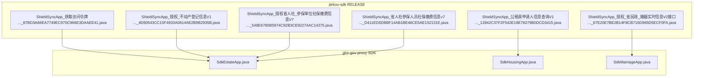
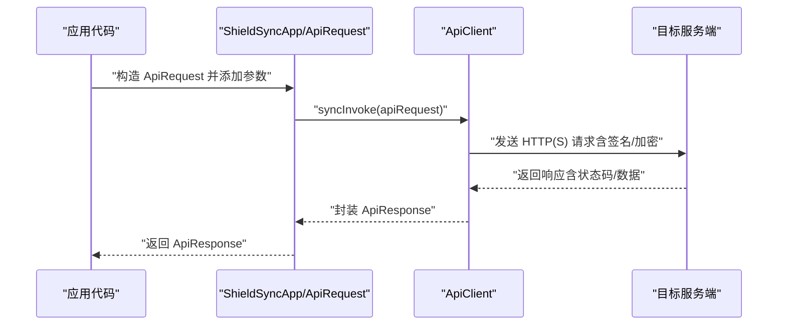
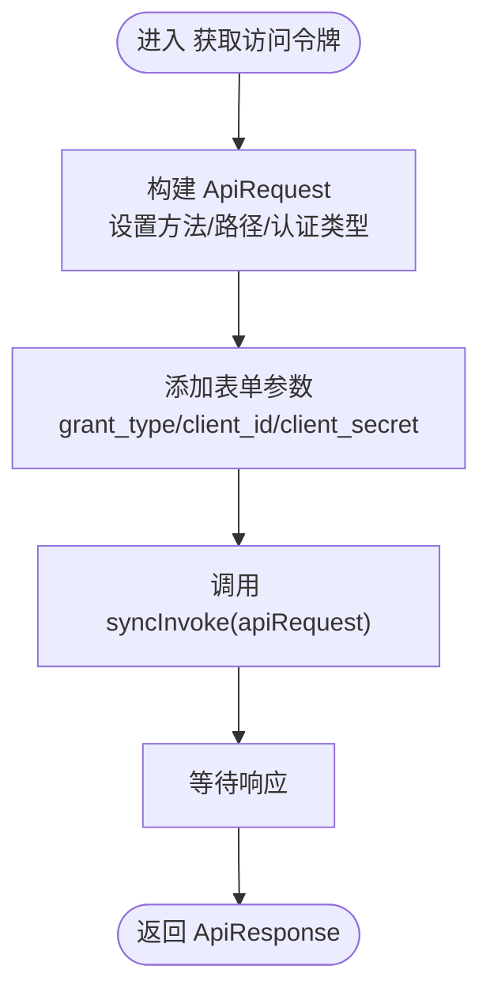
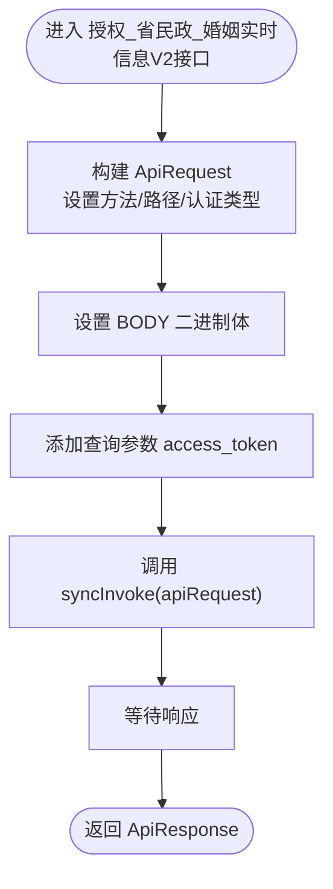
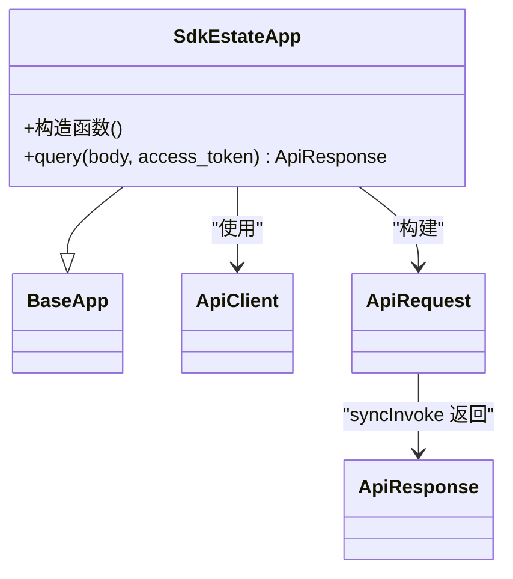
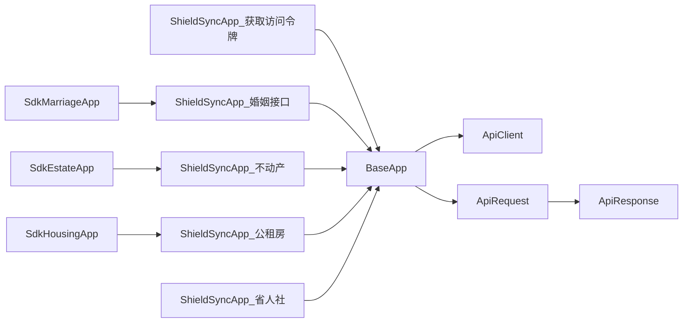

# 同步SDK设计

<cite>
**本文引用的文件**
- [ShieldSyncApp_获取访问令牌_87BD3A66EA7749EC970C966E3DAAEE41.java](file://jiekou-sdk/java/RELEASE/ShieldSyncApp_获取访问令牌_87BD3A66EA7749EC970C966E3DAAEE41.java)
- [ShieldSyncApp_授权_省民政_婚姻实时信息V2接口_67E20E7BE2B14F8CB716D965D5ECF0FA.java](file://jiekou-sdk/java-2/RELEASE/ShieldSyncApp_授权_省民政_婚姻实时信息V2接口_67E20E7BE2B14F8CB716D965D5ECF0FA.java)
- [ShieldSyncApp_授权_不动产登记信息V1_4D90543CC15F4933A0614AE2B9B2935B.java](file://jiekou-sdk/java-3/RELEASE/ShieldSyncApp_授权_不动产登记信息V1_4D90543CC15F4933A0614AE2B9B2935B.java)
- [ShieldSyncApp_授权省人社_参保单位社会保险缴费信息V7_548E6780B5974C92B3CE92274AC14375.java](file://jiekou-sdk/java-4/RELEASE/ShieldSyncApp_授权省人社_参保单位社会保险缴费信息V7_548E6780B5974C92B3CE92274AC14375.java)
- [ShieldSyncApp_公租房申请人信息查询V1_12842C37F2F542E18E76279B0DCD3415.java](file://jiekou-sdk/java-5/RELEASE/ShieldSyncApp_公租房申请人信息查询V1_12842C37F2F542E18E76279B0DCD3415.java)
- [ShieldSyncApp_省人社参保人员社会保险缴费信息v7_D411ED5DBBF14AB1BE46CE5AE152131E.java](file://jiekou-sdk/java6/RELEASE/ShieldSyncApp_省人社参保人员社会保险缴费信息v7_D411ED5DBBF14AB1BE46CE5AE152131E.java)
- [SdkEstateApp.java](file://ghz-gov-proxy/src/main/java/com/ghz/gov/sdk/SdkEstateApp.java)
- [SdkHousingApp.java](file://ghz-gov-proxy/src/main/java/com/ghz/gov/sdk/SdkHousingApp.java)
- [SdkMarriageApp.java](file://ghz-gov-proxy/src/main/java/com/ghz/gov/sdk/SdkMarriageApp.java)
</cite>

## 目录
1. [简介](#简介)
2. [项目结构](#项目结构)
3. [核心组件](#核心组件)
4. [架构总览](#架构总览)
5. [详细组件分析](#详细组件分析)
6. [依赖关系分析](#依赖关系分析)
7. [性能考量](#性能考量)
8. [故障排除指南](#故障排除指南)
9. [结论](#结论)
10. [附录](#附录)

## 简介
本文件面向“同步SDK设计”的技术文档，围绕 ShieldSyncApp 系列类的实现进行系统性剖析。重点覆盖以下方面：
- 同步调用模式的设计原理与控制流
- 请求/响应处理机制、参数封装与数据序列化
- 网络通信协议与安全签名策略
- 适用场景、性能特征与并发能力
- 集成示例、使用方法与最佳实践
- 错误码定义、重试机制与超时处理
- 同步SDK与其他调用模式（异步、WebSocket）的对比与选择建议

## 项目结构
本仓库中与“同步SDK”直接相关的核心文件主要位于 jiekou-sdk 的 RELEASE 目录下，以及 ghz-gov-proxy 中的 SDK 封装示例。整体组织方式为：
- 每个业务接口对应一个 ShieldSyncApp 类，继承自统一的 BaseApp，复用统一的 ApiClient 与签名/加密策略
- 业务侧通过构造 ApiRequest 并调用 syncInvoke 完成一次完整的同步请求
- ghz-gov-proxy 提供了针对不同业务域的 SdkXxxApp 封装，展示了如何在实际项目中设置超时、密钥与目标路径

**图表来源**
- [ShieldSyncApp_获取访问令牌_87BD3A66EA7749EC970C966E3DAAEE41.java:17-82](file://jiekou-sdk/java/RELEASE/ShieldSyncApp_获取访问令牌_87BD3A66EA7749EC970C966E3DAAEE41.java#L17-L82)
- [SdkEstateApp.java:12-47](file://ghz-gov-proxy/src/main/java/com/ghz/gov/sdk/SdkEstateApp.java#L12-L47)
- [SdkHousingApp.java:12-46](file://ghz-gov-proxy/src/main/java/com/ghz/gov/sdk/SdkHousingApp.java#L12-L46)
- [SdkMarriageApp.java:12-46](file://ghz-gov-proxy/src/main/java/com/ghz/gov/sdk/SdkMarriageApp.java#L12-L46)

**章节来源**
- [ShieldSyncApp_获取访问令牌_87BD3A66EA7749EC970C966E3DAAEE41.java:1-82](file://jiekou-sdk/java/RELEASE/ShieldSyncApp_获取访问令牌_87BD3A66EA7749EC970C966E3DAAEE41.java#L1-L82)
- [SdkEstateApp.java:1-47](file://ghz-gov-proxy/src/main/java/com/ghz/gov/sdk/SdkEstateApp.java#L1-L47)

## 核心组件
- ShieldSyncApp 系列类：每个业务接口对应一个类，负责初始化 SDK 参数（appId/appSecret/gmAppSecret、host、端口、stage、公私钥、icloudlock 等），并通过 syncInvoke 执行同步请求
- BaseApp：抽象基类，提供统一的初始化逻辑与 syncInvoke 调用入口
- ApiClient：网络客户端，负责连接建立、读写超时、TLS/HTTP 协议交互
- ApiRequest/ApiResponse：请求/响应模型，承载参数位置、认证类型、签名策略、加密体等
- SdkXxxApp：在 ghz-gov-proxy 中对 ShieldSyncApp 的进一步封装，展示如何在真实项目中设置超时与密钥

关键职责划分：
- 参数封装与序列化：由 ApiRequest 负责，支持 FORM/QUERY/BODY 等多种参数位置
- 签名与加密：通过 SdkConstant 中的认证类型与密钥配置，结合 ApiSignStrategy 实现
- 同步调用：syncInvoke 在当前线程阻塞等待响应，返回 ApiResponse

**章节来源**
- [ShieldSyncApp_获取访问令牌_87BD3A66EA7749EC970C966E3DAAEE41.java:17-82](file://jiekou-sdk/java/RELEASE/ShieldSyncApp_获取访问令牌_87BD3A66EA7749EC970C966E3DAAEE41.java#L17-L82)
- [SdkEstateApp.java:12-47](file://ghz-gov-proxy/src/main/java/com/ghz/gov/sdk/SdkEstateApp.java#L12-L47)

## 架构总览
下图展示了从应用到服务端的同步调用链路，强调了参数封装、签名/加密、网络传输与响应解析的关键步骤。

**图表来源**
- [ShieldSyncApp_获取访问令牌_87BD3A66EA7749EC970C966E3DAAEE41.java:69-80](file://jiekou-sdk/java/RELEASE/ShieldSyncApp_获取访问令牌_87BD3A66EA7749EC970C966E3DAAEE41.java#L69-L80)
- [SdkEstateApp.java:38-45](file://ghz-gov-proxy/src/main/java/com/ghz/gov/sdk/SdkEstateApp.java#L38-L45)

## 详细组件分析

### 组件A：ShieldSyncApp_获取访问令牌
- 设计要点
  - 初始化阶段集中配置 appId/appSecret/gmAppSecret、host/端口、stage、公私钥与 icloudlock
  - 方法内部通过 ApiRequest 设置 HTTP 方式、路径、认证类型与随机串，随后调用 syncInvoke
- 参数封装
  - 使用 addParam 添加表单参数（如 grant_type/client_id/client_secret）
- 数据序列化
  - 采用 FORM 参数形式；BODY 可选（本方法未设置）
- 网络协议
  - 使用 HTTP（或 HTTPS，取决于 host 与端口配置）

**图表来源**
- [ShieldSyncApp_获取访问令牌_87BD3A66EA7749EC970C966E3DAAEE41.java:69-80](file://jiekou-sdk/java/RELEASE/ShieldSyncApp_获取访问令牌_87BD3A66EA7749EC970C966E3DAAEE41.java#L69-L80)

**章节来源**
- [ShieldSyncApp_获取访问令牌_87BD3A66EA7749EC970C966E3DAAEE41.java:17-82](file://jiekou-sdk/java/RELEASE/ShieldSyncApp_获取访问令牌_87BD3A66EA7749EC970C966E3DAAEE41.java#L17-L82)

### 组件B：ShieldSyncApp_授权_省民政_婚姻实时信息V2接口
- 设计要点
  - 通过 setBody 传入二进制请求体，addParam 添加 access_token 查询参数
  - 认证类型为加密模式，路径指向婚姻接口
- 参数封装与序列化
  - BODY 体用于承载结构化数据；access_token 以 QUERY 形式附加
- 网络协议
  - 同样遵循 HTTP(S) 与签名/加密流程

**图表来源**
- [ShieldSyncApp_授权_省民政_婚姻实时信息V2接口_67E20E7BE2B14F8CB716D965D5ECF0FA.java:69-76](file://jiekou-sdk/java-2/RELEASE/ShieldSyncApp_授权_省民政_婚姻实时信息V2接口_67E20E7BE2B14F8CB716D965D5ECF0FA.java#L69-L76)

**章节来源**
- [ShieldSyncApp_授权_省民政_婚姻实时信息V2接口_67E20E7BE2B14F8CB716D965D5ECF0FA.java:17-78](file://jiekou-sdk/java-2/RELEASE/ShieldSyncApp_授权_省民政_婚姻实时信息V2接口_67E20E7BE2B14F8CB716D965D5ECF0FA.java#L17-L78)

### 组件C：SdkEstateApp（不动产）
- 设计要点
  - 在构造函数中显式设置连接、读、写超时，适配政务后端响应较慢的场景
  - 复用 ShieldSyncApp 的参数封装与同步调用机制
- 性能特征
  - 更长的读/写超时有助于在高延迟环境下稳定获取响应

**图表来源**
- [SdkEstateApp.java:12-47](file://ghz-gov-proxy/src/main/java/com/ghz/gov/sdk/SdkEstateApp.java#L12-L47)

**章节来源**
- [SdkEstateApp.java:12-47](file://ghz-gov-proxy/src/main/java/com/ghz/gov/sdk/SdkEstateApp.java#L12-L47)

### 组件D：SdkHousingApp（公租房）
- 设计要点
  - 与 SdkEstateApp 类似，设置较长超时，适配住房类接口的响应时间
- 参数封装
  - 通过 ApiRequest 设置 BODY 与 access_token 查询参数

**章节来源**
- [SdkHousingApp.java:12-46](file://ghz-gov-proxy/src/main/java/com/ghz/gov/sdk/SdkHousingApp.java#L12-L46)

### 组件E：SdkMarriageApp（婚姻）
- 设计要点
  - 面向婚姻实时信息接口，同样设置较长超时
- 参数封装
  - 通过 ApiRequest 设置 BODY 与 access_token 查询参数

**章节来源**
- [SdkMarriageApp.java:12-46](file://ghz-gov-proxy/src/main/java/com/ghz/gov/sdk/SdkMarriageApp.java#L12-L46)

## 依赖关系分析
- ShieldSyncApp 系列类均依赖 BaseApp 与 ApiClient，形成统一的同步调用入口
- 不同业务域的 SdkXxxApp 在 ghz-gov-proxy 中对 ShieldSyncApp 进行二次封装，体现“按领域分层”的工程实践
- 参数位置枚举（FORM/QUERY/BODY）与认证类型（加密）贯穿所有同步调用

**图表来源**
- [ShieldSyncApp_获取访问令牌_87BD3A66EA7749EC970C966E3DAAEE41.java:17-82](file://jiekou-sdk/java/RELEASE/ShieldSyncApp_获取访问令牌_87BD3A66EA7749EC970C966E3DAAEE41.java#L17-L82)
- [SdkEstateApp.java:12-47](file://ghz-gov-proxy/src/main/java/com/ghz/gov/sdk/SdkEstateApp.java#L12-L47)
- [SdkHousingApp.java:12-46](file://ghz-gov-proxy/src/main/java/com/ghz/gov/sdk/SdkHousingApp.java#L12-L46)
- [SdkMarriageApp.java:12-46](file://ghz-gov-proxy/src/main/java/com/ghz/gov/sdk/SdkMarriageApp.java#L12-L46)

**章节来源**
- [ShieldSyncApp_获取访问令牌_87BD3A66EA7749EC970C966E3DAAEE41.java:17-82](file://jiekou-sdk/java/RELEASE/ShieldSyncApp_获取访问令牌_87BD3A66EA7749EC970C966E3DAAEE41.java#L17-L82)
- [SdkEstateApp.java:12-47](file://ghz-gov-proxy/src/main/java/com/ghz/gov/sdk/SdkEstateApp.java#L12-L47)

## 性能考量
- 同步调用的适用场景
  - 对实时性要求较高且调用频次可控的场景
  - 业务流程需要在当前线程内阻塞等待结果的顺序化处理
- 性能特征
  - 单次调用占用当前线程，不适合高并发下的大量并行请求
  - 适合短/中等耗时接口；对于长耗时接口，建议配合合理的超时配置与重试策略
- 并发能力
  - 默认未内置线程池；若需并发，应在上层自行调度（例如多线程/线程池）
- 超时配置
  - ghz-gov-proxy 的 SdkXxxApp 展示了如何设置连接、读、写超时，以适配政务后端较慢的响应

**章节来源**
- [SdkEstateApp.java:14-20](file://ghz-gov-proxy/src/main/java/com/ghz/gov/sdk/SdkEstateApp.java#L14-L20)
- [SdkHousingApp.java:14-19](file://ghz-gov-proxy/src/main/java/com/ghz/gov/sdk/SdkHousingApp.java#L14-L19)
- [SdkMarriageApp.java:14-19](file://ghz-gov-proxy/src/main/java/com/ghz/gov/sdk/SdkMarriageApp.java#L14-L19)

## 故障排除指南
- 错误码定义
  - 本仓库未提供统一的错误码定义文件；建议在业务侧维护接口级错误码映射表，便于定位与上报
- 重试机制
  - 建议基于幂等性与业务语义实现指数退避重试；对网络瞬时抖动与服务端限流友好
- 超时处理
  - 针对长耗时接口，参考 SdkXxxApp 的超时设置，合理配置连接、读、写超时
- 异常处理策略
  - 在调用 syncInvoke 前进行参数校验与必填项检查
  - 对返回的 ApiResponse 进行状态码与业务码判定，必要时记录日志并触发告警
- 常见问题定位
  - 签名/加密失败：核对 appId/appSecret/gmAppSecret、公私钥与认证类型
  - 超时：检查网络连通性、目标服务端负载与超时配置
  - 参数位置错误：确认 FORM/QUERY/BODY 的使用是否符合接口规范

**章节来源**
- [SdkEstateApp.java:14-20](file://ghz-gov-proxy/src/main/java/com/ghz/gov/sdk/SdkEstateApp.java#L14-L20)

## 结论
- ShieldSyncApp 系列提供了标准化的同步调用能力，统一了参数封装、签名/加密与网络交互
- 通过 SdkXxxApp 的封装示例，可在实际项目中灵活调整超时与密钥配置
- 对于高并发与长耗时场景，建议结合上层调度与重试策略，确保稳定性与可用性
- 与其他调用模式（异步、WebSocket）相比，同步SDK更适合顺序化、低延迟的业务流程；异步与WebSocket更适用于事件驱动与长连接场景

## 附录
- 集成示例（步骤说明）
  - 引入对应 ShieldSyncApp 类或 SdkXxxApp
  - 准备请求参数（FORM/QUERY/BODY），构造 ApiRequest
  - 调用 syncInvoke，处理返回的 ApiResponse
  - 根据业务需求配置超时与重试策略
- 最佳实践
  - 明确参数位置与数据格式，避免跨域/跨版本不兼容
  - 在上层统一处理异常与日志，便于问题追踪
  - 对敏感接口启用加密与签名，严格管理密钥与证书