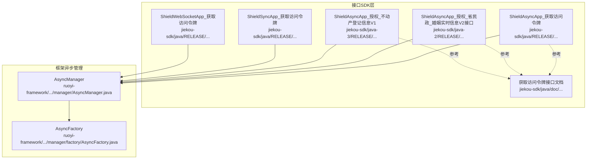
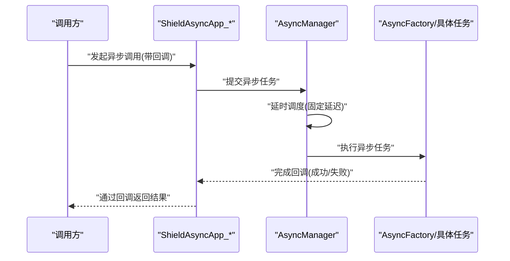
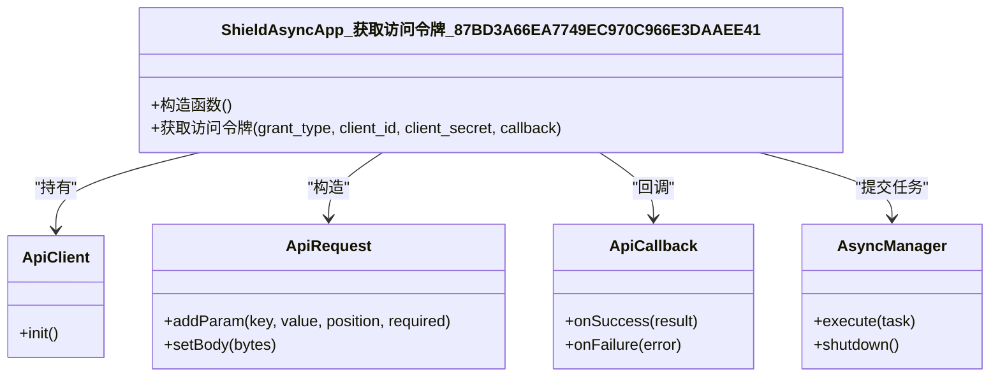
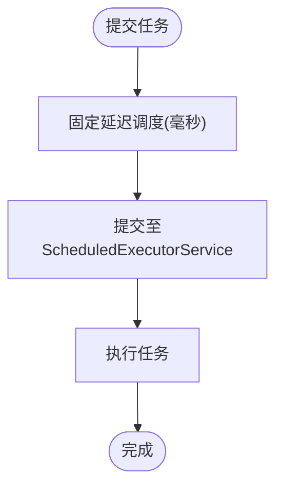
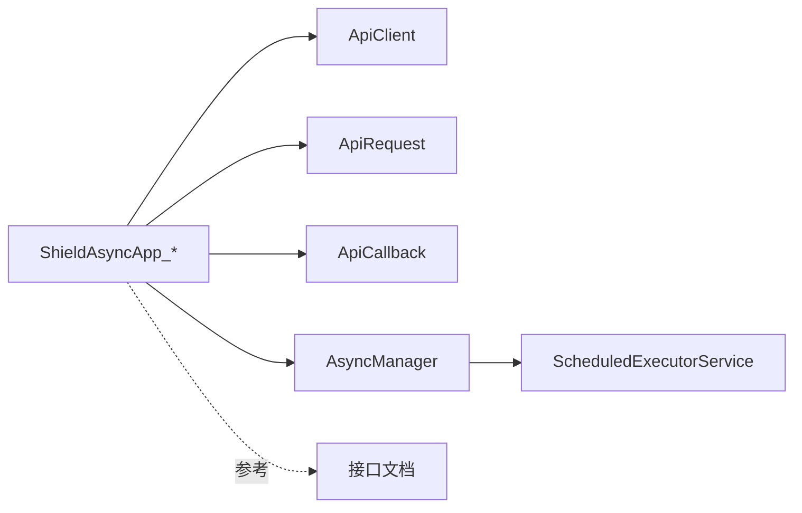

# 异步SDK设计

<cite>
**本文引用的文件**
- [ShieldAsyncApp_获取访问令牌_87BD3A66EA7749EC970C966E3DAAEE41.java](file://jiekou-sdk/java/RELEASE/ShieldAsyncApp_获取访问令牌_87BD3A66EA7749EC970C966E3DAAEE41.java)
- [ShieldAsyncApp_授权_省民政_婚姻实时信息V2接口_67E20E7BE2B14F8CB716D965D5ECF0FA.java](file://jiekou-sdk/java-2/RELEASE/ShieldAsyncApp_授权_省民政_婚姻实时信息V2接口_67E20E7BE2B14F8CB716D965D5ECF0FA.java)
- [ShieldAsyncApp_授权_不动产登记信息V1_4D90543CC15F4933A0614AE2B9B2935B.java](file://jiekou-sdk/java-3/RELEASE/ShieldAsyncApp_授权_不动产登记信息V1_4D90543CC15F4933A0614AE2B9B2935B.java)
- [ShieldSyncApp_获取访问令牌_87BD3A66EA7749EC970C966E3DAAEE41.java](file://jiekou-sdk/java/RELEASE/ShieldSyncApp_获取访问令牌_87BD3A66EA7749EC970C966E3DAAEE41.java)
- [ShieldWebSocketApp_获取访问令牌_87BD3A66EA7749EC970C966E3DAAEE41.java](file://jiekou-sdk/java/RELEASE/ShieldWebSocketApp_获取访问令牌_87BD3A66EA7749EC970C966E3DAAEE41.java)
- [获取访问令牌_87BD3A66EA7749EC970C966E3DAAEE41_doc.html](file://jiekou-sdk/java/doc/获取访问令牌_87BD3A66EA7749EC970C966E3DAAEE41_doc.html)
- [AsyncManager.java](file://ruoyi-framework/src/main/java/com/ruoyi/framework/manager/AsyncManager.java)
- [AsyncFactory.java](file://ruoyi-framework/src/main/java/com/ruoyi/framework/manager/factory/AsyncFactory.java)
</cite>

## 目录
1. [引言](#引言)
2. [项目结构](#项目结构)
3. [核心组件](#核心组件)
4. [架构总览](#架构总览)
5. [详细组件分析](#详细组件分析)
6. [依赖分析](#依赖分析)
7. [性能考虑](#性能考虑)
8. [故障排查指南](#故障排查指南)
9. [结论](#结论)
10. [附录](#附录)

## 引言
本文件面向“异步SDK设计”的专业技术文档，围绕 ShieldAsyncApp 类族的异步调用架构展开，重点阐释事件驱动模型、回调机制、线程池管理、非阻塞I/O、并发控制与资源管理等关键技术点；并结合同步与异步模式的差异，给出适用场景、性能优势、内存占用、集成指南、使用示例、错误处理、监控指标、调试方法与性能优化建议。

## 项目结构
本仓库中与异步SDK直接相关的核心文件主要位于 jiekou-sdk 子目录，以及 ruoyi-framework 的异步任务管理模块。下图展示与异步SDK相关的关键文件与职责映射：

图表来源
- [ShieldAsyncApp_获取访问令牌_87BD3A66EA7749EC970C966E3DAAEE41.java:1-79](file://jiekou-sdk/java/RELEASE/ShieldAsyncApp_获取访问令牌_87BD3A66EA7749EC970C966E3DAAEE41.java#L1-L79)
- [ShieldAsyncApp_授权_省民政_婚姻实时信息V2接口_67E20E7BE2B14F8CB716D965D5ECF0FA.java:1-75](file://jiekou-sdk/java-2/RELEASE/ShieldAsyncApp_授权_省民政_婚姻实时信息V2接口_67E20E7BE2B14F8CB716D965D5ECF0FA.java#L1-L75)
- [ShieldAsyncApp_授权_不动产登记信息V1_4D90543CC15F4933A0614AE2B9B2935B.java:1-75](file://jiekou-sdk/java-3/RELEASE/ShieldAsyncApp_授权_不动产登记信息V1_4D90543CC15F4933A0614AE2B9B2935B.java#L1-L75)
- [ShieldSyncApp_获取访问令牌_87BD3A66EA7749EC970C966E3DAAEE41.java:1-82](file://jiekou-sdk/java/RELEASE/ShieldSyncApp_获取访问令牌_87BD3A66EA7749EC970C966E3DAAEE41.java#L1-L82)
- [ShieldWebSocketApp_获取访问令牌_87BD3A66EA7749EC970C966E3DAAEE41.java:1-47](file://jiekou-sdk/java/RELEASE/ShieldWebSocketApp_获取访问令牌_87BD3A66EA7749EC970C966E3DAAEE41.java#L1-L47)
- [获取访问令牌_87BD3A66EA7749EC970C966E3DAAEE41_doc.html:1-288](file://jiekou-sdk/java/doc/获取访问令牌_87BD3A66EA7749EC970C966E3DAAEE41_doc.html#L1-L288)
- [AsyncManager.java:1-56](file://ruoyi-framework/src/main/java/com/ruoyi/framework/manager/AsyncManager.java#L1-L56)
- [AsyncFactory.java:1-103](file://ruoyi-framework/src/main/java/com/ruoyi/framework/manager/factory/AsyncFactory.java#L1-L103)

章节来源
- [ShieldAsyncApp_获取访问令牌_87BD3A66EA7749EC970C966E3DAAEE41.java:1-79](file://jiekou-sdk/java/RELEASE/ShieldAsyncApp_获取访问令牌_87BD3A66EA7749EC970C966E3DAAEE41.java#L1-L79)
- [ShieldAsyncApp_授权_省民政_婚姻实时信息V2接口_67E20E7BE2B14F8CB716D965D5ECF0FA.java:1-75](file://jiekou-sdk/java-2/RELEASE/ShieldAsyncApp_授权_省民政_婚姻实时信息V2接口_67E20E7BE2B14F8CB716D965D5ECF0FA.java#L1-L75)
- [ShieldAsyncApp_授权_不动产登记信息V1_4D90543CC15F4933A0614AE2B9B2935B.java:1-75](file://jiekou-sdk/java-3/RELEASE/ShieldAsyncApp_授权_不动产登记信息V1_4D90543CC15F4933A0614AE2B9B2935B.java#L1-L75)
- [ShieldSyncApp_获取访问令牌_87BD3A66EA7749EC970C966E3DAAEE41.java:1-82](file://jiekou-sdk/java/RELEASE/ShieldSyncApp_获取访问令牌_87BD3A66EA7749EC970C966E3DAAEE41.java#L1-L82)
- [ShieldWebSocketApp_获取访问令牌_87BD3A66EA7749EC970C966E3DAAEE41.java:1-47](file://jiekou-sdk/java/RELEASE/ShieldWebSocketApp_获取访问令牌_87BD3A66EA7749EC970C966E3DAAEE41.java#L1-L47)
- [获取访问令牌_87BD3A66EA7749EC970C966E3DAAEE41_doc.html:1-288](file://jiekou-sdk/java/doc/获取访问令牌_87BD3A66EA7749EC970C966E3DAAEE41_doc.html#L1-L288)
- [AsyncManager.java:1-56](file://ruoyi-framework/src/main/java/com/ruoyi/framework/manager/AsyncManager.java#L1-L56)
- [AsyncFactory.java:1-103](file://ruoyi-framework/src/main/java/com/ruoyi/framework/manager/factory/AsyncFactory.java#L1-L103)

## 核心组件
- 异步应用类族（ShieldAsyncApp_*）：封装具体业务API的异步调用入口，负责构造请求、选择认证方式、调用异步执行器，并通过回调返回结果。
- 同步应用类（ShieldSyncApp_*）：用于对比，提供同步阻塞式调用能力，便于在需要立即获得结果的场景使用。
- WebSocket 应用类（ShieldWebSocketApp_*）：提供长连接通道，适用于事件推送或双向通信场景。
- 异步管理器（AsyncManager）：基于调度线程池的异步任务调度器，提供统一的任务提交与优雅停机能力。
- 异步工厂（AsyncFactory）：用于生成异步任务（如登录日志、操作日志），体现异步模式在系统其他模块中的应用。

章节来源
- [ShieldAsyncApp_获取访问令牌_87BD3A66EA7749EC970C966E3DAAEE41.java:14-79](file://jiekou-sdk/java/RELEASE/ShieldAsyncApp_获取访问令牌_87BD3A66EA7749EC970C966E3DAAEE41.java#L14-L79)
- [ShieldAsyncApp_授权_省民政_婚姻实时信息V2接口_67E20E7BE2B14F8CB716D965D5ECF0FA.java:14-75](file://jiekou-sdk/java-2/RELEASE/ShieldAsyncApp_授权_省民政_婚姻实时信息V2接口_67E20E7BE2B14F8CB716D965D5ECF0FA.java#L14-L75)
- [ShieldAsyncApp_授权_不动产登记信息V1_4D90543CC15F4933A0614AE2B9B2935B.java:14-75](file://jiekou-sdk/java-3/RELEASE/ShieldAsyncApp_授权_不动产登记信息V1_4D90543CC15F4933A0614AE2B9B2935B.java#L14-L75)
- [ShieldSyncApp_获取访问令牌_87BD3A66EA7749EC970C966E3DAAEE41.java:17-82](file://jiekou-sdk/java/RELEASE/ShieldSyncApp_获取访问令牌_87BD3A66EA7749EC970C966E3DAAEE41.java#L17-L82)
- [ShieldWebSocketApp_获取访问令牌_87BD3A66EA7749EC970C966E3DAAEE41.java:10-47](file://jiekou-sdk/java/RELEASE/ShieldWebSocketApp_获取访问令牌_87BD3A66EA7749EC970C966E3DAAEE41.java#L10-L47)
- [AsyncManager.java:14-56](file://ruoyi-framework/src/main/java/com/ruoyi/framework/manager/AsyncManager.java#L14-L56)
- [AsyncFactory.java:24-103](file://ruoyi-framework/src/main/java/com/ruoyi/framework/manager/factory/AsyncFactory.java#L24-L103)

## 架构总览
异步SDK采用“应用适配层 + 异步调度层”的分层设计：
- 应用适配层：每个 ShieldAsyncApp_* 类封装一个具体的业务API，负责参数构建、签名策略、认证类型与目标地址配置，并调用异步执行器。
- 异步调度层：AsyncManager 提供统一的调度线程池，以极短延迟（毫秒级）提交任务，避免主线程阻塞；AsyncFactory 展示了如何将耗时操作异步化。

图表来源
- [ShieldAsyncApp_获取访问令牌_87BD3A66EA7749EC970C966E3DAAEE41.java:66-77](file://jiekou-sdk/java/RELEASE/ShieldAsyncApp_获取访问令牌_87BD3A66EA7749EC970C966E3DAAEE41.java#L66-L77)
- [AsyncManager.java:43-46](file://ruoyi-framework/src/main/java/com/ruoyi/framework/manager/AsyncManager.java#L43-L46)
- [AsyncFactory.java:37-81](file://ruoyi-framework/src/main/java/com/ruoyi/framework/manager/factory/AsyncFactory.java#L37-L81)

## 详细组件分析

### 组件A：ShieldAsyncApp_* 异步调用类
- 设计要点
  - 继承自通用基类，内部持有 ApiClient 并初始化，配置 appId、appSecret、host、端口、stage、公私钥等参数。
  - 每个业务API对应一个 public 方法，负责构造 ApiRequest（含协议、方法、路径、认证类型、签名策略等），并通过 asyncInvoke 触发异步执行。
  - 回调参数为 ApiCallback，用于接收异步结果（成功/失败）。
- 生命周期与状态
  - 初始化阶段：构造 ApiClient 并 init；随后设置网络与密钥参数。
  - 调用阶段：构造请求对象，添加参数（支持多种位置），调用 asyncInvoke。
  - 结果阶段：由回调 ApiCallback 处理最终结果。
- 并发与资源
  - 通过 AsyncManager 的调度线程池实现并发隔离；每个调用独立提交任务，避免相互阻塞。
  - 资源管理：ApiClient 在类实例内复用，减少重复初始化成本；参数与请求体按需构造，降低内存峰值。

图表来源
- [ShieldAsyncApp_获取访问令牌_87BD3A66EA7749EC970C966E3DAAEE41.java:14-79](file://jiekou-sdk/java/RELEASE/ShieldAsyncApp_获取访问令牌_87BD3A66EA7749EC970C966E3DAAEE41.java#L14-L79)
- [AsyncManager.java:14-56](file://ruoyi-framework/src/main/java/com/ruoyi/framework/manager/AsyncManager.java#L14-L56)

章节来源
- [ShieldAsyncApp_获取访问令牌_87BD3A66EA7749EC970C966E3DAAEE41.java:14-79](file://jiekou-sdk/java/RELEASE/ShieldAsyncApp_获取访问令牌_87BD3A66EA7749EC970C966E3DAAEE41.java#L14-L79)
- [ShieldAsyncApp_授权_省民政_婚姻实时信息V2接口_67E20E7BE2B14F8CB716D965D5ECF0FA.java:14-75](file://jiekou-sdk/java-2/RELEASE/ShieldAsyncApp_授权_省民政_婚姻实时信息V2接口_67E20E7BE2B14F8CB716D965D5ECF0FA.java#L14-L75)
- [ShieldAsyncApp_授权_不动产登记信息V1_4D90543CC15F4933A0614AE2B9B2935B.java:14-75](file://jiekou-sdk/java-3/RELEASE/ShieldAsyncApp_授权_不动产登记信息V1_4D90543CC15F4933A0614AE2B9B2935B.java#L14-L75)

### 组件B：异步调度与线程池管理（AsyncManager）
- 设计要点
  - 使用 Spring 注入的 ScheduledExecutorService 作为调度核心，提供固定延迟的异步任务提交能力。
  - 单例模式提供全局统一的异步任务入口，确保资源可控与一致性。
  - 提供优雅停机接口，便于在应用关闭时等待任务完成。
- 性能特征
  - 延迟调度（毫秒级）可有效削峰填谷，避免瞬时高并发对下游造成冲击。
  - 线程池复用减少线程创建销毁开销，提升吞吐。

图表来源
- [AsyncManager.java:43-46](file://ruoyi-framework/src/main/java/com/ruoyi/framework/manager/AsyncManager.java#L43-L46)

章节来源
- [AsyncManager.java:14-56](file://ruoyi-framework/src/main/java/com/ruoyi/framework/manager/AsyncManager.java#L14-L56)

### 组件C：异步任务工厂（AsyncFactory）
- 设计要点
  - 提供多个静态工厂方法，用于生成不同类型的异步任务（如登录信息、操作日志）。
  - 任务体内部封装耗时逻辑（如远程地址解析、持久化），通过线程池异步执行，避免阻塞主线程。
- 实践价值
  - 体现异步模式在日志、审计等场景中的应用，与 SDK 的异步调用理念一致。

章节来源
- [AsyncFactory.java:24-103](file://ruoyi-framework/src/main/java/com/ruoyi/framework/manager/factory/AsyncFactory.java#L24-L103)

### 组件D：同步与WebSocket 对比
- 同步模式（ShieldSyncApp_*）
  - 适合需要立即获得响应结果的场景；调用后阻塞等待，简化上层逻辑但可能影响吞吐。
- WebSocket 模式（ShieldWebSocketApp_*）
  - 适合事件推送、长连接通信；与异步HTTP调用互补，满足不同业务形态。

章节来源
- [ShieldSyncApp_获取访问令牌_87BD3A66EA7749EC970C966E3DAAEE41.java:17-82](file://jiekou-sdk/java/RELEASE/ShieldSyncApp_获取访问令牌_87BD3A66EA7749EC970C966E3DAAEE41.java#L17-L82)
- [ShieldWebSocketApp_获取访问令牌_87BD3A66EA7749EC970C966E3DAAEE41.java:10-47](file://jiekou-sdk/java/RELEASE/ShieldWebSocketApp_获取访问令牌_87BD3A66EA7749EC970C966E3DAAEE41.java#L10-L47)

## 依赖分析
- 组件耦合
  - ShieldAsyncApp_* 依赖 ApiClient、ApiRequest、ApiCallback 与 AsyncManager，形成清晰的调用链。
  - AsyncManager 依赖 Spring 容器注入的 ScheduledExecutorService，保证线程池来源统一。
- 外部依赖
  - 文档与接口定义来自 jiekou-sdk/doc 下的接口说明文件，用于指导参数与返回格式。
- 潜在风险
  - 若未正确设置 appId/appSecret/host 等参数，可能导致认证失败或连接异常。
  - 回调未正确处理可能引发结果丢失或异常传播。

图表来源
- [ShieldAsyncApp_获取访问令牌_87BD3A66EA7749EC970C966E3DAAEE41.java:14-79](file://jiekou-sdk/java/RELEASE/ShieldAsyncApp_获取访问令牌_87BD3A66EA7749EC970C966E3DAAEE41.java#L14-L79)
- [AsyncManager.java:24-24](file://ruoyi-framework/src/main/java/com/ruoyi/framework/manager/AsyncManager.java#L24-L24)
- [获取访问令牌_87BD3A66EA7749EC970C966E3DAAEE41_doc.html:166-244](file://jiekou-sdk/java/doc/获取访问令牌_87BD3A66EA7749EC970C966E3DAAEE41_doc.html#L166-L244)

章节来源
- [ShieldAsyncApp_获取访问令牌_87BD3A66EA7749EC970C966E3DAAEE41.java:14-79](file://jiekou-sdk/java/RELEASE/ShieldAsyncApp_获取访问令牌_87BD3A66EA7749EC970C966E3DAAEE41.java#L14-L79)
- [获取访问令牌_87BD3A66EA7749EC970C966E3DAAEE41_doc.html:166-244](file://jiekou-sdk/java/doc/获取访问令牌_87BD3A66EA7749EC970C966E3DAAEE41_doc.html#L166-L244)
- [AsyncManager.java:24-24](file://ruoyi-framework/src/main/java/com/ruoyi/framework/manager/AsyncManager.java#L24-L24)

## 性能考虑
- 非阻塞I/O与并发控制
  - 异步调用避免阻塞主线程，结合调度线程池实现并发隔离；建议根据业务QPS合理配置线程池大小与队列长度。
- 资源管理
  - 复用 ApiClient 与连接，减少频繁初始化带来的开销；及时释放大对象引用，避免内存泄漏。
- 延迟与吞吐
  - 固定延迟调度有助于削峰，但需评估端到端时延目标；对于低延迟场景可考虑缩短调度延迟或引入更细粒度的并发控制。
- 错误与重试
  - 在回调中区分网络异常与业务错误，必要时进行指数退避重试；对可重试的瞬时错误进行限流与熔断保护。

## 故障排查指南
- 常见问题定位
  - 认证失败：核对 appId、appSecret、stage、公私钥配置是否与平台一致。
  - 网络异常：检查 host、端口、contextPath 是否正确；确认防火墙与代理设置。
  - 回调未触发：确认回调实现是否正确注册；查看日志中是否有异常堆栈。
- 调试建议
  - 开启 SDK 与框架的日志级别，捕获请求/响应摘要与异常栈。
  - 使用接口文档核对参数与返回格式，确保必填项与类型匹配。
- 运维观测
  - 关注异步任务队列长度、执行时延、拒绝次数等指标；结合业务峰值进行容量规划。

章节来源
- [获取访问令牌_87BD3A66EA7749EC970C966E3DAAEE41_doc.html:166-282](file://jiekou-sdk/java/doc/获取访问令牌_87BD3A66EA7749EC970C966E3DAAEE41_doc.html#L166-L282)
- [AsyncManager.java:43-54](file://ruoyi-framework/src/main/java/com/ruoyi/framework/manager/AsyncManager.java#L43-L54)

## 结论
异步SDK通过“应用适配层 + 异步调度层”的架构实现了高性能、低阻塞的调用体验。结合调度线程池与回调机制，既能满足高并发下的稳定性，又能提供灵活的结果处理能力。配合同步与WebSocket模式，可覆盖从即时响应到长连接推送的多样化业务场景。建议在生产环境中完善监控与告警体系，并根据实际负载动态调整并发与资源参数。

## 附录

### 集成指南与使用示例（步骤化）
- 步骤1：引入SDK与依赖
  - 将 jiekou-sdk/java/RELEASE 下的对应类加入工程；确保网络与加密依赖可用。
- 步骤2：初始化应用类
  - 创建 ShieldAsyncApp_* 实例，确认 appId、appSecret、host、端口、stage、公私钥等参数。
- 步骤3：准备回调
  - 实现 ApiCallback，分别处理 onSuccess 与 onFailure。
- 步骤4：发起异步调用
  - 调用对应业务方法，传入参数与回调；不要在回调外做阻塞等待。
- 步骤5：校验与优化
  - 参考接口文档核对参数；观察日志与指标，持续优化并发与资源。

章节来源
- [ShieldAsyncApp_获取访问令牌_87BD3A66EA7749EC970C966E3DAAEE41.java:16-77](file://jiekou-sdk/java/RELEASE/ShieldAsyncApp_获取访问令牌_87BD3A66EA7749EC970C966E3DAAEE41.java#L16-L77)
- [获取访问令牌_87BD3A66EA7749EC970C966E3DAAEE41_doc.html:166-244](file://jiekou-sdk/java/doc/获取访问令牌_87BD3A66EA7749EC970C966E3DAAEE41_doc.html#L166-L244)

### 与同步模式的对比与场景选择
- 适用场景
  - 异步：高并发、长尾时延敏感、事件驱动、批处理；例如多路数据采集、批量上报。
  - 同步：简单脚本、CLI工具、需要立即判定结果的流程；例如单次查询、配置校验。
- 性能与复杂度
  - 异步提升吞吐与响应性，增加回调与并发控制复杂度；同步逻辑简单但可能成为瓶颈。
- 选择建议
  - 优先采用异步；仅在确有必要时使用同步；WebSocket用于需要持续连接的场景。

章节来源
- [ShieldSyncApp_获取访问令牌_87BD3A66EA7749EC970C966E3DAAEE41.java:69-80](file://jiekou-sdk/java/RELEASE/ShieldSyncApp_获取访问令牌_87BD3A66EA7749EC970C966E3DAAEE41.java#L69-L80)
- [ShieldWebSocketApp_获取访问令牌_87BD3A66EA7749EC970C966E3DAAEE41.java:35-44](file://jiekou-sdk/java/RELEASE/ShieldWebSocketApp_获取访问令牌_87BD3A66EA7749EC970C966E3DAAEE41.java#L35-L44)