# 代理服务架构设计

<cite>
**本文档引用的文件**
- [GovProxyApplication.java](file://ghz-gov-proxy/src/main/java/com/ghz/gov/GovProxyApplication.java)
- [application.yml](file://ghz-gov-proxy/src/main/resources/application.yml)
- [GovProxyConfig.java](file://ghz-gov-proxy/src/main/java/com/ghz/gov/config/GovProxyConfig.java)
- [GovApiController.java](file://ghz-gov-proxy/src/main/java/com/ghz/gov/controller/GovApiController.java)
- [TokenService.java](file://ghz-gov-proxy/src/main/java/com/ghz/gov/service/TokenService.java)
- [MarriageService.java](file://ghz-gov-proxy/src/main/java/com/ghz/gov/service/MarriageService.java)
- [SocialInsuranceService.java](file://ghz-gov-proxy/src/main/java/com/ghz/gov/service/SocialInsuranceService.java)
- [PublicHousingService.java](file://ghz-gov-proxy/src/main/java/com/ghz/gov/service/PublicHousingService.java)
- [RealEstateService.java](file://ghz-gov-proxy/src/main/java/com/ghz/gov/service/RealEstateService.java)
- [SdkTokenApp.java](file://ghz-gov-proxy/src/main/java/com/ghz/gov/sdk/SdkTokenApp.java)
- [SdkMarriageApp.java](file://ghz-gov-proxy/src/main/java/com/ghz/gov/sdk/SdkMarriageApp.java)
- [pom.xml](file://ghz-gov-proxy/pom.xml)
- [start.sh](file://ghz-gov-proxy/deploy/start.sh)
- [stop.sh](file://ghz-gov-proxy/deploy/stop.sh)
- [nginx-ghz-gov-proxy.conf](file://ghz-gov-proxy/deploy/nginx-ghz-gov-proxy.conf)
</cite>

## 目录
1. [引言](#引言)
2. [项目结构](#项目结构)
3. [核心组件](#核心组件)
4. [架构总览](#架构总览)
5. [详细组件分析](#详细组件分析)
6. [依赖关系分析](#依赖关系分析)
7. [性能考虑](#性能考虑)
8. [故障排查指南](#故障排查指南)
9. [结论](#结论)
10. [附录](#附录)

## 引言
本文件面向政务数据代理服务的架构设计与实现，围绕独立代理服务的整体架构展开，重点涵盖Spring Boot应用启动配置、服务注册发现机制、接口路由转发策略、高可用与容错设计、配置管理与环境变量、健康检查机制、与外部政务系统的通信协议与安全传输通道、以及服务启动流程与初始化过程等关键环节。文档旨在帮助运维与开发人员快速理解并高效维护该代理服务。

## 项目结构
代理服务采用标准Spring Boot工程组织方式，核心模块包括：
- 应用入口与配置：启动类、全局配置与属性绑定
- 控制器层：对外暴露RESTful接口，统一鉴权与参数校验
- 服务层：按业务域拆分（婚姻、社保、公租房、不动产），封装调用逻辑与重试策略
- SDK层：封装与外部政务平台的通信细节（HTTP客户端、签名策略、Token获取）
- 部署与运维：启动/停止脚本、Nginx反向代理配置

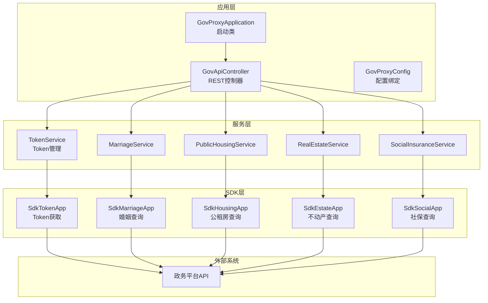

**图表来源**
- [GovProxyApplication.java:1-15](file://ghz-gov-proxy/src/main/java/com/ghz/gov/GovProxyApplication.java#L1-L15)
- [GovApiController.java:1-149](file://ghz-gov-proxy/src/main/java/com/ghz/gov/controller/GovApiController.java#L1-L149)
- [GovProxyConfig.java:1-16](file://ghz-gov-proxy/src/main/java/com/ghz/gov/config/GovProxyConfig.java#L1-L16)
- [TokenService.java:1-170](file://ghz-gov-proxy/src/main/java/com/ghz/gov/service/TokenService.java#L1-L170)
- [MarriageService.java:1-98](file://ghz-gov-proxy/src/main/java/com/ghz/gov/service/MarriageService.java#L1-L98)
- [SocialInsuranceService.java:1-110](file://ghz-gov-proxy/src/main/java/com/ghz/gov/service/SocialInsuranceService.java#L1-L110)
- [PublicHousingService.java:1-97](file://ghz-gov-proxy/src/main/java/com/ghz/gov/service/PublicHousingService.java#L1-L97)
- [RealEstateService.java:1-97](file://ghz-gov-proxy/src/main/java/com/ghz/gov/service/RealEstateService.java#L1-L97)
- [SdkTokenApp.java:1-47](file://ghz-gov-proxy/src/main/java/com/ghz/gov/sdk/SdkTokenApp.java#L1-L47)
- [SdkMarriageApp.java:1-46](file://ghz-gov-proxy/src/main/java/com/ghz/gov/sdk/SdkMarriageApp.java#L1-L46)

**章节来源**
- [GovProxyApplication.java:1-15](file://ghz-gov-proxy/src/main/java/com/ghz/gov/GovProxyApplication.java#L1-L15)
- [application.yml:1-13](file://ghz-gov-proxy/src/main/resources/application.yml#L1-L13)
- [pom.xml:1-108](file://ghz-gov-proxy/pom.xml#L1-L108)

## 核心组件
- 应用启动与调度
  - 启动类启用Spring Boot自动装配与调度功能，负责应用生命周期管理与定时任务执行。
- 配置管理
  - 通过配置文件定义服务端口、API Key、日志级别；通过@ConfigurationProperties绑定至GovProxyConfig，集中管理业务参数。
- 控制器层
  - 统一暴露REST接口，提供健康检查、各业务域查询接口，并在请求进入时进行API Key鉴权。
- 服务层
  - 按业务域拆分，每个服务封装具体查询逻辑、参数构造与结果解析；内置重试策略，提升对政务平台偶发超时的容忍度。
- SDK层
  - 封装HTTP客户端、超时配置、签名策略与Token获取URL等细节，屏蔽外部平台差异。
- 部署与运维
  - 提供启动/停止脚本与Nginx反向代理配置，支持健康检查直通与超时控制。

**章节来源**
- [GovProxyApplication.java:1-15](file://ghz-gov-proxy/src/main/java/com/ghz/gov/GovProxyApplication.java#L1-L15)
- [application.yml:1-13](file://ghz-gov-proxy/src/main/resources/application.yml#L1-L13)
- [GovProxyConfig.java:1-16](file://ghz-gov-proxy/src/main/java/com/ghz/gov/config/GovProxyConfig.java#L1-L16)
- [GovApiController.java:1-149](file://ghz-gov-proxy/src/main/java/com/ghz/gov/controller/GovApiController.java#L1-L149)
- [TokenService.java:1-170](file://ghz-gov-proxy/src/main/java/com/ghz/gov/service/TokenService.java#L1-L170)
- [MarriageService.java:1-98](file://ghz-gov-proxy/src/main/java/com/ghz/gov/service/MarriageService.java#L1-L98)
- [SocialInsuranceService.java:1-110](file://ghz-gov-proxy/src/main/java/com/ghz/gov/service/SocialInsuranceService.java#L1-L110)
- [PublicHousingService.java:1-97](file://ghz-gov-proxy/src/main/java/com/ghz/gov/service/PublicHousingService.java#L1-L97)
- [RealEstateService.java:1-97](file://ghz-gov-proxy/src/main/java/com/ghz/gov/service/RealEstateService.java#L1-L97)
- [SdkTokenApp.java:1-47](file://ghz-gov-proxy/src/main/java/com/ghz/gov/sdk/SdkTokenApp.java#L1-L47)
- [SdkMarriageApp.java:1-46](file://ghz-gov-proxy/src/main/java/com/ghz/gov/sdk/SdkMarriageApp.java#L1-L46)

## 架构总览
代理服务采用“控制器-服务-SDK-外部平台”的分层架构，结合Nginx反向代理实现公网接入与内部服务隔离。整体交互如下：

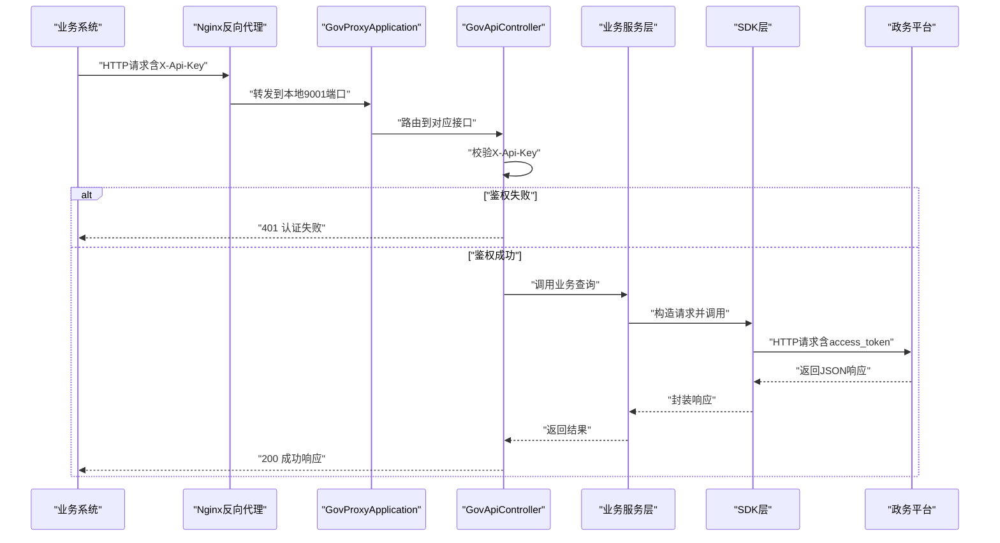

**图表来源**
- [GovApiController.java:1-149](file://ghz-gov-proxy/src/main/java/com/ghz/gov/controller/GovApiController.java#L1-L149)
- [TokenService.java:1-170](file://ghz-gov-proxy/src/main/java/com/ghz/gov/service/TokenService.java#L1-L170)
- [MarriageService.java:1-98](file://ghz-gov-proxy/src/main/java/com/ghz/gov/service/MarriageService.java#L1-L98)
- [SocialInsuranceService.java:1-110](file://ghz-gov-proxy/src/main/java/com/ghz/gov/service/SocialInsuranceService.java#L1-L110)
- [PublicHousingService.java:1-97](file://ghz-gov-proxy/src/main/java/com/ghz/gov/service/PublicHousingService.java#L1-L97)
- [RealEstateService.java:1-97](file://ghz-gov-proxy/src/main/java/com/ghz/gov/service/RealEstateService.java#L1-L97)
- [SdkTokenApp.java:1-47](file://ghz-gov-proxy/src/main/java/com/ghz/gov/sdk/SdkTokenApp.java#L1-L47)
- [SdkMarriageApp.java:1-46](file://ghz-gov-proxy/src/main/java/com/ghz/gov/sdk/SdkMarriageApp.java#L1-L46)
- [nginx-ghz-gov-proxy.conf:1-45](file://ghz-gov-proxy/deploy/nginx-ghz-gov-proxy.conf#L1-L45)

## 详细组件分析

### 启动与配置组件
- 启动类
  - 使用@SpringBootApplication启用自动装配，@EnableScheduling开启定时任务能力，确保Token定时刷新。
- 配置文件
  - 定义服务端口、API Key、日志级别等基础配置。
- 配置绑定
  - 通过@ConfigurationProperties(prefix="gov.proxy")将配置映射到GovProxyConfig，集中管理业务参数。

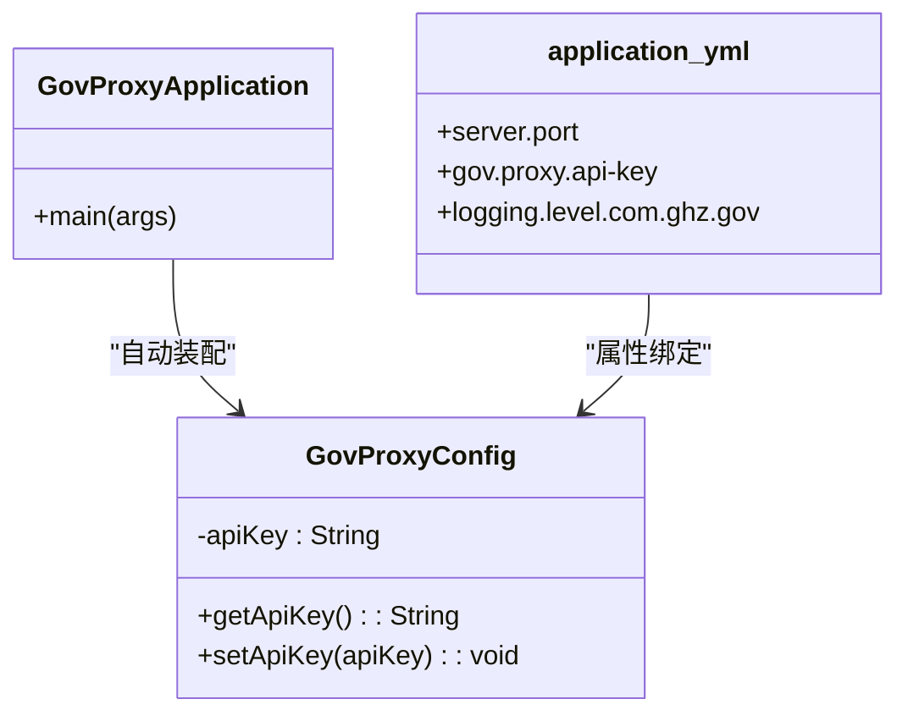

**图表来源**
- [GovProxyApplication.java:1-15](file://ghz-gov-proxy/src/main/java/com/ghz/gov/GovProxyApplication.java#L1-L15)
- [GovProxyConfig.java:1-16](file://ghz-gov-proxy/src/main/java/com/ghz/gov/config/GovProxyConfig.java#L1-L16)
- [application.yml:1-13](file://ghz-gov-proxy/src/main/resources/application.yml#L1-L13)

**章节来源**
- [GovProxyApplication.java:1-15](file://ghz-gov-proxy/src/main/java/com/ghz/gov/GovProxyApplication.java#L1-L15)
- [application.yml:1-13](file://ghz-gov-proxy/src/main/resources/application.yml#L1-L13)
- [GovProxyConfig.java:1-16](file://ghz-gov-proxy/src/main/java/com/ghz/gov/config/GovProxyConfig.java#L1-L16)

### 控制器与鉴权组件
- 接口定义
  - 提供健康检查、婚姻、社保、公租房、不动产查询接口，均要求在请求头携带X-Api-Key。
- 鉴权逻辑
  - 从请求头读取X-Api-Key并与配置中的apiKey比较，不一致则返回401。
- 日志与错误处理
  - 统一记录耗时、结果状态；异常时返回500及错误信息。

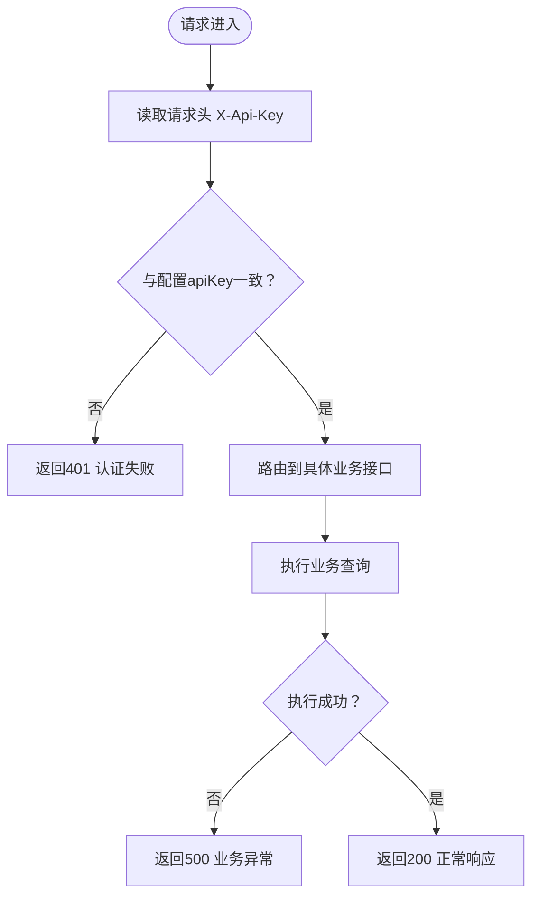

**图表来源**
- [GovApiController.java:1-149](file://ghz-gov-proxy/src/main/java/com/ghz/gov/controller/GovApiController.java#L1-L149)
- [GovProxyConfig.java:1-16](file://ghz-gov-proxy/src/main/java/com/ghz/gov/config/GovProxyConfig.java#L1-L16)

**章节来源**
- [GovApiController.java:1-149](file://ghz-gov-proxy/src/main/java/com/ghz/gov/controller/GovApiController.java#L1-L149)
- [GovProxyConfig.java:1-16](file://ghz-gov-proxy/src/main/java/com/ghz/gov/config/GovProxyConfig.java#L1-L16)

### Token管理与定时刷新
- 设计要点
  - 懒加载获取Token，避免启动即拉取；Token有效期30分钟，提前5分钟刷新；并发场景下使用锁防止重复刷新。
  - 定时任务每25分钟触发一次刷新，保证Token稳定可用。
- 响应解析
  - 解析自定义字段access_token与expires_in，若缺失则抛出异常并记录错误。
- 状态查询
  - 提供Token状态查询接口，便于健康检查与监控。

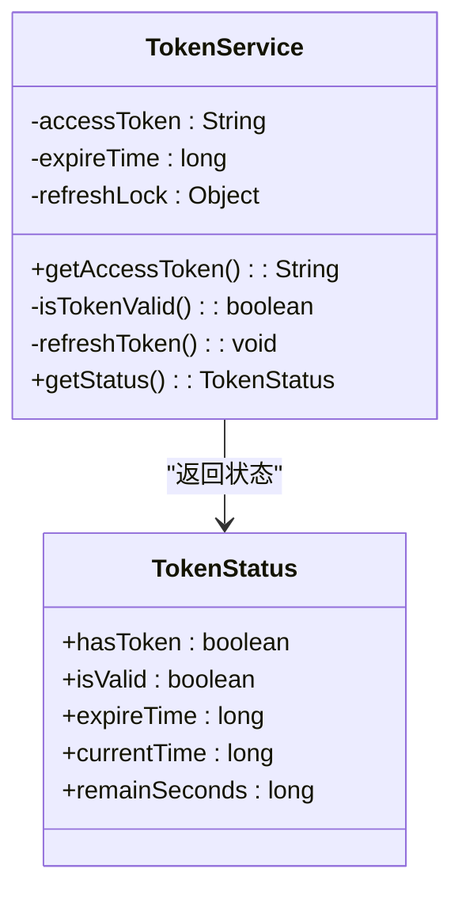

**图表来源**
- [TokenService.java:1-170](file://ghz-gov-proxy/src/main/java/com/ghz/gov/service/TokenService.java#L1-L170)

**章节来源**
- [TokenService.java:1-170](file://ghz-gov-proxy/src/main/java/com/ghz/gov/service/TokenService.java#L1-L170)

### 业务服务层（婚姻/社保/公租房/不动产）
- 统一模式
  - 从TokenService获取access_token，构造请求体，调用对应SDK，解析响应并返回标准化结果。
- 重试策略
  - 对特定超时错误码（如SHD-1004）进行最多3次重试，提升对政务平台偶发超时的容忍度。
- 结果封装
  - 返回包含“是否存在记录”“原始响应”等字段的结果集，便于上层判断与审计。

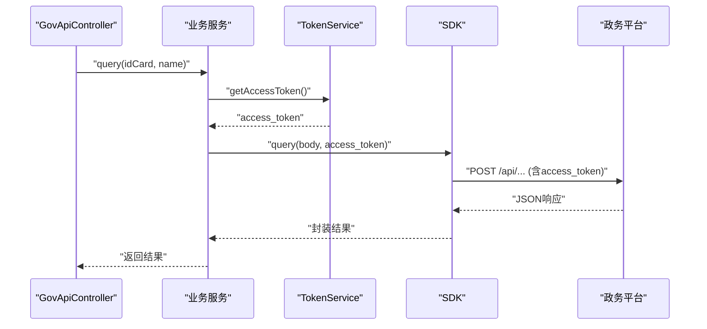

**图表来源**
- [MarriageService.java:1-98](file://ghz-gov-proxy/src/main/java/com/ghz/gov/service/MarriageService.java#L1-L98)
- [SocialInsuranceService.java:1-110](file://ghz-gov-proxy/src/main/java/com/ghz/gov/service/SocialInsuranceService.java#L1-L110)
- [PublicHousingService.java:1-97](file://ghz-gov-proxy/src/main/java/com/ghz/gov/service/PublicHousingService.java#L1-L97)
- [RealEstateService.java:1-97](file://ghz-gov-proxy/src/main/java/com/ghz/gov/service/RealEstateService.java#L1-L97)
- [TokenService.java:1-170](file://ghz-gov-proxy/src/main/java/com/ghz/gov/service/TokenService.java#L1-L170)
- [SdkMarriageApp.java:1-46](file://ghz-gov-proxy/src/main/java/com/ghz/gov/sdk/SdkMarriageApp.java#L1-L46)

**章节来源**
- [MarriageService.java:1-98](file://ghz-gov-proxy/src/main/java/com/ghz/gov/service/MarriageService.java#L1-L98)
- [SocialInsuranceService.java:1-110](file://ghz-gov-proxy/src/main/java/com/ghz/gov/service/SocialInsuranceService.java#L1-L110)
- [PublicHousingService.java:1-97](file://ghz-gov-proxy/src/main/java/com/ghz/gov/service/PublicHousingService.java#L1-L97)
- [RealEstateService.java:1-97](file://ghz-gov-proxy/src/main/java/com/ghz/gov/service/RealEstateService.java#L1-L97)

### SDK层与外部平台通信
- SDK初始化
  - 设置HTTP连接、读写超时，初始化ApiClient；配置Host、端口、上下文路径、签名策略与密钥材料。
- Token获取
  - 通过SdkTokenApp发起OAuth2客户端凭证模式请求，获取access_token。
- 业务查询
  - 通过SdkMarriageApp等SDK构造请求，携带access_token进行业务查询。

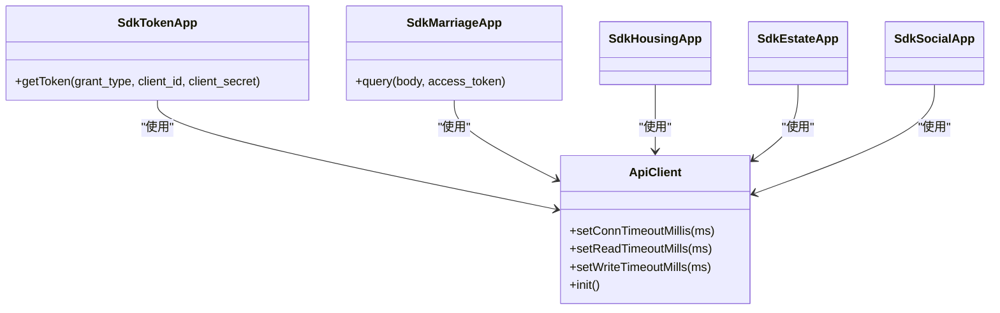

**图表来源**
- [SdkTokenApp.java:1-47](file://ghz-gov-proxy/src/main/java/com/ghz/gov/sdk/SdkTokenApp.java#L1-L47)
- [SdkMarriageApp.java:1-46](file://ghz-gov-proxy/src/main/java/com/ghz/gov/sdk/SdkMarriageApp.java#L1-L46)

**章节来源**
- [SdkTokenApp.java:1-47](file://ghz-gov-proxy/src/main/java/com/ghz/gov/sdk/SdkTokenApp.java#L1-L47)
- [SdkMarriageApp.java:1-46](file://ghz-gov-proxy/src/main/java/com/ghz/gov/sdk/SdkMarriageApp.java#L1-L46)

### 部署与运维组件
- 启停脚本
  - start.sh：设置JVM参数、守护进程启动、健康检查、日志输出；stop.sh：优雅停止并强制回收。
- Nginx反向代理
  - 监听8088端口，转发到本地9001；透传关键头部；设置超时与缓冲策略；健康检查直通。

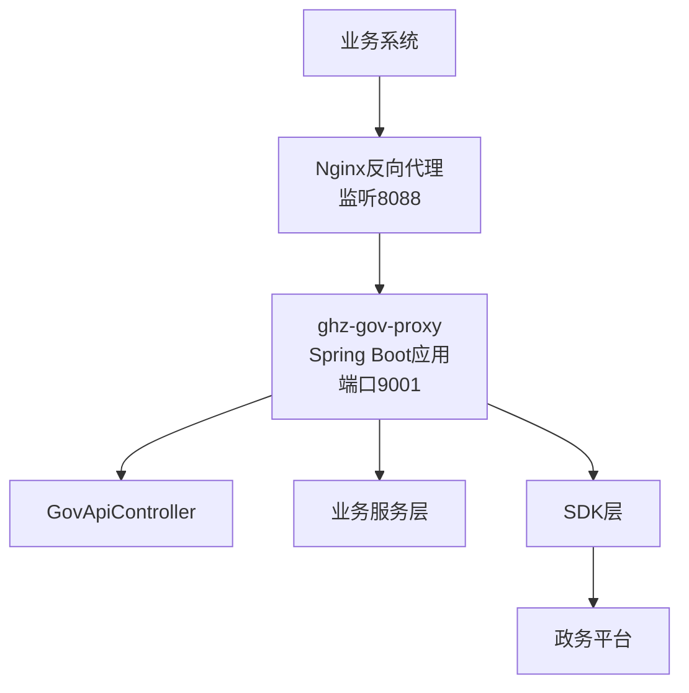

**图表来源**
- [start.sh:1-47](file://ghz-gov-proxy/deploy/start.sh#L1-L47)
- [stop.sh:1-42](file://ghz-gov-proxy/deploy/stop.sh#L1-L42)
- [nginx-ghz-gov-proxy.conf:1-45](file://ghz-gov-proxy/deploy/nginx-ghz-gov-proxy.conf#L1-L45)

**章节来源**
- [start.sh:1-47](file://ghz-gov-proxy/deploy/start.sh#L1-L47)
- [stop.sh:1-42](file://ghz-gov-proxy/deploy/stop.sh#L1-L42)
- [nginx-ghz-gov-proxy.conf:1-45](file://ghz-gov-proxy/deploy/nginx-ghz-gov-proxy.conf#L1-L45)

## 依赖关系分析
- 外部依赖
  - Spring Boot Web Starter、Apache HttpClient、Fastjson、Gson、Java-WebSocket、讯飞Shield SDK等。
- 内部耦合
  - 控制器依赖服务层；服务层依赖TokenService与SDK层；SDK层依赖HttpClient与签名工具。
- 循环依赖
  - 当前结构为单向依赖，无循环依赖风险。

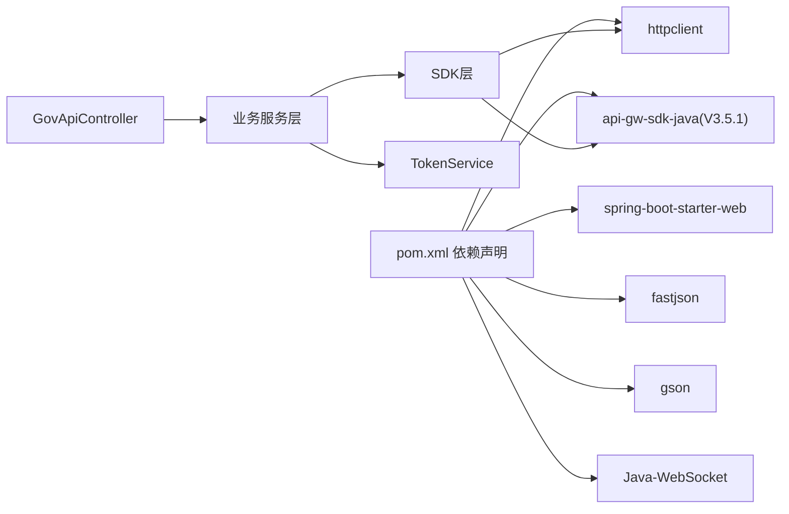

**图表来源**
- [pom.xml:1-108](file://ghz-gov-proxy/pom.xml#L1-L108)
- [GovApiController.java:1-149](file://ghz-gov-proxy/src/main/java/com/ghz/gov/controller/GovApiController.java#L1-L149)
- [TokenService.java:1-170](file://ghz-gov-proxy/src/main/java/com/ghz/gov/service/TokenService.java#L1-L170)
- [MarriageService.java:1-98](file://ghz-gov-proxy/src/main/java/com/ghz/gov/service/MarriageService.java#L1-L98)

**章节来源**
- [pom.xml:1-108](file://ghz-gov-proxy/pom.xml#L1-L108)

## 性能考虑
- 超时与缓冲
  - SDK层设置连接、读、写超时；Nginx设置连接与读取超时，兼顾政务平台响应慢的特点。
- 重试策略
  - 业务服务层对特定超时错误进行有限次数重试，降低瞬时波动影响。
- Token缓存与刷新
  - 懒加载与定时刷新结合，减少不必要的频繁获取；并发刷新加锁，避免资源竞争。
- JVM与线程
  - 启动脚本使用G1 GC与较小堆内存，适配轻量接口服务场景。

[本节为通用性能建议，无需特定文件引用]

## 故障排查指南
- 健康检查
  - 通过GET /api/v1/gov/ping确认服务就绪；Nginx配置中提供直通路径。
- 认证失败
  - 确认请求头X-Api-Key与配置一致；检查配置文件加载顺序与环境变量覆盖。
- 超时与重试
  - 关注日志中“SHD-1004”等超时信息；确认Nginx与SDK超时配置是否合理。
- Token异常
  - 查看Token状态接口与日志；确认客户端凭证与平台返回字段解析。
- 启停问题
  - 使用stop.sh优雅停止；若存在僵尸进程，检查run.pid与端口占用。

**章节来源**
- [GovApiController.java:1-149](file://ghz-gov-proxy/src/main/java/com/ghz/gov/controller/GovApiController.java#L1-L149)
- [TokenService.java:1-170](file://ghz-gov-proxy/src/main/java/com/ghz/gov/service/TokenService.java#L1-L170)
- [start.sh:1-47](file://ghz-gov-proxy/deploy/start.sh#L1-L47)
- [stop.sh:1-42](file://ghz-gov-proxy/deploy/stop.sh#L1-L42)
- [nginx-ghz-gov-proxy.conf:1-45](file://ghz-gov-proxy/deploy/nginx-ghz-gov-proxy.conf#L1-L45)

## 结论
该政务数据代理服务通过清晰的分层架构与完善的运维脚本，实现了对多个政务平台接口的统一代理与安全访问。其核心优势在于：
- 统一鉴权与标准化接口，简化业务系统集成；
- Token懒加载与定时刷新，保障稳定性；
- 业务服务层的重试与超时控制，提升对平台波动的容忍度；
- Nginx反向代理与健康检查直通，便于公网接入与运维观测。

[本节为总结性内容，无需特定文件引用]

## 附录

### 服务启动流程与时序
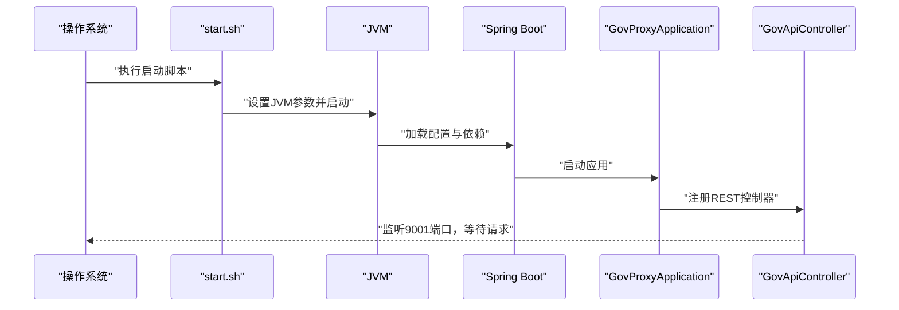

**图表来源**
- [start.sh:1-47](file://ghz-gov-proxy/deploy/start.sh#L1-L47)
- [GovProxyApplication.java:1-15](file://ghz-gov-proxy/src/main/java/com/ghz/gov/GovProxyApplication.java#L1-L15)
- [application.yml:1-13](file://ghz-gov-proxy/src/main/resources/application.yml#L1-L13)

### 部署拓扑说明
- 公网入口：Nginx监听8088端口，转发至内网9001端口；
- 内网服务：Spring Boot应用监听9001端口，提供REST接口；
- 外部平台：政务平台API，通过SDK层HTTP访问。

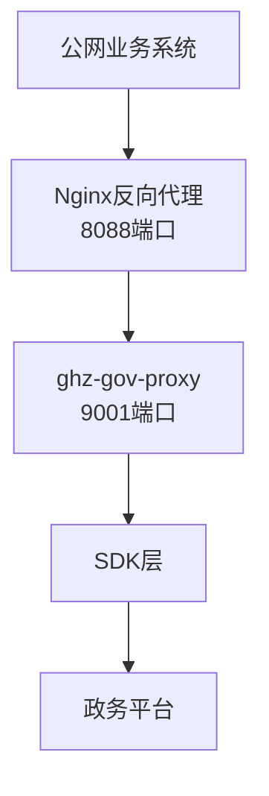

**图表来源**
- [nginx-ghz-gov-proxy.conf:1-45](file://ghz-gov-proxy/deploy/nginx-ghz-gov-proxy.conf#L1-L45)
- [application.yml:1-13](file://ghz-gov-proxy/src/main/resources/application.yml#L1-L13)