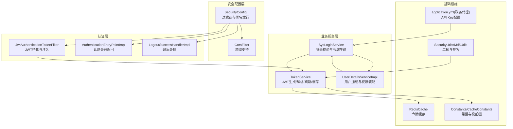
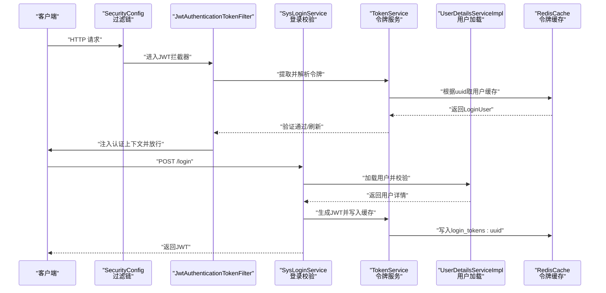
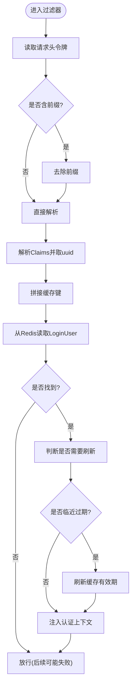
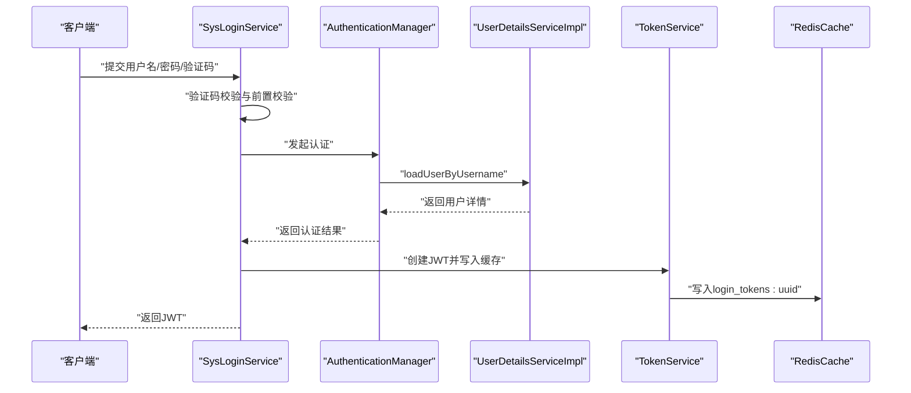
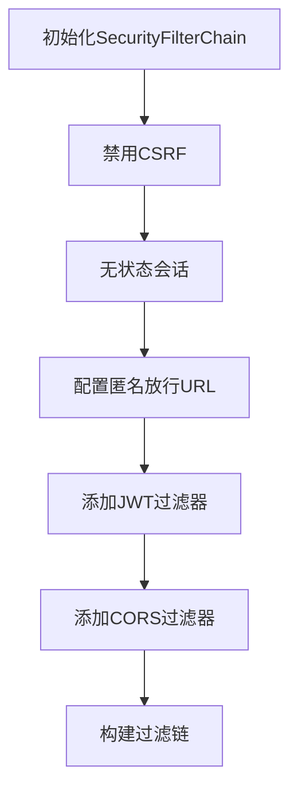
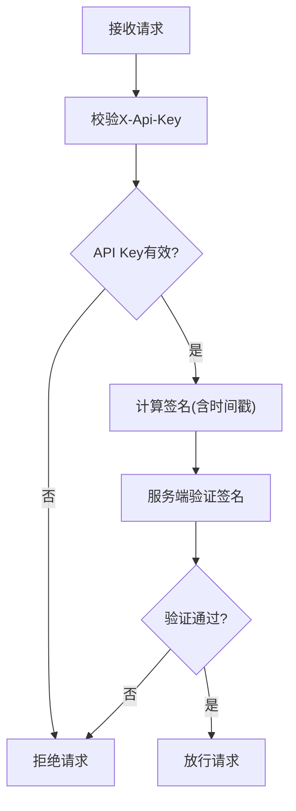
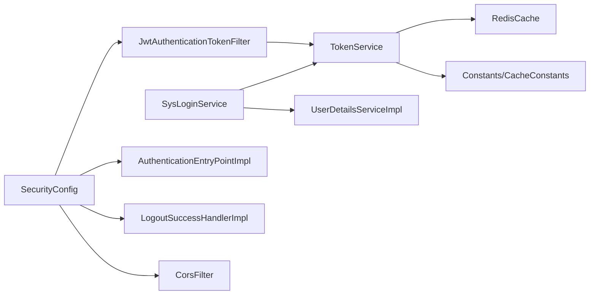
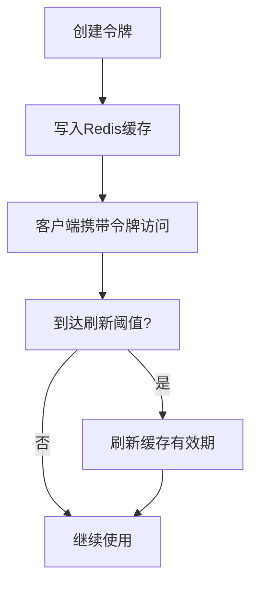

# 安全认证机制

<cite>
**本文引用的文件**
- [JwtAuthenticationTokenFilter.java](file://ruoyi-framework/src/main/java/com/ruoyi/framework/security/filter/JwtAuthenticationTokenFilter.java)
- [TokenService.java](file://ruoyi-framework/src/main/java/com/ruoyi/framework/web/service/TokenService.java)
- [SysLoginService.java](file://ruoyi-framework/src/main/java/com/ruoyi/framework/web/service/SysLoginService.java)
- [SecurityConfig.java](file://ruoyi-framework/src/main/java/com/ruoyi/framework/config/SecurityConfig.java)
- [AuthenticationEntryPointImpl.java](file://ruoyi-framework/src/main/java/com/ruoyi/framework/security/handle/AuthenticationEntryPointImpl.java)
- [LogoutSuccessHandlerImpl.java](file://ruoyi-framework/src/main/java/com/ruoyi/framework/security/handle/LogoutSuccessHandlerImpl.java)
- [Constants.java](file://ruoyi-common/src/main/java/com/ruoyi/common/constant/Constants.java)
- [CacheConstants.java](file://ruoyi-common/src/main/java/com/ruoyi/common/constant/CacheConstants.java)
- [SecurityUtils.java](file://ruoyi-common/src/main/java/com/ruoyi/common/utils/SecurityUtils.java)
- [Md5Utils.java](file://ruoyi-common/src/main/java/com/ruoyi/common/utils/sign/Md5Utils.java)
- [UserDetailsServiceImpl.java](file://ruoyi-framework/src/main/java/com/ruoyi/framework/web/service/UserDetailsServiceImpl.java)
- [application.yml（政务代理）](file://ghz-gov-proxy/src/main/resources/application.yml)
</cite>

## 目录
1. [引言](#引言)
2. [项目结构](#项目结构)
3. [核心组件](#核心组件)
4. [架构总览](#架构总览)
5. [详细组件分析](#详细组件分析)
6. [依赖分析](#依赖分析)
7. [性能考虑](#性能考虑)
8. [故障排查指南](#故障排查指南)
9. [结论](#结论)
10. [附录](#附录)

## 引言
本文件面向政务数据接口的安全认证体系，系统化阐述令牌管理、身份验证、权限控制与防篡改机制。重点覆盖基于 JWT 的令牌生成、验证与刷新流程，结合 Redis 缓存实现令牌生命周期管理；同时说明 API Key 校验、数字签名与时间戳校验等防篡改技术，并给出数据加密传输、敏感信息脱敏与审计日志的隐私保护建议。文档还提供安全配置参数、证书管理、访问控制策略的实施细节，以及安全最佳实践、风险评估与事件处置的运维指导。

## 项目结构
围绕安全认证的关键模块分布如下：
- 安全配置与过滤链：Spring Security 配置、跨域过滤器、匿名放行 URL、无状态会话策略
- 认证过滤器：JWT 请求拦截与解析、用户上下文注入
- 登录与令牌服务：登录校验、令牌签发与刷新、Redis 缓存与过期策略
- 用户详情加载：按用户名加载用户、密码校验与权限装配
- 常量与工具：令牌头部、前缀、用户代理采集、MD5 签名工具
- 政务代理 API Key：后端服务间调用的 API Key 校验

图表来源
- [SecurityConfig.java:85-124](file://ruoyi-framework/src/main/java/com/ruoyi/framework/config/SecurityConfig.java#L85-L124)
- [JwtAuthenticationTokenFilter.java:24-44](file://ruoyi-framework/src/main/java/com/ruoyi/framework/security/filter/JwtAuthenticationTokenFilter.java#L24-L44)
- [SysLoginService.java:36-100](file://ruoyi-framework/src/main/java/com/ruoyi/framework/web/service/SysLoginService.java#L36-L100)
- [TokenService.java:31-233](file://ruoyi-framework/src/main/java/com/ruoyi/framework/web/service/TokenService.java#L31-L233)
- [UserDetailsServiceImpl.java:23-67](file://ruoyi-framework/src/main/java/com/ruoyi/framework/web/service/UserDetailsServiceImpl.java#L23-L67)
- [Constants.java:100-121](file://ruoyi-common/src/main/java/com/ruoyi/common/constant/Constants.java#L100-L121)
- [CacheConstants.java:8-44](file://ruoyi-common/src/main/java/com/ruoyi/common/constant/CacheConstants.java#L8-L44)
- [application.yml（政务代理）:4-8](file://ghz-gov-proxy/src/main/resources/application.yml#L4-L8)

章节来源
- [SecurityConfig.java:85-124](file://ruoyi-framework/src/main/java/com/ruoyi/framework/config/SecurityConfig.java#L85-L124)
- [JwtAuthenticationTokenFilter.java:24-44](file://ruoyi-framework/src/main/java/com/ruoyi/framework/security/filter/JwtAuthenticationTokenFilter.java#L24-L44)
- [SysLoginService.java:36-100](file://ruoyi-framework/src/main/java/com/ruoyi/framework/web/service/SysLoginService.java#L36-L100)
- [TokenService.java:31-233](file://ruoyi-framework/src/main/java/com/ruoyi/framework/web/service/TokenService.java#L31-L233)
- [UserDetailsServiceImpl.java:23-67](file://ruoyi-framework/src/main/java/com/ruoyi/framework/web/service/UserDetailsServiceImpl.java#L23-L67)
- [Constants.java:100-121](file://ruoyi-common/src/main/java/com/ruoyi/common/constant/Constants.java#L100-L121)
- [CacheConstants.java:8-44](file://ruoyi-common/src/main/java/com/ruoyi/common/constant/CacheConstants.java#L8-L44)
- [application.yml（政务代理）:4-8](file://ghz-gov-proxy/src/main/resources/application.yml#L4-L8)

## 核心组件
- 安全配置与过滤链：禁用 CSRF、设置无状态会话、统一异常处理、跨域支持、匿名放行规则
- JWT 认证过滤器：从请求头提取令牌、解析用户信息、注入认证上下文
- 登录服务：验证码校验、登录前置校验、认证管理器、生成令牌
- 令牌服务：JWT 构建与解析、Redis 缓存、令牌刷新阈值、用户代理采集
- 用户详情服务：按用户名加载用户、状态校验、密码校验、权限装配
- 常量与工具：令牌头部与前缀、缓存键前缀、MD5 签名工具、安全工具类
- 政务代理 API Key：后端服务间调用的 API Key 校验

章节来源
- [SecurityConfig.java:85-124](file://ruoyi-framework/src/main/java/com/ruoyi/framework/config/SecurityConfig.java#L85-L124)
- [JwtAuthenticationTokenFilter.java:24-44](file://ruoyi-framework/src/main/java/com/ruoyi/framework/security/filter/JwtAuthenticationTokenFilter.java#L24-L44)
- [SysLoginService.java:36-100](file://ruoyi-framework/src/main/java/com/ruoyi/framework/web/service/SysLoginService.java#L36-L100)
- [TokenService.java:31-233](file://ruoyi-framework/src/main/java/com/ruoyi/framework/web/service/TokenService.java#L31-L233)
- [UserDetailsServiceImpl.java:23-67](file://ruoyi-framework/src/main/java/com/ruoyi/framework/web/service/UserDetailsServiceImpl.java#L23-L67)
- [Constants.java:100-121](file://ruoyi-common/src/main/java/com/ruoyi/common/constant/Constants.java#L100-L121)
- [CacheConstants.java:8-44](file://ruoyi-common/src/main/java/com/ruoyi/common/constant/CacheConstants.java#L8-L44)
- [application.yml（政务代理）:4-8](file://ghz-gov-proxy/src/main/resources/application.yml#L4-L8)

## 架构总览
下图展示从请求进入至认证完成的整体流程，包括登录、JWT 生成与缓存、请求拦截与验证、退出清理等环节。

图表来源
- [SecurityConfig.java:85-124](file://ruoyi-framework/src/main/java/com/ruoyi/framework/config/SecurityConfig.java#L85-L124)
- [JwtAuthenticationTokenFilter.java:30-42](file://ruoyi-framework/src/main/java/com/ruoyi/framework/security/filter/JwtAuthenticationTokenFilter.java#L30-L42)
- [SysLoginService.java:63-100](file://ruoyi-framework/src/main/java/com/ruoyi/framework/web/service/SysLoginService.java#L63-L100)
- [TokenService.java:62-155](file://ruoyi-framework/src/main/java/com/ruoyi/framework/web/service/TokenService.java#L62-L155)
- [UserDetailsServiceImpl.java:37-65](file://ruoyi-framework/src/main/java/com/ruoyi/framework/web/service/UserDetailsServiceImpl.java#L37-L65)

## 详细组件分析

### 组件A：JWT 认证过滤器
职责与流程
- 从请求头读取令牌，去除前缀
- 通过 TokenService 解析并校验用户信息
- 若未设置认证上下文，则注入 UsernamePasswordAuthenticationToken
- 在令牌剩余有效期不足阈值时触发刷新

图表来源
- [JwtAuthenticationTokenFilter.java:30-42](file://ruoyi-framework/src/main/java/com/ruoyi/framework/security/filter/JwtAuthenticationTokenFilter.java#L30-L42)
- [TokenService.java:62-83](file://ruoyi-framework/src/main/java/com/ruoyi/framework/web/service/TokenService.java#L62-L83)
- [TokenService.java:133-141](file://ruoyi-framework/src/main/java/com/ruoyi/framework/web/service/TokenService.java#L133-L141)

章节来源
- [JwtAuthenticationTokenFilter.java:24-44](file://ruoyi-framework/src/main/java/com/ruoyi/framework/security/filter/JwtAuthenticationTokenFilter.java#L24-L44)
- [TokenService.java:62-155](file://ruoyi-framework/src/main/java/com/ruoyi/framework/web/service/TokenService.java#L62-L155)

### 组件B：登录与令牌服务
职责与流程
- 登录校验：验证码校验、前置校验（长度、范围、黑名单）、认证管理器
- 用户加载：按用户名查询、状态与删除标志校验、密码校验、权限装配
- 令牌生成：构建JWT载荷（uuid、用户名），签名算法，写入Redis缓存
- 令牌刷新：临近过期自动刷新缓存有效期

图表来源
- [SysLoginService.java:63-100](file://ruoyi-framework/src/main/java/com/ruoyi/framework/web/service/SysLoginService.java#L63-L100)
- [UserDetailsServiceImpl.java:37-65](file://ruoyi-framework/src/main/java/com/ruoyi/framework/web/service/UserDetailsServiceImpl.java#L37-L65)
- [TokenService.java:114-155](file://ruoyi-framework/src/main/java/com/ruoyi/framework/web/service/TokenService.java#L114-L155)

章节来源
- [SysLoginService.java:36-177](file://ruoyi-framework/src/main/java/com/ruoyi/framework/web/service/SysLoginService.java#L36-L177)
- [UserDetailsServiceImpl.java:23-67](file://ruoyi-framework/src/main/java/com/ruoyi/framework/web/service/UserDetailsServiceImpl.java#L23-L67)
- [TokenService.java:114-155](file://ruoyi-framework/src/main/java/com/ruoyi/framework/web/service/TokenService.java#L114-L155)

### 组件C：安全配置与异常处理
职责与策略
- 禁用 CSRF、无状态会话、统一异常处理（未授权）
- 允许匿名访问的路径（登录、注册、验证码、静态资源、Swagger、H5/app 接口）
- 添加 JWT 与 CORS 过滤器，保证跨域与认证顺序

图表来源
- [SecurityConfig.java:85-124](file://ruoyi-framework/src/main/java/com/ruoyi/framework/config/SecurityConfig.java#L85-L124)

章节来源
- [SecurityConfig.java:85-124](file://ruoyi-framework/src/main/java/com/ruoyi/framework/config/SecurityConfig.java#L85-L124)

### 组件D：API Key 与防篡改机制
- 政务代理 API Key：后端服务调用时需在请求头携带 X-Api-Key，配置于应用配置文件
- 数字签名：提供 MD5 工具类，可用于对请求参数进行签名以防止篡改
- 时间戳校验：建议在签名参数中加入时间戳并在服务端进行窗口校验（具体实现可扩展）

图表来源
- [application.yml（政务代理）:7-8](file://ghz-gov-proxy/src/main/resources/application.yml#L7-L8)
- [Md5Utils.java:13-68](file://ruoyi-common/src/main/java/com/ruoyi/common/utils/sign/Md5Utils.java#L13-L68)

章节来源
- [application.yml（政务代理）:4-8](file://ghz-gov-proxy/src/main/resources/application.yml#L4-L8)
- [Md5Utils.java:13-68](file://ruoyi-common/src/main/java/com/ruoyi/common/utils/sign/Md5Utils.java#L13-L68)

## 依赖分析
- 组件耦合
  - JwtAuthenticationTokenFilter 依赖 TokenService
  - SysLoginService 依赖 AuthenticationManager、UserDetailsServiceImpl、TokenService
  - TokenService 依赖 RedisCache、Constants、CacheConstants
  - SecurityConfig 依赖 JwtAuthenticationTokenFilter、AuthenticationEntryPointImpl、LogoutSuccessHandlerImpl、CorsFilter
- 外部依赖
  - Spring Security、JWT 库、Redis
- 潜在风险
  - 令牌有效期与刷新阈值需与缓存过期保持一致
  - API Key 配置需严格保密，避免硬编码在代码中

图表来源
- [JwtAuthenticationTokenFilter.java:27-28](file://ruoyi-framework/src/main/java/com/ruoyi/framework/security/filter/JwtAuthenticationTokenFilter.java#L27-L28)
- [TokenService.java:54-55](file://ruoyi-framework/src/main/java/com/ruoyi/framework/web/service/TokenService.java#L54-L55)
- [SysLoginService.java:40-43](file://ruoyi-framework/src/main/java/com/ruoyi/framework/web/service/SysLoginService.java#L40-L43)
- [SecurityConfig.java:46-53](file://ruoyi-framework/src/main/java/com/ruoyi/framework/config/SecurityConfig.java#L46-L53)

章节来源
- [JwtAuthenticationTokenFilter.java:24-44](file://ruoyi-framework/src/main/java/com/ruoyi/framework/security/filter/JwtAuthenticationTokenFilter.java#L24-L44)
- [TokenService.java:31-233](file://ruoyi-framework/src/main/java/com/ruoyi/framework/web/service/TokenService.java#L31-L233)
- [SysLoginService.java:36-177](file://ruoyi-framework/src/main/java/com/ruoyi/framework/web/service/SysLoginService.java#L36-L177)
- [SecurityConfig.java:27-135](file://ruoyi-framework/src/main/java/com/ruoyi/framework/config/SecurityConfig.java#L27-L135)

## 性能考虑
- 令牌解析与缓存命中：优先从 Redis 读取用户信息，减少数据库压力
- 刷新策略：临近过期自动刷新，降低频繁登录带来的抖动
- 无状态设计：移除 Session，降低服务器内存占用与水平扩展复杂度
- 过滤器顺序：确保 CORS 在 JWT 之前，避免跨域导致的认证失败

## 故障排查指南
- 未授权访问
  - 检查请求头是否包含正确的令牌前缀与令牌值
  - 确认匿名放行 URL 配置是否覆盖目标路径
- 登录失败
  - 核对验证码是否正确且未过期
  - 检查用户名/密码长度与格式、是否在黑名单
- 令牌过期或刷新异常
  - 核对令牌有效期与刷新阈值配置
  - 检查 Redis 连接与键空间是否正常
- 退出未生效
  - 确认退出处理器是否删除了缓存中的用户记录

章节来源
- [AuthenticationEntryPointImpl.java:26-33](file://ruoyi-framework/src/main/java/com/ruoyi/framework/security/handle/AuthenticationEntryPointImpl.java#L26-L33)
- [LogoutSuccessHandlerImpl.java:38-51](file://ruoyi-framework/src/main/java/com/ruoyi/framework/security/handle/LogoutSuccessHandlerImpl.java#L38-L51)
- [SysLoginService.java:110-165](file://ruoyi-framework/src/main/java/com/ruoyi/framework/web/service/SysLoginService.java#L110-L165)
- [TokenService.java:133-155](file://ruoyi-framework/src/main/java/com/ruoyi/framework/web/service/TokenService.java#L133-L155)

## 结论
本安全认证体系以 Spring Security 为核心，结合 JWT 与 Redis 实现高可用、可扩展的身份认证与权限控制。通过明确的过滤链配置、严格的登录校验、令牌生命周期管理与 API Key 校验，满足政务数据接口对安全性与合规性的要求。建议在生产环境中进一步强化密钥轮换、审计日志、速率限制与入侵检测等纵深防御措施。

## 附录

### 安全配置参数与实施要点
- 令牌配置
  - 令牌头部字段：由配置项决定，默认使用“Bearer ”前缀
  - 令牌密钥：用于 JWT 签名，需妥善保管与轮换
  - 令牌有效期：分钟级，结合刷新阈值实现平滑续期
- 缓存配置
  - 登录用户缓存键前缀：login_tokens:uuid
  - 验证码缓存键前缀：captcha_codes:uuid
- 匿名放行
  - 登录、注册、验证码、静态资源、Swagger、H5/app 接口等
- API Key
  - 后端服务调用需在请求头携带 X-Api-Key
- 证书与加密
  - 建议启用 HTTPS 并配置强密码套件
  - 密钥材料建议使用硬件安全模块（HSM）或密钥管理系统（KMS）

章节来源
- [TokenService.java:36-46](file://ruoyi-framework/src/main/java/com/ruoyi/framework/web/service/TokenService.java#L36-L46)
- [CacheConstants.java:12-18](file://ruoyi-common/src/main/java/com/ruoyi/common/constant/CacheConstants.java#L12-L18)
- [Constants.java:104-106](file://ruoyi-common/src/main/java/com/ruoyi/common/constant/Constants.java#L104-L106)
- [SecurityConfig.java:100-114](file://ruoyi-framework/src/main/java/com/ruoyi/framework/config/SecurityConfig.java#L100-L114)
- [application.yml（政务代理）:7-8](file://ghz-gov-proxy/src/main/resources/application.yml#L7-L8)

### 令牌生命周期与刷新流程

图表来源
- [TokenService.java:114-155](file://ruoyi-framework/src/main/java/com/ruoyi/framework/web/service/TokenService.java#L114-L155)

### 权限控制与审计日志
- 权限控制
  - 基于注解的方法级安全（prePostEnabled、securedEnabled）
  - 用户权限集合与角色集合匹配
- 审计日志
  - 登录成功/失败、退出等事件异步记录
  - 建议扩展接口访问日志与敏感操作审计

章节来源
- [SecurityConfig.java:27](file://ruoyi-framework/src/main/java/com/ruoyi/framework/config/SecurityConfig.java#L27)
- [SysLoginService.java:95-96](file://ruoyi-framework/src/main/java/com/ruoyi/framework/web/service/SysLoginService.java#L95-L96)
- [LogoutSuccessHandlerImpl.java:48-49](file://ruoyi-framework/src/main/java/com/ruoyi/framework/security/handle/LogoutSuccessHandlerImpl.java#L48-L49)