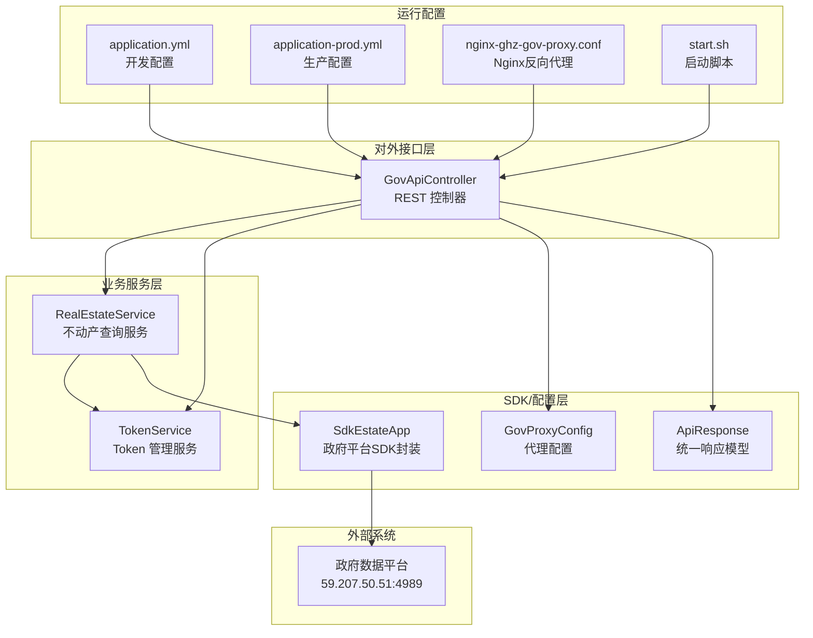
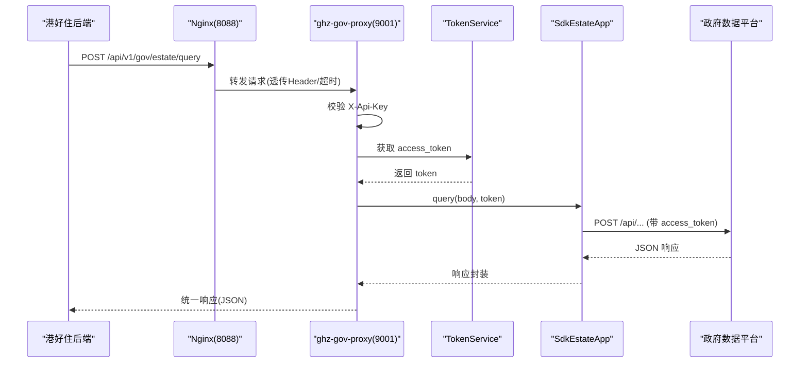
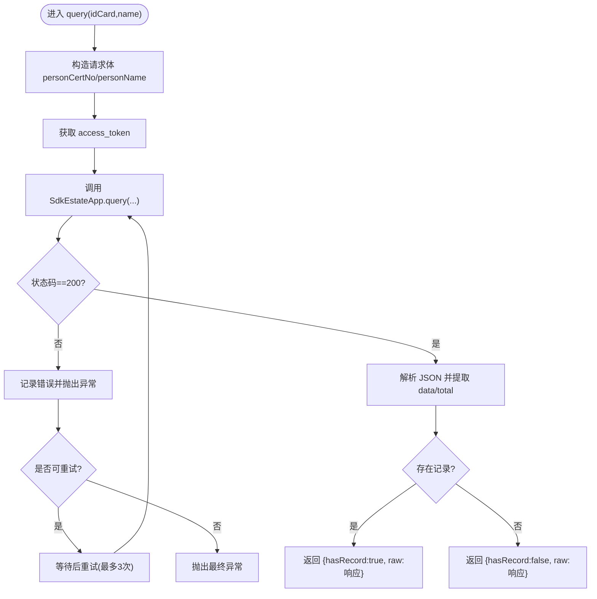
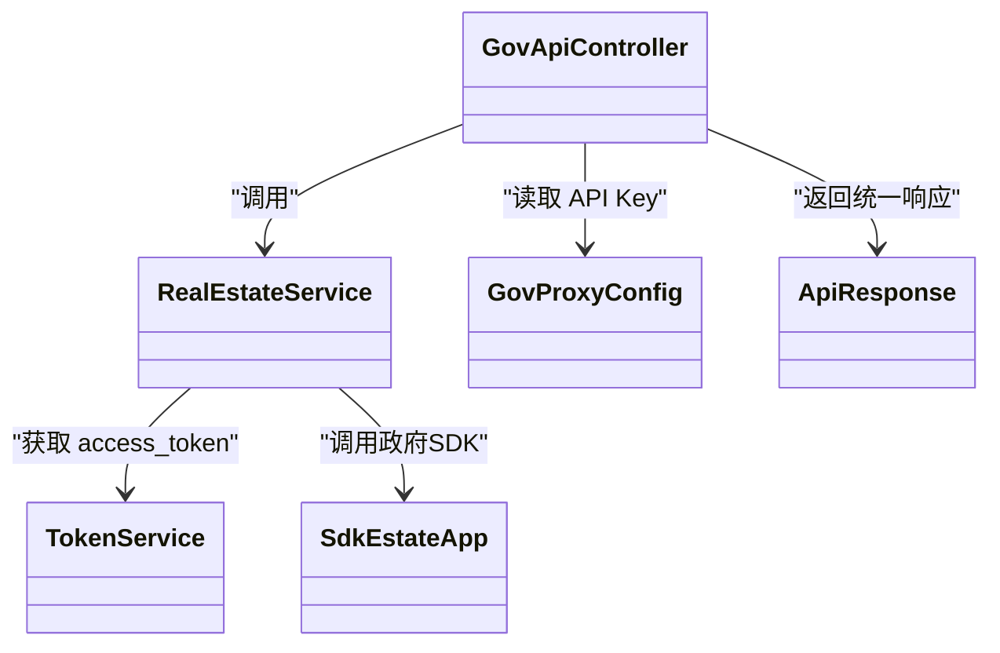

# 不动产登记接口

<cite>
**本文引用的文件**
- [GovApiController.java](file://ghz-gov-proxy/src/main/java/com/ghz/gov/controller/GovApiController.java)
- [RealEstateService.java](file://ghz-gov-proxy/src/main/java/com/ghz/gov/service/RealEstateService.java)
- [SdkEstateApp.java](file://ghz-gov-proxy/src/main/java/com/ghz/gov/sdk/SdkEstateApp.java)
- [TokenService.java](file://ghz-gov-proxy/src/main/java/com/ghz/gov/service/TokenService.java)
- [GovProxyConfig.java](file://ghz-gov-proxy/src/main/java/com/ghz/gov/config/GovProxyConfig.java)
- [ApiResponse.java](file://ghz-gov-proxy/src/main/java/com/ghz/gov/dto/ApiResponse.java)
- [application.yml](file://ghz-gov-proxy/src/main/resources/application.yml)
- [application-prod.yml](file://ghz-gov-proxy/deploy/application-prod.yml)
- [nginx-ghz-gov-proxy.conf](file://ghz-gov-proxy/deploy/nginx-ghz-gov-proxy.conf)
- [start.sh](file://ghz-gov-proxy/deploy/start.sh)
- [README.md](file://ghz-gov-proxy/deploy/README.md)
- [港好住后端对接指南.md](file://ghz-gov-proxy/deploy/港好住后端对接指南.md)
- [授权_不动产登记信息V1_4D90543CC15F4933A0614AE2B9B2935B_doc.html](file://jiekou-sdk/java-3/doc/授权_不动产登记信息V1_4D90543CC15F4933A0614AE2B9B2935B_doc.html)
- [GlobalExceptionHandler.java](file://ruoyi-framework/src/main/java/com/ruoyi/framework/web/exception/GlobalExceptionHandler.java)
</cite>

## 目录
1. [简介](#简介)
2. [项目结构](#项目结构)
3. [核心组件](#核心组件)
4. [架构总览](#架构总览)
5. [详细组件分析](#详细组件分析)
6. [依赖关系分析](#依赖关系分析)
7. [性能考虑](#性能考虑)
8. [故障排查指南](#故障排查指南)
9. [结论](#结论)
10. [附录](#附录)

## 简介
本技术文档面向“不动产登记信息查询”接口的实现与集成，围绕以下目标展开：
- 全面阐述接口实现方案与数据处理逻辑
- 深入解析房屋坐落、登记时间等关键字段
- 说明参数校验、数据格式转换与编码处理
- 描述与政府数据平台的对接协议、通信加密与数字签名要点
- 提供单套房屋查询与多套房屋批量查询的调用示例
- 解释错误分类、异常处理与数据缓存策略

## 项目结构
该接口位于“ghz-gov-proxy”子模块中，采用Spring Boot工程组织，控制器负责对外暴露REST API，服务层封装业务逻辑，SDK层封装与政府平台的通信细节，配置层提供安全与运行参数。

图表来源
- [GovApiController.java:1-149](file://ghz-gov-proxy/src/main/java/com/ghz/gov/controller/GovApiController.java#L1-L149)
- [RealEstateService.java:1-97](file://ghz-gov-proxy/src/main/java/com/ghz/gov/service/RealEstateService.java#L1-L97)
- [SdkEstateApp.java:1-47](file://ghz-gov-proxy/src/main/java/com/ghz/gov/sdk/SdkEstateApp.java#L1-L47)
- [TokenService.java:1-170](file://ghz-gov-proxy/src/main/java/com/ghz/gov/service/TokenService.java#L1-L170)
- [GovProxyConfig.java:1-16](file://ghz-gov-proxy/src/main/java/com/ghz/gov/config/GovProxyConfig.java#L1-L16)
- [ApiResponse.java:1-34](file://ghz-gov-proxy/src/main/java/com/ghz/gov/dto/ApiResponse.java#L1-L34)
- [application.yml:1-13](file://ghz-gov-proxy/src/main/resources/application.yml#L1-L13)
- [application-prod.yml:1-26](file://ghz-gov-proxy/deploy/application-prod.yml#L1-L26)
- [nginx-ghz-gov-proxy.conf:1-45](file://ghz-gov-proxy/deploy/nginx-ghz-gov-proxy.conf#L1-L45)
- [start.sh:1-47](file://ghz-gov-proxy/deploy/start.sh#L1-L47)

章节来源
- [GovApiController.java:1-149](file://ghz-gov-proxy/src/main/java/com/ghz/gov/controller/GovApiController.java#L1-L149)
- [application.yml:1-13](file://ghz-gov-proxy/src/main/resources/application.yml#L1-L13)

## 核心组件
- 接口控制器：提供REST端点，负责鉴权、参数校验、调用服务层并返回统一响应。
- 不动产查询服务：封装请求构建、调用政府SDK、解析响应、重试与异常处理。
- 政府SDK封装：封装HTTP客户端、超时设置、签名与加解密参数、访问令牌传递。
- Token服务：拉取与刷新访问令牌，保证线程安全与定时刷新。
- 统一响应模型：规范返回结构，便于前端消费。
- 配置与部署：API Key、Nginx反代、启动脚本与生产配置。

章节来源
- [RealEstateService.java:1-97](file://ghz-gov-proxy/src/main/java/com/ghz/gov/service/RealEstateService.java#L1-L97)
- [SdkEstateApp.java:1-47](file://ghz-gov-proxy/src/main/java/com/ghz/gov/sdk/SdkEstateApp.java#L1-L47)
- [TokenService.java:1-170](file://ghz-gov-proxy/src/main/java/com/ghz/gov/service/TokenService.java#L1-L170)
- [ApiResponse.java:1-34](file://ghz-gov-proxy/src/main/java/com/ghz/gov/dto/ApiResponse.java#L1-L34)
- [GovProxyConfig.java:1-16](file://ghz-gov-proxy/src/main/java/com/ghz/gov/config/GovProxyConfig.java#L1-L16)

## 架构总览
接口整体采用“网关/Nginx -> 代理服务 -> 政府平台”的三层架构，Nginx负责公网入口与长超时，代理服务负责鉴权、参数校验、Token管理与调用政府SDK。

图表来源
- [README.md:1-177](file://ghz-gov-proxy/deploy/README.md#L1-L177)
- [nginx-ghz-gov-proxy.conf:1-45](file://ghz-gov-proxy/deploy/nginx-ghz-gov-proxy.conf#L1-L45)
- [GovApiController.java:110-129](file://ghz-gov-proxy/src/main/java/com/ghz/gov/controller/GovApiController.java#L110-L129)
- [RealEstateService.java:35-90](file://ghz-gov-proxy/src/main/java/com/ghz/gov/service/RealEstateService.java#L35-L90)
- [SdkEstateApp.java:38-45](file://ghz-gov-proxy/src/main/java/com/ghz/gov/sdk/SdkEstateApp.java#L38-L45)
- [TokenService.java:42-53](file://ghz-gov-proxy/src/main/java/com/ghz/gov/service/TokenService.java#L42-L53)

## 详细组件分析

### 接口控制器（GovApiController）
- 负责：
  - 健康检查端点
  - 婚姻/社保/公租房/不动产查询端点
  - API Key鉴权与错误响应
- 关键点：
  - 所有业务端点均要求请求头携带 X-Api-Key
  - 对必填参数进行简单校验（如不动产查询要求 idCard 与 name）

章节来源
- [GovApiController.java:38-147](file://ghz-gov-proxy/src/main/java/com/ghz/gov/controller/GovApiController.java#L38-L147)
- [GovProxyConfig.java:10-14](file://ghz-gov-proxy/src/main/java/com/ghz/gov/config/GovProxyConfig.java#L10-L14)

### 不动产查询服务（RealEstateService）
- 职责：
  - 构造请求体（包含人像信息）
  - 获取/复用访问令牌
  - 调用政府SDK发起查询
  - 解析响应并判定是否存在记录
  - 失败重试（针对特定超时错误码）
- 关键点：
  - 使用UTF-8编码序列化请求体
  - 响应解析基于“data数组非空或 total>0”作为存在记录的判定
  - 对特定超时错误进行最多3次重试

图表来源
- [RealEstateService.java:35-95](file://ghz-gov-proxy/src/main/java/com/ghz/gov/service/RealEstateService.java#L35-L95)

章节来源
- [RealEstateService.java:35-95](file://ghz-gov-proxy/src/main/java/com/ghz/gov/service/RealEstateService.java#L35-L95)

### 政府SDK封装（SdkEstateApp）
- 职责：
  - 初始化HTTP客户端（连接/读/写超时）
  - 设置应用标识、密钥与证书参数
  - 构造请求并同步调用
- 关键点：
  - 使用固定API路径与认证类型
  - 通过Query参数传递 access_token
  - 配置国密算法相关公私钥与策略URL

章节来源
- [SdkEstateApp.java:14-45](file://ghz-gov-proxy/src/main/java/com/ghz/gov/sdk/SdkEstateApp.java#L14-L45)

### Token服务（TokenService）
- 职责：
  - 懒加载与并发安全刷新 access_token
  - 定时任务提前刷新（避免临界窗口）
  - 统一错误处理与状态查询
- 关键点：
  - 令牌有效期与提前刷新窗口
  - 并发锁保护防止重复刷新
  - 定时刷新任务

章节来源
- [TokenService.java:42-134](file://ghz-gov-proxy/src/main/java/com/ghz/gov/service/TokenService.java#L42-L134)

### 统一响应模型（ApiResponse）
- 职责：
  - 规范化返回结构（code/message/data）
  - 成功/失败静态工厂方法
- 关键点：
  - 与控制器配合，确保对外一致的响应格式

章节来源
- [ApiResponse.java:12-25](file://ghz-gov-proxy/src/main/java/com/ghz/gov/dto/ApiResponse.java#L12-L25)

### 配置与部署
- 应用配置：
  - 开发环境：application.yml
  - 生产环境：application-prod.yml（包含API Key与日志）
- Nginx反向代理：
  - 公网监听8088，转发至内网9001
  - 长超时（读超时60s）以适配政府平台慢响应
- 启动脚本：
  - PID管理、日志输出、健康检查

章节来源
- [application.yml:1-13](file://ghz-gov-proxy/src/main/resources/application.yml#L1-L13)
- [application-prod.yml:11-26](file://ghz-gov-proxy/deploy/application-prod.yml#L11-L26)
- [nginx-ghz-gov-proxy.conf:7-44](file://ghz-gov-proxy/deploy/nginx-ghz-gov-proxy.conf#L7-L44)
- [start.sh:22-46](file://ghz-gov-proxy/deploy/start.sh#L22-L46)

## 依赖关系分析
- 控制器依赖服务层与配置；服务层依赖Token服务与SDK封装；SDK封装依赖政府平台。
- 统一响应模型被控制器与服务层共同使用。
- Nginx与启动脚本为运行时基础设施。

图表来源
- [GovApiController.java:24-35](file://ghz-gov-proxy/src/main/java/com/ghz/gov/controller/GovApiController.java#L24-L35)
- [RealEstateService.java:25-28](file://ghz-gov-proxy/src/main/java/com/ghz/gov/service/RealEstateService.java#L25-L28)
- [TokenService.java:31-31](file://ghz-gov-proxy/src/main/java/com/ghz/gov/service/TokenService.java#L31-L31)
- [SdkEstateApp.java:12-36](file://ghz-gov-proxy/src/main/java/com/ghz/gov/sdk/SdkEstateApp.java#L12-L36)
- [ApiResponse.java:6-11](file://ghz-gov-proxy/src/main/java/com/ghz/gov/dto/ApiResponse.java#L6-L11)

## 性能考虑
- 超时与重试：
  - Nginx读超时设为60s，适配政府平台慢响应场景
  - 不动产接口对特定超时错误进行有限次数重试
- 并发与刷新：
  - Token刷新使用并发锁，避免重复刷新
  - 定时任务提前刷新，降低临界风险
- 编码与序列化：
  - 请求体统一使用UTF-8编码，避免乱码
- 日志与可观测性：
  - 生产环境开启结构化日志，便于追踪

章节来源
- [nginx-ghz-gov-proxy.conf:30-37](file://ghz-gov-proxy/deploy/nginx-ghz-gov-proxy.conf#L30-L37)
- [RealEstateService.java:47-62](file://ghz-gov-proxy/src/main/java/com/ghz/gov/service/RealEstateService.java#L47-L62)
- [TokenService.java:46-52](file://ghz-gov-proxy/src/main/java/com/ghz/gov/service/TokenService.java#L46-L52)
- [application-prod.yml:18-26](file://ghz-gov-proxy/deploy/application-prod.yml#L18-L26)

## 故障排查指南
- 常见错误与处理：
  - 401：API Key错误或缺失，需检查请求头
  - 400：缺少必填参数，需补齐 idCard/name
  - 500：下游异常，可按错误信息进行有限重试
  - 特定政务错误码：如“连接超时”可重试，“参数校验不通过”不应重试
- 重试策略建议：
  - 仅对网络/超时或下游偶发错误进行重试
  - 避免对401/400/参数校验失败等错误进行重试
- 运行检查：
  - 逐层验证：本机健康检查 -> 专线联通 -> 公网可达
  - 查看Nginx与代理服务日志定位问题

章节来源
- [README.md:154-163](file://ghz-gov-proxy/deploy/README.md#L154-L163)
- [港好住后端对接指南.md:497-528](file://ghz-gov-proxy/deploy/港好住后端对接指南.md#L497-L528)

## 结论
该不动产登记接口通过清晰的分层设计与完善的错误处理机制，实现了与政府平台的稳定对接。结合Nginx长超时、SDK加解密与Token自动刷新，能够满足业务对高可用与安全性的要求。建议在业务侧做好参数校验与重试策略，充分利用“存在记录”的判定逻辑进行后续处理。

## 附录

### 接口参数与数据字段说明
- 请求参数
  - idCard：公民身份号码（必填）
  - name：姓名（必填）
- 返回字段
  - hasRecord：是否存在记录（布尔）
  - raw：原始响应对象（包含 data 数组与 total 等）
- 关键业务字段（来自原始响应）
  - FWZL：房屋坐落（详细地址，核心业务字段）
  - SUBSYSTEMID：子系统/区划（如“航空港区”）
  - DJSJ：登记时间（产权登记日期）

章节来源
- [GovApiController.java:116-124](file://ghz-gov-proxy/src/main/java/com/ghz/gov/controller/GovApiController.java#L116-L124)
- [RealEstateService.java:78-84](file://ghz-gov-proxy/src/main/java/com/ghz/gov/service/RealEstateService.java#L78-L84)
- [港好住后端对接指南.md:348-357](file://ghz-gov-proxy/deploy/港好住后端对接指南.md#L348-L357)

### 调用示例（单套房屋查询）
- 基础信息
  - 接口基地址：http://42.228.16.25:8088
  - 请求头：X-Api-Key（生产值见部署文档）
  - 请求体：{"idCard":"410581198610109037","name":"栗毅"}
  - 路径：/api/v1/gov/estate/query
- 示例参考
  - 参考部署文档中的curl示例与后端对接指南中的Java常量封装

章节来源
- [README.md:127-149](file://ghz-gov-proxy/deploy/README.md#L127-L149)
- [港好住后端对接指南.md:360-378](file://ghz-gov-proxy/deploy/港好住后端对接指南.md#L360-L378)

### 调用示例（多套房屋批量查询）
- 实现思路
  - 将多个（idCard,name）组合成批量请求体，按后端约定循环调用
  - 依据返回的 raw.data 数组长度与内容，分别处理每套房屋
- 注意事项
  - 政府平台返回可能包含多条记录，业务侧按需筛选（如仅保留特定区划）
  - 对于慢响应场景，建议增加超时与重试策略

章节来源
- [RealEstateService.java:80-84](file://ghz-gov-proxy/src/main/java/com/ghz/gov/service/RealEstateService.java#L80-L84)
- [港好住后端对接指南.md:356-357](file://ghz-gov-proxy/deploy/港好住后端对接指南.md#L356-L357)

### 参数验证与数据格式转换
- 参数验证
  - 控制器层对必填参数进行简单校验
  - 建议在业务层补充更严格的格式校验（如身份证格式）
- 数据格式转换
  - 请求体统一使用UTF-8编码
  - 响应解析使用标准JSON库，字段映射遵循原始响应结构

章节来源
- [GovApiController.java:55-57](file://ghz-gov-proxy/src/main/java/com/ghz/gov/controller/GovApiController.java#L55-L57)
- [RealEstateService.java:38-42](file://ghz-gov-proxy/src/main/java/com/ghz/gov/service/RealEstateService.java#L38-L42)

### 编码处理与字符集
- 统一使用UTF-8进行请求体序列化与响应解析
- 日志与运行时编码通过JVM参数与配置文件统一

章节来源
- [RealEstateService.java:42-76](file://ghz-gov-proxy/src/main/java/com/ghz/gov/service/RealEstateService.java#L42-L76)
- [start.sh:22-24](file://ghz-gov-proxy/deploy/start.sh#L22-L24)

### 与政府数据平台的对接协议与安全
- 协议与路径
  - 使用HTTPS（SDK配置了https端口与证书）
  - 固定API路径：/api/050C22B4BE534DB89BF7992D2852FFCF
- 通信加密与数字签名
  - SDK内置国密算法相关公私钥与策略URL
  - 通过Query参数传递 access_token
- 认证与授权
  - 业务侧通过X-Api-Key进行访问控制
  - 政府侧通过OAuth2获取access_token

章节来源
- [SdkEstateApp.java:16-36](file://ghz-gov-proxy/src/main/java/com/ghz/gov/sdk/SdkEstateApp.java#L16-L36)
- [SdkEstateApp.java:38-45](file://ghz-gov-proxy/src/main/java/com/ghz/gov/sdk/SdkEstateApp.java#L38-L45)
- [TokenService.java:68-119](file://ghz-gov-proxy/src/main/java/com/ghz/gov/service/TokenService.java#L68-L119)
- [授权_不动产登记信息V1_4D90543CC15F4933A0614AE2B9B2935B_doc.html:167-174](file://jiekou-sdk/java-3/doc/授权_不动产登记信息V1_4D90543CC15F4933A0614AE2B9B2935B_doc.html#L167-L174)

### 错误分类、异常处理与数据缓存策略
- 错误分类
  - 业务错误：400（参数缺失）、401（API Key错误）、500（下游异常）
  - 政务错误：特定错误码（如超时/参数校验失败）
- 异常处理
  - 控制器捕获异常并返回统一响应
  - 服务层对可重试错误进行有限重试
  - 全局异常处理器用于框架层面的兜底
- 数据缓存策略
  - 当前实现未见本地缓存逻辑；建议对热点查询结果进行短期缓存，并结合业务场景设置失效策略

章节来源
- [GovApiController.java:56-65](file://ghz-gov-proxy/src/main/java/com/ghz/gov/controller/GovApiController.java#L56-L65)
- [RealEstateService.java:92-95](file://ghz-gov-proxy/src/main/java/com/ghz/gov/service/RealEstateService.java#L92-L95)
- [GlobalExceptionHandler.java:96-113](file://ruoyi-framework/src/main/java/com/ruoyi/framework/web/exception/GlobalExceptionHandler.java#L96-L113)