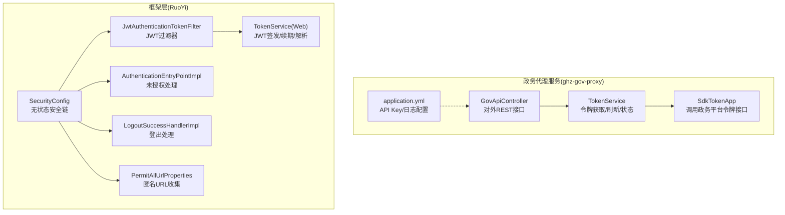
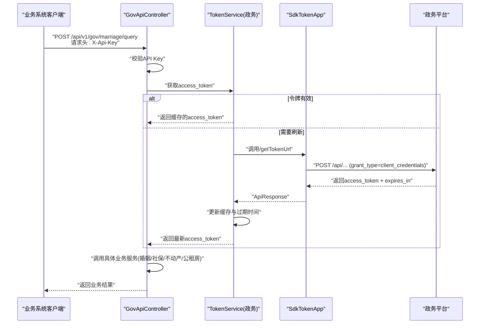
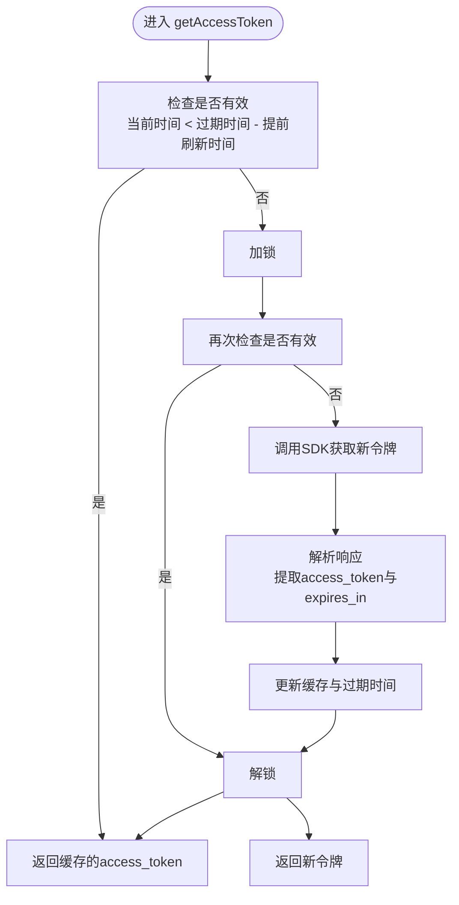
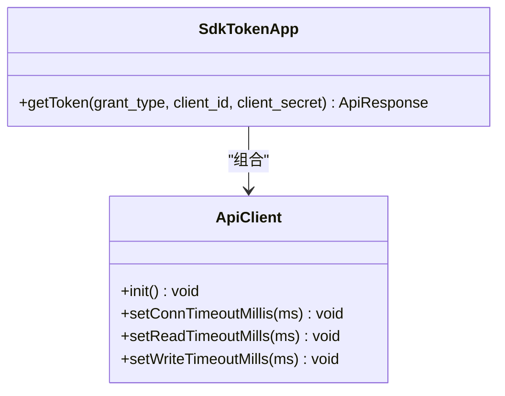
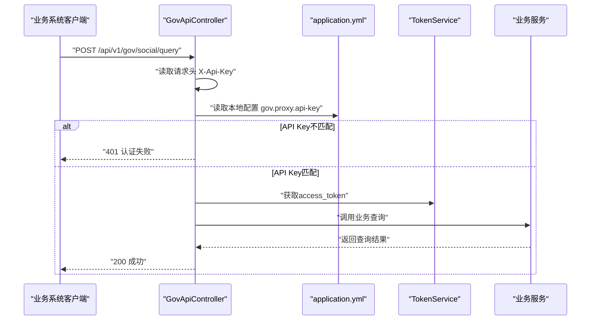
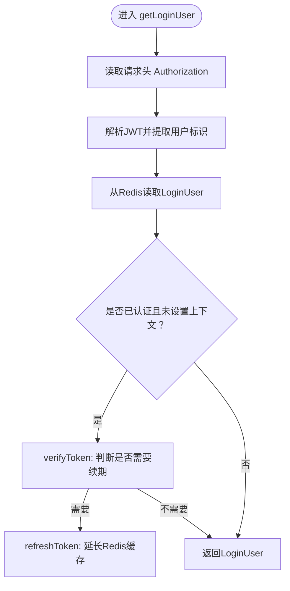
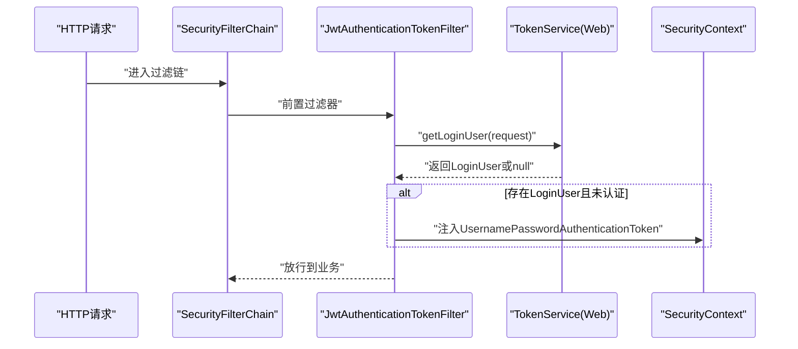
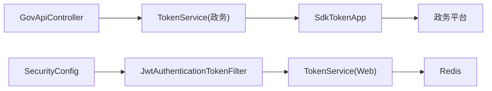

# 令牌认证机制

<cite>
**本文引用的文件**
- [ghz-gov-proxy/src/main/java/com/ghz/gov/service/TokenService.java](file://ghz-gov-proxy/src/main/java/com/ghz/gov/service/TokenService.java)
- [ghz-gov-proxy/src/main/java/com/ghz/gov/sdk/SdkTokenApp.java](file://ghz-gov-proxy/src/main/java/com/ghz/gov/sdk/SdkTokenApp.java)
- [ghz-gov-proxy/src/main/java/com/ghz/gov/controller/GovApiController.java](file://ghz-gov-proxy/src/main/java/com/ghz/gov/controller/GovApiController.java)
- [ghz-gov-proxy/src/main/resources/application.yml](file://ghz-gov-proxy/src/main/resources/application.yml)
- [ruoyi-framework/src/main/java/com/ruoyi/framework/web/service/TokenService.java](file://ruoyi-framework/src/main/java/com/ruoyi/framework/web/service/TokenService.java)
- [ruoyi-framework/src/main/java/com/ruoyi/framework/security/filter/JwtAuthenticationTokenFilter.java](file://ruoyi-framework/src/main/java/com/ruoyi/framework/security/filter/JwtAuthenticationTokenFilter.java)
- [ruoyi-framework/src/main/java/com/ruoyi/framework/config/SecurityConfig.java](file://ruoyi-framework/src/main/java/com/ruoyi/framework/config/SecurityConfig.java)
- [ruoyi-framework/src/main/java/com/ruoyi/framework/config/properties/PermitAllUrlProperties.java](file://ruoyi-framework/src/main/java/com/ruoyi/framework/config/properties/PermitAllUrlProperties.java)
- [ruoyi-framework/src/main/java/com/ruoyi/framework/security/handle/AuthenticationEntryPointImpl.java](file://ruoyi-framework/src/main/java/com/ruoyi/framework/security/handle/AuthenticationEntryPointImpl.java)
- [ruoyi-framework/src/main/java/com/ruoyi/framework/security/handle/LogoutSuccessHandlerImpl.java](file://ruoyi-framework/src/main/java/com/ruoyi/framework/security/handle/LogoutSuccessHandlerImpl.java)
- [ruoyi-admin/src/main/resources/application.yml](file://ruoyi-admin/src/main/resources/application.yml)
</cite>

## 目录
1. [简介](#简介)
2. [项目结构](#项目结构)
3. [核心组件](#核心组件)
4. [架构总览](#架构总览)
5. [详细组件分析](#详细组件分析)
6. [依赖分析](#依赖分析)
7. [性能考虑](#性能考虑)
8. [故障排查指南](#故障排查指南)
9. [结论](#结论)
10. [附录](#附录)

## 简介
本文件面向“政务接口访问令牌”的获取、刷新、验证与管理，系统性梳理令牌生命周期、过期处理、自动刷新策略，并结合实际代码实现说明令牌在各政务接口调用中的传递方式、验证流程与权限控制。文档同时给出令牌安全存储、加密保护与访问控制的实践建议，并提供完整的令牌管理示例与监控指标、性能优化及故障排查指引。

## 项目结构
围绕令牌认证的关键模块分布如下：
- 政务代理服务（ghz-gov-proxy）
  - 令牌服务：负责获取、缓存、定时刷新与并发保护
  - SDK封装：封装政务平台OAuth2令牌获取接口
  - 控制器：对外暴露REST接口，内置API Key校验与令牌状态查询
  - 配置：服务端口、API Key、日志级别等
- 框架层（ruoyi-framework）
  - JWT令牌服务：负责用户登录态令牌的签发、解析、续期与Redis缓存
  - 安全过滤器：拦截请求，解析JWT并注入认证上下文
  - 安全配置：基于Spring Security的无状态认证策略
  - 认证异常与登出处理：统一返回未授权与登出清理

图表来源
- [ghz-gov-proxy/src/main/java/com/ghz/gov/controller/GovApiController.java:1-149](file://ghz-gov-proxy/src/main/java/com/ghz/gov/controller/GovApiController.java#L1-L149)
- [ghz-gov-proxy/src/main/java/com/ghz/gov/service/TokenService.java:1-170](file://ghz-gov-proxy/src/main/java/com/ghz/gov/service/TokenService.java#L1-L170)
- [ghz-gov-proxy/src/main/java/com/ghz/gov/sdk/SdkTokenApp.java:1-47](file://ghz-gov-proxy/src/main/java/com/ghz/gov/sdk/SdkTokenApp.java#L1-L47)
- [ghz-gov-proxy/src/main/resources/application.yml:1-13](file://ghz-gov-proxy/src/main/resources/application.yml#L1-L13)
- [ruoyi-framework/src/main/java/com/ruoyi/framework/security/filter/JwtAuthenticationTokenFilter.java:1-45](file://ruoyi-framework/src/main/java/com/ruoyi/framework/security/filter/JwtAuthenticationTokenFilter.java#L1-L45)
- [ruoyi-framework/src/main/java/com/ruoyi/framework/web/service/TokenService.java:1-233](file://ruoyi-framework/src/main/java/com/ruoyi/framework/web/service/TokenService.java#L1-L233)
- [ruoyi-framework/src/main/java/com/ruoyi/framework/config/SecurityConfig.java:1-135](file://ruoyi-framework/src/main/java/com/ruoyi/framework/config/SecurityConfig.java#L1-L135)
- [ruoyi-framework/src/main/java/com/ruoyi/framework/config/properties/PermitAllUrlProperties.java:1-74](file://ruoyi-framework/src/main/java/com/ruoyi/framework/config/properties/PermitAllUrlProperties.java#L1-L74)
- [ruoyi-framework/src/main/java/com/ruoyi/framework/security/handle/AuthenticationEntryPointImpl.java:1-35](file://ruoyi-framework/src/main/java/com/ruoyi/framework/security/handle/AuthenticationEntryPointImpl.java#L1-L35)
- [ruoyi-framework/src/main/java/com/ruoyi/framework/security/handle/LogoutSuccessHandlerImpl.java:1-54](file://ruoyi-framework/src/main/java/com/ruoyi/framework/security/handle/LogoutSuccessHandlerImpl.java#L1-L54)

章节来源
- [ghz-gov-proxy/src/main/java/com/ghz/gov/controller/GovApiController.java:1-149](file://ghz-gov-proxy/src/main/java/com/ghz/gov/controller/GovApiController.java#L1-L149)
- [ghz-gov-proxy/src/main/java/com/ghz/gov/service/TokenService.java:1-170](file://ghz-gov-proxy/src/main/java/com/ghz/gov/service/TokenService.java#L1-L170)
- [ghz-gov-proxy/src/main/java/com/ghz/gov/sdk/SdkTokenApp.java:1-47](file://ghz-gov-proxy/src/main/java/com/ghz/gov/sdk/SdkTokenApp.java#L1-L47)
- [ghz-gov-proxy/src/main/resources/application.yml:1-13](file://ghz-gov-proxy/src/main/resources/application.yml#L1-L13)
- [ruoyi-framework/src/main/java/com/ruoyi/framework/web/service/TokenService.java:1-233](file://ruoyi-framework/src/main/java/com/ruoyi/framework/web/service/TokenService.java#L1-L233)
- [ruoyi-framework/src/main/java/com/ruoyi/framework/security/filter/JwtAuthenticationTokenFilter.java:1-45](file://ruoyi-framework/src/main/java/com/ruoyi/framework/security/filter/JwtAuthenticationTokenFilter.java#L1-L45)
- [ruoyi-framework/src/main/java/com/ruoyi/framework/config/SecurityConfig.java:1-135](file://ruoyi-framework/src/main/java/com/ruoyi/framework/config/SecurityConfig.java#L1-L135)
- [ruoyi-framework/src/main/java/com/ruoyi/framework/config/properties/PermitAllUrlProperties.java:1-74](file://ruoyi-framework/src/main/java/com/ruoyi/framework/config/properties/PermitAllUrlProperties.java#L1-L74)
- [ruoyi-framework/src/main/java/com/ruoyi/framework/security/handle/AuthenticationEntryPointImpl.java:1-35](file://ruoyi-framework/src/main/java/com/ruoyi/framework/security/handle/AuthenticationEntryPointImpl.java#L1-L35)
- [ruoyi-framework/src/main/java/com/ruoyi/framework/security/handle/LogoutSuccessHandlerImpl.java:1-54](file://ruoyi-framework/src/main/java/com/ruoyi/framework/security/handle/LogoutSuccessHandlerImpl.java#L1-L54)

## 核心组件
- 政务令牌服务（TokenService）
  - 负责懒加载获取access_token、并发安全刷新、定时刷新与状态查询
  - 采用“提前5分钟刷新”策略，避免临界窗口内失效
- 政务SDK（SdkTokenApp）
  - 封装政务平台OAuth2令牌接口调用，设置超时与加解密参数
- 政务控制器（GovApiController）
  - 对外提供REST接口，内置API Key校验与令牌状态查询
- 框架JWT令牌服务（TokenService(Web)）
  - 负责用户登录态JWT的签发、解析、续期与Redis缓存
- 安全过滤器（JwtAuthenticationTokenFilter）
  - 在请求进入业务前解析JWT并注入认证上下文
- 安全配置（SecurityConfig）
  - 基于Spring Security构建无状态认证链，支持匿名URL与跨域

章节来源
- [ghz-gov-proxy/src/main/java/com/ghz/gov/service/TokenService.java:1-170](file://ghz-gov-proxy/src/main/java/com/ghz/gov/service/TokenService.java#L1-L170)
- [ghz-gov-proxy/src/main/java/com/ghz/gov/sdk/SdkTokenApp.java:1-47](file://ghz-gov-proxy/src/main/java/com/ghz/gov/sdk/SdkTokenApp.java#L1-L47)
- [ghz-gov-proxy/src/main/java/com/ghz/gov/controller/GovApiController.java:1-149](file://ghz-gov-proxy/src/main/java/com/ghz/gov/controller/GovApiController.java#L1-L149)
- [ruoyi-framework/src/main/java/com/ruoyi/framework/web/service/TokenService.java:1-233](file://ruoyi-framework/src/main/java/com/ruoyi/framework/web/service/TokenService.java#L1-L233)
- [ruoyi-framework/src/main/java/com/ruoyi/framework/security/filter/JwtAuthenticationTokenFilter.java:1-45](file://ruoyi-framework/src/main/java/com/ruoyi/framework/security/filter/JwtAuthenticationTokenFilter.java#L1-L45)
- [ruoyi-framework/src/main/java/com/ruoyi/framework/config/SecurityConfig.java:1-135](file://ruoyi-framework/src/main/java/com/ruoyi/framework/config/SecurityConfig.java#L1-L135)

## 架构总览
政务接口访问涉及两类令牌：
- 政务平台访问令牌（access_token）：用于调用政务接口，由政务代理服务统一管理
- 用户登录态令牌（JWT）：用于用户认证与授权，由框架层统一管理

图表来源
- [ghz-gov-proxy/src/main/java/com/ghz/gov/controller/GovApiController.java:48-66](file://ghz-gov-proxy/src/main/java/com/ghz/gov/controller/GovApiController.java#L48-L66)
- [ghz-gov-proxy/src/main/java/com/ghz/gov/service/TokenService.java:42-53](file://ghz-gov-proxy/src/main/java/com/ghz/gov/service/TokenService.java#L42-L53)
- [ghz-gov-proxy/src/main/java/com/ghz/gov/sdk/SdkTokenApp.java:37-45](file://ghz-gov-proxy/src/main/java/com/ghz/gov/sdk/SdkTokenApp.java#L37-L45)

章节来源
- [ghz-gov-proxy/src/main/java/com/ghz/gov/controller/GovApiController.java:1-149](file://ghz-gov-proxy/src/main/java/com/ghz/gov/controller/GovApiController.java#L1-L149)
- [ghz-gov-proxy/src/main/java/com/ghz/gov/service/TokenService.java:1-170](file://ghz-gov-proxy/src/main/java/com/ghz/gov/service/TokenService.java#L1-L170)
- [ghz-gov-proxy/src/main/java/com/ghz/gov/sdk/SdkTokenApp.java:1-47](file://ghz-gov-proxy/src/main/java/com/ghz/gov/sdk/SdkTokenApp.java#L1-L47)

## 详细组件分析

### 组件A：政务令牌服务（TokenService）
- 设计要点
  - 懒加载：首次使用或即将过期时才获取
  - 并发保护：使用同步锁避免多线程重复刷新
  - 定时刷新：固定周期触发，确保长期运行稳定性
  - 状态查询：提供令牌是否存在、是否有效、过期时间等信息
- 关键流程
  - 获取令牌：若未过期直接返回；否则加锁刷新
  - 刷新逻辑：调用SDK获取access_token与expires_in，更新内存缓存
  - 定时任务：每25分钟刷新一次，提前5分钟刷新策略
- 错误处理
  - SDK返回非200或响应体缺失token时抛出异常并记录日志
  - 异常向上抛出，由调用方或上层捕获处理

图表来源
- [ghz-gov-proxy/src/main/java/com/ghz/gov/service/TokenService.java:42-53](file://ghz-gov-proxy/src/main/java/com/ghz/gov/service/TokenService.java#L42-L53)
- [ghz-gov-proxy/src/main/java/com/ghz/gov/service/TokenService.java:65-119](file://ghz-gov-proxy/src/main/java/com/ghz/gov/service/TokenService.java#L65-L119)
- [ghz-gov-proxy/src/main/java/com/ghz/gov/service/TokenService.java:124-134](file://ghz-gov-proxy/src/main/java/com/ghz/gov/service/TokenService.java#L124-L134)

章节来源
- [ghz-gov-proxy/src/main/java/com/ghz/gov/service/TokenService.java:1-170](file://ghz-gov-proxy/src/main/java/com/ghz/gov/service/TokenService.java#L1-L170)

### 组件B：政务SDK（SdkTokenApp）
- 设计要点
  - 初始化ApiClient并设置连接/读写超时
  - 配置应用ID、密钥、国密参数、主机与端口
  - 提供getToken方法，构造请求参数并同步调用
- 关键流程
  - 构造POST请求，添加grant_type、client_id、client_secret
  - 执行同步调用并返回响应对象

图表来源
- [ghz-gov-proxy/src/main/java/com/ghz/gov/sdk/SdkTokenApp.java:14-35](file://ghz-gov-proxy/src/main/java/com/ghz/gov/sdk/SdkTokenApp.java#L14-L35)
- [ghz-gov-proxy/src/main/java/com/ghz/gov/sdk/SdkTokenApp.java:37-45](file://ghz-gov-proxy/src/main/java/com/ghz/gov/sdk/SdkTokenApp.java#L37-L45)

章节来源
- [ghz-gov-proxy/src/main/java/com/ghz/gov/sdk/SdkTokenApp.java:1-47](file://ghz-gov-proxy/src/main/java/com/ghz/gov/sdk/SdkTokenApp.java#L1-L47)

### 组件C：政务控制器（GovApiController）
- 设计要点
  - 对外暴露REST接口，统一进行API Key校验
  - 提供令牌状态查询接口，便于健康检查与运维监控
  - 业务接口对参数进行基础校验并记录耗时与结果
- 关键流程
  - 校验X-Api-Key头部，不匹配则返回401
  - 调用具体业务服务（婚姻/社保/不动产/公租房），并将异常转化为标准错误响应

图表来源
- [ghz-gov-proxy/src/main/java/com/ghz/gov/controller/GovApiController.java:139-147](file://ghz-gov-proxy/src/main/java/com/ghz/gov/controller/GovApiController.java#L139-L147)
- [ghz-gov-proxy/src/main/resources/application.yml:7-8](file://ghz-gov-proxy/src/main/resources/application.yml#L7-L8)
- [ghz-gov-proxy/src/main/java/com/ghz/gov/controller/GovApiController.java:68-87](file://ghz-gov-proxy/src/main/java/com/ghz/gov/controller/GovApiController.java#L68-L87)

章节来源
- [ghz-gov-proxy/src/main/java/com/ghz/gov/controller/GovApiController.java:1-149](file://ghz-gov-proxy/src/main/java/com/ghz/gov/controller/GovApiController.java#L1-L149)
- [ghz-gov-proxy/src/main/resources/application.yml:1-13](file://ghz-gov-proxy/src/main/resources/application.yml#L1-L13)

### 组件D：用户JWT令牌服务（TokenService(Web)）
- 设计要点
  - 从请求头解析JWT，解析出用户标识后从Redis读取用户信息
  - 若距离过期不足20分钟则自动续期
  - 使用HS512算法签名，密钥与有效期可配置
- 关键流程
  - 解析请求头Authorization，去除前缀
  - 使用密钥解析JWT，从Redis读取LoginUser
  - 续期：若剩余有效期小于阈值则延长Redis缓存

图表来源
- [ruoyi-framework/src/main/java/com/ruoyi/framework/web/service/TokenService.java:62-83](file://ruoyi-framework/src/main/java/com/ruoyi/framework/web/service/TokenService.java#L62-L83)
- [ruoyi-framework/src/main/java/com/ruoyi/framework/web/service/TokenService.java:133-141](file://ruoyi-framework/src/main/java/com/ruoyi/framework/web/service/TokenService.java#L133-L141)
- [ruoyi-framework/src/main/java/com/ruoyi/framework/web/service/TokenService.java:148-155](file://ruoyi-framework/src/main/java/com/ruoyi/framework/web/service/TokenService.java#L148-L155)

章节来源
- [ruoyi-framework/src/main/java/com/ruoyi/framework/web/service/TokenService.java:1-233](file://ruoyi-framework/src/main/java/com/ruoyi/framework/web/service/TokenService.java#L1-L233)

### 组件E：JWT安全过滤器与配置
- JwtAuthenticationTokenFilter
  - 在请求进入业务前解析JWT并注入认证上下文
- SecurityConfig
  - 禁用CSRF与HTTP缓存头，配置无状态会话策略
  - 支持匿名访问的URL集合，统一异常处理与登出处理
- 认证异常与登出处理
  - 未授权返回JSON错误
  - 登出时删除Redis中的用户缓存并异步记录日志

图表来源
- [ruoyi-framework/src/main/java/com/ruoyi/framework/security/filter/JwtAuthenticationTokenFilter.java:30-43](file://ruoyi-framework/src/main/java/com/ruoyi/framework/security/filter/JwtAuthenticationTokenFilter.java#L30-L43)
- [ruoyi-framework/src/main/java/com/ruoyi/framework/web/service/TokenService.java:62-83](file://ruoyi-framework/src/main/java/com/ruoyi/framework/web/service/TokenService.java#L62-L83)
- [ruoyi-framework/src/main/java/com/ruoyi/framework/config/SecurityConfig.java:86-124](file://ruoyi-framework/src/main/java/com/ruoyi/framework/config/SecurityConfig.java#L86-L124)

章节来源
- [ruoyi-framework/src/main/java/com/ruoyi/framework/security/filter/JwtAuthenticationTokenFilter.java:1-45](file://ruoyi-framework/src/main/java/com/ruoyi/framework/security/filter/JwtAuthenticationTokenFilter.java#L1-L45)
- [ruoyi-framework/src/main/java/com/ruoyi/framework/config/SecurityConfig.java:1-135](file://ruoyi-framework/src/main/java/com/ruoyi/framework/config/SecurityConfig.java#L1-L135)
- [ruoyi-framework/src/main/java/com/ruoyi/framework/security/handle/AuthenticationEntryPointImpl.java:1-35](file://ruoyi-framework/src/main/java/com/ruoyi/framework/security/handle/AuthenticationEntryPointImpl.java#L1-L35)
- [ruoyi-framework/src/main/java/com/ruoyi/framework/security/handle/LogoutSuccessHandlerImpl.java:1-54](file://ruoyi-framework/src/main/java/com/ruoyi/framework/security/handle/LogoutSuccessHandlerImpl.java#L1-L54)

## 依赖分析
- 组件耦合
  - GovApiController依赖TokenService与各业务服务，负责API Key校验与路由
  - TokenService依赖SdkTokenApp与外部政务平台，负责令牌生命周期管理
  - 框架层的JWT过滤器与配置独立于业务，仅依赖TokenService(Web)解析用户信息
- 外部依赖
  - 政务平台OAuth2令牌接口
  - Redis（用户JWT缓存）
- 潜在风险
  - API Key硬编码在配置文件中，需通过环境变量覆盖
  - 令牌刷新依赖SDK网络调用，需关注超时与重试策略

图表来源
- [ghz-gov-proxy/src/main/java/com/ghz/gov/controller/GovApiController.java:24-35](file://ghz-gov-proxy/src/main/java/com/ghz/gov/controller/GovApiController.java#L24-L35)
- [ghz-gov-proxy/src/main/java/com/ghz/gov/service/TokenService.java](file://ghz-gov-proxy/src/main/java/com/ghz/gov/service/TokenService.java#L31)
- [ghz-gov-proxy/src/main/java/com/ghz/gov/sdk/SdkTokenApp.java:14-35](file://ghz-gov-proxy/src/main/java/com/ghz/gov/sdk/SdkTokenApp.java#L14-L35)
- [ruoyi-framework/src/main/java/com/ruoyi/framework/config/SecurityConfig.java:86-124](file://ruoyi-framework/src/main/java/com/ruoyi/framework/config/SecurityConfig.java#L86-L124)
- [ruoyi-framework/src/main/java/com/ruoyi/framework/security/filter/JwtAuthenticationTokenFilter.java:25-43](file://ruoyi-framework/src/main/java/com/ruoyi/framework/security/filter/JwtAuthenticationTokenFilter.java#L25-L43)
- [ruoyi-framework/src/main/java/com/ruoyi/framework/web/service/TokenService.java](file://ruoyi-framework/src/main/java/com/ruoyi/framework/web/service/TokenService.java#L55)

章节来源
- [ghz-gov-proxy/src/main/java/com/ghz/gov/controller/GovApiController.java:1-149](file://ghz-gov-proxy/src/main/java/com/ghz/gov/controller/GovApiController.java#L1-L149)
- [ghz-gov-proxy/src/main/java/com/ghz/gov/service/TokenService.java:1-170](file://ghz-gov-proxy/src/main/java/com/ghz/gov/service/TokenService.java#L1-L170)
- [ghz-gov-proxy/src/main/java/com/ghz/gov/sdk/SdkTokenApp.java:1-47](file://ghz-gov-proxy/src/main/java/com/ghz/gov/sdk/SdkTokenApp.java#L1-L47)
- [ruoyi-framework/src/main/java/com/ruoyi/framework/config/SecurityConfig.java:1-135](file://ruoyi-framework/src/main/java/com/ruoyi/framework/config/SecurityConfig.java#L1-L135)
- [ruoyi-framework/src/main/java/com/ruoyi/framework/security/filter/JwtAuthenticationTokenFilter.java:1-45](file://ruoyi-framework/src/main/java/com/ruoyi/framework/security/filter/JwtAuthenticationTokenFilter.java#L1-L45)
- [ruoyi-framework/src/main/java/com/ruoyi/framework/web/service/TokenService.java:1-233](file://ruoyi-framework/src/main/java/com/ruoyi/framework/web/service/TokenService.java#L1-L233)

## 性能考虑
- 令牌获取
  - 使用并发锁避免重复刷新，降低政务平台调用压力
  - 定时刷新与懒加载结合，减少不必要的网络请求
- Redis缓存
  - 用户JWT缓存采用过期时间控制，续期逻辑避免频繁IO
- 超时与重试
  - SDK设置连接与读写超时，建议在调用侧增加指数退避重试
- 监控与告警
  - 建议埋点统计令牌获取成功率、平均耗时、过期率与刷新频率

## 故障排查指南
- 常见问题
  - 获取令牌失败：检查client_id/client_secret、网络连通性与响应体状态
  - API Key错误：确认请求头X-Api-Key与服务端配置一致
  - JWT未生效：确认请求头Authorization格式与密钥配置一致
  - 未授权访问：检查SecurityConfig中匿名URL与认证链配置
- 排查步骤
  - 查看日志：定位令牌获取与业务接口异常堆栈
  - 健康检查：调用令牌状态接口，确认令牌存在与有效期
  - 网络诊断：验证政务平台地址与端口可达性
- 处理建议
  - 对令牌获取异常进行熔断与降级
  - 对Redis连接异常进行快速失败与告警

章节来源
- [ghz-gov-proxy/src/main/java/com/ghz/gov/service/TokenService.java:77-82](file://ghz-gov-proxy/src/main/java/com/ghz/gov/service/TokenService.java#L77-L82)
- [ghz-gov-proxy/src/main/java/com/ghz/gov/controller/GovApiController.java:139-147](file://ghz-gov-proxy/src/main/java/com/ghz/gov/controller/GovApiController.java#L139-L147)
- [ruoyi-framework/src/main/java/com/ruoyi/framework/web/service/TokenService.java:62-83](file://ruoyi-framework/src/main/java/com/ruoyi/framework/web/service/TokenService.java#L62-L83)
- [ruoyi-framework/src/main/java/com/ruoyi/framework/config/SecurityConfig.java:86-124](file://ruoyi-framework/src/main/java/com/ruoyi/framework/config/SecurityConfig.java#L86-L124)

## 结论
本系统通过“政务平台令牌服务 + 用户JWT令牌服务”的双轨机制，实现了对政务接口访问令牌的全生命周期管理。政务令牌采用懒加载与定时刷新相结合的方式，配合并发锁与提前刷新策略，确保高可用与低延迟；用户JWT令牌通过无状态认证与Redis缓存实现高效验证与续期。建议在生产环境中强化API Key与密钥管理、完善监控与告警体系，并对网络与Redis进行容错设计。

## 附录

### 令牌管理示例（获取新令牌、续期处理、异常恢复）
- 获取新令牌
  - 调用令牌服务的获取方法，若缓存为空或即将过期则触发刷新
  - 刷新成功后更新内存缓存与过期时间
- 续期处理
  - 政务令牌：定时任务每25分钟刷新一次
  - 用户JWT：当剩余有效期小于阈值时自动续期
- 异常恢复
  - 令牌获取失败时记录错误并抛出异常，由调用方决定重试或降级

章节来源
- [ghz-gov-proxy/src/main/java/com/ghz/gov/service/TokenService.java:124-134](file://ghz-gov-proxy/src/main/java/com/ghz/gov/service/TokenService.java#L124-L134)
- [ruoyi-framework/src/main/java/com/ruoyi/framework/web/service/TokenService.java:133-141](file://ruoyi-framework/src/main/java/com/ruoyi/framework/web/service/TokenService.java#L133-L141)

### 令牌传递与验证流程
- 政务接口
  - 请求头携带X-Api-Key进行服务级鉴权
  - 业务调用前获取access_token并附加到下游请求
- 用户认证
  - 请求头携带Authorization: Bearer <JWT>
  - 过滤器解析JWT并注入认证上下文

章节来源
- [ghz-gov-proxy/src/main/java/com/ghz/gov/controller/GovApiController.java:139-147](file://ghz-gov-proxy/src/main/java/com/ghz/gov/controller/GovApiController.java#L139-L147)
- [ruoyi-framework/src/main/java/com/ruoyi/framework/security/filter/JwtAuthenticationTokenFilter.java:30-43](file://ruoyi-framework/src/main/java/com/ruoyi/framework/security/filter/JwtAuthenticationTokenFilter.java#L30-L43)

### 安全存储与访问控制
- 政务令牌
  - 内存缓存，避免落盘
  - 严格区分政务平台OAuth2凭证与SDK签名凭证
- 用户JWT
  - Redis缓存用户信息，设置过期时间
  - HS512签名，密钥集中管理并通过环境变量注入
- API Key
  - 通过配置文件与环境变量双重配置，建议生产环境使用环境变量

章节来源
- [ghz-gov-proxy/src/main/resources/application.yml:7-8](file://ghz-gov-proxy/src/main/resources/application.yml#L7-L8)
- [ruoyi-admin/src/main/resources/application.yml:95-102](file://ruoyi-admin/src/main/resources/application.yml#L95-L102)