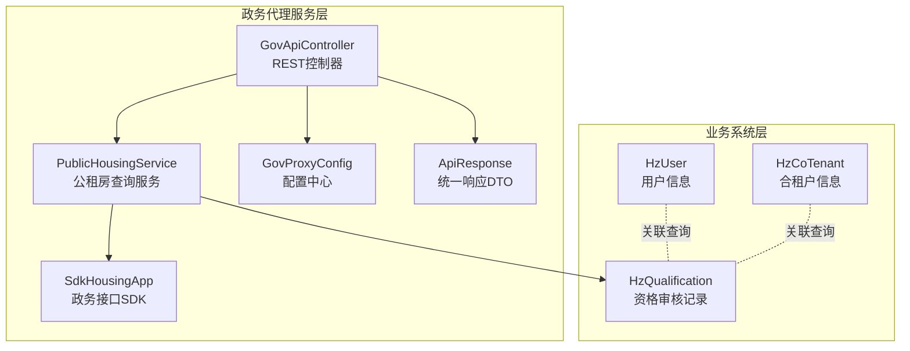
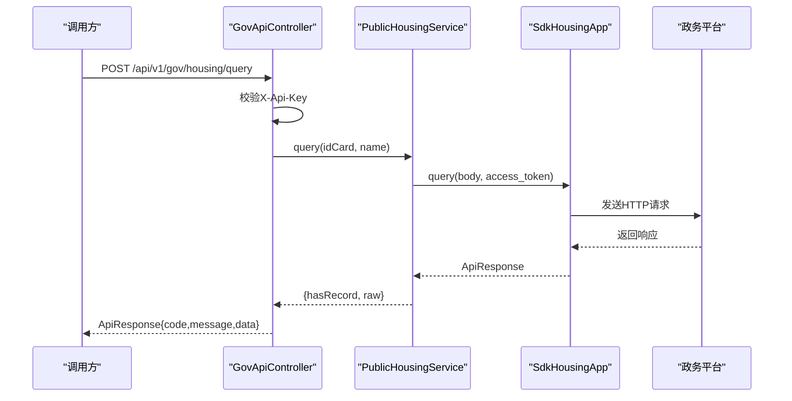
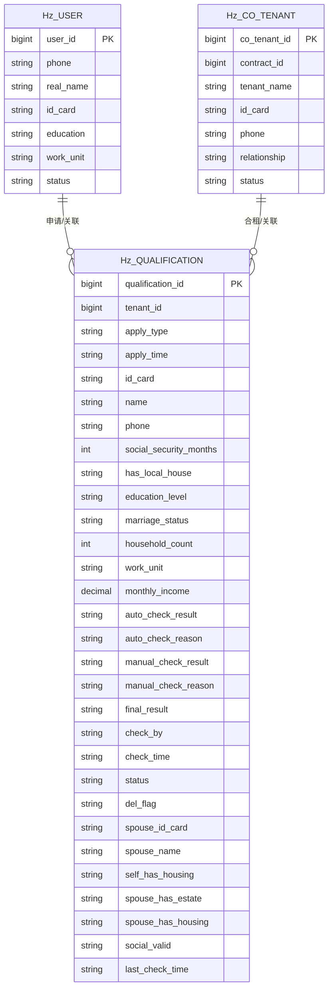
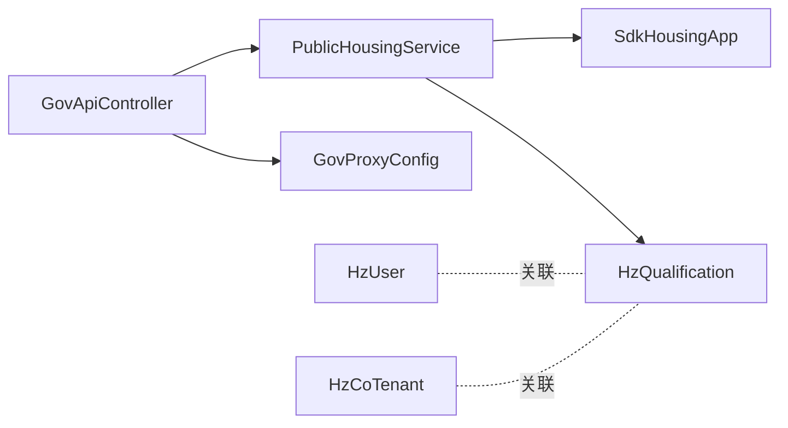

# 公租房数据接口

<cite>
**本文引用的文件**
- [GovApiController.java](file://ghz-gov-proxy/src/main/java/com/ghz/gov/controller/GovApiController.java)
- [PublicHousingService.java](file://ghz-gov-proxy/src/main/java/com/ghz/gov/service/PublicHousingService.java)
- [SdkHousingApp.java](file://ghz-gov-proxy/src/main/java/com/ghz/gov/sdk/SdkHousingApp.java)
- [GovProxyConfig.java](file://ghz-gov-proxy/src/main/java/com/ghz/gov/config/GovProxyConfig.java)
- [ApiResponse.java](file://ghz-gov-proxy/src/main/java/com/ghz/gov/dto/ApiResponse.java)
- [HzQualification.java](file://ruoyi-system/src/main/java/com/ruoyi/system/domain/HzQualification.java)
- [HzUser.java](file://ruoyi-system/src/main/java/com/ruoyi/system/domain/HzUser.java)
- [HzCoTenant.java](file://ruoyi-system/src/main/java/com/ruoyi/system/domain/HzCoTenant.java)
</cite>

## 目录
1. [简介](#简介)
2. [项目结构](#项目结构)
3. [核心组件](#核心组件)
4. [架构总览](#架构总览)
5. [详细组件分析](#详细组件分析)
6. [依赖分析](#依赖分析)
7. [性能考虑](#性能考虑)
8. [故障排查指南](#故障排查指南)
9. [结论](#结论)
10. [附录](#附录)

## 简介
本技术文档围绕“公租房申请人信息查询接口”的设计与实现展开，覆盖接口架构、数据字段验证规则、资格审核流程的数据校验机制与判断逻辑、并发处理能力、数据一致性与事务管理、监控指标与性能基准测试以及故障恢复策略。文档同时提供多条件组合查询与结果集处理的实践建议，并给出基于仓库现有代码的可落地实现路径。

## 项目结构
该系统由两部分组成：
- 政务代理服务层（ghz-gov-proxy）：对外提供统一REST接口，负责鉴权、请求转发与响应封装。
- 业务系统层（ruoyi-system）：存储与业务模型相关的核心数据，如申请人信息、合租户信息、资格审核记录等。

图表来源
- [GovApiController.java:1-149](file://ghz-gov-proxy/src/main/java/com/ghz/gov/controller/GovApiController.java#L1-L149)
- [PublicHousingService.java:1-97](file://ghz-gov-proxy/src/main/java/com/ghz/gov/service/PublicHousingService.java#L1-L97)
- [SdkHousingApp.java:1-46](file://ghz-gov-proxy/src/main/java/com/ghz/gov/sdk/SdkHousingApp.java#L1-L46)
- [GovProxyConfig.java:1-16](file://ghz-gov-proxy/src/main/java/com/ghz/gov/config/GovProxyConfig.java#L1-L16)
- [ApiResponse.java:1-34](file://ghz-gov-proxy/src/main/java/com/ghz/gov/dto/ApiResponse.java#L1-L34)
- [HzUser.java:1-375](file://ruoyi-system/src/main/java/com/ruoyi/system/domain/HzUser.java#L1-L375)
- [HzCoTenant.java:1-221](file://ruoyi-system/src/main/java/com/ruoyi/system/domain/HzCoTenant.java#L1-L221)
- [HzQualification.java:1-377](file://ruoyi-system/src/main/java/com/ruoyi/system/domain/HzQualification.java#L1-L377)

章节来源
- [GovApiController.java:1-149](file://ghz-gov-proxy/src/main/java/com/ghz/gov/controller/GovApiController.java#L1-L149)
- [PublicHousingService.java:1-97](file://ghz-gov-proxy/src/main/java/com/ghz/gov/service/PublicHousingService.java#L1-L97)
- [SdkHousingApp.java:1-46](file://ghz-gov-proxy/src/main/java/com/ghz/gov/sdk/SdkHousingApp.java#L1-L46)
- [GovProxyConfig.java:1-16](file://ghz-gov-proxy/src/main/java/com/ghz/gov/config/GovProxyConfig.java#L1-L16)
- [ApiResponse.java:1-34](file://ghz-gov-proxy/src/main/java/com/ghz/gov/dto/ApiResponse.java#L1-L34)
- [HzUser.java:1-375](file://ruoyi-system/src/main/java/com/ruoyi/system/domain/HzUser.java#L1-L375)
- [HzCoTenant.java:1-221](file://ruoyi-system/src/main/java/com/ruoyi/system/domain/HzCoTenant.java#L1-L221)
- [HzQualification.java:1-377](file://ruoyi-system/src/main/java/com/ruoyi/system/domain/HzQualification.java#L1-L377)

## 核心组件
- REST控制器：统一入口，负责鉴权、参数校验、调用服务层并返回统一响应。
- 公租房查询服务：封装对政务接口SDK的调用，包含重试与错误处理。
- 政务接口SDK：封装HTTP客户端、超时配置与签名策略。
- 配置中心：集中管理API Key等运行参数。
- 统一响应DTO：标准化返回格式。
- 业务模型：HzUser、HzCoTenant、HzQualification用于支撑资格审核与关联查询。

章节来源
- [GovApiController.java:1-149](file://ghz-gov-proxy/src/main/java/com/ghz/gov/controller/GovApiController.java#L1-L149)
- [PublicHousingService.java:1-97](file://ghz-gov-proxy/src/main/java/com/ghz/gov/service/PublicHousingService.java#L1-L97)
- [SdkHousingApp.java:1-46](file://ghz-gov-proxy/src/main/java/com/ghz/gov/sdk/SdkHousingApp.java#L1-L46)
- [GovProxyConfig.java:1-16](file://ghz-gov-proxy/src/main/java/com/ghz/gov/config/GovProxyConfig.java#L1-L16)
- [ApiResponse.java:1-34](file://ghz-gov-proxy/src/main/java/com/ghz/gov/dto/ApiResponse.java#L1-L34)
- [HzUser.java:1-375](file://ruoyi-system/src/main/java/com/ruoyi/system/domain/HzUser.java#L1-L375)
- [HzCoTenant.java:1-221](file://ruoyi-system/src/main/java/com/ruoyi/system/domain/HzCoTenant.java#L1-L221)
- [HzQualification.java:1-377](file://ruoyi-system/src/main/java/com/ruoyi/system/domain/HzQualification.java#L1-L377)

## 架构总览
接口从控制器进入，经过鉴权与参数校验后，调用公租房查询服务；服务层通过SDK向政务平台发起请求，并在必要时进行重试；最终将结果封装为统一响应返回给调用方。业务侧的资格审核与用户/合租户信息可用于后续的自动/人工审核与数据一致性校验。

图表来源
- [GovApiController.java:89-108](file://ghz-gov-proxy/src/main/java/com/ghz/gov/controller/GovApiController.java#L89-L108)
- [PublicHousingService.java:35-90](file://ghz-gov-proxy/src/main/java/com/ghz/gov/service/PublicHousingService.java#L35-L90)
- [SdkHousingApp.java:37-44](file://ghz-gov-proxy/src/main/java/com/ghz/gov/sdk/SdkHousingApp.java#L37-L44)

## 详细组件分析

### REST控制器（GovApiController）
- 职责：提供健康检查、鉴权、各政务数据查询接口（婚姻、社保、公租房、不动产），并统一返回响应。
- 鉴权：通过请求头X-Api-Key与配置中心的apiKey比对。
- 参数校验：对必填参数idCard、name进行判空。
- 日志与耗时：记录每次查询耗时与hasRecord状态，便于监控与排障。
- 错误处理：捕获异常并返回统一错误响应。

章节来源
- [GovApiController.java:37-147](file://ghz-gov-proxy/src/main/java/com/ghz/gov/controller/GovApiController.java#L37-L147)

### 公租房查询服务（PublicHousingService）
- 职责：组装请求体、获取访问令牌、调用SDK并解析响应。
- 重试机制：对特定超时类错误进行最多3次重试，提升稳定性。
- 响应解析：提取hasRecord与原始数据，便于上层决策。
- 异常处理：对非200状态码与异常进行包装与日志记录。

章节来源
- [PublicHousingService.java:35-95](file://ghz-gov-proxy/src/main/java/com/ghz/gov/service/PublicHousingService.java#L35-L95)

### 政务接口SDK（SdkHousingApp）
- 职责：封装HTTP客户端、超时配置、签名策略与接口路径。
- 调用方式：POST请求，携带access_token参数，请求体为JSON字符串的字节数组。
- 超时设置：连接超时、读写超时均在SDK中配置。

章节来源
- [SdkHousingApp.java:14-44](file://ghz-gov-proxy/src/main/java/com/ghz/gov/sdk/SdkHousingApp.java#L14-L44)

### 配置中心（GovProxyConfig）
- 职责：集中管理API Key，便于部署环境切换与安全更新。

章节来源
- [GovProxyConfig.java:10-14](file://ghz-gov-proxy/src/main/java/com/ghz/gov/config/GovProxyConfig.java#L10-L14)

### 统一响应DTO（ApiResponse）
- 职责：统一返回结构，简化前端处理。

章节来源
- [ApiResponse.java:12-25](file://ghz-gov-proxy/src/main/java/com/ghz/gov/dto/ApiResponse.java#L12-L25)

### 业务模型（HzUser、HzCoTenant、HzQualification）
- HzUser：申请人基础信息，含身份、学历、工作单位等，支持与资格审核关联。
- HzCoTenant：合租户信息，含关系、状态等，支持与合同关联查询。
- HzQualification：资格审核记录，含自动/人工审核结果、最终结果、扩展字段（如配偶信息、社保有效性等），支撑资格判定与审计追踪。

图表来源
- [HzUser.java:20-375](file://ruoyi-system/src/main/java/com/ruoyi/system/domain/HzUser.java#L20-L375)
- [HzCoTenant.java:16-221](file://ruoyi-system/src/main/java/com/ruoyi/system/domain/HzCoTenant.java#L16-L221)
- [HzQualification.java:18-377](file://ruoyi-system/src/main/java/com/ruoyi/system/domain/HzQualification.java#L18-L377)

章节来源
- [HzUser.java:1-375](file://ruoyi-system/src/main/java/com/ruoyi/system/domain/HzUser.java#L1-L375)
- [HzCoTenant.java:1-221](file://ruoyi-system/src/main/java/com/ruoyi/system/domain/HzCoTenant.java#L1-L221)
- [HzQualification.java:1-377](file://ruoyi-system/src/main/java/com/ruoyi/system/domain/HzQualification.java#L1-L377)

## 依赖分析
- 控制器依赖服务层与配置中心；服务层依赖SDK与令牌服务；SDK依赖外部政务平台。
- 业务模型之间通过外键或逻辑关联支撑资格审核与数据一致性。
- 无明显循环依赖，耦合度适中，职责清晰。

图表来源
- [GovApiController.java:24-35](file://ghz-gov-proxy/src/main/java/com/ghz/gov/controller/GovApiController.java#L24-L35)
- [PublicHousingService.java:25-28](file://ghz-gov-proxy/src/main/java/com/ghz/gov/service/PublicHousingService.java#L25-L28)
- [SdkHousingApp.java:12-35](file://ghz-gov-proxy/src/main/java/com/ghz/gov/sdk/SdkHousingApp.java#L12-L35)
- [HzQualification.java:18-377](file://ruoyi-system/src/main/java/com/ruoyi/system/domain/HzQualification.java#L18-L377)
- [HzUser.java:19-375](file://ruoyi-system/src/main/java/com/ruoyi/system/domain/HzUser.java#L19-L375)
- [HzCoTenant.java:16-221](file://ruoyi-system/src/main/java/com/ruoyi/system/domain/HzCoTenant.java#L16-L221)

章节来源
- [GovApiController.java:24-35](file://ghz-gov-proxy/src/main/java/com/ghz/gov/controller/GovApiController.java#L24-L35)
- [PublicHousingService.java:25-28](file://ghz-gov-proxy/src/main/java/com/ghz/gov/service/PublicHousingService.java#L25-L28)
- [SdkHousingApp.java:12-35](file://ghz-gov-proxy/src/main/java/com/ghz/gov/sdk/SdkHousingApp.java#L12-L35)
- [HzQualification.java:18-377](file://ruoyi-system/src/main/java/com/ruoyi/system/domain/HzQualification.java#L18-L377)
- [HzUser.java:19-375](file://ruoyi-system/src/main/java/com/ruoyi/system/domain/HzUser.java#L19-L375)
- [HzCoTenant.java:16-221](file://ruoyi-system/src/main/java/com/ruoyi/system/domain/HzCoTenant.java#L16-L221)

## 性能考虑
- 并发处理能力
  - 控制器与服务层均为无状态组件，天然具备良好的横向扩展性。
  - SDK配置了连接与读写超时，避免长时间阻塞影响整体吞吐。
- 数据一致性与事务管理
  - 当前查询接口为只读查询，不涉及数据库写操作；若后续接入写操作，建议在服务层使用事务管理以确保一致性。
- 重试与降级
  - 服务层对特定超时类错误进行有限次数重试，提升可用性；建议结合熔断与限流策略进一步增强鲁棒性。
- 监控与基准测试
  - 控制器已记录耗时与hasRecord，建议补充QPS、P95/P99延迟、错误率、重试次数等指标，并结合链路追踪定位瓶颈。

[本节为通用性能讨论，不直接分析具体文件]

## 故障排查指南
- 鉴权失败
  - 现象：返回401错误。
  - 排查：确认请求头X-Api-Key与配置中心一致。
- 必填参数缺失
  - 现象：返回400错误。
  - 排查：确认请求体包含idCard与name。
- 政务接口调用失败
  - 现象：服务层记录错误日志并抛出异常。
  - 排查：检查网络连通性、超时配置、令牌有效性；关注重试日志与错误码。
- 响应解析异常
  - 现象：解析失败或返回空数据。
  - 排查：核对响应结构与字段映射，确保hasRecord与total字段逻辑正确。

章节来源
- [GovApiController.java:96-107](file://ghz-gov-proxy/src/main/java/com/ghz/gov/controller/GovApiController.java#L96-L107)
- [PublicHousingService.java:64-95](file://ghz-gov-proxy/src/main/java/com/ghz/gov/service/PublicHousingService.java#L64-L95)

## 结论
本接口通过清晰的分层设计与统一响应规范，实现了对公租房申请人信息的稳定查询。结合业务模型与资格审核记录，可进一步完善自动/人工审核流程与数据一致性保障。建议在生产环境中引入更完善的监控、限流与熔断策略，并对写操作场景引入事务管理以确保数据一致性。

[本节为总结性内容，不直接分析具体文件]

## 附录

### 接口定义与调用示例（基于现有实现）
- 接口路径：POST /api/v1/gov/housing/query
- 请求头：X-Api-Key（与配置中心一致）
- 请求体字段：idCard、name（均为必填）
- 返回字段：code、message、data（包含hasRecord与raw）

示例调用步骤
- 步骤1：准备请求头X-Api-Key与请求体{idCard, name}。
- 步骤2：发送POST请求至/housing/query。
- 步骤3：解析响应data.hasRecord判断是否存在记录；根据需要使用raw进行二次处理。

章节来源
- [GovApiController.java:89-108](file://ghz-gov-proxy/src/main/java/com/ghz/gov/controller/GovApiController.java#L89-L108)
- [PublicHousingService.java:35-84](file://ghz-gov-proxy/src/main/java/com/ghz/gov/service/PublicHousingService.java#L35-L84)

### 数据字段验证规则与业务逻辑要点
- 申请人基本信息
  - 字段：idCard、name、phone、education、workUnit等。
  - 规则：必填校验；与HzUser模型保持一致。
- 家庭状况
  - 字段：marriageStatus、householdCount、spouseIdCard、spouseName等。
  - 规则：与HzQualification扩展字段对应，用于资格判定。
- 收入水平
  - 字段：monthlyIncome、socialSecurityMonths等。
  - 规则：数值型字段需进行范围与精度校验。
- 资产情况
  - 字段：hasLocalHouse、selfHasHousing、spouseHasEstate、spouseHasHousing等。
  - 规则：枚举值校验（0/1）；与HzQualification扩展字段对应。
- 资格审核流程
  - 字段：autoCheckResult/autoCheckReason、manualCheckResult/manualCheckReason、finalResult、socialValid、lastCheckTime等。
  - 规则：自动审核与人工审核结果叠加形成最终结果；扩展字段用于支撑判定依据。

章节来源
- [HzUser.java:55-81](file://ruoyi-system/src/main/java/com/ruoyi/system/domain/HzUser.java#L55-L81)
- [HzQualification.java:54-142](file://ruoyi-system/src/main/java/com/ruoyi/system/domain/HzQualification.java#L54-L142)

### 并发处理、一致性与事务管理建议
- 并发处理：控制器与服务层无状态设计，适合水平扩展；建议配合限流与熔断。
- 一致性：当前查询为只读；若引入写操作，应在服务层使用事务管理。
- 事务管理：对涉及多表更新（如HzQualification与HzUser/HzCoTenant）的操作，采用本地事务或分布式事务方案。

[本节为通用建议，不直接分析具体文件]

### 监控指标与性能基准测试建议
- 指标：QPS、P95/P99延迟、错误率、重试次数、线程池与连接池使用率。
- 基准测试：在不同并发负载下压测，记录接口吞吐与延迟变化，识别瓶颈点。
- 告警：对错误率、延迟与重试次数设置阈值告警。

[本节为通用建议，不直接分析具体文件]