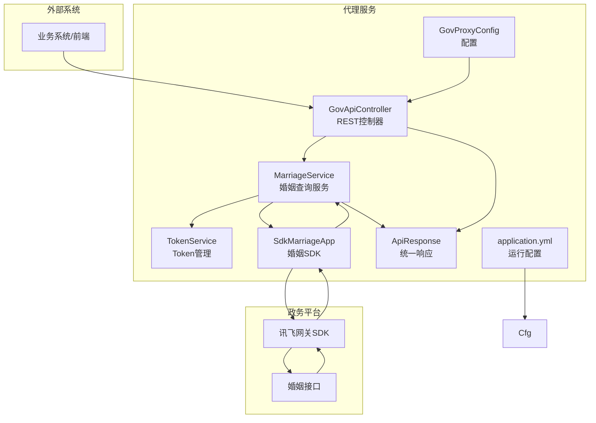
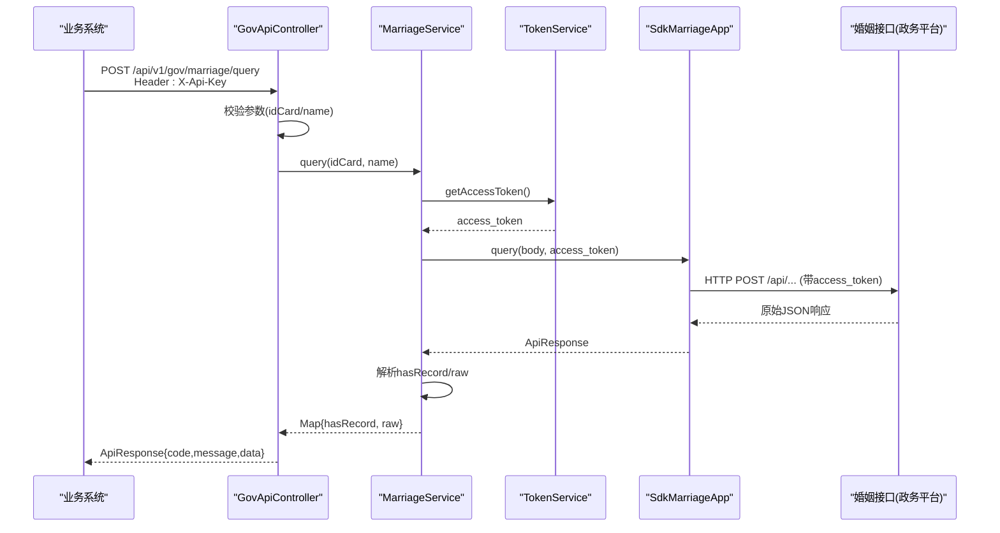
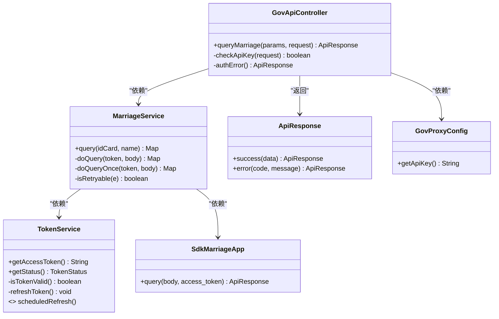
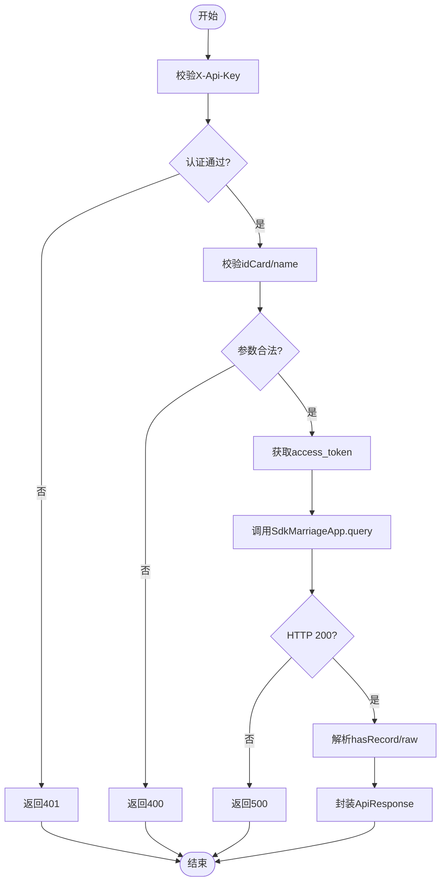

# 婚姻数据接口

<cite>
**本文引用的文件**
- [GovApiController.java](file://ghz-gov-proxy/src/main/java/com/ghz/gov/controller/GovApiController.java)
- [MarriageService.java](file://ghz-gov-proxy/src/main/java/com/ghz/gov/service/MarriageService.java)
- [SdkMarriageApp.java](file://ghz-gov-proxy/src/main/java/com/ghz/gov/sdk/SdkMarriageApp.java)
- [ApiResponse.java](file://ghz-gov-proxy/src/main/java/com/ghz/gov/dto/ApiResponse.java)
- [TokenService.java](file://ghz-gov-proxy/src/main/java/com/ghz/gov/service/TokenService.java)
- [application.yml](file://ghz-gov-proxy/src/main/resources/application.yml)
- [GovProxyConfig.java](file://ghz-gov-proxy/src/main/java/com/ghz/gov/config/GovProxyConfig.java)
- [港好住后端对接指南.md](file://ghz-gov-proxy/deploy/港好住后端对接指南.md)
- [ShieldSyncApp_授权_省民政_婚姻实时信息V2接口_67E20E7BE2B14F8CB716D965D5ECF0FA.java](file://jiekou-sdk/java-2/RELEASE/ShieldSyncApp_授权_省民政_婚姻实时信息V2接口_67E20E7BE2B14F8CB716D965D5ECF0FA.java)
</cite>

## 目录
1. [简介](#简介)
2. [项目结构](#项目结构)
3. [核心组件](#核心组件)
4. [架构总览](#架构总览)
5. [详细组件分析](#详细组件分析)
6. [依赖关系分析](#依赖关系分析)
7. [性能考虑](#性能考虑)
8. [故障排查指南](#故障排查指南)
9. [结论](#结论)
10. [附录](#附录)

## 简介
本技术文档面向“婚姻数据接口”的设计与实现，聚焦于婚姻信息查询接口的调用流程、参数规范、响应结构、验证规则、重试与超时处理、错误码定义以及SDK封装思路与使用方法。文档基于仓库中的代理服务与SDK实现，结合对接指南，提供从接口调用到业务落地的完整说明，并给出性能优化建议、调试技巧与常见问题解决方案。

## 项目结构
围绕婚姻数据接口，涉及以下关键模块：
- 控制层：对外暴露RESTful接口，负责参数校验、鉴权与响应封装
- 服务层：封装业务调用，负责Token获取、请求重试、响应解析与hasRecord判定
- SDK层：封装与政务平台的通信，负责HTTP调用、超时配置与加解密
- 配置层：提供API Key、日志级别等运行时配置
- 文档与示例：提供接口规范、调用示例与错误处理策略

图表来源
- [GovApiController.java:47-66](file://ghz-gov-proxy/src/main/java/com/ghz/gov/controller/GovApiController.java#L47-L66)
- [MarriageService.java:30-44](file://ghz-gov-proxy/src/main/java/com/ghz/gov/service/MarriageService.java#L30-L44)
- [SdkMarriageApp.java:37-44](file://ghz-gov-proxy/src/main/java/com/ghz/gov/sdk/SdkMarriageApp.java#L37-L44)
- [TokenService.java:42-53](file://ghz-gov-proxy/src/main/java/com/ghz/gov/service/TokenService.java#L42-L53)
- [ApiResponse.java:12-25](file://ghz-gov-proxy/src/main/java/com/ghz/gov/dto/ApiResponse.java#L12-L25)
- [application.yml:5-8](file://ghz-gov-proxy/src/main/resources/application.yml#L5-L8)
- [GovProxyConfig.java:10-14](file://ghz-gov-proxy/src/main/java/com/ghz/gov/config/GovProxyConfig.java#L10-L14)

章节来源
- [GovApiController.java:47-66](file://ghz-gov-proxy/src/main/java/com/ghz/gov/controller/GovApiController.java#L47-L66)
- [MarriageService.java:30-44](file://ghz-gov-proxy/src/main/java/com/ghz/gov/service/MarriageService.java#L30-L44)
- [SdkMarriageApp.java:37-44](file://ghz-gov-proxy/src/main/java/com/ghz/gov/sdk/SdkMarriageApp.java#L37-L44)
- [TokenService.java:42-53](file://ghz-gov-proxy/src/main/java/com/ghz/gov/service/TokenService.java#L42-L53)
- [application.yml:5-8](file://ghz-gov-proxy/src/main/resources/application.yml#L5-L8)
- [GovProxyConfig.java:10-14](file://ghz-gov-proxy/src/main/java/com/ghz/gov/config/GovProxyConfig.java#L10-L14)

## 核心组件
- 接口控制器：负责鉴权、参数校验、调用服务层并返回统一响应
- 婚姻服务：负责构建请求体、获取Token、调用SDK、解析响应、判定hasRecord、重试与异常处理
- SDK婚姻应用：封装HTTP调用、超时配置、加解密与签名参数
- Token服务：负责OAuth2 Token的获取、有效性检查、定时刷新与并发安全
- 统一响应：封装code/message/data的标准响应结构
- 配置：提供API Key与日志级别等运行时配置

章节来源
- [GovApiController.java:47-66](file://ghz-gov-proxy/src/main/java/com/ghz/gov/controller/GovApiController.java#L47-L66)
- [MarriageService.java:30-96](file://ghz-gov-proxy/src/main/java/com/ghz/gov/service/MarriageService.java#L30-L96)
- [SdkMarriageApp.java:37-44](file://ghz-gov-proxy/src/main/java/com/ghz/gov/sdk/SdkMarriageApp.java#L37-L44)
- [TokenService.java:42-134](file://ghz-gov-proxy/src/main/java/com/ghz/gov/service/TokenService.java#L42-134)
- [ApiResponse.java:12-25](file://ghz-gov-proxy/src/main/java/com/ghz/gov/dto/ApiResponse.java#L12-L25)
- [application.yml:5-8](file://ghz-gov-proxy/src/main/resources/application.yml#L5-L8)
- [GovProxyConfig.java:10-14](file://ghz-gov-proxy/src/main/java/com/ghz/gov/config/GovProxyConfig.java#L10-L14)

## 架构总览
接口采用“代理服务”模式，业务系统通过统一的REST接口访问，代理服务负责：
- 鉴权：校验X-Api-Key
- 参数校验：校验idCard与name必填
- Token管理：拉取/刷新/复用access_token
- 调用政务SDK：构造请求体、附加access_token并发送
- 响应解析：提取hasRecord与raw，必要时构造records
- 统一响应：封装code/message/data

图表来源
- [GovApiController.java:47-66](file://ghz-gov-proxy/src/main/java/com/ghz/gov/controller/GovApiController.java#L47-L66)
- [MarriageService.java:36-85](file://ghz-gov-proxy/src/main/java/com/ghz/gov/service/MarriageService.java#L36-L85)
- [TokenService.java:42-53](file://ghz-gov-proxy/src/main/java/com/ghz/gov/service/TokenService.java#L42-L53)
- [SdkMarriageApp.java:37-44](file://ghz-gov-proxy/src/main/java/com/ghz/gov/sdk/SdkMarriageApp.java#L37-L44)

## 详细组件分析

### 接口调用流程与参数规范
- 接口路径：POST /api/v1/gov/marriage/query
- 请求头：
  - Content-Type: application/json
  - X-Api-Key: 由配置提供（application.yml与GovProxyConfig）
- 请求体：
  - idCard: 18位身份证号（严格校验）
  - name: 姓名（与公安系统登记一致）
- 响应体：
  - code: 200成功；400参数错误；401认证失败；500服务端异常
  - message: 人类可读提示
  - data.hasRecord: 业务判定首选，true=有记录，false=无记录
  - data.raw: 原始政务平台返回JSON，含requestId/allTotal等

章节来源
- [港好住后端对接指南.md:132-186](file://ghz-gov-proxy/deploy/港好住后端对接指南.md#L132-L186)
- [港好住后端对接指南.md:191-243](file://ghz-gov-proxy/deploy/港好住后端对接指南.md#L191-L243)
- [GovApiController.java:47-66](file://ghz-gov-proxy/src/main/java/com/ghz/gov/controller/GovApiController.java#L47-L66)
- [application.yml:5-8](file://ghz-gov-proxy/src/main/resources/application.yml#L5-L8)
- [GovProxyConfig.java:10-14](file://ghz-gov-proxy/src/main/java/com/ghz/gov/config/GovProxyConfig.java#L10-L14)

### 响应数据结构与hasRecord判定逻辑
- hasRecord判定：
  - 若data为数组且非空，或total>0，则hasRecord=true
  - 未婚时raw为空对象，hasRecord=false
- raw结构：
  - 包含msg、allTotal、total、code、data数组、success、nextToken、requestId等
  - 婚姻接口的业务字段位于data.raw.data数组，取最新一条（按登记日期）

章节来源
- [MarriageService.java:80-85](file://ghz-gov-proxy/src/main/java/com/ghz/gov/service/MarriageService.java#L80-L85)
- [港好住后端对接指南.md:197-243](file://ghz-gov-proxy/deploy/港好住后端对接指南.md#L197-L243)

### 身份证号与姓名参数验证规则
- 身份证号：18位，严格校验（政务方不接受15位老证号）
- 姓名：与公安系统登记一致，错一字即查不到
- 参数缺失：返回400错误，提示缺少必填参数idCard、name

章节来源
- [港好住后端对接指南.md:158-162](file://ghz-gov-proxy/deploy/港好住后端对接指南.md#L158-L162)
- [GovApiController.java:53-57](file://ghz-gov-proxy/src/main/java/com/ghz/gov/controller/GovApiController.java#L53-L57)

### 重试机制与超时处理
- 重试策略：
  - 最多重试3次
  - 仅对可重试错误进行重试（如“网关连接后端服务超时”或特定错误码）
  - 重试间隔：代码中未显式设置，建议在调用方或SDK层配置
- 超时配置：
  - SDK层连接超时10s，读取/写入超时30s
  - 建议业务侧读取超时≥30s，不动产接口可能更慢
- 异常处理：
  - 非200状态码：抛出运行时异常
  - 其他异常：记录日志并抛出运行时异常

章节来源
- [MarriageService.java:46-63](file://ghz-gov-proxy/src/main/java/com/ghz/gov/service/MarriageService.java#L46-L63)
- [MarriageService.java:93-96](file://ghz-gov-proxy/src/main/java/com/ghz/gov/service/MarriageService.java#L93-L96)
- [SdkMarriageApp.java:14-19](file://ghz-gov-proxy/src/main/java/com/ghz/gov/sdk/SdkMarriageApp.java#L14-L19)
- [港好住后端对接指南.md:514-526](file://ghz-gov-proxy/deploy/港好住后端对接指南.md#L514-L526)

### 错误码定义与容错设计
- HTTP层错误：
  - 200：继续解析Body
  - 502/504/超时：代理服务或Nginx异常
  - 连接拒绝：白名单拒绝
- 业务层错误：
  - 200：success
  - 400：缺少必填参数
  - 401：API Key无效
  - 500：查询失败（可重试）
- 政务层错误：
  - SHD-1004：连接政务平台超时（可重试）
  - SHD-1014：参数校验不通过（不可重试）
- 重试建议：
  - 仅对网络/超时或下游偶发异常进行重试
  - 不要对401/400/参数校验错误重试

章节来源
- [港好住后端对接指南.md:486-526](file://ghz-gov-proxy/deploy/港好住后端对接指南.md#L486-L526)
- [GovApiController.java:53-65](file://ghz-gov-proxy/src/main/java/com/ghz/gov/controller/GovApiController.java#L53-L65)

### SDK封装设计思路与使用方法
- SDK职责：
  - 初始化ApiClient，设置连接/读取/写入超时
  - 构造ApiRequest，携带access_token与body
  - 使用同步调用syncInvoke发送请求
- 使用方法：
  - 业务侧通过MarriageService调用SdkMarriageApp.query
  - 无需关心SDK内部细节，只需传入UTF-8字节数组与access_token
- SDK与政务平台交互：
  - 通过Host与端口访问政务平台
  - 使用OAuth2 access_token进行鉴权

章节来源
- [SdkMarriageApp.java:14-35](file://ghz-gov-proxy/src/main/java/com/ghz/gov/sdk/SdkMarriageApp.java#L14-L35)
- [SdkMarriageApp.java:37-44](file://ghz-gov-proxy/src/main/java/com/ghz/gov/sdk/SdkMarriageApp.java#L37-L44)
- [ShieldSyncApp_授权_省民政_婚姻实时信息V2接口_67E20E7BE2B14F8CB716D965D5ECF0FA.java:69-76](file://jiekou-sdk/java-2/RELEASE/ShieldSyncApp_授权_省民政_婚姻实时信息V2接口_67E20E7BE2B14F8CB716D965D5ECF0FA.java#L69-L76)

### 调用示例（成功与失败）
- 成功示例：
  - 请求：POST /api/v1/gov/marriage/query，Body包含idCard与name
  - 响应：code=200，data.hasRecord=true，data.raw包含婚姻记录数组
- 失败示例：
  - 参数缺失：返回400，提示缺少idCard或name
  - 认证失败：返回401，提示API Key无效
  - 服务异常：返回500，提示查询失败

章节来源
- [港好住后端对接指南.md:197-243](file://ghz-gov-proxy/deploy/港好住后端对接指南.md#L197-L243)
- [GovApiController.java:53-65](file://ghz-gov-proxy/src/main/java/com/ghz/gov/controller/GovApiController.java#L53-L65)

## 依赖关系分析

图表来源
- [GovApiController.java:24-35](file://ghz-gov-proxy/src/main/java/com/ghz/gov/controller/GovApiController.java#L24-L35)
- [MarriageService.java:25-28](file://ghz-gov-proxy/src/main/java/com/ghz/gov/service/MarriageService.java#L25-L28)
- [TokenService.java:31](file://ghz-gov-proxy/src/main/java/com/ghz/gov/service/TokenService.java#L31)
- [SdkMarriageApp.java:12](file://ghz-gov-proxy/src/main/java/com/ghz/gov/sdk/SdkMarriageApp.java#L12)
- [ApiResponse.java:12-25](file://ghz-gov-proxy/src/main/java/com/ghz/gov/dto/ApiResponse.java#L12-L25)
- [GovProxyConfig.java:10-14](file://ghz-gov-proxy/src/main/java/com/ghz/gov/config/GovProxyConfig.java#L10-L14)

章节来源
- [GovApiController.java:24-35](file://ghz-gov-proxy/src/main/java/com/ghz/gov/controller/GovApiController.java#L24-L35)
- [MarriageService.java:25-28](file://ghz-gov-proxy/src/main/java/com/ghz/gov/service/MarriageService.java#L25-L28)
- [TokenService.java:31](file://ghz-gov-proxy/src/main/java/com/ghz/gov/service/TokenService.java#L31)
- [SdkMarriageApp.java:12](file://ghz-gov-proxy/src/main/java/com/ghz/gov/sdk/SdkMarriageApp.java#L12)
- [ApiResponse.java:12-25](file://ghz-gov-proxy/src/main/java/com/ghz/gov/dto/ApiResponse.java#L12-L25)
- [GovProxyConfig.java:10-14](file://ghz-gov-proxy/src/main/java/com/ghz/gov/config/GovProxyConfig.java#L10-L14)

## 性能考虑
- 超时设置：连接超时10s，读取超时≥30s；不动产接口可能更慢，建议60s
- 并发控制：单Pod并发≤10，全系统并发≤50，避免触发政务平台限流
- 缓存策略：婚姻/不动产低频变更，建议Redis缓存30天；社保1天；公租房7天
- 重试策略：仅对网络/超时或下游偶发异常重试，避免对401/400/参数校验错误重试
- 日志与监控：记录耗时、hasRecord、错误码，便于定位性能瓶颈

章节来源
- [港好住后端对接指南.md:540-584](file://ghz-gov-proxy/deploy/港好住后端对接指南.md#L540-L584)
- [MarriageService.java:46-63](file://ghz-gov-proxy/src/main/java/com/ghz/gov/service/MarriageService.java#L46-L63)

## 故障排查指南
- 健康检查：调用/ping确认链路通
- API Key：确认Header中X-Api-Key正确，避免401
- 参数校验：确认idCard为18位，name与公安登记一致
- 超时与重试：若出现“SHD-1004”，按指南进行重试；若持续超时，等待后再试
- 日志定位：关注MarriageService与TokenService的日志输出，定位异常点
- 网络问题：若出现502/504/超时，检查Nginx与代理服务状态

章节来源
- [港好住后端对接指南.md:586-632](file://ghz-gov-proxy/deploy/港好住后端对接指南.md#L586-L632)
- [MarriageService.java:93-96](file://ghz-gov-proxy/src/main/java/com/ghz/gov/service/MarriageService.java#L93-L96)
- [TokenService.java:124-134](file://ghz-gov-proxy/src/main/java/com/ghz/gov/service/TokenService.java#L124-L134)

## 结论
婚姻数据接口通过代理服务实现了与政务平台的安全对接，具备完善的鉴权、参数校验、Token管理、重试与超时处理机制。业务侧可通过统一的REST接口快速集成，配合缓存与监控策略，可获得稳定、高效的查询体验。建议在生产环境中严格遵循超时与重试策略，合理设置缓存与并发，确保系统的稳定性与性能。

## 附录

### 接口调用流程（算法流程图）

图表来源
- [GovApiController.java:47-66](file://ghz-gov-proxy/src/main/java/com/ghz/gov/controller/GovApiController.java#L47-L66)
- [MarriageService.java:65-91](file://ghz-gov-proxy/src/main/java/com/ghz/gov/service/MarriageService.java#L65-L91)