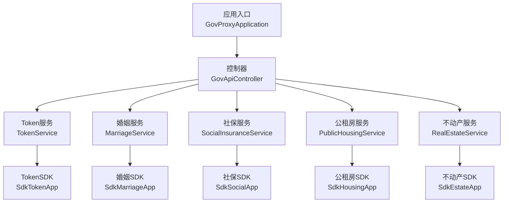
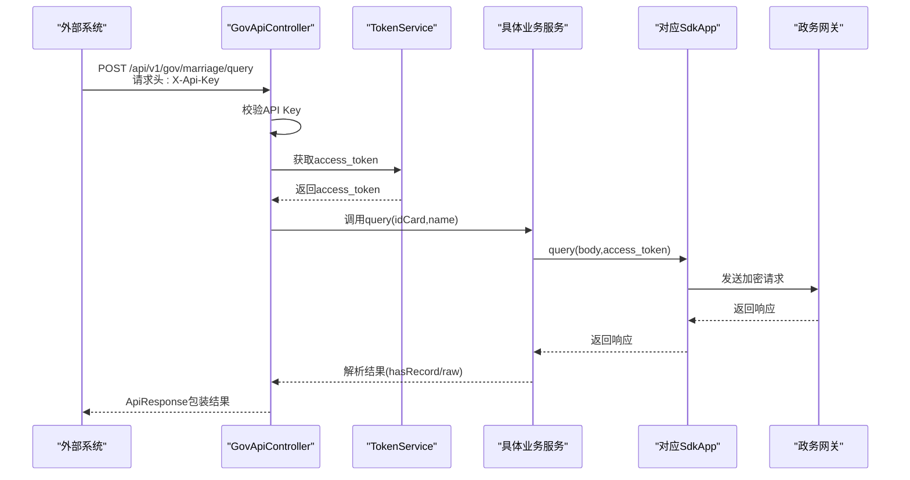
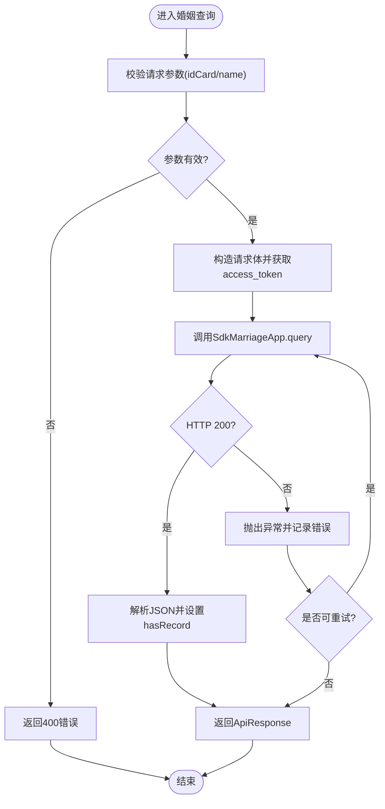
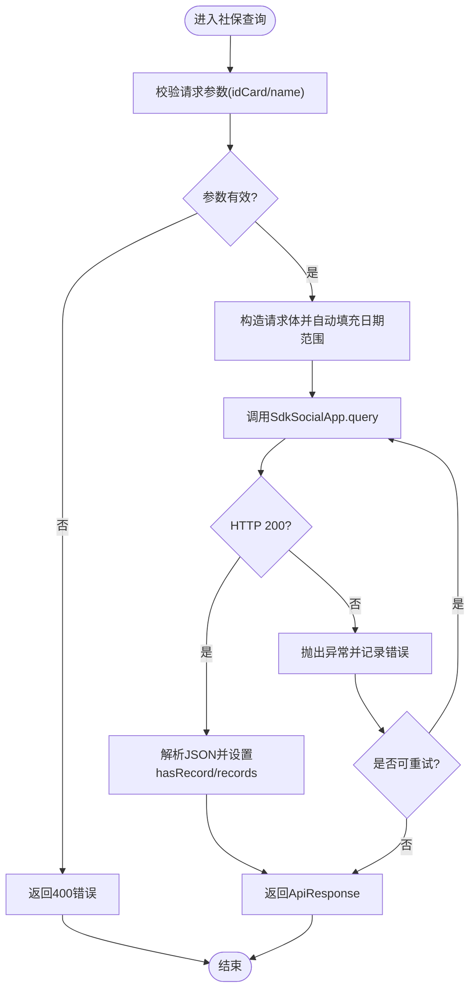
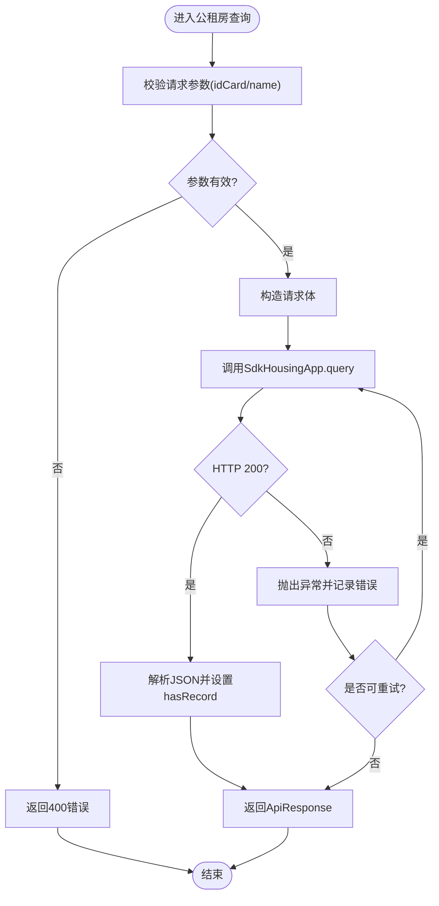
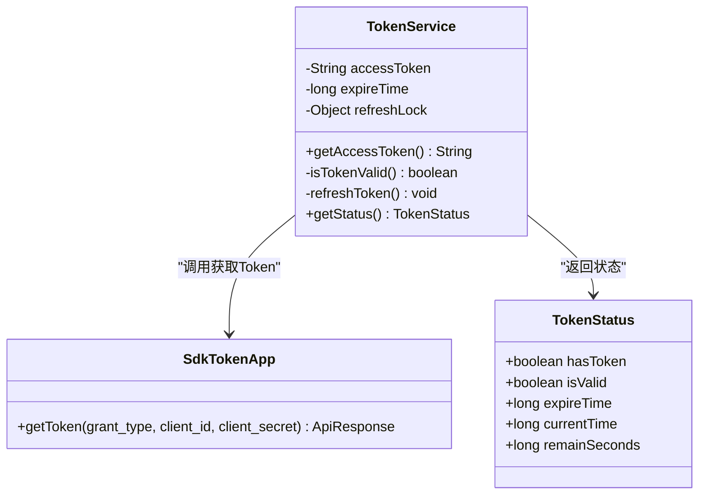
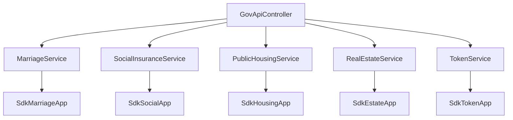

# 政务接口集成实现

<cite>
**本文引用的文件**
- [GovProxyApplication.java](file://ghz-gov-proxy/src/main/java/com/ghz/gov/GovProxyApplication.java)
- [GovApiController.java](file://ghz-gov-proxy/src/main/java/com/ghz/gov/controller/GovApiController.java)
- [GovProxyConfig.java](file://ghz-gov-proxy/src/main/java/com/ghz/gov/config/GovProxyConfig.java)
- [application.yml](file://ghz-gov-proxy/src/main/resources/application.yml)
- [application-prod.yml](file://ghz-gov-proxy/deploy/application-prod.yml)
- [MarriageService.java](file://ghz-gov-proxy/src/main/java/com/ghz/gov/service/MarriageService.java)
- [SocialInsuranceService.java](file://ghz-gov-proxy/src/main/java/com/ghz/gov/service/SocialInsuranceService.java)
- [PublicHousingService.java](file://ghz-gov-proxy/src/main/java/com/ghz/gov/service/PublicHousingService.java)
- [RealEstateService.java](file://ghz-gov-proxy/src/main/java/com/ghz/gov/service/RealEstateService.java)
- [TokenService.java](file://ghz-gov-proxy/src/main/java/com/ghz/gov/service/TokenService.java)
- [SdkMarriageApp.java](file://ghz-gov-proxy/src/main/java/com/ghz/gov/sdk/SdkMarriageApp.java)
- [SdkSocialApp.java](file://ghz-gov-proxy/src/main/java/com/ghz/gov/sdk/SdkSocialApp.java)
- [SdkHousingApp.java](file://ghz-gov-proxy/src/main/java/com/ghz/gov/sdk/SdkHousingApp.java)
- [SdkEstateApp.java](file://ghz-gov-proxy/src/main/java/com/ghz/gov/sdk/SdkEstateApp.java)
- [SdkTokenApp.java](file://ghz-gov-proxy/src/main/java/com/ghz/gov/sdk/SdkTokenApp.java)
</cite>

## 目录
1. [引言](#引言)
2. [项目结构](#项目结构)
3. [核心组件](#核心组件)
4. [架构总览](#架构总览)
5. [详细组件分析](#详细组件分析)
6. [依赖分析](#依赖分析)
7. [性能考虑](#性能考虑)
8. [故障排查指南](#故障排查指南)
9. [结论](#结论)
10. [附录](#附录)

## 引言
本文件面向“政务接口集成实现”的专业文档，围绕婚姻数据接口、社保数据接口、公租房接口、不动产登记接口等核心业务接口，系统性阐述接口的技术规范、调用流程、参数签名验证、数据加密传输、响应解析、容错设计（超时、重试、熔断降级）、测试与调试方法，以及调用示例与常见问题解决方案。目标是帮助后端与前端开发者快速、稳定地接入并维护这些政务接口。

## 项目结构
本项目采用 Spring Boot 微服务结构，核心模块如下：
- 应用入口：启动类负责应用初始化与调度启用
- 控制器层：对外暴露 RESTful 接口，统一鉴权与参数校验
- 服务层：封装各政务接口的查询逻辑、重试与结果解析
- SDK 层：封装与政务平台网关通信的客户端与签名策略
- 配置层：集中管理 API Key、日志级别与运行参数

图表来源
- [GovProxyApplication.java:1-15](file://ghz-gov-proxy/src/main/java/com/ghz/gov/GovProxyApplication.java#L1-L15)
- [GovApiController.java:18-36](file://ghz-gov-proxy/src/main/java/com/ghz/gov/controller/GovApiController.java#L18-L36)
- [TokenService.java:21-35](file://ghz-gov-proxy/src/main/java/com/ghz/gov/service/TokenService.java#L21-L35)
- [MarriageService.java:20-28](file://ghz-gov-proxy/src/main/java/com/ghz/gov/service/MarriageService.java#L20-L28)
- [SocialInsuranceService.java:22-30](file://ghz-gov-proxy/src/main/java/com/ghz/gov/service/SocialInsuranceService.java#L22-L30)
- [PublicHousingService.java:20-28](file://ghz-gov-proxy/src/main/java/com/ghz/gov/service/PublicHousingService.java#L20-L28)
- [RealEstateService.java:20-28](file://ghz-gov-proxy/src/main/java/com/ghz/gov/service/RealEstateService.java#L20-L28)
- [SdkMarriageApp.java:12-35](file://ghz-gov-proxy/src/main/java/com/ghz/gov/sdk/SdkMarriageApp.java#L12-L35)
- [SdkSocialApp.java:12-35](file://ghz-gov-proxy/src/main/java/com/ghz/gov/sdk/SdkSocialApp.java#L12-L35)
- [SdkHousingApp.java:12-35](file://ghz-gov-proxy/src/main/java/com/ghz/gov/sdk/SdkHousingApp.java#L12-L35)
- [SdkEstateApp.java:12-35](file://ghz-gov-proxy/src/main/java/com/ghz/gov/sdk/SdkEstateApp.java#L12-L35)
- [SdkTokenApp.java:12-35](file://ghz-gov-proxy/src/main/java/com/ghz/gov/sdk/SdkTokenApp.java#L12-L35)

章节来源
- [GovProxyApplication.java:1-15](file://ghz-gov-proxy/src/main/java/com/ghz/gov/GovProxyApplication.java#L1-L15)
- [application.yml:1-13](file://ghz-gov-proxy/src/main/resources/application.yml#L1-L13)

## 核心组件
- 应用入口与调度
  - 启动类启用调度能力，便于定时刷新 Token
- 控制器层
  - 统一暴露 /api/v1/gov 下的 RESTful 接口
  - 统一鉴权：通过请求头 X-Api-Key 校验
  - 统一返回：使用 ApiResponse 包装
- 服务层
  - 各接口服务封装查询逻辑、参数构造、响应解析与重试
  - 统一返回结构：包含 hasRecord 标识与原始响应 raw 字段
- SDK 层
  - 封装政务网关通信、签名策略、超时配置与证书参数
- 配置层
  - API Key 与日志级别集中配置，支持开发与生产环境差异化

章节来源
- [GovApiController.java:18-149](file://ghz-gov-proxy/src/main/java/com/ghz/gov/controller/GovApiController.java#L18-L149)
- [GovProxyConfig.java:6-16](file://ghz-gov-proxy/src/main/java/com/ghz/gov/config/GovProxyConfig.java#L6-L16)
- [application.yml:4-13](file://ghz-gov-proxy/src/main/resources/application.yml#L4-L13)
- [application-prod.yml:11-26](file://ghz-gov-proxy/deploy/application-prod.yml#L11-L26)

## 架构总览
下图展示从外部系统到各政务接口的完整调用链路，包括鉴权、Token 获取与各接口查询。

图表来源
- [GovApiController.java:48-66](file://ghz-gov-proxy/src/main/java/com/ghz/gov/controller/GovApiController.java#L48-L66)
- [TokenService.java:42-53](file://ghz-gov-proxy/src/main/java/com/ghz/gov/service/TokenService.java#L42-L53)
- [MarriageService.java:36-44](file://ghz-gov-proxy/src/main/java/com/ghz/gov/service/MarriageService.java#L36-L44)
- [SdkMarriageApp.java:37-44](file://ghz-gov-proxy/src/main/java/com/ghz/gov/sdk/SdkMarriageApp.java#L37-L44)

## 详细组件分析

### 婚姻数据接口
- 接口路径：POST /api/v1/gov/marriage/query
- 请求参数
  - idCard：身份证号
  - name：姓名
- 请求头
  - X-Api-Key：业务系统需携带的 API Key
- 响应结构
  - hasRecord：是否存在婚姻记录
  - raw：原始响应对象
- 错误码
  - 400：缺少必填参数
  - 401：认证失败（API Key 无效）
  - 500：内部异常或调用失败
- 参数签名与加密
  - SDK 层配置了签名策略与证书参数，请求体按 SDK 规范进行加密与签名
- 超时与重试
  - 单次调用超时阈值：读取超时约 30 秒
  - 内部实现重试机制，对特定超时错误进行最多 3 次重试
- 关键实现参考
  - 控制器参数校验与调用链：[GovApiController.java:48-66](file://ghz-gov-proxy/src/main/java/com/ghz/gov/controller/GovApiController.java#L48-L66)
  - 服务层查询与重试：[MarriageService.java:36-96](file://ghz-gov-proxy/src/main/java/com/ghz/gov/service/MarriageService.java#L36-L96)
  - SDK 配置与调用：[SdkMarriageApp.java:37-44](file://ghz-gov-proxy/src/main/java/com/ghz/gov/sdk/SdkMarriageApp.java#L37-L44)

图表来源
- [GovApiController.java:48-66](file://ghz-gov-proxy/src/main/java/com/ghz/gov/controller/GovApiController.java#L48-L66)
- [MarriageService.java:65-96](file://ghz-gov-proxy/src/main/java/com/ghz/gov/service/MarriageService.java#L65-L96)

章节来源
- [GovApiController.java:48-66](file://ghz-gov-proxy/src/main/java/com/ghz/gov/controller/GovApiController.java#L48-L66)
- [MarriageService.java:36-96](file://ghz-gov-proxy/src/main/java/com/ghz/gov/service/MarriageService.java#L36-L96)
- [SdkMarriageApp.java:37-44](file://ghz-gov-proxy/src/main/java/com/ghz/gov/sdk/SdkMarriageApp.java#L37-L44)

### 社保数据接口
- 接口路径：POST /api/v1/gov/social/query
- 请求参数
  - idCard：身份证号
  - name：姓名
- 请求头
  - X-Api-Key：业务系统需携带的 API Key
- 响应结构
  - hasRecord：是否存在缴费记录
  - records：记录列表（当存在时）
  - raw：原始响应对象
- 时间范围
  - SDK 自动填充 STARTDATE/ENDDATE（默认近 12 个月）
- 错误码
  - 400：缺少必填参数
  - 401：认证失败（API Key 无效）
  - 500：内部异常或调用失败
- 参数签名与加密
  - SDK 层配置了签名策略与证书参数，请求体按 SDK 规范进行加密与签名
- 超时与重试
  - 单次调用超时阈值：读取超时约 30 秒
  - 内部实现重试机制，对特定超时错误进行最多 3 次重试
- 关键实现参考
  - 控制器参数校验与调用链：[GovApiController.java:68-87](file://ghz-gov-proxy/src/main/java/com/ghz/gov/controller/GovApiController.java#L68-L87)
  - 服务层查询与重试：[SocialInsuranceService.java:38-108](file://ghz-gov-proxy/src/main/java/com/ghz/gov/service/SocialInsuranceService.java#L38-L108)
  - SDK 配置与调用：[SdkSocialApp.java:37-44](file://ghz-gov-proxy/src/main/java/com/ghz/gov/sdk/SdkSocialApp.java#L37-L44)

图表来源
- [GovApiController.java:68-87](file://ghz-gov-proxy/src/main/java/com/ghz/gov/controller/GovApiController.java#L68-L87)
- [SocialInsuranceService.java:73-108](file://ghz-gov-proxy/src/main/java/com/ghz/gov/service/SocialInsuranceService.java#L73-L108)

章节来源
- [GovApiController.java:68-87](file://ghz-gov-proxy/src/main/java/com/ghz/gov/controller/GovApiController.java#L68-L87)
- [SocialInsuranceService.java:38-108](file://ghz-gov-proxy/src/main/java/com/ghz/gov/service/SocialInsuranceService.java#L38-L108)
- [SdkSocialApp.java:37-44](file://ghz-gov-proxy/src/main/java/com/ghz/gov/sdk/SdkSocialApp.java#L37-L44)

### 公租房接口
- 接口路径：POST /api/v1/gov/housing/query
- 请求参数
  - idCard：身份证号
  - name：姓名
- 请求头
  - X-Api-Key：业务系统需携带的 API Key
- 响应结构
  - hasRecord：是否存在申请记录
  - raw：原始响应对象
- 错误码
  - 400：缺少必填参数
  - 401：认证失败（API Key 无效）
  - 500：内部异常或调用失败
- 参数签名与加密
  - SDK 层配置了签名策略与证书参数，请求体按 SDK 规范进行加密与签名
- 超时与重试
  - 单次调用超时阈值：读取超时约 30 秒
  - 内部实现重试机制，对特定超时错误进行最多 3 次重试
- 关键实现参考
  - 控制器参数校验与调用链：[GovApiController.java:89-108](file://ghz-gov-proxy/src/main/java/com/ghz/gov/controller/GovApiController.java#L89-L108)
  - 服务层查询与重试：[PublicHousingService.java:35-95](file://ghz-gov-proxy/src/main/java/com/ghz/gov/service/PublicHousingService.java#L35-L95)
  - SDK 配置与调用：[SdkHousingApp.java:37-44](file://ghz-gov-proxy/src/main/java/com/ghz/gov/sdk/SdkHousingApp.java#L37-L44)

图表来源
- [GovApiController.java:89-108](file://ghz-gov-proxy/src/main/java/com/ghz/gov/controller/GovApiController.java#L89-L108)
- [PublicHousingService.java:64-95](file://ghz-gov-proxy/src/main/java/com/ghz/gov/service/PublicHousingService.java#L64-L95)

章节来源
- [GovApiController.java:89-108](file://ghz-gov-proxy/src/main/java/com/ghz/gov/controller/GovApiController.java#L89-L108)
- [PublicHousingService.java:35-95](file://ghz-gov-proxy/src/main/java/com/ghz/gov/service/PublicHousingService.java#L35-L95)
- [SdkHousingApp.java:37-44](file://ghz-gov-proxy/src/main/java/com/ghz/gov/sdk/SdkHousingApp.java#L37-L44)

### 不动产登记接口
- 接口路径：POST /api/v1/gov/estate/query
- 请求参数
  - idCard：身份证号
  - name：姓名
- 请求头
  - X-Api-Key：业务系统需携带的 API Key
- 响应结构
  - hasRecord：是否存在登记记录
  - raw：原始响应对象
- 错误码
  - 400：缺少必填参数
  - 401：认证失败（API Key 无效）
  - 500：内部异常或调用失败
- 参数签名与加密
  - SDK 层配置了签名策略与证书参数，请求体按 SDK 规范进行加密与签名
- 超时与重试
  - 单次调用超时阈值：读取超时约 30 秒
  - 内部实现重试机制，对特定超时错误进行最多 3 次重试
- 关键实现参考
  - 控制器参数校验与调用链：[GovApiController.java:110-129](file://ghz-gov-proxy/src/main/java/com/ghz/gov/controller/GovApiController.java#L110-L129)
  - 服务层查询与重试：[RealEstateService.java:35-95](file://ghz-gov-proxy/src/main/java/com/ghz/gov/service/RealEstateService.java#L35-L95)
  - SDK 配置与调用：[SdkEstateApp.java:38-45](file://ghz-gov-proxy/src/main/java/com/ghz/gov/sdk/SdkEstateApp.java#L38-L45)

图表来源
- [GovApiController.java:110-129](file://ghz-gov-proxy/src/main/java/com/ghz/gov/controller/GovApiController.java#L110-L129)
- [RealEstateService.java:64-95](file://ghz-gov-proxy/src/main/java/com/ghz/gov/service/RealEstateService.java#L64-L95)

章节来源
- [GovApiController.java:110-129](file://ghz-gov-proxy/src/main/java/com/ghz/gov/controller/GovApiController.java#L110-L129)
- [RealEstateService.java:35-95](file://ghz-gov-proxy/src/main/java/com/ghz/gov/service/RealEstateService.java#L35-L95)
- [SdkEstateApp.java:38-45](file://ghz-gov-proxy/src/main/java/com/ghz/gov/sdk/SdkEstateApp.java#L38-L45)

### Token 管理服务
- 功能概述
  - 懒加载获取 access_token
  - 定时刷新（每 25 分钟，Token 有效期 30 分钟，预留 5 分钟余量）
  - 并发锁保护，避免并发刷新
  - 提供 Token 状态查询接口
- 关键实现参考
  - 获取与刷新逻辑：[TokenService.java:42-134](file://ghz-gov-proxy/src/main/java/com/ghz/gov/service/TokenService.java#L42-L134)
  - Token 状态模型：[TokenService.java:139-168](file://ghz-gov-proxy/src/main/java/com/ghz/gov/service/TokenService.java#L139-L168)
  - SDK 调用获取 Token：[SdkTokenApp.java:37-45](file://ghz-gov-proxy/src/main/java/com/ghz/gov/sdk/SdkTokenApp.java#L37-L45)

图表来源
- [TokenService.java:21-168](file://ghz-gov-proxy/src/main/java/com/ghz/gov/service/TokenService.java#L21-L168)
- [SdkTokenApp.java:12-45](file://ghz-gov-proxy/src/main/java/com/ghz/gov/sdk/SdkTokenApp.java#L12-L45)

章节来源
- [TokenService.java:42-134](file://ghz-gov-proxy/src/main/java/com/ghz/gov/service/TokenService.java#L42-L134)
- [TokenService.java:139-168](file://ghz-gov-proxy/src/main/java/com/ghz/gov/service/TokenService.java#L139-L168)
- [SdkTokenApp.java:37-45](file://ghz-gov-proxy/src/main/java/com/ghz/gov/sdk/SdkTokenApp.java#L37-L45)

### SDK 层通用特性
- 超时配置
  - 连接超时：10 秒
  - 读取超时：30 秒
  - 写入超时：30 秒
- 签名策略
  - 使用 SDK 层提供的签名策略与证书参数
- 认证类型
  - AUTH_TYPE_ENCRYPT
- 关键实现参考
  - SDK 基类与客户端初始化：[SdkMarriageApp.java:14-35](file://ghz-gov-proxy/src/main/java/com/ghz/gov/sdk/SdkMarriageApp.java#L14-L35)
  - SDK 基类与客户端初始化：[SdkSocialApp.java:14-35](file://ghz-gov-proxy/src/main/java/com/ghz/gov/sdk/SdkSocialApp.java#L14-L35)
  - SDK 基类与客户端初始化：[SdkHousingApp.java:14-35](file://ghz-gov-proxy/src/main/java/com/ghz/gov/sdk/SdkHousingApp.java#L14-L35)
  - SDK 基类与客户端初始化：[SdkEstateApp.java:14-35](file://ghz-gov-proxy/src/main/java/com/ghz/gov/sdk/SdkEstateApp.java#L14-L35)
  - SDK 基类与客户端初始化：[SdkTokenApp.java:14-35](file://ghz-gov-proxy/src/main/java/com/ghz/gov/sdk/SdkTokenApp.java#L14-L35)

章节来源
- [SdkMarriageApp.java:14-35](file://ghz-gov-proxy/src/main/java/com/ghz/gov/sdk/SdkMarriageApp.java#L14-L35)
- [SdkSocialApp.java:14-35](file://ghz-gov-proxy/src/main/java/com/ghz/gov/sdk/SdkSocialApp.java#L14-L35)
- [SdkHousingApp.java:14-35](file://ghz-gov-proxy/src/main/java/com/ghz/gov/sdk/SdkHousingApp.java#L14-L35)
- [SdkEstateApp.java:14-35](file://ghz-gov-proxy/src/main/java/com/ghz/gov/sdk/SdkEstateApp.java#L14-L35)
- [SdkTokenApp.java:14-35](file://ghz-gov-proxy/src/main/java/com/ghz/gov/sdk/SdkTokenApp.java#L14-L35)

## 依赖分析
- 组件耦合
  - 控制器依赖服务层；服务层依赖 TokenService 与对应 SDK
  - SDK 层依赖政务网关 SDK 客户端与证书配置
- 外部依赖
  - 政务网关地址与端口固定，认证与加密策略统一
- 潜在风险
  - 网络波动导致的超时错误，已通过重试缓解
  - Token 过期或刷新失败，已通过定时刷新与并发锁保护

图表来源
- [GovApiController.java:24-35](file://ghz-gov-proxy/src/main/java/com/ghz/gov/controller/GovApiController.java#L24-L35)
- [MarriageService.java:25-28](file://ghz-gov-proxy/src/main/java/com/ghz/gov/service/MarriageService.java#L25-L28)
- [SocialInsuranceService.java:27-30](file://ghz-gov-proxy/src/main/java/com/ghz/gov/service/SocialInsuranceService.java#L27-L30)
- [PublicHousingService.java:25-28](file://ghz-gov-proxy/src/main/java/com/ghz/gov/service/PublicHousingService.java#L25-L28)
- [RealEstateService.java:25-28](file://ghz-gov-proxy/src/main/java/com/ghz/gov/service/RealEstateService.java#L25-L28)
- [TokenService.java:31](file://ghz-gov-proxy/src/main/java/com/ghz/gov/service/TokenService.java#L31)
- [SdkMarriageApp.java:12](file://ghz-gov-proxy/src/main/java/com/ghz/gov/sdk/SdkMarriageApp.java#L12)
- [SdkSocialApp.java:12](file://ghz-gov-proxy/src/main/java/com/ghz/gov/sdk/SdkSocialApp.java#L12)
- [SdkHousingApp.java:12](file://ghz-gov-proxy/src/main/java/com/ghz/gov/sdk/SdkHousingApp.java#L12)
- [SdkEstateApp.java:12](file://ghz-gov-proxy/src/main/java/com/ghz/gov/sdk/SdkEstateApp.java#L12)
- [SdkTokenApp.java:12](file://ghz-gov-proxy/src/main/java/com/ghz/gov/sdk/SdkTokenApp.java#L12)

章节来源
- [GovApiController.java:24-35](file://ghz-gov-proxy/src/main/java/com/ghz/gov/controller/GovApiController.java#L24-L35)
- [MarriageService.java:25-28](file://ghz-gov-proxy/src/main/java/com/ghz/gov/service/MarriageService.java#L25-L28)
- [SocialInsuranceService.java:27-30](file://ghz-gov-proxy/src/main/java/com/ghz/gov/service/SocialInsuranceService.java#L27-L30)
- [PublicHousingService.java:25-28](file://ghz-gov-proxy/src/main/java/com/ghz/gov/service/PublicHousingService.java#L25-L28)
- [RealEstateService.java:25-28](file://ghz-gov-proxy/src/main/java/com/ghz/gov/service/RealEstateService.java#L25-L28)
- [TokenService.java:31](file://ghz-gov-proxy/src/main/java/com/ghz/gov/service/TokenService.java#L31)

## 性能考虑
- 超时与重试
  - 读取超时约 30 秒，网络抖动时自动重试最多 3 次
  - 对特定超时错误（如 SHD-1004）进行重试，提升成功率
- Token 缓存与刷新
  - 采用懒加载与并发锁，避免重复刷新
  - 定时任务提前 5 分钟刷新，降低过期风险
- 日志与监控
  - 开发环境 DEBUG 级别，生产环境 INFO 级别并落盘
  - 建议结合日志聚合与告警，定位慢调用与异常

## 故障排查指南
- 常见错误与处理
  - 401 未授权：确认请求头 X-Api-Key 是否正确
  - 400 参数缺失：确保 idCard 与 name 均传入
  - 500 内部异常：查看服务端日志，关注重试次数与错误信息
  - 超时错误（如 SHD-1004）：属于可重试错误，服务已内置重试
- 调试技巧
  - 开启 DEBUG 级别日志，观察请求体与响应体
  - 使用健康检查接口 /api/v1/gov/token/status 查看 Token 状态
  - 在生产环境配置落盘日志，便于离线分析
- 关键实现参考
  - 鉴权与错误返回：[GovApiController.java:139-147](file://ghz-gov-proxy/src/main/java/com/ghz/gov/controller/GovApiController.java#L139-L147)
  - Token 状态接口：[GovApiController.java:131-137](file://ghz-gov-proxy/src/main/java/com/ghz/gov/controller/GovApiController.java#L131-L137)
  - Token 状态模型：[TokenService.java:139-168](file://ghz-gov-proxy/src/main/java/com/ghz/gov/service/TokenService.java#L139-L168)
  - 重试判断逻辑：[MarriageService.java:93-96](file://ghz-gov-proxy/src/main/java/com/ghz/gov/service/MarriageService.java#L93-L96)、[SocialInsuranceService.java:105-108](file://ghz-gov-proxy/src/main/java/com/ghz/gov/service/SocialInsuranceService.java#L105-L108)、[PublicHousingService.java:92-95](file://ghz-gov-proxy/src/main/java/com/ghz/gov/service/PublicHousingService.java#L92-L95)、[RealEstateService.java:92-95](file://ghz-gov-proxy/src/main/java/com/ghz/gov/service/RealEstateService.java#L92-L95)

章节来源
- [GovApiController.java:131-147](file://ghz-gov-proxy/src/main/java/com/ghz/gov/controller/GovApiController.java#L131-L147)
- [TokenService.java:139-168](file://ghz-gov-proxy/src/main/java/com/ghz/gov/service/TokenService.java#L139-L168)
- [MarriageService.java:93-96](file://ghz-gov-proxy/src/main/java/com/ghz/gov/service/MarriageService.java#L93-L96)
- [SocialInsuranceService.java:105-108](file://ghz-gov-proxy/src/main/java/com/ghz/gov/service/SocialInsuranceService.java#L105-L108)
- [PublicHousingService.java:92-95](file://ghz-gov-proxy/src/main/java/com/ghz/gov/service/PublicHousingService.java#L92-L95)
- [RealEstateService.java:92-95](file://ghz-gov-proxy/src/main/java/com/ghz/gov/service/RealEstateService.java#L92-L95)

## 结论
本实现以清晰的分层架构、完善的鉴权与加密机制、稳健的重试与定时刷新策略，为婚姻、社保、公租房、不动产等核心政务接口提供了高可用的集成方案。通过统一的 API 规范与标准化的响应结构，既便于前端消费，也为后续扩展与运维提供了良好基础。

## 附录
- 配置文件
  - 开发环境配置：[application.yml:4-13](file://ghz-gov-proxy/src/main/resources/application.yml#L4-L13)
  - 生产环境配置：[application-prod.yml:11-26](file://ghz-gov-proxy/deploy/application-prod.yml#L11-L26)
- 健康检查
  - 接口：GET /api/v1/gov/ping
  - 用途：检查服务可用性，无需 API Key
- Token 状态
  - 接口：GET /api/v1/gov/token/status
  - 用途：查看 Token 是否存在、是否有效、过期时间与剩余秒数

章节来源
- [application.yml:4-13](file://ghz-gov-proxy/src/main/resources/application.yml#L4-L13)
- [application-prod.yml:11-26](file://ghz-gov-proxy/deploy/application-prod.yml#L11-L26)
- [GovApiController.java:37-45](file://ghz-gov-proxy/src/main/java/com/ghz/gov/controller/GovApiController.java#L37-L45)
- [GovApiController.java:131-137](file://ghz-gov-proxy/src/main/java/com/ghz/gov/controller/GovApiController.java#L131-L137)