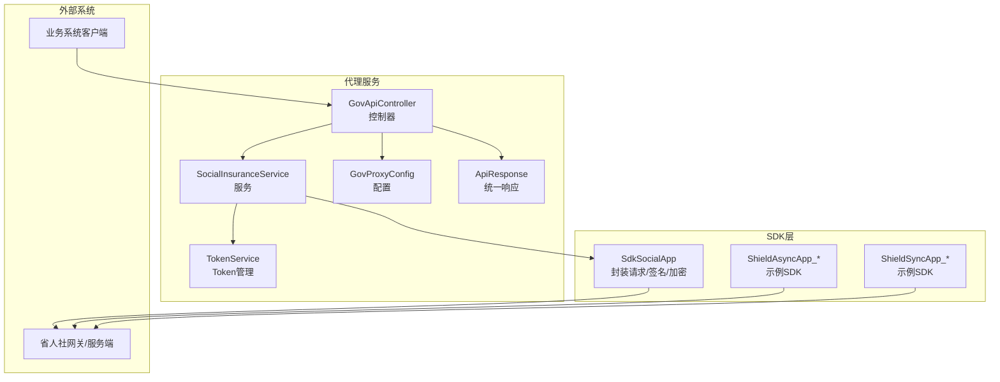
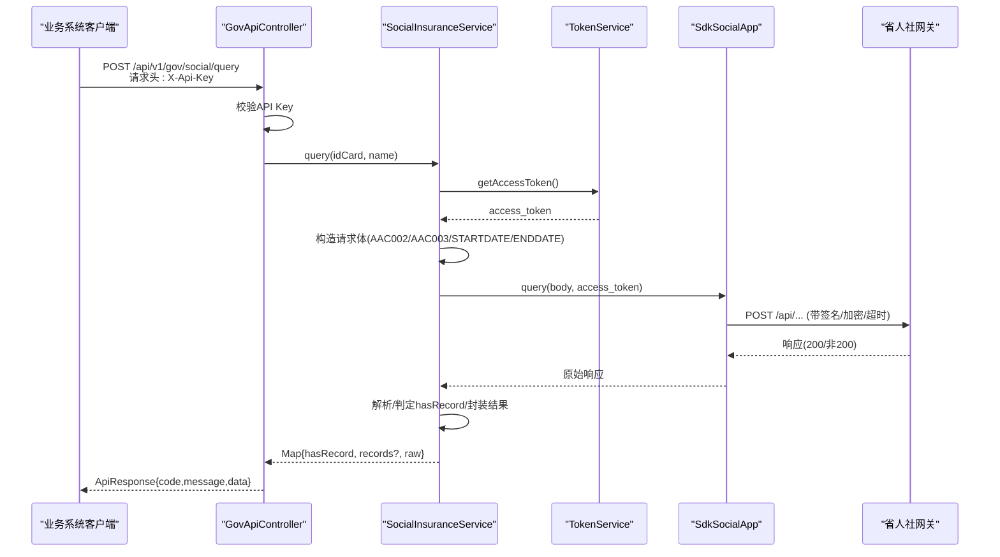
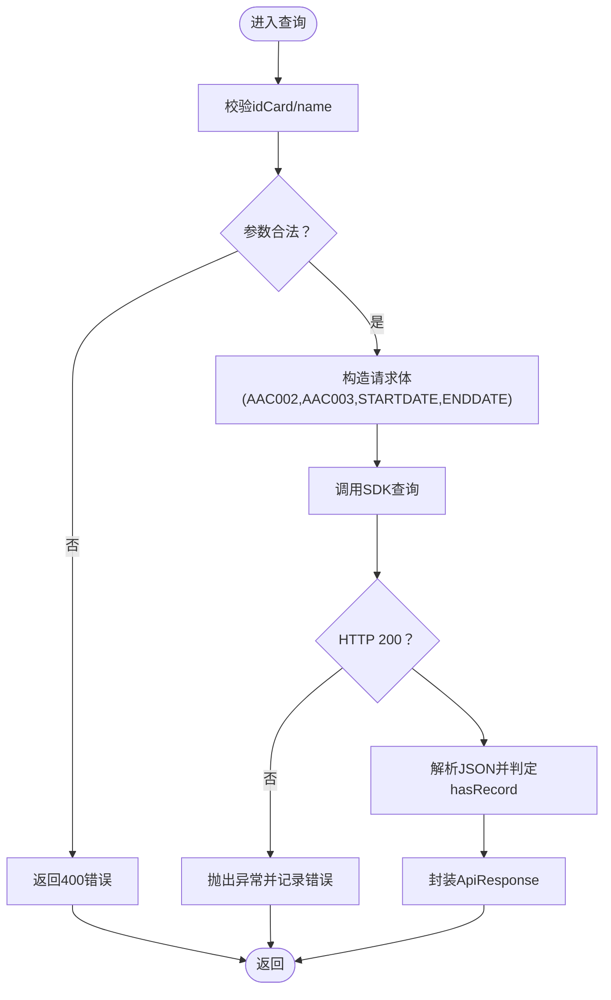
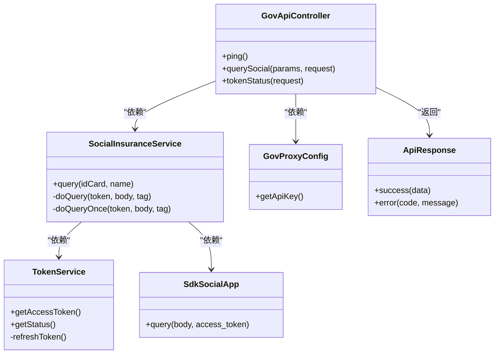

# 社保数据接口

<cite>
**本文引用的文件**
- [GovApiController.java](file://ghz-gov-proxy/src/main/java/com/ghz/gov/controller/GovApiController.java)
- [SocialInsuranceService.java](file://ghz-gov-proxy/src/main/java/com/ghz/gov/service/SocialInsuranceService.java)
- [SdkSocialApp.java](file://ghz-gov-proxy/src/main/java/com/ghz/gov/sdk/SdkSocialApp.java)
- [TokenService.java](file://ghz-gov-proxy/src/main/java/com/ghz/gov/service/TokenService.java)
- [GovProxyConfig.java](file://ghz-gov-proxy/src/main/java/com/ghz/gov/config/GovProxyConfig.java)
- [ApiResponse.java](file://ghz-gov-proxy/src/main/java/com/ghz/gov/dto/ApiResponse.java)
- [application.yml](file://ghz-gov-proxy/src/main/resources/application.yml)
- [ShieldAsyncApp_授权省人社_参保单位社会保险缴费信息V7_548E6780B5974C92B3CE92274AC14375.java](file://jiekou-sdk/java-4/RELEASE/ShieldAsyncApp_授权省人社_参保单位社会保险缴费信息V7_548E6780B5974C92B3CE92274AC14375.java)
- [ShieldSyncApp_授权省人社_参保单位社会保险缴费信息V7_548E6780B5974C92B3CE92274AC14375.java](file://jiekou-sdk/java-4/RELEASE/ShieldSyncApp_授权省人社_参保单位社会保险缴费信息V7_548E6780B5974C92B3CE92274AC14375.java)
- [ShieldAsyncApp_省人社参保人员社会保险缴费信息v7_D411ED5DBBF14AB1BE46CE5AE152131E.java](file://jiekou-sdk/java6/RELEASE/ShieldAsyncApp_省人社参保人员社会保险缴费信息v7_D411ED5DBBF14AB1BE46CE5AE152131E.java)
- [readme.md（后端文档）](file://Demo/后端文档/readme.md)
</cite>

## 目录
1. [引言](#引言)
2. [项目结构](#项目结构)
3. [核心组件](#核心组件)
4. [架构总览](#架构总览)
5. [详细组件分析](#详细组件分析)
6. [依赖分析](#依赖分析)
7. [性能考量](#性能考量)
8. [故障排查指南](#故障排查指南)
9. [结论](#结论)
10. [附录](#附录)

## 引言
本文件面向“省人社参保单位和社会保险缴费信息查询接口”的技术实现，提供从接口设计、数据模型、参数与返回字段、安全机制、调用示例到错误处理与性能优化的完整技术文档。文档基于仓库中的代理服务、SDK封装与配置，结合后端文档中的接口规范，帮助开发者快速理解并正确集成。

## 项目结构
围绕社保接口的关键模块与文件组织如下：
- 控制器层：对外暴露RESTful接口，负责鉴权与参数转发
- 服务层：封装业务逻辑，包括Token获取与重试、请求构建与响应解析
- SDK层：封装底层调用（含加密、签名、超时等）
- 配置层：统一API Key与日志级别等配置
- 示例SDK：提供同步/异步调用模板，便于理解参数与密钥

图表来源
- [GovApiController.java:18-149](file://ghz-gov-proxy/src/main/java/com/ghz/gov/controller/GovApiController.java#L18-L149)
- [SocialInsuranceService.java:19-110](file://ghz-gov-proxy/src/main/java/com/ghz/gov/service/SocialInsuranceService.java#L19-L110)
- [SdkSocialApp.java:12-46](file://ghz-gov-proxy/src/main/java/com/ghz/gov/sdk/SdkSocialApp.java#L12-L46)
- [TokenService.java:15-170](file://ghz-gov-proxy/src/main/java/com/ghz/gov/service/TokenService.java#L15-L170)
- [GovProxyConfig.java:6-16](file://ghz-gov-proxy/src/main/java/com/ghz/gov/config/GovProxyConfig.java#L6-L16)
- [ApiResponse.java:6-34](file://ghz-gov-proxy/src/main/java/com/ghz/gov/dto/ApiResponse.java#L6-L34)
- [ShieldAsyncApp_授权省人社_参保单位社会保险缴费信息V7_548E6780B5974C92B3CE92274AC14375.java:16-44](file://jiekou-sdk/java-4/RELEASE/ShieldAsyncApp_授权省人社_参保单位社会保险缴费信息V7_548E6780B5974C92B3CE92274AC14375.java#L16-L44)
- [ShieldSyncApp_授权省人社_参保单位社会保险缴费信息V7_548E6780B5974C92B3CE92274AC14375.java:19-50](file://jiekou-sdk/java-4/RELEASE/ShieldSyncApp_授权省人社_参保单位社会保险缴费信息V7_548E6780B5974C92B3CE92274AC14375.java#L19-L50)

章节来源
- [GovApiController.java:18-149](file://ghz-gov-proxy/src/main/java/com/ghz/gov/controller/GovApiController.java#L18-L149)
- [application.yml:1-13](file://ghz-gov-proxy/src/main/resources/application.yml#L1-L13)

## 核心组件
- 控制器：提供健康检查、社保查询等接口，统一鉴权与响应包装
- 社保服务：构造查询参数、自动重试、解析响应并返回标准化结果
- Token服务：OAuth2凭据拉取、定时刷新、并发安全
- SDK封装：统一请求、签名、加密、超时配置
- 配置：API Key、日志级别等

章节来源
- [GovApiController.java:68-87](file://ghz-gov-proxy/src/main/java/com/ghz/gov/controller/GovApiController.java#L68-L87)
- [SocialInsuranceService.java:32-108](file://ghz-gov-proxy/src/main/java/com/ghz/gov/service/SocialInsuranceService.java#L32-L108)
- [TokenService.java:39-134](file://ghz-gov-proxy/src/main/java/com/ghz/gov/service/TokenService.java#L39-L134)
- [SdkSocialApp.java:37-44](file://ghz-gov-proxy/src/main/java/com/ghz/gov/sdk/SdkSocialApp.java#L37-L44)
- [GovProxyConfig.java:10-14](file://ghz-gov-proxy/src/main/java/com/ghz/gov/config/GovProxyConfig.java#L10-L14)
- [ApiResponse.java:12-25](file://ghz-gov-proxy/src/main/java/com/ghz/gov/dto/ApiResponse.java#L12-L25)

## 架构总览
下图展示从客户端到代理服务再到省人社网关的整体调用链路与职责分工。

图表来源
- [GovApiController.java:68-87](file://ghz-gov-proxy/src/main/java/com/ghz/gov/controller/GovApiController.java#L68-L87)
- [SocialInsuranceService.java:38-103](file://ghz-gov-proxy/src/main/java/com/ghz/gov/service/SocialInsuranceService.java#L38-L103)
- [TokenService.java:42-53](file://ghz-gov-proxy/src/main/java/com/ghz/gov/service/TokenService.java#L42-L53)
- [SdkSocialApp.java:37-44](file://ghz-gov-proxy/src/main/java/com/ghz/gov/sdk/SdkSocialApp.java#L37-L44)

## 详细组件分析

### 接口定义与调用规范
- 接口路径：POST /api/v1/gov/social/query
- 请求头：
  - X-Api-Key：业务系统需在请求头携带API Key
- 请求体参数：
  - idCard：身份证号
  - name：姓名
- 返回体：
  - code：200表示成功
  - message：描述
  - data：
    - hasRecord：是否存在记录
    - records：存在时返回明细数组
    - raw：原始响应对象（便于排障）

章节来源
- [GovApiController.java:68-87](file://ghz-gov-proxy/src/main/java/com/ghz/gov/controller/GovApiController.java#L68-L87)
- [ApiResponse.java:12-25](file://ghz-gov-proxy/src/main/java/com/ghz/gov/dto/ApiResponse.java#L12-L25)

### 数据模型与查询参数
- 请求体字段（来自服务层构造）：
  - AAC002：身份证号
  - AAC003：姓名
  - STARTDATE：起始年月（YYYYMM），默认近12个月
  - ENDDATE：结束年月（YYYYMM），默认当前月
- 响应字段（服务层解析）：
  - hasRecord：布尔，是否存在记录
  - records：明细数组（当存在时）
  - raw：原始JSON对象

章节来源
- [SocialInsuranceService.java:41-51](file://ghz-gov-proxy/src/main/java/com/ghz/gov/service/SocialInsuranceService.java#L41-L51)
- [SocialInsuranceService.java:87-97](file://ghz-gov-proxy/src/main/java/com/ghz/gov/service/SocialInsuranceService.java#L87-L97)

### 处理逻辑与算法
- 参数校验：若缺失idCard或name，直接返回错误
- 时间窗口：默认近12个月，避免后端必填限制导致失败
- 重试策略：对特定超时错误进行最多3次重试
- 响应解析：判断total或data数组长度决定hasRecord，保留原始响应便于诊断

图表来源
- [SocialInsuranceService.java:38-103](file://ghz-gov-proxy/src/main/java/com/ghz/gov/service/SocialInsuranceService.java#L38-L103)

章节来源
- [SocialInsuranceService.java:54-108](file://ghz-gov-proxy/src/main/java/com/ghz/gov/service/SocialInsuranceService.java#L54-L108)

### 安全认证与传输安全
- API Key鉴权：控制器在每个受保护接口校验请求头X-Api-Key
- Token管理：通过OAuth2凭据拉取access_token，定时刷新（每25分钟，有效期30分钟）
- 传输安全：SDK封装了签名、加密与超时参数，确保请求在网关侧可信与安全
- 配置来源：API Key在配置文件中集中管理，日志级别可调整

章节来源
- [GovApiController.java:139-147](file://ghz-gov-proxy/src/main/java/com/ghz/gov/controller/GovApiController.java#L139-L147)
- [TokenService.java:65-119](file://ghz-gov-proxy/src/main/java/com/ghz/gov/service/TokenService.java#L65-L119)
- [application.yml:5-8](file://ghz-gov-proxy/src/main/resources/application.yml#L5-L8)
- [SdkSocialApp.java:14-35](file://ghz-gov-proxy/src/main/java/com/ghz/gov/sdk/SdkSocialApp.java#L14-L35)

### 错误处理策略
- 参数缺失：立即返回400
- 网关异常：记录状态码与响应体，抛出运行时异常
- 超时重试：对特定超时错误进行有限次数重试
- 统一响应：所有异常最终包装为统一ApiResponse，便于前端处理

章节来源
- [GovApiController.java:76-86](file://ghz-gov-proxy/src/main/java/com/ghz/gov/controller/GovApiController.java#L76-L86)
- [SocialInsuranceService.java:77-102](file://ghz-gov-proxy/src/main/java/com/ghz/gov/service/SocialInsuranceService.java#L77-L102)
- [TokenService.java:77-118](file://ghz-gov-proxy/src/main/java/com/ghz/gov/service/TokenService.java#L77-L118)

### 性能优化建议
- 合理设置超时：SDK已配置连接/读/写超时，避免阻塞
- 并发安全：Token刷新使用锁，避免并发抖动
- 重试策略：仅对可重试错误进行重试，控制总耗时
- 日志级别：生产环境建议调整日志级别，降低I/O开销

章节来源
- [SdkSocialApp.java:16-18](file://ghz-gov-proxy/src/main/java/com/ghz/gov/sdk/SdkSocialApp.java#L16-L18)
- [TokenService.java:46-52](file://ghz-gov-proxy/src/main/java/com/ghz/gov/service/TokenService.java#L46-L52)
- [application.yml:10-12](file://ghz-gov-proxy/src/main/resources/application.yml#L10-L12)

## 依赖分析
- 控制器依赖服务与配置，服务依赖Token与SDK，SDK依赖网关能力
- 低耦合高内聚：各层职责清晰，便于扩展与维护
- 外部依赖：SDK封装了签名/加密/超时细节，业务侧无需关心

图表来源
- [GovApiController.java:24-35](file://ghz-gov-proxy/src/main/java/com/ghz/gov/controller/GovApiController.java#L24-L35)
- [SocialInsuranceService.java:27-30](file://ghz-gov-proxy/src/main/java/com/ghz/gov/service/SocialInsuranceService.java#L27-L30)
- [TokenService.java:31-31](file://ghz-gov-proxy/src/main/java/com/ghz/gov/service/TokenService.java#L31-L31)
- [SdkSocialApp.java:37-44](file://ghz-gov-proxy/src/main/java/com/ghz/gov/sdk/SdkSocialApp.java#L37-L44)
- [GovProxyConfig.java:10-14](file://ghz-gov-proxy/src/main/java/com/ghz/gov/config/GovProxyConfig.java#L10-L14)
- [ApiResponse.java:12-25](file://ghz-gov-proxy/src/main/java/com/ghz/gov/dto/ApiResponse.java#L12-L25)

## 性能考量
- 超时与并发：SDK已内置超时配置；Token刷新加锁，避免并发争用
- 重试策略：对特定超时错误进行有限重试，避免雪崩
- 日志：生产环境建议降低日志级别，减少I/O

章节来源
- [SdkSocialApp.java:16-18](file://ghz-gov-proxy/src/main/java/com/ghz/gov/sdk/SdkSocialApp.java#L16-L18)
- [TokenService.java:46-52](file://ghz-gov-proxy/src/main/java/com/ghz/gov/service/TokenService.java#L46-L52)
- [application.yml:10-12](file://ghz-gov-proxy/src/main/resources/application.yml#L10-L12)

## 故障排查指南
- 认证失败：确认请求头X-Api-Key与配置一致
- 超时/网关异常：查看服务端日志，关注重试是否生效
- Token失效：检查定时刷新任务与状态接口
- 参数缺失：核对idCard/name是否传入

章节来源
- [GovApiController.java:139-147](file://ghz-gov-proxy/src/main/java/com/ghz/gov/controller/GovApiController.java#L139-L147)
- [SocialInsuranceService.java:105-108](file://ghz-gov-proxy/src/main/java/com/ghz/gov/service/SocialInsuranceService.java#L105-L108)
- [TokenService.java:124-134](file://ghz-gov-proxy/src/main/java/com/ghz/gov/service/TokenService.java#L124-L134)

## 结论
本实现以“控制器-服务-SDK-配置”分层架构，提供了稳定、可重试、可监控的社保数据查询能力。通过统一的API Key与Token管理、明确的参数与返回规范、以及详尽的错误处理与性能优化策略，能够满足生产环境对可靠性与可维护性的要求。

## 附录

### API调用示例（步骤说明）
- 步骤1：准备请求头
  - 设置X-Api-Key为配置项中的值
- 步骤2：准备请求体
  - idCard：身份证号
  - name：姓名
- 步骤3：发送请求
  - POST /api/v1/gov/social/query
- 步骤4：解析响应
  - 若hasRecord为true，则读取records
  - 若为false，可提示无记录
  - 如遇异常，查看message与日志

章节来源
- [GovApiController.java:68-87](file://ghz-gov-proxy/src/main/java/com/ghz/gov/controller/GovApiController.java#L68-L87)
- [SocialInsuranceService.java:87-97](file://ghz-gov-proxy/src/main/java/com/ghz/gov/service/SocialInsuranceService.java#L87-L97)

### 关键参数与返回字段对照
- 请求体
  - AAC002：身份证号
  - AAC003：姓名
  - STARTDATE：起始年月（YYYYMM）
  - ENDDATE：结束年月（YYYYMM）
- 响应data
  - hasRecord：是否存在记录
  - records：明细数组（当存在时）
  - raw：原始响应对象

章节来源
- [SocialInsuranceService.java:41-51](file://ghz-gov-proxy/src/main/java/com/ghz/gov/service/SocialInsuranceService.java#L41-L51)
- [SocialInsuranceService.java:87-97](file://ghz-gov-proxy/src/main/java/com/ghz/gov/service/SocialInsuranceService.java#L87-L97)

### 安全与签名要点
- SDK已内置签名与加密参数，业务侧无需自行处理
- 传输协议：HTTPS
- 编码格式：UTF-8
- 返回格式：JSON

章节来源
- [SdkSocialApp.java:20-35](file://ghz-gov-proxy/src/main/java/com/ghz/gov/sdk/SdkSocialApp.java#L20-L35)
- [readme.md（后端文档）:202-212](file://Demo/后端文档/readme.md#L202-L212)