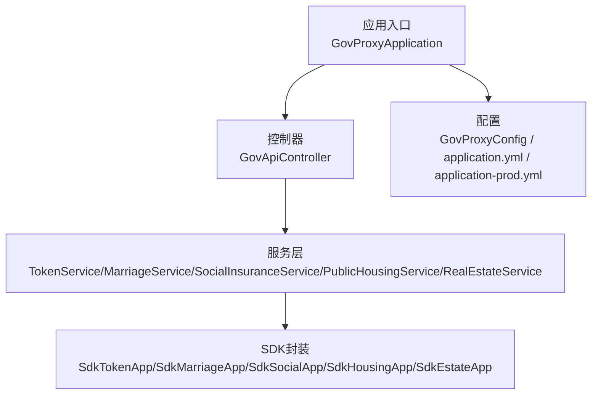
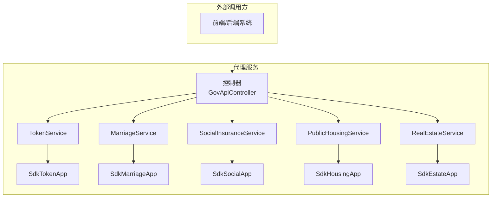
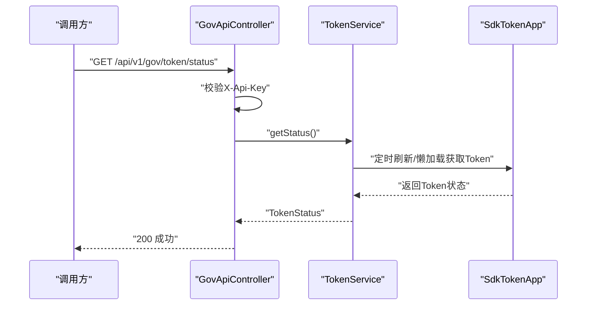
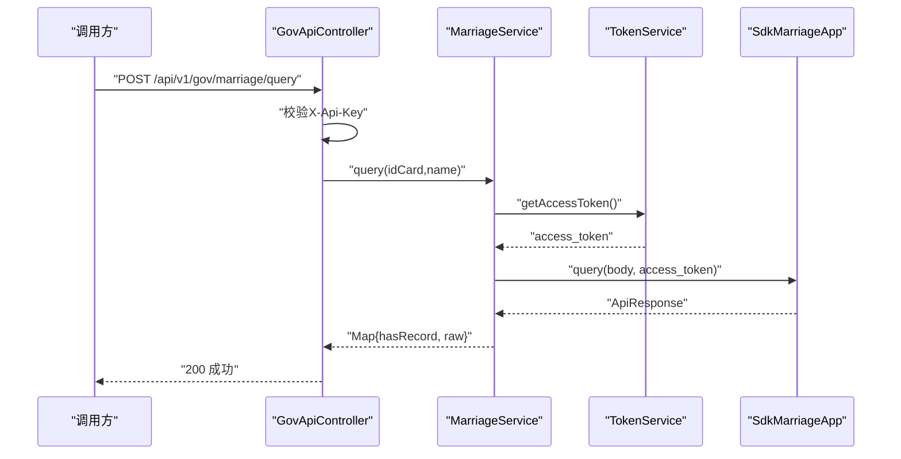
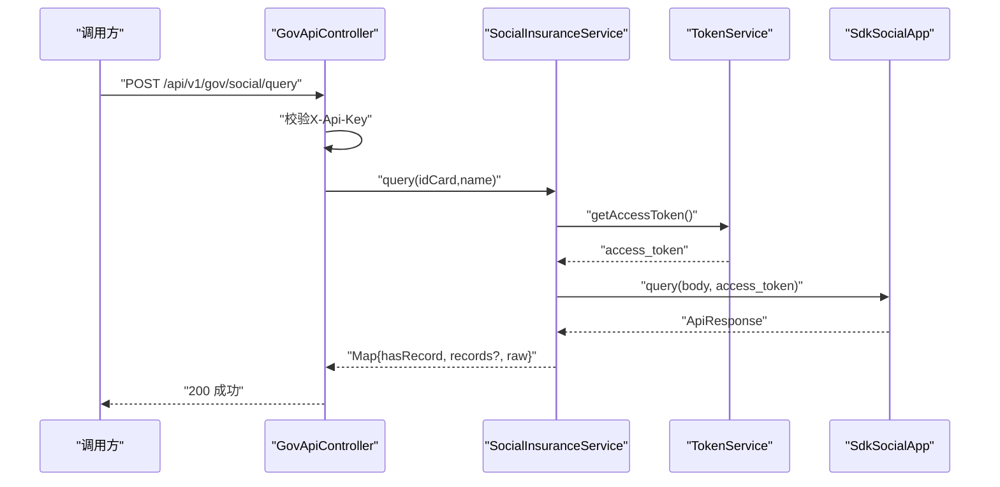
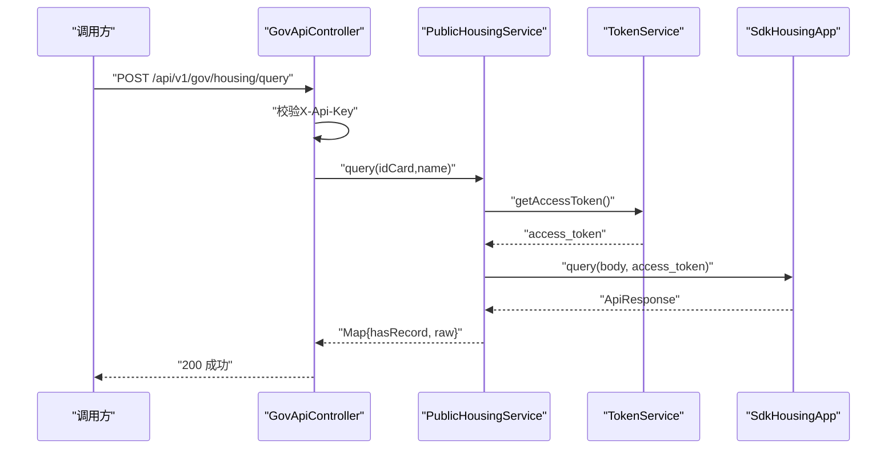
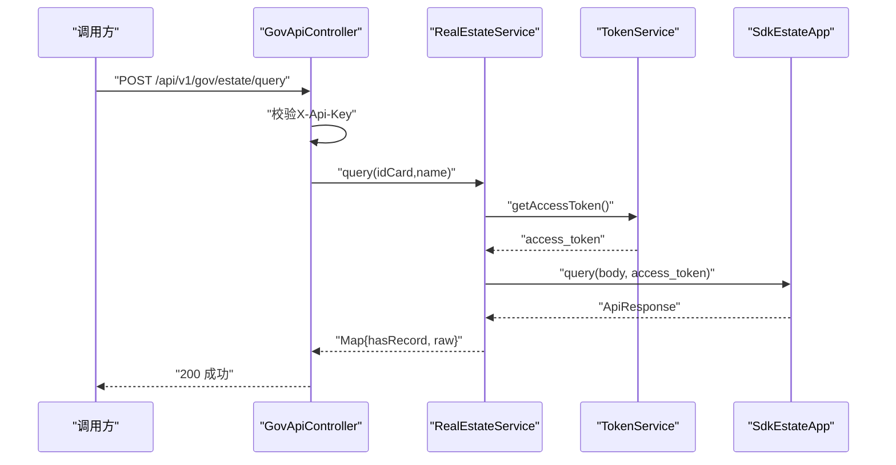
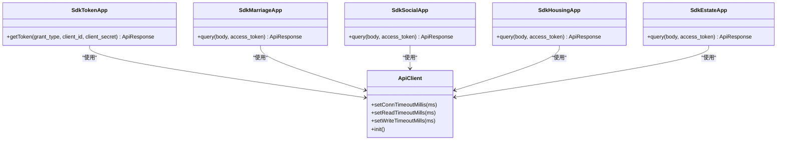
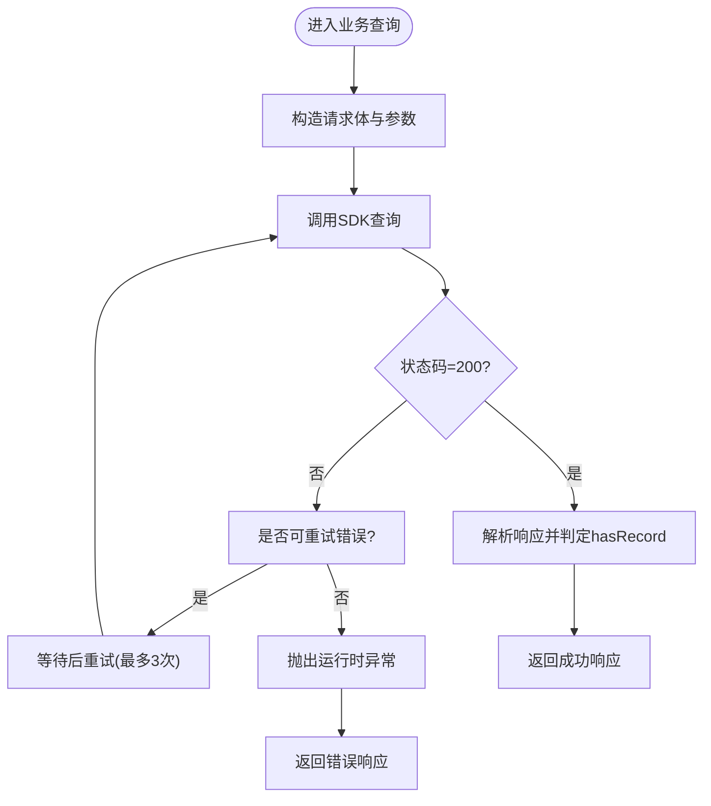
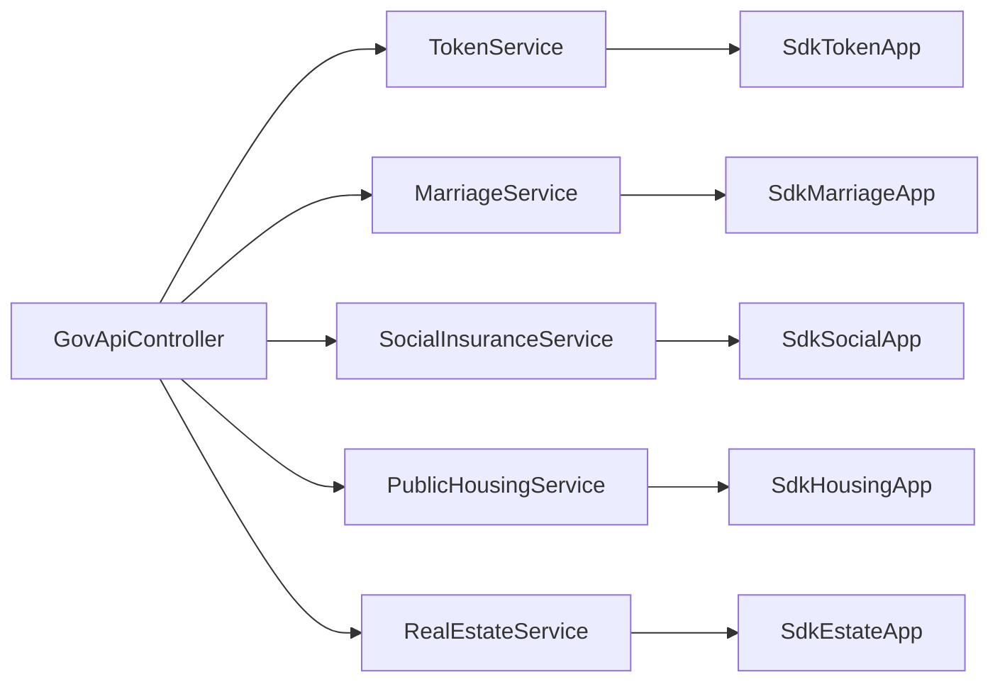

# 政务数据对接系统

<cite>
**本文引用的文件**
- [GovProxyApplication.java](file://ghz-gov-proxy/src/main/java/com/ghz/gov/GovProxyApplication.java)
- [GovApiController.java](file://ghz-gov-proxy/src/main/java/com/ghz/gov/controller/GovApiController.java)
- [GovProxyConfig.java](file://ghz-gov-proxy/src/main/java/com/ghz/gov/config/GovProxyConfig.java)
- [application.yml](file://ghz-gov-proxy/src/main/resources/application.yml)
- [application-prod.yml](file://ghz-gov-proxy/deploy/application-prod.yml)
- [MarriageService.java](file://ghz-gov-proxy/src/main/java/com/ghz/gov/service/MarriageService.java)
- [SocialInsuranceService.java](file://ghz-gov-proxy/src/main/java/com/ghz/gov/service/SocialInsuranceService.java)
- [PublicHousingService.java](file://ghz-gov-proxy/src/main/java/com/ghz/gov/service/PublicHousingService.java)
- [RealEstateService.java](file://ghz-gov-proxy/src/main/java/com/ghz/gov/service/RealEstateService.java)
- [TokenService.java](file://ghz-gov-proxy/src/main/java/com/ghz/gov/service/TokenService.java)
- [SdkMarriageApp.java](file://ghz-gov-proxy/src/main/java/com/ghz/gov/sdk/SdkMarriageApp.java)
- [SdkSocialApp.java](file://ghz-gov-proxy/src/main/java/com/ghz/gov/sdk/SdkSocialApp.java)
- [SdkHousingApp.java](file://ghz-gov-proxy/src/main/java/com/ghz/gov/sdk/SdkHousingApp.java)
- [SdkEstateApp.java](file://ghz-gov-proxy/src/main/java/com/ghz/gov/sdk/SdkEstateApp.java)
- [SdkTokenApp.java](file://ghz-gov-proxy/src/main/java/com/ghz/gov/sdk/SdkTokenApp.java)
</cite>

## 目录
1. [引言](#引言)
2. [项目结构](#项目结构)
3. [核心组件](#核心组件)
4. [架构总览](#架构总览)
5. [详细组件分析](#详细组件分析)
6. [依赖分析](#依赖分析)
7. [性能考虑](#性能考虑)
8. [故障排查指南](#故障排查指南)
9. [结论](#结论)
10. [附录](#附录)

## 引言
本文件面向港好住信息系统“政务数据对接系统”的技术与运维团队，系统性阐述独立政府代理服务的架构设计与实现要点，覆盖服务发现、接口代理、安全认证、负载均衡、SDK封装、加密认证、错误处理与超时重试、数据传输与隐私保护、审计日志、接口调用流程、参数签名验证、响应解析与异常处理、接口测试方法、性能监控与故障排查等内容。文档以代码为依据，辅以可视化图示，帮助非专业读者也能快速理解系统。

## 项目结构
本项目采用Spring Boot微服务风格，核心位于ghz-gov-proxy模块，包含应用入口、控制器、服务层、SDK封装与配置。部署配置分为开发与生产两套，分别位于resources与deploy目录。

图表来源
- [GovProxyApplication.java:1-15](file://ghz-gov-proxy/src/main/java/com/ghz/gov/GovProxyApplication.java#L1-L15)
- [GovApiController.java:1-149](file://ghz-gov-proxy/src/main/java/com/ghz/gov/controller/GovApiController.java#L1-L149)
- [GovProxyConfig.java:1-16](file://ghz-gov-proxy/src/main/java/com/ghz/gov/config/GovProxyConfig.java#L1-L16)
- [application.yml:1-13](file://ghz-gov-proxy/src/main/resources/application.yml#L1-L13)
- [application-prod.yml:1-26](file://ghz-gov-proxy/deploy/application-prod.yml#L1-L26)

章节来源
- [GovProxyApplication.java:1-15](file://ghz-gov-proxy/src/main/java/com/ghz/gov/GovProxyApplication.java#L1-L15)
- [GovApiController.java:1-149](file://ghz-gov-proxy/src/main/java/com/ghz/gov/controller/GovApiController.java#L1-L149)
- [GovProxyConfig.java:1-16](file://ghz-gov-proxy/src/main/java/com/ghz/gov/config/GovProxyConfig.java#L1-L16)
- [application.yml:1-13](file://ghz-gov-proxy/src/main/resources/application.yml#L1-L13)
- [application-prod.yml:1-26](file://ghz-gov-proxy/deploy/application-prod.yml#L1-L26)

## 核心组件
- 应用入口与调度
  - 应用入口负责启动Spring Boot容器与启用定时任务注解，确保Token定时刷新任务可运行。
- 控制器层
  - 对外暴露REST接口，统一鉴权（X-Api-Key）、参数校验、日志记录与错误返回。
  - 提供婚姻、社保、公租房、不动产四类查询接口，以及Token状态查询与健康检查。
- 服务层
  - TokenService：Token懒加载、并发锁保护、定时刷新、状态查询。
  - 各类业务服务：封装请求体、调用SDK、解析响应、重试控制与异常处理。
- SDK封装层
  - 针对不同政务接口封装SDK，内置超时配置、签名策略、加解密公私钥与主机地址。
- 配置层
  - 开发与生产环境的API Key、日志级别与日志文件路径配置。

章节来源
- [GovProxyApplication.java:1-15](file://ghz-gov-proxy/src/main/java/com/ghz/gov/GovProxyApplication.java#L1-L15)
- [GovApiController.java:1-149](file://ghz-gov-proxy/src/main/java/com/ghz/gov/controller/GovApiController.java#L1-L149)
- [TokenService.java:1-170](file://ghz-gov-proxy/src/main/java/com/ghz/gov/service/TokenService.java#L1-L170)
- [MarriageService.java:1-98](file://ghz-gov-proxy/src/main/java/com/ghz/gov/service/MarriageService.java#L1-L98)
- [SocialInsuranceService.java:1-110](file://ghz-gov-proxy/src/main/java/com/ghz/gov/service/SocialInsuranceService.java#L1-L110)
- [PublicHousingService.java:1-97](file://ghz-gov-proxy/src/main/java/com/ghz/gov/service/PublicHousingService.java#L1-L97)
- [RealEstateService.java:1-97](file://ghz-gov-proxy/src/main/java/com/ghz/gov/service/RealEstateService.java#L1-L97)
- [SdkTokenApp.java:1-47](file://ghz-gov-proxy/src/main/java/com/ghz/gov/sdk/SdkTokenApp.java#L1-L47)
- [SdkMarriageApp.java:1-46](file://ghz-gov-proxy/src/main/java/com/ghz/gov/sdk/SdkMarriageApp.java#L1-L46)
- [SdkSocialApp.java:1-46](file://ghz-gov-proxy/src/main/java/com/ghz/gov/sdk/SdkSocialApp.java#L1-L46)
- [SdkHousingApp.java:1-46](file://ghz-gov-proxy/src/main/java/com/ghz/gov/sdk/SdkHousingApp.java#L1-L46)
- [SdkEstateApp.java:1-47](file://ghz-gov-proxy/src/main/java/com/ghz/gov/sdk/SdkEstateApp.java#L1-L47)
- [GovProxyConfig.java:1-16](file://ghz-gov-proxy/src/main/java/com/ghz/gov/config/GovProxyConfig.java#L1-L16)
- [application.yml:1-13](file://ghz-gov-proxy/src/main/resources/application.yml#L1-L13)
- [application-prod.yml:1-26](file://ghz-gov-proxy/deploy/application-prod.yml#L1-L26)

## 架构总览
系统采用“控制器-服务-SDK”三层结构，控制器负责接入与鉴权，服务层负责业务编排与容错，SDK层负责与政务平台通信。TokenService通过定时任务与懒加载保证访问令牌可用性；各业务服务在调用前统一获取Token并进行参数构造与响应解析。

图表来源
- [GovApiController.java:1-149](file://ghz-gov-proxy/src/main/java/com/ghz/gov/controller/GovApiController.java#L1-L149)
- [TokenService.java:1-170](file://ghz-gov-proxy/src/main/java/com/ghz/gov/service/TokenService.java#L1-L170)
- [MarriageService.java:1-98](file://ghz-gov-proxy/src/main/java/com/ghz/gov/service/MarriageService.java#L1-L98)
- [SocialInsuranceService.java:1-110](file://ghz-gov-proxy/src/main/java/com/ghz/gov/service/SocialInsuranceService.java#L1-L110)
- [PublicHousingService.java:1-97](file://ghz-gov-proxy/src/main/java/com/ghz/gov/service/PublicHousingService.java#L1-L97)
- [RealEstateService.java:1-97](file://ghz-gov-proxy/src/main/java/com/ghz/gov/service/RealEstateService.java#L1-L97)
- [SdkTokenApp.java:1-47](file://ghz-gov-proxy/src/main/java/com/ghz/gov/sdk/SdkTokenApp.java#L1-L47)
- [SdkMarriageApp.java:1-46](file://ghz-gov-proxy/src/main/java/com/ghz/gov/sdk/SdkMarriageApp.java#L1-L46)
- [SdkSocialApp.java:1-46](file://ghz-gov-proxy/src/main/java/com/ghz/gov/sdk/SdkSocialApp.java#L1-L46)
- [SdkHousingApp.java:1-46](file://ghz-gov-proxy/src/main/java/com/ghz/gov/sdk/SdkHousingApp.java#L1-L46)
- [SdkEstateApp.java:1-47](file://ghz-gov-proxy/src/main/java/com/ghz/gov/sdk/SdkEstateApp.java#L1-L47)

## 详细组件分析

### 认证与安全
- API Key鉴权
  - 控制器从请求头读取X-Api-Key并与配置中的key比较，不匹配则返回401。
  - 配置支持开发与生产环境分离，生产环境key由部署文档明确给出。
- Token认证
  - TokenService通过SDK获取access_token，按固定周期刷新，避免过期。
  - SDK层设置连接、读写超时，确保网络抖动下的稳定性。
- 加密与签名
  - SDK封装内置RSA与国密公私钥、签名策略URL与令牌URL，请求携带access_token作为查询参数。
- 日志与审计
  - 控制器与服务层均记录关键操作日志，生产环境配置结构化日志文件路径。

图表来源
- [GovApiController.java:131-137](file://ghz-gov-proxy/src/main/java/com/ghz/gov/controller/GovApiController.java#L131-L137)
- [TokenService.java:139-146](file://ghz-gov-proxy/src/main/java/com/ghz/gov/service/TokenService.java#L139-L146)
- [SdkTokenApp.java:37-45](file://ghz-gov-proxy/src/main/java/com/ghz/gov/sdk/SdkTokenApp.java#L37-L45)

章节来源
- [GovApiController.java:139-147](file://ghz-gov-proxy/src/main/java/com/ghz/gov/controller/GovApiController.java#L139-L147)
- [GovProxyConfig.java:10-15](file://ghz-gov-proxy/src/main/java/com/ghz/gov/config/GovProxyConfig.java#L10-L15)
- [application-prod.yml:14-16](file://ghz-gov-proxy/deploy/application-prod.yml#L14-L16)
- [TokenService.java:65-119](file://ghz-gov-proxy/src/main/java/com/ghz/gov/service/TokenService.java#L65-L119)
- [SdkTokenApp.java:14-35](file://ghz-gov-proxy/src/main/java/com/ghz/gov/sdk/SdkTokenApp.java#L14-L35)

### 婚姻数据接口集成
- 请求参数
  - 必填：idCard、name。
- 请求构造
  - 使用SdkMarriageApp，body字段包含身份证号与姓名，附加access_token查询参数。
- 响应解析
  - 解析data或total判断是否存在记录，返回hasRecord与原始响应。
- 错误处理与重试
  - 对特定超时错误进行最多3次重试，重试间隔由调用循环控制。
- 日志记录
  - 记录耗时与结果状态，便于审计与性能分析。

图表来源
- [GovApiController.java:48-66](file://ghz-gov-proxy/src/main/java/com/ghz/gov/controller/GovApiController.java#L48-L66)
- [MarriageService.java:36-91](file://ghz-gov-proxy/src/main/java/com/ghz/gov/service/MarriageService.java#L36-L91)
- [SdkMarriageApp.java:37-44](file://ghz-gov-proxy/src/main/java/com/ghz/gov/sdk/SdkMarriageApp.java#L37-L44)

章节来源
- [GovApiController.java:48-66](file://ghz-gov-proxy/src/main/java/com/ghz/gov/controller/GovApiController.java#L48-L66)
- [MarriageService.java:36-91](file://ghz-gov-proxy/src/main/java/com/ghz/gov/service/MarriageService.java#L36-L91)
- [SdkMarriageApp.java:14-35](file://ghz-gov-proxy/src/main/java/com/ghz/gov/sdk/SdkMarriageApp.java#L14-L35)

### 社保数据接口集成
- 请求参数
  - 必填：idCard、name；自动填充STARTDATE/ENDDATE为近12个月。
- 请求构造
  - 使用SdkSocialApp，body字段包含身份证号、姓名与日期范围，附加access_token查询参数。
- 响应解析
  - 解析data或total判断是否存在记录，返回hasRecord、records（如有）与原始响应。
- 错误处理与重试
  - 对特定超时错误进行最多3次重试，重试间隔由调用循环控制。
- 日志记录
  - 记录耗时与标识tag，便于审计与性能分析。

图表来源
- [GovApiController.java:68-87](file://ghz-gov-proxy/src/main/java/com/ghz/gov/controller/GovApiController.java#L68-L87)
- [SocialInsuranceService.java:38-103](file://ghz-gov-proxy/src/main/java/com/ghz/gov/service/SocialInsuranceService.java#L38-L103)
- [SdkSocialApp.java:37-44](file://ghz-gov-proxy/src/main/java/com/ghz/gov/sdk/SdkSocialApp.java#L37-L44)

章节来源
- [GovApiController.java:68-87](file://ghz-gov-proxy/src/main/java/com/ghz/gov/controller/GovApiController.java#L68-L87)
- [SocialInsuranceService.java:38-103](file://ghz-gov-proxy/src/main/java/com/ghz/gov/service/SocialInsuranceService.java#L38-L103)
- [SdkSocialApp.java:14-35](file://ghz-gov-proxy/src/main/java/com/ghz/gov/sdk/SdkSocialApp.java#L14-L35)

### 公租房接口集成
- 请求参数
  - 必填：idCard、name。
- 请求构造
  - 使用SdkHousingApp，body字段包含card_num与name，附加access_token查询参数。
- 响应解析
  - 解析data或total判断是否存在记录，返回hasRecord与原始响应。
- 错误处理与重试
  - 对特定超时错误进行最多3次重试，重试间隔由调用循环控制。
- 日志记录
  - 记录耗时与结果状态，便于审计与性能分析。

图表来源
- [GovApiController.java:89-108](file://ghz-gov-proxy/src/main/java/com/ghz/gov/controller/GovApiController.java#L89-L108)
- [PublicHousingService.java:35-89](file://ghz-gov-proxy/src/main/java/com/ghz/gov/service/PublicHousingService.java#L35-L89)
- [SdkHousingApp.java:37-44](file://ghz-gov-proxy/src/main/java/com/ghz/gov/sdk/SdkHousingApp.java#L37-L44)

章节来源
- [GovApiController.java:89-108](file://ghz-gov-proxy/src/main/java/com/ghz/gov/controller/GovApiController.java#L89-L108)
- [PublicHousingService.java:35-89](file://ghz-gov-proxy/src/main/java/com/ghz/gov/service/PublicHousingService.java#L35-L89)
- [SdkHousingApp.java:14-35](file://ghz-gov-proxy/src/main/java/com/ghz/gov/sdk/SdkHousingApp.java#L14-L35)

### 不动产登记接口集成
- 请求参数
  - 必填：idCard、name。
- 请求构造
  - 使用SdkEstateApp，body字段包含personCertNo与personName，附加access_token查询参数。
- 响应解析
  - 解析data或total判断是否存在记录，返回hasRecord与原始响应。
- 错误处理与重试
  - 对特定超时错误进行最多3次重试，重试间隔由调用循环控制。
- 日志记录
  - 记录耗时与结果状态，便于审计与性能分析。

图表来源
- [GovApiController.java:110-129](file://ghz-gov-proxy/src/main/java/com/ghz/gov/controller/GovApiController.java#L110-L129)
- [RealEstateService.java:35-89](file://ghz-gov-proxy/src/main/java/com/ghz/gov/service/RealEstateService.java#L35-L89)
- [SdkEstateApp.java:38-45](file://ghz-gov-proxy/src/main/java/com/ghz/gov/sdk/SdkEstateApp.java#L38-L45)

章节来源
- [GovApiController.java:110-129](file://ghz-gov-proxy/src/main/java/com/ghz/gov/controller/GovApiController.java#L110-L129)
- [RealEstateService.java:35-89](file://ghz-gov-proxy/src/main/java/com/ghz/gov/service/RealEstateService.java#L35-L89)
- [SdkEstateApp.java:14-35](file://ghz-gov-proxy/src/main/java/com/ghz/gov/sdk/SdkEstateApp.java#L14-L35)

### SDK封装设计与加密认证
- SDK初始化
  - 设置ApiClient超时参数，初始化host、端口、上下文路径、签名策略与令牌URL。
  - 配置RSA与国密公钥/私钥，用于请求签名与响应解密。
- 请求构建
  - 统一设置HTTP方法、目标路径、认证类型与签名策略，附加access_token查询参数。
- 调用与响应
  - 同步调用返回ApiResponse，上层根据状态码与body进行处理。

图表来源
- [SdkTokenApp.java:14-45](file://ghz-gov-proxy/src/main/java/com/ghz/gov/sdk/SdkTokenApp.java#L14-L45)
- [SdkMarriageApp.java:14-44](file://ghz-gov-proxy/src/main/java/com/ghz/gov/sdk/SdkMarriageApp.java#L14-L44)
- [SdkSocialApp.java:14-44](file://ghz-gov-proxy/src/main/java/com/ghz/gov/sdk/SdkSocialApp.java#L14-L44)
- [SdkHousingApp.java:14-44](file://ghz-gov-proxy/src/main/java/com/ghz/gov/sdk/SdkHousingApp.java#L14-L44)
- [SdkEstateApp.java:14-45](file://ghz-gov-proxy/src/main/java/com/ghz/gov/sdk/SdkEstateApp.java#L14-L45)

章节来源
- [SdkTokenApp.java:14-45](file://ghz-gov-proxy/src/main/java/com/ghz/gov/sdk/SdkTokenApp.java#L14-L45)
- [SdkMarriageApp.java:14-44](file://ghz-gov-proxy/src/main/java/com/ghz/gov/sdk/SdkMarriageApp.java#L14-L44)
- [SdkSocialApp.java:14-44](file://ghz-gov-proxy/src/main/java/com/ghz/gov/sdk/SdkSocialApp.java#L14-L44)
- [SdkHousingApp.java:14-44](file://ghz-gov-proxy/src/main/java/com/ghz/gov/sdk/SdkHousingApp.java#L14-L44)
- [SdkEstateApp.java:14-45](file://ghz-gov-proxy/src/main/java/com/ghz/gov/sdk/SdkEstateApp.java#L14-L45)

### 错误处理策略与超时重试机制
- 统一错误返回
  - 控制器层对必填参数缺失、业务异常与系统异常进行标准化返回。
- 业务异常处理
  - 服务层捕获SDK调用异常，记录错误日志并抛出运行时异常，由控制器转换为统一错误响应。
- 超时重试
  - 针对特定超时错误（如SHD-1004或“网关连接后端服务超时”）进行最多3次重试，提升稳定性。
- Token刷新保护
  - 使用并发锁保护刷新过程，避免并发重复刷新；定时任务每25分钟刷新一次，留有5分钟余量。

图表来源
- [MarriageService.java:48-91](file://ghz-gov-proxy/src/main/java/com/ghz/gov/service/MarriageService.java#L48-L91)
- [SocialInsuranceService.java:56-103](file://ghz-gov-proxy/src/main/java/com/ghz/gov/service/SocialInsuranceService.java#L56-L103)
- [PublicHousingService.java:47-89](file://ghz-gov-proxy/src/main/java/com/ghz/gov/service/PublicHousingService.java#L47-L89)
- [RealEstateService.java:47-89](file://ghz-gov-proxy/src/main/java/com/ghz/gov/service/RealEstateService.java#L47-L89)

章节来源
- [MarriageService.java:48-91](file://ghz-gov-proxy/src/main/java/com/ghz/gov/service/MarriageService.java#L48-L91)
- [SocialInsuranceService.java:56-103](file://ghz-gov-proxy/src/main/java/com/ghz/gov/service/SocialInsuranceService.java#L56-L103)
- [PublicHousingService.java:47-89](file://ghz-gov-proxy/src/main/java/com/ghz/gov/service/PublicHousingService.java#L47-L89)
- [RealEstateService.java:47-89](file://ghz-gov-proxy/src/main/java/com/ghz/gov/service/RealEstateService.java#L47-L89)
- [TokenService.java:42-53](file://ghz-gov-proxy/src/main/java/com/ghz/gov/service/TokenService.java#L42-L53)

### 数据传输安全性与隐私保护
- 传输安全
  - SDK层配置HTTPS端口与公钥/私钥，结合签名策略与access_token参数，确保请求链路安全。
- 隐私保护
  - 控制器与服务层仅记录必要日志，不输出敏感字段明文；生产环境日志文件路径集中管理。
- 审计日志
  - 记录请求耗时、查询结果状态与关键业务事件，便于合规审计。

章节来源
- [SdkEstateApp.java:24-35](file://ghz-gov-proxy/src/main/java/com/ghz/gov/sdk/SdkEstateApp.java#L24-L35)
- [application-prod.yml:22-25](file://ghz-gov-proxy/deploy/application-prod.yml#L22-L25)

## 依赖分析
- 组件耦合
  - 控制器依赖服务层；服务层依赖TokenService与SDK封装；SDK封装依赖第三方SDK客户端。
- 外部依赖
  - 第三方政务平台SDK（签名、加密、认证）。
- 可能的循环依赖
  - 当前结构清晰，未见循环依赖迹象。
- 配置依赖
  - API Key与日志配置在不同环境文件中维护，避免硬编码。

图表来源
- [GovApiController.java:24-35](file://ghz-gov-proxy/src/main/java/com/ghz/gov/controller/GovApiController.java#L24-L35)
- [TokenService.java:31](file://ghz-gov-proxy/src/main/java/com/ghz/gov/service/TokenService.java#L31)
- [MarriageService.java:28](file://ghz-gov-proxy/src/main/java/com/ghz/gov/service/MarriageService.java#L28)
- [SocialInsuranceService.java:30](file://ghz-gov-proxy/src/main/java/com/ghz/gov/service/SocialInsuranceService.java#L30)
- [PublicHousingService.java:28](file://ghz-gov-proxy/src/main/java/com/ghz/gov/service/PublicHousingService.java#L28)
- [RealEstateService.java:28](file://ghz-gov-proxy/src/main/java/com/ghz/gov/service/RealEstateService.java#L28)
- [SdkTokenApp.java:20](file://ghz-gov-proxy/src/main/java/com/ghz/gov/sdk/SdkTokenApp.java#L20)

章节来源
- [GovApiController.java:24-35](file://ghz-gov-proxy/src/main/java/com/ghz/gov/controller/GovApiController.java#L24-L35)
- [TokenService.java:31](file://ghz-gov-proxy/src/main/java/com/ghz/gov/service/TokenService.java#L31)
- [MarriageService.java:28](file://ghz-gov-proxy/src/main/java/com/ghz/gov/service/MarriageService.java#L28)
- [SocialInsuranceService.java:30](file://ghz-gov-proxy/src/main/java/com/ghz/gov/service/SocialInsuranceService.java#L30)
- [PublicHousingService.java:28](file://ghz-gov-proxy/src/main/java/com/ghz/gov/service/PublicHousingService.java#L28)
- [RealEstateService.java:28](file://ghz-gov-proxy/src/main/java/com/ghz/gov/service/RealEstateService.java#L28)
- [SdkTokenApp.java:20](file://ghz-gov-proxy/src/main/java/com/ghz/gov/sdk/SdkTokenApp.java#L20)

## 性能考虑
- 超时与重试
  - SDK层设置合理的连接与读写超时；业务层针对特定超时错误进行有限次数重试，平衡稳定性与资源消耗。
- Token刷新策略
  - 定时任务每25分钟刷新一次，留有5分钟余量，避免频繁刷新带来的额外开销。
- 日志级别
  - 开发环境DEBUG，生产环境INFO，并输出结构化日志文件，降低日志对性能的影响。
- 建议
  - 在高并发场景下，建议引入限流与熔断策略，配合异步队列缓冲瞬时高峰。

章节来源
- [SdkMarriageApp.java:16-18](file://ghz-gov-proxy/src/main/java/com/ghz/gov/sdk/SdkMarriageApp.java#L16-L18)
- [TokenService.java:124-134](file://ghz-gov-proxy/src/main/java/com/ghz/gov/service/TokenService.java#L124-L134)
- [application.yml:10-12](file://ghz-gov-proxy/src/main/resources/application.yml#L10-L12)
- [application-prod.yml:18-25](file://ghz-gov-proxy/deploy/application-prod.yml#L18-L25)

## 故障排查指南
- 常见问题定位
  - 认证失败：确认请求头X-Api-Key正确，生产环境key已在部署配置中给出。
  - Token获取失败：查看定时刷新日志与SDK响应体，关注状态码与文本信息。
  - 接口超时：检查网络连通性与政务平台可用性，确认SDK超时参数合理。
  - 业务异常：查看服务层日志，定位具体异常类型与堆栈。
- 关键日志位置
  - 控制器与服务层日志输出，生产环境日志文件路径在部署配置中定义。
- 处理步骤
  - 核对配置文件与环境变量，确认API Key与日志路径。
  - 观察定时任务日志，确认Token刷新是否正常。
  - 分析接口调用日志，定位失败阶段与错误码。

章节来源
- [GovApiController.java:139-147](file://ghz-gov-proxy/src/main/java/com/ghz/gov/controller/GovApiController.java#L139-L147)
- [TokenService.java:65-119](file://ghz-gov-proxy/src/main/java/com/ghz/gov/service/TokenService.java#L65-L119)
- [application-prod.yml:22-25](file://ghz-gov-proxy/deploy/application-prod.yml#L22-L25)

## 结论
本系统通过清晰的分层架构与完善的SDK封装，实现了对婚姻、社保、公租房、不动产等政务接口的稳定代理与安全对接。通过API Key鉴权、Token管理、超时重试与日志审计，满足了政务系统的合规与可靠性要求。建议在生产环境中进一步完善限流、熔断与监控告警体系，持续优化性能与可用性。

## 附录
- 接口测试方法
  - 使用HTTP客户端向控制器接口发送POST请求，携带X-Api-Key与必填参数，观察响应状态与业务字段。
- 性能监控方案
  - 建议接入APM工具，采集接口耗时、错误率、Token刷新成功率与线程池状态等指标。
- 部署与运维
  - 生产环境使用部署配置文件，确保API Key与日志路径正确；定期检查日志文件滚动与磁盘空间。

章节来源
- [GovApiController.java:48-129](file://ghz-gov-proxy/src/main/java/com/ghz/gov/controller/GovApiController.java#L48-L129)
- [application-prod.yml:14-25](file://ghz-gov-proxy/deploy/application-prod.yml#L14-L25)