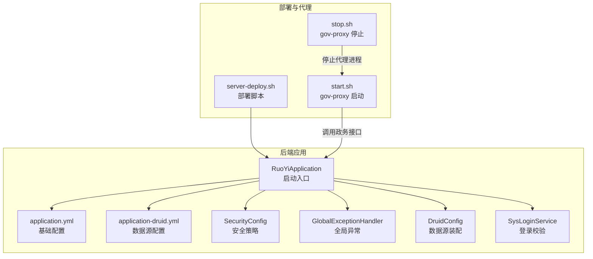
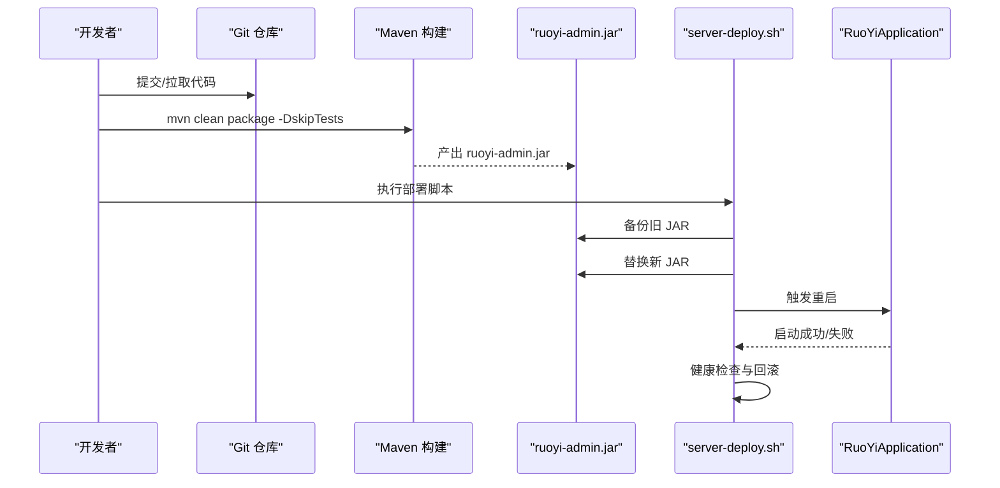
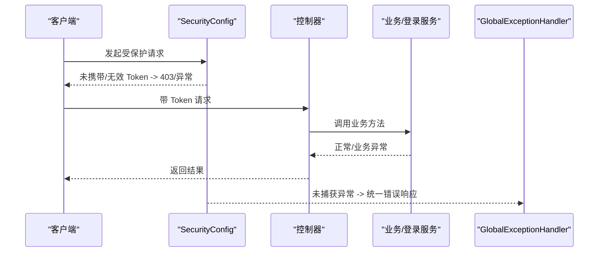
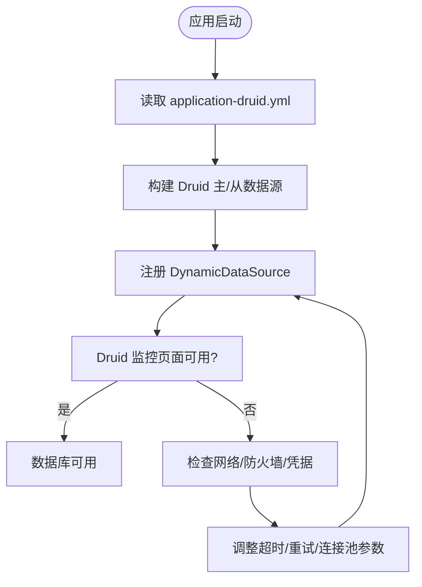
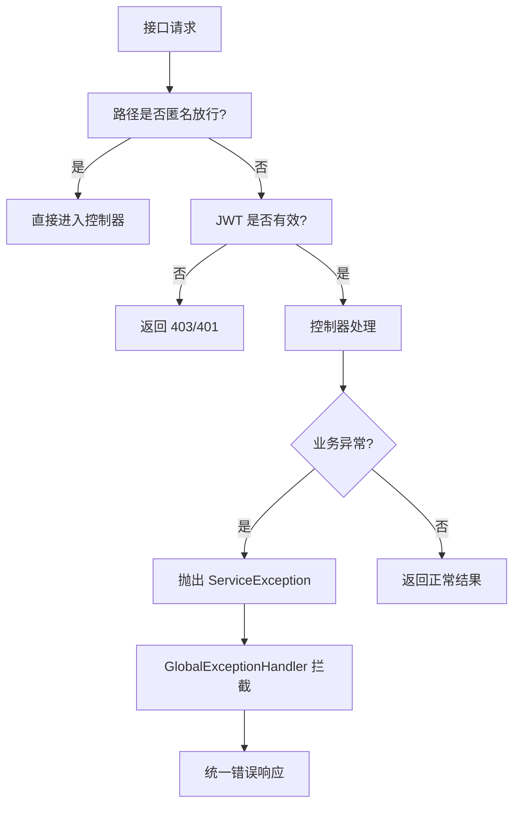
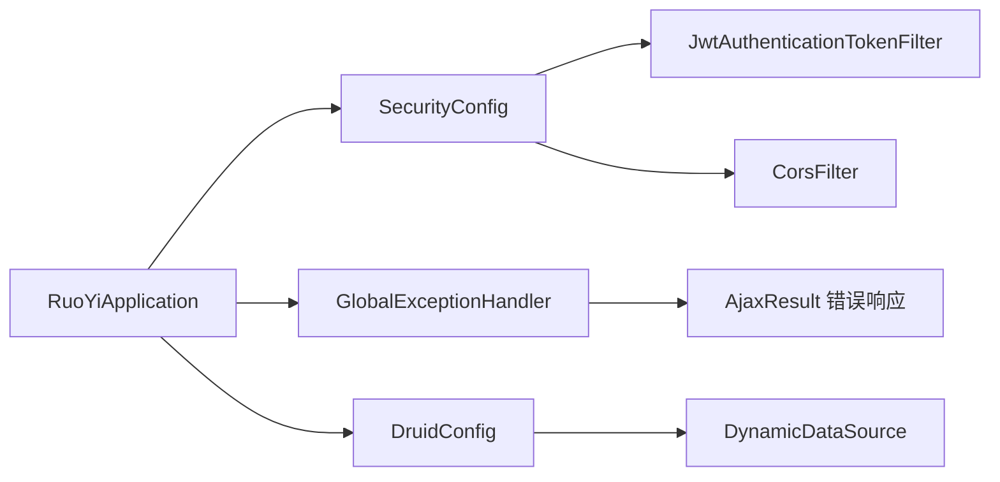

# 常见问题诊断

<cite>
**本文引用的文件**
- [RuoYiApplication.java](file://ruoyi-admin/src/main/java/com/ruoyi/RuoYiApplication.java)
- [application.yml](file://ruoyi-admin/src/main/resources/application.yml)
- [application-druid.yml](file://ruoyi-admin/src/main/resources/application-druid.yml)
- [DruidConfig.java](file://ruoyi-framework/src/main/java/com/ruoyi/framework/config/DruidConfig.java)
- [SecurityConfig.java](file://ruoyi-framework/src/main/java/com/ruoyi/framework/config/SecurityConfig.java)
- [GlobalExceptionHandler.java](file://ruoyi-framework/src/main/java/com/ruoyi/framework/web/exception/GlobalExceptionHandler.java)
- [SysLoginService.java](file://ruoyi-framework/src/main/java/com/ruoyi/framework/web/service/SysLoginService.java)
- [Cpu.java](file://ruoyi-framework/src/main/java/com/ruoyi/framework/web/domain/server/Cpu.java)
- [start.sh](file://ghz-gov-proxy/deploy/start.sh)
- [stop.sh](file://ghz-gov-proxy/deploy/stop.sh)
- [server-deploy.sh](file://server-deploy.sh)
</cite>

## 目录
1. [简介](#简介)
2. [项目结构](#项目结构)
3. [核心组件](#核心组件)
4. [架构总览](#架构总览)
5. [详细组件分析](#详细组件分析)
6. [依赖分析](#依赖分析)
7. [性能考虑](#性能考虑)
8. [故障排查指南](#故障排查指南)
9. [结论](#结论)
10. [附录](#附录)

## 简介
本指南面向港好住信息系统运维与开发人员，聚焦系统启动失败、数据库连接异常、接口调用错误、性能瓶颈等常见问题，提供可操作的诊断流程、根因分析、排查步骤与解决方案。文档结合系统实际配置与部署脚本，给出端到端的定位方法与修复建议。

## 项目结构
系统采用前后端分离与多模块工程组织，后端基于 Spring Boot 与 RuoYi 框架，包含管理后台、框架层、通用组件、定时任务、代码生成、以及政务数据代理服务等模块。配置集中在 ruoyi-admin 的 application.yml 与 application-druid.yml 中，安全与异常处理由框架层统一管理。

图表来源
- [RuoYiApplication.java:12-20](file://ruoyi-admin/src/main/java/com/ruoyi/RuoYiApplication.java#L12-L20)
- [application.yml:19-22](file://ruoyi-admin/src/main/resources/application.yml#L19-L22)
- [application-druid.yml:12-14](file://ruoyi-admin/src/main/resources/application-druid.yml#L12-L14)
- [SecurityConfig.java:86-123](file://ruoyi-framework/src/main/java/com/ruoyi/framework/config/SecurityConfig.java#L86-L123)
- [GlobalExceptionHandler.java:27-145](file://ruoyi-framework/src/main/java/com/ruoyi/framework/web/exception/GlobalExceptionHandler.java#L27-L145)
- [DruidConfig.java:32-79](file://ruoyi-framework/src/main/java/com/ruoyi/framework/config/DruidConfig.java#L32-L79)
- [SysLoginService.java:36-100](file://ruoyi-framework/src/main/java/com/ruoyi/framework/web/service/SysLoginService.java#L36-L100)
- [server-deploy.sh:1-42](file://server-deploy.sh#L1-L42)
- [start.sh:1-47](file://ghz-gov-proxy/deploy/start.sh#L1-L47)
- [stop.sh:1-42](file://ghz-gov-proxy/deploy/stop.sh#L1-L42)

章节来源
- [RuoYiApplication.java:12-20](file://ruoyi-admin/src/main/java/com/ruoyi/RuoYiApplication.java#L12-L20)
- [application.yml:19-22](file://ruoyi-admin/src/main/resources/application.yml#L19-L22)
- [application-druid.yml:12-14](file://ruoyi-admin/src/main/resources/application-druid.yml#L12-L14)
- [SecurityConfig.java:86-123](file://ruoyi-framework/src/main/java/com/ruoyi/framework/config/SecurityConfig.java#L86-L123)
- [GlobalExceptionHandler.java:27-145](file://ruoyi-framework/src/main/java/com/ruoyi/framework/web/exception/GlobalExceptionHandler.java#L27-L145)
- [DruidConfig.java:32-79](file://ruoyi-framework/src/main/java/com/ruoyi/framework/config/DruidConfig.java#L32-L79)
- [SysLoginService.java:36-100](file://ruoyi-framework/src/main/java/com/ruoyi/framework/web/service/SysLoginService.java#L36-L100)
- [server-deploy.sh:1-42](file://server-deploy.sh#L1-L42)
- [start.sh:1-47](file://ghz-gov-proxy/deploy/start.sh#L1-L47)
- [stop.sh:1-42](file://ghz-gov-proxy/deploy/stop.sh#L1-L42)

## 核心组件
- 启动入口与排除项：应用启动类排除了数据源自动装配，后续由框架层动态装配数据源与安全配置。
- 配置中心：application.yml 统一管理服务器端口、Tomcat 线程池、Redis、MyBatis-Plus、Swagger、XSS、微信/电子签等集成配置；application-druid.yml 专用于 MySQL 数据源与 Druid 监控。
- 安全与异常：SecurityConfig 定义匿名放行路径与 JWT 过滤链；GlobalExceptionHandler 统一捕获并返回标准错误响应。
- 登录与校验：SysLoginService 负责验证码校验、登录前置校验、认证与 Token 生成。
- 数据源装配：DruidConfig 将主从数据源注入动态数据源容器，支持从库按需启用。
- 性能指标：Cpu 类封装 CPU 使用率统计模型，便于监控与告警。

章节来源
- [RuoYiApplication.java:12-20](file://ruoyi-admin/src/main/java/com/ruoyi/RuoYiApplication.java#L12-L20)
- [application.yml:52-238](file://ruoyi-admin/src/main/resources/application.yml#L52-L238)
- [application-druid.yml:1-64](file://ruoyi-admin/src/main/resources/application-druid.yml#L1-L64)
- [SecurityConfig.java:86-123](file://ruoyi-framework/src/main/java/com/ruoyi/framework/config/SecurityConfig.java#L86-L123)
- [GlobalExceptionHandler.java:27-145](file://ruoyi-framework/src/main/java/com/ruoyi/framework/web/exception/GlobalExceptionHandler.java#L27-L145)
- [SysLoginService.java:36-100](file://ruoyi-framework/src/main/java/com/ruoyi/framework/web/service/SysLoginService.java#L36-L100)
- [DruidConfig.java:32-79](file://ruoyi-framework/src/main/java/com/ruoyi/framework/config/DruidConfig.java#L32-L79)
- [Cpu.java:10-102](file://ruoyi-framework/src/main/java/com/ruoyi/framework/web/domain/server/Cpu.java#L10-L102)

## 架构总览
系统后端以 Spring Boot 为核心，通过配置文件与 Bean 注入完成安全、数据源、异常处理等横切能力。部署脚本负责拉取代码、构建、替换 JAR 并健康检查，若启动失败则回滚至上一个版本。

图表来源
- [server-deploy.sh:7-39](file://server-deploy.sh#L7-L39)
- [RuoYiApplication.java:15-20](file://ruoyi-admin/src/main/java/com/ruoyi/RuoYiApplication.java#L15-L20)

章节来源
- [server-deploy.sh:1-42](file://server-deploy.sh#L1-L42)
- [RuoYiApplication.java:12-20](file://ruoyi-admin/src/main/java/com/ruoyi/RuoYiApplication.java#L12-L20)

## 详细组件分析

### 启动流程与异常处理
- 启动类排除数据源自动装配，确保由 DruidConfig 动态装配主从数据源。
- 全局异常处理器对权限不足、请求方法不支持、业务异常、参数类型不匹配、运行时异常等进行统一处理，并返回标准 AjaxResult。
- 登录服务在认证前进行验证码与前置校验，失败时记录登录日志并抛出对应异常。

图表来源
- [SecurityConfig.java:86-123](file://ruoyi-framework/src/main/java/com/ruoyi/framework/config/SecurityConfig.java#L86-L123)
- [GlobalExceptionHandler.java:27-145](file://ruoyi-framework/src/main/java/com/ruoyi/framework/web/exception/GlobalExceptionHandler.java#L27-L145)
- [SysLoginService.java:63-100](file://ruoyi-framework/src/main/java/com/ruoyi/framework/web/service/SysLoginService.java#L63-L100)

章节来源
- [RuoYiApplication.java:12-20](file://ruoyi-admin/src/main/java/com/ruoyi/RuoYiApplication.java#L12-L20)
- [GlobalExceptionHandler.java:27-145](file://ruoyi-framework/src/main/java/com/ruoyi/framework/web/exception/GlobalExceptionHandler.java#L27-L145)
- [SysLoginService.java:36-100](file://ruoyi-framework/src/main/java/com/ruoyi/framework/web/service/SysLoginService.java#L36-L100)

### 数据库连接与监控
- 数据源配置位于 application-druid.yml，主库地址、用户名、密码、连接超时、Socket 超时、连接池参数均在此集中管理。
- DruidConfig 将主从数据源装配进动态数据源容器，支持按需启用从库。
- Druid 控制台开启后可查看慢 SQL、SQL 统计与连接池状态，便于定位连接超时、慢查询等问题。

图表来源
- [application-druid.yml:12-64](file://ruoyi-admin/src/main/resources/application-druid.yml#L12-L64)
- [DruidConfig.java:32-79](file://ruoyi-framework/src/main/java/com/ruoyi/framework/config/DruidConfig.java#L32-L79)

章节来源
- [application-druid.yml:1-64](file://ruoyi-admin/src/main/resources/application-druid.yml#L1-L64)
- [DruidConfig.java:32-79](file://ruoyi-framework/src/main/java/com/ruoyi/framework/config/DruidConfig.java#L32-L79)

### 接口调用错误定位
- 通过 SecurityConfig 的匿名放行路径与受保护路径，快速判断是否为鉴权问题导致的 403/401。
- GlobalExceptionHandler 对参数类型不匹配、业务异常、未知运行时异常进行统一拦截与错误输出，便于前端与测试定位。
- SysLoginService 在认证失败时记录登录日志并抛出具体异常，辅助定位验证码、密码、账号等前置问题。

图表来源
- [SecurityConfig.java:100-114](file://ruoyi-framework/src/main/java/com/ruoyi/framework/config/SecurityConfig.java#L100-L114)
- [GlobalExceptionHandler.java:58-64](file://ruoyi-framework/src/main/java/com/ruoyi/framework/web/exception/GlobalExceptionHandler.java#L58-L64)
- [SysLoginService.java:78-90](file://ruoyi-framework/src/main/java/com/ruoyi/framework/web/service/SysLoginService.java#L78-L90)

章节来源
- [SecurityConfig.java:86-123](file://ruoyi-framework/src/main/java/com/ruoyi/framework/config/SecurityConfig.java#L86-L123)
- [GlobalExceptionHandler.java:27-145](file://ruoyi-framework/src/main/java/com/ruoyi/framework/web/exception/GlobalExceptionHandler.java#L27-L145)
- [SysLoginService.java:36-100](file://ruoyi-framework/src/main/java/com/ruoyi/framework/web/service/SysLoginService.java#L36-L100)

## 依赖分析
- 启动类排除数据源自动装配，避免与动态数据源冲突。
- 安全配置与 CORS 过滤器在 WebFlux/Servlet 链路中顺序执行，确保跨域与鉴权生效。
- 异常处理器作为全局 Advice，覆盖所有控制器层异常，保证错误输出一致性。
- 数据源装配通过 DruidConfig 注入，动态数据源容器根据路由选择主/从库。

图表来源
- [RuoYiApplication.java:12-20](file://ruoyi-admin/src/main/java/com/ruoyi/RuoYiApplication.java#L12-L20)
- [SecurityConfig.java:86-123](file://ruoyi-framework/src/main/java/com/ruoyi/framework/config/SecurityConfig.java#L86-L123)
- [GlobalExceptionHandler.java:27-145](file://ruoyi-framework/src/main/java/com/ruoyi/framework/web/exception/GlobalExceptionHandler.java#L27-L145)
- [DruidConfig.java:32-79](file://ruoyi-framework/src/main/java/com/ruoyi/framework/config/DruidConfig.java#L32-L79)

章节来源
- [RuoYiApplication.java:12-20](file://ruoyi-admin/src/main/java/com/ruoyi/RuoYiApplication.java#L12-L20)
- [SecurityConfig.java:86-123](file://ruoyi-framework/src/main/java/com/ruoyi/framework/config/SecurityConfig.java#L86-L123)
- [GlobalExceptionHandler.java:27-145](file://ruoyi-framework/src/main/java/com/ruoyi/framework/web/exception/GlobalExceptionHandler.java#L27-L145)
- [DruidConfig.java:32-79](file://ruoyi-framework/src/main/java/com/ruoyi/framework/config/DruidConfig.java#L32-L79)

## 性能考虑
- CPU 使用率：Cpu 类提供 CPU 总体、系统、用户、等待、空闲等指标的百分比封装，可用于监控面板与告警阈值设置。
- Tomcat 线程池：application.yml 中配置了 accept-count、max、min-spare 等参数，可根据并发峰值调整。
- 连接池与慢 SQL：application-druid.yml 中配置了连接池大小、超时、慢 SQL 记录阈值，结合 Druid 控制台定位慢查询与连接争用。
- 文件上传与缓存：application.yml 中设置了较大的文件上传大小，注意磁盘空间与 Nginx 上传限制。

章节来源
- [Cpu.java:10-102](file://ruoyi-framework/src/main/java/com/ruoyi/framework/web/domain/server/Cpu.java#L10-L102)
- [application.yml:20-36](file://ruoyi-admin/src/main/resources/application.yml#L20-L36)
- [application-druid.yml:22-64](file://ruoyi-admin/src/main/resources/application-druid.yml#L22-L64)

## 故障排查指南

### 系统启动失败
- 症状
  - 启动报错、端口占用、配置加载失败、依赖缺失。
- 诊断步骤
  - 确认端口占用：检查 server.port 是否被占用，必要时修改为其他端口。
  - 检查配置文件：确认 application.yml 与 application-druid.yml 路径与权限正确。
  - 查看启动日志：关注启动类排除数据源自动装配是否生效，动态数据源是否成功注册。
  - 部署脚本健康检查：使用 server-deploy.sh 的健康检查逻辑，若失败则触发回滚。
- 解决方案
  - 修改端口或释放占用端口。
  - 修正配置文件路径与权限，确保 Spring 能正确加载。
  - 若使用 Druid 监控，确认控制台访问路径与白名单配置。
  - 通过部署脚本回滚至上一个稳定版本。

章节来源
- [RuoYiApplication.java:12-20](file://ruoyi-admin/src/main/java/com/ruoyi/RuoYiApplication.java#L12-L20)
- [application.yml:19-22](file://ruoyi-admin/src/main/resources/application.yml#L19-L22)
- [server-deploy.sh:29-39](file://server-deploy.sh#L29-L39)

### 数据库连接异常
- 症状
  - 连接超时、认证失败、网络不可达、连接池耗尽。
- 诊断步骤
  - 检查主库地址、用户名、密码是否正确，确认网络连通性与防火墙策略。
  - 查看 Druid 控制台（/druid）与慢 SQL 日志，定位慢查询与连接池状态。
  - 根据 application-druid.yml 调整连接超时、Socket 超时、连接池大小与最大等待时间。
  - 如启用从库，确认从库开关与连接参数。
- 解决方案
  - 修正数据库地址与凭据，开放网络访问。
  - 调整连接池参数与超时阈值，优化慢 SQL。
  - 按需启用从库，提升读写分离能力。

章节来源
- [application-druid.yml:12-64](file://ruoyi-admin/src/main/resources/application-druid.yml#L12-L64)
- [DruidConfig.java:32-79](file://ruoyi-framework/src/main/java/com/ruoyi/framework/config/DruidConfig.java#L32-L79)

### 接口调用错误
- 症状
  - 403/401 权限不足、参数类型不匹配、业务异常、未知运行时异常。
- 诊断步骤
  - 确认请求路径是否在匿名放行列表中，否则需携带有效 JWT。
  - 检查请求方法是否受支持，参数类型与必填字段是否满足控制器校验。
  - 查看全局异常处理器返回的错误信息，定位具体异常类型。
  - 登录失败场景，检查验证码、密码长度、账号长度与黑名单策略。
- 解决方案
  - 补充或修正请求头与参数，确保符合接口规范。
  - 修复业务逻辑或参数校验规则，避免抛出 ServiceException。
  - 调整验证码策略与登录前置校验参数，减少误判。

章节来源
- [SecurityConfig.java:100-114](file://ruoyi-framework/src/main/java/com/ruoyi/framework/config/SecurityConfig.java#L100-L114)
- [GlobalExceptionHandler.java:58-91](file://ruoyi-framework/src/main/java/com/ruoyi/framework/web/exception/GlobalExceptionHandler.java#L58-L91)
- [SysLoginService.java:63-100](file://ruoyi-framework/src/main/java/com/ruoyi/framework/web/service/SysLoginService.java#L63-L100)

### 性能瓶颈
- 症状
  - CPU 使用率过高、内存增长、数据库慢查询、接口响应缓慢。
- 诊断步骤
  - 采集 CPU 指标，结合 Cpu 类封装的百分比评估整体负载。
  - 检查 Tomcat 线程池参数，观察排队与最大线程使用情况。
  - 通过 Druid 控制台查看慢 SQL 与连接池等待队列，定位热点 SQL。
  - 关注文件上传大小与磁盘 IO，避免成为瓶颈。
- 解决方案
  - 调整 Tomcat 线程池与连接池参数，优化并发处理能力。
  - 优化慢 SQL、增加索引、拆分读写或启用从库。
  - 控制文件上传大小与缓存策略，降低 IO 压力。

章节来源
- [Cpu.java:10-102](file://ruoyi-framework/src/main/java/com/ruoyi/framework/web/domain/server/Cpu.java#L10-L102)
- [application.yml:20-36](file://ruoyi-admin/src/main/resources/application.yml#L20-L36)
- [application-druid.yml:22-64](file://ruoyi-admin/src/main/resources/application-druid.yml#L22-L64)

### 政务数据代理服务问题
- 症状
  - 代理服务无法访问、启动失败、健康检查失败。
- 诊断步骤
  - 使用 start.sh 检查进程 PID 与日志，确认 JVM 参数与配置文件路径。
  - 通过 curl 健康检查接口验证服务就绪状态。
  - 使用 stop.sh 停止服务，确认优雅停机与强制杀进程逻辑。
- 解决方案
  - 修正配置文件路径与 API Key，确保与后端一致。
  - 调整 JVM 内存参数，避免 OOM 或 GC 抖动。
  - 通过健康检查与日志定位网络或认证问题。

章节来源
- [start.sh:13-46](file://ghz-gov-proxy/deploy/start.sh#L13-L46)
- [stop.sh:10-41](file://ghz-gov-proxy/deploy/stop.sh#L10-L41)

## 结论
本指南围绕港好住信息系统的关键配置与组件，提供了系统启动、数据库连接、接口调用与性能问题的诊断路径与解决方案。建议在日常运维中结合部署脚本的健康检查与回滚机制，配合 Druid 监控与全局异常处理，形成闭环的故障发现与恢复能力。

## 附录
- 快速检查清单
  - 端口与进程：确认 server.port 未被占用，进程 PID 存在且存活。
  - 配置文件：application.yml 与 application-druid.yml 加载成功，路径与权限正确。
  - 数据库：主库连通、凭据正确、连接池参数合理、慢 SQL 可观测。
  - 安全策略：匿名放行路径与 JWT 校验符合预期。
  - 部署回滚：健康检查失败时及时回滚至上一个稳定版本。
- 常用命令参考
  - 启动/停止代理服务：start.sh、stop.sh
  - 部署与回滚：server-deploy.sh